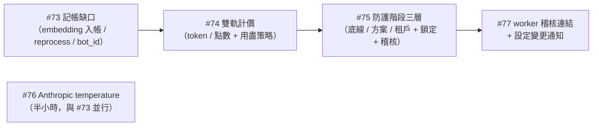

# 計畫：記帳缺口 → 雙軌計價 → 防護三層 → Anthropic temperature → worker 稽核與通知（#73–#77）

> 2026-09-07 Larry 指示「依序從 #73 開發到 #77，先做完整 plan」。本文件是五個 Issue 的統一規劃書：
> 資料模型、DDD 落點、migration、BDD scenario、通路覆蓋、測試、風險、待決。每個 Issue 獨立交付、獨立驗證。

## 0. 順序與依賴

- #73 先做：點數制依賴每條路徑都入帳，否則點數少扣。
- #76 極小、無依賴，與 #73 同一批 commit 前後做完。
- #75 依賴 #74 的「方案層」概念與 #71 的租戶變更紀錄；#77 依賴 #75 的稽核寫入形式（parent 連結）。
- 全部在分支 `fix/auth-surface-hardening-p1` 之上（或新分支 `feature/billing-guard-2026-09`，見待決 Q1）。

## 1. #73 記帳缺口（bug）

### 1.1 根因與範圍
盤點（2026-09-07）：embedding 的記帳程式碼存在但永遠不寫，因為 `CachedEmbeddingService` / `DynamicEmbeddingServiceProxy` 不轉發 `last_total_tokens`；文件重處理整條管線無記帳；查詢 embedding 無記帳；輔助 LLM 無 bot_id。

### 1.2 設計
- **Domain（`domain/rag/services.py`）**：`EmbeddingService` 介面新增回傳用量的方法，不再靠 `last_*` 屬性：
  - `embed_texts_with_usage(texts) -> EmbeddingResult(vectors, model, total_tokens)`、`embed_query_with_usage(text) -> EmbeddingResult`
  - 既有 `embed_texts` / `embed_query` 保留（呼叫 with_usage 再丟掉用量），舊呼叫端零修改。
- **Infrastructure**：`OpenAIEmbeddingService` 實作 with_usage；`CachedEmbeddingService`（快取命中回 total_tokens=0、cache_hit=True）與 `DynamicEmbeddingServiceProxy` 透傳；`FakeEmbeddingService` 回固定 token 數。
- **Application**：新增 `application/usage/embedding_accounting.py`：`account_embedding(record_usage, tenant_id, result, category, bot_id, kb_id)`（fail-open），供以下呼叫端共用：
  - `process_document_use_case`（ingest）與 `reprocess_document_use_case`（OCR / contextual / embedding 三處對齊 process_document，抽 `_record_pipeline_usage` 共用 helper 放 `application/knowledge/_pipeline_accounting.py`）
  - `query_rag_use_case.retrieve`（新類別 `query_embedding`，帶 bot_id：`QueryRAGCommand` 加 `bot_id`，`send_message` / LINE / `unified_search` / Playground 傳入）
  - `test_retrieval_use_case`、`admin_conv_summary_router`、`search_conversations_use_case`、`llm_summary_service` → `generate_summary_use_case`
  - `reembed_chunk_use_case`：改用實際 usage
- **UsageCategory**：新增 `query_embedding`、`dm_metadata`；移除無生產者的 `rag`、`guard`（先標 deprecated，`_VALID_CATEGORIES` 保留讀取相容、拒絕新寫入）；六處字串字面值改 enum。
- **bot_id 歸屬**：`query_rag_use_case:297` rerank、`_aux_llm_accounting`（rewrite / hyde）、`summary_recent_strategy`、`extract_memory_use_case` 帶 bot_id（呼叫鏈已有 bot_cfg，補參數即可）。
- **RAGEvaluationUseCase**：無呼叫者 → 從 container 拆線並刪除（Larry 09-03 已決定線上評估下線；若要保留，補記帳 + trace，見待決 Q2）。
- **reasoning_tokens**：不在本 Issue 加欄位，併 #74 的 usage_records 改表。

### 1.3 Migration
無（`query_embedding` / `dm_metadata` 是 `request_type` 字串值，欄位 String(20) 足夠）。commit 標 `[no-migration]`。

### 1.4 BDD（`tests/features/unit/usage/usage_accounting_coverage.feature`）
Scenario Outline「花了 token 就必有一筆 usage」逐路徑：文件處理 embedding、重處理 OCR / contextual / embedding、查詢 embedding（web / LINE / search / Playground 四個 Examples）、快取命中不入帳、reembed 用實際 token、DM 中繼資料用 dm_metadata、輔助 LLM 帶 bot_id、字串字面值一律 enum（靜態檢查 scenario：掃 `record_usage.execute(` 呼叫的 request_type 必為 `UsageCategory.`）。

### 1.5 通路覆蓋聲明
查詢 embedding 記帳在 `query_rag_use_case` 單點，web / widget / LINE / search / Playground 全覆蓋。

### 1.6 驗收
- 上傳一份文件 → usage 有 ocr（若 OCR）/ contextual_retrieval / embedding 三筆；重處理同樣三筆
- 每輪對話 → `query_embedding` 一筆帶 bot_id；快取命中 0 筆
- 每個 UsageCategory 都有生產者，測試守門

## 2. #76 Anthropic temperature（bug，與 #73 同批）

- `infrastructure/llm/reasoning_effort.py` 改名為 `anthropic_params.py` 或同檔加 `sampling_params_allowed(model) -> bool`：Opus 4.7 / 4.8 / Opus 5 / Fable 5 系列 → False；Sonnet 5 → 只允許預設值（不帶）；4.6 / 4.5 / 4.x → True。來源：claude-api skill `shared/error-codes.md` §temperature、`shared/model-migration.md`。
- 套用三處：`anthropic_llm_service._build_body`、`get_chat_model`、`react_agent_service._create_chat_model`（ChatAnthropic 不傳 temperature）；丟棄時記 `llm.temperature.dropped`。
- 測試：`tests/unit/infrastructure/llm/test_anthropic_sampling_params.py`（表驅動）；`docs/configuration.md` 對應表加一列。`[no-migration]`。

## 3. #74 雙軌計價 + 額度用盡策略（enhancement）

### 3.1 定案（Larry 09-07）
- 預設 token 制；每個方案可開點數制：月費、每月基本點數、類別倍率（對話 1.0、精靈 0 …）。
- token 永遠是事實來源；點數是換算層，寫入當下算。
- **額度用盡策略獨立於計價模式**：自動展延 / 用完即擋，方案設預設並決定租戶能否自改；任何切換寫稽核。
- 自動展延要有月上限；用完即擋要有共用預檢；可選寬限百分比（預設 0）。

### 3.2 資料模型
| 表 | 變更 |
|---|---|
| `plans` | `billing_mode` VARCHAR(10) DEFAULT 'token'；`monthly_price` NUMERIC(12,2) DEFAULT 0（既有 base_price 語意重疊 → 沿用 `base_price`，不加新欄，見待決 Q3）；`monthly_points` INT DEFAULT 0；`addon_pack_points` INT DEFAULT 0；`default_category_multiplier` NUMERIC(6,3) DEFAULT 1；`exhaustion_policy` VARCHAR(12) DEFAULT 'auto_topup'（auto_topup / block）；`tenant_may_change_policy` BOOL DEFAULT FALSE；`auto_topup_monthly_cap` INT DEFAULT 0（0 = 不限）；`grace_percent` NUMERIC(5,2) DEFAULT 0 |
| `plan_category_multipliers`（新） | `plan_id`, `usage_category`, `multiplier`，PK(plan_id, usage_category) |
| `model_pricing` | `points_per_1k_input` NUMERIC(10,4) NULL、`points_per_1k_output` NUMERIC(10,4) NULL |
| `platform_settings`（既有全域單列設定，若無則新表 `billing_settings` 單列） | `usd_per_point` NUMERIC(12,6) DEFAULT 0.001（1 點 = 0.001 USD，待決 Q4） |
| `tenants` | `exhaustion_policy_override` VARCHAR(12) NULL（NULL = 沿用方案） |
| `token_usage_records` | `points` INT DEFAULT 0、`reasoning_tokens` INT DEFAULT 0 |
| `token_ledger_topups` | `amount_points` INT DEFAULT 0（點數制加購） |

Migration 四支（plans、plan_category_multipliers + model_pricing、tenants、usage_records + topups），每支獨立五步，兩環境授權。

### 3.3 Domain
- `domain/plan/entity.py`：Plan 擴充；`BillingMode`、`ExhaustionPolicy` 常數；`PlanCategoryMultiplier` VO。
- `domain/billing/points.py`（新，純函式）：`points_for(usage, plan, multipliers, model_points, usd_per_point) -> int`：優先模型點數表，否則 `ceil(cost_usd / usd_per_point)`，再乘倍率後**無條件進位**；倍率 0 → 0 點。
- `domain/billing/exhaustion.py`：`ExhaustionDecision(allowed, reason, policy, remaining, grace_applied)`；`decide(policy, remaining, grace_percent, base_total)`。
- `domain/usage/entity.py`：UsageRecord 加 `points`、`reasoning_tokens`。

### 3.4 Application
- `RecordUsageUseCase`：算 points（讀租戶方案，快取 60 秒）；auto-topup 分支改讀 `exhaustion_policy`（block 時不 topup），topup 受月上限。
- `ComputeTenantQuotaUseCase`：點數制回 `points_total / points_used / points_remaining`；token 制維持；`TenantQuotaSnapshot` 加 `billing_mode`、`exhaustion_policy`、`effective_policy`。
- **新 `application/billing/quota_preflight.py`：`QuotaPreflightService.check(tenant_id, category) -> ExhaustionDecision`**，Redis 快取 30 秒（key `quota:pre:{tenant}`），fail-open（查不到放行 + warning）。呼叫點：`send_message_use_case`（execute 與 stream 最前面，與 abuse gate 相鄰）、`handle_webhook_use_case`、`process_document` / `reprocess` / 精靈 worker 任務進入點、`eval_dataset` / `prompt_gate` 跑批進入點（後兩者已有預算檢查，補策略判斷）。被擋：web / widget 回 402 `{"detail":"quota_exhausted"}` + 固定文案（可設定 `plans.block_message` / 租戶覆寫，見待決 Q5）、LINE 固定文字、背景任務狀態 `quota_exhausted`。
- `UpdatePlanUseCase` / `UpdateTenantBillingUseCase`：寫稽核（entity_type plan / tenant_billing）；租戶切換策略需方案允許。
- `/estimate` 與用量統計：依方案回 token 或點數；系統管理員兩者都回。
- 通知：被擋時發「已停止服務」（走既有 quota alerts dispatcher）；80 / 100% 沿用，點數制以點數計。

### 3.5 Interfaces / 前端
- Admin API：plans CRUD 擴充、multipliers CRUD、billing settings（匯率）、model_pricing 點數欄位；tenant billing（策略覆寫）。
- 租戶 API：quota snapshot 加 billing_mode / policy；`PUT /tenants/me/billing-policy`（方案允許時）。
- 前端：`/admin/plans` 加計價模式 / 點數 / 倍率表 / 用盡策略 / 上限 / 寬限；`/admin/pricing` 加點數欄位；`/quota` 租戶頁依模式顯示、策略切換（允許時）；系統管理員租戶頁可覆寫策略。

### 3.6 BDD（`tests/features/unit/billing/points_billing.feature`、`quota_exhaustion_policy.feature`）
points：換算優先序、進位、倍率 0、切換方案不重算歷史、token 制 points=0。
exhaustion：auto_topup 正常加購、月上限到達後轉擋、block 三通路固定文案（Scenario Outline web / widget / LINE）、背景任務不啟動、寬限內放行、租戶不可改時 403、可改時寫稽核、預檢快取與 fail-open。

### 3.7 通路覆蓋聲明
預檢在 `QuotaPreflightService` 單點；web / widget / LINE 三通路 + 背景任務全覆蓋；文案由通路轉接器呈現。

### 3.8 風險
- 預檢多一次配額查詢：Redis 快取 30 秒 + 寫入後失效；POC 無 Redis 時退回直接查（fail-open）。
- 既有租戶：`billing_mode` 預設 token、`exhaustion_policy` 預設 auto_topup → 行為不變。

## 4. #75 防護階段三層設定（enhancement）

### 4.1 定案（Larry 09-07）
系統層管底線與預設，方案層給預設，租戶層只能加嚴；系統管理員可鎖定租戶；不論誰改都稽核，系統管理員對租戶的變更該租戶看得到（操作者「平台」）。

### 4.2 階段清單（`domain/security/guard_stages.py`）
| stage | 現況位置 | 成本 |
|---|---|---|
| `regex_input` | `PromptGuardService.check_input` | 0 |
| `classifier_attack` | 分類器三合一的 is_attack；kb 模式改為不帶 worker 呼叫 `classify_sanitize` | 1 次小模型 |
| `output_guard` | `PromptGuardService.check_output` | 0 |
| `abuse_scoring` | P7 record / evaluate | 0（Redis） |
| 預留 `local_classifier`（地端小模型） | 未實作 | — |

### 4.3 資料模型
`guard_settings`（新表，仿 `abuse_settings`）：`id, scope_kind(platform/profile/tenant), scope_id, overrides JSON, updated_by, updated_at`，overrides 鍵：`stages`（啟用清單）、`required_stages`（僅 platform 可設）、`locked`（僅 tenant scope，由 system_admin 寫）、`profile`（tenant 指定方案）。bots 加 `guard_stages` JSON NULL（NULL = 繼承租戶有效值；只能是有效值的超集）。Migration 一支。

### 4.4 Domain / Application
- `resolve_guard_stages(platform, profile, tenant, bot) -> EffectiveGuard(stages, required, locked, source_map)`：`required ⊆ 結果`；租戶 / bot 只能加不能減；locked 時忽略租戶與 bot 覆寫。
- `CachedGuardSettingsProvider`（60 秒快取，仿 `CachedAbusePolicyProvider`）。
- 管線：`send_message` 與 LINE 在進入點取 `EffectiveGuard`，各段以 `if "regex_input" in guard.stages` 決定跑不跑；kb 模式 `classifier_attack` 開時呼叫 `classify_sanitize(routes=[])`。三通路同一份。
- 稽核：`UpdateGuardSettingsUseCase` 每次寫 audit（entity_type `guard_settings`，entity_id = scope，`tenant_id` = 目標租戶或 None；actor 為 system_admin 且 scope=tenant 時，`source="platform"`）。租戶變更紀錄（#71 端點擴充）納入 entity_type ∈ {bot, guard_settings(tenant scope)}。
- 兩份 use case 只有鍵名不同 → 把 abuse_settings 的 resolve / cache / update 抽成泛型 `layered_settings` 模組（domain/settings/layered.py），abuse 與 guard 各自提供鍵表與驗證；避免複製 400 行。

### 4.5 Interfaces / 前端
- `/api/v1/admin/guard/*`（system_admin 寫）；`/api/v1/guard/effective?bot_id=`（租戶讀）；bot PUT 接受 `guard_stages`。
- 前端：`/admin/guard-control`（系統底線 / 方案 / 租戶 + 鎖定；版型複用 abuse-control 四分頁）；bot 設定「防護階段」勾選（底線項目灰化不可關、鎖定時唯讀、顯示來源）。

### 4.6 BDD（`tests/features/unit/security/guard_stages.feature`）
底線不可關、租戶只能加嚴、bot 超集規則、鎖定唯讀、系統對租戶的變更寫稽核且租戶可見、kb 模式攻擊判定開 / 關兩種行為（web + LINE Outline）、快取失效、DB 失效退回底線 + 全開（fail-safe，防護寧多勿少）。

### 4.7 通路覆蓋聲明
有效階段在共用 provider 單點解析；web / widget / LINE 全覆蓋；驗收「三通路行為一致」。

## 5. #77 worker 稽核連結 + 設定變更通知（enhancement）

- `audit_logs` 加 `parent_entity_type VARCHAR(40) NULL`、`parent_entity_id VARCHAR(100) NULL`（migration 一支）；`worker_use_cases` 寫入帶 `tenant_id`（bot.tenant_id）與 parent=bot。
- `ListBotAuditLogsUseCase`：查 entity=bot ∪ parent=bot；worker 欄位對照表（前端 `worker-field-labels.ts`）。
- 通知：`notification_channels.notify_config_change BOOL`（migration 併上支）；`tenant_settings`（或 tenants JSON 欄位）`config_change_notify_fields`；`DispatchConfigChangeNotificationUseCase` 訂閱 audit 寫入（在 AuditRecorder 後以 outbox / 直接 dispatch，fail-open）；系統管理員對租戶的變更也通知。
- 前端：變更紀錄顯示 worker 名稱與「平台」操作者；通知渠道頁開關與欄位勾選。
- BDD：`bot_audit_visibility.feature` 擴充（worker 列、平台操作者）、`config_change_notification.feature`。

## 6. 測試策略總表
| Issue | Unit（BDD） | Integration | 前端 |
|---|---|---|---|
| #73 | usage_accounting_coverage（≈12） + 靜態 enum 守門 | 可選：真 DB 跑一份文件處理看三筆 usage | 無 |
| #76 | 表驅動 sampling params（≈8） | 無 | 無 |
| #74 | points_billing（≈10）、quota_exhaustion_policy（≈12） | 預檢快取（Redis 可 mock） | plans / pricing / quota 頁測試 |
| #75 | guard_stages（≈12） | 無 | guard-control 頁 + bot 勾選測試 |
| #77 | bot_audit_visibility 擴充（≈4）、config_change_notification（≈5） | 無 | 變更紀錄 / 通知渠道測試 |

## 7. Migration 總表（每支獨立五步、兩環境授權）
1. #74 `add_plans_billing_mode.sql`（plans 8 欄）
2. #74 `add_plan_category_multipliers_and_model_points.sql`
3. #74 `add_tenants_exhaustion_policy.sql`
4. #74 `add_usage_points_reasoning_tokens.sql`（usage_records 2 欄 + topups 1 欄）
5. #75 `add_guard_settings.sql`（新表 + bots.guard_stages）
6. #77 `add_audit_parent_entity.sql`（audit_logs 2 欄 + notification_channels.notify_config_change）

## 8. 待決（請 Larry 拍板，預設值已標）
- **Q1 分支**：繼續疊在 `fix/auth-surface-hardening-p1`（預設，之後一次 FF main）或開 `feature/billing-guard-2026-09`。
- **Q2 RAGEvaluationUseCase**：拆掉（預設，09-03 已決定線上評估下線）或補記帳保留。
- **Q3 月費欄位**：沿用 `plans.base_price`（預設）或另加 `monthly_price`。
- **Q4 點數匯率預設**：1 點 = 0.001 USD（預設；500 點 ≈ 0.5 USD 太小，僅為預設值，實際由你在後台設）。
- **Q5 被擋文案**：方案層預設 + 租戶可覆寫（預設）或只有平台一份。
- **Q6 寬限百分比預設 0**、**自動展延月上限預設 0（不限）**。
- **Q7 防護底線預設**：`regex_input` + `output_guard` + `abuse_scoring` 必開（預設），`classifier_attack` 平台預設開、展覽租戶關。

## 9. 六階段合規清單
- [x] Stage 0：Issue #73–#77 已建（2026-09-07）
- [x] Stage 1：本文件定 DDD 落點、資料模型、通路覆蓋聲明
- [ ] Stage 2：每個 Issue 先寫 `.feature`（§1.4 / §3.6 / §4.6 / §5）
- [ ] Stage 3：紅燈測試（AsyncMock repo，無真 DB）
- [ ] Stage 4：Domain → Application → Infrastructure → Interfaces；前端 Type → Hook → Component → Page
- [ ] Stage 5：`make test` / `make lint`、覆蓋率、commit `Refs #N`、架構筆記、todolist、Issue comment / close
- [ ] Migration：六支各走五步、兩環境授權、`_applied_migrations` 紀錄、schema.sql 同步
