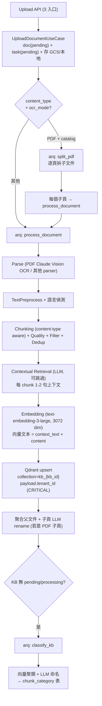

---
paths:
  - "apps/backend/src/domain/rag/**"
  - "apps/backend/src/domain/knowledge/**"
  - "apps/backend/src/infrastructure/rag/**"
  - "apps/backend/src/infrastructure/qdrant/**"
  - "apps/backend/src/infrastructure/embedding/**"
  - "apps/backend/src/infrastructure/file_parser/**"
  - "apps/backend/src/infrastructure/text_splitter/**"
  - "apps/backend/src/infrastructure/llm/llm_chunk_context_service.py"
  - "apps/backend/src/application/rag/**"
  - "apps/backend/src/application/knowledge/**"
  - "apps/backend/src/worker.py"
---

# RAG Pipeline 開發規範

## RAG 架構概覽

### Ingestion（文件上傳 → 向量化）



### Query（使用者提問 → 回答）


## 核心原則

### 租戶隔離（CRITICAL）

- **所有向量搜尋必須包含 `tenant_id` 過濾條件**
- Qdrant collection 命名 `kb_{kb_id}` (per-KB，**非** per-tenant)，payload filter **必須**帶 `tenant_id`
- 知識庫 CRUD 操作必須驗證 `tenant_id` 歸屬
- 測試必須驗證跨租戶查詢返回空結果
- 任何新增的 search 入口必須 code review 檢查是否加 `tenant_id` filter

### Prompt 安全

- 使用者輸入不得直接拼入 System Prompt
- 檢索結果注入前必須 sanitize
- System Prompt 與使用者訊息使用 message role 明確分隔

### Embedding 策略

- **使用 `text-embedding-3-large` (3072 維)** — 2026-04 升級，語義精度 +35%
- Embedding API key 透過環境變數管理，不得硬編碼
- 批次處理：自動 batch，需設合理 rate limit
- 維度變更時 Qdrant/Milvus 會自建新 collection（舊的不動）
- 向量文本組裝：若有 `context_text` 則 `"{context_text}\n\n{content}"`，否則純 `content`

## 三條上傳入口

`apps/backend/src/interfaces/api/document_router.py`

| 入口 | 路徑 | 用途 |
|------|------|------|
| Form-data 上傳 | `POST /knowledge-bases/{kb_id}/documents` | ≤100 MB 直接上傳 |
| Signed URL | `POST /request-upload` | 回傳 GCS signed URL，繞過 Cloud Run 32 MB 限制 |
| Confirm | `POST /confirm-upload` | 前端直傳 GCS 完成後通知後端 |

共通：同步建 `Document(pending)` + `ProcessingTask(pending)` → 存檔 → `enqueue()` → **立即回 `{document, task_id}`**（不阻塞）

## arq Worker（5 個 Jobs）

`apps/backend/src/worker.py`

| Job 名稱 | 觸發時機 | 處理內容 |
|---------|---------|---------|
| `process_document` | 所有非 PDF-catalog 文件 + PDF 拆頁後的每個子頁 | 完整 7 步 pipeline |
| `split_pdf` | PDF + `kb.ocr_mode == "catalog"` | 逐頁拆成子文件，再各自 enqueue `process_document` |
| `classify_kb` | KB 內無 pending/processing 文件時自動 enqueue | 向量聚類 + LLM 命名 → 寫 `chunk_category` |
| `extract_memory` | 對話結束 | 抽取對話記憶 |
| `run_evaluation` | 評估執行請求 | Prompt optimizer 評估 |

**Worker session 管理紅線**（見 python-standards.md）：

- `worker.py` 每個 task 呼叫 `_new_container()` 建立全新 DI → 避免舊 session
- 長執行（OCR / LLM）前**主動 close session**，結束後重開（避免佔用連線池）
- 背景任務禁止使用 `Depends` 注入的 use case，必須在 callback 內從 Container 重新解析

## Pipeline 7 步（`process_document_use_case.py`）

### 1. Parse
- PDF → `parse_pdf_async()` 逐頁 Claude Vision OCR
- 圖片 → `_ocr.ocr_page()`
- 其他 → `parse()` (同步 → async thread)

### 2. TextPreprocess + 語言偵測
- TextPreprocessor 標準化 + 移除樣板
- 記錄語言

### 3. Chunking + Quality + Filter + Dedup
- `TextSplitterService.split()` 根據 `content_type` 選策略（Recursive / CSV-row / JSON-record）
- ChunkQualityService 計算 quality_score
- ChunkFilterService 濾掉低品質
- ChunkDeduplicationService 去重

### 4. Contextual Retrieval（可選，有 model 才跑）

**模型解析優先級**：
```
KB.context_model  →  tenant.default_context_model  →  跳過（靜默）
```

- `LLMChunkContextService.generate_contexts()` — 並發 5，每 chunk `max_tokens=200`
- Prompt 產生 1-2 句中文描述「片段在文件中的位置與上下文」
- 輸出存 chunk 的 `context_text`
- 成本：Haiku + cache ≈ $0.10 / 500 chunks

### 5. Embedding
- `text-embedding-3-large` (3072 維)
- 向量文本 = `context_text + content`（若有）或純 `content`
- 記錄 token usage

### 6. Qdrant Upsert
- Collection: `kb_{kb_id}`
- Payload 必帶欄位：`tenant_id`, `document_id`, `content`, `chunk_index`, `content_type`, `language`
- 冪等：相同 chunk id 覆蓋

### 7. 後處理（視情況）
- **子頁聚合**（若是 PDF 拆頁）：更新父 document 的 `chunk_count`、`quality_score`、status
- **子頁 LLM rename**：用 `context_model` 為每頁生成「第 N 頁 — 主題」標題
- **觸發 Auto-Classification**：若 KB 已無 pending/processing → `enqueue("classify_kb", kb_id, tenant_id)`

## Auto-Classification（`classify_kb_task`）

**模型解析優先級**：
```
KB.classification_model  →  tenant.default_classification_model  →  跳過（靜默）
```

流程：
1. 從 Qdrant 讀 KB 所有 chunk 向量
2. 聚類（K-means 或相似度）
3. LLM 為每群生成中文分類名
4. 寫 `chunk_category` 表 + chunk ↔ category 對應

**隱憂**：無鎖，多個文件同時完成可能重複 enqueue（無害但浪費 token）→ 未來考慮 Redis SETNX 去重

## Document / ProcessingTask 狀態機

| 時刻 | Document.status | ProcessingTask.status | progress |
|------|----------------|----------------------|----------|
| Upload 回 200 | `pending` | `pending` | 0% |
| Worker 起 | `processing` | `processing` | → |
| OCR 完 | — | — | 70% |
| Chunking 完 | — | — | 75% |
| Contextual 完 | — | — | 80% |
| Embedding + Qdrant 完 | **`processed`** | **`completed`** | **100%** |
| 任一步噴 | **`failed`** | **`failed`** (含 error_message) | — |

子文件（PDF 子頁）全部完成 → 父 document.status = `processed`；任一子頁 failed → 父 = `failed`

## DDD 分層

| 概念 | 層級 | 路徑 |
|------|------|------|
| Document Entity | Domain | `domain/knowledge/entity.py` |
| Chunk Value Object | Domain | `domain/knowledge/value_objects.py` |
| KnowledgeRepository Interface | Domain | `domain/knowledge/repository.py` |
| VectorSearchService Interface | Domain | `domain/rag/services.py` |
| UploadDocumentUseCase | Application | `application/knowledge/upload_document_use_case.py` |
| ProcessDocumentUseCase | Application | `application/knowledge/process_document_use_case.py` |
| ClassifyKbUseCase | Application | `application/knowledge/classify_kb_use_case.py` |
| QueryRAGUseCase | Application | `application/rag/query.py` |
| QdrantVectorRepo | Infrastructure | `infrastructure/qdrant/repository.py` |
| EmbeddingService | Infrastructure | `infrastructure/embedding/service.py` |
| LLMChunkContextService | Infrastructure | `infrastructure/llm/llm_chunk_context_service.py` |
| arq Worker | Infrastructure | `worker.py` |

## RAG BDD 場景模板

### 文件上傳場景

```gherkin
Feature: 知識庫文件上傳 (Knowledge Document Upload)
    身為租戶管理員
    我想要上傳文件到知識庫
    以便 AI 客服能夠參考這些文件回答問題

    Scenario: 成功上傳 PDF 文件（catalog 模式拆頁）
        Given 租戶 "T001" 已建立知識庫，ocr_mode="catalog"
        When 我上傳 PDF 文件 "4月DM.pdf"
        Then 應建立父文件狀態 "pending"
        And 應 enqueue "split_pdf" job
        And 每頁應拆成獨立子文件
        And 每個 chunk 應包含 tenant_id "T001"

    Scenario: Contextual Retrieval 在 KB 有 context_model 時啟用
        Given 租戶 "T001" 的知識庫 context_model 已設定
        When 我上傳 "退貨政策.pdf"
        Then 每個 chunk 應包含 context_text
        And embed 文本應為 context_text + content 組合

    Scenario: Auto-Classification 在 KB 處理完成後自動觸發
        Given 租戶 "T001" 的知識庫 classification_model 已設定
        When 最後一個 document 處理完成
        Then 應 enqueue "classify_kb" job
        And chunk_category 表應新增分類紀錄

    Scenario: 上傳不支援的檔案格式
        Given 租戶 "T001" 已建立知識庫
        When 我上傳檔案 "image.exe"
        Then 應回傳格式不支援的錯誤
```

### 向量搜尋場景

```gherkin
Feature: RAG 查詢 (RAG Query)
    Scenario: 租戶隔離驗證
        Given 租戶 "T001" 的知識庫中有退貨政策文件
        And 租戶 "T002" 的知識庫中有物流政策文件
        When 以租戶 "T001" 身份查詢 "物流政策"
        Then 不應回傳租戶 "T002" 的文件

    Scenario: 查詢無結果時的友善回應
        Given 租戶 "T001" 的知識庫為空
        When 客戶查詢 "任何問題"
        Then 應回傳友善的預設回應
```

## Embedding 測試策略

### Unit Test：Mock Embedding API（固定 3072 維）
```python
mock_embedding = AsyncMock()
mock_embedding.embed_query = AsyncMock(return_value=[0.1] * 3072)
mock_embedding.embed_documents = AsyncMock(return_value=[[0.1] * 3072, [0.2] * 3072])
```

### Integration Test：固定向量或 Mock Server
- 使用預先計算好的固定向量進行搜尋測試
- 或使用 Mock Embedding Server 回傳確定性結果

## Qdrant 測試策略

### Unit Test：完全 Mock
```python
mock_qdrant = AsyncMock()
mock_qdrant.search = AsyncMock(return_value=[
    SimpleNamespace(id="1", score=0.95, payload={"content": "退貨政策", "tenant_id": "T001"}),
])
```

### Integration Test：Docker Qdrant
- 使用 Docker Compose 中的 Qdrant 實例
- 每個測試前清空 collection
- 使用 testcontainer（可選）

## LangGraph 測試策略

### Unit Test：Mock 節點
- 每個 Tool 獨立測試（Mock LLM 回應）
- Graph 編排邏輯獨立測試（Mock Tool 結果）

### Integration Test：真實 Graph
- 使用 Mock LLM（固定回應）+ 真實 Tool + 真實 DB
- 驗證 Graph 的節點轉換和狀態管理

## 已知隱憂（Code Review 必查）

| # | 項目 | 風險 | 建議 |
|---|------|------|------|
| 1 | Qdrant collection 非 per-tenant | 搜尋漏 `tenant_id` filter 會跨租戶洩漏 | 所有 search 入口必須 test tenant isolation |
| 2 | Contextual/Classification 無 model 時靜默跳過 | 使用者無感 | Log warning，UI 呈現「未啟用」狀態 |
| 3 | Session 手動 close/reopen 無 context manager | 重開失敗 silent except | 評估改為 async session factory |
| 4 | `split_pdf` vs `process_document` 分叉靠 `ocr_mode` | 設定錯會整份 OCR 而非逐頁 | 單測兩條路都有覆蓋 |
| 5 | Auto-Classification 無鎖 | 多文件同時完成可能重複 enqueue | Redis SETNX 或 DB 鎖 |
| 6 | Embedding 無顯式 retry | >10K chunks 可能觸 429 | 檢查 EmbeddingService 是否內建 limiter |
| 7 | 子頁 LLM rename 失敗 silent pass | 使用者看不到「第 3 頁」而非重命名標題 | Log warning |
