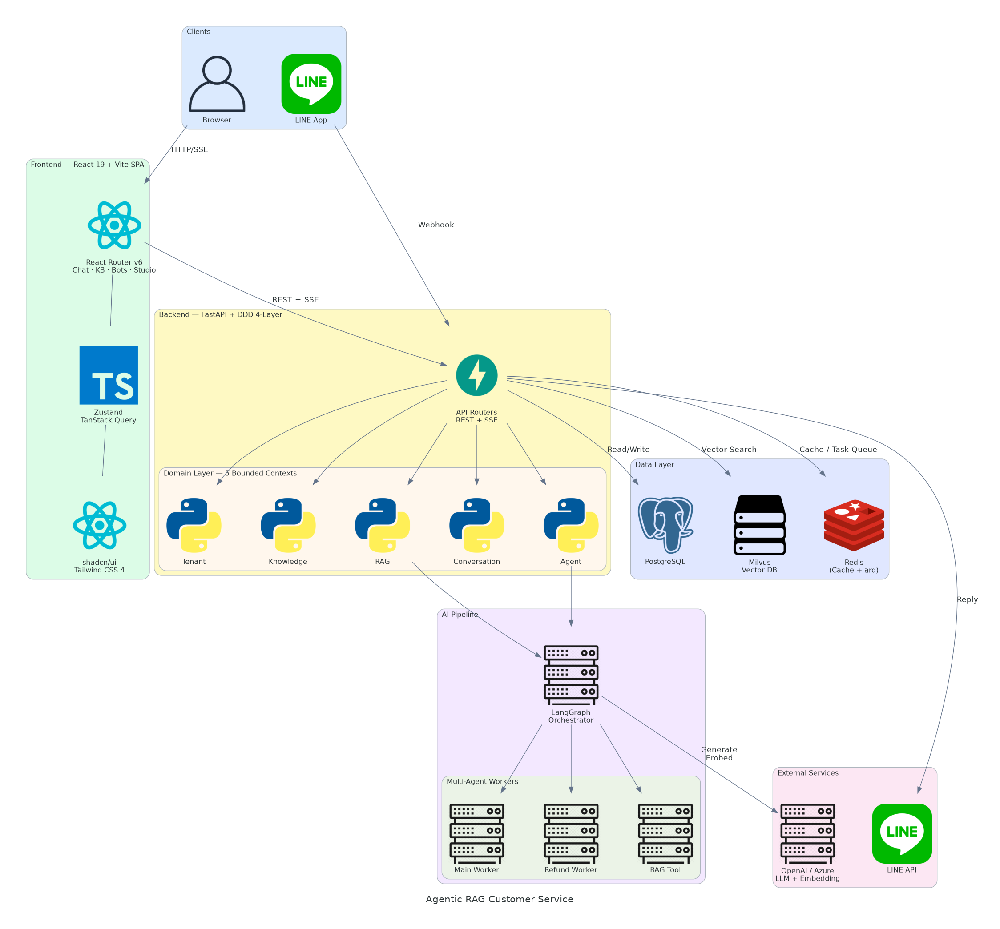

<div align="center">

# Agentic RAG Customer Service

<p><strong>AI 驅動的 RAG 多租戶電商客服平台 — 結合檢索增強生成與多代理編排</strong></p>

[](https://www.python.org/)
[](https://fastapi.tiangolo.com/)
[](https://nextjs.org/)
[](https://www.typescriptlang.org/)
[](https://langchain-ai.github.io/langgraph/)
[](https://qdrant.tech/)

</div>

---

## 目錄

- [功能特色](#-功能特色)
- [系統架構](#-系統架構)
- [技術堆疊](#-技術堆疊)
- [環境需求](#-環境需求)
- [快速開始](#-快速開始)
- [指令一覽](#-指令一覽)
- [專案結構](#-專案結構)
- [測試策略](#-測試策略)
  - [E2E 測試執行與影片錄製](#e2e-測試執行與影片錄製)
- [文件](#-文件)
- [授權](#-授權)

---

## ✨ 功能特色

| 功能 | 說明 |
|------|------|
| **多租戶架構** | 租戶級資料隔離，每個租戶擁有獨立的知識庫與機器人 |
| **知識庫管理** | 上傳文件、自動分塊（chunking）、向量嵌入（embedding） |
| **RAG Pipeline** | 檢索增強生成，回答附帶引用來源（source citation） |
| **AI Agent 編排** | LangGraph 多步驟代理，支援 Tool Calling |
| **串流對話** | SSE 即時串流 + 對話歷史側欄 |
| **機器人管理** | 自訂 System Prompt、LLM 參數（temperature、max_tokens 等） |
| **LINE 整合** | Webhook 接入 LINE Bot 頻道 |
| **管理後台** | Next.js Dashboard：租戶、知識庫、機器人、對話一站管理 |

---

## 🏗 系統架構

<div align="center">
  <a href="docs/images/architecture_diagrams.png">
    
  </a>
  <p><sub>點擊圖片可放大檢視</sub></p>
</div>

> **DDD 4-Layer**：Domain → Application → Infrastructure → Interfaces
> 5 個限界上下文：Tenant / Knowledge / RAG / Conversation / Agent

---

## 📦 技術堆疊

<table>
  <tr>
    <th align="left">Frontend</th>
    <td>
      
      
      
      
      
      
    </td>
  </tr>
  <tr>
    <th align="left">Backend</th>
    <td>
      
      
      
      
    </td>
  </tr>
  <tr>
    <th align="left">AI / RAG</th>
    <td>
      
      
      
    </td>
  </tr>
  <tr>
    <th align="left">Database</th>
    <td>
      
      
      
    </td>
  </tr>
  <tr>
    <th align="left">Testing</th>
    <td>
      
      
      
      
      
    </td>
  </tr>
  <tr>
    <th align="left">DevOps</th>
    <td>
      
      
    </td>
  </tr>
</table>

---

## 📋 環境需求

| 工具 | 版本 | 用途 |
|------|------|------|
| Docker & Docker Compose | latest | MySQL、Qdrant、Redis 容器 |
| Python | 3.12+ | 後端執行環境 |
| uv | latest | Python 套件管理 |
| Node.js | 20+ | 前端執行環境 |
| Make | any | 統一指令入口 |

---

## 🚀 快速開始

```bash
# 1. Clone 專案
git clone https://github.com/larry610881/agentic-rag-customer-service.git
cd agentic-rag-customer-service

# 2. 啟動基礎設施 (MySQL, Qdrant, Redis)
make dev-up

# 3. 設定環境變數
cp apps/backend/.env.example apps/backend/.env
cp apps/frontend/.env.example apps/frontend/.env.local
# 編輯 .env 填入 API Key (OpenAI 等)

# 4. 安裝依賴
make install

# 5. 初始化資料庫
make seed-data

# 6. 啟動開發伺服器
cd apps/backend && uv run uvicorn src.main:app --reload --port 8000 &
cd apps/frontend && npm run dev &
```

| 服務 | 網址 |
|------|------|
| Frontend | http://localhost:3000 |
| Backend API Docs | http://localhost:8000/docs |

---

## 🛠 指令一覽

| 指令 | 說明 |
|------|------|
| `make dev-up` | 啟動 Docker Compose 服務 |
| `make dev-down` | 停止 Docker Compose 服務 |
| `make install` | 安裝後端 + 前端依賴 |
| `make test` | 執行全部測試（後端 + 前端） |
| `make test-backend` | 執行後端 pytest 測試 |
| `make test-frontend` | 執行前端 Vitest 測試 |
| `make lint` | 全量 Lint（ruff + mypy + ESLint + tsc） |
| `make seed-data` | 初始化資料庫種子資料 |
| `make seed-knowledge` | 匯入知識庫範例文件 |

---

## 📁 專案結構

```
agentic-rag-customer-service/
├── apps/
│   ├── backend/                # Python FastAPI — DDD 4-Layer
│   │   ├── src/
│   │   │   ├── domain/         # 領域層：Entity, VO, Repository Interface
│   │   │   ├── application/    # 應用層：Use Case, Command/Query
│   │   │   ├── infrastructure/ # 基礎設施：DB, Qdrant, LangGraph
│   │   │   └── interfaces/     # 介面層：FastAPI Router, CLI
│   │   └── tests/              # pytest-bdd (unit / integration / e2e)
│   └── frontend/               # Next.js 15 App Router
│       ├── src/
│       │   ├── app/            # App Router 頁面
│       │   ├── components/     # 共用元件 (shadcn/ui)
│       │   ├── features/       # 功能模組 (chat, knowledge, auth, bot)
│       │   ├── hooks/          # 共用 Hooks + TanStack Query
│       │   ├── stores/         # Zustand Stores
│       │   └── test/           # 測試基礎設施 (fixtures, MSW)
│       └── e2e/                # Playwright E2E 測試
├── infra/                      # Docker Compose 設定
├── data/                       # 種子資料、測試文件
├── docs/                       # 架構文件
├── Makefile                    # 統一指令入口
└── CLAUDE.md                   # 開發規範
```

---

## 🧪 測試策略

```
        /  E2E  \          Playwright (前端) / pytest-bdd (後端)
       / Integr. \         MSW (前端) / httpx + 真實 DB (後端)
      /   Unit    \        Vitest (前端) / pytest + AsyncMock (後端)
```

| 比例 | 覆蓋率門檻 |
|------|-----------|
| Unit 60% : Integration 30% : E2E 10% | **80%** |

### E2E 測試執行與影片錄製

#### 前置安裝

```bash
# 1. 安裝 Playwright 瀏覽器（首次使用時）
cd apps/frontend
npx playwright install --with-deps chromium

# 2. 安裝 ffmpeg（合併影片用）
# Ubuntu / Debian
sudo apt install -y ffmpeg

# macOS
brew install ffmpeg

# 無 sudo 權限（下載靜態二進位檔）
curl -L https://johnvansickle.com/ffmpeg/releases/ffmpeg-release-amd64-static.tar.xz -o /tmp/ffmpeg.tar.xz
mkdir -p ~/bin
tar -xf /tmp/ffmpeg.tar.xz -C /tmp
cp /tmp/ffmpeg-*-amd64-static/ffmpeg ~/bin/ffmpeg
chmod +x ~/bin/ffmpeg
# 確認安裝：~/bin/ffmpeg -version
```

#### 執行 E2E 測試（含影片錄製）

```bash
cd apps/frontend

# 1. 從 Feature 檔案產生 spec
npx bddgen

# 2. 執行全部 E2E 測試（影片自動錄製，設定於 playwright.config.ts video: "on"）
npx playwright test

# 僅執行 auth + journey 測試
npx playwright test --project=auth --project=journeys

# 僅執行 journey 測試
npx playwright test --project=journeys
```

影片會存放在 `apps/frontend/test-results/<測試名稱>/video.webm`。

#### 合併所有影片為單一 MP4

```bash
cd apps/frontend

# 1. 產生影片清單檔
find test-results -name "video.webm" -not -path "*retry*" | sort | \
  sed 's/^/file /' > /tmp/ffmpeg_concat.txt

# 2. 合併為 MP4
ffmpeg -y -f concat -safe 0 -i /tmp/ffmpeg_concat.txt \
  -c:v libx264 -preset fast -crf 23 -pix_fmt yuv420p \
  -movflags +faststart e2e-all-tests.mp4

# 產出：apps/frontend/e2e-all-tests.mp4
```

> **提示**：`-not -path "*retry*"` 會排除 retry 影片，僅保留每個測試的首次執行。若要包含 retry 影片，移除該條件即可。

#### 檢視測試報告

```bash
# HTML 互動式報告（含影片嵌入 + 截圖 + Trace）
npx playwright show-report

# 檢視單一失敗測試的操作軌跡
npx playwright show-trace test-results/<測試目錄>/trace.zip
```

---

## 📝 文件

| 文件 | 說明 |
|------|------|
| [`CLAUDE.md`](./CLAUDE.md) | 開發規範：DDD 架構、測試策略、Git 工作流 |
| [`DEVELOPMENT_PLAN.md`](./DEVELOPMENT_PLAN.md) | Sprint 開發計畫 (S0–S7) |
| [`SPRINT_TODOLIST.md`](./SPRINT_TODOLIST.md) | Sprint 進度追蹤 |
| [`docs/`](./docs/) | 架構設計文件 |

---

## 📄 授權

MIT License
