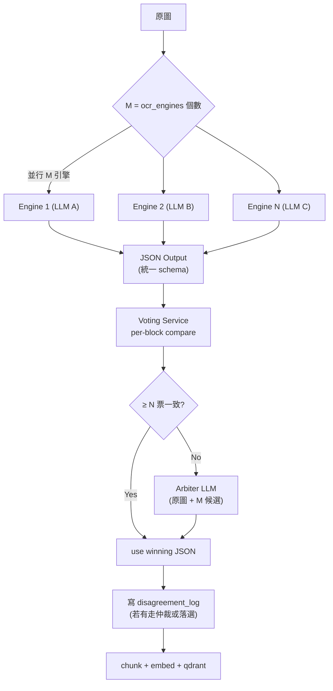
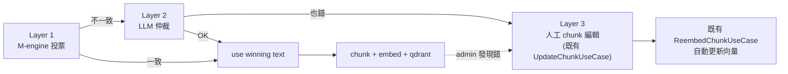

# ADR-0001: Hybrid OCR M-取-N 投票 + LLM 仲裁

**Status**: Proposed
**Date**: 2026-04-29
**Deciders**: Larry (product owner), Claude (architecture)
**Context**: 4/28 hotfix `632d6e2` 修完當下單引擎 OCR 的 trace bug 後，討論長期解決「紫檀筷 → 茶槽杯」這類**單引擎系統性誤判**的方案

---

## 1. Context

### 1.1 起因

家樂福 DM PDF（500 頁）OCR 後向量庫存錯字（紫檀筷 → 茶槽杯），單引擎（Claude Sonnet 4.6）無法察覺自己的錯誤。即使升級到更強模型也只是降低錯誤率，**無法消除盲區**。

### 1.2 核心訴求（Larry 4/28-29 對話）

1. **M-取-N 投票**：可擴充引擎數，最低 N=2（兩個一致才通過）
2. **不一致走第二輪 LLM 仲裁**（仲裁也是選 model）
3. **記錄落選引擎**：用來做 trade-off 分析，把常錯的引擎替換掉
4. **重用全系統 model registry**：引擎池跟現有「全系統開放 model」共用，不另開設定
5. **未來地端模型擴充**：PaddleOCR 等地端引擎當作 registry 中的 entry，未來 adapter 寫好就能選

### 1.3 不在範圍內

- 地端 PaddleOCR / Tesseract / EasyOCR 的 adapter（**未來擴充**）
- 自適應投票權重（基於歷史落選率動態調整）
- Per-field voting（先做 per-block，未來再 refine）
- GPU 自架 LLM（如 Qwen-VL 自架）

---

## 2. Decision

### 2.1 高層 Pipeline



### 2.2 設定模型（Per-KB）

`knowledge_bases` 表加 3 欄：

| 欄位 | 型別 | 預設 | 說明 |
|---|---|---|---|
| `ocr_engines` | `JSONB` (`list[str]`) | `[]`（沿用現況單引擎）| 模型名稱 list，從全系統 model registry 取 |
| `ocr_vote_threshold` | `INT` | `1` | N 取多數的 N，最低 1（單引擎）、推薦 2 |
| `ocr_arbiter_model` | `VARCHAR(100)` | `NULL` | NULL = 用系統 default arbiter（settings.ocr_arbiter_model） |

**M = `len(ocr_engines)`**；M=0 退化成現況舊路（讀全域 default OCR engine）；M=1 走新路但跳過投票直接出（單引擎走新 schema）；M≥2 走完整投票。

### 2.3 對齊策略：統一 JSON Schema (Option C)

所有 LLM-based OCR 引擎收**完全相同** prompt，強迫吐統一 JSON 結構。

**統一 prompt 範本**（`OCR_VOTING_PROMPT`）：

```
分析這張頁面，以下列 JSON schema 輸出（不得多輸出文字、不得省略欄位）：

{
  "page_type": "product_catalog | promotion | info | mixed",
  "page_summary": "1-2 句中文摘要",
  "blocks": [
    {
      "type": "product | promo | info",
      "name": "商品名或標題（看不清楚填'不詳'）",
      "brand": "品牌或null",
      "spec": "規格 (容量/重量) 或null",
      "price_original": "原價或null（含'元'單位）",
      "price_sale": "售價或null（含'元/瓶'等單位）",
      "promo_text": "促銷文字或null",
      "extra_text": "其他關鍵文字或null"
    }
  ]
}

規則：
- 每個獨立商品/區塊各占一個 block
- 順序按閱讀順序（左→右、上→下）
- 看不清楚的欄位填 null（不要猜）
- 直接輸出 JSON，不要 markdown ```code fence```
```

**Voting 比對演算法**：

```python
def vote(candidates: list[OcrJson], threshold: int) -> VoteResult:
    # 1. 過濾掉 JSON parse fail 的引擎
    valid = [c for c in candidates if c.parsed_ok]
    if len(valid) < threshold:
        return NeedsArbitration("not enough valid engines")
    
    # 2. block_count 一致性（允許 ±1 容差）
    block_counts = [len(c.blocks) for c in valid]
    if max(block_counts) - min(block_counts) > 1:
        return NeedsArbitration("block count mismatch")
    
    # 3. per-block per-key voting
    n_blocks = min(block_counts)
    final_blocks = []
    for i in range(n_blocks):
        block_votes = {}  # key → {value: vote_count}
        for c in valid:
            for key, val in c.blocks[i].items():
                norm_val = normalize(val)  # lowercase + strip + remove punctuation
                block_votes.setdefault(key, {}).setdefault(norm_val, []).append(c.engine)
        
        # 每個 key 取多數決，不滿 threshold → 整個 block 進仲裁
        block = {}
        block_arbitrate = False
        for key, val_engines in block_votes.items():
            winner_val, winner_engines = max(val_engines.items(), key=lambda x: len(x[1]))
            if len(winner_engines) < threshold:
                block_arbitrate = True
                break
            block[key] = (winner_val, winner_engines)
        
        if block_arbitrate:
            return NeedsArbitration(f"block {i} no majority")
        final_blocks.append(block)
    
    return VoteWin(final_blocks)
```

**正規化**（`normalize`）規則：
- `None` / `"null"` / `""` 都視為等值
- 字串去頭尾空白、半形/全形統一、移除空白
- 數字字串去逗號、小數點對齊
- 中文簡繁不轉（避免誤判）

### 2.4 仲裁觸發條件

只有以下任一情況觸發仲裁：

1. JSON parse fail 後**有效引擎 < N**
2. block_count 差距 > 1
3. 任一 block 任一 key 沒有 N 票一致

仲裁 input：
- 原圖（必要 — 沒原圖等於瞎猜）
- M 個候選 JSON（標註 engine 名稱）
- 同一 schema prompt（指示 arbiter 也吐同樣 JSON）

仲裁 prompt 模板：

```
下列 {M} 個 OCR 結果不一致，請參考原圖選最正確的答案，
也可融合不同引擎的最佳片段（例如 engine_A 的 name + engine_B 的 price）。

引擎 1 (sonnet)：{json_1}
引擎 2 (haiku)：{json_2}
引擎 3 (gemini)：{json_3}

以同樣 JSON schema 輸出最終結果。在欄位 _arbiter_reason 裡用 1 句中文說明為何選擇這個答案。
```

仲裁失敗（也 parse fail）→ fall back 到「投票最高票引擎」+ 標 `arbitration_failed=true`。

### 2.5 Voting & Disagreement Log Schema（**v2 修訂**：2 表分職）

**設計原則**：每頁每次投票都記錄（為了正確的落選率）；只有不一致才存 raw candidates 並進人工 review queue。

#### 2.5.1 `ocr_voting_log`（每頁每次都寫）

每頁 OCR 結束都寫一筆，**不存 raw candidates**（unanimous 時都一樣浪費空間）。用途：落選率分析、漂移偵測、per-engine quality 追蹤。

```sql
CREATE TABLE ocr_voting_log (
    id                    VARCHAR(36) PRIMARY KEY,
    document_id           VARCHAR(36) NOT NULL,
    page_number           INT NOT NULL,
    tenant_id             VARCHAR(36) NOT NULL,
    kb_id                 VARCHAR(36) NOT NULL,

    -- 投票過程
    engines_used          JSONB NOT NULL,    -- ["claude-sonnet-4-6", "claude-haiku-4-5"]
    parse_failures        JSONB,             -- ["paddle"] 哪些 engine JSON parse fail（部分 engine 失敗仍可投票）
    vote_threshold        INT NOT NULL,      -- N（KB.ocr_vote_threshold 當下值，便於追蹤門檻變更）
    vote_outcome          VARCHAR(30) NOT NULL,
        -- 'unanimous' | 'majority' | 'arbitrated' | 'arbitration_failed' | 'single_engine'

    -- 落選統計（per-engine 該頁是否落選 — 用 set 簡化）
    -- 注意：unanimous 時 final_winners = engines_used 全部，losers = []
    final_winners         JSONB NOT NULL,    -- ["sonnet", "haiku"] 該頁參與最終結果的引擎
    losers                JSONB,             -- ["paddle"] 該頁有產出但被淘汰的引擎

    -- 仲裁紀錄（NULL if not arbitrated）
    arbiter_model         VARCHAR(100),
    arbiter_token_record_id VARCHAR(36),     -- 對應 token_usage_records.id（成本可審計）

    created_at            TIMESTAMPTZ NOT NULL DEFAULT NOW(),

    FOREIGN KEY (document_id) REFERENCES documents(id) ON DELETE CASCADE,
    FOREIGN KEY (kb_id) REFERENCES knowledge_bases(id) ON DELETE CASCADE,
    FOREIGN KEY (tenant_id) REFERENCES tenants(id) ON DELETE CASCADE
);

CREATE INDEX idx_voting_log_kb_created ON ocr_voting_log(kb_id, created_at DESC);
CREATE INDEX idx_voting_log_doc_page ON ocr_voting_log(document_id, page_number);
CREATE INDEX idx_voting_log_outcome ON ocr_voting_log(vote_outcome);
```

**估算大小**：500 頁 DM × 30 byte（壓縮 JSONB）≈ 15 KB；1 萬份文件 × 平均 50 頁 ≈ 7.5 MB —— 可接受。

#### 2.5.2 `ocr_disagreement_log`（只在不一致時寫，含 raw candidates）

只存「需要人工 review」的記錄，含 raw candidates 給 admin 看詳細 diff。**1:N FK 對 voting_log**（一筆 voting_log 最多有一筆 disagreement_log）。

```sql
CREATE TABLE ocr_disagreement_log (
    id                    VARCHAR(36) PRIMARY KEY,
    voting_log_id         VARCHAR(36) NOT NULL UNIQUE,  -- 1:1 對應 voting_log

    -- 不一致時的詳細記錄（給人工看）
    candidates            JSONB NOT NULL,     -- {"sonnet": <full_json>, "haiku": <full_json>}
    final_blocks          JSONB,              -- 投票/仲裁勝出的 blocks（給 UI 顯示）
    block_disagreements   JSONB,              -- [{"block_idx":2,"key":"name","values":{"sonnet":"紫檀筷","haiku":"茶槽杯"}}]
    arbiter_reason        TEXT,               -- 仲裁說明（為什麼選這個答案）

    -- 人工修正狀態（不存內容！內容走既有 chunk 編輯機制）
    manually_corrected    BOOLEAN NOT NULL DEFAULT false,
    manually_corrected_at TIMESTAMPTZ,
    manually_corrected_by VARCHAR(36),
    corrected_chunk_ids   JSONB,              -- ["chunk-id-1","chunk-id-2"] 修了哪幾個 chunk
    correction_note       TEXT,               -- admin 留言（為什麼改）

    created_at            TIMESTAMPTZ NOT NULL DEFAULT NOW(),

    FOREIGN KEY (voting_log_id) REFERENCES ocr_voting_log(id) ON DELETE CASCADE
);

CREATE INDEX idx_disagree_pending_review ON ocr_disagreement_log(manually_corrected, created_at DESC)
    WHERE manually_corrected = false;
```

**為什麼分 2 表（vs 原 ADR 單表）**：
- voting_log 每頁都寫但不存 raw → 查 stats 快、表小
- disagreement_log 只存疑難頁 + raw → 人工 review focus
- chunk 修正內容**不存於此表** → 走既有 `UpdateChunkUseCase`，避免雙寫資料分裂

### 2.6 落選率統計（query 級）

讀 `ocr_voting_log`（**含 unanimous 才有正確分母**）：

```sql
CREATE VIEW v_ocr_engine_loss_stats AS
WITH expanded AS (
    SELECT
        kb_id,
        jsonb_array_elements_text(engines_used) AS engine,
        id AS voting_id,
        losers
    FROM ocr_voting_log
)
SELECT
    kb_id,
    engine,
    COUNT(*) AS total_voted,                                         -- 該 engine 參與的總次數
    COUNT(*) FILTER (WHERE losers @> to_jsonb(engine)) AS lost_count, -- 落選次數
    ROUND(100.0 * COUNT(*) FILTER (WHERE losers @> to_jsonb(engine)) / NULLIF(COUNT(*), 0), 2) AS loss_rate_pct
FROM expanded
GROUP BY kb_id, engine;
```

**正確語意**：分母是「該 engine 出戰次數」（含 unanimous 贏的場），分子是「落選次數」。
範例：sonnet 跑 100 頁，95 頁 unanimous 贏、5 頁不一致都輸 → loss_rate = 5%（合理）。

未來若 query 慢再加 materialized view + 定期 refresh。

### 2.7 Admin UI：KB 詳情頁加「OCR 仲裁紀錄」tab

頁面元素：

1. **概覽 cards**：總投票頁數、不一致頁數、仲裁占比、admin 已修正數、仲裁失敗數（紅色 badge）
2. **引擎落選率表格**（讀 `v_ocr_engine_loss_stats`）— 排序預設 loss_rate desc
3. **仲裁紀錄列表**（分頁，僅顯示 `disagreement_log` 中 `manually_corrected=false` 的）：
   - 欄位：page_number / engines / vote_outcome / arbiter_model / final_text 預覽 / 「✅ 已修」flag
   - filter：`vote_outcome` (unanimous/majority/arbitrated/arbitration_failed) / 已修/未修
4. **詳情 dialog**（核心 — **整合既有 chunk 編輯機制**）：
   - **左欄**：原圖（可放大）
   - **右欄上半**：M 個候選 JSON（diff highlight，紅色標出衝突 key）+ arbiter 結果 + arbiter_reason
   - **右欄下半（新增）**：該頁所有 chunks 列表（透過 `WHERE document_id=X AND chunk.page_number=N` 找）
     - 每個 chunk 顯示：chunk_id / content preview / 「編輯」按鈕
     - 點「編輯」→ **直接呼叫既有的 chunk-edit-dialog**（重用 `ChunkPreviewPanel` + `UpdateChunkUseCase`）
     - 編輯完送出後：
       - 後端 `UpdateChunkUseCase` 走既有流程（content 改 + 自動 reembed）
       - 同時 PATCH `disagreement_log.corrected_chunk_ids += chunk_id`
       - 第一次修正時 PATCH `manually_corrected=true` + `manually_corrected_at/by`
   - **「人工修正完成」按鈕**：admin 確認本頁修完，點下後：
     - PATCH `disagreement_log.manually_corrected=true`（即使沒改 chunk 也標起來，代表已 review）
     - 列表頁該行變綠色「✅ 已修」

### 2.8 仲裁系統 default

`settings` 表新增：
- `ocr_arbiter_model_default = "claude-opus-4-7"`（最強，用來處理疑難雜症）

**為何 default 用 Opus 不是 Sonnet**：仲裁次數低（< 5% 預估），單次成本高沒關係；用最強模型才有「爭議仲裁」的價值。

**仲裁也計成本**：每次仲裁都寫一筆 `token_usage_records`，`request_type='ocr_arbitration'`、`kb_id` 帶入、token 數從 arbiter response 拿；voting_log 的 `arbiter_token_record_id` 指向該筆 — 月報表可分析「仲裁成本占 OCR 總成本比例」。

### 2.9 三層防禦完整圖（人工是 last line）



**設計原則**：仲裁也可能錯 → 不依賴單一防線；admin 修正內容**不存於 disagreement_log**，全部透過既有 chunk 編輯機制下沉，保持「資料來源單一」。

---

## 3. Stage 1–5 實作計畫

### Stage 1：Domain + Migration

**檔案**：
- `apps/backend/migrations/add_ocr_voting_columns.sql`：
  - ALTER `knowledge_bases` 加 3 欄（`ocr_engines`, `ocr_vote_threshold`, `ocr_arbiter_model`）
  - CREATE `ocr_voting_log`（每頁每次寫）
  - CREATE `ocr_disagreement_log`（只在不一致時寫，FK 對 voting_log）
  - CREATE VIEW `v_ocr_engine_loss_stats`
  - ALTER `settings` 加 `ocr_arbiter_model_default` （DEFAULT 'claude-opus-4-7'）
- `apps/backend/src/domain/knowledge/entity.py`：KnowledgeBase 加 3 欄位
- `apps/backend/src/domain/ocr/`：新 bounded context（package）
  - `voting_service.py`：純邏輯 `vote(candidates, threshold) → VoteResult`
  - `value_objects.py`：`OcrCandidate`, `VoteResult`, `OcrBlock`, `VoteOutcome` enum
  - `exceptions.py`：`ArbitrationFailedError`, `JsonParseError` 等

**測試**：
- `tests/unit/ocr/test_voting_service.py`：純函式單元測試
  - 2 一致 → unanimous（losers=[]）
  - 3 取 2 多數 → majority（losers=[第三引擎]）
  - 全不同 → NeedsArbitration
  - JSON parse fail → 過濾後重算（parse_failures 記錄）
  - block_count ±1 容差
  - normalize 規則（None / "null" / 全形/半形 等值判定）

**Migration 走五步流程**（dev-vm + local-docker 各跑一次，記得寫 `_applied_migrations`）。

### Stage 2：Application Use Case

**檔案**：
- `apps/backend/src/application/knowledge/hybrid_ocr_use_case.py`：
  - 並行呼叫 M 引擎（asyncio.gather）
  - 餵 vote_service 算結果
  - 不一致時呼叫 arbiter
  - 寫 disagreement log
- 改 `process_document_use_case.py`：
  - 讀 KB.ocr_engines；M=0 走舊路、M=1 走新路單引擎、M≥2 走 hybrid

**測試**（BDD）：
- `tests/features/integration/ocr/hybrid_voting.feature`：
  - Scenario: 2 引擎一致 → 不寫 disagreement log
  - Scenario: 2 引擎不一致 → 觸發仲裁 → 寫 log + 落選紀錄
  - Scenario: 3 引擎中 1 個 JSON parse fail → 剩 2 個一致照常通過
  - Scenario: 仲裁也 parse fail → fallback 到最高票引擎 + 標 arbitration_failed
  - Scenario: M=1（單引擎）→ 跳過投票直接走

### Stage 3：Infrastructure

**檔案**：
- `apps/backend/src/infrastructure/file_parser/ocr_engines/llm_ocr_engine.py`：
  - 取代 ClaudeVisionOcrEngine 的單一實作
  - 通用 LLM-based OCR：吃 model_name 從 model_registry 取對應 client（Anthropic / OpenAI / Gemini）
  - 統一 prompt OCR_VOTING_PROMPT
  - 強制 JSON 輸出（Anthropic 用 `response_format` 或 prefill `{`）
- 改 `container.py`：
  - 移除 hardcode Sonnet `_ocr_engine` provider
  - 改成 `_ocr_engine_factory`：根據 model_name 動態建 client（重用現有 model registry）

**測試**：
- 對 mock LLM client 驗 prompt 一致 + JSON parse 行為

### Stage 4：KB Studio 編輯 UI

**檔案**：
- `apps/frontend/src/features/knowledge/components/kb-detail-form.tsx`：加 OCR voting 設定區塊
  - `ocr_engines`：multi-select（從 model registry，需後端先做 GET /admin/models endpoint）
  - `ocr_vote_threshold`：number input min=1，UI 提示「最低 1（單引擎）、推薦 2 以上」
  - `ocr_arbiter_model`：select with null = "使用系統預設"

**測試**：
- 既有 kb-detail-form.test.tsx 加 scenario：選 2 個引擎 + threshold=2 → 表單送出 payload 正確

### Stage 5：Disagreement Review UI

**檔案**：
- `apps/frontend/src/pages/knowledge-detail.tsx`：加 tab「OCR 仲裁紀錄」
- `apps/frontend/src/features/knowledge/components/ocr-disagreement-list.tsx`：
- `apps/frontend/src/features/knowledge/components/ocr-disagreement-detail.tsx`（dialog）
- 後端 API：
  - `GET /api/v1/admin/kb/{kb_id}/ocr-disagreements?page=N`
  - `GET /api/v1/admin/ocr-disagreements/{id}`（含 base64 原圖）
  - `POST /api/v1/admin/ocr-disagreements/{id}/override`（admin 寫修正）

**測試**：
- E2E feature: 開 KB → 仲裁 tab → 看到列表 → 點開詳情 → 改 admin override → reprocess 觸發

---

## 4. Consequences

### 4.1 優點

1. **重用 model registry 0 額外設計**：admin UI 已有，不用為 OCR 另造輪子
2. **完全向後相容**：M=0 走現況 / M=1 走新路單引擎 / M≥2 才開投票
3. **Schema 統一讓對齊變簡單**：JSON key compare > raw text Levenshtein
4. **Disagreement log 同時是 audit + trade-off 數據源**：1 表 2 用
5. **Admin override 直通 reprocess**：人工修正後 chunk 自動更新，不留錯誤殘留
6. **未來地端模型擴充零架構變更**：PaddleOCR adapter 寫一個包 LLM 結構化的 wrapper，註冊進 model registry 就能選

### 4.2 缺點

1. **強迫所有 engine 吐 JSON**：未來地端 OCR（PaddleOCR）進來時要寫 JSON 結構化 wrapper（約 +1 LLM 呼叫）
2. **統一 prompt 失去「不同 engine 各自最強的 prompt」彈性**：例如 Gemini 對 prompt 結構的偏好可能跟 Claude 不同
3. **每次仲裁需重附原圖**：~$0.05 / 仲裁頁（Opus + image），需控制觸發率
4. **Block count ±1 容差仍可能誤判**：某 engine 把長表格切 2 block 別人切 4 block

### 4.3 Risks & Mitigation

| 風險 | 機率 | 影響 | Mitigation |
|---|---|---|---|
| JSON parse fail 比預期高 | 中 | 仲裁觸發爆增 | (1) Anthropic prefill `{` 強制 JSON / (2) parse fail 自動 retry 1 次 / (3) 監控 `parse_failures` log |
| Block count 對齊太嚴格 | 中 | 仲裁觸發爆增 | (1) ±1 容差 / (2) 視 promo banner 為「軟性 block」可選 |
| 仲裁 model 也錯 | 低 | 錯誤無法察覺 | admin recheck UI 是 last line of defense |
| Multi-engine API rate limit | 低 | 大批 OCR 併發爆 | 既有 semaphore 機制 + 預留 rate limit 設定 |
| Cost 失控 | 中 | bill shock | KB 設定頁顯示「預估每頁成本」+ admin alert 當月超預算 |

---

## 5. Backward Compatibility

- 現有 KB（沒設 ocr_engines）→ `ocr_engines=[]` 走現況舊路、ocr_vote_threshold=1
- Migration **只 ADD COLUMN** + DEFAULT，不改現有資料
- 未來想關掉 hybrid voting：UI 上把 ocr_engines 清空即可

---

## 6. Future Extensions

| 編號 | 項目 | 觸發時機 |
|---|---|---|
| F1 | PaddleOCR / Tesseract 地端 adapter | 商業需求「敏感 KB 不送雲」時 |
| F2 | 引擎權重（Sonnet 1.5 票、Haiku 1 票） | 落選率數據累積後 |
| F3 | 自適應投票門檻 | KB 累積夠數據（>1000 頁）後 |
| F4 | Per-field voting（細到欄位級多數決） | 觀察到 per-block voting 漏多再做 |
| F5 | Cost cap：當月超預算自動退化到單引擎 | bill shock 後 |
| F6 | 投票歷史 export 給機器學習 fine-tune | 累積大量 admin override 後 |

---

## 7. 六階段合規檢查

- [x] **Stage 1 — DDD 設計**：domain/ocr/ 新 bounded context、4 層落點清楚（上方 Stage 1–5）
- [x] **Stage 2 — BDD 規格**：5 個 scenario 已列（Stage 2 章節）
- [x] **Stage 3 — TDD 紅燈**：unit + integration 路徑清楚
- [x] **Stage 4 — 實作順序**：Domain → Application → Infrastructure → Frontend KB Form → Frontend Disagreement UI
- [x] **Stage 5 — 交付**：每 stage 都有測試 + commit；migration 走五步；新功能完成後寫 architecture journal

---

## Decision

**APPROVED**（pending Larry 簽核此 ADR）

下一步：開 GitHub Issue「S-Hybrid-OCR：M-取-N 投票 + LLM 仲裁」，依 Stage 1–5 順序開分支實作。
