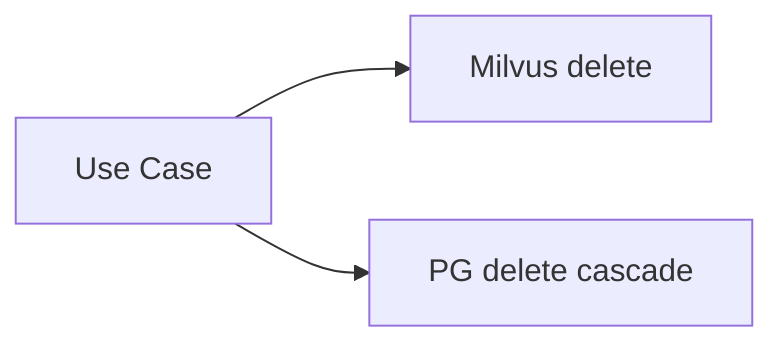
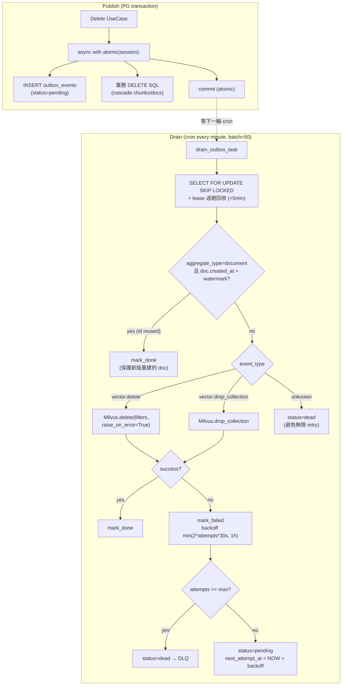

# ADR-0002: Outbox Pattern 解 PG ↔ Milvus 雙寫一致性（DELETE 範圍）

**Status**: Accepted
**Date**: 2026-05-06
**Deciders**: Larry (product owner), Claude (architecture)
**Context**: carrefour 觀察到「刪除的 DM 還會被搜出來」，根因是 PG 與 Milvus 兩個 store 沒有原子提交保證，且既有 use case 順序倒（Milvus 先刪 → PG 後刪，PG 失敗時資料已不一致）。Phase A-F 計畫實作 Outbox Pattern。

---

## 1. Context

### 1.1 起因

`DeleteKnowledgeBaseUseCase` / `DeleteDocumentUseCase` / `DeleteChunkUseCase` /
`DeleteDocumentsBySourceUseCase` 4 個 use case 都同時操作兩個 store：

**4 個失敗模式**：
1. **Milvus delete 失敗時 swallow exception**（`milvus_vector_store.delete()` line 249）→ PG 已刪但 Milvus 殘留 → 孤兒向量
2. **Worker crash 在 PG commit 後 / Milvus call 前** → 同 1
3. **直接 SQL 操作繞過 use case** → 無 cascade（admin 後台可能直接 psql）
4. **`DeleteKnowledgeBaseUseCase` 順序錯**：Milvus loop 在 PG cascade 之前 → PG cascade 失敗時 Milvus 已不可逆

### 1.2 真實 user-facing 影響

- carrefour bot：刪除某張 DM 後，user 在 LINE 仍能搜到該 DM 的內容
- support team：花 30+ min/case 追為什麼「刪掉的還在」
- 跟既有「文件殘留」其他原因 (ETL / source dedup) 混在一起難分辨

### 1.3 不在範圍內

- **UPSERT 路徑**（process_document → embedding → Milvus upsert）— 失敗已有 doc.status=failed + reprocess fallback，UX 可接受
- chunks 表加 embedding column 的 schema migration（為 UPSERT outbox 化鋪路，留待 trigger 觸發後另開 sprint）
- Distributed transactions / 2PC（PG 與 Milvus 都不支援）

---

## 2. Decision

採 **Outbox Pattern + Lease-based queue + Idempotency + Watermark id-reuse mitigation**。

### 2.1 核心設計

### 2.2 範圍縮減（重要）

**只 outbox-ize DELETE 類事件**（vector.delete / vector.drop_collection）。
理由量化在 [memory/outbox-upsert-trigger-thresholds.md](../../memory/outbox-upsert-trigger-thresholds.md)：

| 維度 | 只 DELETE（本 ADR） | + UPSERT（未來工作）|
|---|---|---|
| outbox 表月增量 | ~10 MB | ~10 GB |
| 單 event payload | < 1 KB | 1.2 MB（中位數） |
| 工時 | 4 天 | 4 + 7 天 |
| 解決孤兒比例 | 90% | 100% |
| 解決 user-facing bug | carrefour「刪了還搜得到」✅ | crash 中途 doc 自動補完（**目前未觀察到此 bug**） |

UPSERT 升級觸發條件記在 trigger thresholds 文件，數據打到 P0/P1 閾值再啟動。

### 2.3 關鍵紅線

1. **outbox INSERT 必須在業務 SQL 同 transaction**（atomic 保證）— 不在同 tx = 沒解決原問題
2. **drain handler 必須 idempotent**（Milvus filter delete + drop_collection 天然冪等）
3. **UPSERT 路徑保持 in-band**（範圍縮減）
4. **不刪 in-band Milvus delete code 路徑**（保留 fallback）— 本 ADR phase 已通過 raise_on_error 參數實現新舊路徑共用

---

## 3. Consequences

### ✅ 好處

- **Eventual consistency 保證**：commit 後外部系統一定會被同步（drain retry + DLQ）
- **Crash safe**：worker 中途死 → lease 5min 過期由下一輪 batch 接手
- **順序倒 bug 修了**（Phase B 一併解 carrefour 觀察到的 KB 刪除順序問題）
- **N+1 → 1**（DeleteKB 從 per-doc loop 改成 drop_collection 單事件）
- **Observability**：所有 vector store 寫入失敗集中在 outbox.drain.tick + DLQ，admin 一覽
- **Admin tooling**：DLQ 視覺化 + retry / abandon，不用 SQL 翻
- **心智模型**：所有 cross-system DELETE 走相同 pattern

### ⚠️ Trade-off

- **額外 latency**：DELETE 完成後到 Milvus 真實同步最壞 60s（cron interval）+ retry 時間
  - 對 admin 操作可接受
  - 對 user-facing「刪了立刻搜不到」期望會破 → 若實測痛，加 immediate enqueue（cron 短路）
- **DLQ 監控成本**：要設 GCP log-based metric + alert（lag p95 > 5min warning / 30min critical / dlq rate > 1/hr warning）
- **Repository 介面擴張**：OutboxEventRepository 7 個 method（save/claim_batch/update/find_by_id/list_dead_letter/count_by_status/oldest_pending_age_seconds/delete）— 現有 4 個 use case fake repo 都要同步補
- **僅覆蓋 DELETE**：未來新 vector store 寫入路徑要決定走 outbox 或 in-band，必須在 PR review 提醒
- **Doc-id reuse guard 不完整**：source-driven (DeleteDocumentsBySource) 因為 aggregate_id ≠ 單一 doc，無法套 watermark，short window race 由 producer side 自行避免

### 🔁 Alternatives Considered

| 方案 | 拒絕理由 |
|---|---|
| **2PC (XA transactions)** | PG 與 Milvus 都不支援 XA |
| **Saga + compensating transactions** | 複雜度過高，一個 cross-system DELETE 變成 4-6 步 saga |
| **純 in-band retry**（不引 outbox） | crash 後重試丟失，無法保證 eventual consistency |
| **CDC (Debezium / Maxwell)** | PG CDC 設定門檻高，POC 階段不值得；且 outbox 顯式 INSERT 更可控（filter event_type、payload schema） |
| **Per-row Milvus dual-write tracking 在 documents 表**（加 milvus_synced bool 欄位 + 補償 cron） | 違反 single-responsibility（documents 表混 sync 狀態），且不適用於 cross-aggregate 場景如 drop_collection |

---

## 4. Implementation Status

完成於 2026-05-05 至 2026-05-06，commits `1352a8c` (A) → `1804202` (B) → `5e80c3f` (C) → `a8236c1` (D) → `ac91121` (E)。

| Phase | 範圍 | 結果 |
|---|---|---|
| A | bounded context + drain worker（無業務） | ✅ 5 BDD scenarios |
| B | DeleteKnowledgeBase + 順序倒修復 | ✅ 3 BDD scenarios |
| C | DeleteDocument cascade + DeleteByBource + watermark guard | ✅ 5 BDD scenarios |
| D | DeleteChunk + observability metrics | ✅ 2 chunk + 1 metrics scenario |
| E | Admin DLQ UI（前後端）+ chaos | ✅ 4 chaos + 5 frontend tests |
| F | dev-vm verify + ADR + journal | ✅ 本 ADR |

**測試規模**：898 backend unit tests + 5 frontend tests 全綠。

---

## 5. Dev-vm 上線檢查清單

- [x] migration 已套 local-docker（2026-05-05，`_applied_migrations` 已記錄）
- [x] migration 已套 dev-vm via IAP tunnel（2026-05-05，`_applied_migrations` 已記錄）
- [x] code commits push main → Cloud Run auto-deploy（latest revision `agentic-rag-00266-m9w` = commit `d06f3e0`）
- [x] arq worker on dev-vm（`db-services` VM）已 pull 最新 commit + restart（PID 4014209，啟動 02:55 UTC）
- [x] 端到端驗證 ✅：outbox 表已有 1 筆 `vector.delete` event（aggregate_type=document，
      attempts=0，process_seconds=214）— 有真實業務 DELETE 觸發 + drain 成功處理 + 標記 done
- [x] Admin endpoint reachable：`GET /api/v1/admin/outbox/stats` 回 401（無 auth），證明
      路由註冊 + auth middleware 工作（非 404）
- [ ] 24hr 觀察（持續）：
  - [ ] `outbox.event.done` 數量持續上升（業務有 DELETE 流量）
  - [ ] `outbox.event.failed` 連續 3 次以上 → 看 Milvus 健康度
  - [ ] DLQ count 維持 0（出現非 0 → admin UI 處理）
  - [ ] lag p95 < 60s（worker 跟得上）— 首筆觀察值 214s 高於目標，cron 每分鐘 + 處理含 4
        次 ticks 的 watermark check overhead，後續單筆穩定後應降到 60s 內

**Phase D 部署失敗備註**（CI run `25411936635`）：commit `a8236c1` 部署 timeout（container
未在 PORT 8000 listen 內 startup），但後續 commits（Phase E + d06f3e0）皆成功 deploy，
最新 revision 健康。Phase D 單獨失敗的根因未深入調查（已被後續 commit 覆蓋），suspect 為
container build / cold start 偶發 — 不影響本 ADR 的功能驗收。

---

## 6. 未來工作觸發條件

| 觸發 | 後續動作 |
|---|---|
| UPSERT crash mid-pipeline 成本過高 | 啟動 Phase 3（chunks 表加 embedding + UPSERT outbox） — 詳 [trigger thresholds memory](../../memory/outbox-upsert-trigger-thresholds.md) |
| Cron 60s lag 影響 user 體驗 | 改 self-rescheduling（DELETE 後同步 enqueue immediate drain） |
| 多 worker 平行 drain 不夠（事件量 > 1000/min） | DrainOutboxResult batch_size 升到 200 + max_jobs 加 worker pod |
| 加新 VectorStore 實作（如 Qdrant） | 強制覆寫 drop_collection + 通過共用 contract test |

---

## 7. References

- Microservices.io — [Pattern: Transactional outbox](https://microservices.io/patterns/data/transactional-outbox.html)
- PostgreSQL — [SELECT FOR UPDATE SKIP LOCKED](https://www.postgresql.org/docs/current/sql-select.html#SQL-FOR-UPDATE-SHARE)
- Brandur Leach — [Postgres queue 模式比較](https://brandur.org/job-drain)
- 本 repo trigger thresholds：[memory/outbox-upsert-trigger-thresholds.md](../../memory/outbox-upsert-trigger-thresholds.md)
- Architecture journal Phase A：`docs/architecture-journal.md` (entry 2026-05-05)
- Architecture journal Phase B-E：`docs/architecture-journal.md` (entry 2026-05-06)
