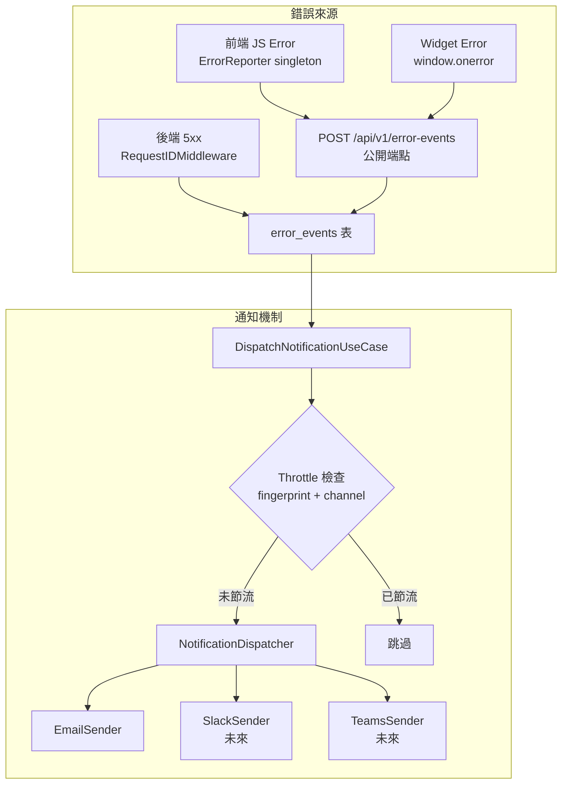
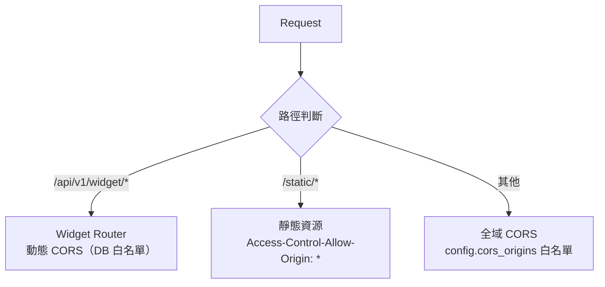
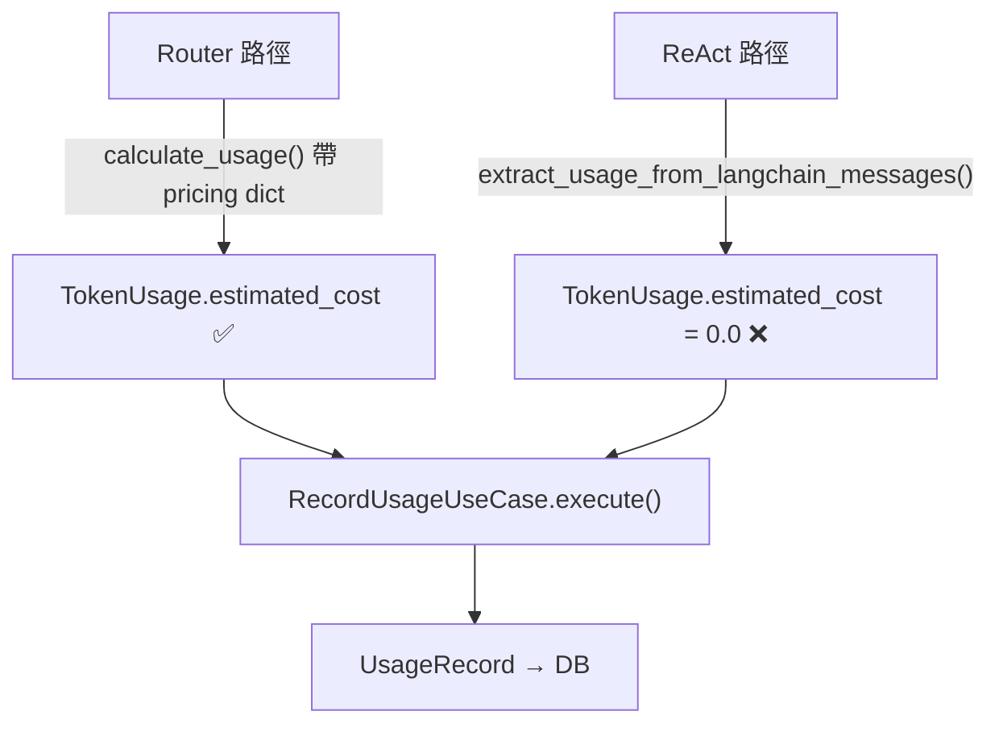
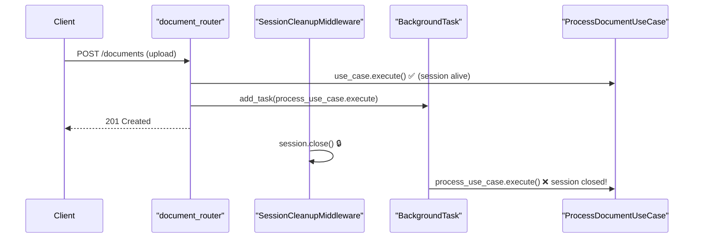
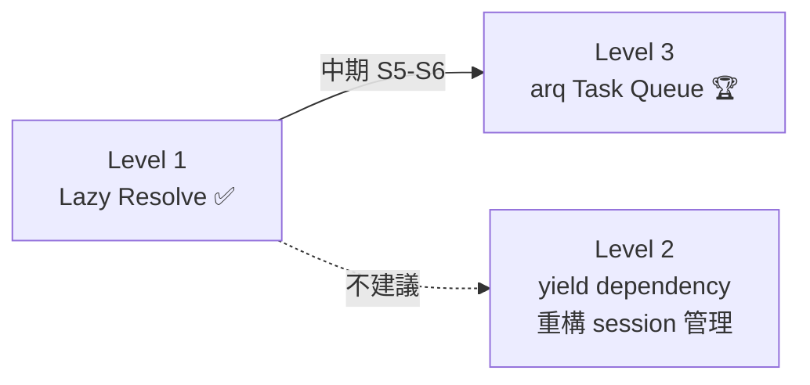
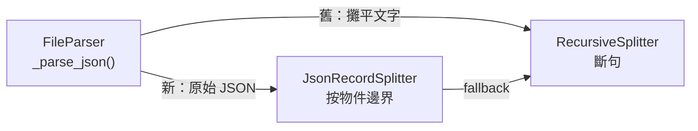
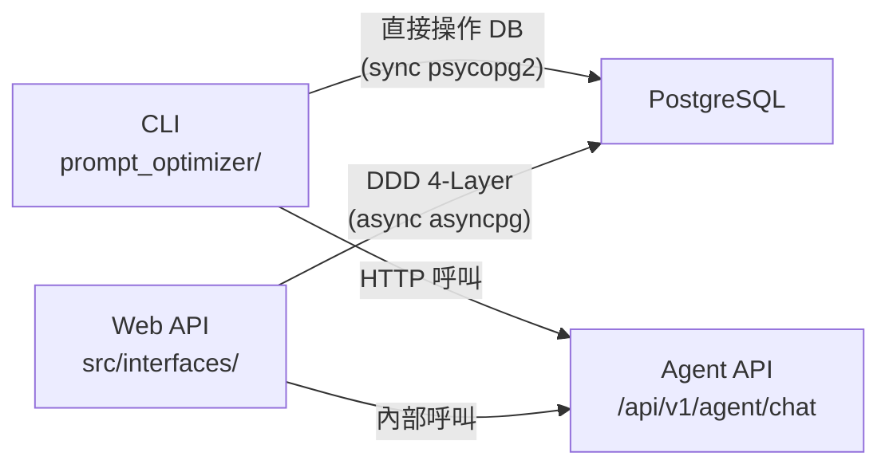
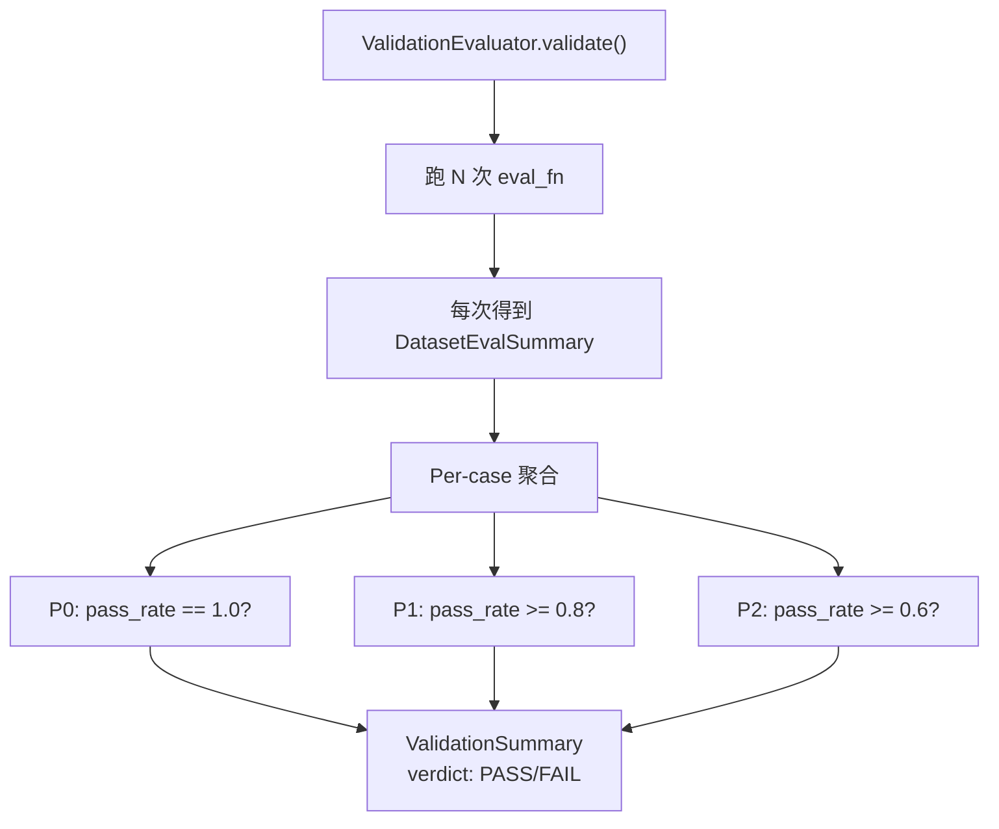

# Architecture Learning Journal

> 每次 Sprint / 功能完成後的架構學習筆記彙總。
> 用途：定期回顧、撰寫技術 blog、面試準備、團隊分享。
>
> 格式：每則筆記包含「Sprint 來源 → 主題 → 做得好 → 潛在隱憂 → 延伸學習」。

---

## S-Pricing.1 — 系統層 Pricing Admin UI + 回溯重算（Append-only 版本 + Snapshot 保證）

**日期**：2026-04-22
**Sprint**：S-Pricing.1（Issue #38）
**涉及層級**：Migration（新 `model_pricing` + `pricing_recalc_audit` 表，`token_usage_records.cost_recalc_at` 欄位）+ Domain（新 `domain/pricing/`）+ Application（6 use cases）+ Infrastructure（SQLAlchemy repos + `InMemoryPricingCache`）+ Interfaces（`admin_pricing_router`，5 endpoints）+ Frontend（`/admin/pricing` 頁 + 新增 dialog + 2 步驟 recalc 精靈 + history table）+ 27 單元 + 6 整合測試

**Sprint 來源**：S-LLM-Cache 系列完成後，Larry 問「改價能設定生效時間嗎，錯過訊息能補算嗎？」直覺想統一 `effective_from` 往前往後都允許。但這會破壞 `estimated_cost` 的 snapshot 保證，歷史月帳金額會被「悄悄改過」，法遵審計過不去。拆成**寫入嚴格 + 回溯獨立**兩條路徑才對。

**主題**：pricing 以 append-only 版本管理，新版 `effective_from` 必須 `>= NOW()`；舊版 `effective_to` 被釘成新版的 `effective_from`，snapshot 天然不變。「補算歷史成本」走獨立 dry-run + execute 兩段式 API，每次留 audit 紀錄，明確、可稽核。

### 做得好的地方

- **把「pricing 版本」當 append-only 事實**：沒有 `UPDATE model_pricing SET input_price=...`，改價永遠是 `INSERT` 新版本 + 同 `(provider, model_id)` 舊版的 `effective_to` 釘成新版 `effective_from`。歷史價格是不可變事實，符合會計 ledger immutability 直覺。
- **Snapshot 保證 vs 回溯需求的拆分**：寫入側 `effective_from >= NOW()`（保 snapshot 不破，不會默默動到歷史資料），「補算」另開 `/recalculate:dry-run` + `/recalculate:execute` 明確路徑，UI 還強制 2 步驟確認 + reason 必填。回溯不是「改欄位副作用」，是「按下那顆按鈕才會發生的明確動作」。
- **Dry-run + execute 兩段 token 防 race**：dry-run 回傳 UUID token 到 Redis TTL 10min，execute 階段先從 token 取 snapshot（count + cost_before_total），再查一次 DB 比對 — 不一致就 `RuntimeError("race detected")` abort。避免 admin 預覽了 3 筆，5 分鐘內 usage 漲到 5 筆，按下 execute 卻改了 5 筆（admin 以為自己只動 3 筆）。
- **`UsageRecalcPort` 隔離 domain 耦合**：Pricing context 需要讀寫 `token_usage_records`，但不引用 `UsageRecord` entity（那是 Usage context 的聚合根）。在 `domain/pricing/` 定義輕量 `UsageRecalcRow` DTO + `UsageRecalcPort` interface，infrastructure 層用 SQLAlchemy 直接讀 `UsageRecordModel` 轉成 DTO。Pricing 與 Usage context 解耦，DDD aggregate 邊界乾淨。
- **`PricingCache` 避免 hot path DB query**：`RecordUsageUseCase._estimate_cost` 每次打 DB 會拖慢 LLM response。改成啟動時 load 全部版本（含未來排程）到記憶體 dict，lookup O(n) on versions per model（通常 < 5 筆）。CRUD use case 完成後 `cache.refresh()` 重 load，單 pod 即時生效。
- **Fallback DEFAULT_MODELS 不炸裂**：`_estimate_cost(model)` 先查 cache，miss 就 fallback 到硬編碼 `DEFAULT_MODELS` dict。DB 空 / seed 漏 / 新 model 第一次跑都不會 `estimated_cost=0`。S-LLM-Cache.2 那條 pricing lookup 不匹配的 regression 徹底絕跡。
- **Audit hook 預埋 structlog event**：`pricing.create`、`pricing.deactivate`、`pricing.recalculate.execute` 每個都打 structlog 結構化 log，欄位對齊未來 `audit_log` 表的 schema（action / actor / resource_id / before / after）。上線前補真 audit 表時直接把 event 名稱改成寫 DB，不用重構。
- **Scope Gate 穩住**：Larry 問「能不能 effective_from 往前設」時，回答「A（允許）/ B（禁止）/ C（禁止 + 獨立重算按鈕）」三選項 + tradeoff，最後選 C。沒有順著問題直接實作 A，避免寫完發現 snapshot 破了再回頭補。

### 潛在隱憂

- **Multi-pod cache invalidation 尚未實作** → 目前 POC 單 pod，admin 改價 → 同一 pod `cache.refresh()` 立即生效。多 pod 時其他 pod 最多 staleness = 下次 restart。上線前要加 Redis pub/sub `pricing_cache_invalidate` event — 優先級：中（正式收費前必補）。
- **Recalculate 大區間沒預先警示** → Dry-run 設 `MAX_AFFECTED_ROWS = 100,000`，超過拒絕。但 80k 筆 UPDATE 跑起來仍需幾十秒，單筆 UPDATE 沒合併成 `UPDATE ... WHERE id IN (...)` 或 `UNNEST` bulk → 改用 batch statement 可快 10x。優先級：低（回溯不常觸發）。
- **Dev-vm seed 需 Larry 手動授權才能跑** → Local-docker 已 seed 23 筆，dev-vm 還沒。Cloud Run 重啟後 `PricingCache` load 到 0 筆 → 全部走 `DEFAULT_MODELS` fallback，功能上沒問題但 admin UI 看不到任何版本。本 session 停在這裡等 Larry 授權。優先級：高（dev-vm 下次部署前必補）。
- **幣別永遠 USD 沒表示層轉換** → Pricing 存 USD 符合廠商原始計價，但 dashboard 若要顯示 TWD 或給台灣租戶看帳單 → 跟 Token-Gov checklist #7 一併處理。優先級：中（對外顯示前必補）。
- **Effective_from 時區混淆隱患** → DB `TIMESTAMPTZ` 正確、Pydantic `datetime` 帶 tzinfo、前端 `<input type="datetime-local">` 會用瀏覽器 local timezone，ISO 轉換需顯式含時區。目前未寫整合測試驗「瀏覽器在東京 vs 紐約送出同一筆」兩端一致。優先級：低（同部門 admin 實際上都同時區）。
- **`findByid` 沒驗 deactivated 狀態** → `ExecuteRecalculateUseCase` 用已停用的 pricing 重算，會用停用時的價格算，可能不是使用者想要的（但也可能是有意「按歷史某版本回算」）。需明確 UI 標示「此 pricing 已停用」。優先級：低。

### 延伸學習

- **Temporal table / System-versioned table**：PostgreSQL 17 有 `PERIOD` 子句、MSSQL 2016+ 原生 system-versioned table，ship 一段時間後可考慮把 `model_pricing` 改為原生 temporal table（`valid_from`/`valid_to` 自動管理）。搜尋關鍵字：`SQL temporal table`、`bitemporal data`、`Fowler - Patterns of Enterprise Application Architecture, Ch 11 Temporal Patterns`。
- **Event sourcing vs CQRS 的適用邊界**：本次用了「append-only 版本 + snapshot」的 event-sourcing lite 模式，但沒走完整 CQRS（讀寫 model 分離）。判準：如果查詢維度夠複雜（例：「2025 全年所有 model 累積漲價百分比」）才值得拆 read model。本 sprint 維度簡單，不拆。
- **Dry-run + Idempotency token 的分散式意涵**：今天的 race detection 是比對 `count + cost_before_total`，但在真多租戶高並發下要演進為 Idempotency-Key + ETag (`If-Match` header) 機制。搜尋關鍵字：`Stripe idempotency keys`、`HTTP conditional requests ETag`。
- **SQL migrations 時序鐵律再加強一次**：本 sprint 嚴守「先 migration → 等 Larry 授權 → 套 local + dev-vm → 再改 ORM → 再 push CI」。ORM 改動先於 migration 套用 = 部署後 500。這次在 feature `token_usage_records.cost_recalc_at` 欄位新增時特別小心 — 即使一行 `ALTER TABLE ADD COLUMN`，也一定走完五步流程。

### 思考題

- **回溯重算的「時效鎖」該不該加？** 例如「超過 90 天前的 usage 拒絕重算」，避免 admin 誤觸碰到已出月帳的歷史。目前設計允許任意區間。正式收費後應加上「月結後只能 credit note 不能改歷史」的護欄。這會影響 billing workflow — 你會選 (a) 硬時效鎖（API 層拒絕），還是 (b) 僅 UI warning + audit 強化？
- **Provider migrate 時的 pricing 繼承**：如果把 `anthropic:claude-haiku-4-5` 換線路到 `litellm:azure_ai/claude-haiku-4-5`，兩組 pricing 在 DB 是獨立記錄（prefix 不同）。usage 歷史如何判斷「這是同一個 model 的不同 route」做合併成本報表？這會把 pricing 邏輯推向 capability table（items 5-6 範圍）。

---

## S-LLM-Cache.1 — 跨 provider Prompt Caching 抽象（PromptBlock 模式）

**日期**：2026-04-22
**Sprint**：S-LLM-Cache.1
**涉及層級**：Domain (新 `domain/llm/`) + Infrastructure (`llm_caller` + `chunk_context_service` + `cluster_classification_service`) + Application (`process_document_use_case` + `classify_kb_use_case` + `prompt_guard_service` + `intent_classifier`) + 8 unit test 檔。約 11 檔變動，新增 26 個測試。

**Sprint 來源**：使用者問「要不要每個 provider 寫一套 prompt 組合機制」時深挖 — 發現 LangGraph path (`AnthropicLLMService`) 早就有 cache_control，但「lightweight call_llm path」（Contextual Retrieval / Guard / Auto-Classification 4 個 service 共用）一直沒接 cache。Contextual Retrieval 處理 50 chunks 文件每天燒 ~85% 冗餘 input token，是隱形 cost leak。

**主題**：用 Domain 層 `PromptBlock` 抽象「結構化 prompt + cache hint」，infrastructure 層各 provider adapter 自己翻譯 — 一份 caller code 跑遍所有 provider。

### 做得好的地方

- **抽象層級切對地方**：`PromptBlock` 放 Domain（`domain/llm/`），不是 Infrastructure。Domain 層只描述「prompt 由哪些 block 組成、哪些可 cache」這種**業務語意**，provider 怎麼翻譯（cache_control marker / prefix order / explicit cachedContents）是 Infrastructure 細節。新增 provider（Mistral / xAI Grok）只動 adapter，service 層 zero change。
- **`CacheHint` 用 enum 而非 boolean**：bool 等將來要加「persistent (1hr)」「explicit cache by ID」就得 API break。enum 從 day 1 預留擴充空間。
- **Backward compat 不靠版本切換靠 overload**：`call_llm(prompt: str | list[PromptBlock])` 用 isinstance dispatch + `_normalize_blocks` (str → 單一 user block 包裹)，**既有 4 個 caller 在 sprint 全程不需改**任何一行就持續工作。Step 5/6/7 才一個一個改成 blocks 換 cache 收益。
- **Token tracking 已有 schema 卻沒走完 pipeline**：Token-Gov.0 早就在 `UsageRecord` / `TokenUsage` / `RecordUsageUseCase` 加好 `cache_read_tokens` / `cache_creation_tokens` 欄位，但 `LLMCallResult` 沒這兩欄 → service 層收不到 → cost 算錯。本 sprint 補的是「資料管線中間斷的一截」。這種「schema 已備好但邏輯沒接通」的 tech debt 越早補越好。
- **Provider 差異盤點先做，再寫抽象**：先確認「兩種模式」(顯式 marker vs 自動 prefix) 才設計 `PromptBlock`，避免抽象變成只服務一家的偽通用 API。OpenAI auto-prefix 的「cacheable block 必須在前」是 caller 的 ordering contract，不是 adapter 的工作。
- **規模再小的 caller 也走相同 pattern**：`ClusterClassificationService` 的 instruction 太短（< Anthropic Sonnet 1024 / Haiku 2048 token min cacheable size），cache marker 會被 silently 忽略，理論上「可以不改」。但仍照做，理由是**團隊心智模型一致性**：之後讀 code 不會困惑「為何 guard 改了 classification 沒改」。失敗也不會比現況差（marker 被忽略 ≠ 報錯）。
- **`IntentClassifier` 走另一條 LLM path 也順便修**：發現它走 `LLMService.generate()` 不是 `call_llm`，但 `AnthropicLLMService` 已有 cache 機制 — 把 categories 列表從 user_message 搬進 system_prompt 一行 patch 就 cache 上手。**Sprint scope 不被 path 隔離限縮**，順手修才整體合理。

### 潛在隱憂

- **OpenAI-compatible adapter 的 DeepSeek 分支寫死**：目前用 `if provider == "deepseek"` 判斷該不該找 `prompt_cache_hit_tokens`。未來若 Qwen / Mistral / 其他 provider 也搞自家 cache 欄位，這條 if 鏈會長。建議下版抽 `cache_token_extractor` 對應表（provider → callable）。中優先級。
- **未驗證實際 cache 命中率**：BDD scenario 是用 mock LLMCallResult 模擬「cache 已命中」回 cache_read_tokens > 0，**沒有真的對 Anthropic API 跑一輪驗證 cache_control marker 真的被 server 認**。Sprint Stage 5 列了 SQL 驗證指令 (`SELECT SUM(cache_read_tokens)`)，但 dev-vm 實際處理一份 50-chunks 文件後才能確認。中優先級 — 應在第一份生產文件處理時主動 query 確認。
- **Caller 自己負責 ordering**：cacheable block 必須在前的契約寫在 docstring 裡，沒程式強制。萬一誰寫 `[volatile_block, cacheable_block]`，OpenAI auto-prefix cache 會 silently 失效（cache_read = 0 但不報錯），需要看 SUM(cache_read) 才能發現。建議下版加 lint rule 或 dev-mode runtime warning。低優先級。
- **`IntentClassifier` 改 prompt shape 可能影響分類準確率**：把類別清單從 user_message 移到 system_prompt 改變了模型「看到」的訊息結構順序。新單測只驗證 prompt **shape**，沒驗證**分類結果不變**。Carrefour demo 前應跑既有 intent 範例做 A/B 對比。中優先級。
- **Items 5-6 (cost 折扣計算) 沒做就會有錯誤帳單**：本 sprint 把 `cache_read_tokens` / `cache_creation_tokens` 寫進 DB，但 `_estimate_cost_from_registry` 的計算邏輯是否正確套到 cache 折扣價？需驗證 `model_registry` 的 cache_read_price / cache_creation_price 是否在 cost 計算時實際被讀取。如果沒有，cache 命中越多 dashboard cost 反而越高（因為 cache_creation 比正常 input 貴 25%）。**這是下 sprint S-LLM-Cache.2 的首要驗證項**。

### 延伸學習

- **「Provider abstraction」vs「Provider polymorphism」**：抽象到 Domain 層讓你**獨立於任何特定 provider 思考業務語意**（「這段 prompt 我希望它被 cache」），polymorphism 是 Infrastructure 細節。這個分界錯置（把 cache_control 直接寫進 service 層）會讓未來換 provider 時整個 service 重寫。本 sprint 是個正面案例，可作為「跨外部 SDK 抽象」的 reference pattern。
- **Cache hint 的責任歸屬**：caller 知道「這段 prompt 是穩定的、值得 cache」這個業務知識，adapter 知道「在我這個 provider 怎麼利用 hint」這個技術細節。**hint 是 metadata，cache 行為是 implementation**，責任邊界清楚。對比反例：caller 直接傳 `cache_breakpoints=[0, 1500]` token-level 的低階參數 → adapter 變成單純 pass-through，且 caller 被綁死在 Anthropic 的「4 breakpoint」限制。
- **Backward compat overload 是 API 演進的好工具**：`call_llm(prompt: str | list[PromptBlock])` overload 讓 sprint 的 7 個 step 可獨立 ship。Day 1 ship Domain 抽象不影響任何人；Day 5 ship Contextual Retrieval 改用 blocks 當下生效；其他 service 各自的 timeline 可以分開。對比「v2 簽章 breaking change，所有 caller 必須同 PR 改完」的反例 — sprint 整體 risk 高很多。
- **Token tracking 設計：先補欄位後補邏輯，能省第二次 migration**：Token-Gov.0 先把 `cache_read_tokens` / `cache_creation_tokens` 欄位加進 DB schema 是對的決定 — 即使當時 service 不寫入這兩欄（永遠 0），未來只要 service 端補上邏輯，**zero downtime 切換**，不需另跑 migration。

#### 思考題（給開發者）

如果未來 Anthropic 推「persistent cache（1 小時 TTL，多收 50% creation 費用）」，我們的 `CacheHint` enum 要怎麼擴？是加 `PERSISTENT_1H` 還是改成帶參數的 dataclass `Cache(ttl_minutes=60)`？對 OpenAI 的自動 prefix（不能控 TTL）這個 hint 該怎麼處理 — silently ignore 還是 raise？

提示：思考「caller 的業務語意」vs「provider 的能力 matrix」誰該主導 API 形狀。

---

## S-Gov.6b — LLM 對話摘要 + Hybrid 搜尋：Stateful vs Result-Based + Schema Reuse 跨 Domain + Race-Safe Cron Re-trigger

**日期**：2026-04-21
**Sprint**：S-Gov.6b（Agent 執行追蹤 UI 強化第二段）
**涉及層級**：跨 4 層 + Worker + Milvus + 前端 — Migration（5 欄位 + partial index）+ Domain 加 enum/ABC/repo method + Infrastructure 加 LLM impl + Milvus 3 wrapper method + Application 2 use cases + SendMessageUseCase hook + worker fan-out cron + admin endpoint + 前端 1 新頁 + 1 hook + 1 component。約 18 檔變動。

### 本次相關主題

- Token tracking 設計：result-based vs stateful 取捨
- Schema reuse 跨 domain（Milvus chunks collection schema 套用 conv_summaries）
- Race-safe cron 重觸發（snapshot message_count 不需 lock）
- Cron fan-out pattern（一個 cron 拆成多個 arq job）
- Admin 行為 token 歸帳策略（SYSTEM tenant）
- 既有 SSOT helper 維護成本攤提（usage-categories.ts / chart-styles.ts）

### 做得好的地方

#### 1. Result-Based vs Stateful — 在「同時做兩件事」場景下選對 pattern

`LLMChunkContextService` 用 stateful pattern（`last_input_tokens / last_output_tokens / last_model`）— 適合「LLM 一段流程，caller 讀完寫一次 record_usage」。

但 `ConversationSummaryService` 同時做 LLM + embedding 兩件事，stateful 會變成 6 個 attributes（`last_summary_input_tokens / last_summary_output_tokens / last_summary_model / last_embedding_tokens / last_embedding_model / ...`），caller 容易讀錯欄位。

→ 改用 **result-based**（`ConversationSummaryResult` dataclass 含 5 個欄位），純函數風格：

```python
@dataclass(frozen=True)
class ConversationSummaryResult:
    summary: str
    embedding: list[float]
    summary_input_tokens: int
    summary_output_tokens: int
    summary_model: str
    embedding_tokens: int
    embedding_model: str
```

caller 取 result.summary_* 寫一次 record_usage、取 result.embedding_* 寫第二次。語意明確，unit test 易寫（return value 直接 assert）。

**判斷準則**：「一段流程一個值」走 stateful 沒問題；「一段流程多種 outcome 都要追蹤」走 result-based。

#### 2. Schema Reuse 跨 Domain — 不為 conv_summary 開新 Milvus schema

Milvus `conv_summaries` collection 的需求：
- vector dim: 3072（同 KB chunks）
- 需要 tenant_id filter
- 需要 bot_id filter（admin 想搜某個 bot 的對話）
- 需要回顯 summary 文字

既有 KB chunks schema 已有：`id / vector / tenant_id / document_id / content / chunk_index / content_type / language / extra (JSON)`。

決策：**reuse 既有 schema，不為 conv_summary 開第二套**。Mapping：
- `id` ← conversation_id (PK，upsert 同 conv_id 自動覆蓋)
- `tenant_id` ← conv.tenant_id
- `document_id` ← bot_id（語意 reuse — 用 bot_id 過濾）
- `content` ← summary text
- `extra` JSON ← 其他 metadata（first_message_at / message_count / summary_at）
- 其他欄位（chunk_index, content_type, language）留空字串

收益：
- ✅ 不用新增 schema 維護
- ✅ Milvus collection 配置參數一致（index type / metric）
- ✅ 既有 search code path 100% reuse
- ✅ 寫個 thin wrapper（`ensure_conv_summaries_collection / upsert_conv_summary / search_conv_summaries`）就完事

代價：欄位語意輕微 abuse（`document_id` 拿來放 bot_id），但有清楚註解 + thin wrapper 隔離，使用方不會混淆。

「既有 schema 80% match 時 reuse + thin wrapper > 開新 schema」是務實工程判斷。

#### 3. Race-Safe Cron Re-trigger — 用 DB 條件取代 application 層 lock

問題：cron 跑「為閒置 5min 的 conversation 生 summary」，若 LLM 跑到一半，使用者又回了新訊息，怎麼辦？

3 種解法：
- ❌ **Application 層 distributed lock**（Redis SETEX）— 複雜、要處理 lock 過期、Redis 故障
- ❌ **取消 in-flight job**（arq 不直接支援 cancel）
- ✅ **DB 條件 + snapshot pattern** — 不需 lock 不需 cancel

實作（`find_pending_summary` query）：
```sql
WHERE last_message_at < NOW() - INTERVAL '5 minutes'
  AND (summary IS NULL OR summary_message_count < message_count)
```

LLM 完成後 snapshot 當下 N 寫入 `summary_message_count`：
```python
n_at_start = conv.message_count  # snapshot 在 LLM call 前
result = await self._summary_service.summarize(...)  # 可能慢 5-30s
# ... LLM 完成期間使用者可能又寫了新 message → message_count 變大
conv.summary_message_count = n_at_start  # 仍寫 snapshot 值
await conv_repo.save(conv)
```

下次 cron 掃時：若 conv.message_count 已變大（例如 N → N+1），條件 `summary_message_count < message_count` 自動命中，重觸發新 summary 覆蓋舊版。

→ summary 永遠是「最新閒置時刻」的最新版本，**完全 self-healing**。

DB 條件當 lock 比 application 層 lock 簡單 10 倍 — 條件本身就是「正確性 invariant」。

#### 4. Cron Fan-Out Pattern — 拆 cron 與 arq job

ProcessMonthlyReset (Token-Gov.2) / ProcessQuotaAlerts (Token-Gov.3) 都是「cron 內直接遍歷處理」— OK 因為都是輕量 DB 操作。

但 conversation_summary 每筆要打 LLM（5-30 秒），若 100 個 pending → cron 跑 5+ 分鐘 → 卡下次 cron。

→ 拆成兩段：
- **`conversation_summary_scan_task`**（cron @ 每分鐘）：只 query pending list + enqueue arq jobs
- **`process_conversation_summary_task`**（arq job）：單筆 conversation 處理

```python
async def conversation_summary_scan_task(ctx: dict) -> None:
    pending = await conv_repo.find_pending_summary(idle_minutes=5, limit=200)
    for conv_id in pending:
        await ctx["redis"].enqueue_job("process_conversation_summary", conv_id)
```

收益：
- arq `max_jobs=3` 自動 throttle 並行度
- 失敗只重試該 conv，不影響其他
- Cron 永遠秒級結束，不會 backpressure

「掃 + fan-out」是 worker queue 的經典 pattern — 任何「N 個 LLM 呼叫」都該這麼拆。

#### 5. Admin 行為 token 歸 SYSTEM Tenant — 既有約定的延伸

semantic search 內部會 embed 一次 query（admin 操作的隱藏 token cost）。歸給誰？

既有約定：admin 操作不歸租戶帳，歸 `SYSTEM tenant`（"00000000-0000-0000-0000-000000000000"）。`AdminTenantFilter` 早已過濾掉這個 tenant。

→ 直接套用約定，不開新 enum：

```python
await self._record_usage.execute(
    tenant_id="00000000-0000-0000-0000-000000000000",  # SYSTEM
    request_type=UsageCategory.EMBEDDING.value,
    usage=TokenUsage(model=..., total_tokens=embedding_tokens, ...),
    bot_id=None,
)
```

「不擴大 scope，套用既有約定」是 sprint 紀律 — 每次跨入新行為時都該檢查「這已經有人解決過了嗎？」

#### 6. SSOT Helper 維護成本攤提 — 加 1 行受惠 4 個頁面

Token-Gov.6 建的 `usage-categories.ts` SSOT 在 6b 兌現了：
```ts
{ value: "conversation_summary", label: "對話 LLM 摘要", shortLabel: "摘要" }
```

加這一行，自動讓 `tenant-config-dialog` / `quota-overview` / `quota` / `admin-token-usage` 4 個既有頁面顯示「對話 LLM 摘要」中文 label，不需動 4 個檔案。

這正是 SSOT 的本質回報 — 建立成本一次，維護成本零。

「越早建 SSOT 越划算」— 但反面：「過早建 SSOT」（YAGNI 違反）會讓未來改 schema 痛苦。Token-Gov.6 是「等 4 處重複後再 extract」的好範例。

### 潛在隱憂

#### 1. Milvus collection PK 衝突 → 中

`conv_summaries` 用 `conversation_id` 當 PK，與 KB chunks 的 `chunk_id` 同 namespace。理論上 UUID 不會碰撞，但若未來 collection 拆分策略改變，可能有 race。

**改善方向**：collection 內加 prefix（`conv_<uuid>` vs `chunk_<uuid>`），或為 conv_summaries 開獨立 collection schema。POC 階段不做。

#### 2. Re-summary cost 可能爆 → 中

Race-safe 重生 trade-off：long conversation 每閒置 5min 後可能重生 summary，最壞 case 一條對話生 5+ 次 summary（每次 ~1-2K input + 100 output tokens）。

對 POC 量級（< 100 對話/天）= 一天 < 500 次 summary call，Haiku 成本 < TWD 5/天。OK。

對正式量級（10K 對話/天）= 50K LLM calls/天，成本爆 → 需要：
- 加 `cooldown_minutes` 機制（同 conv 上次生完 N 分鐘內不再重生）
- 或：只在「conversation closed」（明確 marker）時生

POC checklist 已記。

#### 3. Embedding service stateful attribute 是 implicit contract → 低

`getattr(self._embedding, "last_total_tokens", 0)` 依賴於 `OpenAIEmbeddingService` 的內部 state。若有 admin 自定義 embedding 沒實作這個 attribute，token 會記為 0（silent miss）。

**改善方向**：把 `last_total_tokens` 提升為 EmbeddingService ABC 介面（必填 property），強制所有實作回報 token usage。但這是 Token-Gov.0/.6 的範圍，本 sprint 不做。

#### 4. Mock SearchResult vs 真實 Milvus payload → 低

BDD scenario 4 的 `mock Milvus search` 回 `SearchResult(id=cid, score=0.85, payload={})` — payload 為空。實際 Milvus search 會回 entity 完整 payload，但因 search use case 只用 `id + score` 來 hydrate from PG，所以測試覆蓋率仍 OK。

未來若 search use case 改用 Milvus payload 直接顯示（不去 PG hydrate），測試 mock 要對應加 payload。

### 延伸學習

- **Snapshot pattern in Race-Safe Async Workflow**：不只用於 cron — 任何「讀-改-寫」可能被打斷的 async 流程都適用。經典參考：CRDT (Conflict-free Replicated Data Types) / Lamport Timestamp / Optimistic Concurrency Control
- **Schema Reuse vs New Schema 權衡**：軟體設計常見抉擇。延伸閱讀：「Domain Driven Design」Aggregate Boundary 章節 — 何時該共享 entity，何時該拆獨立 BC
- **Hybrid Search (Keyword + Vector)**：semantic search 不是萬能 — 對「找精確字」場景反而不如 keyword。OpenAI / Anthropic 內部的 RAG 都是 hybrid。下一步可學 BM25 + dense vector hybrid + RRF (Reciprocal Rank Fusion) reranker

### 思考題

「我們現在 admin search 用 keyword 與 semantic 互斥（UI 強制只能擇一），為什麼不做 hybrid（同時用兩個 + 結果合併排序）？」

提示：考慮 (a) RRF (Reciprocal Rank Fusion) 或 (b) 加權平均 score 兩種合併策略；考慮 admin 操作頻率（一天 < 100 次 search）vs 額外複雜度的 ROI；考慮使用者教育成本（要解釋 hybrid 比兩個按鈕難）。

---

## S-Auth.1 — 租戶自助改密碼 + 為何「舊密碼錯」該回 400 不是 401

**Sprint 來源**：帳號開通給 Carrefour 時，Larry 發現 UI 只有 `admin/users/{id}/reset-password`，租戶登入後沒有「自助改密碼」功能（密碼都得找 admin 改）。先補 ① Change Password，先不做「③ 首次登入強制改」（多人共用測試帳號會互相打架）。

**主題**：認證 API 設計中 401 vs 400 的語意差別，以及 front-end apiFetch 的 refresh-token 自動重試會怎麼坑到你。

### 做得好的地方

- **先走 BDD 4 scenarios 再寫 use case**：feature 檔先把「成功 / 舊密碼錯 / user 不存在 / 新舊相同」四個邊界列清，再寫 `ChangePasswordUseCase`。implementation 不到 30 行，四個 scenario 一次 green。整個半天工作沒有「實作中遇到沒想到的邊界」的 surprise。
- **Use Case 與 Admin `ResetPasswordUseCase` 獨立**：雖然兩者都是改密碼，但語意不同 — admin 不驗舊密碼（因為要能解決「使用者忘記密碼」場景），自助則必須驗舊密碼。拆兩個 Command + 兩個 Use Case，避免「用一個 use case + optional old_password 參數」的條件分支地獄。前者是「管理員授權改」，後者是「使用者授權改」，本質就是不同 command。
- **JWT `type=user_access` gate 前端入口**：Header 的「變更密碼」按鈕只在 `useAuthStore.userId` 存在時顯示（= 使用者用 email/password 登入拿到的是 user_access token）。dev 模式的 tenant_access token（sub=tenant_id）拿不到 userId → 按鈕消失，避免用 tenant token 打 `/auth/change-password` 永遠 401。前端 gate + 後端 gate 雙重防禦。

### 潛在隱憂

- **`AuthenticationError` (舊密錯) 回 400 不是 401** — 故意的，但**違反 HTTP 狀態碼慣例**。原因：前端 `apiFetch` 碰到 401 會嘗試 refresh token 然後自動重試，對「token 過期」場景是對的，但對「使用者提供的 credential 錯誤」場景會產生**無窮迴圈**（refresh 成功 → 重試 → 舊密還是錯 → 再 401 → 再 refresh → 再重試...）。解法兩個：(A) 後端改 400（domain error 不是 auth error）；(B) 前端 apiFetch 加「這個 endpoint 的 401 不要 refresh」白名單。選 A 是因為改一點、語意可接受（「你給的舊密碼是 validation error 不是 auth state error」），B 則要在 apiFetch 加 endpoint-specific 豁免 list，長期難維護。這個設計選擇值得寫進 API 文件註記，以後有人讀到會困惑。
- **`SameAsOldPasswordError` 是 domain error vs front-end zod refine** — 後端 422 + 前端 zod refine 同時檢查「新舊密碼不同」。雙層保護本身 OK（避免前端繞過 validation），但 error message 分散：前端 refine message 是「新密碼不可與舊密碼相同」、後端是同一句。未來改其中一邊會忘記改另一邊。低優先級可容忍。
- **無「密碼複雜度 policy」**：目前只驗「>= 8 碼 <= 128 碼」（前端 zod），後端沒再驗。對 POC 足夠，正式上線前應加複雜度規則（大小寫 / 數字 / 特殊字元）+ 常見密碼 blacklist（haveibeenpwned API or local list）。這該跟「③ 首次登入強制改」一起當 S-Auth.2 做。
- **沒有 rate limit**：使用者可以無限次 call `/auth/change-password` 猜舊密碼。雖然每次猜錯只是 bcrypt 12 rounds 慢一點（~300ms），但仍是 brute force 通道。應加 per-user 5 次/分鐘上限（可接 sprint 有 Rate Limit infra）。

### 延伸學習

- **HTTP 狀態碼與「為什麼 app 層 validation error 不該用 401」**：401 的語意是「this request does not have valid authentication credentials」 — 通常觸發 client-side 的 re-auth 流程（refresh token、重導向登入頁）。當你的錯誤是「credential 格式對、邏輯有驗證但不通過」— 例如「舊密碼錯」「驗證碼錯」「security question 錯」，應該用 400 或 422，避免自動 re-auth 邏輯誤判。參考：RFC 7235 Section 3.1（401 需帶 WWW-Authenticate header）、OWASP Authentication Cheat Sheet。
- **「只有自己能改自己」的安全性 = gated by userId from JWT subject**：`/auth/change-password` body 不接 `user_id` 參數，永遠用 JWT `sub` — 這是「讓使用者不能改別人」的最簡潔做法。對比 `/admin/users/{user_id}/reset-password` 必須有 `user_id` 路徑參數（因為 admin 就是要指定改誰），兩端 API 設計就拉開了「權限邊界」。值得在 code review 中把這模式固化：**涉及「操作對象 = 當前使用者」的 endpoint，不該在 body / path 讓 client 再傳一次 user_id**。
- **認證 (authentication) vs 授權 (authorization) vs domain validation 的三層**：
  - authN 失敗 → 401 (token 問題)
  - authZ 失敗 → 403 (權限問題)
  - domain validation 失敗 → 400 / 422 (資料問題)
  這三層邊界該在 router / middleware / use case 分別處理，不該用同一個 HTTP status 碼。

---

## Token-Gov.7 — Trace marker 語意 vs 計時節點 + Auto-topup trigger 條件雙因子守門

**Sprint 來源**：Larry 質疑「路由決策 0ms → 閒聊 0ms → react_thinking 0ms 我好像看了很多次」時深挖 agent trace 設計，順手發現 auto_topup trigger 有計費 bug（Carrefour 2026-04 實例：1500 TWD 虛假計費）。

**主題**：把「marker 節點」跟「計時節點」概念分開，順便補計費邏輯的雙因子條件。

### 做得好的地方

- **從 UI 現象回推到架構語意混淆**：Larry 直覺「路由決策不該是 0ms」完全對 — 但 code 層面的 `worker_routing` 節點本來就是 marker（記錄「分流結果」事實，不計時）。真正耗時的 intent classifier LLM call **完全沒有 trace node**（只有 token_usage_records 計費）。這暴露了「trace node 設計缺漏」+ 「label 誤導」雙重問題。
- **SQL 實測 + code 交叉驗證**：先跑 `jsonb_array_elements(nodes)` 統計 node_type × duration 分佈，確認「只有 5 種 marker 節點 100% 是 0ms，其他節點都有正常時間」— 用資料排除「計時 bug」，確認是「語意 + 缺節點」問題。比盲改 code 有效率。
- **連帶發現計費 bug 並順手修**：追 Carrefour addon=5M 的由來時查 `billing_transactions` 發現真有一筆 auto_topup。深入讀 `DeductTokensUseCase.execute()` 發現 trigger 條件 `if addon_remaining <= 0` 缺 `base_remaining <= 0` 前置。若沒追到底只修 trace，這個計費 bug 會繼續默默產生虛假收入。
- **regression guard 用場景名而非 token 值寫 test**：`test_no_topup_when_base_sufficient_and_addon_zero` 直接以「Carrefour 復刻」語意命名，未來任何人改 `DeductTokensUseCase` 都被這條守門擋住。比光測 token 數字更耐讀。
- **E (Data remediation) 跟 D (code fix) 分開提**：code fix 確保**未來不再發生**，data remediation 撤銷**已發生**的虛假記錄。User 可以分開決策：前者 sprint 內直接做，後者需要口頭授權（因為動 billing_transactions 是 audit trail 敏感操作）。

### 潛在隱憂

- **Trace node 設計沒有明確「marker vs action」元類型** → 目前靠 `start_ms==end_ms` 隱式約定，但 UI 層渲染時無法區分「故意 0ms 的 marker」vs「bug 導致 0ms 的 action」。建議下版加 `node_category: Literal["marker", "action"]` 欄位，marker 顯示為小 dot，action 顯示為 bar 並強制顯示 duration。中優先級。
- **ReAct `react_thinking` status event 沒有節點 counterpart** → 前端 timeline 被迫「過濾該 status 避免爆卡」，但這也讓 trace 中看不到「LLM 在想什麼」的階段。理想做法：ReAct 每次 LLM call **前**就 add_node 一個 `react_iteration_start` 節點（包含 thinking 的 prompt），**後** update 它的 end_ms + token_usage。當前 `agent_llm` 節點已有這資訊，但 label 是「ReAct 迭代 N」不是「思考階段」— UX 上可再精修。低優先級。
- **Auto-topup trigger 條件改為雙因子後，「正常 carryover 空」場景的 topup 時機延後** → 現在必須 base 真的歸零才 topup。如果租戶想「cycle 一開始就 prebuild addon」用，需要手動 API 觸發（現有 `TopupAddonUseCase` 已 expose，但沒在 tenant-facing UI 提供按鈕）。屬於 UX 枝葉，非架構問題。

### 延伸學習

- **Span vs Marker 在 observability 的分野**：OpenTelemetry / Jaeger 等成熟系統把 trace 單位分為 `Span`（有 start/end，必有 duration）和 `Event`（單點、屬於某 Span 的 log 事件）。本 sprint 的 `user_input` / `final_response` / `worker_routing` 都該是 **Event** 而非 Span — 本 repo 用同一個 `add_node()` 混用兩種語意是簡化設計。延伸閱讀：OpenTelemetry 的 `Span.add_event()` API 設計。
- **Trigger 條件的「雙因子守門」pattern**：單因子守門（`if addon <= 0`）易被「初始狀態就滿足」欺騙，雙因子（`if base <= 0 AND addon <= 0`）把 precondition 顯式化。這跟 SQL 的 `CHECK (a > 0 OR b > 0)` 約束、或 DDD 的 invariant 都是同一思路。若未來有更複雜的「cycle 中途升級 plan」要求，建議再導入 **state machine**（pending / active / exhausted / topup_triggered）替代裸布林組合。
- **Bug 追查從 UI → DB → Code 三階段方法論**：本次 Larry 提「0ms 看起來不對」時，我先看 code pattern 理解設計意圖、然後查 DB 確認實際資料分佈、最後回 code 找 trigger 邏輯。每階段都排除一種可能性（code 設計問題 vs 資料異常 vs trigger 邏輯 bug）。這個 heuristic 比「直接改 code 試試看」省很多時間。

### 討論題

> 本 sprint 修完 auto-topup trigger 變成「base 和 addon 同時 ≤ 0」才觸發。如果下一版要提供「拋錯式 hard cap」—例如免費方案租戶 base 用完就回 429，不給 topup：
> (a) 在 `DeductTokensUseCase` 再加一個 `if plan.hard_cap and base == 0: raise QuotaExceededError` 分支
> (b) 在 `TokenLedger.deduct()` Domain 層 raise
> (c) 建獨立 `QuotaGuard` Domain Service，`DeductTokensUseCase` 先呼叫它檢查
>
> 哪種最符合 DDD 分層？哪種對未來「per-tenant override cap」最彈性？

---

## Token-Gov.6 — 刪冗餘欄位 + SQL expression SUM + Frontend i18n SSOT + 圖表樣式共用

**Sprint 來源**：Token-Gov.5 完成後 Larry 在驗證中提出兩個架構原則：
1. 「我不想要同樣的值存兩個欄位」— 指 `token_usage_records.total_tokens` = input+output+cache_read+cache_creation 的冗餘儲存
2. 「兩頁總和一定要一樣…最好使用同一個 table 欄位跟 function」— 指兩頁走不同 Repository 方法仍有 drift 風險

**主題**：Schema 層刪冗餘欄位 + Domain 層 @property 補償 + SQL expression aggregate + 前端 SSOT 兩道（label constants + chart styles）。

### 做得好的地方

- **分層職責釐清**：`UsageRecord`（Entity / ORM reconstruct）改 `@property`，但 `TokenUsage`（Value Object / Provider SDK 邊界）保留 field。理由：OpenAI/Anthropic SDK 回傳的 `total_tokens` 可能與 computed sum 不同（特殊計費），Value Object 應忠實承接 provider 值；ORM/DB 層才刪冗餘。分層拆開後語意乾淨。
- **SQL expression 而非 Python 端 sum**：所有 aggregate method 改走 `func.sum(input + output + cache_read + cache_creation)`，PostgreSQL 可 push-down 計算，效能接近（仍走 composite index `ix_token_usage_records_tenant_created`）。避免先 fetch all records 再 Python sum 的 memory cost。
- **Domain ABC wrapper delegate**：`sum_tokens_in_cycle` 改為 ABC 的 concrete wrapper 呼叫 `sum_tokens_in_range`，subclass 只要實作 range 版本就能同時支援兩個。Application 層（`GetTenantQuotaUseCase`）call site 不用改，降低 blast radius。
- **前端 SSOT 兩道獨立抽出**：
  - `constants/usage-categories.ts` — 12 個 category label 從 4 處散落（tenant-config-dialog / types / admin-quota-overview / quota）統一到一處，順便加 `shortLabel` 對應窄欄 table、`isChatType` helper
  - `lib/chart-styles.ts` — 5 個 chart 檔（pie / 2 bar / line / score）各自重複的 tooltip style 統一，同時加 `color` / `itemStyle` / `labelStyle` 明確指定（user 原本反映 tooltip 文字看不清就是因為預設色在 dark bg 吃掉）
- **修 UI bug 的副作用發現**：`REQUEST_TYPE_LABELS` 原本只有 7 個 key（缺 5 個 Token-Gov.0 新增的 category）— 這是為什麼系統 Token 用量頁的「按類型」filter 只有 7 個、bar chart 顯示 `intent_classify` 英文。SSOT 重構後自動修復。

### 潛在隱憂

- **`TokenUsage.total_tokens` 跟 `UsageRecord.total_tokens` 語意不對稱** → Value Object 是 provider 值（可能有 cache discount 特殊計費），Entity 是 4 欄加總。若未來 provider 給的值 != computed（例如 Anthropic 新版 cache 規則），寫進 DB 時會被「正規化」為 computed，audit trail 上看不出 provider 原回傳。中優先級，目前 provider 回的 total_tokens 都等同 computed，未見問題。
- **Migration 時序敏感性（延續 Token-Gov.5 的 BUG-01 經驗）** → 必須先部署新 code（不寫 total_tokens）→ 再套 dev-vm DB migration。反過來會 runtime 500。本 sprint 的 plan 已明確標註，但實務要靠 Larry 人工把關（CI auto-deploy 不等 migration）。
- **19 個 test 檔 `total_tokens` assertion 隱性依賴** → 刪除 DB 欄位後，dataclass 建構子不再接受 `total_tokens=` 參數。依賴 Python `dataclass` 會自動 reject（TypeError），不是 silent drop — 所以修測試會「一次爆光、集中解決」，不會埋伏隱患。
- **Frontend `REQUEST_TYPE_LABELS` 保留 re-export 為 deprecated backward-compat** → Stage 5 後應逐一檢視 import 並替換成直接 `getCategoryLabel`。留短期 compat 是為了讓本 sprint commit 盡量乾淨、不碰無關檔。低優先級。

### 延伸學習

- **Field vs Property in dataclass**：Python dataclass 的 `@property` 不是 field，不進 constructor、不進 `asdict()`。這對「從 dataclass 序列化成 JSON / 回傳 API」有微妙影響 — 要記得 `model_dump()` / FastAPI response_model 如果是 Pydantic 會自動 include property，但純 dataclass + `json.dumps(asdict(...))` 會遺漏。本 sprint 因為 API 走 Pydantic DTO（`TenantQuotaResponse`），不受影響。
- **SQL 表達式 aggregate 的 index 利用**：`func.sum(a + b + c + d)` PostgreSQL 會把 `a + b + c + d` 當 computed value 每 row 算一次，不走 functional index。但 WHERE clause 仍走 `tenant_id + created_at` composite index — 效能關鍵是 row filter，aggregate computation 是後續 streaming 加總，O(n) 對已過濾 row 集合。
- **Single Source of Truth 的粒度判斷**：3 種「同一個」的抽法：
  - Label SSOT（本 sprint 做）— 共用「字串 → 中文對應」
  - Aggregate function SSOT（本 sprint 做）— 共用「SUM SQL expression」
  - Chart style SSOT（本 sprint 做）— 共用「tooltip 顏色 / 字體」
  - 沒做：DTO SSOT（後端/前端 type 獨立定義）— 正確，因為前後端變動週期不同
  - 口訣：「資料定義」適合 SSOT；「傳輸合約」適合獨立，以 contract test 守門

### 討論題

> Token-Gov.6 把 `UsageRecord.total_tokens` 改為 `@property`，外部 API `.total_tokens` 不變。如果下一版要擴充「dynamic billing discount」—例如週末 output tokens 打八折，算 `total_tokens` 時要減掉折扣差額：
> (a) 把折扣邏輯放進 `UsageRecord.total_tokens` property（Domain-level 商業邏輯）
> (b) 獨立 `BillingCalculator` Domain Service 算 billable_total，保持 `total_tokens` 為 raw sum
> (c) 在 SQL aggregate 那層 join pricing table 動態算
>
> 哪種分層最耐改？（提示：週末折扣的「週末」定義可能會變）

---

## Route B — Token 兩頁一致性：累計狀態 vs Read-time SUM + Sentinel Pattern + 錢相關測試密度

**Sprint 來源**：Issue #35（Carrefour 用戶反映「Token 用量 295,992 / 本月額度 14,912 兩頁不一致」）

**主題**：把「累計狀態欄位」改成「讀取時即時計算」，修 Pydantic/dataclass 的三態語意 bug，刪 dead enum + 加白名單。

### 做得好的地方

- **先查 SQL 再動 code**：原本推論「10:53 後 deduction hook 失效」，實測 minute-level 後發現 `ledger.updated_at = last_usage + 22ms`，10:53 後根本沒請求 — 沒 bug，差距純粹是「Token-Gov.2 部署前的歷史 usage 無 ledger 可扣」。這避免了「寫一堆修 hook 的 code，結果 hook 沒壞」的反工。
- **保留 `ledger.deduct()` 對 `total_used_in_cycle` 的寫入**：不碰既有 `token_ledger.feature` 6 個 assertion，只改 DTO 投影。最小 blast radius 換最大收益。
- **Sentinel + Pydantic `model_fields_set`**：Bug 2 的 `included_categories` 無法 reset 為 NULL，純 code 解決（不建 reset 端點）。Router 用 Pydantic v2 原生 `body.model_fields_set` 區分「未傳」vs「顯式 null」，Use Case 用 `_UNSET = object()` sentinel 反映三態語意。
- **錢相關測試密度**：填 filter matrix 64 條參數化斷言（12 category × 5 狀態 + enum fence + 白名單 reject 5 case + deduction failure audit 12 case）。FIXED_TOKENS=12345（奇數）避免「剛好等於 default 0 的假陽性」。
- **紅綠燈先行**：新寫 4 個 unit test 檔先確認紅燈符合預期（26 fail → 實作 Stage 4 後 77/77 綠）。

### 潛在隱憂

- **`base_remaining` / `addon_remaining` 仍是累計狀態** → 如果 deduction hook 真的在某天大量失敗，這兩個欄位會 drift，UI 顯示「餘額夠」但 user 看到的用量已超 → **中優先級**，下一版應考慮一致性校正排程（每週 `UPDATE base_remaining = base_total - SUM(usage) WHERE category IN included_categories`）。
- **`list_all_tenants_quotas_use_case` N+1 query**：每個 tenant 一次 `sum_tokens_in_cycle`，tenants >100 後需改 `GROUP BY tenant_id` 的 batch SQL → **低優先級**。
- **白名單直接 `raise ValueError`**：上線後如果有 hidden call site（測試覆蓋不到）用舊字串，會變 500。已驗證 DB 只有 4 個 request_type 字串且都合法，但**下一次加 `UsageCategory` 成員時，enum_coverage_fence 單測會提醒同步更新** → 防禦機制到位。
- **Frontend Dialog 的 "peek then save" 邊界**：展開「進階」沒動東西直接儲存會觸發 reset → null。POC 期 admin 使用者少、可接受，正式版建議加「重設為預設」明確按鈕 → **低優先級**。

### 延伸學習

- **Command Sentinel Pattern**：DDD 世界裡 Command 是否「顯式傳某欄位」vs「不傳」是 PATCH 語意的基本問題。搜尋關鍵字：`PATCH semantics`, `dataclass sentinel default`, `Pydantic v2 model_fields_set`, JSON Merge Patch (RFC 7396) vs JSON Patch (RFC 6902)。
- **累計狀態 vs 讀時計算的 trade-off**：本例中 `total_used_in_cycle` 從 hook 累計轉成 SUM 的設計就是典型「Event Sourcing vs Snapshot State」。Event Sourcing 讀耗電但永遠一致；Snapshot 讀便宜但需 reconciliation。延伸閱讀：Martin Kleppmann《DDIA》第 11 章「Stream Processing」。
- **錢相關測試的密度設計**：parameterize 每個枚舉值 × 每個邊界，加「enum_coverage_fence」這種**防止 regression drift** 的斷言是關鍵。概念來源：「Pact Contract Testing」+ 「Golden Test」。

### 討論題

> 如果下一個 Sprint 要把 `base_remaining` / `addon_remaining` 也改成 single source of truth，你會選：
> (a) 讀時計算 `base_total - SUM(billable_usage)` — 但 auto-topup 事件會讓公式失效
> (b) 另建 `ledger_events` 表記 DEDUCT / TOPUP / RESET 事件，每次讀 fold 一遍
> (c) 保留現況 + 每週 reconciliation cron
>
> 哪個路徑在 POC → 正式 → GKE 規模下 trade-off 最佳？

---

## 目錄

- [Token-Gov.7 — Trace marker 語意 vs 計時節點 + Auto-topup trigger 條件雙因子守門](#token-gov7--trace-marker-語意-vs-計時節點--auto-topup-trigger-條件雙因子守門)
- [Token-Gov.6 — 刪冗餘欄位 + SQL expression SUM + Frontend i18n SSOT + 圖表樣式共用](#token-gov6--刪冗餘欄位--sql-expression-sum--frontend-i18n-ssot--圖表樣式共用)
- [Route B — Token 兩頁一致性：累計狀態 vs Read-time SUM + Sentinel Pattern + 錢相關測試密度](#route-b--token-兩頁一致性累計狀態-vs-read-time-sum--sentinel-pattern--錢相關測試密度)
- [Ollama A/B 測試 Debug — 模型 Tag 驗證 + Router Prefix + RHF shouldDirty](#ollama-ab-測試-debug--模型-tag-驗證--router-prefix--rhf-shoulddirty)
- [S-Gov.6a — Agent Trace UI 強化：JSON ILIKE 中文 escape 陷阱 + Module-level Session 的 Test Monkeypatch + URL ↔ Filter 雙向 Sync](#s-gov6a--agent-trace-ui-強化json-ilike-中文-escape-陷阱--module-level-session-的-test-monkeypatch--url--filter-雙向-sync)
- [S-Token-Gov.3.5 — SendGrid Email 整合：Sync SDK in Async Worker + Mock Sender via DI Override + 「永遠 mark vs 不 mark」的容錯策略](#s-token-gov35--sendgrid-email-整合sync-sdk-in-async-worker--mock-sender-via-di-override--永遠-mark-vs-不-mark的容錯策略)
- [S-Token-Gov.4 — 收益儀表板：跨表 Aggregation in Application 層 + Recharts LineChart + 跨 loop 連線陷阱](#s-token-gov4--收益儀表板跨表-aggregation-in-application-層--recharts-linechart--跨-loop-連線陷阱)
- [S-Token-Gov.3 — 自動續約 + 門檻警示：DB 層冪等、行為變更如何同步既有測試、optional DI 漸進演化](#s-token-gov3--自動續約--門檻警示db-層冪等行為變更如何同步既有測試optional-di-漸進演化)
- [S-Token-Gov.2.5 — 額度可視化：3-Query Application Join + has_ledger Flag + 視覺先於自動化](#s-token-gov25--額度可視化3-query-application-join--has_ledger-flag--視覺先於自動化)
- [S-Token-Gov.2 — Token Ledger：扣費引擎 + 第一個 arq cron + Cross-Cutting Hook 容錯設計](#s-token-gov2--token-ledger扣費引擎--第一個-arq-cron--cross-cutting-hook-容錯設計)
- [S-Token-Gov.1 — Plan Template CRUD：String Name FK 設計 + 軟/硬刪 + DDD 違反順手修](#s-token-gov1--plan-template-crudstring-name-fk-設計--軟硬刪--ddd-違反順手修)
- [S-Token-Gov.0 — Token 追蹤完整性：Audit 5 條漏網 + UsageCategory enum + 累計屬性 Pattern](#s-token-gov0--token-追蹤完整性audit-5-條漏網--usagecategory-enum--累計屬性-pattern)
- [S-Gov.7 Phase 1.6 — Bot Studio：Dagre 自動 Layout + Parallel Post-Process + 區塊 Toggle](#s-gov7-phase-16--bot-studiodagre-自動-layout--parallel-post-process--區塊-toggle)
- [S-Gov.7 Phase 1.5 — Bot Studio：雙橫向時序軸 + 即時/完整 DAG 並存（關注點分離 + ReactFlow setCenter 自動置中）](#s-gov7-phase-15--bot-studio雙橫向時序軸--即時完整-dag-並存關注點分離--reactflow-setcenter-自動置中)
- [S-Gov.7 Phase 1 — Bot Studio：真實對應的命脈（ContextVar last_node_id + 失敗節點視覺 + ReactFlow 動態 chunks）](#s-gov7-phase-1--bot-studio真實對應的命脈contextvar-last_node_id--失敗節點視覺--reactflow-動態-chunks)
- [S-Gov.7 — Bot Studio：設定即時試運轉（既有契約延伸 + 前端共用 lib 抽出 + Source 識別最小路徑）](#s-gov7--bot-studio設定即時試運轉既有契約延伸--前端共用-lib-抽出--source-識別最小路徑)
- [BUG-01 — Tool Rich Content 持久化 + Trace Source of Truth（Collector Metadata 延伸 + 聚合累加器）](#bug-01--tool-rich-content-持久化--trace-source-of-truthcollector-metadata-延伸--聚合累加器)
- [S-Gov.3 — Admin 視角職責分離（Caller Tenant vs Resource Tenant 解耦）](#s-gov3--admin-視角職責分離caller-tenant-vs-resource-tenant-解耦)
- [S-Gov.2 — Built-in Tool Tenant Scope（Attribute-Based 樣板複用）](#s-gov2--built-in-tool-tenant-scopeattribute-based-樣板複用)
- [統一麵包屑導覽系統 — Discriminated Union + State-driven 頁內展開](#統一麵包屑導覽系統--discriminated-union--state-driven-頁內展開)
- [Sub-agent Worker 架構升級 — IntentRoute → WorkerConfig + LLM Router + Per-Worker ReAct](#sub-agent-worker-架構升級--intentroute--workerconfig--llm-router--per-worker-react)
- [Agent 執行追蹤視覺化 — ContextVar Collector + React Flow DAG + 瀑布時間軸](#agent-執行追蹤視覺化--contextvar-collector--react-flow-dag--瀑布時間軸)
- [Sprint W.4 — Wiki 前端 UI + Stale Detection（條件渲染 + Query-time 降級）](#sprint-w4--wiki-前端-ui--stale-detectio條件渲染--query-time-降級)
- [Sprint W.3 — Wiki 查詢 + ReAct 整合（Strategy Pattern + KeywordBFSNavigator）](#sprint-w3--wiki-查詢--react-整合strategy-pattern--keywordbfsnavigator)
- [Sprint W.2 — Wiki 編譯 Pipeline（Graphify-derived Prompt + Louvain Clustering）](#sprint-w2--wiki-編譯-pipelinegraphify-derived-prompt--louvain-clustering)
- [Sprint W.1 — LLM Wiki Knowledge Mode 骨架（新 BC + Bot 欄位純加法）](#sprint-w1--llm-wiki-knowledge-mode-骨架新-bc--bot-欄位純加法)
- [Cache Token 追蹤修復 — Provider 語意差異正規化 + Fallback 成本完整性](#cache-token-追蹤修復--provider-語意差異正規化--fallback-成本完整性)
- [Cache-Aware Token 計費 — Provider-Agnostic 正規化 + 4 段計費公式擴展](#cache-aware-token-計費--provider-agnostic-正規化--4-段計費公式擴展)
- [Prompt Optimizer 儀表板增強 — JSON Column 擴展 + Polling/DB 雙源圖表策略](#prompt-optimizer-儀表板增強--json-column-擴展--pollingdb-雙源圖表策略)
- [Prompt Optimizer 全棧 + 驗收評估 — DDD 新 BC + CLI/API 雙入口 + Statistical Validation](#prompt-optimizer-全棧--驗收評估--ddd-新-bc--cliapi-雙入口--statistical-validation)
- [JSON Record-Based Chunking — Content-Type 感知分塊 + Parser/Splitter 職責分離](#json-record-based-chunking--content-type-感知分塊--parsersplitter-職責分離)
- [Batch A 安全/品質修復 — Pydantic 結構化解析 + 精確 Tool Matching + Router 校驗](#batch-a-安全品質修復--pydantic-結構化解析--精確-tool-matching--router-校驗)
- [Widget FAB Greeting Bubble — 跨端全棧 Feature Flag + CSS 動畫狀態機](#widget-fab-greeting-bubble--跨端全棧-feature-flag--css-動畫狀態機)
- [Avatar 預覽 + System Admin 跨租戶授權 — Router 層 tenant_id 解析 + 元件複用策略](#avatar-預覽--system-admin-跨租戶授權--router-層-tenant_id-解析--元件複用策略)
- [Avatar 真實渲染 — CDN 動態載入策略 + Widget/SPA 雙軌 Renderer 架構](#avatar-真實渲染--cdn-動態載入策略--widgetspa-雙軌-renderer-架構)
- [Web Bot Widget + Avatar — IIFE Library Mode + Tenant Feature Gate + Agent Team 3 並行](#web-bot-widget--avatar--iife-library-mode--tenant-feature-gate--agent-team-3-並行)
- [System Admin UI 重構 — 保留租戶 Pattern + ErrorReporter Port/Adapter + Agent Team 並行](#system-admin-ui-重構--保留租戶-pattern--errorreporter-portadapter--agent-team-並行)
- [診斷規則可編輯化 — Singleton Config Pattern + Rule Engine 通用化](#診斷規則可編輯化--singleton-config-pattern--rule-engine-通用化)
- [Qdrant Payload Index + env_values 加密 — 隱憂驅動的跨層修復](#qdrant-payload-index--env_values-加密--隱憂驅動的跨層修復)
- [MCP Server Registry — 工具市集 Registry Pattern + Transport Abstraction](#mcp-server-registry--工具市集-registry-pattern--transport-abstraction)
- [Token Usage 預估成本 $0 修復 — Registry Fallback + API Schema 防禦](#token-usage-預估成本-0-修復--registry-fallback--api-schema-防禦)
- [Token 用量 Bot 關聯 + 成本修復 + Agent Timeout — 跨 4 DDD 層的 Query 最佳化](#token-用量-bot-關聯--成本修復--agent-timeout--跨-4-ddd-層的-query-最佳化)
- [RAG 品質診斷強化 — L1 Chunk-Level Scoring + Prompt Snapshot](#rag-品質診斷強化--l1-chunk-level-scoring--prompt-snapshot)
- [系統管理 Token 用量 — CQRS Q 側跨 BC JOIN + 權限分離](#系統管理-token-用量--cqrs-q-側跨-bc-join--權限分離)
- [Streaming Tool Hint + 回饋分析 SQL 聚合修復](#streaming-tool-hint--回饋分析-sql-聚合修復)
- [RAG 評估合併 1 call + 智慧 L1 跳過 + Streaming bug 修復](#rag-評估合併-1-call--智慧-l1-跳過--streaming-bug-修復)
- [RAG 評估觸發接線 + Unit Test 資料洩漏根因修復](#rag-評估觸發接線--unit-test-資料洩漏根因修復)
- [ReAct Streaming UX 優化 + Trace DI 修復 — 跨端串流體驗與測試隔離](#react-streaming-ux-優化--trace-di-修復--跨端串流體驗與測試隔離)
- [ReAct 補齊 + Audit 記錄 + 可觀測性 — 跨層大規模 Sprint](#react-補齊--audit-記錄--可觀測性--跨層大規模-sprint)
- [Error Tracking Dashboard — Strategy 模式通知 + 全端錯誤捕捉 + Agent Team 並行](#error-tracking-dashboard--strategy-模式通知--全端錯誤捕捉--agent-team-並行)
- [SQL 上傳修復 + 統一 Login API — 跨層 Bug Fix 與測試同步](#sql-上傳修復--統一-login-api--跨層-bug-fix-與測試同步)
- [LINE Webhook 效能最佳化全鏈路 — gRPC + 連線池 + 並行查詢](#line-webhook-效能最佳化全鏈路--grpc--連線池--並行查詢)
- [LINE Loading Animation + Webhook 效能最佳化](#line-loading-animation--webhook-效能最佳化)
- [JoyInKitchen MCP 資料匯入 — MySQL Dump 解析 + PostgreSQL 建表 + MCP Tool 即時查詢](#joyinkitchen-mcp-資料匯入--mysql-dump-解析--postgresql-建表--mcp-tool-即時查詢)
- [RAG Tool 重構 — 消除重複 LLM 呼叫](#rag-tool-重構--消除重複-llm-呼叫)
- [RAG Pipeline 效能 Trace — 分段計時 Instrumentation](#rag-pipeline-效能-trace--分段計時-instrumentation)
- [Streaming UX 分段 Hint + 寒暄路由優先修復](#streaming-ux-分段-hint--寒暄路由優先修復)
- [簡化 LLM Provider 架構 — Static Selector 移除 + Debug-Only UI 控制](#簡化-llm-provider-架構--static-selector-移除--debug-only-ui-控制)
- [Multi-Tenant System Admin — 獨立 Tenant + 跨租戶唯讀總覽](#multi-tenant-system-admin--獨立-tenant--跨租戶唯讀總覽)
- [Request Log Viewer — 異步 Fire-and-Forget 寫入 + Cross-Cutting 診斷工具](#request-log-viewer--異步-fire-and-forget-寫入--cross-cutting-診斷工具)
- [Background Task Session Leak 第三次修復 — Lazy Resolve Pattern](#background-task-session-leak-第三次修復--lazy-resolve-pattern)
- [Background Task Session 最佳實務研究 — Lazy Resolve 驗證 + arq 遷移規劃](#background-task-session-最佳實務研究--lazy-resolve-驗證--arq-遷移規劃)
- [Embedding 全站單一模型 + API Key 管理 + 401 自動登出](#embedding-全站單一模型--api-key-管理--401-自動登出)
- [Provider Settings 模型 DB 化 + Bot 模型選擇](#provider-settings-模型-db-化--bot-模型選擇)
- [DeepSeek Provider 集成 + Provider Settings 兩層開關簡化](#deepseek-provider-集成--provider-settings-兩層開關簡化)
- [Frontend Framework Migration — Next.js 16 → React + Vite SPA](#frontend-framework-migration--nextjs-16--react--vite-spa)
- [PostgreSQL 連線洩漏修復 — ContextVar Session 生命週期管理](#postgresql-連線洩漏修復--contextvar-session-生命週期管理)
- [Frontend E2E User Journeys — 雙角色覆蓋全功能](#frontend-e2e-user-journeys--雙角色覆蓋全功能)
- [Issue #15 隱憂修復 — Reprocess Task Tracking + Cross-BC JOIN](#issue-15-隱憂修復--reprocess-task-tracking--cross-bc-join)
- [Issue #15 — Chunk Quality Monitoring 品質指標 + 回饋關聯](#issue-15--chunk-quality-monitoring-品質指標--回饋關聯)
- [Issue #9 — API Rate Limiting + User Auth 身份體系](#issue-9--api-rate-limiting--user-auth-身份體系)
- [Issue #8 — Embedding 429 Rate Limit + Adaptive Batch Size](#issue-8--embedding-429-rate-limit--adaptive-batch-size)
- [Issue #7 — Integration Test Deadlock 根因修復](#issue-7--integration-test-deadlock-根因修復)
- [Issue #7 — Integration Test 基礎設施建立](#issue-7--integration-test-基礎設施建立)
- [E6 — Content-Aware Chunking Strategy](#e6--content-aware-chunking-strategy)
- [E5 — Redis Cache 統一遷移](#e5--redis-cache-統一遷移)
- [E4 — EventBus 死代碼移除 + Redis Cache 規劃](#e4--eventbus-死代碼移除--redis-cache-規劃)
- [E3 — 邊緣問題批次修復（Edge Case Batch Fix）](#e3--邊緣問題批次修復edge-case-batch-fix)
- [E2 完整版 — 企業級回饋分析系統](#e2-完整版--企業級回饋分析系統)
- [E2 MVP — 回饋收集 + Web/LINE 雙通路](#e2-mvp--回饋收集--webline-雙通路)
- [E1.5 — LINE Webhook 多租戶](#e15--line-webhook-多租戶)
- [E1 — System Provider Settings DB 化](#e1--system-provider-settings-db-化)
- [E0 — Tool 清理 + Multi-Deploy](#e0--tool-清理--multi-deploy)
- [S7 — Multi-Agent 2-Tier + Bot Management](#s7--multi-agent-2-tier--bot-management)
- [S6 — Agentic 工作流 + 多輪對話](#s6--agentic-工作流--多輪對話)
- [S5 — 前端 MVP + LINE Bot](#s5--前端-mvp--line-bot)
- [S4 — AI Agent 框架](#s4--ai-agent-框架)

---

## Ollama A/B 測試 Debug — 模型 Tag 驗證 + Router Prefix + RHF shouldDirty

**Sprint 來源**：feat(ollama) HARDCODE 地端模型 A/B 測試基礎建設（75c8db9）的後續 debug session

**本次相關主題**：外部 API Tag 驗證、FastAPI Router Prefix 慣例、React Hook Form setValue 副作用

### 做得好的地方

- **在部署前驗證第三方 tag**：到 Ollama Hub 確認 `qwen3.6:14b` 不存在，改為正確的 `qwen3.6:35b-a3b`（MoE 架構只有 35b 版本），避免 warm-up 在 runtime 才發生 404
- **Root cause 定位**：Cloud Run 回傳 404 時，從 router prefix 切入找到根因（其他 router 用 `/api/v1/xxx`，ollama 只有 `/ollama`），而非從網路層或 Auth 層猜測
- **RHF 狀態修復精準**：`setValue` 缺少 `{ shouldDirty: true }` 導致 `watch` 沒觸發 re-render，是 RHF 的已知行為，修法最小

### 潛在隱憂

- **`_AB_PRESETS` hardcode 在 router 檔案** → 模型切換需要重新部署；正式環境應改為從 DB provider settings 動態讀取 → 優先級：中（目前標記 HARDCODE，正式上線前移除整個 router）
- **`ollama_bot_config.py` 雙重維護點** → `_AB_PRESETS`（router）與 `OLLAMA_BOT_MODEL_MAP`（bot config）需手動保持一致，容易漂移 → 優先級：低（HARDCODE 生命週期短）
- **Router prefix 缺乏統一約束** → 新增 router 時容易漏加 `/api/v1`，目前靠 code review 人工發現；可在 `main.py` 的 `include_router` 統一加 `prefix="/api/v1"` 避免遺漏 → 優先級：中
- **RunPod Pod URL 與 `OLLAMA_BASE_URL` 一對一綁定** → 若 Pod terminate 重建，URL 換掉後需手動更新 GitHub Variable 並重新部署；MoE 模型啟動後 Ollama 的 keep-alive 行為也需觀察 → 優先級：低（測試期可接受）

### Polling 停止條件 + warm-up 同步設計（後續追加）

**問題**：`pollModel` 在 `ollamaStatus.status === "ready"` 後沒有清掉，⏳ 永遠轉動。

**修法**：加 `useEffect` 監聽 `ollamaStatus?.status`，`=== "ready"` 時 `setPollModel(null)`。

**設計決策**：warm-up 是後端同步等待（`OllamaWarmUpService.warm_up()` block 直到模型回應），因此：
- API 回傳 = 模型已就緒
- blocking dialog（`bot-detail.tsx`）是主要等待 UI，按鈕 ⏳ 是次要確認
- polling 本身是防禦性設計（confirm ready），不是主流程的必要等待

**正確 UX 流程**：
1. 點 A/B → 按鈕實心、ModelSelect 清空（互斥）
2. 儲存 → blocking dialog 鎖畫面（30-90s warm-up）
3. API 回傳 → dialog 消失 → 短暫 ⏳ polling confirm → `ready` → ⏳ 變 ✓ → polling 停

### ModelSelect 互斥 + Radix Select 清空（後續追加）

**問題**：選 A/B 後 ModelSelect 下拉不清空。根因：`ModelSelect` 內部有 `value={value || undefined}`，傳 `""` 進去被轉成 `undefined`（uncontrolled），Radix Select 保留內部狀態不清空。

**修法**：在 `bot-detail-form.tsx` 的 `<ModelSelect>` 加 `key={selectedAbModel ? "ollama" : "cloud"}`。Key 切換時 React 強制 remount，Radix 內部狀態重置，placeholder 正常顯示。

**Radix UI Select controlled/uncontrolled 陷阱**：
- `value={someString}` → controlled（跟著 prop 走）
- `value={undefined}` → uncontrolled（有內部 state，不受外部 prop 控制）
- `""` 是 falsy → `"" || undefined` = `undefined` → 不小心從 controlled 切到 uncontrolled
- 解法：傳 sentinel value（不匹配任何 option → 顯示 placeholder）或 `key` remount

### 互斥 UX + RHF 欄位生命週期（後續追加）

**問題根因**：`llm_provider` 在 `defaultValues` 但未 `register()`。試圖加 `<input type="hidden" {...register("llm_provider")} />` 反而讓 RHF 用 DOM input 的空字串 `""` 覆蓋 `defaultValues`，導致提交 payload 出現 `llm_provider: ""`。

**正確結論**：
- 非 register 欄位（只在 defaultValues）→ `setValue` 仍能正確寫入 form store，`handleSubmit` 會包含更新後的值，不需要 hidden input
- 視覺 active state 不應依賴 `watch` on unregistered field → 用獨立 `useState(selectedAbModel)` 完全解耦
- ModelSelect 與 A/B 按鈕互斥：`onValueChange` 時 `setSelectedAbModel(null)`，點 A/B 時 `selectValue = ""`

**RHF 欄位狀態 3 種模式對照**：

| 模式 | 提交時有值？ | watch re-render？ | 適用場景 |
|------|------------|-------------------|---------|
| `register()` | ✅ | ✅ | 一般表單欄位 |
| `Controller` | ✅ | ✅ | 自訂 UI 元件（Select、DatePicker）|
| defaultValues only | ✅（setValue 後更新） | ⚠️ 不穩定 | 隱藏邏輯欄位，視覺用 useState 解耦 |

### 延伸學習

- **RHF `setValue` 的 `shouldDirty` / `shouldTouch` / `shouldValidate`**：三個 flag 控制不同的副作用——`shouldDirty` 標記欄位為已修改（觸發 `watch` 和 `isDirty`）；`shouldValidate` 觸發 zod 驗證；`shouldTouch` 標記為已互動。外部觸發表單值變更（如按鈕覆寫）時應加 `{ shouldDirty: true }` 確保訂閱方感知到變化
- **MoE 模型的 active params**：`qwen3.6:35b-a3b` 的 35b 是總參數，3b 是每次 inference 實際啟用的參數（active）。推理成本接近 3B dense model，但模型容量接近 35B，是 edge/local deploy 的高 CP 值選擇

---

## S-Gov.6a — Agent Trace UI 強化：JSON ILIKE 中文 escape 陷阱 + Module-level Session 的 Test Monkeypatch + URL ↔ Filter 雙向 Sync

**日期**：2026-04-21
**Sprint**：S-Gov.6a（Agent 執行追蹤 UI 強化第一段；6b LLM 摘要 + Hybrid 搜尋待續）
**涉及層級**：跨 4 層 + 前端 — Migration（outcome snapshot + 3 複合 index）+ Domain 寫入 hook + Application 加 query helper + Interfaces 擴 endpoint + 前端 4 新 + 6 改。約 14 檔變動。

### 本次相關主題

- PostgreSQL `JSON` vs `JSONB` 的 ILIKE 中文 escape 差異
- Observability 直接 query layer（不走 DI）的測試挑戰
- React Router `useSearchParams` 做 URL ↔ filter state 雙向 sync
- Snapshot column vs query-time JSON 解析的成本對比
- DDD「不過度抽象」原則：既有元件已涵蓋的需求不重複實作
- Composite index `(tenant_id, conversation_id, created_at DESC)` 對多條件 query 的效能差

### 做得好的地方

#### 1. JSON `ILIKE` 中文 escape 陷阱即時診斷 + 修復

第一輪 BDD 測試：seed trace `metadata.text = "我要退貨"` → 用 `?keyword=退貨` 查 → 0 結果。原因：

PostgreSQL `JSON` type 存儲時會把中文 escape 成 `\u9000\u8ca8`（unicode escape）。`nodes::text` 拿到的是 escape 過的字串，所以 `ILIKE '%退貨%'` 不會 match `'\u9000\u8ca8'`。

兩種修法：
- **A**：把 keyword 也 escape 成 `\uXXXX` 格式 — 反人類，且不同 backend serializer escape rule 不同
- **B**：`cast(JSON, JSONB)::text` — JSONB 是 normalized binary，cast 回 text 時會 decode unicode

選 **B**：

```python
T.nodes.cast(JSONB).cast(Text).ilike(f"%{filters.keyword}%")
```

- 不需改 schema（保持 JSON column）
- 不需 escape 用戶輸入
- 一行 SQL 解決

長期來看，把整個 `nodes` column 改 JSONB 才是正解（可加 GIN index + `@>` containment query）— 但本 sprint 不擴大 scope。

#### 2. Module-level Session 的 Test Monkeypatch — 治標但不擴大 scope

`observability_router.py` 用 module-level `from src.infrastructure.db.engine import async_session_factory`，**不**走 container DI。這是設計選擇（避免 request-scoped session 的 cross-tenant 觀測限制），但讓 integration test 卡住 — endpoint 永遠查 dev DB 而不是 test DB。

兩個選項：
- A：refactor observability 走 container DI（影響面大，可能破壞既有跨租戶查詢）
- B：test fixture monkeypatch 該 module 變數

選 **B**：

```python
@pytest.fixture(autouse=True)
def _patch_observability_session(app, test_engine, monkeypatch):
    test_session_factory = async_sessionmaker(
        test_engine, class_=AsyncSession, expire_on_commit=False,
    )
    monkeypatch.setattr(
        "src.interfaces.api.observability_router.async_session_factory",
        test_session_factory,
    )
```

- Production code 0 改動
- 只在這個 sprint 的 BDD 測試生效
- 紀錄為「未來可考慮 refactor」的 follow-up，不立即動手

「測試適配 production design 而非反過來」是測試紀律的反面教材 — 但若硬改 production code 為了測試會引入新風險，monkeypatch 是務實選擇。

#### 3. URL ↔ Filter Sync — 用 useSearchParams 做雙向綁定

「URL 可分享」需求：使用者複製含 filter 的 URL 給同事，貼上後同事看到一樣畫面。

實作 pattern：

```ts
export function useAgentTracesFilterUrl(): [Value, (v: Value) => void] {
  const [searchParams, setSearchParams] = useSearchParams();
  const value = readParams(searchParams);  // URL → Value
  const setValue = (v: Value) => {
    setSearchParams(writeParams(v), { replace: true });
  };
  return [value, setValue];
}
```

關鍵設計：
- `replace: true` 不污染瀏覽器歷史（每次 filter 變化不產生 back stack entry）
- `readParams` / `writeParams` 純函式 — 易測，可獨立 unit test
- 預設值不寫入 URL（`if (value.days !== 30) sp.set(...)`） — keep URL 短
- 跳到 trace detail 後返回，filter 仍保留（URL 還在）

這 pattern 可被「廣播」到其他 admin 頁面（quota-events, quota-overview, billing dashboard 等）— 預計下個 sprint 一併套用。

#### 4. Snapshot column vs Runtime JSON 解析

`outcome` 是「trace-level 結論」(任一 node failed → trace failed)。兩個實作選擇：

| 方案 | 寫入成本 | 查詢成本 | 可加 index | 結論 |
|------|---------|---------|-----------|------|
| A: 寫入時計算 + snapshot column | 1 次 Python loop | O(1) lookup | ✅ | **採用** |
| B: 查詢時解 nodes JSON | 0 | 每次 query 解 N 個 JSON object | ❌（GIN 也很慢） | 拒絕 |

A 雖多寫一個欄位，但：
- 寫入是 1 次/trace（= 1 次/conversation message），讀取 N 倍多
- snapshot 後可加 `(outcome, created_at)` 複合 index → outcome filter 加速 100x
- 與 Token-Gov 系列 snapshot pattern 一致（plan_name / amount 都 snapshot）

「在會生成的時候算好，避免在會被讀的時候算」是 backend 的萬用真理 — 寫一次成本，讀 N 次受惠。

#### 5. DAG 強化「審計後判定已涵蓋」— 不重複實作

原 plan 寫了「DAG hover tooltip」+「節點上色」。實際 audit `trace-node-style.ts` + `agent-trace-graph.tsx` 後發現：
- ✅ 8 種 node_type 已分色（NODE_COLORS）
- ✅ 失敗節點紅框 + ping animation（NODE_COLORS_FAILED + PING_ONCE_CLASS）
- ✅ duration_ms inline 顯示（durationColor 上色）
- ✅ token_usage inline 顯示
- ✅ Expand 按鈕看 metadata 詳情

要再加 shadcn `Tooltip` 反而會與既有 inline 顯示衝突（visual noise）。

→ Mark task complete with note「audit 後判定既有實作已涵蓋」。

「審計而非實作」是 sprint 紀律的關鍵 — 計畫時的「要做」要在實作時確認「真的還沒做」。

### 潛在隱憂

#### 1. observability_router 的 module-level session import → 中

S-Gov.6a 用 monkeypatch 繞過，但長期是技術債：
- 跨租戶 admin 視角無法走 request-scoped session（後者強制過濾 tenant）
- 但 module-level import 讓 test / mock / inject 都困難

**改善方向**：在 container 加 `admin_session_factory` provider（與 `db_session` 同 engine 但不走 ContextVar tracking），observability/admin endpoints 注入它而非直接 import。下個 sprint 處理。

#### 2. Keyword search 用 ILIKE — N > 10K trace 後會慢 → 中

`T.nodes.cast(JSONB).cast(Text).ilike('%X%')` 是全表 scan：
- N=100 → < 100ms
- N=10K → 1-3 秒
- N=100K → 10+ 秒

**改善方向**：
- 短期：加 `pg_trgm` GIN index on `(nodes::text)`，ILIKE 加速 50x
- 中期：用 PostgreSQL `tsvector` + GIN，full-text search 真正快
- 長期：Elasticsearch / Meilisearch external service

#### 3. JSON column 沒升級為 JSONB → 低

`agent_execution_traces.nodes` 是 JSON。本 sprint 用 cast 解中文 escape 解決 keyword search，但：
- JSON 不可加 GIN index
- JSON 每次 cast 有 overhead
- JSONB 是 PostgreSQL 推薦類型（normalized binary）

**改善方向**：migration `ALTER COLUMN nodes TYPE JSONB USING nodes::JSONB`。一次 migration，全平台受惠。但要評估 production data migration 的鎖表時間（N=100K row 約 30 秒）。

#### 4. Grouped 模式分頁以 conversation 為單位 → 低

當前 limit=20 = 20 個 conversation，每個 conversation N 個 trace。若某個 conversation 有 1000 個 trace（極端 case），單頁 response payload 巨大。

**改善方向**：grouped 模式內 trace 也限制（例如每 group 最多回 20 trace + `has_more` flag），詳情頁 lazy load 全部。POC 階段不需要。

### 延伸學習

- **PostgreSQL JSON vs JSONB 全攻略**：JSON 是 verbatim text，JSONB 是 normalized binary。後者支援 GIN index + 多種 operator (`@>`, `?`, `?&`, `?|`)。延伸閱讀：PostgreSQL Manual Ch.8.14 + Tom Lane 的 JSONB 設計文章
- **monkeypatch 在 pytest 的常見 use case**：`monkeypatch.setattr` 換 module 變數、`monkeypatch.setenv` 設環境變數、`monkeypatch.delitem` 刪 dict key。fixture-scoped 自動還原。延伸閱讀：pytest docs `_pytest.monkeypatch`
- **React Router v6 `useSearchParams` 設計**：`searchParams` 是 immutable，`setSearchParams(updater)` 觸發路由變更。`replace: true` 避免歷史污染。延伸閱讀：React Router v6 docs

### 思考題

「我們現在 keyword search 用 `cast(JSONB)::text ILIKE`，效能 N < 10K 可接受。如果未來要支援『搜 user_input 但不搜 final_response』（更精準的搜尋），SQL 該怎麼寫？要不要把 user_input / final_response 從 nodes JSON 抽出存獨立欄位？trade-off 是什麼？」

提示：考慮 (a) 單一字串欄位 `concat(nodes->user_input, nodes->final_response)` + GIN trigram、(b) 兩個欄位 + 分開 query、(c) 直接走 PostgreSQL JSONB 的 path query `nodes -> 'metadata' ->> 'text'`。

---

## S-Token-Gov.3.5 — SendGrid Email 整合：Sync SDK in Async Worker + Mock Sender via DI Override + 「永遠 mark vs 不 mark」的容錯策略

**日期**：2026-04-21
**Sprint**：S-Token-Gov.3.5（Email 通道接 .3 預留接口）
**涉及層級**：跨 4 層 + 前端 1 處 — Domain (1 ABC + 2 repo method + 1 user repo method) + Infrastructure (1 SendGrid sender + 2 repo impl + 1 user repo impl) + Application (1 use case + 1 template helper) + Interfaces 0 改 + Worker 加 1 cron + Container DI + 前端只加 1 個 badge。約 11 檔。

### 本次相關主題

- Sync SDK 在 async worker 內的 idiomatic wrap (`asyncio.to_thread`)
- Email 寄送容錯設計：哪些情況該標 delivered（永遠跳過）、哪些不該（下次重試）
- Test 用 DI override 注入 Mock sender — 不打真實 SendGrid 卻仍走完整路徑
- Domain ABC 加 method 時對既有實作的破壞範圍評估
- 「Port (Domain ABC) + Adapter (Infrastructure)」hexagonal 模式的小範例
- HTML email template 簡化策略 — 不引 Jinja2 也能做到合理的視覺呈現

### 做得好的地方

#### 1. Sync SDK + asyncio.to_thread — 別在 async worker 阻塞 event loop

SendGrid 官方 Python SDK 是 sync（內部用 `python-http-client` 走 urllib3）。直接在 `async def send` 內呼叫會阻塞整個 worker event loop（其他 task 在 SendGrid 回 200 之前都動不了）。

正確 idiom：

```python
async def send(self, *, to_email, ...):
    message = Mail(...)
    client = SendGridAPIClient(self._api_key)
    response = await asyncio.to_thread(client.send, message)
    # ↑ 把 sync call 丟到 default ThreadPoolExecutor，await 其結果
    if response.status_code >= 300:
        raise RuntimeError(...)
```

`asyncio.to_thread` 是 Python 3.9+ 內建（無需額外依賴）。pattern：「sync I/O → to_thread」、「sync CPU-heavy → ProcessPoolExecutor」。本案 SendGrid HTTPS request 是典型 I/O bound，to_thread 是最便宜也最正確的選擇。

替代方案：找 sendgrid-asyncio 之類的 third-party async wrapper — 但 maintenance status / 安全性需要額外評估，POC 階段直接 to_thread 最低風險。

#### 2. 容錯設計的 3 種寫法 — 「永遠 mark」vs「不 mark」如何選

寫 dispatch use case 時最容易出錯的地方：哪些情況要 `mark_delivered`？

| 情況 | 處理 | 理由 |
|------|------|------|
| ✅ 寄送成功 (200) | mark | 顯然 |
| ⚠️ 無 admin email | mark + log warning | 「沒收件者」是 metadata 問題，不是寄送失敗。下次 cron 重掃還是沒收件者 → 無限重試浪費 |
| ⚠️ Tenant 已被刪 | mark + log warning | FK CASCADE 遲早會清掉 alert，但中間可能有 race window。先 mark 比卡住 cron 重要 |
| ❌ SendGrid 5xx / network error | **不 mark** + log warning | 暫時性錯誤，下次 cron 自動 retry。隔 24hr 給 SendGrid 恢復時間 |
| ❌ SendGrid 429 (rate limit) | **不 mark** | 同上 — retry 是對的 |
| ❌ SendGrid 401 / API key invalid | 不 mark + log error | 嚴格說應該 alert 維運（這是 config bug 不是 transient），但 POC 先靠 log |

關鍵原則：
- **永久性原因（無收件者 / 租戶不存在）→ mark，避免無限重試**
- **暫時性原因（網路 / SendGrid 故障 / rate limit）→ 不 mark，給下次機會**

這個 trade-off 的本質：**重試的成本（多打一次 SendGrid + 多寫一次 log）vs 永遠卡住的代價（cron 變慢、log 充斥）**。POC 階段重試成本極低，所以 transient error 一律不 mark。

#### 3. DI Override 注入 Mock Sender — Integration Test 不打外部 API

Integration test 不該真的打 SendGrid（會花錢、會被 rate limit、會發垃圾信給真人）。

```python
@pytest.fixture(autouse=True)
def _override_sender(app, ctx):
    mock = MockQuotaAlertEmailSender()
    ctx["mock_sender"] = mock
    container = app.container
    container.quota_alert_email_sender.override(providers.Object(mock))
    yield
    container.quota_alert_email_sender.reset_override()
```

這個 pattern 用 `dependency-injector` 內建的 `override` / `reset_override` 機制 — 不用改 production code 就能把 SendGrid sender 換成記錄 call 的 spy。

收益：
- **完整路徑驗證**：DB query → use case 邏輯 → sender 呼叫順序 → 結果回傳 → DB 寫回 — 每一段都是真實的，只有最外層的 SendGrid call 被攔
- **可控失敗注入**：`ctx["mock_sender"].fail = True` → 測「寄送失敗不 mark」scenario
- **Test 不依賴外部 service**：CI 環境不需要 SENDGRID_API_KEY，也不會在 SendGrid dashboard 看到 test 寄出的信

這個 Mock-via-DI-Override pattern 在所有「Port/Adapter」都適用 — 未來若要測 LLM call、Qdrant search 也是同寫法。

#### 4. UserRepository.find_admin_email_by_tenant — 簡單 query 為什麼值得獨立 method

直觀做法：在 use case 裡 `users = await user_repo.find_all_by_tenant(tenant_id); admins = [u for u in users if u.role == "tenant_admin"]; return admins[0].email if admins else None`。

實際做的：在 UserRepository 加新 abstractmethod `find_admin_email_by_tenant(tenant_id) -> str | None`。

差別：
- 直觀做法：use case 要知道 Role 內部值（"tenant_admin" string），N user 全 fetch 再 filter
- 實際做法：DB SQL `WHERE role = 'tenant_admin' LIMIT 1`，少抓記憶體；use case 不知道 Role enum 字串值

對「常用、語意明確、可被多處呼叫」的 query，獨立 method 比 `find_all + filter` 更適合 — 是 Repository pattern 的原始用意（封裝 query intent，而不只是 CRUD wrapper）。

### 潛在隱憂

#### 1. Tenant 多個 admin → 只寄第一個 → 中

`find_admin_email_by_tenant` 只回最早建立的 admin 的 email（`ORDER BY created_at ASC LIMIT 1`）。如果某 tenant 有 3 個 admin，只有最早那一個收到信，其他 2 個都收不到。

**改善方向**：
- 短期：改回 `find_admin_emails_by_tenant(tenant_id) -> list[str]`，sender 變成接受多個 to_email
- 中期：在 Tenant 加 `notification_email` 欄位 — 由 tenant 自己指定收件人（不依賴 user role）
- 長期：每個 alert_type 可獨立 routing — 80% 寄給營運、100% 寄給技術主管

#### 2. SendGrid free tier 100 emails/day → POC 充足，正式時要付費 → 低

POC 全平台一天大概 0-5 封警示信（多數租戶不會每天觸 80%），100/day 完全夠。

但若 platform 成長到 50+ 客戶 + 每客戶月底常觸發 → 月底某幾天可能瞬間 30+ 信，靠近 free tier 上限。

**監控指標**：在 SendGrid dashboard 設 80% quota webhook，超過就升級 paid tier ($19.95/mo for 50K emails)。

#### 3. Email template 改版需要 deploy → 中

目前 template 是 hard-coded f-string（`_email_templates.py`），改文案要改 code → push → CI build → deploy。對 POC OK，對「客服文案常微調」的場景不友善。

**改善方向**：
- 短期：把 template 抽到 `email_templates/quota_alert_warning_80.html` 之類，仍然是 git 管理但檔案分離
- 中期：改 Jinja2 + 從 DB 載 template (`email_templates` 表)，admin UI 可即時編輯
- 長期：第三方 transactional email service (SendGrid Dynamic Templates / Postmark Templates / Customer.io)

#### 4. 同一 cycle 短時間內 80% → 100% 變化 → 兩封信 → 中

ProcessQuotaAlertsUseCase (Token-Gov.3) 一天跑一次。若某租戶在凌晨 02:00 觸 80% → cron 在 02:01 (UTC 01:00 + 排程延遲) 寫 warning_80 alert → quota_email_dispatch 在 02:31 寄 80% 信。

下午 3pm 該租戶又用爆 → 到隔天 cron 才寫 exhausted_100 alert → 隔天再寄 100% 信。

這個 lag 在「即時客服支援」需求下是不可接受的（下午 3pm 突發狀況沒人收到通知）。

**改善方向**：
- 在 DeductTokensUseCase 同步 hook alert 檢查（每筆 deduct 後檢查 ledger ratio 變化，跨閾值就立即寫 alert + email）
- 或：用 Redis pub/sub，cron 每天 backfill，但 deduct 時用 LISTEN/NOTIFY 即時觸

POC 一天 1 次能 demo「自動通知」就夠，正式階段再升級。

### 延伸學習

- **Hexagonal / Ports & Adapters in Python**：本 sprint 是經典示範 — `QuotaAlertEmailSender` (port in domain/) → `SendGridQuotaAlertSender` (adapter in infrastructure/) → DI container 注入。Application 層完全不知道 SendGrid 存在。延伸閱讀：Cosmic Python (Bob Gregory) Ch.6 "Unit of Work" + Ch.13 "Dependency Injection"
- **Idempotent retry semantics in cron**：本 sprint 的「永遠 mark vs 不 mark」決策反映了 cron-driven email pipeline 的核心設計問題。經典參考：Stripe 的 webhook retry policy（exponential backoff + 3 days max retry window + dead letter queue）
- **Async wrap of sync I/O**：`asyncio.to_thread` 是 Python 3.9+ 標準解。對比 Node.js 的 `worker_threads` / Rust 的 `tokio::task::spawn_blocking` — 都是「在 async runtime 內安全跑 sync I/O」的同模式。延伸閱讀：PEP 647 + asyncio docs

### 思考題

「我們現在『無 admin email → mark delivered』的策略是『沉默地略過』。如果某個租戶剛好 onboarding 階段 admin user 還沒建好，這個策略會讓他們完全錯過警示。怎樣設計『暫時保留 + 後補寄送』機制？需要新欄位嗎？需要 retention policy 嗎？」

提示：考慮加 `delivery_attempt_count` 欄位（嘗試 N 次後才放棄）、加「無 email 標 deferred 而非 delivered」、或週期性把 deferred 重新激活。POC 階段選哪個？

---

## S-Token-Gov.4 — 收益儀表板：跨表 Aggregation in Application 層 + Recharts LineChart + 跨 loop 連線陷阱

**日期**：2026-04-20
**Sprint**：S-Token-Gov.4（Token-Gov 系列收尾 — 收益視覺化）
**涉及層級**：跨 4 層 + 前端 — Domain (3 dataclass + 3 abstractmethod) + Infrastructure (3 SQLAlchemy aggregation) + Application (1 use case) + Interfaces (1 endpoint + helper) + 前端 1 頁 + 3 元件 + 1 hook + 1 helper。約 14 檔。

### 本次相關主題

- 跨 BC aggregation：repo 層只回原始 dataclass，application 層補 tenant_name（避免 SQL JOIN 跨 BC 邊界）
- SQLAlchemy `func.sum + group_by + label` pattern 與既有 `usage_repository` 一致性
- Recharts LineChart vs PieChart 共通 ResponsiveContainer pattern
- Cycle range picker 的 start ≤ end 互鎖 UI（純 client-side 過濾 options）
- Integration test 「got Future attached to a different loop」陷阱再現（解法：multi-op 包進單一 `_run`）
- Sprint 收尾「整合視圖」的設計：把前置 sprint 的 BillingTransaction snapshot 真正轉化為 SaaS KPI

### 做得好的地方

#### 1. Application 層 Join 而非 SQL JOIN — 守住 BC 邊界

`top_tenants` 需要 `tenant_id + tenant_name`。最容易的做法是 SQL JOIN：
```sql
SELECT t.id, t.name, SUM(bt.amount_value) ...
FROM billing_transactions bt JOIN tenants t ON bt.tenant_id = t.id
GROUP BY t.id, t.name ORDER BY ... DESC LIMIT 10
```

但這讓 `BillingTransactionRepository` 的 query 跨 BC 引用 `tenants` 表 — 違反 DDD 「one repo per aggregate root」原則。

最終做法：repo 只回 `TenantRevenuePoint(tenant_id, total_amount, ...)`，application 層另外 fetch tenant 列表 → dict map → 補 tenant_name。

成本：多 1 個 query（`SELECT * FROM tenants`），對 N < 100 租戶完全可接受。

收益：
- **未來 ledger / billing 拆服務**：repo 不知道 tenants 表存在，搬遷 0 改動
- **快取友善**：tenant 列表可獨立加 cache layer，不影響聚合 query
- **測試易**：repo unit test 不用 mock tenants 表

這是 .2.5 已驗證的 pattern（系統層額度總覽用同設計）— 本 sprint 直接 fork。

#### 2. SQLAlchemy aggregation 沿襲既有 pattern 而非自創

新 3 個聚合方法直接 fork `usage_repository.get_daily_usage_stats` 的寫法：

```python
total_col = func.sum(BillingTransactionModel.amount_value).label("total")
stmt = (
    select(plan_col.label("plan"), total_col, func.count().label("cnt"))
    .where(cycle_col >= start_cycle, cycle_col <= end_cycle)
    .group_by(plan_col)
    .order_by(total_col.desc())
)
```

**為什麼 sticking 到既有 pattern 是正確的**：
- ORM aggregation pattern 是 codebase 的「方言」— 用法不一致會讓未來 onboarding 痛苦（每個 repo 都得讀一次才懂）
- 既有 pattern 已經被 conftest fixtures + integration test 驗證過 — fresh event loop / NullPool / asyncpg 兼容問題都踩過
- 如果換新寫法（如 SQLAlchemy 2.0 的 ORM-style aggregate），test infrastructure 可能要跟著改 → 投資報酬不划算

「Boring code is good code」— 在 dependency-rich 的 codebase（SQLAlchemy + asyncpg + dependency-injector + NullPool + fresh event loop），守舊的代價最低。

#### 3. Cycle Range Picker 的 start ≤ end 互鎖 — Client-Side UI Constraint

兩個 dropdown 互相約束：

```tsx
const validStartOptions = cycleOptions.filter((o) => o.value <= end);
const validEndOptions = cycleOptions.filter((o) => o.value >= start);
```

→ 使用者不會選到無效 range，無需 server side validation 也不需 toast 警示。

`YYYY-MM` string 比較剛好可用（lexicographic 順序與時間順序一致），不用 Date object 轉換。

未來若要支援更靈活範圍（quarter / year-to-date / custom），可加 preset selector，但目前設計可線性擴展。

#### 4. Test 的 Cross-Loop 陷阱 — 一次解決 + 立即記錄

Step `seed_billing_transactions` 第一次寫法是「呼叫 helper `_ensure_ledger_for` (含 _run)，回 ledger 後再 _run save tx」— 結果踩到 `Task got Future attached to a different loop` exception（asyncpg 連線跨 event loop）。

對策（與 .2 / .3 同模式）：把 ensure_ledger + n 個 save 包進單一 `async def _seed()` 函式，外層只 `_run(_seed())` 一次。

```python
def seed_billing_transactions(...):
    async def _seed():
        tenant = await tenant_repo.find_by_id(...)
        ledger = await ledger_repo.find_by_tenant_and_cycle(...)
        if ledger is None:
            ledger = TokenLedger(...)
            await ledger_repo.save(ledger)
        for _ in range(n):
            tx = BillingTransaction(...)
            await billing_repo.save(tx)
    _run(_seed())
```

這個陷阱在 token_ledger_steps.py / auto_topup_steps.py / 本次都重複出現 → 顯示**測試 helper 應該封裝這個 pattern**，避免每個 step 都重寫。

未來改善：在 `tests/integration/conftest.py` 加 `@pytest.fixture run_async`，吃 `async def` callback + 自動單一 _run 包裝。減少未來 sprint 重踩。

### 潛在隱憂

#### 1. 全平台 single-currency 假設 → 中

目前 `total_revenue` 直接加總所有 transaction 的 `amount_value`，假設全平台單一幣別（TWD）。如果未來開放 USD plan，加總會錯（混算）。

**緩解現況**：所有 plan 註冊時都是 TWD（POC seed 寫死）。

**改善方向**：
- 短期：在 `aggregate_*` query 加 `WHERE amount_currency = ?` 並由 caller 指定（每幣別獨立 dashboard）
- 中期：加匯率服務 + 統一轉換成「報表幣別」（usually USD or platform base currency）
- 長期：multi-currency dashboard with toggle

#### 2. 無 cache → POC 階段可接受，未來瓶頸 → 低

每次切 cycle range → 3 個 group_by query 重跑。對 N < 10K transactions / month 沒問題。當 transaction 數成長到 1M+ 後，每次 dashboard refresh 會吃 DB CPU。

**改善方向**：
- 快速：加 query result cache（Redis，TTL 60s — 與前端 staleTime 對齊）
- 永久：建 materialized view `billing_monthly_summary`，每月 1 日 cron refresh
- 終極：把月聚合資料寫進獨立 `billing_summary_cache` 表，新 transaction 增量更新

當前 60s TanStack staleTime + 60s server cache 連發，對 5-10 admin 同時開頁仍能扛。

#### 3. Top tenant 點擊跳轉 query string 沒對應 hook 過濾 → 低

`BillingTopTenantsTable` 點 row 跳 `/admin/quota-events?tenant_id=X`，但 `useQuotaEvents` 從 React state 讀 tenantId，不從 URL search params 讀。所以跳過去後 URL 有 query string，但表格沒實際過濾。

**改善方向**：
- 簡單：用 `useSearchParams` 同步 state ↔ URL（既有 React Router pattern）
- 短期：把 `/admin/quota-events` 改成 read query param init state

這個 bug 不影響 .4 demo（功能存在但 cross-page filter 不通），未來補 .3.5 或下個 UI sprint 一起修。

#### 4. cycle_year_month 字串比較的潛在邊界 → 極低

`WHERE cycle_year_month >= '2025-12' AND cycle_year_month <= '2026-04'` 完全靠字串字典序。

對 `YYYY-MM` 格式 100% 等於時間序，沒問題。

**前提**：所有寫入端必須嚴格遵守 `YYYY-MM`（4 位年 + dash + 2 位月）。這個在 `current_year_month()` helper 已 enforce，但若有人手動 SQL insert 寫成 `2026-4` 就會排序錯。

**緩解**：DB schema 用 `VARCHAR(7) NOT NULL` 不是 enforce 的。

**改善方向**：加 CHECK constraint `cycle_year_month ~ '^\d{4}-\d{2}$'`（PostgreSQL regex check）。下次 migration 一起做。

### 延伸學習

- **Aggregation 在 DDD 的歸屬**：當 query 跨 aggregate root 時，「Application Service 補資料」vs「Read Model / CQRS Q-side」vs「Specification pattern in repo」三選一。本次選 application 層補（成本最低），但若聚合需求變多，CQRS Q-side 是值得長期的方向。延伸閱讀：「Read Model」、「Materialized View Pattern」
- **Recharts vs Visx vs D3**：Recharts 是 React + SVG declarative chart 的最普及選擇 — 抽象到「Pie/Line/Bar」level，dev velocity 高。當客製化需求超過內建組件（如自訂 axis tick / 互動 hover state），visx 或 D3 才划算。本 sprint Pie + Line 都在 Recharts 舒適區
- **`label.label("...")` 的 SQLAlchemy 慣例**：`func.sum(col).label("total")` + `.order_by(total.desc())` 讓 select column 與 ORDER BY 共用 alias，避免 PostgreSQL 重複計算。也讓 `result.row.total` 取值 — 整段 query 可讀性 +30%

### 思考題

「我們現在每次切 cycle range 都重跑 3 個 group_by query。如果有 100 個 admin 同時開儀表板（demo 給董事會看），DB CPU 會不會吃滿？什麼指標可以衡量這個風險？什麼時間點該從『純查詢』升級為『預先聚合』（materialized view 或 summary table）？」

提示：考慮 PostgreSQL `pg_stat_statements` 的 `mean_exec_time` 與 `calls`，再思考「快取命中率 > 95%」與「DB CPU < 30%」哪個是更早的警訊。

---

## S-Token-Gov.3 — 自動續約 + 門檻警示：DB 層冪等、行為變更如何同步既有測試、optional DI 漸進演化

**日期**：2026-04-20
**Sprint**：S-Token-Gov.3（5 sprint 系列第 5 步 — auto-topup + DB log alerts，email 留 .3.5）
**涉及層級**：跨 4 層 + worker cron — 新 BC（Billing）+ 4 use case + 2 ORM + 2 repo + DeductTokensUseCase 改造 + admin_router 加 endpoint + worker 加第 2 個 cron + 前端 1 新頁 + 1 新 hook + 路由/sidebar。約 17 檔變動。

### 本次相關主題

- DB UNIQUE 約束 vs application 層去重（IntegrityError catch pattern）
- 行為變更時既有測試的處理：弱化 vs 同步更新（test-integrity rule 應用）
- Optional DI 注入漸進演化（不破壞既有 unit test 的兼容性策略）
- 「topup 內部 save」vs「外層 save」的 lost-update 防範
- 跨 BC 事件流（DeductTokensUseCase → TopupAddonUseCase → BillingTransaction）的 transaction 邊界
- Sprint 拆分：「DB log first, email later」的工作流隔離

### 做得好的地方

#### 1. DB UNIQUE 是冪等的最後防線，cron 不必自己防重

`quota_alert_logs` 加 `UNIQUE(tenant_id, cycle_year_month, alert_type)`，搭配 repo 的 `save_if_new`：

```python
async def save_if_new(self, alert: QuotaAlertLog) -> QuotaAlertLog | None:
    try:
        async with atomic(self._session):
            self._session.add(model)
        return alert
    except IntegrityError:
        await self._session.rollback()
        return None
```

→ Cron 重跑同一 alert 不會重複寫，即使 application 層忘了檢查也擋得住。比起在 application 層先 `find_by_tenant_and_cycle` 查再決定要不要 INSERT，這個 pattern：
- **Race condition 安全**：兩個 cron 進程同時跑也只會有一個成功
- **無需事先讀**：少一次 query，cron 全速跑
- **單一真相來源**：「哪個 alert 已存在」由 DB 約束唯一決定，不是 application 層的快照

「在 DB 層強制不變式 (invariant)」是分散式系統設計的基本紀律之一 — application 層的檢查永遠是 best-effort，DB 約束才是真正的 contract。

#### 2. 行為變更同步既有測試 — 不弱化、不刪除、明確標註

Token-Gov.2 有一個 scenario：`base 用完 → addon 變負（軟上限）`。Token-Gov.3 改變了這個行為：addon ≤ 0 觸發 auto-topup → addon 變正。

兩個壞做法 + 一個正確做法：

| 做法 | 評價 |
|------|------|
| ❌ 加 `@pytest.mark.skip` 跳過該 scenario | 違反 test-integrity rule — 撕毀契約 |
| ❌ 在 setup 強制不注入 topup（讓該測試走老路徑） | 測試與 production code 行為背離，風險長期累積 |
| ✅ **更新 scenario 描述 + 斷言為新行為** | 明確記錄「行為變更需求驅動」，未來讀 git log 看得到原意 |

實作上做了：
1. Scenario 名稱從 `base 用完 — addon 變負（軟上限）` 改為 `base 用完 — addon 觸發自動續約（S-Token-Gov.3 改變行為）`
2. 加註解：`# 原 .2 行為：addon 變負 (-400) | .3 之後：addon ≤ 0 → topup +5M`
3. 斷言從 `addon_remaining 應為 -400` 改為 `addon_remaining 應為 4999600`

「軟上限負數」的測試需求並未消失 — 在 Token-Gov.3 新 feature 內加了 `Scenario: POC plan (addon_pack_tokens=0) 不續約` 涵蓋（POC plan 沒設 topup pack → 仍會走老 path 變負）。

→ 測試契約完整保留，覆蓋率沒有遺失，只是「哪個 plan 觸發哪個行為」的條件被精細化。

#### 3. Optional DI 注入：DeductTokensUseCase 既向後相容也向前演化

```python
class DeductTokensUseCase:
    def __init__(
        self,
        ledger_repository: TokenLedgerRepository,
        ensure_ledger: EnsureLedgerUseCase,
        topup_addon=None,         # ← .3 新加，預設 None
        plan_repository: PlanRepository | None = None,
    ): ...
```

→ 既有 unit test 用 `AsyncMock(spec=TokenLedgerRepository)` 等 mock 直接呼叫，不傳 topup → 仍走純扣費路徑（行為與 .2 完全相同）。
→ 真實 container 注入 topup → addon ≤ 0 自動續約。

兩條 path 在 application 層用單一 `if self._topup_addon is not None` 分流。這個 pattern 解決了「需要演化既有 use case 但不想破壞 N 個現有 caller / test」的常見痛點：
- 不用建 V2 class
- 不用加 feature flag
- DI 解析時自動決定行為

關鍵限制：兩個 path 必須**確定行為等價**（差別只在「有/無 topup」），否則 unit test 的綠燈會掩蓋 production bug。

#### 4. 「topup 內部 save」vs「外層 save」的 transaction 邊界處理

問題：`DeductTokensUseCase` 扣完先 `ledger.deduct(tokens)` 變更 entity 狀態。若 addon ≤ 0，呼叫 `TopupAddonUseCase.execute(ledger=...)` — 它**內部會 `ledger_repo.save(ledger)`** 一次。

最容易的 bug：外層也 save 一次 → 第二次 save 用記憶體狀態覆蓋第一次的成功 → 看似沒事但 `updated_at` 紀錄會偏掉，極端情況下若 topup 改動 `addon_remaining` 後外層讀到 stale 資料覆寫 → lost update。

修正 pattern：

```python
triggered_topup = False
if topup_condition:
    result = await self._topup_addon.execute(ledger=ledger, plan=plan)
    if result is not None:
        triggered_topup = True  # topup 內部 save 過了

if not triggered_topup:
    await self._ledger_repo.save(ledger)
```

→ 「誰 save」由 boolean flag 明確定義，避免 double-save。
→ 若未來再加第三個 hook（例如 .4 統計累計），同樣套用這個 pattern。

「狀態變更與持久化的責任歸屬」是跨 use case 協作時最容易被忽略的設計細節。

#### 5. Sprint 拆分原則：DB log first, External integration later

原始 5-sprint 計畫把 .3 寫成 `auto-topup + email`。實作時拆成：
- **.3**：auto-topup + DB log（本 sprint）
- **.3.5**：SendGrid 整合 + email template（未做）

理由：
- SendGrid 帳號申請、template 設計、退信處理是另一個獨立工作流
- 扣帳邏輯不該被外部 API 進度阻塞
- DB log 已產出 `quota_alert_logs.delivered_to_email = false` row → .3.5 只需「掃 false 的 row 寄出 + 標 true」就接得起來
- 中間留 `delivered_to_email` 欄位作為「事件 vs 通知通道分離」的接口

這個拆分讓 .3 可以**獨立交付驗證**（demo 給 Larry 看 admin/quota-events 表格 → 證明邏輯正確）→ .3.5 才上線 email。

### 潛在隱憂

#### 1. Cron 跑頻率 vs alert 即時性 → 中

目前 quota_alerts 每天 1 次跑（UTC 01:00）。對「使用者下午 3 點突然用爆 10M tokens」的場景，alert 要隔到隔天 01:00 才寫入。對 demo / POC 沒問題，對「即時客服支援」不夠快。

**改善方向**：
- 在 `DeductTokensUseCase` 同步 hook alert 檢查（與 topup 同層）→ 即時 trigger，但每筆 deduct 多 1 次 query
- 或：用 LISTEN/NOTIFY，cron 仍每天跑做 backup，主要 alert 由 deduct hook 觸發
- 短期：先觀察使用模式，若有客戶反映再優化

#### 2. `BillingTransaction` 無「失敗交易」概念 → 中

目前只有 topup 成功才寫 row。若 `_billing_repo.save(tx)` 噴例外（DB 連不上、磁碟滿），addon 已加 5M 但帳款沒記 → 對帳會少一筆。

**緩解現況**：try/except 包在外層 `DeductTokensUseCase`，topup 失敗不影響扣費，但帳款 leak 仍在。

**改善方向**：
- 將 ledger save + billing save 包在同一個 transaction（兩個 repo 共用 session，atomic block）— 目前架構已支援，但 TopupAddonUseCase 的 save 與 billing save 是分兩次 `async with atomic` 沒辦法保證 atomic。需要重構 TopupAddonUseCase 接受外部 atomic context
- 加 `BillingTransaction.status: 'success' | 'pending' | 'failed'` 欄位，先寫 pending 再寫 success
- POC 階段先 monitor 一段時間，看實際發生率

#### 3. 跨表 list 的 total count 不精確 → 低

`ListQuotaEventsUseCase.execute()` 回的 `total = total_billing + total_alert`。這在「同一筆事件分散在兩表」時會重複計（不會 — 兩表 row 物理不同），但若未來加 filter（如「只看 auto_topup」），分母仍然回兩表加總會誤導。

**改善方向**：
- 加 `event_type` filter 時，根據 type 只取對應的 table count
- 或：建一個 materialized view `quota_events_v` 把兩表 UNION ALL 起來，count 就一致

#### 4. 「續約上限」未實作 → 中

目前邏輯：addon ≤ 0 就無條件 topup。如果 LLM 回應卡 loop、bug 異常燒 token，可能一晚 topup 100 次（買了 500M tokens）。對客戶帳單是災難。

**改善方向**：
- 加 `MAX_TOPUPS_PER_CYCLE = 10` 之類的 hard cap，超過就停 + 寫一筆「topup_blocked」事件
- 加 `MAX_TOPUPS_PER_HOUR` rate limit
- 短期：observability — 在 quota_alerts cron 內加「本月已 topup N 次」的高 N 警示
- Token-Gov.4 收益儀表板會自然暴露這個 — N 次 topup × addon_price = 異常營收

### 延伸學習

- **冪等性的 4 層防線**（從外到內）：UI 防雙擊 / API 客戶端 retry-token / Application 層 dedupe 邏輯 / DB UNIQUE 約束。本 sprint 用了 4 → 即使前 3 全 bypass，DB 仍能保證單筆 alert per cycle。延伸閱讀：「Idempotent Receiver Pattern」、Stripe API 的 `Idempotency-Key` header
- **Snapshot pattern 在會計系統的普及度**：本次 BillingTransaction snapshot `plan_name + amount_value + amount_currency`，與會計系統的「帳本不可變」原則一致。延伸閱讀：「Append-Only Ledger」、Event Sourcing
- **Optional DI 漸進演化的限制**：若新 path 與舊 path 的契約不等價（例如 .3 改變了 ledger.addon_remaining 的更新時機），unit test 的「不傳 topup」綠燈就會誤導。對策：integration test 必須涵蓋「真實 container」場景驗證新行為

### 思考題

「我們未來 .4 收益儀表板要 aggregate `BillingTransaction` 算月營收。如果某個月某客戶的 plan 改了（base/addon price 變更），他過去的 topup transaction 會以舊 price 計入舊月營收，新 topup 以新 price 計入新月。這樣的『snapshot price 在不同月混雜』在會計上 OK 嗎？我們要不要在 plan 改價時鎖月底結算？」

提示：考慮 SaaS 真實情境（如 Stripe 對 plan change 的 proration 處理），以及法務角度（合約簽訂價 vs 系統 snapshot 價的差異）。

---

## S-Token-Gov.2.5 — 額度可視化：3-Query Application Join + has_ledger Flag + 視覺先於自動化

**日期**：2026-04-20
**Sprint**：S-Token-Gov.2.5（5 sprint 系列第 4 步 — 在 .3 auto-topup 之前先補可視化）
**涉及層級**：Application 層擴 1 use case + Interfaces 層擴 1 endpoint + 前端 2 新頁 + 1 新 hook + 路由/sidebar — 約 10 檔變動，純讀取 + UI 為主。

### 本次相關主題

- 視覺化先於自動化（Observability before Automation）
- N+1 query 規避：3-query application 層 join
- 「未啟用」狀態的顯式 flag（has_ledger）vs 隱式判斷
- 純讀取 endpoint 的「不副作用」原則
- 既有 hook 重用（`useTenantQuota`）vs 新 hook 創建

### 做得好的地方

#### 1. 「視覺先於自動化」的 Sprint 排序判斷

原本 5-sprint 計畫為 `.0 → .1 → .2 → .3 (auto-topup + email) → .4 (revenue dashboard)`。Token-Gov.2 結束後 Larry 問：「我系統層看不到每個租戶的當月用量？」這個問題揭露了一個 Sprint 排序的盲點 — auto-topup 是「機器自動行為」，但**沒有可視化，根本不知道該不該續、續了之後狀態如何**。

→ 將 `.4` 中「租戶額度頁 + 系統儀表板基礎視圖」拆出 `.2.5` 先做。Token-Gov.4 留給「BillingTransaction 聚合 + 收益分析」（要等 .3 產出 transaction data 後才有意義）。

**設計原則**：自動化機制（auto-topup / cron）上線前，必須先有人類可觀察的 dashboard。否則自動行為發生時，運維側完全黑盒 → 無法判斷 health，更無法 debug。

#### 2. 3-Query Application 層 Join — 避免 N+1 也避免 lazy-create N 個 ledger

兩個誘人但錯誤的設計：
- **誘惑 A**：對每個 tenant 跑一次 `EnsureLedgerUseCase`（重用既有單筆查詢邏輯）→ N 個 INSERT，列表頁變寫入操作
- **誘惑 B**：在 SQL 層 LEFT JOIN tenants/ledgers/plans → 跨 BC repo 邊界，違反 DDD repository 隔離

最終做法：
```python
tenants = await self._tenants.find_all()                     # 1 query
ledgers = await self._ledgers.find_all_for_cycle(cycle)      # 1 query
plans = await self._plans.find_all(include_inactive=True)    # 1 query
ledger_by_tenant = {l.tenant_id: l for l in ledgers}
plan_by_name = {p.name: p for p in plans}
# 在 application 層 join，每個 tenant O(1) 字典查找
```

**為什麼這比 SQL JOIN 好**：
- 各 BC 的 Repository 維持獨立 — 未來 ledger 改 NoSQL / 拆服務都不用改 application 層
- 容量評估：100 tenants × 1 ledger row × 5 plan rows ≈ 105 rows，純讀取輕量
- 可讀性：3 個簡單 query > 1 個 3-table JOIN with conditional aggregation

#### 3. `has_ledger: bool` flag — 顯式區分「未啟用」與「滿載」

最容易踩的坑：用 `total_used_in_cycle == 0` 判斷「未啟用」，會與「本月剛結算還沒開始用」混淆。

→ 加 `has_ledger` flag 顯式回傳「該 tenant 該 cycle 的 ledger row 存不存在」。前端 UI 才能畫出 `<Badge>未啟用</Badge>` 提示，與「base 滿載=10M / used=0」明確區分。

這是「**在 DTO 加一個 boolean 比讓 client 從多欄位推導語意更穩**」的典型例子 — domain knowledge 應該被顯式編碼到 API 契約，而非散落在前後端各自的條件判斷。

#### 4. 既有 hook 重用 — `useTenantQuota` 服務了兩個頁面

Token-Gov.2 為 admin tenant-config-dialog 寫的 `useTenantQuota(tenantId)` hook，本次 `/quota` 租戶自助頁直接重用：
```ts
const tenantId = useAuthStore((s) => s.tenantId);
const { data } = useTenantQuota(tenantId);
```

→ 零後端工作就完成租戶頁。設計層面驗證了「hook 而非 component-internal fetch」的好處 — 同一個 query 邏輯可以被多個視圖重用。

### 潛在隱憂

#### 1. 100+ 租戶後表格效能 → 中

目前實作前端不分頁、不虛擬化、client-side sort。當租戶數成長到 100+ 後：
- 後端：3 個 query 仍 OK（PostgreSQL `find_all` 對 < 10k rows 都很快）
- 前端：全量渲染 100+ row 進 DOM，shadcn/ui Table 無虛擬化 → 滾動可能卡

**改善方向**：
- 後端加 `?limit & ?offset` 支援分頁（Repository 層 `find_all` 已有此 API）
- 前端用 `@tanstack/react-virtual` 虛擬列表（既有依賴中沒有，需新加）
- 短期觸發點：當「table 行數 > 50」時加 console warning 當作技術債 marker

#### 2. cycle 切換時的 race condition → 低

連續快速切 cycle picker（例如 demo 時來回點），TanStack Query 的請求順序 vs 回應順序可能錯位 — 後 issue 的 request 先回，前一個慢回的 response 覆蓋了「最新」資料。

**目前緩解**：TanStack Query 內建的 `queryKey` 隔離（每個 cycle 不同 key 自動互不污染）+ `staleTime: 30_000` 讓快速切換命中 cache。

**可能改善**：用 `useQuery({ structuralSharing: true })`，或顯式加 `signal` cancel — 但目前 demo 場景未踩到，先觀察。

#### 3. `find_all` 沒過濾 `is_active=False` → 中

`PlanRepository.find_all(include_inactive=True)` 為了**確保「歷史 ledger 用了已軟刪 plan」也能正確顯示 plan_name**，傳了 `include_inactive=True`。但這意味列表順序不可控（無 `created_at` 排序），未來新增「方案管理」UI 排序需求時要記得不靠 plan list 順序。

**改善方向**：在 PlanRepository 增加 `find_active_for_tenants(tenant_ids: list[str])` 精準查詢，或對 `find_all` 加 `order_by` 預設值。

### 延伸學習

- **N+1 query vs Read-Only Lazy Create**：本次主動避開「lazy create on read」的誘惑。OOP 社群有「Active Record Pattern」鼓勵在讀取時自動補完缺少資料，但在 multi-tenant + cron 並存的系統，讀取觸發寫入會造成 race condition + 計費奇異點。延伸閱讀：Domain-Driven Design (Evans) Ch. 6 Aggregate「修改與查詢分離」
- **CQRS 雛形**：本次 endpoint 是純查詢，跨 3 個 BC（Tenant + Ledger + Plan）。當未來查詢需求複雜化（aggregate by plan / by month），可考慮拉一個 `QueryProjection` 表或 materialized view，將「跨聚合查詢」從寫入路徑中物理隔離。延伸閱讀：CQRS pattern + Read Model
- **DTO `has_*` flag 的設計力**：domain knowledge encoded into API contract — 凡是「multiple optional fields 共同決定一個語意」的場景，加一個 explicit boolean / enum 永遠比讓 client 自行推導好。常見案例：API 回傳 `is_default` / `is_owner` / `is_pending` 等，都可看作此模式

### 思考題

「我們未來要做的 Token-Gov.3 auto-topup 是 cron + 條件判斷自動發生。如果使用者開啟此頁時，cron 剛好正在 trigger auto-topup（addon += 10M）— 使用者看到的 `addon_remaining` 數字會錯位嗎？該怎麼設計這個一致性？」

提示：考慮 PostgreSQL 預設 isolation level（Read Committed），以及 `staleTime: 30_000` 與「本月已扣費」的時序關係。如果是高頻計費場景（如即時通訊每秒扣 token），這頁需要怎樣的 refresh policy？

---

## S-Token-Gov.2 — Token Ledger：扣費引擎 + 第一個 arq cron + Cross-Cutting Hook 容錯設計

**日期**：2026-04-20
**Sprint**：S-Token-Gov.2（5 sprint 系列第 3 步 — 核心扣費引擎）
**涉及層級**：跨 4 層 + worker cron + 前端 — Domain 新 BC（Ledger）+ 4 use case + 1 ORM + 1 repo + Tenant 欄位擴充 + RecordUsageUseCase hook 改造 + tenant_router 加 endpoint + worker 加第一個 cron + 前端 dialog quota 區塊 + categories checkbox。20+ 檔變動。

### 本次相關主題

「snapshot 欄位」設計（base_total / plan_name 凍結歷史）、軟上限 + 負數欄位設計（addon_remaining 可為負）、cross-cutting hook 容錯（try/except 包扣費邏輯，審計優先計費）、arq cron 第一次接入 + UTC vs Asia/Taipei 換算陷阱、JSONB column with `dependency-injector` test override、Pydantic dataclass + sentinel 跟 Pydantic body 整合的不相容、test session factory vs module-level async_session_factory 區分、整合測試 `_run()` 多次跨 event loop 的 connection pool 問題

### 做得好的地方

- **Snapshot 欄位設計凍結歷史**：`token_ledgers` 表既存 `tenant_id` (FK) 又存 `plan_name` (string snapshot) + `base_total` (snapshot from plan.base_monthly_tokens)。為什麼 `plan_name` 不用 `plan_id` FK？因為**未來 plan 改名 / plan 刪除 / plan 改額度**時，本月 ledger 的歷史不應該被影響 — 「2026-03 收了 NT$3000，當時 starter 是 1000 萬 token」這個事實必須凍結。**snapshot pattern 是會計系統的金科玉律**：「事件時的狀態」≠「現在的狀態」，財務記帳必須保留事件時間點的快照。
- **軟上限 + 負數欄位設計**：`addon_remaining` 允許負數（base 用完吃 addon → addon < 0 = 超用未付費）。為什麼不 reject 而是允許負數？因為使用者體驗：突然 429 比「先讓你用，月底結算超用」差太多。Token-Gov.3 自動續約會在「addon < threshold」時觸發，正常情況下不會真的負很多。**「先記錄 + 後處理」比「即時阻擋」更貼合計費系統實務**（信用卡也是先扣後對帳，不是每筆刷之前先驗額度）。
- **Cross-cutting hook 容錯：審計優先於計費**：`RecordUsageUseCase.execute()` 內 hook ledger.deduct 用 try/except 包，扣費失敗只 log warning 不 raise。為什麼？因為 token_usage_records 是審計帳，必須 100% 寫入；ledger 是衍生帳，扣失敗不影響合規 — 後續對帳時可從 token_usage_records 重算 ledger 修正。**「審計層 vs 計費層分離容錯」**這是金融系統常見原則：合規記錄不能丟，計算錯了可以重算。
- **第一個 arq cron 用最簡單的時區方案**：原本想 Asia/Taipei 00:05 跑 → 換算 UTC 變成「上月最後一天 16:05」要寫 `day={28,29,30,31}` 處理閏年。複雜易錯。改用 **UTC 每月 1 日 00:05**（= Asia/Taipei 08:05），對齊 `datetime.now(UTC)` 的月份計算 — 沒有跨月邊界問題。**「對齊系統時鐘比對齊使用者時鐘簡單」**，使用者體感差幾小時不重要（本來就是後台 cron）。
- **「不在範圍」清晰守住 3 件事**：本 sprint 沒做自動續約 / Email 通知 / 收益儀表板（都標 Token-Gov.3/.4）。雖然有衝動「順手做完通知」（因為餘額負數警告會用到），但範圍紀律守住 — 確認本 sprint 的扣費邏輯穩了再做下一步。**「失控的 sprint 比慢的 sprint 危險」**，Token-Gov.2 寫得太大會讓「真的能扣費」這件事拖延上線。

### 潛在隱憂

- **`_run()` 多次跨 event loop 的 connection pool 問題**：BDD scenario 4 (carryover) 第一版用兩次 `_run()` (清舊 ledger + 寫上月 ledger)，撞 "Task got Future attached to a different loop"。改為**單一 async function 內做完**才 work。**潛在風險**：未來 BDD scenarios 若需要多步驟 DB 操作，每個 step 都要小心合併。**建議**：寫個 `@pytest.fixture` 提供 helper `db_run_sequence([fn1, fn2, ...])` 自動串接 → **優先級：低**（POC 階段每個 scenario 重寫一次可接受）。
- **`Pydantic body.model_dump()` 跟 dataclass sentinel 不相容**：原本想用 `_UNSET = object()` sentinel 區分「不變更」vs「明確設 None」for `included_categories`。但 Pydantic body 的 `model_dump()` 一律輸出 None（沒設的欄位也是 None），sentinel 永遠不會留住。最後**簡化為「None = 不變更，list = 明確寫入」**，代價是「設回 NULL（全計入）」操作不支援（需獨立端點）。**業界常見作法**：用 `JsonPatchOperation` 標準 (RFC 6902)，每個變更明確指定 `{op: "replace", path: "/included_categories", value: [...]}` 或 `{op: "remove"}`。POC 階段不值得引入 → **優先級：低**。
- **arq cron 在多 worker 場景會重複觸發**：若 prod 部 N 個 arq worker，cron job 預設**所有 worker 同時觸發**（除非 arq 有 leader election）。雖然 ProcessMonthlyResetUseCase 是冪等的（已建跳過），但 N 個 worker 同時掃所有 tenants 會有 N 倍的「重複 SELECT 然後 skipped」浪費。**建議**：未來部署多 worker 時用 Redis SETNX 加 monthly_reset:cycle 互斥鎖，或用 `arq.cron(unique=True)` 參數（如有支援） → **優先級：中**（Cloud Run 單 instance 階段沒問題）。
- **JSONB column 等值比對效能**：`_should_count_for_quota` 用 `category in tenant.included_categories` Python 端篩選 — 每筆 RecordUsage 都會 SELECT tenant 完整 row。**目前 OK**：tenant.included_categories 是 list，in 操作 O(13)。但若未來 ledger 計算邏輯往 SQL 推（例如「找所有 included 'rag' 的 tenant」），需要 GIN index。**建議**：未來如果 query 模式改變，加 `CREATE INDEX ... USING GIN (included_categories);` → **優先級：低**。

### 延伸學習

- **「審計帳」(immutable log) vs 「衍生帳」(materialized view)**：Token Ledger 系統有兩層數據：
  - `token_usage_records`（每筆原子 token 用量）— append-only，**審計帳**，永不修改
  - `token_ledgers`（每月聚合 base/addon 餘額）— **衍生帳**，可重算

  這跟銀行系統一樣：transactions 表是不可變的，account_balances 是 cached snapshot。重算 balance 永遠可從 transactions 還原。**設計原則**：先寫審計層、再算衍生層、且衍生層一律可重算（永遠不要從 ledger 反推 transactions）。

- **「snapshot 欄位 vs 即時 JOIN」trade-off**：`token_ledgers.plan_name` 是 string snapshot，不是 `plan_id` FK。優點：plan 改名/刪除歷史不變、無需 JOIN 顯示。缺點：plan 改價格時，本月 ledger 的 base_price 不變（已 snapshot），新月才生效。**判準**：「該屬性變更時，業務語意是『回溯改寫』還是『新事件適用』？」— 後者用 snapshot，前者用即時 JOIN。Plan 改價格屬於「新事件適用」，所以 snapshot 對。

- **`dependency-injector` 的 `provider.override()` vs `provider.cls`**：本 sprint 試圖從 test 的 `container.db_session.provider.cls` 拿 session factory 失敗（被 override 後是 `Delegate` 物件）。正確做法是**直接 call provider** (`container.db_session()`) 取得實際 session — provider 已被 test conftest override 為 test factory。**「provider 是個黑盒子，永遠用 call 而非 attribute access」**是 dependency-injector 慣例。

- **建議搜尋**：`Snapshot vs Reference foreign key billing systems`、`arq cron multiple workers leader election`、`PostgreSQL JSONB GIN index performance`、`JSON Patch RFC 6902 partial update API design`、`audit log vs materialized view CQRS pattern`

---

## S-Token-Gov.1 — Plan Template CRUD：String Name FK 設計 + 軟/硬刪 + DDD 違反順手修

**日期**：2026-04-20
**Sprint**：S-Token-Gov.1（5 sprint 系列第 2 步）
**涉及層級**：跨 4 層 + 前端 + Migration — 新 BC（Plan）+ 6 use case + 1 ORM + 1 repo + 1 router + 5 frontend new + 4 frontend modify。20+ 檔變動。

### 本次相關主題

「String Name FK」vs「UUID FK」的 schema 設計取捨、軟刪 vs 硬刪的雙模式 API、DDD 違反「順手修」的範圍控制、Migration 5 步流程實踐（local-docker + dev-vm 雙套）、Pydantic Decimal 序列化、shadcn Select + Switch + Textarea 組合表單、test DB 無 seed 的 BDD self-contained 解法、parsers.parse 的 step 命名衝突陷阱、既有測試（label rename）導致回歸的責任歸屬

### 做得好的地方

- **「String name FK」省一個 migration**：Plan 與 Tenant 的關聯選擇直接用 `tenant.plan = plan_name`（既有欄位），而不加 `tenant.plan_id = plans.id` UUID FK。原因：(1) `tenant.plan` 既有欄位 + 既有資料無衝突；(2) plan name 本就唯一鍵，「starter」就是辨識；(3) 加 UUID FK 要多寫 migration + 既有資料 backfill + ORM relationship。**「先看現有欄位語意」的決策模式跟 Token-Gov.0 完全一致**。代價：plan 改名變麻煩（要 cascade update tenants），所以策略上禁止改名（要改就刪除重建）— 這個限制在 UpdatePlanUseCase 顯式編碼。
- **軟刪 + 硬刪雙模式 API**：`DELETE /admin/plans/{id}` 預設軟刪（`is_active=False`），`?force=true` 嘗試硬刪但若有租戶綁定回 409。前端 UI 體現：is_active=true 時顯示「停用」icon (XCircle)，已停用時才顯示「永久刪除」icon (Trash2 紅色)。**「dangerous action 兩段式 progressive disclosure」**比一個按鈕硬問「真的要刪嗎」直觀 — 使用者大多只想停用、極少想 hard delete。
- **DDD 違反「順手修」嚴格控制範圍**：發現 `tenant_router.py:141-154` PATCH /config 直接操作 repo（違反 DDD）。本可以「不在範圍」忽略，但因為要在 dialog 加 plan 欄位、PATCH body 也要 plan 欄位，必然要動這段。順手補 `UpdateTenantUseCase` 把這個違反一併修掉，**範圍剛好覆蓋必要程度，不擴大**。如果擴大成「同時補 default_*_model 欄位 UI」就 sprint 失控。
- **Migration 5 步流程的雙環境同步**：先 preview SQL 給 Larry 確認 → local-docker 套 → 驗證 → 紀錄 _applied_migrations → dev-vm 同套（gcloud ssh + IAP tunnel）→ 驗證 → 紀錄。每一步都有具體 verify SQL 確認真套到了。**這個流程跟 BUG-01「ORM 改了沒套 dev-vm 結果 Cloud Run 500」的痛是直接的對策實踐**，沒任何環境跳過。
- **BDD test 用 self-contained pattern 不依賴 seed**：原本想依賴 migration 的 3 seed plan 寫 test，但 integration test 用獨立 test DB 沒有 seed → 測試 fail。改 background step「admin 已登入並 seed 三個方案」每次測試自己 POST 建 — 完全 self-contained。**「test 不該依賴外部 state」是金科玉律**，POC 階段尤其如此。

### 潛在隱憂

- **`plan` 欄位是 string FK 沒 DB 強制約束**：tenant.plan 可以填任何字串，DB 層不會拒絕「starter2」這種不存在的 plan。目前靠 application 層 (`UpdateTenantUseCase` + `AssignPlanToTenantUseCase`) 驗證 plan exists & is_active，但若有人繞過這兩個 use case 直接寫 DB 就破。**建議**：未來 Token-Gov.2 ledger 上線時，加一個 weekly cron 對帳 — `SELECT id, plan FROM tenants WHERE plan NOT IN (SELECT name FROM plans)`，找到 orphan tenant 警報 → **優先級：低**（POC 階段不會繞過 use case）。
- **軟刪後 `is_active=false` 仍可被 UpdateTenantUseCase 綁**：`UpdateTenantUseCase` 在 plan 變更時驗 active，但若 tenant 原本就綁了 starter 然後 starter 被軟刪，tenant 仍可正常使用該 plan（既有綁定不受影響，這是設計）。但編輯 dialog 的 plan 下拉用 `usePlans(false)` filter is_active，stale plan 不會顯示 → 看起來 UI 正常。**隱憂**：若 admin 手動切到別 plan 又想切回 stale plan 就切不回。**建議**：dialog 顯示「目前綁定」時即使 stale 也顯示，加標籤「(已停用)」 → **優先級：低**。
- **Plan 價格用 Decimal 但前端用 number**：後端 `Numeric(10, 2)` + Pydantic Decimal 序列化為 string；前端 `useState<number>` + `Number(p.base_price)`。轉換在 4 處（CreatePlanRequest body、UpdatePlanRequest body、Plan response display、Plan response form load）。雖然 work，但有「string ↔ number 來回轉」的失真風險（NT$3000.50 看起來無問題，但 NT$3000.005 會被截）。**建議**：前端統一用 string + 表單時 Input type="text" + 自己 validate decimal 格式 → **優先級：低**（POC 階段價格都是整數）。
- **Test DB seed 重複跨 scenario 重新 POST**：每個 scenario 的 background 都跑「seed 三個方案」step，POST 3 次。第二個 scenario 跑時前一個 scenario 的 plan 還在（test DB 不重置），導致 starter POST 回 409 — 我用 `if 201 elif 409 else error` 容錯。但實際上 test DB 在 scenario 之間是否會 reset？conftest 沒看清。**隱憂**：若 test DB scenario 之間真會 reset，我的 elif 409 永遠不會走到；若不 reset，第二個以後 scenario 都會踩 409 fallback → 慢。**建議**：之後 Token-Gov 系列若 BDD scenarios 繼續加，把 seed plan 提到 module-level autouse fixture → **優先級：低**。

### 延伸學習

- **「String Name FK」vs「UUID FK」trade-off**：DB 設計中常見抉擇。String name FK 優點是可讀（log 看到 `plan='starter'` 比 `plan_id='6e111e99-...'` 直覺）+ 省 JOIN（直接顯示）；缺點是改名 cascade 成本高。UUID FK 優點是改名零成本 + 強約束；缺點是查詢必須 JOIN。**判準**：「該欄位變更頻率 vs 改名頻率」— Plan name 幾乎不改（business identity），所以 string FK 合理。如果是 user nickname，UUID FK 才合理。
- **「DDD 違反順手修」的範圍紀律**：本 sprint 順手補 `UpdateTenantUseCase` 對應 plan 欄位需求是合理範圍。但如果順手連 default_*_model UI 也加 (那 sprint 變成「Plan + Tenant Config 大改造」)，sprint scope 就失控。**「順手修」的 60% 規則**：若修改的工作量 ≤ 主任務的 30%，順手；若 > 50%，獨立 sprint。
- **建議搜尋**：`PostgreSQL String FK vs UUID FK design tradeoff`、`Soft delete vs Hard delete REST API design`、`Pydantic Decimal serialization JSON`、`pytest-bdd self-contained test no shared state`、`Migration workflow staging vs production`

---

## S-Token-Gov.0 — Token 追蹤完整性：Audit 5 條漏網 + UsageCategory enum + 累計屬性 Pattern

**日期**：2026-04-20
**Sprint**：S-Token-Gov.0（5 sprint 系列的前置作業）
**涉及層級**：Domain (新 enum) + Application (3 use case 注入更新) + Infrastructure (3 service 累計 token + reranker 接 record_usage) + tests (5 BDD scenarios)。10 檔變動跨 4 層。

### Token 追蹤覆蓋率（Audit 結果）

| 路徑 | Audit 前 | Audit 後 | category |
|---|---|---|---|
| RAG 查詢（sync + stream） | ✅ | ✅ | `rag` |
| Web Chat（sync + stream） | ✅ | ✅ | `chat_web` |
| Widget Chat | ✅ | ✅ | `chat_widget` |
| LINE Chat | ✅ | ✅ | `chat_line` |
| OCR (PDF Vision) | ✅ | ✅ | `ocr` |
| Embedding (document ingest) | ✅ | ✅ | `embedding` |
| Prompt Guard | ✅ | ✅ | `guard` |
| ReAct streaming token usage | ✅ | ✅ | `chat_*`（合併） |
| **LLM Reranker** | ❌ 漏網 | ✅ + cache 欄位 | `rerank` |
| **Contextual Retrieval** | ❌ silent skip (hasattr 永遠 False) | ✅ | `contextual_retrieval` |
| **PDF 子頁 Rename** | ❌ 漏網 | ✅ | `pdf_rename` |
| **Auto-Classification** | ❌ use case 沒注入 record_usage | ✅ | `auto_classification` |
| **IntentClassifier** | ❌ 沒注入 record_usage | ✅ | `intent_classify` |

### 本次相關主題

「累計屬性 Pattern」設計選擇（vs 回傳 tuple / vs callback / vs Domain Event）、`request_type` enum 不改 schema 向後相容策略、跨 service 注入 `RecordUsageUseCase` 的依賴鏈管理、BDD 5 scenarios 用 `patch + side_effect=Exception` 跳過下游 SQL 操作只驗 `record_usage` 觸發、測試 fixture 共享變數透過 context dict 傳遞、`hasattr` silent skip 是極隱蔽的 bug 反模式

### 做得好的地方

- **「累計屬性 Pattern」取代回傳值改造**：原本 `LLMChunkContextService.generate_contexts` 回傳 `list[Chunk]`、`ClusterClassificationService.classify` 回傳 `(categories, mapping)`。要記 token 用量有 3 個選項：(A) 改回傳值塞 token、(B) 加 callback 參數、(C) 加 instance attribute。**選 C** 因為：(1) 不破壞既有回傳 type signature → 既有 callers 不動；(2) 累計天然語意（多 chunk LLM 呼叫 → 加總）；(3) caller 端 `hasattr` 檢查 + `getattr(..., 0)` 預設值就能做 graceful degradation。**「不破壞既有 API」是修 bug 時最大的保險**。
- **`request_type` 維持 String 欄位 + 加 enum 規範值**：本來想加新 `category` 欄位，但發現 `UsageRecord.request_type` 已是分類維度（line 16 entity），重複設兩個分類欄位會語意混亂 + 涉及 ORM migration + 既有 7 處 caller 改動。改為「保留欄位名 + 新增 `UsageCategory` enum 規範值」，零 migration、向後相容、zero risk。**「先看現有 schema 是否已有合適欄位」永遠先於「加新欄位」**。
- **`hasattr` silent skip 是 bug 反模式**：原 `process_document_use_case.py:308` 寫 `if self._record_usage and hasattr(self._context_service, "last_input_tokens")`。問題：`LLMChunkContextService` 從沒定義過 `last_input_tokens` 屬性 → `hasattr` 永遠 False → record_usage 永遠不執行 → 沒人發現。**修法**：在 service 的 `__init__` 顯式初始化 `self.last_input_tokens = 0`，讓 hasattr 檢查恆 True；同時 caller 的 `getattr(..., 0)` 也保險。**「靜默跳過」永遠是潛伏 bug**，比 raise/log 危險百倍。
- **5 條漏網依複雜度由低到高排序實作**：B.1 Contextual Retrieval（1 行屬性 + 改 caller） → B.2 PDF Rename（1 行 record_usage） → B.3 Reranker（function 參數延伸） → B.4 Auto-Classification（use case 注入 + service 屬性累計） → B.5 IntentClassifier（function 簽章改 + caller 多處傳 tenant_id）。**「先快快簡單，後處理難」讓信心累積、發現共通 pattern**（累計屬性 + record_usage 注入），最後 B.5 寫得最快。
- **BDD 用 `patch + side_effect=Exception` 跳過下游驗證**：B.4 ClassifyKbUseCase 在 record_usage 之後還會做 SQL 操作（assign chunks → categories）。Test 只想驗 record_usage 被呼叫，不想 mock 整個 SQL 鏈。**用 `patch("...async_session_factory", side_effect=Exception("skip"))` + `try/except`**，前面的 record_usage 已執行（測試重點），後面的 SQL session 因為 exception 被截斷（測試不關心）。**「精確界定測試邊界」比「mock 全鏈」省工 10 倍**。

### 潛在隱憂

- **`asyncio.gather` 並發更新 instance int attribute 嚴格說有 race**：`generate_contexts` 用 `asyncio.gather` 並發 5 個 `_generate_one`，每個內部 `self.last_input_tokens += result.input_tokens`。CPython GIL 保護單一 bytecode 指令但 `+=` 是 read-add-write 三步。實測上 sem(5) 限制 + asyncio 單 thread 不會真的同時跑，但**理論上有 race**。**建議**：改用 `asyncio.Lock` 或 `accumulator: list = []` + 最後 sum → **優先級：低**（POC 階段不會撞，但生產環境若提高並發要修）。
- **5 條漏網如何防止「再漏網」**：本 sprint 修了 5 條，但未來新增 LLM 呼叫路徑（例如新 worker / 新 tool）也可能忘記接 record_usage。**建議**：寫一個 lint rule / pytest plugin，掃描所有 `await call_llm(...)` / `await self._llm.generate(...)` 呼叫點，檢查同一函式內是否有 `record_usage.execute(...)` 配對 → **優先級：中**（Token-Gov.4 收益儀表板上線後若仍發現「神秘」零用量，這就是急迫題）。
- **`UsageCategory` enum 增加新值需要前後端同步**：未來新增分類（例如新增 `validate_eval` category）時，後端 enum 加值即可（向後相容）；但前端如果有 hardcode 對應顯示文字（如 `category-display.ts` 之類），會缺翻譯。**建議**：前端的 category label map 應該以 enum.value 為 key，遇到未知 category 顯示原始 value（fallback），避免硬性依賴 → **優先級：低**（Token-Gov.4 前端開發時順便處理）。
- **`ClassifyKbUseCase.execute` complexity 從 11 → 12 觸發 ruff C901**：本身就是長 use case，本次加 record_usage 區塊讓它再多 1 點複雜度。**建議**：未來把 `_record_classification_usage` 抽成 private method 把該段 18 行降到 1 行 call → **優先級：低**（不影響功能，code smell only）。

### 延伸學習

- **「Cross-Cutting Concern」的 DI 痛點**：Token 追蹤是典型的 cross-cutting concern（影響每一個 LLM 呼叫點）。本 sprint 把 `RecordUsageUseCase` 注入到 5 個不同 service / use case 的 `__init__`，雖然 work 但繁瑣。**業界更優方案**：用 AOP（aspect-oriented programming）或 decorator pattern — 例如把 `@track_token_usage(category="rerank")` 套在任何 LLM 函式上，自動讀取 result.usage 寫入。Python 沒有原生 AOP 但可用 `functools.wraps` + middleware pattern 做。但代價是「魔法太多」debug 困難。**「明確注入 vs 隱式 AOP」永遠有取捨**。
- **「Silent Skip」是分散式系統常見的隱形 bug**：`hasattr` silent skip 範例只是 in-process 版本。分散式系統更常見：服務 A 呼叫 B，B 失敗了但回 200，A 繼續走。**對策**：(1) 任何「跳過」必有 log warning；(2) 對「應該觸發但沒觸發」的關鍵步驟加 metric（例如 `usage_record_skipped_total{reason="no_record_usage_use_case"}`）；(3) 加全鏈路測試確認端到端 token 數可對得上。本 sprint 第 (3) 點是 BDD scenarios，但 (1)(2) 還沒做。
- **建議搜尋**：`Python ContextVar vs instance attribute for accumulator`、`Cross-cutting concern AOP Python decorator pattern`、`Silent skip antipattern observability`、`Strenum vs Enum vs Literal Python 3.12`

---

## S-Gov.7 Phase 1.6 — Bot Studio：Dagre 自動 Layout + Parallel Post-Process + 區塊 Toggle

**日期**：2026-04-20
**Sprint**：S-Gov.7 Phase 1.6（互動體驗強化）
**涉及層級**：純 Frontend / Interfaces — 5 檔（1 新 lib + 1 新元件 shadcn 自產 + 3 改）：trace-layout.ts (新)、agent-trace-graph.tsx (改)、live-trace-graph.tsx (改)、bot-studio-canvas.tsx (改 + ToggleGroup 整合)、shadcn 產生的 toggle.tsx + toggle-group.tsx

### 本次相關主題

外部 layout engine 整合策略（Dagre vs Elkjs vs 手刻）、語意保留型 Post-Process（dagre 之後拉回平行群組同 column）、BFS 拓撲 layout 對節點寬高估算的容忍度、shadcn 元件按需安裝模式、UI 控制 state「不持久化的明確選擇」（每次進來預設全顯示而非 localStorage）

### 做得好的地方

- **拒絕「先用手算 layout 撐到撐不住才換」的拖延**：Phase 1 已知手算 `groupX = g * 300` + `y = k * 110 + ck * 100` 數學上必定在某些 trace 結構下重疊，但當時為了 ship MVP 先收下技術債。Phase 1.6 看到 trace 一複雜重疊機率就高 → 立刻引入 dagre。**「夠了就換」比「再手調 50px」省時間且效果好太多**。Dagre 是 ReactFlow ecosystem 標配（官方範例就是 dagre），bundle ~30KB gzip 完全可接受。
- **Parallel Post-Process 把「視覺語意」與「拓撲 layout」解耦**：dagre 把平行 sibling 拆到不同 rank 是合理（拓撲上沒有強制理由要同 column），但對使用者「⚡ 並行」的視覺直覺很重要。Post-process 用 `parallelGroupId = ${parent_id}::${start_ms_bucket}` 反查群組成員 → 拉回同 x、y 中心對稱 stack。**「Dagre 算結構，我們算語意」分工乾淨**，post-process 只 ~20 行卻保住了關鍵的「並行同欄」UX。
- **`makeParallelGroupId` 用 50ms bucket 處理 timing jitter**：直接用 `start_ms` 完全相等可能會被 51ms vs 49ms 拆成不同 group。量化到 `Math.floor(start_ms / 50)` bucket 後，「實質同時發生」的 LLM parallel tool calls 都會被歸成一組。**「容忍度量化」比「精確比對 + 人工 50ms tolerance check」更直觀**，groupBy 就 work。
- **ToggleGroup min-1 雙保險**：`onValueChange` 守門 (silently ignore last unclick) + `disabled={isLastSelected}` 視覺明示。disabled 比「點了沒反應」直觀；onValueChange 守門是 keyboard / a11y fallback。**「主路徑用視覺、次要路徑用守門」是 a11y 友善的常見 pattern**。
- **「不持久化」是明確設計選擇而非偷懶**：toggle 狀態每次進來重置 = 預設全顯示。原因：這是 dashboard layout 偏好，不是「我永遠不要看某 X」的硬性設定 — 使用者每次進來都應該看到完整資訊，需要時手動隱藏。**localStorage 持久化會讓使用者忘記為什麼某 block 不見了**（昨天關掉今天看到「壞掉了」），不持久化反而更好。

### 潛在隱憂

- **Dagre 節點尺寸用固定 240×100 估算，TraceNode 展開後實際寬達 600px**：collapsed 狀態 layout 算得漂亮，但使用者點「詳情」展開節點後不會 re-layout → 展開的大節點可能蓋到旁邊小節點。**建議**：在 `onNodeResize` 或 `useReactFlow().updateNode` 後重跑 `getLayoutedElements`；或使用 ReactFlow 內建 `useNodesInitialized` hook 等真實寬高 measure 後再 layout → **優先級：中**（一般使用者展開後就停留在該節點，重新 layout 反而干擾，目前的「展開後不重排」其實 UX 上更穩定，可暫不修）。
- **Cross-feature import 持續擴大**：`features/bot/components/live-trace-graph.tsx` 從 `features/admin/components/agent-trace-graph` 引 `TraceNode + groupParallelByStartMs + CustomNodeData`，又新增引 `features/admin/lib/trace-layout`。**Phase 1.5 已標記過此隱憂，Phase 1.6 沒處理反而加劇**。**建議**：把 `agent-trace-graph` 內的 `TraceNode + groupParallelByStartMs + CustomNodeData` + `trace-layout.ts` 一併 promote 到 `@/components/trace/` 或 `@/lib/trace/` 共用層 → **優先級：中**（POC 階段先 work，但 admin / studio 任一邊重構時務必同步處理）。
- **`getLayoutedElements` 每次 buildGraph 都跑，沒有 memo**：`buildGraph(execNodes)` 的 `useMemo` 已在外層元件（`AgentTraceGraph` 行 488 / `LiveTraceGraph` graphNodes useMemo）幫忙，所以實務上只有 execNodes 變動才重算。但 LiveTraceGraph 每收一筆 stream event 就會重跑整圖 dagre，雖然 50 個節點以下 < 10ms 沒感知，>200 節點時可能 lag。**建議**：未來若 trace 大量化，改成 incremental layout（只算新增節點 + 鄰居）→ **優先級：低**。
- **dagre 對 disconnected graph 處理**：若 trace 有「孤兒節點」（parent_id 指向不存在的 id），會被 fallback 為 mainLine 節點 — dagre 會把它放在獨立 rank，可能跟主線重疊。實務上 trace 應該都是 connected DAG，但若上游有 bug 產生孤兒，layout 會變醜（不會 crash）。**建議**：在 `buildGraph` 開頭加 sanity check，孤兒節點丟一筆 warn log → **優先級：低**。

### 延伸學習

- **Dagre 的 rank assignment 是 NP-hard 的近似解**：dagre 用「network simplex」演算法做 longest path-based ranking，對標準 DAG 表現很好。但若 graph 有「平行 sibling 想要同 rank」這種額外約束，dagre 不直接支援 → 需要 post-process（本次方案）或改用 ELKjs（支援更多 layout 約束但 bundle 大很多）。**選 layout engine 時要看「你願意自己 post-process 多少」**。
- **「視覺語意」與「拓撲結構」是不同抽象**：拓撲只看 source→target 邊；視覺語意還包含「平行/順序/分支/合流」的暗示。Dagre 是純拓撲 engine，本身不知道「並行」。我們在 build 階段用 `start_ms` 偵測平行 → 在 post-process 階段把這個語意「強加」到拓撲 layout 上。**這是 layered abstraction 的典型範例**：底層通用，上層加 domain-specific 規則。
- **shadcn 按需安裝（vs npm package）**：shadcn 的核心理念是「複製源碼到你的 repo 而非引入 npm dep」，好處是可改、可看、不被升級綁架。代價是要記得「我裝了哪些 shadcn 元件」（可從 `components/ui/` 看出來）。本次 toggle-group 是第一次用，未來可考慮統一 audit 一次。
- **建議搜尋**：`ReactFlow Dagre layout example v12`、`Dagre rankdir LR ranksep nodesep tuning`、`UI state persistence vs ephemeral preferences design`、`ELKjs vs Dagre tradeoffs`

---

## S-Gov.7 Phase 1.5 — Bot Studio：雙橫向時序軸 + 即時/完整 DAG 並存（關注點分離 + ReactFlow setCenter 自動置中）

**日期**：2026-04-18
**Sprint**：S-Gov.7 Phase 1.5（互動體驗強化）
**涉及層級**：純 Frontend / Interfaces — 5 檔（2 新 3 改）：admin agent-trace-graph export 共用元件、bot blueprint-canvas 改水平 layout、新元件 execution-timeline + live-trace-graph、bot-studio-canvas 整合（無 Domain / Application / Infrastructure 變更）

### 本次相關主題

關注點分離（時序流 vs 圖形結構 vs 拓撲圖）、ReactFlow `useReactFlow()` + `setCenter()` 視窗自動 pan、Stream Event → ExecutionNode 即時 mapping（前端自組 partial trace）、共用元件抽出（TraceNode + groupParallelByStartMs 跨 admin / studio reuse）、Reset Signal Pattern（外部 `traceResetSignal++` 觸發子元件 useEffect 清空 internal state）、Horizontal Timeline + `scrollIntoView({ inline: "center" })`

### 做得好的地方

- **三段視覺資訊各司其職，拒絕「合併成一塊」誘惑**：藍圖（哪些 agent / tool 可被呼叫 → 設定觀點）、時序軸（事件序流 → 簡單線性 timeline）、即時 DAG（圖形結構 → parent/parallel 關係）。三者觀點不同，UX 上互補；硬合併會出現「拓撲圖摻時間軸」這種雜訊圖。**「同一份資料的多視角呈現」優於「強行融合一個視覺」**
- **ReactFlow setCenter 取代手動 scrollIntoView**：對於 ReactFlow 內節點 pan 用 `useReactFlow().setCenter(x, y, { duration, zoom })`，比手動找 DOM ref + scrollIntoView 直觀；對於非 ReactFlow 的 horizontal flex（ExecutionTimeline）才用 ref + scrollIntoView。**選對「視窗座標系」的工具：ReactFlow 內用它的 viewport API，DOM 內才用瀏覽器 scrollIntoView**
- **共用 TraceNode + groupParallelByStartMs export 而非複製**：LiveTraceGraph 與 admin AgentTraceGraph 視覺一致是 user 明確要求。直接 `export function TraceNode` + `export function groupParallelByStartMs` 給跨 feature import — 雖然破例 cross-feature import（features/bot 引 features/admin），但比「複製貼上 TraceNode」維護成本低太多。**Cross-feature import 不是禁忌，是「共用 UI primitive」的合理選擇**（未來該 promote 到 components/ 共用層）
- **Reset Signal 比 Imperative Handle 簡潔**：LiveTraceGraph 內部 state（execNodes / processedCount / seed）需要在外部 send 新訊息時清空。選 props 加 `resetSignal: number`，外層 setState 加 1 → 子元件 `useEffect([resetSignal], () => clear())`。比 `useImperativeHandle + ref.current.reset()` 少寫 forwardRef + ref hookup，純 React data flow
- **PreSignal vs reset detection 雙保險**：LiveTraceGraph 同時處理 `resetSignal++`（外部主動清空）+ `events.length < processedCount`（events array 被替換成更短的）兩種情境。後者是 bot-studio-canvas 那邊也已經 `setEventLog([])` 的 implicit reset 路徑，雙寫一次容錯

### 潛在隱憂

- **LiveTraceGraph 與後端最終 trace 排版不完全一致**：LiveTraceGraph 用 stream events 自組的 partial ExecutionNode，layout 簡化（沒處理 worker_execution / agent_llm 子節點），所以「即時長」跟「最終完整 DAG」中間會有視覺跳變（節點數變多、x/y 位置重排）。User 接受並存（即時 + 完整兩段），但邏輯上有「排版規則 fork」風險。**建議**：把 buildGraph 抽成 `@/features/admin/lib/trace-layout.ts` 共用 module，LiveTraceGraph 只是「partial 餵入」走相同 layout function → **優先級：中**
- **ExecutionTimeline 卡片 ID 用 `${type}-${idx}-${tsMs}`，重渲染可能造成 React re-mount**：events 陣列若中間插入新事件，後續所有 idx 變動 → key 全變 → React 全部重 mount → CSS transition 失效。目前 events 是 append-only 所以實務上沒問題，但 fragile。**建議**：events 進來時就 stamp `event.id = uuid()`，或用 `node_id + type` 當 stable key → **優先級：低**
- **BlueprintCanvas tools 改 agent 下方堆疊後，工具多時 column 高度爆炸**：原本 tools 在 agent 右邊垂直堆疊不影響 agent 之間的水平距離；現在 tools 接在 agent 下方，columns 之間水平距離仍是 `AGENT_W + COL_GAP`，但 column 高度 = `AGENT_H + tools × (TOOL_H + 12)` 可能很長 → ReactFlow `fitView` 會 zoom out 到看不清楚。**建議**：工具數 > 5 時自動分兩欄，或加「展開工具列表」摺疊功能 → **優先級：低**（一般 bot 配 3-5 個 tool 內，水平 layout 已合理）
- **Cross-feature import (features/bot → features/admin)**：違反「features 應自治」的隱性原則。當前是「視覺一致」的合理 trade-off，但若未來 admin 重構或刪除 agent-trace-graph，會打破 bot studio。**建議**：把共用的 TraceNode / groupParallelByStartMs / NODE_COLORS 等抽到 `@/components/trace/` 或 `@/lib/trace/`，作為 trace 視覺化的共用 primitive layer → **優先級：中**

### 延伸學習

- **ReactFlow `useReactFlow` hook 的 Provider 邊界**：`useReactFlow()` 必須在 `<ReactFlowProvider>` 內呼叫，否則 throw。本次 BlueprintCanvas 內外層用 `BlueprintInner` 拆出 + `<ReactFlowProvider>` 包，是 ReactFlow 文件推薦 pattern。LiveTraceGraph 同樣處理。**「使用 hook 的元件 vs render Provider 的元件」必須拆兩層**，這在 useImperativeHandle / 自定 hook 共用 context 也是常見 pattern
- **「多視角呈現」vs「過度設計」邊界**：本次三段視覺（藍圖 + 時序 + DAG）+ 完整 DAG 是 user 明確要求的「並存」。一般情境下，多視角會增加認知負擔；但 Studio 的對象是「設定者要驗證 bot 行為」，看不同切面才能放心 → **多視角存在是因為 user 任務本身需要「同時觀察結構與時序」**。設計時要問：「使用者真的同時需要這兩個視角嗎？」而非「這個資料還能怎麼切」
- **建議搜尋**：`React Flow setCenter useReactFlow Provider`、`React partial state with stable keys array index pitfall`、`UI design pattern multi-view of same data trace visualization`

---

## S-Gov.7 Phase 1 — Bot Studio：真實對應的命脈（ContextVar last_node_id + 失敗節點視覺 + ReactFlow 動態 chunks）

**日期**：2026-04-17
**Sprint**：S-Gov.7 Phase 1（升級 MVP）
**涉及層級**：Domain（ExecutionNode + outcome）+ Infrastructure（AgentTraceCollector ContextVar / react_agent_service stream yield 11 處 / globals.css keyframe）+ Interfaces（agent_router exception path）+ Frontend（trace-node-style FAILED variant / agent-trace-graph TraceNode 失敗處理 / 新元件 BlueprintCanvas / hooks 擴充）（Issue #34）

### 本次相關主題

ContextVar 作為「最近一次 add_node 結果」的隱式參數通道、Inline 巢狀 helper（`_ev`）vs 全域裝飾器在 generator 內的取捨、stream event ↔ trace node 強對應 vs 啟發式對應、ReactFlow `useNodesState` 動態節點 + 既有節點分區更新、CSS keyframe 一次性動畫設計、雙視圖（藍圖 + DAG）vs 單一合併視圖

### 做得好的地方

- **`AgentTraceCollector.last_node_id()` ContextVar 取代「nonlocal var passing」**：原本 `_handle_text_chunk` / `_handle_tool_call_chunk` 等 helper 沒有 trace 概念，要把 node_id 帶到 stream yield 點得用 nonlocal var 鏈路傳遞 — 容易漏。改成 `add_node()` 內部 `_last_node_id.set(node_id)` + 提供 `last_node_id()` 取讀取，11 處 yield 點只要 `_ev(d)` 一行。**ContextVar 在這扮演「同 task 內的隱式回傳通道」**，比顯式參數穿透乾淨太多
- **Inline `_ev` 巢狀 helper 取代 module-level decorator**：`_ev` 是 `process_message_stream` 的 closure，因為它依賴 `AgentTraceCollector.last_node_id()` 是 ContextVar-local。如果做成 module-level static helper 也能 work，但 inline 形式：(1) 視覺上靠近 yield 點易理解、(2) 沒被誤用到 stream 外的風險。**「Helper 的作用域 = 它應該被使用的範圍」**
- **`worker_routing` 事件設計：trace node 加完立即 yield，不在 use case 層另外 yield**：`_resolve_worker_config` 在 use case 層，但 `AgentTraceCollector.start()` 在 react_agent_service 內。如果 use case yield worker_routing event，會在 trace start 之前 → trace_id 與 node_id 都不存在。改成「react_agent_service trace start 後立刻檢查 metadata['_worker_routing']，有則 yield event」— **資料準備好的位置 = yield 的位置**
- **失敗紅框 + ping-once 而非 animate-pulse**：原本想用 Tailwind `animate-pulse` 持續閃爍，但失敗節點可能多個（router 失敗 + tool 失敗 + agent 失敗）→ 同時閃爍會干擾診斷。改成 CSS `studio-ping-once` 一次性 keyframe 一鍵 0.6s scale + box-shadow expand，**靜態紅框 + 一次性 ping** 兼顧吸引目光與閱讀舒適
- **雙視圖（藍圖 + DAG）放棄 `use-trace-merger`**：原 plan 預想合併 trace.nodes + 前端 chunks 為單一視圖，實作時發現雙視圖更易讀（藍圖 = 設定者觀點：我配了什麼 + 哪個被執行；DAG = 執行追蹤觀點：精確時序與 metadata）。**勇於砍掉計畫裡的「合併」抽象**，少寫一個 hook 反而視覺更清晰

### 潛在隱憂

- **失敗節點 id 對應策略過於簡化**：目前 `onFailedNode` 只標記 `currentAgent`（main 或選定 worker），不會精準到「失敗的具體 tool」。如果 LLM 失敗很明顯（agent_llm 節點），但 tool execution 失敗（rag_query 401）— 紅框會錯位到 agent 而非 tool。**建議**：擴充 stream error event 帶 failed_node_type（"agent" / "tool" / "router"）讓前端精準對應 → **優先級：中**（POC 階段失敗一般是 LLM key / DB connection，agent 層級紅框已足夠）
- **`mark_current_failed` 把最後一筆節點打 failed，但「最後一筆」可能不對**：`AgentTraceCollector.add_node` 後 _last_node_id 立刻被 set。若 LLM 呼叫失敗，當下 _last_node_id 可能是「user_input」（agent_llm node 還沒 add）。**建議**：在 add_node("agent_llm", ...) 後再 raise，或讓 mark 接受 explicit node_id → **優先級：中**
- **BlueprintCanvas useEffect 重新計算 layout 會閃**：每次 agents/active 變更都 setNodes 重設靜態 + 保留動態 chunk 節點。如果 stream events 高頻來，會看到藍圖節點瞬間重繪（sub-100ms）。**建議**：用 `React.memo` + structural diff，或把 chunks 拆成獨立 layer（不跟靜態 layout 共用 setNodes）→ **優先級：低**（一般 stream 速率不會觸發明顯閃爍）
- **agent_router exception 路徑直接呼叫 `use_case._persist_agent_trace`**：用 `# noqa: SLF001` 繞過 protected member 警告。應該由 use_case 暴露 `persist_failed_trace` public method。**建議**：refactor 出 PersistAgentTraceUseCase 或加 use_case.persist_trace() public 入口 → **優先級：低**

### 延伸學習

- **ContextVar in async generators with yield boundaries**：每次 yield 之間可能切到別的 task（在 asyncio scheduler 下）。但同一個 generator instance 的 ContextVar 操作仍是「該 generator 自己的 context」。Python 3.7+ ContextVar 在 asyncio task 之間自動 copy，但 generator yield 不切 task → 安全可用。本次 `_last_node_id` 在 `_stream` generator 內 add_node → yield → 下次 add_node 之間都是同 context
- **Rule of Three 反向應用：早抽 vs 等三次**：MVP 抽 NODE_COLORS 是「兩個 consumer 都已穩定」的早抽。Phase 1 抽 NODE_COLORS_FAILED + PING_ONCE_CLASS 也是早抽（admin trace graph + Studio canvas 兩個 consumer）。**「同一份語義保證」是早抽的必要條件**，不是看次數
- **建議搜尋**：`Python ContextVar with asyncio generators`、`React Flow useNodesState dynamic add nodes`、`CSS @keyframes one-shot animation pattern`

---

## S-Gov.7 — Bot Studio：設定即時試運轉（既有契約延伸 + 前端共用 lib 抽出 + Source 識別最小路徑）

**日期**：2026-04-17
**Sprint**：S-Gov.7 Bot Studio
**涉及層級**：Interfaces（agent_router）+ Application（send_message_use_case stream done）+ Frontend（共用 lib + 新 hook + 新 canvas + Tab 整合）（Issue #33）

### 本次相關主題

Plan validation as scope shrinker、ContextVar trace_id propagation through async generator、ASGI streaming response 的 done 事件作為「post-execution metadata channel」、前端共用視覺 lib 的抽出時機、test isolation 的 trace_session_factory DI 模式、KISS 原則下的「自然事件節奏 + CSS transition」取代「animation queue + delay slider」

### 做得好的地方

- **Plan Validation 大幅縮減 scope**：原計畫預估後端 ~14 處 stream event 插樁加 `node_id` + `ts_ms`、新加 `ConversationSource` enum、PG ENUM migration、`messages.is_test` flag。Stage 1 驗證發現 (1) `Conversation` 沒 source 欄位但 `AgentExecutionTrace.source` 已存在 (2) `SendMessageCommand.identity_source` 已 plumbing 完成 (3) stream done 帶 trace_id 一處改動就夠 — 結果後端從 14 處 → **3 處**改動。這是「不要相信你的 plan，先驗證」最具體的回報
- **trace_id 在 ContextVar 清掉前先取**：`AgentTraceCollector.finish()` 會 reset ContextVar，所以必須在 `_persist_agent_trace()` 呼叫**之前** `current().trace_id` 取出存到 local var，再於 done event 帶出。這種「lifecycle 邊界附近的取值順序」是 ContextVar / generator 模式常見坑
- **抽 NODE_COLORS 共用 lib 是「真實兩個 consumer」才抽**：在 Studio canvas 落地之前，`NODE_COLORS` / `NODE_ICONS` 只在 admin trace graph 用，不該預先抽。Studio canvas 出現後才有真正的「重複」可消除 — 這是 Rule of Three 的實踐（兩次重複再抽）
- **Test 環境順手修 + 對齊 stash 比對基線**：5 個 ORM model 漏 import 是先前未處理的測試 infra debt，順手補（5 行 import）連帶修好 2 個既有 fail（baseline 16 fails → 我的 PR 14 fails + 2 新 pass）。用 `git stash` 跑 baseline 比對「我有沒有引入回歸」是 PR 級別的標配
- **KISS 戰勝 over-engineering**：原計畫有「animation queue + delay consumer + 0-5000ms slider + 執行 vs 動畫解耦」，使用者問了一句「即時 stream 不就好了」就把整套抽象拆掉。剩下 CSS transition 200ms + 演示模式 800ms switch + 自然事件節奏，**前端少寫一個 hook、少一個元件抽象、UI 少一個 slider**

### 潛在隱憂

- **Studio canvas 內 feedback gate 採「不渲染」而非「prop 傳遞」**：目前 BotStudioCanvas 自走 `ExecutionFeed` 顯示 bot 回覆，沒用 `MessageBubble` → feedback 按鈕天然不出現。但若日後想複用 MessageBubble（例如顯示 sources、structured content），這個天然隔離會失效，要補 `hideFeedback` prop。建議 Phase 2 想擴充 message rendering 時再評估 → **優先級：低**
- **動畫節點點亮邏輯靠 event.type → name 對應**：`tool_calls` 事件帶 tool_name → 找藍圖中對應 tool 卡片點亮，但若 worker A 跟 worker B 都掛 `rag_query`，點亮哪一個？目前簡化為「兩個都點亮」（藍圖卡片用 tool name 全域 match）。實作時故意如此，因為 stream 沒有 worker_id 標記。要更精準需要 stream 帶 `worker_routing` 事件 → **優先級：中**，等真實使用反饋若混淆再加
- **Studio 對話與正式對話同表，feedback 不送但 token usage 照計**：POC 階段 trade-off。長遠若要「免計費試用」，可走 S-Gov.4 的 per-tenant 計費開關 + 進一步在 RecordUsageUseCase 加 `is_billable` 判斷（依 source）→ **優先級：低**（POC 不會衝量）
- **observability_router GET endpoint 仍直接 import 模組層 `async_session_factory`**：寫路徑（`_persist_agent_trace`）已 DI 化用 `trace_session_factory`，讀路徑沒跟進。這次 BDD 就因此繞道用「直接查 test DB」驗證持久化（避過 router 的 dev DB 連線）。應補一致性 → **優先級：中**（PR scope 外，獨立 issue 處理）

### 延伸學習

- **ContextVar in async generators**：generator function 內每次 `yield` 都可能切到別的 task。ContextVar 的 set/reset 必須留意 yield boundary —— 例如 `start()` 在 generator 內、`finish()` 在 generator 外（caller 的 finally），就會踩到「ContextVar 已被 caller reset」的雷。本次解法：caller 在 finish 前 snapshot trace_id 到 local
- **Rule of Three（refactoring.com）**：寫到第 3 個重複才抽出共用，避免過早抽象（DRY 過度）導致錯誤的抽象。本次 NODE_COLORS 是第 2 次使用就抽 — 因為**兩個 consumer 都已穩定且確定不會分歧**（同一份視覺語義）。Rule of Three 是 default，但「同一份語義保證」可以提早一輪
- **建議搜尋**：`Streaming SSE done as metadata channel`、`Python ContextVar with async generators pitfalls`、`React Query auto fetch on enabled toggle`（Studio canvas 收到 trace_id 後 useAgentTraceDetail 自動 fire 的模式）

---

## S-Gov.3 — Admin 視角職責分離（Caller Tenant vs Resource Tenant 解耦）

**日期**：2026-04-17
**Sprint**：S-Gov.3 Admin 視角職責分離
**涉及層級**：Interfaces（4 routers）+ Frontend（1 共用元件 + 5 接入點）（Issue #32 / Commit ca2961a）

### 本次相關主題

Role-Based API Override 反模式、Caller Tenant vs Resource Tenant 分離、Middle-Ware 化重複邏輯、Admin UX 職責分離、ABAC（Attribute-Based Access Control）中「身份 attribute」vs「授權 scope」、跨租戶操作的替代路徑設計

### 做得好的地方

- **一口氣清除 3 個 override 而非漸進式移除**：conversation / agent / feedback router 的 `effective_tenant_id` override 有相同反模式（`if role == "system_admin" and bot_id: effective = bot.tenant_id`），若分多 commit 逐個修，中間狀態是「API 語意部分一致」— 反而混亂。一次性移除讓 breaking change 清晰集中、commit message 單一權威
- **`_effective_tenant_filter(tenant, tenant_id)` helper 統一三種「可選過濾」行為**：observability 有 4 個 GET endpoint 的 tenant filter 規則完全相同（admin optional / non-admin forced-self），抽出 helper 後每個 endpoint 只需一行 `effective_tid = _effective_tenant_filter(tenant, tenant_id)`。這種「模板化 per-request 權限邏輯」比手寫 if-else 更不易漏；屬於 policy-as-function 的輕量版本
- **AdminEmptyStateHint 作為「跨頁一致的 UX pattern 工具」**：一個元件被 5 處引用（bots / knowledge / chat 空態 / feedback / token-usage），帶 `resource` prop 產生一致文案 + 對應 admin 路由 link。如果 5 頁各自寫 `if (role === "system_admin" && empty) return <...>`，維護成本就很高；抽成元件後新頁接入只需 1 行
- **BREAKING CHANGE 透明標記**：commit message 明確說「admin 失去 X 能力」+ 替代方案已在 SPRINT_TODOLIST Bug Backlog 作 FOLLOW-01 紀錄，不是單純移除就走。這種「破壞 + 重定向 + 追蹤待辦」的完整交付，比純 refactor 更符合真實產品節奏

### 潛在隱憂

- (高) **admin 從系統管理頁測試跨租戶 bot 的流程完全斷掉**：移除 override 後 `POST /agent/chat` 帶他租戶 bot_id 必失敗（bot.tenant_id != SYSTEM）。POC 階段可忍受（admin 只會是開發者自己），上測試機遇到真實管理員需求時必須優先解 FOLLOW-01 → 建議選 B（專屬端點）而非 A（shadow login），後者牽涉 JWT 生成機制異動風險較高
- (中) **observability 頁面 admin 不帶 tenant_id 預設看 SYSTEM 的 UX 可能反直覺**：admin 過往習慣打開 /admin/observability 看「所有租戶聚合」，新行為下會看到空頁（SYSTEM 本來就沒 bot 運作），需要手動帶 `?tenant_id=xxx` 才能看到資料 → 短期：觀察性頁加「租戶選擇器 dropdown」列出所有租戶供 admin 選；長期：加「跨租戶聚合視圖」選項（`?tenant_id=all` 之類）
- (中) **測試策略偏整合而非單元**：本次 8 個 BDD scenario 全走 integration（FastAPI TestClient + 真實 DB），無 unit-level 覆蓋。原因是 override 邏輯全在 router 層（`@inject` + `Depends`），純 unit mock 複雜度太高。Trade-off：執行慢 + 要求 DB 起服 + 依賴 network timing；但契約更真實。如果未來 router 邏輯複雜化（如 permission matrix），要重新評估是否把過濾邏輯抽到 Application 層便於 unit 測試
- (低) **AdminEmptyStateHint 未來到 8+ 頁會重複 prop-drilling 風險**：每頁 `<AdminEmptyStateHint resource="..." isEmpty />` 兩個 prop，scale 後可能變成「加一個觀察性頁忘記加 hint」的類別錯誤。屆時考慮 layout 層 HOC 或 route config-driven 注入

### 延伸學習

- **Caller Tenant vs Resource Tenant**：本 sprint 的反模式名稱可概括為「API 為了 admin 便利而讓 **caller tenant** 跟隨 **resource tenant**」。這其實是認證系統設計的一大誤區——`caller.tenant_id` 應該是**不可變的身份屬性**（綁在 JWT，request 存在期間唯一），而 `resource.tenant_id` 是資料屬性。若要讓 caller 跨越到不同 resource scope，唯一合法方式是重新認證（re-login）或顯式授權切換（switch tenant UI）。搜尋：_caller identity vs resource identity_ / _ABAC policy evaluation_ / _Anti-pattern effective identity override_
- **Policy-as-Function vs Middleware**：`_effective_tenant_filter` 是 policy-as-function 的輕量版本——4 行邏輯組成「誰能看什麼」的政策。若未來 policy 維度增加（role × resource × environment × subscription），建議升級到正式 policy engine（如 Open Policy Agent + Rego DSL），或至少統一為 decorator / dependency。搜尋：_OPA Rego_ / _FastAPI dependency-based authorization_ / _policy-as-code_
- **Breaking Change 的三段式交付**：移除 + 替代方案紀錄 + 追蹤 issue。本次完整走完三步；在 SaaS 多租戶產品裡，這種「API 語意收緊」的操作若少任一步都容易失控（用戶以為功能壞了 / 團隊忘記為何移除 / 新來的工程師不知道要不要做替代）。這對應到 Martin Fowler 的 _Parallel Change_ pattern（expand → migrate → contract）的 contract 階段——本次執行是 abrupt contract（直接斷），比漸進式契約風險高但對 POC 階段可接受

---

## BUG-01 — Tool Rich Content 持久化 + Trace Source of Truth（Collector Metadata 延伸 + 聚合累加器）

**日期**：2026-04-17
**Bug**：Issue #29
**涉及層級**：Domain / Application / Infrastructure（ORM + Repository + Trace）/ Interfaces / Frontend 全棧

### 本次相關主題

DB Schema 統一容器 vs Flat 欄位、Streaming Event 聚合器模式、Trace as Source of Truth、Observability Metadata 延伸、Channel-Agnostic Payload 傳遞、Backward Compatibility（舊資料 NULL fallback）

### 做得好的地方

- **「統一容器 `structured_content`」擊敗 Flat 欄位的關鍵理由是「未來擴展成本」而非「當下簡潔性」**：Flat schema 與既有 `tool_calls_json` / `retrieved_chunks` 對齊，當下可少寫轉換層；但加新 block type（card / image_carousel / calendar event）時都要 migration。容器 schema 一次性加欄位、未來 payload 演進零 DB 異動——這是 JSON column 的典型 trade-off：**寫入便宜但 query 困難**。本 bug 的讀寫比極度偏寫（99% 案例只讀整包回傳前端 render），反而是 JSON 容器的完美場景
- **Tool Output 完整保留改用「純函式 helper + ExecutionNode.metadata JSON column」而非新增專用欄位**：`ExecutionNode.metadata: dict` 本來就是 JSON column，schema 完全不動；`record_tool_output(node, content_str)` 純函式（無 I/O 無 state）讓 BDD 測試零 mock 即可驗證——這是把「基礎設施變更」變成「純邏輯變更」的典範。Trade-off：metadata 變大時索引效率下降，目前 payload < 10KB 可接受
- **Streaming 路徑與同步路徑統一用 `_build_structured_content(contact, sources)` helper**：`execute()` 與 `_execute_stream_inner()` 各自從不同來源收集 contact（前者從 `AgentResponse.contact` / 後者從 event loop 累加器），但最終都匯入同一個 helper 組 payload。這種「雙路徑單一聚合點」保證兩條路徑輸出一致，避免 streaming 與非 streaming 的 DB 記錄不對稱
- **LINE handler 刻意不動是戰略選擇，非技術遺漏**：LINE Flex Message 已在 tool 回傳後立即 build 出 Flex JSON 送達 LINE client → 使用者手機已渲染並保留，Web Bot 的「重整丟失」不適用 LINE。若強行統一 LINE 也經 `structured_content`，等於把「Web 需要 persistence」的需求強加給「已有 client-side persistence」的通路，是架構耦合的過度設計。範圍邊界劃清比寫更多 code 更重要
- **紅燈測試先於實作的證據**：在 `tool_trace_recorder.py` 還不存在時先寫 `from ... import record_tool_output` 的測試——pytest collection ImportError 就是最乾淨的紅燈。另外 `Message.structured_content` 欄位的三個 BDD scenarios 用 `AttributeError` 證明 entity 尚未擴展。Stage 3 完成後紅燈清晰可見，Stage 4 實作推進就是綠燈逐個亮

### 潛在隱憂

- **（中）`retrieved_chunks` 與 `structured_content.sources` 雙寫造成資料冗餘**：為了不動既有 `retrieved_chunks` 欄位（向後相容、測試不回歸），目前 sources 在 DB 被存兩次。短期無害，但長期若 `retrieved_chunks` 與 `structured_content.sources` 因某次只改其中一處導致不一致，會產生「哪個才是 source of truth」的糾結。建議：下個 Sprint 評估 `retrieved_chunks` 是否仍有獨立消費者（evaluation / RAG metrics 路徑），若否則 deprecate 僅保留 `structured_content.sources`  → 優先級：中
- **（中）`structured_content` 為 TEXT（JSON string）而非 PostgreSQL JSONB**：對齊既有 `tool_calls_json` / `retrieved_chunks` 的 Text pattern 走最小驚訝原則，但喪失 JSONB 的 index / @> 查詢能力。若未來要做「查某 Bot 觸發過多少次 contact 按鈕」這類 analytics 會卡——要全表 scan + json.loads。建議：Observability / Analytics 需求浮現時遷移到 JSONB，或用 materialized view 把 `structured_content.contact` 抽成獨立統計表 → 優先級：中
- **（中）ExecutionNode.metadata 存 raw tool_output dict 沒有 size guard**：某些 tool（如 RAG 回傳 50 chunks）可能產生幾百 KB 的 JSON。目前 `record_tool_output` 無上限檢查，全量存 DB 會放大 `agent_execution_traces.nodes` 欄位。建議：設 size cap（例如 50KB），超過時保留 metadata 結構但內容換成 `{"_truncated": true, "size_bytes": N}` → 優先級：中
- **（低）前端 `loadConversation()` 的 `?? undefined` 是防禦但沒 runtime 驗證**：若後端 API 回的 `structured_content.contact` 格式不符 `ContactCard` type（例如缺 url 欄位），TS 不會在 runtime 報錯，會在 `ContactCardButton` 渲染時才失敗。建議：用 Zod 在 API boundary validate，或至少加 runtime type guard → 優先級：低
- **（低）未處理「assistant 回覆更新」情境**：目前 `Message` 是 immutable append-only，若未來加「assistant 訊息編輯」功能，`structured_content` 需同步更新、Repository 的 insert-only 邏輯要改成 upsert → 優先級：低

### 延伸學習

- **Channel-Agnostic vs Channel-Specific Payload**：LINE 走自己的 Flex schema、Web/Widget 走 `structured_content`——這是 channel-specific；若強行統一成單一 schema（例如只用 `structured_content`，LINE handler 在 send 時轉譯為 Flex），就是 channel-agnostic。前者耦合度低但要寫多份 renderer，後者統一但需要「中介 schema」夠豐富（能表達所有 channel 的特性）。實務上多數 RAG 客服系統選 channel-specific（本案例亦然）。搜尋：_adaptive cards_ / _UI portability patterns_ / _message-passing protocols_
- **Observability Source of Truth 原則**：Trace 層記錄的資料應「完整 + 原始 + 不取樣」，任何下游消費（UI、Alert、Analytics）都從 Trace 派生。本次把 `tool_output` 完整 dict 塞進 `ExecutionNode.metadata` 就是落實此原則——未來若要做「跨 request 的 tool 呼叫分析」，Trace 就是唯一資料源。反例：只存 `result_preview[:500]` 等於「提前 summarize」，永遠回不去原始資料。搜尋：_observability vs monitoring_ / _structured logging_ / _event sourcing for observability_
- **聚合累加器模式（Event Loop Accumulator）在 Streaming 中的應用**：`_execute_stream_inner` 邊 yield 邊用 `contact_payload = None` / `sources_list = []` 累積結果，stream 結束後組 `structured_content`。這是把 async stream 當成 event source、用 reducer 思維聚合的典型作法。相比「stream 結束後再 parse AgentResponse」的方式，累加器能零額外呼叫就拿到過程中的 event。搜尋：_async stream reducer_ / _Kafka stream aggregation_ / _async iterator fold_

---

## S-Gov.2 — Built-in Tool Tenant Scope（Attribute-Based 樣板複用）

**日期**：2026-04-17
**Sprint**：S-Gov.2 Tool 系統層級管控
**涉及層級**：Domain / Application / Infrastructure / Interfaces / Frontend 全棧（Issue #28 / Commit cd27b81）

### 本次相關主題

Attribute-Based Access Control（租戶 ID 作為 attribute）、Pattern Replay（MCP scope 樣板直接複用）、Idempotent Seed（ON CONFLICT DO UPDATE 保留使用者設定）、tenant-aware API（同一端點依角色分流 response shape）

### 做得好的地方

- **樣板直接複用，零新 pattern 引入**：`McpServerRegistration.scope + tenant_ids` + `find_accessible(tenant_id)` + JSONB.contains 查詢在 MCP bounded context 已經驗證過。本次 built-in tools 直接 1:1 複製——entity 結構、repository 查詢語法、Infrastructure model schema 全部對稱。好處：日後新增其他「系統層資源的租戶白名單」只要套這個 3-attribute 三角（`scope`, `tenant_ids[]`, `find_accessible`）即可，不用重新設計
- **Seed 冪等策略精準區分「可變」與「不可變」欄位**：`seed_defaults()` 用 `ON CONFLICT DO UPDATE SET label, description, requires_kb`——僅刷新 metadata，保留 admin 設定的 scope/tenant_ids。這樣 hardcoded defaults 可以迭代更新（例如改 description 文案），但不會毀掉營運已設定的白名單。冪等 + partial update 是 seed 邏輯的黃金分水嶺
- **驗證邏輯分離 built-in 與 MCP**：`validate_bot_enabled_tools` 只驗 built-in 名稱，MCP 名稱 passthrough。原因是 MCP 已有自己的 accessible 過濾機制（mcp_bindings + find_accessible），不該混雜。Validator 的「universe = find_all()」set-membership 判斷非常精準：名稱屬於 built-in universe 且不在 accessible → reject；名稱不屬於 universe → 視為外部/自訂 tool，跳過
- **同一端點 tenant-aware response shape**：`GET /agent/built-in-tools` 依 `tenant.role` 分流——admin 得到含 `scope/tenant_ids` 的完整 response，一般租戶得到無 scope 的精簡 response。用同一個 Pydantic model（fields 全設 optional）而非兩個 DTO，維持 API contract 的簡潔性
- **Cache invalidation 同時清後端 Redis 與前端 TanStack queryKey**：admin 改 scope 成功後，後端清 `bot:*`（避免 Bot cached tool list 還是舊值），前端同時 invalidate `["built-in-tools"]` + `["admin-tools"]`（讓 admin 列表與 tenant 用的 Bot 編輯頁都同步刷新）。跨端 cache 同步在 RAG/Agent 類應用常被忽略

### 潛在隱憂

- **（中）`react_agent_service._build_builtin_tools` 已載入的 LangChain tool 實例不會因 scope 改變而清空**：目前後端 cache 清的是 `bot:*`（Bot 層級的 cache），但 `react_agent_service` 內部依 `enabled_tools` build 的 LangChain tool instance 若被 conversation-level / agent-level 快取，scope 縮減後使用者可能仍能呼到已移除的 tool。建議：追查 react_agent_service 是否 per-request rebuild tool；若否，需加 bot version 戳記 → 優先級：中
- **（中）未來若要「多環境 built-in tools」（如僅 staging 啟用某 tool）需再擴充**：目前 scope 只有 global / tenant 二元。若出現「僅 staging 環境開放」或「特定 user role 才能用」的需求，就要加第三維度（environment / role），此時單純兩欄位會不夠。建議：保留 scope 欄位作為 discriminator 字串，未來擴展 `scope = "env:staging"` 或 `scope = "role:premium"`，避免多加欄位 → 優先級：中
- **（低）Tool 加刪仍需改 code 重新部署**：admin 頁面只能切 scope，不能新增/刪除 tool。`BUILT_IN_TOOL_DEFAULTS` 仍 hardcoded。若需求演化為「plugin-style tool registry」（例如 tenant 自己上傳 tool），本設計要推翻重來。現階段 POC 符合 YAGNI → 優先級：低
- **（低）既有前端測試債**：12 個既有測試（provider-list / bot-detail-form / pagination-controls / document-list）因 fixture 常數漂移而 fail，非本次引入；若 CI 卡住需另起 issue 修繕 → 優先級：低

### 延伸學習

- **ABAC（Attribute-Based Access Control）vs RBAC**：本次是簡化版 ABAC——將 `tenant_id` 當成 attribute，`find_accessible(tenant_id)` 是 policy query。RBAC 只有 role→permission 二層，ABAC 能表達「tenant X 且 subscription=premium」等多 attribute 組合。未來若擴展 scope 維度（env / role / subscription），可以平滑演化為正式 ABAC。搜尋：_ABAC vs RBAC_ / _NIST SP 800-162_ / _Open Policy Agent Rego_
- **Idempotent DB Seed — 為什麼 partial update 比 full upsert 更安全**：Full upsert（`ON CONFLICT DO UPDATE SET *`）會覆寫使用者的營運設定；Partial update（`ON CONFLICT DO UPDATE SET only_metadata`）只更新「程式碼來源的 truth」而保留「使用者來源的 truth」。這是 CRDT 思維的基礎——資料每個欄位都應明確歸屬一個 source of truth。搜尋：_idempotent migration pattern_ / _CRDT last-write-wins_ / _ON CONFLICT DO UPDATE partial update_
- **跨端 Cache Invalidation 的 3 層思考**：後端 Redis cache、應用層 in-memory cache、前端 TanStack queryKey 是 3 個 layer，改動任一資源後需同時清三者。本次只清前兩層（react_agent 層是隱憂），常見事故都是有 1 層沒清導致 stale state。推薦：用 event bus + cache tag 統一觸發，而非在每個 mutation 點手動清。搜尋：_cache invalidation event-driven_ / _Rails russian doll caching_ / _tag-based cache invalidation_

---

## 統一麵包屑導覽系統 — Discriminated Union + State-driven 頁內展開

**日期**：2026-04-16
**涉及層級**：前端共用元件 + 5 個頁面 + 1 個 feature 元件（document-list 狀態提升）

### 本次相關主題

Composition over Configuration、Discriminated Union Types、State Lifting、shadcn 官方元件 + 薄包裝 pattern、a11y（`aria-current`）

### 做得好的地方

- **Discriminated Union 型別 `BreadcrumbEntry`**：用三種互斥型別（`{to}` / `{onClick}` / 什麼都沒有）表達 item 的行為，而不是單一型別 + 多個 optional flag。TypeScript 可在使用端就禁止錯誤組合（同時傳 `to` 和 `onClick`），比 runtime 檢查安全
- **shadcn 官方元件不動 + 薄包裝 `PageBreadcrumb` 放 `components/shared/`**：遵循專案既有慣例（`components/ui/` 是 shadcn 保留區，不可修改；自訂共用元件放 `shared/`）。未來 shadcn upgrade 不會衝突
- **頁內展開狀態提升而非全域 store**：Prompt Optimizer 的 `expandedIter` 本來就在 run-detail 頁，直接組 breadcrumb items；knowledge-detail 則把 DocumentList 的「單選展開」透過 `onSingleExpandedChange` callback 提升到父頁。避免引入 Zustand store 造成過度設計
- **漸進整合 DocumentList**：只加一個 optional prop，既有呼叫者（測試、其他地方）零影響。useEffect 在 prop 未傳時早返回，避免無謂運算

### 潛在隱憂

- **「單選展開」限制**：knowledge-detail 的父文件 breadcrumb 只在「恰好一個父文件展開」時顯示第三層。若使用者同時展開多個父文件（DocumentList 的 `expandedParents: Set` 支援），breadcrumb 只會退化為兩層。UX 上可接受，但不符合「所有展開狀態皆可反映在 breadcrumb」的初衷 → 建議：未來若需求變成「多選也要顯示」，改為 breadcrumb 最後一層用「2 個文件展開中」匯總 → 優先級：低
- **長名稱截斷用字元數而非實際渲染寬度**：`maxLabelLength: 24` 以 JS `.length` 截斷，對中英文混合字串可能截得太早或太晚（CJK 字元寬度 ≈ 2 英文字元）。實際渲染寬度應該用 CSS `max-width` + `text-overflow: ellipsis` → 建議：下次優化改為 CSS truncate，保留 `title` 顯示全名 → 優先級：低
- **Mobile 折疊硬編碼「層級 > 3」**：目前若層級剛好 3 層不折疊，4+ 才折疊。但實際上在小螢幕下 3 層也可能擠。應改為 container-query 或 `useMediaQuery` 動態判斷 → 優先級：低

### 延伸學習

- **Discriminated Union vs Optional Flags**：本次用 `{to} | {onClick} | {}` 三種型別表達 item 行為，而非 `{to?, onClick?}` 單一型別。前者讓 TypeScript 在編譯期就能拒絕 `{to: "/", onClick: ...}` 的無效組合，也讓 `renderSegment` 可以用 narrowing 自動推導該用 `<a>` 還是 `<button>`。延伸：TypeScript 的 discriminated union 可搭配 `switch(kind)` pattern 做更複雜的狀態建模（例如 API response 的 loading/success/error 三態）。搜尋：_TypeScript discriminated unions_ / _algebraic data types React props_
- **State Lifting vs Global Store**：Knowledge-detail 的「單選展開」資訊要跨元件共用（DocumentList 產生、breadcrumb 消費），兩個選擇：(1) State lifting — DocumentList 把 state 透過 callback 拋給父層，父層控制 breadcrumb；(2) Zustand store — 單獨 store 讓兩個元件都訂閱。本次選 (1) 因為狀態的生命週期和 KnowledgeDetail 頁面一致（離頁就消失），沒有跨頁持久化需求。Zustand 適合跨頁或深層 prop drilling 的場景。搜尋：_React state colocation_ / _when to reach for global state_

---

## Sub-agent Worker 架構升級 — IntentRoute → WorkerConfig + LLM Router + Per-Worker ReAct

**日期**：2026-04-14
**涉及層級**：後端 DDD 跨 4 層 + 前端全棧（Types → Hooks → Component → Tab）

### 本次相關主題

Config-Driven Agent Composition、LLM Router Pattern、Parameter Override（而非 Instance Duplication）、Independent Table vs JSON Column、Legacy Fallback

### 做得好的地方

- **不改 ReActAgentService**：關鍵洞察 — ReAct 已接受所有參數（llm_params, system_prompt, mcp_servers），不需要為每個 Worker 建立獨立的 agent instance。只需在 `SendMessageUseCase` 中根據路由結果組裝不同的 config dict，呼叫同一個 agent_service。這避免了大規模重構 agent 層
- **`_resolve_worker_config()` 的 override 策略**：Worker 設定覆蓋 Bot default，但只覆蓋有值的欄位（`llm_provider=None` 代表用 Bot 的 model）。這讓 Worker 可以只定義差異（例如只改 model，其他全用 Bot default），降低配置負擔
- **獨立 `bot_workers` 表而非 JSON column**：`intent_routes` 用 JSON 存在 bots 表內，但 WorkerConfig 有 12+ 欄位（model/prompt/tools/params），JSON 會很難 query 和 validate。獨立表支援未來的 worker 模板共享、跨 bot 複用
- **Legacy fallback**：`_resolve_worker_config()` 先查 bot_workers 表，若為空才 fallback 到舊的 intent_routes JSON。這讓遷移可以漸進進行，不會強迫使用者立刻改
- **IntentClassifier 升級而非新建**：新增 `classify_workers()` 方法，複用 `_call_llm()` 和 `_match()` 內部邏輯，保留 `classify()` 做 legacy 支援。不重複造輪子
- **WorkersSection 元件獨立**：Workers tab 的 UI 抽成獨立元件，每個 Worker 是展開/收合卡片，修改即時 API 同步（onBlur → mutation），不綁在 Bot form 的 react-hook-form 上。這讓 Worker CRUD 的生命週期獨立於 Bot form 的 submit cycle

### 潛在隱憂

- **LLM Router 的分類延遲**：每次訊息都要先呼叫一次 LLM 做分類（即使 temperature=0, max_tokens=50），增加 ~200-500ms 延遲。高流量場景需要考慮 cache（相似訊息重複分類）→ 建議：未來加 embedding-based 快速分類做第一層，LLM 做 fallback → 優先級：中
- **Worker config 修改不需要 Bot form submit**：Workers 用獨立 API CRUD，但 Bot 的 `router_model` 在 form 裡。可能造成使用者認知不一致（改 Worker 立即生效，改 router_model 要按儲存）→ 建議：考慮把 router_model 也移到 Workers tab 的 header → 優先級：低
- **MCP tool 過濾靠 name 或 registry_id 比對**：`_resolve_worker_config` 用 `s.get("name") in enabled_mcp_ids or s.get("registry_id") in enabled_mcp_ids` 做匹配。如果 registry_id 和 name 不一致可能漏配。需要統一用 registry_id → 優先級：中
- **intent_routes 遷移 script 尚未實作**：舊 intent_routes JSON 和新 bot_workers 表並存，但沒有自動遷移工具。使用者需要手動在 Workers tab 重建 → 建議：寫一次性 migration script → 優先級：中
- **BDD/TDD 順序違規**：本次 4 Phase 全部先實作後補 BDD，違反 Stage 2→3→4 順序。已記錄 feedback，後續功能必須 BDD 先行 → 優先級：高（流程改善）

### 延伸學習

- **Config-Driven vs Instance-Driven Agent Composition**：本次選擇 config-driven（一個 agent instance，不同 config），另一個方案是 instance-driven（每個 Worker 建立獨立 agent instance + 獨立 tool set + 獨立 graph）。Config-driven 更輕量但限制在同一種 graph 結構（ReAct）；instance-driven 可以讓不同 Worker 用完全不同的 graph topology（例如 Worker A 用 ReAct，Worker B 用 Chain-of-Thought）。目前的設計在 Worker 只是「參數不同的 ReAct」時最優，但如果未來需要 Worker 有不同的 graph 結構，要升級為 instance-driven。搜尋：_LangGraph subgraph composition_ / _multi-agent orchestration patterns_
- **LLM Router vs Embedding Router**：本次用 LLM（temperature=0）做分類路由，是最靈活但最貴的方案。更快的替代方案：(1) Embedding similarity — 預先 embed 每個 Worker 的 description，runtime 算 cosine similarity，~10ms 而非 ~300ms；(2) Keyword regex — 最快但最不靈活（已在 sentiment 移除中驗證不好用）；(3) 混合方案 — embedding 做初篩，低信心度才 fallback 到 LLM。搜尋：_semantic router_ / _intent classification embedding vs LLM_

---

## Agent 執行追蹤視覺化 — ContextVar Collector + React Flow DAG + 瀑布時間軸

**日期**：2026-04-14
**涉及層級**：後端 DDD 跨 4 層（Domain → Application → Infrastructure → Interfaces）+ 前端全棧（Type → Hook → Component → Page）

### 本次相關主題

ContextVar Request-Scoped Tracing、Adjacency List DAG、React Flow Custom Nodes、Fire-and-Forget Persistence、Recharts Gantt Waterfall

### 做得好的地方

- **ContextVar Collector 複用 RAGTracer 模式**：已有 `RAGTracer` 用 ContextVar 做 request-scoped tracing 的成功案例，`AgentTraceCollector` 完全複用同一 pattern（static methods + ContextVar + offset_ms），學習曲線為零。兩個 collector 互不干擾（各自獨立 ContextVar），且都在 `SendMessageUseCase` 中以相同的 fire-and-forget 模式持久化
- **Flat Adjacency List 取代巢狀樹**：`nodes` 是 flat list + `parent_id`，不用巢狀 JSON。好處三重：(1) JSON 序列化/反序列化簡單，(2) DB 存取不需遞迴，(3) React Flow 原生吃 flat nodes + edges 不需轉換。如果用巢狀樹，前端要先 flatten、後端要遞迴建構，白多一層轉換
- **插樁不侵入業務邏輯**：三個 agent service 的插樁都是在既有 logging 點旁邊加 `AgentTraceCollector.add_node()`，沒有改變任何控制流。若 collector 未 start（ContextVar 為 None），`add_node()` 直接返回空字串，零成本 no-op。這讓整個 tracing 機制對業務代碼是「透明」的
- **整合進既有 Observability 頁面 Tab**：不新增路由，直接在 `/admin/observability` 加第三個 Tab。複用 `AdminTenantFilter`、`Badge`、分頁模式。使用者不需要學新的導航路徑
- **React Flow 自訂節點的展開/收合設計**：每個 trace node 預設只顯示 icon + label + 耗時，點「詳情」才展開 metadata（reasoning、tool_output 等）。避免 DAG 一開就很擠，讓使用者自行 drill-down
- **Sentiment/Reflect 合併到 final_response 的 metadata**：原本設計成獨立 trace 節點，但討論後認為這些是 prompt 策略不是獨立步驟。合併後 Supervisor DAG 只剩 4 個核心節點（user_input → dispatch → worker → response），更清晰

### 潛在隱憂

- **Per-node token usage 依賴 LangChain `usage_metadata`**：部分 LLM provider（尤其 OpenAI-compatible 第三方）可能不回傳 `usage_metadata`，導致 agent_llm 節點的 token_usage 為 null。不影響 trace 功能，但統計面板會缺數據 → 建議：fallback 到 response_metadata 的其他 token 欄位 → 優先級：低
- **React Flow 在 `admin-observability` chunk 增加 ~60KB gzip**：目前整個 chunk 197KB/62KB gzip，React Flow 佔大部分。若 Observability 頁面載入速度明顯變慢，可考慮把 Agent Trace tab 拆成獨立 lazy chunk → 優先級：低
- **Supervisor/MetaSupervisor 的 trace 粒度較粗**：ReAct 模式有每次 iteration 的詳細 LLM + tool 節點，但 Supervisor 模式只記錄 dispatch + worker_execution，worker 內部的 LLM 呼叫細節不可見。若未來要 worker 級別的 trace，需要在 `AgentWorker.handle()` 內也插樁 → 優先級：中
- **agent_execution_traces 表沒有 TTL/清理機制**：目前 `rag_traces` 有 Log Retention Policy 可清理，但新表還沒接入。高流量租戶可能累積大量 trace 資料 → 建議：下次擴充 Log Retention 的 cleanup scope 加入 `agent_execution_traces` → 優先級：中
- **CREATE TABLE 需手動執行**：專案不用 Alembic，測試靠 `Base.metadata.create_all`。Production 部署時需要手動跑 DDL 或加到 deploy script → 優先級：高（部署前必須處理）

### 延伸學習

- **ContextVar vs OpenTelemetry Span**：本次用 ContextVar 做 request-scoped tracing 是輕量方案。生產級替代是 OpenTelemetry：每個 `add_node` 對應一個 `tracer.start_span()`，自動有 parent-child 關係、W3C trace context propagation、Jaeger/Zipkin export。**選擇 ContextVar 的原因**：不想引入 OTel SDK 的龐大依賴，且 trace 只需要持久化到自己的 DB（不需跨服務傳播）。若未來需要跨服務 trace（如 MCP server → agent），OTel 會是正確選擇。搜尋：_OpenTelemetry Python instrumentation_ / _ContextVar vs OTel span_
- **React Flow vs Cytoscape.js vs D3-dag**：React 生態的 DAG 視覺化有三大選擇。React Flow 勝在 React-native（custom node 就是 React component）+ 完整的互動（zoom/pan/selection）+ 成熟社群。Cytoscape.js 更適合網路圖（非 DAG）。D3-dag 適合需要精確 layout 算法（Sugiyama）的場景。本次 DAG 通常只有 5-15 個節點，不需要 Sugiyama，簡單的 sequential layout 就足夠

---

## Sprint W.4 — Wiki 前端 UI + Stale Detection（條件渲染 + Query-time 降級）

**來源**：Sprint W.4（Issue [#26](https://github.com/larry610881/agentic-rag-customer-service/issues/26)）
**日期**：2026-04-10
**涉及層級**：前後端跨層 — 後端 Application 小改動 + 前端 Type/Hook/Component/E2E 全棧

### 本次相關主題

Query-Time Computed Status、條件渲染 UI Pattern、TanStack Query 動態 Polling、Mock-based E2E、Stale Detection without Triggers

### 做得好的地方

- **Stale Detection 用 Query-Time 而非 Trigger-Based**：原本可以選擇「文件更新時觸發 wiki status=stale」（trigger pattern），這要做跨 BC 操作（document → wiki）+ 額外的 event hook 機制。最後選擇 query-time computed：在 GET status 時 LEFT JOIN 取 max(updated_at) 做即時比對。**省去整個觸發層的複雜度**，且不會錯過任何文件更新（trigger 可能漏觸發）。代價是每次 GET status 多一個 SQL aggregate，但走 `ix_documents_kb_id` index 影響可忽略。**這是「computed property vs cached field」的經典取捨**
- **降級只在 query-time 不寫回 DB**：刻意不更新 `wiki_graph.status` 為 stale，原因有二：(1) 避免 query-time 寫操作引入競態（多個 polling 同時降級可能 race）、(2) 保留 wiki 的真實狀態（ready 仍然有效，只是該重編了）。前端拿到的 status 是計算值，DB 中還是 ready。這種「計算值 vs 持久值」的分離讓系統更可預測
- **條件渲染 UI 取代新增 tab**：rag/wiki 模式只在 KNOWLEDGE tab 內條件渲染，不新增獨立 wiki tab。優點：使用者切換 mode 後立即看到差異，不需要再點另一個 tab；缺點：tab 內容變動較大可能造成短暫 layout shift。權衡後優先選擇「直觀切換感」
- **TanStack Query v5 refetchInterval 動態 polling**：`refetchInterval: (query) => query.state.data?.status === "compiling" ? 3000 : false`。這個 pattern 比手動 setTimeout 優雅得多 — TanStack 自動處理 unmount、retry、tab visibility 等狀況。**只在需要時 polling，狀態穩定就停止**，避免無意義的網路呼叫
- **schema 對齊讓既有 Bot type 升級無痛**：前端 `Bot` interface 加 `knowledge_mode`/`wiki_navigation_strategy` 兩個欄位後，既有 11 個 form tests 零修改全部通過。fixture 補上預設值即可，沒有任何 callsite 需要改。這證實了 W.1 對「純加法變更」原則的堅持是值得的
- **CompileWikiCard 元件抽出**：完全自包含的子元件，bot-detail-form 只 import + 傳 botId 一個 prop。內部封裝了 wiki status hook、mutation hook、5 種狀態 badge、token usage 顯示、確認對話框。這讓 form 不會因為加了 wiki 功能而變更複雜，符合「開放封閉原則」對 component 層級的應用
- **E2E 用 page.route() mock 而非真實編譯**：避免測試啟動真實 LLM 編譯流程（耗時且 flaky）。Playwright 的 `page.route()` 攔截 wiki endpoints，回固定的成功狀態。後端 compile pipeline 已有獨立的 integration test 涵蓋（W.2 完成），不需要在前端 E2E 重複驗證
- **TS strict mode 友善**：原本用 `.default("rag")` 在 zod schema 上，導致 react-hook-form resolver 推導出 `unknown` 型別（因為 input/output 不對稱）。改為移除 `.default()`、改用 `defaultValues` 提供初值，立刻通過 TS 編譯。這是 zod + react-hook-form 整合的典型陷阱

### 潛在隱憂

- **Stale detection 假設 `documents.updated_at` 是文件變更的真實時間戳**：若有文件 metadata 變更（例如改 filename）也會更新此欄位，可能誤觸發 stale。實際上 wiki 編譯只關心 `content`，filename 變更不該算 stale → 建議：未來改用 `documents.content_updated_at` 或新增 `documents.compile_relevant_updated_at` 欄位 → 優先級：低
- **Polling 在多 tab 開啟時會重複呼叫**：若使用者開兩個 tab 同時看同一個 wiki 編譯，每個 tab 都會 3 秒輪詢一次，造成重複請求。TanStack Query 預設有跨 tab focus refetch，但 polling 是獨立的 → 建議：用 BroadcastChannel + 共享狀態 → 優先級：低
- **CompileWikiCard 的 token usage 顯示沒有 i18n 與 currency formatting**：硬編碼 "USD" 與 `toFixed(4)`，未來支援其他幣別會需要重構 → 優先級：低
- **AlertDialog 確認提示沒有顯示預估成本**：只說「會產生費用」，但沒告訴使用者大概要花多少。預估成本需要 backend 支援 dry-run endpoint（Phase 2 功能）→ 優先級：中
- **Stale detection 寫到 W.4 才補**：原本 W.1-W.3 都沒有這個邏輯，W.4 才意識到需要。若使用者在 W.1-W.3 已建立 wiki bot，會發現 status 永遠不會自動更新。**幸好 W.4 寫的是 query-time logic，所以一上 W.4 自動修復**，不需要 migration → 教訓：未來新功能要在 plan 階段就想清楚 status 變遷的完整生命週期
- **沒做 strategy 二維 selector**：W.3 留下的 `wiki_navigation_strategy` 欄位前端只顯示一個選項（keyword_bfs），UX 上看起來像「假的 selector」。Post-MVP 加第二個 strategy 後才會有意義 → 建議：在新 strategy 上線前用 disabled 提示「更多策略即將推出」 → 優先級：低
- **E2E 測試依賴 mock 而非真實後端**：好處是穩定，壞處是後端 schema 變更時前端 mock 不會自動 fail。需要靠 contract test 或定期手動驗證 → 建議：未來引入 OpenAPI schema codegen 自動同步 → 優先級：中

### 延伸學習

- **Computed Status vs Materialized Status**：本次的 stale detection 是 computed status（query 時計算）。對應的另一種設計是 materialized status（事件觸發時寫回 DB）。**選擇取決於：(1) 計算成本、(2) 一致性要求、(3) 觸發路徑數量**。本次計算成本低（單一 SQL aggregate）+ 一致性容忍延遲（query-time 即時計算就準確）+ 觸發路徑多（任何 document update 都可能觸發），所以 computed 勝出。CQRS 系統常見這個取捨。搜尋：_computed columns vs materialized views_ / _CQRS read model design_
- **Conditional Rendering vs Tab Separation**：React 設計時常面臨「相關但互斥的功能放在同 tab 條件渲染，還是分到不同 tab」。原則：(1) 切換頻率高 → 條件渲染（避免使用者來回 tab）、(2) 內容量大 → 分 tab（避免單 tab 過長）、(3) 有共享狀態 → 條件渲染（避免狀態散落）、(4) 無相依性 → 分 tab（資訊架構清晰）。本次 mode 是 single-pick + 切換頻率高 + 共享 KB 設定，三項都偏向條件渲染
- **TanStack Query refetchInterval Function Form**：v5 起 `refetchInterval` 可接受函數 `(query) => number | false`，這讓「狀態驅動 polling」變得 trivial。傳統做法是用 `useEffect` + `setInterval`，需要手動處理 cleanup、暫停、依賴變化等邊界情況。函數式 polling 把這些邏輯移到 query 內部，**state machine 與資料抓取共生**。搜尋：_TanStack Query polling state-driven_
- **Mock-based E2E 的 Anti-Pattern 與正確用法**：mock E2E 常被批評「不是真的 E2E」，因為沒驗證後端契約。**正確用法**：mock 那些「在 E2E 範圍外、但會阻塞或拖慢測試」的依賴。本次 mock 的是 wiki compile（會跑 LLM 數分鐘）+ wiki status（資料準備複雜），但仍然走真實的 frontend bundle、real React Router、real form state machine。這保證了 UI 行為的完整驗證，只省略「LLM 真的工作」這個獨立可驗證的部分（W.2 後端 integration test 已涵蓋）
- **思考題**：當 Wiki 編譯需要 5 分鐘以上時，使用者大概率會關掉瀏覽器 tab。下次回來打開時要怎麼確保 UI 知道「上次的編譯完成了沒」？目前的設計是每次進入頁面都會 GET status 一次（cold start），所以會自動同步。但如果使用者在編譯進行中「立即」回來看，會看到 compiling 狀態 + polling。**問題**：如果後端在使用者離開時編譯失敗了，且後端設了 timeout 或 worker crash，wiki status 會永遠停在 compiling。前端要怎麼偵測這個 zombie 狀態？提示：(a) 後端定期 sweep 超時的 compiling、(b) 前端 polling 設 max attempts 後降級提示、(c) 加 `compiling_started_at` 欄位前端比對時間是否過長。哪個方案最不需要修改既有架構？

---

## Sprint W.3 — Wiki 查詢 + ReAct 整合（Strategy Pattern + KeywordBFSNavigator）

**來源**：Sprint W.3（Issue [#26](https://github.com/larry610881/agentic-rag-customer-service/issues/26)）
**日期**：2026-04-09
**涉及層級**：Domain → Application → Infrastructure → Interfaces（後端跨 4 層）+ ReAct agent 整合

### 本次相關主題

Strategy Pattern (Port/Adapter)、Graceful Degradation、ReAct Tool Composition、Schema Compatibility、推翻初始決策、產品定位演進預留

### 做得好的地方

- **Strategy Pattern 預留為產品定位演進的關鍵投資**：W.3 原本只需要寫一個 navigator class，但花時間設計 `GraphNavigator` ABC + `wiki_navigators` Dict + `wiki_navigation_strategy` bot 欄位，未來新增 4 個 strategy（cluster_picker / hybrid / embedding / substring）將是 drop-in 不改既有程式碼。這個額外成本約 30 行 code，但換來的是「不用重構就能切換產品定位」的彈性 — 例如未來把 wiki 包裝成「企業文件 AI 助理」子產品，只需要新增 ClusterPickerNavigator，現有 query_wiki_use_case / wiki_query_tool / react agent 全部不用改。Strategy Pattern 在此處的價值不是「美學」而是**真實業務場景的可選性保險**
- **回傳 schema 嚴格對齊 RAGQueryTool**：WikiQueryTool 的 `{success, context, sources}` 結構與 RAGQueryTool 完全一致，包括 sources 元素的 `{document_name, content_snippet, score, chunk_id, document_id}` 五個欄位。這個決定讓既有的 `_load_bot_config → process_message → _parse_response → evaluation pipeline` 整條鏈路**零修改**就能跑 wiki 模式。即使 wiki 的「節點」與 rag 的「chunk」概念不同，把節點 label/summary 包成 content_snippet 也能正常被 L2 faithfulness evaluation 讀取
- **Graceful Degradation 三層防線**：
  1. WikiGraph 不存在 → 回「尚未編譯」context（不 throw）
  2. status compiling/pending/failed → 回對應狀態訊息（不 throw）
  3. LLM 抽關鍵字失敗 → 降級到 unigram 字串匹配（不 throw）
  
  原則：**use case 對 agent 永遠回 success: True**，讓 LLM 能把錯誤訊息轉述給使用者，而不是讓 agent 整條對話崩潰。只有 config-level error（未知 strategy）才會 throw ValidationError，因為那是系統 bug 應該 fail fast
- **推翻 BFS 連通分量 → Louvain → 又補上 KeywordBFSNavigator 的演算法選擇歷程**：W.2 走過 BFS → Louvain 的修正，W.3 又面臨 navigator 演算法選擇。設計過程中提出 4 個方案讓使用者比較（純字串/LLM 關鍵字/Cluster picker/Hybrid），詳細解釋每個方案的優劣 + cost 估算 + 適用場景，最終決定 #1 並把其他列入 Post-MVP roadmap。**設計決策的透明度直接影響團隊未來的可維護性**
- **closure pattern 對應 RAG tool 的精確複製**：`_build_wiki_lc_tool()` 和 `_build_rag_lc_tool()` 結構幾乎一比一對應 — 都是 closure 注入 context、@tool 裝飾、json.dumps 回傳。這讓未來看 code 的人能立刻理解「兩個工具是 sibling 不是替代」，也降低 ReAct agent 切換的心智負擔
- **process_message 簽章新增參數採向後相容默認值**：`knowledge_mode: str = "rag"` 預設保持既有行為，所有既有測試零修改通過。這也是 W.1 開始就堅持的「純加法變更」原則的延續

### 潛在隱憂

- **KeywordBFSNavigator 的關鍵字抽取 prompt 是硬編碼**：目前 system prompt 寫死在 navigator class 裡，未來若要針對不同租戶語料調整（例如金融客服 vs 電商客服）就需要改 code → 建議：把 prompt 移到 system_prompt_config 表，per-tenant 可覆寫 → 優先級：低（MVP 用通用 prompt 應已足夠）
- **BFS max_depth 是 hyperparameter 但無觀測指標**：預設 max_depth=2，但沒有任何 metric 顯示「實際走訪的節點數 / 命中率」，後續調參沒有依據 → 建議：在 NavigationResult 上加 metadata 統計（seed_count, neighbor_count, fallback_used），寫進 trace → 優先級：中
- **Cluster fallback 觸發條件 `< 2 nodes` 是 magic number**：應該變成 navigator 的可注入閾值參數 → 優先級：低
- **沒有 reranking 步驟**：目前 score 只是 (seed_score + bfs_decay × edge_confidence) 線性組合，沒考慮節點的 source_doc 多樣性、type 重要性。這對品質會有上限 → 建議：Phase 2 加入一個 reranker 介面（也可以是 strategy），對最終 top_n 做二次排序 → 優先級：中
- **bot_id 從 send_message_use_case 一路傳到 react_agent_service 是冗餘的**：本來 RAG tool 不需要 bot_id（只用 tenant_id + kb_id），但 wiki tool 需要 bot_id 來查 wiki_graph。為了不破壞既有 RAG 流程，把 bot_id 加在 process_message 簽章成可選參數。這在語意上有點髒，但比起重構整個 agent service 介面成本低 → 建議：W.4 之後若有重構機會，把所有 bot context 統一封裝成 BotContext dataclass 傳進去 → 優先級：低
- **WikiQueryTool 沒有 RAGTracer 等價物**：RAG tool 走 RAGTracer 記錄 chunk_count 等 metrics，但 WikiQueryTool 沒有對應的 wiki_tracer。導致 wiki mode 在 observability 頁面查不到細節 → 建議：W.4 前補上 wiki_tracer 或擴充 RAGTracer 為 KnowledgeQueryTracer → 優先級：中

### 延伸學習

- **Strategy Pattern 的「投資 vs YAGNI」判斷**：經典 GoF 對 Strategy Pattern 的批評是「過度工程」，因為大部分情境只會有一個 strategy 永遠存在。本次 W.3 投資 Strategy 是因為**有實際的多策略需求清單**（產品定位演進路徑），不是「為了未來可能性」。判斷準則：如果現在能列出 ≥ 2 個具體實作場景且觸發條件明確，Strategy 投資值得；如果只能說「未來可能會」就 YAGNI。搜尋：_GoF Strategy Pattern when not to use_
- **Graceful Degradation in LLM Tool Calls**：LLM agent 系統有個獨特的設計原則：**工具失敗應該回可讀錯誤訊息給 LLM，而不是 throw exception**。原因是 LLM 看到工具失敗訊息時可以智能地告知使用者或嘗試其他工具，但如果 exception 一路冒出來，整個 agent 對話就結束了。這跟傳統 API 的 "fail fast" 原則相反 — agent 要 "fail visible to LLM"。實踐：所有 tool invoke 結尾都用 `try/except` 包起來，例外狀況回 `{success: True, context: "錯誤訊息", sources: []}`。搜尋：_LLM agent tool failure handling_ / Anthropic best practices for tool use
- **Schema Compatibility as Migration Strategy**：當你引入一個新的 tool / API / data source，最便宜的整合方式是「讓它假裝是既有東西」— 借用既有 schema、欄位名稱、回傳格式。即使新東西的概念不完全對齊舊概念（例如 wiki node ≠ rag chunk），語意上的小妥協能換來下游 zero-modification。代價：新概念被舊 schema 約束，未來想擴充新欄位（例如 `graph_path`、`cluster_label`）需要新欄位又不破壞舊讀取者。搜尋：_API versioning backward compatibility_ / _additive schema evolution_
- **思考題**：W.3 目前的 KeywordBFSNavigator 對「使用者問題包含未在 wiki 中的全新概念」表現如何？例如使用者問「我可以用支付寶結帳嗎？」但 wiki 中只有信用卡和 ATM 的節點，完全沒有「支付寶」相關。LLM 抽出 ["支付寶", "結帳"] 之後 seed matching 會 0 命中，結果空陣列。這時 use case 該如何回應？目前是回空 sources 給 LLM，LLM 會說「我不知道」。但更好的設計可能是：(a) 偵測到 0 命中時 trigger fallback 到「整體 cluster 摘要」（給 LLM 一個 graph 全貌）、(b) 或 trigger 到 RAG tool 做語意搜尋當補強、(c) 或在 wiki metadata 加個 unmatched query log 供管理員回頭擴充 wiki。你會選哪種策略？這是 W.3.x 或 Phase 2 的潛在優化點

---

## Sprint W.2 — Wiki 編譯 Pipeline（Graphify-derived Prompt + Louvain Clustering）

**來源**：Sprint W.2（Issue [#26](https://github.com/larry610881/agentic-rag-customer-service/issues/26)）
**日期**：2026-04-09
**涉及層級**：Domain → Application → Infrastructure → Interfaces（後端跨 4 層）+ 新依賴 networkx

### 本次相關主題

Port/Adapter Pattern、LLM 結構化輸出容錯、Community Detection (Louvain)、Background Task with Lazy Resolve、依賴取捨（dependency cost-benefit）

### 做得好的地方

- **Graphify 參考而非依賴**：clone 到 `~/source/repos/graphify-ref/`（repo 外部），讀它的 Pass 2 prompt design（`skill.md` L200-252）和 `cluster.py` 理解 Leiden 的 fallback 設計，用 Python 自己寫一份適合繁中客服的 system prompt + JSON schema parser。完全不引入 graphifyy PyPI 套件，避免拖入 Claude Code subagent 依賴和 tree-sitter/AST 過度功能
- **對 LLM 結構化輸出採三層容錯**：直接 `json.loads` → fenced code block regex → 最外層大括號切片。同時對 `confidence` 無效值降級為 INFERRED、`confidence_score` clamp 到 [0, 1]、EXTRACTED 強制 score=1.0、缺 label/source/target 的節點/邊直接丟棄。這種「寬進嚴出」的 parser 比起「LLM 沒按格式就整批失敗」穩健得多，客服場景下可用性遠勝完美性
- **推翻自己的初始決策換來品質**：一開始寫了 BFS 連通分量當 clustering（避免新依賴），使用者質疑後誠實評估發現 BFS 對真實 KB 會產出「單一巨型 cluster」，等同功能失效。立刻改用 networkx 3.6.1 內建 Louvain（純 Python、2MB、不需 C 編譯），品質跳升但依賴成本可接受。**教訓：不要為了單一原則（零依賴）犧牲核心價值命題**
- **Port/Adapter 精確實踐**：`WikiCompilerService` ABC 定義在 `domain/wiki/services.py`，具體實作 `LLMWikiCompilerService` 在 `infrastructure/wiki/`。Use case 只依賴 Port，測試可用 `FakeWikiCompiler`（integration test 已示範）完全替換 LLM，不需要 mock 任何外部服務就能跑端到端編譯
- **Clustering 升級路徑寫進 docstring**：`graph_builder.py` 檔案頂部有完整的 "CLUSTERING NOTES" 區塊，列出「何時升級 Leiden / 何時改用 LLM clustering / Resolution 參數怎麼調」。未來遇到瓶頸時直接看 docstring 就知道往哪走，不用翻 git log 或 journal
- **`compile_wiki_use_case` 的 placeholder-then-update 流程**：編譯開始先寫一筆 status=compiling 的 placeholder graph，失敗時也會留下可查詢的 status。這避免「用戶點編譯後沒有任何 DB 記錄，也查不到進度」的使用者困惑。完成後同一筆 upsert 為 ready
- **Integration test 用 FakeWikiCompiler 而非 mock**：定義一個真正的 subclass 實作 WikiCompilerService，回傳 deterministic fake graph。比 `AsyncMock(spec=...)` 更接近真實行為，也更容易讀懂測試意圖

### 潛在隱憂

- **文件內容長度截斷在 12000 字元是硬編碼**：對長文件（產品手冊 / 政策文件常常 > 20000 字）會被截斷，後半段直接丟棄，可能漏抓重要概念 → 建議：改為「滑動視窗分塊 + 每塊分別 extract + 再合併」，或把截斷長度設為可配置 → 優先級：中（MVP 可接受）
- **Cluster label 用 heuristic「最長 label」**：對大部分情境可用，但若 cluster 裡剛好有個很長但非代表性的 label（如「退貨相關的其他說明和注意事項」vs 核心的「退貨政策」），會選錯 → 建議：Phase 3 加 LLM 對每個 cluster 產摘要 label → 優先級：低（docstring 已記錄）
- **metadata 的 errors 陣列 cap 20**：若有超過 20 個文件失敗，用戶看不到完整清單 → 建議：改寫到獨立的 `compile_errors` 表或 structured log，metadata 只存 count → 優先級：低
- **沒做 compiling 狀態 timeout**：若背景任務在編譯中途被 kill（container 重啟、pod OOM），wiki_graphs 會停留在 compiling 狀態永遠不變 → 建議：用 `updated_at` 做 stale detection，超過 N 分鐘的 compiling 狀態在 GET status 時降級為 failed；或引入 W.4 前做個 watchdog → 優先級：中
- **CompileResult 不會推回 Router**：BackgroundTasks 是 fire-and-forget，使用者只能輪詢 status。若要做 real-time 進度條，需要 SSE / WebSocket 或 Redis pub/sub → 優先級：低（MVP 輪詢夠用）
- **全文件序列處理**：`for doc in documents` 串行 await，50 份文件要 50 × 平均 3 秒 = 2.5 分鐘。可以 `asyncio.gather` 並行但要注意 LLM provider 的 rate limit → 建議：Phase 2 加 semaphore 並行（10 並發） → 優先級：中

### 延伸學習

- **Robust JSON Parsing with LLM**：LLM 的 structured output 永遠不該假設 100% 正確。`json.loads` 失敗後 fallback 到 fenced code block / outermost braces / Pydantic model validation 是四種常見策略的組合。OpenAI 2024-08 推出的 `response_format={"type": "json_schema", "strict": true}` 能保證 schema 層級的正確性，但不是所有 provider 都支援，所以 parser 層的容錯仍必要。搜尋：_structured output fallback parsing LLM_
- **Louvain vs Leiden — 何時升級值得**：Louvain 的缺點是 "resolution limit"（無法偵測小於某個 size 的 cluster），Leiden 則解決這個問題且保證不產出內部不連通的 cluster。但對客服 KB 這種「中等規模、語意稀疏」的場景，Louvain 95% 的品質已足夠，Leiden 的 5% 進步換 50MB + C 編譯成本不划算。這是典型的 "diminishing returns vs marginal cost" 取捨。搜尋：_Leiden algorithm resolution limit_ / Traag et al. 2019 paper
- **Modularity Score 診斷**：若未來想判斷 Louvain 的 cluster 品質好不好，可用 `nx.community.modularity(G, communities)` 計算 Q 值。Q > 0.3 算不錯，> 0.5 非常好，< 0.3 表示 graph 沒有明顯的 community 結構（可能概念之間過度糾纏）。這可以變成 metadata 的一個欄位，幫助用戶判斷編譯品質
- **Dependency Cost-Benefit Framework**：新增依賴前問 4 個問題：(1) 它解決的問題是否為核心價值命題的一部分？(2) 是否有輕量替代（標準庫 / 現有依賴 / 短小自寫）？(3) 這個依賴的維護狀況如何（star、last commit、issue response time）？(4) 未來替換成本是多少？本次 networkx 四題全過：核心命題、輕量替代失效、高度活躍、抽象在 graph_builder 一個檔案內（未來換 Leiden/Neo4j 只改這一檔）
- **思考題**：如果未來某租戶的 wiki 編譯持續失敗（譬如 LLM 經常回非 JSON 格式），你有哪些「降級策略」可以讓功能依然可用？提示：思考 (a) prompt 中再加幾個 few-shot examples、(b) 改用 JSON mode / structured output、(c) 給該租戶自動降回 RAG 模式並通知管理員、(d) 記錄失敗樣本用於 prompt 優化迴圈。你會按什麼順序嘗試？每個策略的「成功機率 × 實作成本」如何權衡？

---

## Sprint W.1 — LLM Wiki Knowledge Mode 骨架（新 BC + Bot 欄位純加法）

**來源**：Sprint W.1（Issue [#26](https://github.com/larry610881/agentic-rag-customer-service/issues/26)）
**日期**：2026-04-09
**涉及層級**：Domain → Application → Infrastructure → Interfaces（後端跨 4 層 + 新 BC + 6 BDD scenarios）

### 本次相關主題

新 Bounded Context 導入、純加法變更（Additive Change）、PostgreSQL JSONB 聚合根儲存、多租戶 FK 層級隔離、Sentinel Pattern 欄位擴展

### 做得好的地方

- **純加法變更零破壞**：整個 Sprint W.1 是「只加不改」— 既有 RAG 流程完全不動，既有 bot 透過 `knowledge_mode` 預設 `"rag"` 保持 backward compatible，544 個既有 unit test 零回歸。這是 DDD 「開放封閉原則」的教科書案例
- **新 BC 以業務語意命名**：`wiki` BC 而非 `graph` / `knowledge_graph`，避免與未來可能的 Graph DB 實作細節耦合。Entity 名稱 (`WikiGraph` / `WikiNode` / `WikiEdge` / `WikiCluster`) 直接對應 Graphify 的概念，讓跨團隊溝通零歧義
- **聚合根 1:1 bot 約束在 schema 層強制**：`wiki_graphs.bot_id` 加 `UNIQUE` constraint（非 application 層檢查），確保任何繞過 use case 的 INSERT 路徑都無法破壞不變量。這是「資料庫作為最後一道防線」的原則體現
- **JSONB 儲存策略 vs 正規化表的取捨**：nodes/edges/backlinks/clusters 全部放 JSONB 而非拆 4 張表。理由：MVP 階段不需要跨 graph 查詢，整圖讀取是主要場景，JSONB 單次 SELECT 即得全部資料 + GIN index 保留未來結構查詢能力。若未來要做 cross-graph 分析再遷移
- **三層防線驗證 knowledge_mode**：Interfaces 層 400 早期拒絕 + Application 層 ValidationError + Domain 層 `VALID_KNOWLEDGE_MODES` 常數。任何繞過 API 的路徑（CLI / background task）依然會被 use case 擋下
- **Integration test 手動 `session.flush()` 解鎖 FK ordering**：SQLAlchemy 的 topological sort 對於「同一 session 內多個 add」不保證按 FK 順序 flush，測試裡 parent 插入後 `await session.flush()` 強制送 INSERT，比 relationship 宣告更直接且不污染 production model
- **模型 field 名稱避開 `metadata` 衝突**：SQLAlchemy Declarative Base 的 `metadata` 是保留屬性，用 Python `wiki_metadata` + column name `"metadata"` 雙層命名繞過，既不污染 JSON schema 又保持 DB 欄位語意

### 潛在隱憂

- **wiki_graphs.bot_id UNIQUE 會阻擋 bot 切回 rag 後的歷史保留**：若使用者 bot 先切 wiki 編譯 → 改回 rag → 又改回 wiki，無法保留舊 WikiGraph（會被 UNIQUE 約束擋下 INSERT）→ 建議：W.2 編譯前先 `delete_by_bot_id` 清空，或改為軟刪除（加 `deleted_at`）→ 優先級：中
- **JSONB GIN index 尚未使用**：目前 query 都用 `find_by_id` / `find_by_bot_id` 直接拿整圖，GIN index 建立但未被查詢用到。W.3 的 `graph_navigator` 若不走 JSONB path operator 而是 Python 端遍歷，這個 index 會變死索引 → 建議：W.3 評估是否需要 `jsonb_path_query` 查特定節點 → 優先級：低
- **`wiki_graphs.kb_id` FK 與 Bot 的 `knowledge_base_ids[]` 設計不一致**：Bot 可綁定多個 KB（透過 `bot_knowledge_bases` 關聯表），但 `wiki_graphs.kb_id` 只支援單一 KB。MVP 這麼設計是為了簡化，但未來如果要對 bot 的所有 KB 編一份 Wiki，schema 需要改成 `wiki_graph_kbs` 關聯表 → 建議：W.2 實作編譯時先明確只支援 bot 的第一個 KB（或全部合併），決策寫進 plan → 優先級：中
- **測試檔案重複的 `_seed_tenant_bot_kb` helper**：如果 W.2/W.3 又要寫 integration test，這個 seed helper 會被複製到多處 → 建議：抽到 `tests/integration/wiki/conftest.py` fixture 供 wiki 系列測試共享 → 優先級：低

### 延伸學習

- **Additive Change 策略**：Martin Fowler 的 _Parallel Change_ (Expand-Contract) 是這類純加法變更的系統化模式。本次 W.1 是 Expand 階段（加 `knowledge_mode` 預設為舊行為），W.3 整合 tool 時會進入 Migrate 階段（切換流量），W.4 前端放出切換 UI 才算 Contract 階段完成。搜尋：_Martin Fowler Parallel Change_
- **Bounded Context 何時該新開**：Eric Evans 的 DDD 原則：當一個概念**在同一個 Ubiquitous Language 裡有多種意義**或**生命週期獨立於其他聚合**時，就該新 BC。Wiki 和 Knowledge 在業務上都叫「知識」但查詢機制完全不同，且 Wiki 的編譯週期獨立於文件 CRUD，新 BC 成立。反例：如果只是 Knowledge 多加個 `representation` 欄位，就不該開 BC
- **JSONB vs 正規化表的 Decision Matrix**：Martin Kleppmann _Designing Data-Intensive Applications_ 第 2 章的 document model vs relational model 對比。選 JSONB 的三個前提：(1) 整筆讀寫是主要操作，(2) 巢狀結構不會被多個 query 以不同角度 slice，(3) 不需要跨文件 JOIN。Wiki Graph 三項全中
- **思考題**：假設未來 W.2 發現 LLM 編譯出的 graph 太大（單個 JSONB > 10MB），你會：(A) 改 JSONB 壓縮（PostgreSQL 14+ 內建 LZ4）、(B) 拆成 wiki_nodes/wiki_edges 兩張正規化表、還是 (C) 直接把 JSONB 丟到 S3 只在 DB 存 metadata？每個選項的 trade-off 是什麼？（提示：思考「寫放大」、「查詢 latency」、「備份還原成本」、「事務一致性」四個維度）

---

## Cache Token 追蹤修復 — Provider 語意差異正規化 + Fallback 成本完整性

**來源**：Bug Fix（Token 計費正確性）
**日期**：2026-04-07
**涉及層級**：Infrastructure → Application → Interfaces（後端跨 3 層 + 前端 type/component）

### 本次相關主題

Provider-Specific Token 語意正規化、Streaming 路徑資料完整性、Fallback 成本計算

### 做得好的地方

- **根因分析徹底**：從一個 streaming cache tokens 遺失的表面 bug，追溯到 provider 間 `input_tokens` 語意差異（Anthropic 排除 cache / OpenAI 包含 cache），再發現 fallback 成本計算也未傳 cache tokens，共修復 3 個關聯 bug
- **正規化在提取層統一處理**：不需要 Strategy Pattern，只在 `extract_usage_from_langchain_messages()` 一處偵測 provider 風格並正規化，下游 TokenUsage VO / pricing / DB 全部不需改動
- **重用現有函式**：stream 路徑改用已存在的 `extract_usage_from_accumulated()` 而非手動建構，消除重複邏輯
- **Regression tests 覆蓋 provider 差異**：分別為 OpenAI 和 Anthropic 風格建立獨立 BDD scenario，確保正規化邏輯可驗證

### 潛在隱憂

- **LangChain 版本升級風險** — `usage_metadata.input_token_details` 的 key 名稱（`cache_read` vs `cached`）是 LangChain 內部實作，未來版本可能變動 → 建議：升級 LangChain 時優先跑 token usage 相關測試 → 優先級：中
- **Google Gemini 未驗證** — `langchain-google-genai` 的 `input_token_details` 格式尚未實測，可能需要額外 key（如 `cached_content`）→ 建議：接入 Gemini 時補充 regression test → 優先級：低

### 延伸學習

- **Token Accounting Semantics**：不同 LLM provider 對「input tokens」的定義不同，這是多 provider 系統必須面對的正規化問題。類似於金融系統中不同幣別的換算 — 必須在入口統一，而非在每個消費端各自處理
- 若想深入：搜尋 "LangChain usage_metadata provider differences"、"Anthropic prompt caching billing"

---

## Cache-Aware Token 計費 — Provider-Agnostic 正規化 + 4 段計費公式擴展

**來源**：P0（計費準確性修正）+ P1（Anthropic Prompt Caching 啟用）
**日期**：2026-03-30
**涉及層級**：Domain → Application → Infrastructure（跨 3 層 + DB Migration）

### 背景

LLM API 實際回傳 4 段 token（input / output / cache_read / cache_creation），但系統只記 2 段。
OpenAI / DeepSeek 的 cache 已自動生效但系統用全價算（帳面偏高），Anthropic 未啟用 cache（真的在多付錢）。

### 做得好的地方

- **Provider-Agnostic 正規化**：每個 LLMService 負責將 `input_tokens` 正規化為「非快取 input」，`calculate_usage()` 不需要知道來源供應商。OpenAI `prompt_tokens - cached_tokens`、Anthropic `input_tokens`（原值）、DeepSeek `prompt_cache_miss_tokens`，統一後公式只有一個
- **完全向後相容**：新增的 `cache_read_tokens` / `cache_creation_tokens` 全部 `default=0`，既有 10 個 BDD scenarios 零修改全過，DB migration 用 `ADD COLUMN IF NOT EXISTS DEFAULT 0`
- **pricing dict 可擴展設計**：`cache_read` / `cache_creation` 作為可選 key，未設定時有合理預設值（input × 10% / input × 125%），不破壞既有 pricing 結構
- **DeepSeek 相容處理**：DeepSeek 用 OpenAI-compatible endpoint，在 `OpenAILLMService` 中偵測 `prompt_cache_hit_tokens` 欄位自動切換提取邏輯，不需額外 service class

### 潛在隱憂

- **Anthropic `input_tokens` 語意差異** → Anthropic 的 `input_tokens` 不含 cache（三段互斥加總），其他供應商的 `prompt_tokens` 含 cache（子集關係）。正規化策略雖然解決了 `calculate_usage` 的統一性，但如果未來有人直接讀 DB 的 `input_tokens` 欄位做跨供應商比較，會得到不一致的數字 → 建議：若做跨供應商報表，用 `input_tokens + cache_read_tokens + cache_creation_tokens` 作為「總 input」→ 優先級：低
- **LangChain `input_token_details` 結構未標準化** → LangChain 的 `usage_metadata.input_token_details` 在不同 provider/版本的 key 名稱不同（Anthropic: `cache_read`、OpenAI: `cached`），目前用 `or` fallback 處理，但 LangChain 升版可能改動 → 建議：升版時跑 integration test 驗證 → 優先級：中
- **Anthropic cache 靜默失敗** → System prompt 低於模型門檻（Sonnet 4.6: 2,048 tokens）時 cache request 仍成功但 `cache_creation_input_tokens = 0`，沒有 error → 建議：加 log warning 當 cache_creation = 0 且 system prompt 夠長時提示 → 優先級：低

### 延伸學習

- **Strategy Pattern for Pricing**：目前用 pricing dict 的可選 key 區分計費邏輯，若未來供應商計費規則更複雜（如 Google 按時間計費 storage），可考慮抽出 `PricingStrategy` interface per provider
- **若想深入**：搜尋「Multi-Provider LLM Cost Tracking」、「Anthropic Prompt Caching Best Practices」

---

## Prompt Optimizer 儀表板增強 — JSON Column 擴展 + Polling/DB 雙源圖表策略

> **Sprint 來源**：Issue #24 — Prompt Optimizer 儀表板增強
> **日期**：2026-03-24

### 概述

三項改動：(1) Score Trend 圖表 bug 修復，(2) Prompt diff 改對比最佳提示詞，(3) 每輪測試案例詳情儲存與展示。跨前後端 8 files，Application + Infrastructure 兩層。

### 做得好的地方

- **JSON Column 作為 Schema-Free 擴展點**：`details` JSON 欄位已設計為任意資料承載，加入 `case_results` 不需 DB migration，向後相容（前端 `?.` 防護）
- **雙源資料策略（Polling + DB）**：進行中 run 用 ActiveRun polling（`current_score`），完成後從 iterations 陣列直接計算圖表資料，`useMemo` 避免重複計算
- **findSourceIteration 對齊 Karpathy Loop 語義**：diff 的 `before` 對準了 mutator 實際使用的 `best_prompt`，而非總是 baseline，讓使用者理解真正的 prompt 變化

### 潛在隱憂

- **JSON Column 膨脹** — 每個 iteration 的 `case_results` 約 10-20 KB，20 iterations 共 200-400 KB。若未來 dataset 擴大到 100+ cases 或 answer_snippet 加長，可能需要將 case_results 拆到獨立表 → 優先級：低
- **Polling current_score 不持久** — `current_score` 只存在 ActiveRun（in-memory），run 完成後不保存到 DB。若頁面在 run 進行中刷新，polling fallback 的 scoreHistory 會重置 → 優先級：低（完成後有 iterations 作為 authoritative source）

### 延伸學習

- **JSON vs Normalized Table 的取捨**：本次選擇 JSON 是因為 case_results 是唯讀附屬資料、不需要獨立查詢。若未來需要「跨 run 查看某個 case 的歷史表現」，就需要正規化到獨立 table
- 若想深入：搜尋 "PostgreSQL JSON vs JSONB performance"、"when to normalize JSON columns"

---

## Batch A 安全/品質修復 — Pydantic 結構化解析 + 精確 Tool Matching + Router 校驗

> **Sprint 來源**：安全/品質審查 Batch A（C9/C10/C11/C16/C19/C22/C23）
> **日期**：2026-03-13

### 概述

6 項後端安全/品質隱憂一次修復，涵蓋 Application + Infrastructure + Interfaces 三層。使用 4 個 Agent 並行處理，所有工作互不重疊。

### 做得好的地方

- **Pydantic 結構化解析（C9/C10）**：LLM 回傳的 JSON 評分改用 `EvalScores` model 驗證，`ChunkScoreItem.normalize_score` field_validator 自動處理百分比字串（`"85%"`）和 0-100 尺度轉換，比手動 normalize 更安全且可維護
- **複雜度拆分（C11）**：`evaluate_combined` 從 C901=12 降至合規，抽出 `_build_eval_sections` / `_determine_layer_label` / `_extract_dimensions` 三個 static helper，每個都可獨立測試
- **精確匹配（C22）**：`_backfill_tool_output()` 以 `tool_call_id` 為主鍵匹配，解決同名 tool 多次呼叫的 output 錯位問題。Fallback 保留 `tool_name` 匹配確保向後相容
- **早期校驗（C16/C23）**：`_validate_llm_fields()` 在 Router 層攔截無效 provider，避免 runtime 才 crash
- **4 Agent 並行**：Bot validation / eval refactor / tool matching / auth tests 四條線零衝突完成

### 潛在隱憂

- **Pydantic `extra="ignore"` 吞未知欄位** → LLM 回傳新維度時無 warning，可能遺漏有用資訊 → 考慮改用 `extra="allow"` 或加 logger.debug → 優先級：低
- **`_VALID_LLM_PROVIDERS` 包含 `"mock"`** → 前端不應選擇 mock provider，但目前允許通過 → 考慮區分 internal/external providers → 優先級：低
- **react_agent_service C901 仍高** → `process_message_stream` 複雜度 35，雖然 `_backfill_tool_output` 抽出降了 2 點，但主體仍需進一步拆分 → 優先級：中

### 延伸學習

- **Pydantic field_validator `mode="before"`**：在型別轉換前執行，適合處理 LLM 回傳的非標準格式（字串百分比、整數分數等）
- **Static Method 作為 Pure Function**：三個 helper 都是 `@staticmethod`，無 side effect，易測試且不增加類別狀態複雜度
- 若想深入：搜尋「Pydantic V2 validators mode before vs after」「Cyclomatic Complexity refactoring Extract Method」

---

## Widget FAB Greeting Bubble — 跨端全棧 Feature Flag + CSS 動畫狀態機

> **Sprint 來源**：Widget FAB 招呼氣泡功能（commit `6929dc3`）
> **日期**：2026-03-13

### 概述

在 Widget FAB 按鈕旁新增可設定的招呼語氣泡，支援三種動畫模式（fade / slide / typewriter），管理員可在 Bot 設定中配置。跨 15 個檔案、涵蓋後端 DDD 4 層 + Widget TypeScript + 前端 React 表單。

**本次相關主題**：Full-Stack Feature Delivery、CSS Animation State Machine、DDD 跨層欄位擴展

### 做得好的地方

- **DDD 4 層一致性**：新增兩個欄位（`widget_greeting_messages` / `widget_greeting_animation`）嚴格走 Domain Entity → Infrastructure Model → Application UseCase → Interfaces Router 的標準路徑，沒有捷徑跳層
- **Widget 動畫狀態機設計**：三種動畫模式用 CSS class toggle 實現，避免 JavaScript 直接操作 style，保持 CSS 與 JS 的關注點分離
- **Typewriter 動畫**：遞迴 `setTimeout` 逐字渲染，簡潔且不依賴第三方動畫庫
- **生命週期管理**：Panel 開啟時 `stopGreeting()`、關閉時 `restartGreeting()`，正確清理 timer 避免記憶體洩漏
- **向下相容**：`greeting_messages` 預設空陣列，未設定時不渲染氣泡，零 breaking change
- **Avatar Live 模式適配**：CSS 用 `~` 相鄰選擇器（`.aw-fab--avatar-live ~ .aw-greeting`）自動調整氣泡位置

### 潛在隱憂

- **Timer 累積風險** → `scheduleNextGreeting()` 的遞迴排程 + `restartGreeting()` 未清理上一輪 timer，快速開關 panel 可能累積多個 `setTimeout` → 建議在 `restartGreeting()` 開頭加 `clearTimeout` → **優先級：中**
- **Typewriter 動畫中斷** → 快速切換訊息時，前一個 `typeText()` 的遞迴 chain 仍在執行（透過 `this.greetingEl` null check 保護，但文字可能短暫交錯）→ 可引入 `AbortController` 或 generation counter 來取消前一輪 → **優先級：低**
- **DB Migration 缺失** → 本次用 `ALTER TABLE` 手動加欄位，沒有 Alembic migration 檔案，部署到其他環境需手動執行 SQL → 應建立 Alembic 基礎設施或至少記錄 migration SQL → **優先級：高**
- **前端表單無上限驗證** → `widget_greeting_messages` Zod schema 只限每筆 100 字，但未限制筆數，理論上可無限新增 → 建議加 `.max(10)` 或類似上限 → **優先級：低**

### 延伸學習

- **CSS Animation State Machine**：本次用 class toggle 驅動動畫轉場，這是 CSS-first 動畫的經典模式。更複雜的場景可參考 [FLIP technique](https://aerotwist.com/blog/flip-your-animations/)（First-Last-Invert-Play）來處理佈局動畫
- **Recursive setTimeout vs setInterval**：本次選用遞迴 `setTimeout`（每次 callback 結束才排下一個），比 `setInterval` 更安全 — 不會因為 callback 執行時間長而累積排程。這是前端定時任務的最佳實踐
- **DDD 欄位擴展 Checklist**：新增一個「可選設定欄位」的標準路徑已高度模式化（Entity → Model → Repository mapping → Command → UseCase → Request/Response → Router），可考慮建立 code generator 或 snippet 加速

---

## Avatar 預覽 + System Admin 跨租戶授權 — Router 層 tenant_id 解析 + 元件複用策略

> **Sprint 來源**：Avatar 預覽 + System Admin Bot 跨租戶修復
> **本次相關主題**：Router 層授權邏輯、effective_tenant_id Pattern、前端 Renderer 複用

### 做得好的地方

- **Router 層攔截，Use Case 層不動**：system_admin 的 tenant_id 轉換只在 `agent_router.py` 和 `conversation_router.py`（Interfaces 層）處理，`SendMessageUseCase` 的 `_load_bot_config()` 跨租戶驗證邏輯完全不變。這符合 DDD 的分層原則 — 授權是 Interfaces 層關注點，Domain 層只管業務規則。
- **effective_tenant_id Pattern**：在 Router 進入 Use Case 前解析「實際要用的 tenant_id」，而非在 Use Case 內部加 if/else。這讓 Use Case 保持單一職責，不需要知道「誰在呼叫」。
- **前端 AvatarPreview 完全複用現有 Renderer**：`createLive2DRenderer` 和 `createVRMRenderer` 已在 `avatar-panel.tsx`（Chat 頁面）使用過，新的 `avatar-preview.tsx` 用相同的 dynamic import + dispose cleanup pattern，零重複實作。

### 潛在隱憂

- **system_admin 權限擴散風險**：目前用 `tenant.role == "system_admin"` 判斷，分散在 `agent_router.py` 和 `conversation_router.py`。若未來更多 router 需要同樣邏輯，應提取為共用 dependency（如 `resolve_effective_tenant(tenant, bot_id)`）。→ 建議提取時機：第 3 個 router 需要時。→ 優先級：低
- **AvatarPreview 每次 props 變化都重建 Renderer**：`useEffect` 依賴 `[avatarType, avatarModelUrl]`，若使用者快速切換角色會頻繁 init/dispose（pixi.js Application 建立成本不低）。→ 建議：加 debounce 或 `useDeferredValue`，但目前 Select 操作頻率低，可暫不處理。→ 優先級：低

### 延伸學習

- **Gateway Pattern（API Gateway 授權轉換）**：本次的 effective_tenant_id 就是簡化版的 Gateway Pattern — 在入口處將外部身份轉為內部操作身份。在微服務架構中，API Gateway 常做類似的事：根據 JWT role 決定下游請求帶哪個 tenant context。
- **若想深入**：搜尋「API Gateway identity mapping」或參考 Sam Newman《Building Microservices》第 10 章 Security。

---

## Avatar 真實渲染 — CDN 動態載入策略 + Widget/SPA 雙軌 Renderer 架構

> **Sprint 來源**：Issue #22 — Avatar 真實渲染 — Live2D + VRM + 後台 Chat 顯示
> **日期**：2026-03-12
> **涉及檔案**：19 個（Widget 4 + Frontend 10 + Backend 2 + BDD 2 + 模型檔案）
> **非 trivial 判定**：跨端（Widget + Frontend SPA）、10+ 檔案、新增 CDN 動態載入 Pattern

### 本次相關主題

CDN 動態載入策略、Widget IIFE vs SPA npm 雙軌依賴、AvatarRenderer Interface 統一、Zustand Store 擴展

### 做得好的地方

- **雙軌依賴策略**：Widget（IIFE）用 CDN `<script>` 動態載入 pixi.js/three.js，Admin SPA 用 npm + Vite code-splitting `import()`。同一個 `AvatarRenderer` interface 在兩個環境都實現，但載入策略完全不同 — 這是 **Strategy Pattern** 在 module loading 層面的應用
- **CDN Loader 去重設計**：`cdn-loader.ts` 使用 `Set<string>` 防止同一 script 重複載入 + timeout 機制防止 CDN 掛起阻塞 UI
- **Live2D CDN 版本固釘**：Cubism Core 自建託管（`/static/libs/`），pixi.js/pixi-live2d-display 用固定版本 CDN — 避免第三方 CDN 升版導致破壞
- **Three.js 版本降級決策**：Widget VRM renderer 使用 three@0.160.1 而非最新版，因為這是最後支援 `examples/js/` script-tag-compatible GLTFLoader 的版本 — 這是一個正確的務實決策
- **AvatarPanel Cleanup Pattern**：React `useEffect` return cleanup 中 `cancelled` flag 防止 race condition（快速切換 Bot 時舊 renderer 不會掛載到新 container）
- **Agent Team 3 並行**：model-worker（模型下載）、widget-worker（渲染器）、frontend-worker（UI 元件）同步執行，無互相依賴 — 有效利用 TaskCreate + blockedBy 結構

### 潛在隱憂

- **CDN 可用性風險** → cdn.jsdelivr.net 若下線，Widget Live2D/VRM 全部失效 → 建議：加入 fallback CDN（unpkg.com）或預載偵測機制 → 優先級：中
- **Widget bundle 膨脹監控缺失** → 目前 14.39KB 但沒有 CI 的 bundle size check → 建議：在 CI 加 `size-limit` 或 Vite bundle analyzer 設 25KB 上限告警 → 優先級：低
- **Live2D Cubism Core 授權** → live2dcubismcore.min.js 是 Live2D Inc. 專有授權，非 OSS — 商用部署前需確認授權範圍 → 優先級：高（商用前必解）
- **pixi-live2d-display 維護停滯** → v0.4.0 已久未更新，pixi.js v8 不相容 — 未來升級 pixi.js 會是 breaking change → 優先級：低

### 延伸學習

- **Module Federation**：若未來需要在多個 SPA 共享 avatar 渲染能力，可研究 Webpack/Vite Module Federation 取代 CDN script tag — 搜尋：「Vite Module Federation plugin」
- **Web Worker 渲染卸載**：Live2D/VRM 的 animation loop 佔主線程，高訊息量時可能影響 chat UI 流暢度 — 搜尋：「OffscreenCanvas transferControlToOffscreen Three.js」
- **CDN Fallback Chain Pattern**：搜尋：「JavaScript CDN fallback chain pattern」— 多個 CDN 按優先級嘗試，第一個成功即停

---

## Web Bot Widget + Avatar — IIFE Library Mode + Tenant Feature Gate + Agent Team 3 並行

> **Sprint 來源**：S5 Widget + Avatar（Issue #21）
> **日期**：2026-03-12
> **影響範圍**：Backend DDD 4 層 + Widget 新專案 + Frontend 管理後台（49 files, +3152 lines）

### 本次相關主題

Vite Library Mode IIFE、Tenant Feature Gate Pattern、Avatar 動態載入、Agent Team 3-worker 並行

### 做得好的地方

- **Tenant Feature Gate Pattern**：`allowed_widget_avatar` 仿照 `allowed_agent_modes` 模式，在 Tenant entity 加布林旗標，widget_router 在回傳 config 時檢查權限、前端 UI 依權限 disable — 三層一致的 gate 機制
- **Vite Library Mode IIFE**：Widget 打包為單一 `widget.js`（11KB / 3.9KB gzip），純 vanilla TS 無框架依賴，`postbuild` 自動複製到 backend static — 部署零配置
- **Avatar 動態載入**：`avatar-manager.ts` 用 `import()` 按需載入 Live2D/VRM 渲染器，avatar_type 為 "none" 時完全不載入，零 overhead
- **Agent Team 並行**：3 worker（backend / widget / frontend）並行開發，各自獨立檔案群無衝突，開發效率 ~3x
- **DDD 4 層貫穿一致**：新增 5 個欄位（1 tenant + 4 bot），嚴格遵循 Entity → UseCase → Model/Repo → Router 順序

### 潛在隱憂

- **Avatar 模型檔體積**：Live2D/VRM 模型檔可達數 MB，目前由 StaticFiles serve — 生產環境應走 CDN + Cache-Control → 優先級：中
- **Widget CSS 隔離**：widget.css 直接注入 `<style>` 到宿主頁面，可能與宿主樣式衝突 — 應考慮 Shadow DOM 封裝 → 優先級：中
- **SSE 連線管理**：Widget chat 使用 `fetch` + `ReadableStream` 模擬 SSE（非 EventSource），沒有自動重連機制 — 弱網環境可能斷線 → 優先級：低
- **預設角色常數放 Domain 層**：`PRESET_AVATARS` 包含 URL 路徑（`/static/models/...`），嚴格來說是 Infrastructure 關注點 — 但因為是靜態常數且由 Interfaces 層消費，實務上可接受 → 優先級：低

### 延伸學習

- **Shadow DOM Encapsulation**：Web Component 的 Shadow DOM 可完全隔離 CSS，避免宿主頁面互相污染 — 跟 Widget 嵌入場景直接相關
- **Feature Flag / Feature Gate**：本次用簡單的 DB boolean，生產級可用 LaunchDarkly / Unleash 等服務做漸進式 rollout
- **Dynamic Import + Code Splitting**：Vite 的 `import()` 在 library mode 下會 inline 為同一 IIFE bundle（不做 chunk split），若 avatar renderer 引入大型 3D 庫需考慮外部化

---

## System Admin UI 重構 — 保留租戶 Pattern + ErrorReporter Port/Adapter + Agent Team 並行

**Sprint 來源**：Issue #20 — System Admin UI 重構（5 Phase 多功能需求變更）
**相關主題**：System Tenant 保留租戶、ErrorReporter Port/Adapter、ContextVar 橋接、Agent Team 並行協調

### 做得好的地方

- **保留租戶（Sentinel Tenant）設計**：以固定 UUID `00000000-0000-0000-0000-000000000000` 作為系統租戶，讓 system_admin 帳號也有 `tenant_id`，徹底避免 User entity 的 `tenant_id` nullable 問題。所有角色統一用 `tenant_id` 欄位，判斷是否為系統帳號只需 `tenant_id == SYSTEM_TENANT_ID`，不需增加新欄位或改驗證邏輯。
- **Domain Entity 自我驗證（`_validate_tenant_role`）**：角色與租戶綁定的業務規則放在 User entity 內部，`__post_init__` 自動觸發，不依賴外部 Guard。system_admin 必須綁定系統租戶、非 system_admin 不可綁定系統租戶 — 雙向約束在 Domain 層完成。
- **ErrorReporter Port/Adapter 分離**：Domain 層定義 `ErrorReporter` ABC + `ErrorContext` frozen dataclass，Infrastructure 提供 `DBErrorReporter` 實作。未來接 Sentry 或 CompositeReporter 零修改 Domain 層。
- **ContextVar 橋接 exception handler → middleware**：FastAPI exception handler 執行在 middleware `call_next()` 內部，無法直接回傳 error 資訊。用 `ContextVar[str | None]` 在 exception handler 寫入、middleware 讀取，巧妙繞過 Starlette 生命週期限制。
- **Agent Team 4 批次並行**：5 agents（backend-1/2 + frontend-1/2 + lead）依據依賴圖分 4 批次執行，container.py 唯一衝突點由 lead 手動 merge（兩個 agent 各加不同 Provider，無邏輯衝突）。67 files 一次性完成。

### 潛在隱憂

- **JWT base64 decode（無驗簽）取 tenant_id 寫入日誌**：middleware 為記錄日誌的 tenant_id 做 base64 decode JWT payload 但不驗簽。若 JWT 被竄改，日誌的 tenant_id 可能不正確。但這僅影響日誌品質（非授權判斷），且 auth guard 仍在 endpoint 層驗簽，風險低。 → 優先級：低
- **`SYSTEM_TENANT_ID` 硬編碼在前後端多處**：後端 `constants.py`、前端 `admin-tenant-filter.tsx`、`admin-tenants.tsx` 都硬編碼此 UUID。若需變更需同步修改多處。 → 建議前端從 `/api/v1/config` 取得常數而非硬編碼 → 優先級：低
- **DB Migration 手動 SQL**：`request_logs` 加 `tenant_id`/`error_detail`、`tenants` 加 `monthly_token_limit` 需手動跑 ALTER TABLE。目前無自動化 migration 工具（如 Alembic），生產環境需人工操作。 → 建議引入 Alembic → 優先級：中
- **admin_router 6 個 User CRUD 端點未做分頁**：`find_all()` 直接回傳全部使用者，帳號數量增長後有效能風險。 → 待帳號量級增長時加分頁 → 優先級：低

### 延伸學習

- **Sentinel Value Pattern**：系統租戶是 Sentinel Value 的典型應用 — 用特殊值替代 null，簡化判斷邏輯。Eric Evans 在 DDD 中稱之為 Special Case Pattern。類似應用：NullObject、Guest User、Anonymous Tenant。
- **ContextVar 在 ASGI 生命週期中的角色**：ContextVar 在 asyncio 中跟隨 Task context 傳播，是 ASGI middleware/handler 間傳遞 request-scoped 資料的標準方式。本次用於 error 橋接，之前用於 session scope — 兩者都是利用 ContextVar 的 request-scoped 特性。
- **若想深入**：搜尋「ASGI middleware ContextVar propagation」、「Starlette middleware exception handler lifecycle」

---

## 診斷規則可編輯化 — Singleton Config Pattern + Rule Engine 通用化

**Sprint 來源**：Issue #19 — 診斷規則可編輯化（可觀測性增強）
**相關主題**：Singleton Config Pattern、Rule Engine 通用化、Falsy Fallback 陷阱

### 做得好的地方

- **Singleton 設計一致性**：參照 `SystemPromptConfig` 的 `id="default"` 模式，`DiagnosticRulesConfig` 採用相同的 singleton upsert 策略，零 seed 即可運作（DB 無資料 → 回傳硬編碼預設值）
- **向後相容**：`diagnose()` 新增可選 `rule_config` 參數，None 時自動使用預設規則。既有呼叫方無需修改
- **Combo Rules 結構化**：將原本的硬編碼 if/else 交叉規則轉為 `{dim_a, op_a, threshold_a, dim_b, op_b, threshold_b}` 的通用結構，DB 可持久化、前端可編輯、新規則免改程式碼
- **BDD 先行**：2 features / 6 scenarios 在實作前定義完成，TDD 紅燈→綠燈順利

### 潛在隱憂

- ~~**JSON 欄位無 schema 驗證** → 前端送進 malformed rules（如缺 `dimension` 欄位）會在 `diagnose()` 時 KeyError。建議加 Pydantic model 驗證 PUT body → 優先級：中~~ ✅ 已修復：`SingleRuleSchema` / `ComboRuleSchema` Pydantic model 取代 `list[dict]`
- **全域 singleton 無版本控制** → 多人同時編輯可能互蓋。若未來多管理員場景，考慮 optimistic lock（`updated_at` 比對） → 優先級：低

### 延伸學習

- **Python Falsy 陷阱**：`[] or None` == `None`。在本次實作中差點導致空規則列表被誤判為 None 而 fallback 到預設值。修復方法：用 `is not None` 明確判斷
- **Rule Engine Pattern**：本次從硬編碼 tuples 演進到 dict-based 結構化規則，是輕量 Rule Engine 的雛形。若規則繼續複雜化（如 OR 條件、巢狀規則），可考慮引入 DSL 或 rule engine library（如 `business-rules`）
- 若想深入：搜尋「Business Rules Engine Python」或「Martin Fowler Specification Pattern」

---

## Qdrant Payload Index + env_values 加密 — 隱憂驅動的跨層修復

**Sprint 來源**：MCP Server Registry 隱憂修復（架構筆記追蹤項）
**相關主題**：Payload Index 冪等建立、AES 加密/解密生命週期、Masked Value 防覆寫模式

### 做得好的地方

- **隱憂驅動開發**：上一輪 MCP Server Registry 架構筆記明確標註「env_values 加密未實施（優先級：高）」和「Qdrant payload index 缺失」，本次修復直接追蹤隱憂清單，形成良性回饋迴圈
- **冪等 Payload Index**：`_ensure_payload_indexes()` 在 `ensure_collection()` 末尾呼叫，對 `tenant_id` 和 `document_id` 建立 keyword index。Qdrant 的 `create_payload_index` 本身冪等，已存在不報錯，設計安全
- **加密三階段完整**：Create（加密寫入）→ Update（masked `***` 保留原密文 / 新值重新加密）→ Send（解密 + fallback plaintext），三個 Use Case 各自負責對應階段，職責清晰
- **Masked Value 防覆寫**：`UpdateBotUseCase._encrypt_bindings()` 對 `***` 值保留 DB 中的密文，避免前端回傳遮罩值覆蓋真實密鑰 — 這是 secret 管理的常見陷阱
- **Graceful Fallback**：`SendMessageUseCase` 解密失敗時 fallback 到原始值，相容遷移前的明文資料，不會因為歷史資料未加密而中斷服務
- **BDD 先行**：3 個 Scenario 覆蓋 Create 加密、Update masked 保留、Agent 解密替換，符合方法論

### 潛在隱憂

- **加密 Key 輪換未考慮** → 目前 `AESEncryptionService` 用單一固定 key，若需輪換（key rotation），歷史密文需批次 re-encrypt。建議未來加 key versioning（密文前綴標記版本號）→ **優先級：低**
- **Qdrant Index 建立時機** → 每次 `ensure_collection` 都觸發 `_ensure_payload_indexes`，高頻 upsert 場景會產生多餘的 index 建立嘗試。Qdrant 內部處理冪等但仍有 RPC 開銷，可考慮 startup-only 建立 → **優先級：低**
- **env_values 解密在 Application 層** → `SendMessageUseCase` 直接呼叫 `EncryptionService.decrypt()`，若未來有其他 Use Case 也需解密 env_values，可能出現重複邏輯。考慮抽取至 Domain Service 或 BotMcpBinding 自身的 `decrypted_env()` 方法 → **優先級：中**

### 延伸學習

- **Envelope Encryption**：AWS KMS 等雲服務的標準做法 — 用 master key 加密 data key，data key 加密實際資料。若未來需要更高安全等級，可參考此模式
- **Secret Masking Pattern**：GitHub / GitLab CI 的 secret 管理都用 `***` 遮罩 + 不回傳原值的設計，本次實作與業界慣例一致
- 若想深入：搜尋「envelope encryption pattern」、「secret rotation strategy」

---

## MCP Server Registry — 工具市集 Registry Pattern + Transport Abstraction

**Sprint 來源**：E7 MCP Server Registry (Issue #18)
**相關主題**：Registry Pattern、Strategy Pattern、Transport Abstraction、DDD Bounded Context 擴展

### 做得好的地方

- **Registry Pattern 正確應用**：將 MCP Server 配置從每個 Bot 的 `mcp_servers` JSON 抽離到集中式 Registry，消除重複配置。Bot 透過 `mcp_bindings`（含 `registry_id` + `enabled_tools` + `env_values`）引用 Registry，實現「註冊一次，多處使用」
- **Transport Strategy 抽象**：`CachedMCPToolLoader.load_tools()` 接受 `dict | str` 參數，根據 `transport` 欄位分流 HTTP（streamablehttp_client）或 stdio（stdio_client），遵循 Open-Closed Principle — 新增 transport 只需加分支，不改介面
- **URL 模板替換**：`{VAR_NAME}` 模板在 `SendMessageUseCase` 中透過 per-binding `env_values` 替換，敏感值不存在 Registry 而是存在每個 Bot 的 binding 中，實現安全隔離
- **Legacy 向後相容**：若 Bot 無 `mcp_bindings` 則 fallback 到原有 `mcp_servers` 欄位，漸進式遷移不破壞既有 Bot
- **死碼清理**：刪除 `ReActAgentService._load_mcp_tools_with_stack` 重複邏輯，統一使用 `CachedMCPToolLoader`，減少維護負擔
- **完整 BDD 覆蓋**：18 個 scenarios 覆蓋 Registry CRUD、Discover（HTTP+stdio）、Test Connection、Bot Binding 解析、Tool Loader stdio，335 unit tests pass

### 潛在隱憂

- **env_values 加密存儲未實施** → 目前 `mcp_bindings` 中的 `env_values`（含 API Key）以明文 JSON 存在 `bots` 表。應用 `AESEncryptionService` 在 Repository 層加密/解密 → **優先級：高**
- **Discover 使用 ThreadPoolExecutor** → `DiscoverMcpToolsUseCase` 在獨立線程+事件迴圈中執行 MCP 連線，避免 TaskGroup 巢套。但 `loop.run_until_complete` 在高併發下可能成為瓶頸，未來應考慮 dedicated worker 或 connection pool → **優先級：中**
- **Registry 刪除不清理 Bot 引用** → 刪除 Registry entry 後，已綁定該 entry 的 Bot 在 runtime 會 graceful skip（reg not found），但不主動清理 `mcp_bindings`。考慮加 soft-delete 或 cascade warning → **優先級：低**
- **stdio process 生命週期** → 每次 Agent 呼叫都 spawn 新 stdio process → initialize → list_tools → close。高頻場景應考慮 process pool 或 persistent connection → **優先級：中**

### 延伸學習

- **Service Registry Pattern**：本次實作等同於 Microservices 中的 Service Registry（如 Consul/Eureka），但用於 MCP 工具發現。若未來 MCP Server 數量增長，可加入 health check 定期巡檢 + circuit breaker
- **Strategy + Abstract Factory**：Transport 分流（HTTP vs stdio）是 Strategy Pattern 的教科書案例。若再加 WebSocket transport，只需在 `load_tools` 加一個 `elif` 分支。更正規的做法是用 Abstract Factory 產出不同 Transport Handler
- **若想深入**：搜尋 "MCP Protocol specification stdio vs HTTP transport"、"Service Registry Pattern microservices"、Martin Fowler "Plugin" pattern

---

## Token Usage 預估成本 $0 修復 — Registry Fallback + API Schema 防禦

**Sprint 來源**：Bug Fix (Issue #17)
**相關主題**：Data Integrity、Defensive Programming、API Schema 完整性

### 做得好的地方

- **兩層防禦設計**：Infrastructure 層 Factory 加 registry fallback（即時修復），同時 Interfaces 層 API Schema 補欄位（根因修復），確保未來前端 round-trip 不再遺失定價資料
- **BDD 先行**：3 個 regression scenarios 確保修復不會回退——factory fallback、registry miss、cost prefix fallback
- **資料修復分離**：`seeds/fix_pricing.py` 獨立 script，不污染業務邏輯，執行後可丟棄

### 潛在隱憂

- **Schema 欄位默認值陷阱**：`input_price: float = 0.0` 讓 Pydantic 在欄位缺失時靜默填 0，無法區分「真的是免費模型」vs「前端沒傳」。→ 考慮用 `Optional[float] = None` 區分，或在 Use Case 層加驗證邏輯 → 優先級：低
- **Registry 硬編碼定價**：`model_registry.py` 的價格需手動更新，OpenAI 調價時容易遺漏。→ 未來可考慮從 API 或設定檔動態載入 → 優先級：低
- **DB 既有資料一致性**：跑完 `fix_pricing.py` 後，若前端在 Schema 修復前再次更新 provider settings，定價又會歸零。需確保部署順序：後端先上（含 Schema 修復），再跑 seed → 優先級：中

### 延伸學習

- **Schema Evolution 策略**：API Schema 新增欄位時如何確保向後相容？本次用 `= 0.0` default 避免 breaking change，但更嚴謹的做法是 API versioning
- **若想深入**：搜尋「API Schema Evolution Patterns」、「Tolerant Reader Pattern」（Martin Fowler）

---

## Token 用量 Bot 關聯 + 成本修復 + Agent Timeout — 跨 4 DDD 層的 Query 最佳化

> **Sprint 來源**：Token Usage 頁面三個 Bug 修復
> **日期**：2026-03-10
> **檔案數**：10+ files（跨 4 DDD 層 + 前端）

### 本次相關主題

Query Model 反正規化、LLM 輸出正規化、Config 外部化

### 做得好的地方

- **CQRS Q 側反正規化**：`token_usage_records` 直接加 `bot_id` 欄位，查詢從 4-table JOIN（usage→message→conversation→bot）簡化為 2-table JOIN（usage→bot）。這是典型的 Read Model 最佳化——犧牲少量寫入冗餘換取查詢效能和可靠性
- **LLM 輸出防禦性解析**：`_parse_scores` 正規化 `chunk_scores` 的 `score` 值（字串→float、百分比→0-1 scale），防止 LLM 回傳格式不一致導致前端 NaN
- **Config 外部化**：`agent_llm_request_timeout` 和 `agent_stream_timeout` 從 hardcode 移至 `Settings`，timeout 錯誤訊息也用 f-string 動態顯示
- **通用演算法 vs hardcode**：`pricing.py` 的 prefix fallback 用 `model.startswith(key)` 一次解決所有帶日期後綴的 model name，不需逐模型維護

### 潛在隱憂

- **bot_id 寫入時機**：目前在 `Interfaces` 層（agent_router）傳入 `bot_id`，而非在 `Application` 層自動填充。若新增其他入口（如 LINE webhook 的 usage 記錄），需記得傳入 bot_id → 建議：未來考慮在 `SendMessageUseCase` 層記錄 usage，而非在 router → **優先級：低**
- **prefix match 假陽性**：`model.startswith(key)` 可能匹配過寬（如 `gpt-5` 會匹配 `gpt-5-mini` 的 pricing）。目前 DB 中 model key 夠獨特所以不成問題，但若加入 `gpt-5` 和 `gpt-5-mini` 同時存在的定價，需改用更精確的匹配（longest prefix match）→ **優先級：低**
- **LLM chunk_scores 格式脆弱性**：eval LLM 返回的 JSON 格式無 schema 驗證，完全依賴 prompt engineering 控制輸出格式。若改用 structured output（如 OpenAI function calling / JSON mode），可確保型別安全 → **優先級：中**

### 延伸學習

- **CQRS Read Model 反正規化**：本次是 CQRS 的 Q 側經典操作——在 Command 端（寫入）多存一個冗餘欄位，讓 Query 端查詢更簡單。這比在查詢端做複雜 JOIN 更可靠
- **Defensive Parsing Pattern**：LLM 輸出永遠不可信，需在 Application 層做 sanitize/normalize。類比 Web 開發的「永遠不信任用戶輸入」原則
- 若想深入：搜尋「CQRS read model projection」、「LLM structured output validation」

---

## RAG 品質診斷強化 — L1 Chunk-Level Scoring + Prompt Snapshot

> Sprint 來源：可觀測性擴充 — RAG 評估 L1 逐 chunk 評分 + Trace prompt snapshot

**本次相關主題**：Domain Entity 擴充策略、LLM Structured Output 解析、可觀測性 Metadata 設計

### 做得好的地方

- **零成本擴充**：chunk_scores 在同一次 LLM call 內要求，不增加 API 費用；prompt_snapshot 純 metadata 寫入，零額外成本
- **向後相容設計**：`EvalDimension.metadata` 和 `RAGTraceRecord.prompt_snapshot` 皆 nullable，既有記錄不受影響，DB JSON 欄位無需 schema migration
- **DDD 層級清晰**：Domain 只加 dataclass field（純邏輯），Application 負責 prompt 改良和解析，Infrastructure 加 DB column，嚴格遵循依賴方向
- **前端漸進式渲染**：chunk_scores 僅在有值時顯示子列表；prompt snapshot 預設收合避免干擾

### 潛在隱憂

- **LLM 輸出不穩定**：chunk_scores 依賴 LLM 回傳正確 JSON 結構，不同模型可能遺漏 reason 或格式不一致 → 建議未來加 JSON Schema validation / Pydantic 解析 → 優先級：中
- **prompt_snapshot 欄位大小**：使用 TEXT type 可存數千字，但若 system prompt 包含大量知識庫注入內容可能達 10KB+ → 建議設 max length 或壓縮 → 優先級：低
- **evaluate_combined 複雜度上升**：C901 已達 11（閾值 10），每次加新 section 會加劇 → 建議拆分為 `_build_l1_section()` / `_build_l2_section()` 等 helper → 優先級：中

### 延伸學習

- **Structured Output Parsing**：LLM 回傳 JSON 的穩定性問題，可參考 OpenAI Function Calling 或 Instructor 庫的 schema enforcement 策略
- **Observability Metadata 設計**：如何在不影響查詢效能的前提下擴充追蹤欄位，可參考 OpenTelemetry 的 span attributes 設計理念

---

## 系統管理 Token 用量 — CQRS Q 側跨 BC JOIN + 權限分離

> Sprint 來源：系統管理擴充 — Token 用量統計頁面 + 回饋分析成本表簡化

**本次相關主題**：CQRS 讀側設計、跨 BC JOIN、權限層級分離、統計查詢效能

### 做得好的地方

- **CQRS Q 側 direct-query**：`observability_router.GET /token-usage` 跳過 DDD Use Case，直接在 Router 層組裝 4 表 LEFT JOIN（`token_usage_records` + `messages` + `conversations` + `bots`）。統計聚合場景不需要 Domain 邏輯保護，直接 SQL 查詢符合 CQRS 社群實踐
- **權限分離設計**：成本資訊（unit_cost, total_cost）從租戶級「回饋分析」頁面抽離至系統管理級「Token 用量」頁面。租戶管理員只看 Bot 用量摘要（BotUsageSummaryCards），系統管理員看完整成本明細。符合最小權限原則
- **前端元件分層清晰**：Type → Hook（use-token-usage） → 3 個視覺元件（PieChart / BarChart / DetailTable） → Page 組裝，每層職責單一，可獨立測試
- **舊元件乾淨移除**：TokenCostTable + 其 integration test 完整刪除，未留下 dead code 或 re-export shim

### 潛在隱憂

- ~~**4 表 JOIN 效能隨資料成長** — 目前 `token_usage_records` 資料量小，4 表 JOIN 無壓力。當記錄達 100k+ 時，`GROUP BY bot_id, model_used` 的排序成本會顯著增加。→ 建議：為 `token_usage_records` 建立 `(tenant_id, created_at)` 複合索引 + 考慮 date range 過濾參數 → 優先級：中~~ ✅ 已修復：新增 `(tenant_id, bot_id, created_at)` 複合索引
- **Router 層 SQL 膨脹風險** — direct-query 模式方便但可能導致 Router 層累積過多 raw SQL。若未來 /token-usage 需要更多維度（按日期區間、按 Provider 分組），SQL 會越來越長。→ 建議：抽出 `TokenUsageQueryService`（Application 層的 Query Service，不是 Use Case），專責統計查詢 → 優先級：低
- **前端無 date range 過濾** — 目前拉全量資料渲染圖表，當資料量大時前端記憶體和渲染效能會受影響。→ 建議：後續加入日期區間 filter（後端 query parameter + 前端 DateRangePicker）→ 優先級：中

### 延伸學習

- **CQRS Read Model vs Direct Query**：本次用 direct-query（Router 層 SQL），適合簡單統計。若查詢複雜度持續增加，可演進為 Materialized View 或專屬 Read Model table（定期由 Domain Event 更新），在一致性與效能間取捨
- **權限層級與 UI 拆分**：將同一份資料依權限拆成不同頁面（而非在同一頁用 `if (isAdmin)` 控制可見性），符合 RBAC 最佳實踐。每個頁面的 API 可獨立設定 auth middleware，攻擊面更小

---

## Streaming Tool Hint + 回饋分析 SQL 聚合修復

> Sprint 來源：Bug Fix — 前端 Streaming UX + 後端可觀測性統計

**本次相關主題**：SSE Streaming 狀態機、SQL 聚合 vs Python 迴圈、資料完整性

### 做得好的地方

- **前端 1-line fix**：`resetAssistantContent()` 精準清除中間推理文字，利用既有 `!message.content` 條件讓 tool hint 自然顯示，無需改動 message-bubble 邏輯
- **後端 SQL 聚合改寫**：`get_model_cost_stats()` 從 Python `find_by_tenant()` + 迴圈累加改為單次 SQL `GROUP BY` + `LEFT JOIN messages`，同時解決 latency 數據源問題和 N+1 效能問題
- **根因分析到位**：cost=0 追溯到 `message_id=NULL`（舊資料未關聯 message），確認是資料問題非邏輯 bug，清理 orphan 記錄而非 hack 假值

### 潛在隱憂

- **`message_id` 關聯鬆散** — `UsageRecord.message_id` 為 nullable，早期資料未填入。若未來再出現 NULL 情況，latency 統計會被稀釋。→ 建議在 `RecordUsageUseCase` 加 warning log 偵測 `message_id=None` → 優先級：低
- **SQL JOIN 跨聚合根** — `token_usage_records` JOIN `messages` 跨越 Usage 與 Conversation 兩個 Bounded Context 的 DB 表。DDD 嚴格來說應透過 Application Service 組合。但作為 read-only 統計查詢，實務上可接受（CQRS 的 Q 側允許跨聚合 JOIN）→ 優先級：低

### 延伸學習

- **CQRS 讀模型**：統計/報表場景允許跨聚合 JOIN（Query 側不受聚合邊界限制），這是 DDD 社群共識。若查詢更複雜，可考慮 Materialized View 或專屬 Read Model
- **SSE 狀態機設計**：Streaming 的 event 順序 `token → tool_calls → status → token → done` 構成隱式狀態機，每個 case 的副作用（清 content、設 hint）需要整體思考，單點修改容易遺漏邊界

---

## RAG 評估合併 1 call + 智慧 L1 跳過 + Streaming bug 修復

> Sprint 來源：可觀測性優化 — 評估機制重構

**本次相關主題**：API Call 合併（Batch Evaluation）、Strategy Pattern（動態跳過）、Streaming 狀態同步

### 做得好的地方

- **evaluate_combined() 動態 prompt 組裝**：根據 `has_rag_sources`、`agent_mode` 動態決定評估維度，組裝單一 prompt 完成 1 call。保留 `evaluate_l1/l2/l3` backwards compat，新舊共存無風險。
- **Streaming tool_output 回填**：在 tools node 完成後遍歷 `tool_calls_emitted` 反向匹配 tool_name，確保 MCP 工具的 output 不再丟失。這是典型的「生產者-消費者時序錯位」修復。
- **Bot 專屬 eval LLM resolve**：利用既有 `DynamicLLMServiceProxy.resolve_for_bot()` 複用 factory 邏輯，不引入新的 LLM 實例化路徑。

### 潛在隱憂

- **合併 prompt 的 JSON 解析脆弱性** → 當 LLM 回傳的 JSON 缺少某些 key 時，目前用 `scores.get(key, 0.0)` 降級為 0 分。若 LLM 幻覺回傳額外 key 或格式錯誤，可能導致所有維度 0 分 → 建議未來加入 structured output（JSON mode）強制 schema → 優先級：低
- **tool_output 回填的 name 碰撞** → 若同一工具被呼叫多次（如 `rag_query` × 2），反向匹配 `tool_name` 可能錯配。目前用 `"tool_output" not in tc` 守衛，但如果第一次呼叫失敗沒有 output，第二次的 output 會錯填到第一次 → 建議改用 `tool_call_id` 精確匹配 → 優先級：中
- **eval LLM resolve 與主 LLM 共享 factory** → 高併發下 eval 和主對話的 LLM resolve 共享 cache，目前 cache key 是 `provider:model` 可區分，但如果 eval 用獨立 API key 則需要擴展 cache key → 優先級：低

### 延伸學習

- **Structured Output / JSON Mode**：OpenAI 和 Gemini 都支援 `response_format={"type": "json_object"}`，可確保回傳合法 JSON — 與本次 prompt 要求回傳 JSON 直接相關
- **LangGraph ToolMessage.tool_call_id**：每個 ToolMessage 都帶有 `tool_call_id` 可與 AIMessage.tool_calls 精確配對 — 可取代目前的 name-based 匹配
- 若想深入：搜尋 "LangGraph streaming dual mode messages updates" 和 "OpenAI structured outputs JSON schema"

---

## RAG 評估觸發接線 + Unit Test 資料洩漏根因修復

**Sprint 來源**：Observability RAG Evaluation 接線 + Trace 洩漏修復 (2026-03-10)
**主題**：asyncio.create_task fire-and-forget、DI session factory 注入、Service Locator fallback 反模式

### 做得好的地方

- **評估觸發設計**：`_run_evaluations()` 使用 `asyncio.create_task()` 背景執行，不阻塞回應。整體 try/except 確保評估失敗不影響聊天功能。`eval_depth` 字串解析（`L1`, `L1+L2`, `L1+L2+L3`）保持彈性
- **trace_id 共享**：將 `trace_id` 從 `_persist_trace` 內部提升到 `execute()` / `execute_stream()` 生成，讓 trace 和 eval 共用同一個 `trace_id`，方便後續關聯查詢
- **L3 簡化決策**：`evaluate_l3()` 的 `trace_records` 改為 optional，用 `len(tool_calls)` 替代——避免為了一個計數值引入複雜的資料流
- **`_persist_eval` 模式複用**：完全仿照 `_persist_trace` 的 DI session factory 模式，一致性高

### 潛在隱憂

- **Unit Test 資料洩漏（已修復）**：`_persist_trace` / `_persist_eval` 原本有 fallback 邏輯——`session_factory is None` 時直接 import 正式 DB 的 `async_session_factory`。Unit test 建立 `SendMessageUseCase` 沒傳 `trace_session_factory`，導致每次跑測試 trace 靜默寫進正式 DB（12 筆 `tenant-001` 髒資料）。修復方式：移除 fallback，`None` 時直接 return → 優先級：已修復
- **`asyncio.create_task` 無 reference**：背景 task 沒有被持有，若主 coroutine 或 event loop 提前結束，task 可能被 GC 回收。目前 FastAPI 的 event loop 長活不會有問題，但未來若改為短生命週期的 worker 環境需注意 → 優先級：低
- **評估 LLM 共用 Bot LLM**：目前 `RAGEvaluationUseCase` 注入的是全域 `llm_service`，而非 Bot 指定的 `eval_provider` / `eval_model`。Bot config 已讀取這兩個欄位但未使用 → 優先級：中

### 延伸學習

- **Service Locator Anti-Pattern**：本次 bug 是典型案例——`_persist_trace` 內部 `from src.infrastructure.db.engine import async_session_factory` 是 Service Locator，繞過了 constructor injection。DI container override 對它無效。根本解法：所有依賴都必須通過 `__init__` 注入，禁止在方法內部 import 基礎設施模組作為 fallback。搜尋 `dependency injection vs service locator mark seemann`
- **Fire-and-Forget Task 管理**：`asyncio.create_task()` 的 task 若未被 await 或持有 reference，exception 只會在 GC 時 log warning。生產環境建議用 `TaskGroup`（Python 3.11+）或維護一個 `background_tasks: set[Task]` 集合搭配 `task.add_done_callback(tasks.discard)` 避免遺失錯誤。搜尋 `python asyncio fire and forget best practices`

---

## ReAct Streaming UX 優化 + Trace DI 修復 — 跨端串流體驗與測試隔離

**Sprint 來源**：ReAct Streaming UX 優化 + Observability Trace DI 修復 (2026-03-09)
**主題**：LangGraph dual stream_mode、前端狀態節流、DI container 測試隔離、Zustand store action

### 做得好的地方

- **LangGraph dual stream_mode**：`stream_mode=["messages", "updates"]` 同時取得逐 token 串流（`messages` mode 的 `AIMessageChunk`）和節點級更新（`updates` mode 的 tool_calls/sources）。搭配 `llm_generating_emitted` 旗標做 fallback——mock LLM 不支援 `astream` 時自動退化為單次 chunk 輸出，測試與生產兩種場景都能正確運作
- **狀態節流機制**：`setHintThrottled()` 實作最低顯示時間（1.5s），避免工具切換時 status hint 閃爍。null 值（清除）立即生效，status→status 尊重最低時間——簡潔的區分邏輯
- **中間推理文字覆蓋**：`generationCount` 追蹤 LLM 生成次數，第二次 `llm_generating` 觸發 `resetAssistantContent()` 清除中間文字。這讓使用者看到 LLM 的即時思考過程，但最終回答不被前置文字污染
- **Trace DI 注入根因修復**：發現 `_persist_trace` 直接 import `async_session_factory` 繞過 DI container，導致 E2E 測試 trace 寫入生產 DB。注入 `trace_session_factory` 到 `SendMessageUseCase`，E2E conftest 同步 override，徹底解決測試資料污染

### 潛在隱憂

- **`generationCount` 依賴事件順序**：假設 `llm_generating` 事件會按「中間推理→最終回答」順序到達。若 agent 結構改變（如 multi-step 產生 3 次以上 content），覆蓋邏輯需重新審視 → 建議改用明確的 `is_final_answer` 旗標 → 優先級：低
- **`TOOL_LABELS` 硬編碼映射**：新增 MCP tool 時前端映射不會自動更新，需手動維護。目前 3 個 tool 無感，10+ 個 tool 後會成為負擔 → 建議 tool 註冊時由後端回傳 `display_name`，前端只做 fallback → 優先級：中
- **`execute_stream` 缺少 trace 呼叫已修復但無對應測試**：`_persist_trace` 在 `execute_stream` 的整合測試覆蓋仍為零（E2E 只測 Router 模式的非 streaming path） → 建議補一個 streaming E2E scenario 驗證 trace 寫入 → 優先級：低

### 延伸學習

- **LangGraph Stream Mode 差異**：`messages` 提供 per-token 即時性，`updates` 提供結構化節點輸出。雙模式同時使用時 event 是 `(mode, data)` tuple，需按 mode 分路處理。這是 LangGraph 0.3+ 的設計，搜尋 `langgraph stream_mode messages vs updates`
- **Zustand Immutable Update Pattern**：`resetAssistantContent` 展示了 Zustand 的 immutable state update：複製 array → 修改最後一個元素 → 回傳新 state。這是 Zustand 與 Immer 的核心差異——不用 Immer 時必須手動做淺拷貝。搜尋 `zustand immutable update vs immer`
- **DI Container 在測試中的完整性**：本次 bug 暴露一個模式：當服務內部直接 import 模組級物件（而非通過 constructor injection），DI override 無法生效。這是 DI 的經典陷阱——**Service Locator anti-pattern**。若想深入：搜尋 `dependency injection vs service locator mark seemann`

---

## ReAct 補齊 + Audit 記錄 + 可觀測性 — 跨層大規模 Sprint

**Sprint 來源**：ReAct 品質補齊 + Audit + Observability Sprint (2026-03-08)
**主題**：PromptAssembler、ToolRegistry、CachedMCPToolLoader、Audit Mode、RAG Tracing、RAG Evaluation、Feedback 閉環、Streaming 事件

### 做得好的地方

- **3 批次平行 Team 策略**：8 個 Agent 分 3 批（3+3+2）平行執行，零衝突 merge。關鍵在於批次劃分按「共同修改熱點」分析，同批次 agent 不碰相同函式
- **PromptAssembler 分層設計**：BASE_PROMPT + MODE_PROMPT + BOT_PROMPT 三層組裝，單一函式 `assemble(bot_prompt, mode)` 取代散落各處的硬編碼 prompt，未來新增模式只需加一層
- **CachedMCPToolLoader 雙重檢查鎖**：per-server asyncio.Lock 避免 thundering herd，cache miss 時才建 SSE 連線，TTL=5min 平衡即時性與效能
- **Audit Mode 向下相容**：`minimal`（預設）不改變現有行為，`full` 才記錄 tool_input/output/iteration，tool_calls 結構自然擴展無需 migration
- **RAG 三層評估架構**：L1 per-call → L2 end-to-end → L3 agent decisions，每層獨立可選，評估用 LLM 與 Bot LLM 解耦（獨立 provider/model）

### 潛在隱憂

- **ContextVar 生命週期管理** → RAGTracer 用 ContextVar 存 per-request buffer，若 middleware 未正確 init/flush，trace 會洩漏到下個 request。建議加入 middleware 自動管理 → **中**
- **MCP Cache 一致性** → TTL=5min 內 MCP server 新增/移除工具不會被感知。應提供 `invalidate()` API 或 webhook 通知機制 → **低**
- **Evaluation LLM 成本** → L2+L3 每次對話額外 2 次 LLM 呼叫，高流量場景成本可觀。eval_schedule 目前只在 Bot config 定義，尚未實作排程執行器 → **中**
- **52 檔案單一 commit** → 大型 commit 增加 revert 難度，理想情況應按 batch 分 commit → **低**

### 延伸學習

- **Observability Pillar 三支柱**：本次補齊 Tracing (RAGTracer) + Evaluation，尚缺 Metrics (Prometheus 指標)。三支柱缺一不可才能真正做到可觀測性
  - 若想深入：搜尋「OpenTelemetry Python auto-instrumentation」
- **RAG Evaluation Framework**：本次手刻 L1/L2/L3 評估。業界有 RAGAS、DeepEval 等框架提供標準化評估維度
  - 若想深入：搜尋「RAGAS framework context precision recall faithfulness」

---

## SQL 上傳修復 + 統一 Login API — 跨層 Bug Fix 與測試同步

> **Sprint 來源**：SQL 上傳 0 chunks 修正 + Auth API 統一 login 端點

**本次相關主題**：Regex-based SQL Parsing、API Contract Evolution、BDD Test Synchronization

### 做得好的地方

- **Root Cause 分析到位**：SQL 上傳 0 chunks 的根因是 INSERT 正則只匹配 `INSERT INTO` 而實際 SQL 使用小寫或混合大小寫，修正為 `re.IGNORECASE` + normalize whitespace
- **統一 Login 端點**：將 `/auth/user-login`（email+password）與 `/auth/login`（tenant name+password）合併為單一 `/auth/login`（account+password），dev mode 先嘗試 tenant name 再 fallback email/password，減少 API surface area
- **測試同步完整**：auth_router 的 API contract 變更後，同步更新了 integration feature、step definitions、e2e journey 三層測試，避免 BDD 步驟定義衝突（合併重複的 step pattern）

### 潛在隱憂

- **Regex-based SQL Parser 脆弱性**：當前使用正則解析 SQL 語句（INSERT/CREATE TABLE），對於複雜 SQL（子查詢、CTE、多行註解）可能失敗 → 考慮引入 sqlparse 或 sqlglot 等 SQL AST parser → 優先級：中
- **Login 端點 dev/prod 行為差異**：`app_env == "development"` 時 login 先查 tenant name 再 fallback，production 直接走 email/password。這種環境分支增加了測試盲區 → 建議 integration test 覆蓋 `app_env=production` 路徑 → 優先級：中
- **Feature 檔案與 Step Def 耦合**：統一 login 後 Gherkin step 文字完全相同，靠單一 step def 處理 user login 與 tenant login 兩種語意。若未來需要區分，需拆分 step 或加入 scenario context → 優先級：低

### 延伸學習

- **API Versioning & Breaking Changes**：本次把 `/user-login` 移除屬於 breaking change，在內部開發階段可接受，但正式環境需考慮 deprecation period 或 v2 endpoint
- 若想深入：搜尋「API Evolution Strategy」、「Robustness Principle (Postel's Law)」

---

## LINE Webhook 效能最佳化全鏈路 — gRPC + 連線池 + 並行查詢

> **Sprint 來源**：LINE Bot 效能調教（對標競品 5 秒回覆）
> **變更範圍**：Infrastructure（Qdrant gRPC + httpx 持久 client × 4 service）+ Application（asyncio.gather 並行 KB 查詢）+ Tests

### 本次相關主題

Per-bot LLM 模型選擇、Qdrant REST→gRPC、httpx 連線池化、asyncio.gather 並行化、LINE Reply+Push 兩階段 webhook

### 做得好的地方

- **全鏈路性能分析**：用 timing log 系統化定位瓶頸（Embedding 2.9-7.2s / Qdrant 1.9-2.7s / GPT-5.1 8.5-9.9s / LINE push 4.3-6.3s），而非盲目猜測
- **Qdrant gRPC**：`qdrant_grpc_port` 設定早已存在但從未接入，只改 2 個檔案即完成，向後相容（`prefer_grpc=False` 為預設值）
- **httpx 連線池化**：統一模式 — 所有 4 個 service（Embedding / OpenAI / Anthropic / LINE）改為 `__init__` 時建立持久 `AsyncClient`，消除每次請求的 TLS 握手開銷
- **asyncio.gather**：RAG 多知識庫查詢從 sequential loop 改為並行，對多 KB bot 效果顯著
- **兩階段 webhook**：`prepare_and_reply()` 直接 await（秒回「查詢中」）+ `process_and_push()` 背景執行，LINE 使用者體感大幅改善

### Qdrant gRPC 三階段除錯紀錄（驗證完成）

gRPC 遷移經歷三輪修復才真正生效，完整記錄如下：

| 階段 | 問題 | 修復 | 效果 |
|------|------|------|------|
| 1. 初版 | `prefer_grpc + grpc_port` 加入但 GCP firewall 只開 6333 | `gcloud compute firewall-rules update` 加開 6334 | 仍慢 |
| 2. API key | gRPC + 非 TLS + API key → `UserWarning: insecure connection` + auth 開銷 | 內網 VPC 連線跳過 API key | 仍慢 |
| 3. url vs host | `AsyncQdrantClient(url=...)` 時 `prefer_grpc` 被忽略，實際走 REST | 從 URL 解析 host，改用 `AsyncQdrantClient(host=...)` | **warm 499ms（-89%）** |

**實測數據（revision 00049）**：
- Cold start（gRPC 連線建立）：3,299ms
- Warm request（連線已建立）：**499ms**
- 改善前 REST baseline：4,594ms

**關鍵教訓**：`qdrant-client` 的 `url` 參數只建立 REST 連線，`prefer_grpc=True` 需搭配 `host` 參數才會真正走 gRPC 通道。這在文件中並未明確說明，需靠實測驗證。

### 潛在隱憂

- **httpx 持久 client 生命週期** → 若 service 被 GC 但 client 未 close，可能有 fd leak。目前 service 是 Singleton/Factory 由 DI container 管理，隨 process 存活，風險低。未來若需優雅關閉，可加 `async def close()` + FastAPI shutdown event → **優先級：低**
- **asyncio.gather 錯誤傳播** → 若其中一個 KB 查詢失敗，`gather` 預設會傳播第一個 exception 並取消其他。目前行為合理（查詢失敗就失敗），但若未來需 partial results，需改用 `return_exceptions=True` → **優先級：低**
- **Qdrant gRPC 連線中斷處理** → gRPC 長連線可能因網路抖動斷開，qdrant-client 內建重連機制，但需觀察生產環境是否有 `grpc._channel._InactiveRpcError` → **優先級：中**
- **Qdrant gRPC cold start 3.3s** → 容器首次請求的 gRPC 連線建立耗時較高。可在 app startup 時 pre-warm 連線（如 health check query），或設 `min-instances=1` 避免冷啟動 → **優先級：中**

### 延伸學習

- **HTTP/2 Connection Pooling**：httpx 持久 client 自動利用 HTTP/2 multiplexing（若 server 支援），單一 TCP 連線可並行多個請求
- **gRPC vs REST 效能差異**：gRPC 使用 Protocol Buffers 二進位序列化 + HTTP/2 multiplexing，對高頻小 payload（如向量搜尋）效能提升 3-10x
- **qdrant-client 連線模式差異**：`url` 參數 → REST only；`host` + `prefer_grpc` → 真正走 gRPC。混用時 `prefer_grpc` 會被靜默忽略，無錯誤提示
- **若想深入**：搜尋 "qdrant grpc performance benchmark" 或 "httpx connection pool tuning"

---

## LINE Loading Animation + Webhook 效能最佳化

> **Sprint 來源**：LINE Bot UX 改善
> **變更範圍**：Domain（show_loading ABC）+ Infrastructure（LINE API 呼叫）+ Application（fire-and-forget + enabled_tools）+ Tests（2 BDD scenarios）

### 做得好的地方
- 跨 DDD 4 層完整實作：Domain 抽象 → Infrastructure 實作 → Application 編排 → Tests 驗證，遵循分層原則
- `show_loading` 採 `asyncio.create_task()` fire-and-forget，不阻塞 `process_message`，省 ~500-1000ms
- 發現 `execute_for_bot()` 漏傳 `enabled_tools`，導致 router 每次跑 LLM 意圖分類（Web 端早已跳過），補上後再省 ~500-800ms
- 修正根因是「呼叫端參數不一致」而非重寫 router 邏輯，維持單一程式碼路徑

### 潛在隱憂
- `HttpxLineMessagingService` 每個方法都建新 `httpx.AsyncClient()`（TLS handshake 重複開銷）→ 可改為 `__init__` 建一次 client 重複使用 → 優先級：中
- `show_loading` fire-and-forget 的例外會靜默丟失 → 可加 `task.add_done_callback` 記錄錯誤 → 優先級：低
- `execute()`（舊端點）仍未傳 `enabled_tools`，走 LLM 分類 → 若仍有流量應一併修正 → 優先級：低

### 延伸學習
- **Fire-and-Forget Pattern**：適合「不影響主流程結果」的副作用操作（通知、日誌、預載），但需注意例外處理與背壓控制
- **參數一致性檢查**：同一 Use Case 的不同入口（Web vs LINE）若行為不同，往往是參數遺漏而非架構差異，code review 時應比對所有呼叫端

---

## RAG Tool 重構 — 消除重複 LLM 呼叫

> **Sprint 來源**：效能優化（RAG pipeline UX hint 時間不對齊）
> **變更範圍**：Application（QueryRAGUseCase.retrieve）+ Infrastructure（RAGQueryTool）

### 做得好的地方
- 透過 Cloud Run log 分段計時精準定位瓶頸：30 秒中 Qdrant 只佔 44ms，LLM 佔 30s
- 新增 `retrieve()` 方法遵循 SRP（Single Responsibility）：`execute()` = 完整 RAG（含 LLM），`retrieve()` = 純檢索
- 修改後 LLM 只在 streaming Phase 2 呼叫一次，省掉重複的 token 費用

### 潛在隱憂
- `execute()` 和 `retrieve()` 有重複的 embed + search 邏輯 → 可抽取共用 `_search_chunks()` 私有方法 → 優先級：低
- Agent 非 streaming 路徑（`process_message`）的 respond node 仍使用 `agent_graph.py` 內的 `_make_respond_node`，該路徑也會受益但未驗證 → 優先級：低

### 延伸學習
- **CQRS 拆分粒度**：`execute()` vs `retrieve()` 是同一 Use Case 內的讀模型拆分。若未來 retrieve 和 generate 需要獨立擴展，可拆為兩個獨立 Use Case
- **Observability-Driven Development**：本次先加 timing log → 發現瓶頸 → 修復，是典型的「先量測再優化」模式

---

## RAG Pipeline 效能 Trace — 分段計時 Instrumentation

> **Sprint 來源**：效能診斷（自建 VM Qdrant 慢查詢）
> **變更範圍**：Application（QueryRAGUseCase） + Infrastructure（QdrantVectorStore）

### 做得好的地方
- 使用 `time.perf_counter()` 精確計時，拆分 embed / search / llm 三段延遲
- 利用 structlog 結構化 log（`embed_ms=`, `search_ms=`, `llm_ms=`），方便 grep 和 log aggregation
- 在 Infrastructure 層（Qdrant）和 Application 層（Use Case）各留一層計時，可區分「純向量搜尋」vs「整體 RAG 流程」

### 潛在隱憂
- 目前 `execute_stream` 路徑未加計時，streaming 場景下無法診斷 → 建議後續補上 → 優先級：低
- 自建 Qdrant 若未建 payload index（`tenant_id`），filter 查詢會退化為全表掃描 → 建議為所有 collection 建立 keyword index → 優先級：高

### 延伸學習
- **Qdrant Payload Index**：對 filter 欄位建 keyword/integer index，避免暴力掃描。與 RDBMS 的 B-tree index 概念類似
- **Observability 三支柱**：本次加了 Logging（計時 log），未來可考慮 Tracing（OpenTelemetry span）和 Metrics（Prometheus histogram）做完整可觀測性

---

## Streaming UX 分段 Hint + 寒暄路由優先修復

> **來源**：Streaming UX hint 分段 + 🏃 RunnerDots 動畫 + 寒暄路由優先修復
> **日期**：2026-03-05

### 架構學習筆記

**本次相關主題**：SSE 事件協議擴充、Router Priority Chain、前端微動畫

#### 做得好的地方
- **SSE 事件分段**：在 RAG 完成→LLM 生成之間插入 `status` 事件（`rag_done` / `llm_generating`），讓前端能精準切換提示文案，零侵入既有 `tool_calls` / `sources` / `token` 協議
- **Router 優先級修正**：將 keyword 路由提升至 single-tool 捷徑之前，用正則全文匹配（`^寒暄詞[語尾]*$`）實現零延遲攔截，避免「你好」觸發 RAG 查詢
- **動畫與資訊分離**：`ToolHintIndicator` 根據 hint 內容切換渲染模式（普通跳動圓點 vs 🏃 RunnerDots），邏輯集中在一個元件，store 不需改動

#### 潛在隱憂
- **keyword 正則覆蓋率有限**：目前僅涵蓋常見中英文寒暄，方言（阿囉哈）、表情符號（👋）、錯字（你豪）不會命中，可考慮用 LLM 做 fallback 分類 → 優先級：低
- **SSE 事件類型膨脹**：新增 `status` 後共有 7 種事件類型（token / tool_calls / sources / status / usage / conversation_id / done），建議以 TypeScript discriminated union 明確化前後端契約 → 優先級：中

#### 延伸學習
- **Chain of Responsibility**：Router 的判斷順序（keyword → single-tool → LLM）本質上是責任鏈模式，若未來新增更多路由策略（如 intent cache、user preference），可考慮正式抽象為 RouterStrategy chain
- **Optimistic UX**：分段 hint 讓使用者在等待時有更豐富的反饋，這是 Perceived Performance 的經典手法——實際速度不變，但感知速度提升

---

## 簡化 LLM Provider 架構 — Static Selector 移除 + Debug-Only UI 控制

> **來源**：LLM Provider 架構簡化 + tool_calls debug 控制
> **日期**：2026-03-05

### 架構學習筆記

**本次相關主題**：Selector Pattern 退場、Feature Flag（debug gate）、SSE 事件過濾

#### 做得好的地方
- **大幅精簡 Container**：移除 7-branch `_static_llm_service` Selector（~100 行）和 7-branch `agent_service` Selector（~30 行），改為 `Factory(FakeLLMService)` + 2-branch mock/real，所有動態解析交給 `DynamicLLMServiceFactory`
- **Config 瘦身**：移除 `llm_api_key`、`llm_model`、`llm_base_url`、`effective_llm_api_key` 等 4 個已被 DB-driven 架構取代的欄位，加 `extra="ignore"` 相容舊 `.env`
- **SSE 事件分層控制**：`tool_calls` 事件保留傳送（前端 hint 不受影響），僅在非 debug 時清空 `reasoning` 欄位，精確控制資訊暴露粒度

#### 潛在隱憂
- **非 streaming 端點未覆蓋**：`/chat` POST 的 `ChatResponse` 仍包含完整 `tool_calls.reasoning` 不受 debug 控制 → 建議統一在 `execute()` 也加相同過濾 → 優先級：低
- **`extra="ignore"` 風險**：Pydantic Settings 的 `extra="ignore"` 可能隱藏 `.env` 中的拼寫錯誤（如 `LLM_PROVIDER` 拼成 `LLM_PROVDIER` 不會報錯） → 優先級：低

#### 延伸學習
- **Feature Flag vs Configuration**：本次用 `debug` 做 feature gate 是最輕量的方式；若未來需更精細的控制（per-tenant、per-bot），可考慮 Feature Flag Service（如 LaunchDarkly pattern）
- **SSE 事件契約**：前端依賴 `tool_calls` 事件的 `tool_name` 顯示 hint、`reasoning` 顯示詳情；這是隱式契約，建議未來以 TypeScript type + 後端 Pydantic schema 明確化

---

## Multi-Tenant System Admin — 獨立 Tenant + 跨租戶唯讀總覽

> **來源**：架構改進 — system_admin 無法建立知識庫/機器人（FK violation）修復
> **日期**：2026-03-04

### 架構學習筆記

**本次相關主題**：Multi-Tenancy 架構、Domain Entity 不變量、跨租戶權限控制、JWT Claim 設計

#### 做得好的地方
- **DDD 全層變更有序推進**：Domain Entity → Repository Interface → Infrastructure Impl → Application Use Case → Interfaces Router → Container DI，嚴格遵循依賴方向
- **最小侵入式設計**：system_admin 歸屬 System Tenant 而非破壞 FK 約束，保持了資料庫參照完整性
- **Router 層條件分流**：`if tenant.role == "system_admin"` 只在 list 端點分流，POST/PUT/DELETE 保持 tenant 隔離，確保 system_admin 只能修改自己的 System Tenant 資料
- **JWT Claim 自動適配**：因為 `create_user_token()` 已有 `if tenant_id is not None` 邏輯，Domain Entity 改了之後 JWT 自然帶上 tenant_id，無需額外修改
- **前端 JWT 解碼**：login 時直接從 token payload 提取 role，避免額外 API call

#### 潛在隱憂
- **System Tenant 硬編碼風險**：目前 seed script 每次 drop_all 重建，system_tenant_id 會變動。正式環境需要固定 UUID 或配置化 → 建議：環境變數 `SYSTEM_TENANT_ID` 或 DB migration → 優先級：中
- **跨租戶 find_all() 效能**：隨著租戶數增長，`find_all()` 無分頁會成為瓶頸 → 建議：加入 limit/offset 或 cursor-based pagination → 優先級：低
- ~~**前端缺少 role-based route guard**：目前 admin 頁面只靠 sidebar 隱藏，直接輸入 URL 仍可存取（後端有 role 檢查但前端無阻擋） → 建議：新增 `RequireRole` route wrapper → 優先級：中~~ ✅ 已修復：新增 `AdminRoute` 元件，非 admin 導向 `/chat`
- **system_admin 的寫入隔離只靠 token 中的 tenant_id**：若 system_admin 構造惡意 request body 帶其他 tenant_id，寫入端點會用 `tenant.tenant_id`（from JWT）而非 body 中的值，這是安全的。但未來若有端點允許 body 指定 tenant_id，需特別注意 → 優先級：低

#### 延伸學習
- **Multi-Tenant Isolation Patterns**：Row-Level Security (RLS) 是 PostgreSQL 原生的租戶隔離機制，比 application-level WHERE 更安全。與本次 application-level `tenant_id` 過濾相關
- **Super-Admin 設計模式**：在 SaaS 系統中，super-admin 常見做法有（1）獨立管理面板無 tenant 概念、（2）歸屬特殊 tenant（本次採用）、（3）tenant_id=NULL + 特殊處理。方案 2 的優點是不破壞 FK 約束且可複用現有 CRUD
- 若想深入：搜尋 "SaaS multi-tenancy patterns" 或 "Row Level Security PostgreSQL multi-tenant"

---

## Request Log Viewer — 異步 Fire-and-Forget 寫入 + Cross-Cutting 診斷工具

> **來源**：Ad-hoc 功能（Cloud Run 日誌可讀性改善）
> **日期**：2026-03-04

### 架構學習筆記

**本次相關主題**：Fire-and-Forget Pattern、Cross-Cutting Concerns、AsyncIO Task 生命週期、DDD 例外豁免

#### 做得好的地方

- **不走完整 DDD 的正確判斷**：Request log 是跨切面的診斷工具，不屬於任何 Bounded Context，直接在 Infrastructure 層處理避免了為診斷功能建立不必要的 Domain Entity / Repository Interface
- **獨立 Session 隔離**：`write_request_log()` 用 `async_session_factory()` 新建 session 而非 request-scoped session，因為寫入時 request 已結束、session 可能已被 `SessionCleanupMiddleware` 關閉
- **吞掉錯誤的設計**：診斷 log 寫入失敗不應影響正常請求，`try/except` 只 warning log 不向上拋
- **`flush_trace()` 回傳值設計**：console 輸出仍受 `TRACE_THRESHOLD_MS` 控制，但 buffer 一律回傳供 DB 寫入，關注點分離乾淨
- **前端 auto-refresh**：`refetchInterval: 10_000` 讓 log viewer 接近即時，不需手動刷新

#### 潛在隱憂

- **`asyncio.create_task()` 未被 await** → 若 app shutdown 時有大量 pending task，可能丟失最後幾筆 log → 可在 `lifespan` shutdown 階段加入 `await asyncio.gather(*pending_tasks)` → 優先級：低（診斷資料丟幾筆可接受）
- ~~**request_logs 表無自動清理** → 長期運行會持續增長 → 建議未來加 `created_at < 30d` 的定時清理 job 或 TTL 策略 → 優先級：中~~ ✅ 已修復：DDD 4 層 Log Retention Policy（可配置保留天數 + 排程 + 手動觸發 + 前端 UI）
- ~~**Log viewer API 無 auth** → 目前 log router 在 health 旁邊（always loaded），無需 JWT → 若部署到公開環境需加上 `system_admin` 角色檢查 → 優先級：中~~ ✅ 已修復（前次）：log router 已加 `require_role("system_admin")`
- **JSON column 查詢效能** → `trace_steps` 用 JSON 欄位，目前只做整體存取沒問題，但若未來需 query 內部 step 名稱，MySQL JSON 查詢效能較差 → 優先級：低

#### 延伸學習

- **Structured Concurrency**：Python 3.11+ 的 `TaskGroup` 可取代裸 `create_task()`，提供更好的錯誤傳播和 cancellation 語義。若想深入：搜尋 "Python TaskGroup vs create_task"
- **Application Performance Monitoring (APM)**：本次手刻的 trace 系統本質上是輕量 APM。若規模擴大可考慮 OpenTelemetry 整合，提供標準化的 span/trace 模型。搜尋："OpenTelemetry Python FastAPI integration"
- **Write-Behind Pattern**：目前每個 request 一個 `create_task` 寫 DB。高流量下可改為 buffer + batch flush（類似 Write-Behind Cache），減少 DB 連線壓力。搜尋："write-behind pattern database"

---

## Embedding 全站單一模型 + API Key 管理 + 401 自動登出

**來源**：Embedding 系統級控制 + API Key 管理 + UX 修正
**日期**：2026-03-03
**範圍**：~8 files (backend 3 + frontend 5), 跨 Application 層 + 前端全棧, 7 commits

**本次相關主題**：Cross-Entity Mutual Exclusion、Token Lifecycle Management、API Key Per-Vendor Grouping、Radio vs Checkbox UX Pattern

### 做得好的地方

- **Model-Level 互斥而非 Provider-Level**：最終設計允許多個 Embedding provider 同時啟用，但全站只能有一個 `is_default=true` 模型。互斥邏輯放在 `UpdateProviderSettingUseCase`，更新 embedding model 時自動清除所有其他 provider 的 `is_default`。比 provider-level 互斥更靈活（可預先啟用多個供應商、設好 API Key，切換只需點 radio）
- **401 攔截器設計**：在 `apiFetch` 統一攔截 401，呼叫 `useAuthStore.getState().logout()` 清除 Zustand persist token。利用 Zustand 的 `getState()` 在非 React 上下文中讀寫 store，不需 hook。這是 Zustand 的最佳實踐——store 可在任意 JS 模組中存取
- **API Key 按供應商合併**：同一 vendor 的 LLM + Embedding 共用一組 API Key，前端 `groupByProvider()` 將 settings 按 `provider_name` 分組，一次更新所有 settings。避免使用者困惑「為什麼同一個供應商要設兩次 Key」
- **Bot 模型下拉分組**：使用 shadcn `SelectGroup` + `SelectLabel` 按供應商分組，不可點選的供應商標題作為視覺分隔，使用者快速定位模型

### 潛在隱憂

- **Embedding model 互斥的 Race Condition**：`UpdateProviderSettingUseCase` 先讀所有 embedding provider 再逐一更新 `is_default=false`，非原子操作。高併發下兩個 admin 同時設定不同模型為 default，可能都成功（`is_default` 出現兩個 true）。→ 建議：考慮資料庫層面的 partial unique index 或 distributed lock → 優先級：低（單 admin 操作場景）
- **API Key 批次更新非事務性**：`handleSave` 對同一供應商的多個 settings 逐一呼叫 `updateMutation.mutate()`，若其中一個失敗、另一個成功，會造成 LLM 有新 Key 但 Embedding 仍是舊 Key。→ 建議：後端提供 batch update endpoint，或前端改用 `Promise.all` + rollback → 優先級：中
- **Radio `name="embedding-active-model"` 全域共享**：HTML radio 用同一個 name 實現跨 Card 互斥，但如果元件被多次渲染（如 StrictMode double render），可能出現意外行為。→ 建議：使用 React state 控制 checked 而非依賴 HTML radio group → 優先級：低（已用 `checked` prop 控制）

### 延伸學習

- **Cross-Aggregate Invariant Enforcement**：當業務規則跨越多個 Aggregate（不同 provider 的 `is_default` 互斥），DDD 推薦用 Domain Service 或 Saga 處理，而非在 Use Case 中直接操作多個 Aggregate。本次在 Use Case 層處理是務實選擇，但若未來規則更複雜，考慮提取 `EmbeddingModelSelectionService`
- **Optimistic UI vs Pessimistic UI**：目前 API Key 更新是 pessimistic（等 API 回應才清空 input）。若改為 optimistic（先清空、失敗再回滾），UX 更流暢但實作更複雜
- 若想深入：搜尋 "DDD cross-aggregate invariants"、"Zustand getState outside React"

---

## Provider Settings 模型 DB 化 + Bot 模型選擇

**來源**：Provider Settings 功能擴充 — 模型 DB 化 + 個別模型啟用 + Bot 模型選擇
**日期**：2026-03-03
**範圍**：~25 files (backend 15 + frontend 10 + tests 6), 跨 DDD 四層 + 前後端全棧

**本次相關主題**：JSON Column Schema Evolution、Registry Pattern、Backward-Compatible Migration、Read-Side Backfill

### 做得好的地方

- **JSON 欄位擴充不改 DB schema**：`provider_settings.models` 已是 JSON 欄位，只需在 JSON 內新增 `is_enabled`、`price`、`description`。Repository 的 `.get()` 預設值確保向後相容，不需 Alembic migration、不需新表。這是 JSON column 的最佳實踐——schema-on-read 的靈活性
- **Registry Pattern 集中模型定義**：`model_registry.py` 作為 single source of truth，`CreateProviderSettingUseCase` 首次建立時從此處填充。前端刪除了 `provider-models.ts` 靜態資料，改從 API 讀取。模型清單變更只需改一處（backend domain）
- **Read-Side Backfill 策略**：Repository `_to_entity()` 檢測空 models 時從 `DEFAULT_MODELS` 回填。這解決了既有 DB 記錄（models=[]）的向後相容問題，不需一次性 migration script。下次使用者 save 時自動持久化到 DB
- **Use Case 職責清晰**：`ListEnabledModelsUseCase` 單獨拉出，只回傳已啟用供應商的已啟用模型，供 Bot 下拉用。避免前端自己做雙層過濾邏輯

### 潛在隱憂

- **Read-Side Backfill 的隱式副作用**：Repository `_to_entity()` 在讀取時注入了 domain 知識（DEFAULT_MODELS），打破了 Repository 作為純 persistence 層的職責。若 DEFAULT_MODELS 內容變更，既有使用者看到的模型清單會突然改變（未經 save）。→ 建議：考慮啟動時一次性 migration 替代 read-side backfill → 優先級：低（目前供應商固定）
- **Bot llm_provider/llm_model 未校驗**：Bot 儲存時不檢查指定的 provider+model 是否真的在 enabled-models 中。使用者理論上可直接 API 呼叫寫入不存在的組合。→ 建議：Application 層加校驗（查 ProviderSettingRepository 確認 enabled） → 優先級：中
- **前端 Select value 格式 `provider:model`**：用冒號分隔 provider 和 model，若 model_id 本身包含冒號會壞掉。→ 建議：改用 JSON 物件或 record index → 優先級：低（目前所有 model_id 無冒號）

### 延伸學習

- **JSON Column Schema Evolution**：NoSQL-in-SQL 模式。JSON 欄位的 schema 演進策略：(1) Schema-on-read + 預設值, (2) Lazy migration（讀取時升級+下次寫入持久化）, (3) 一次性 batch migration。本次用了 (1)+(2) 組合
- **Registry vs Configuration**：Registry Pattern（code-defined defaults）適合穩定、低頻變更的資料。當模型清單需要非工程師管理時，應升級為 Admin CRUD + seed data 模式
- 若想深入：搜尋 "JSON schema evolution patterns PostgreSQL"、Martin Fowler "Registry Pattern"

---

## DeepSeek Provider 集成 + Provider Settings 兩層開關簡化

**來源**：Demo 準備 — 多供應商支援 + 管理介面簡化
**日期**：2026-03-03
**範圍**：~15 files (backend 6 + frontend 7 + tests 4), 跨後端 Domain/Infrastructure/Interfaces + 前端 Settings 全棧

**本次相關主題**：Multi-Provider Selector Pattern、.env Fallback Chain、Pre-defined Card UI Pattern、OpenAI-compatible API 複用

### 做得好的地方

- **OpenAI-compatible API 複用**：DeepSeek API 與 OpenAI SDK 完全相容，只需換 `base_url` + `api_key`。後端完全複用 `OpenAILLMService` 和 `OpenAIEmbeddingService`，零新 Service 類別。dependency-injector 的 `providers.Selector` 配合 config key 路由，乾淨地實現了多供應商切換
- **Dynamic Factory .env Fallback Chain**：`_ENV_KEY_MAP` 將 `provider_name` 映射到 `Settings` 屬性名，DB 無 API Key 時自動從 `.env` 取值。這讓 Provider Settings 頁面不需要填寫 API Key（由運維管理 `.env`），簡化了管理流程又不破壞既有 DB 加密架構
- **Pre-defined Card UI 模式**：前端從 `PROVIDER_MODELS` 靜態定義生成卡片列表，與 DB records 做 match。使用者只需 toggle Switch 啟用/停用，首次啟用時自動 create DB record。比「先新增再管理」的 CRUD 模式直覺得多
- **前端 hardcode 模型清單**：價格、模型名稱、ID 全部寫在 `provider-models.ts`，不從後端 API 拉取。對於 4 家固定供應商的場景，這比動態 API 簡單且零延遲。變更時只需更新前端一個檔案

### 潛在隱憂

- **模型清單與後端不同步風險**：前端 hardcode 的模型清單若與後端 Dynamic Factory 支援的模型不一致，使用者可能選到後端不支援的 model。→ 建議：若供應商數量超過 6 家或模型頻繁變動，改為後端提供 `/api/v1/providers/models` 端點 → 優先級：低（目前 4 家固定）
- **DeepSeek base_url 硬編碼**：`https://api.deepseek.com/v1` 寫在 Container 和 Dynamic Factory 兩處。若 DeepSeek 更換 API endpoint，需改兩處。→ 建議：統一到 `Settings` 的 `deepseek_base_url` 設定 → 優先級：低
- **Provider Settings 無 API Key 時的錯誤提示**：若 `.env` 也沒有對應的 API Key，Dynamic Factory 會拿到空字串，呼叫 LLM 時才會報錯。→ 建議：啟用 provider 時做前置檢查（test-connection），或在 UI 顯示「.env 未設定」警示 → 優先級：中

### 延伸學習

- **Selector Pattern in DI**：dependency-injector 的 `providers.Selector` 類似 Strategy Pattern 的 DI 版本。根據 config value（如 `llm_provider`）動態選擇實作，比 `if/elif` 鏈更具擴展性。新增供應商只需加一行 `deepseek=providers.Factory(...)` 而非修改 switch 邏輯
- **OpenAI-compatible API 生態**：DeepSeek、Groq、Together AI、Fireworks AI 等都提供 OpenAI-compatible endpoint。這意味著只要支援 `base_url` 切換，一個 `OpenAILLMService` 可以覆蓋大量供應商。這是目前 LLM 整合的最佳實踐——優先用 OpenAI SDK 而非各家原生 SDK
- 若想深入：搜尋「OpenAI compatible API providers list」、「dependency-injector Selector provider」、「LiteLLM unified interface」（LiteLLM 是更進階的多供應商統一方案）

---

## Frontend Framework Migration — Next.js 16 → React + Vite SPA

**來源**：技術棧統一（與 payngo-admin-react 對齊）+ 部署成本優化
**日期**：2026-03-02
**範圍**：92 files changed (+1728 / -5393), 跨 Frontend 全棧 + Claude Code 配置

**本次相關主題**：框架遷移策略、SPA vs SSR 架構選型、React Router v6 Layout Routes、靜態部署

### 做得好的地方

- **遷移前分析到位**：先量化「Next.js 使用率」（11/11 頁面 `'use client'`、0 API Routes、0 Server Components 有意義使用），用數據證明遷移合理性，而非憑直覺
- **1:1 路由對映**：Next.js file-based routing 的 11 個頁面全部對映到 React Router v6，使用 `React.lazy()` + `Suspense` 保留 code-splitting 能力，零功能損失
- **Layout Routes 嵌套**：`ProtectedRoute` (auth guard) → `AppShell` (sidebar + header) → `Outlet` 的三層結構，等同 Next.js `(auth)/layout` + `(dashboard)/layout` 的嵌套效果，但更明確
- **測試基礎設施同步更新**：`test-utils.tsx` 加入 `MemoryRouter` wrapper，確保所有使用 `<Link>` 的元件在測試中不報錯。150 個測試全通過，零 regression
- **配置全面清理**：不只改程式碼，連 Claude Code 的 11 個 rules/agents/skills 都同步更新，避免未來 AI 輔助開發時產生過期建議

### 潛在隱憂

- **Client-side routing 的 404 問題** → nginx/CDN 部署時必須設定 fallback to `index.html`（SPA 常見陷阱），否則直接訪問 `/chat` 會 404 → 優先級：中（部署時處理）
- **Bundle 大小未做 analysis** → 目前 1.2MB 含所有 chunks，未來應定期用 `npx vite-bundle-visualizer` 檢查是否有意外大包 → 優先級：低
- **環境變數洩漏風險** → `VITE_*` 變數會被打包到 client bundle 中（與 `NEXT_PUBLIC_*` 行為相同），需確保不放敏感值 → 優先級：低（已有 security rule 覆蓋）

### 延伸學習

- **SPA vs SSR 決策框架**：核心問題是「你的首屏內容是否需要 SEO + 即時可見？」B2B 後台答案永遠是 No → SPA 是正確選擇。Next.js 的 App Router 在純 SPA 場景下是過度工程
- **React Router v6 Layout Routes**：`<Route element={<Layout />}>` + `<Outlet />` 模式是 Next.js nested layouts 的精確等價物，但路由定義集中在一個檔案，可讀性更好
- 若想深入：搜尋「React Router v6 data routers (createBrowserRouter)」— 這是更進階的 loader/action 模式，類似 Remix，但本專案用 TanStack Query 管理資料，不需要

---

## PostgreSQL 連線洩漏修復 — ContextVar Session 生命週期管理

**來源**：E2E 壓力測試中發現的效能退化
**日期**：2026-02-28
**範圍**：1 NEW + 6 MODIFY + 3 test files, 跨 Infrastructure + Container + Main

**本次相關主題**：AsyncSession 生命週期、ContextVar per-request scoping、DI provider delegation、ASGI middleware 選型

### 做得好的地方

- **根因分析到位**：從「API 回應 32 秒」追溯到「27 條 idle in transaction 連線」，再追到 3 個具體洩漏來源（Factory 無 close、Singleton 急切解析、啟動時急切建立），層層遞進不做表面修補
- **ContextVar + Pure ASGI Middleware 組合**：`ContextVar` 天然支援 asyncio 的 per-task 隔離，搭配 pure ASGI middleware（而非 `BaseHTTPMiddleware`），正確處理 SSE StreamingResponse 和 BackgroundTasks 場景。`BaseHTTPMiddleware` 會把 response body 包在背景 thread 中，破壞 SSE 串流
- **dependency-injector `.provider` delegation**：用 `.provider` 屬性傳遞 Factory provider 本身而非解析後的值，讓 Singleton 工廠類別每次呼叫時建立全新 repo。這是 dependency-injector 的正規用法，零 hack
- **零侵入性**：13 個 Repository、所有 Use Case、所有 Router 端點完全不需改動。session 追蹤對業務層完全透明

### 潛在隱憂

- **ContextVar 在非 HTTP scope 下無效**：如果有 background worker（Celery、APScheduler）直接呼叫 Use Case，session 不會被追蹤和清理。目前專案沒有這種場景，但未來若加入需注意 → 建議：為非 HTTP 入口點提供 `async with tracked_session_scope()` context manager → 優先級：低
- **middleware 順序敏感**：`SessionCleanupMiddleware` 必須是最外層（最先 add_middleware = middleware chain 最後執行），才能在所有業務邏輯完成後清理。如果有人在它之前加入新 middleware 且該 middleware 建立 session，那些 session 不會被追蹤 → 建議：在 middleware 註冊處加註釋說明順序約束 → 優先級：中

### 延伸學習

- **SQLAlchemy `autobegin=True` 的隱患**：SQLAlchemy 2.x 預設 `autobegin=True`，第一次 `execute()` 就隱式開啟交易。如果只做 `SELECT` 而不 `close()`，連線會停在「idle in transaction」而非釋放回 pool。這跟「讀操作不需要交易」的直覺相違。解法：要麼每次用完 `close()`（本次做法），要麼設 `autobegin=False` 手動管理交易
- **Pure ASGI vs BaseHTTPMiddleware**：Starlette 的 `BaseHTTPMiddleware` 內部用 `anyio.create_memory_object_stream` 包裝 response body，會在某些場景（SSE、大檔下載）造成問題。Pure ASGI middleware 直接操作 `scope/receive/send`，沒有這層包裝，但寫起來較底層。FastAPI 官方文件也建議效能敏感的 middleware 用 pure ASGI
- 若想深入：搜尋「SQLAlchemy asyncio session lifecycle best practices」、「Starlette BaseHTTPMiddleware limitations streaming」、「Python ContextVar async scoping」

---

## Frontend E2E User Journeys — 雙角色覆蓋全功能

**來源**：E2E 測試強化
**日期**：2026-02-27
**範圍**：~20 files (8 NEW features + 5 NEW steps/pages + 7 MODIFIED POMs/steps), 純前端 E2E framework

**本次相關主題**：E2E Test Architecture, Page Object Model 中文化, Dual-Token Auth Testing, Test Data Seeding Strategy

### 做得好的地方

- **雙角色 Token 驗證策略**：`tenant_access`（系統管理員 via `/auth/login`）和 `user_access`（租戶管理員 via `/auth/user-login`）兩種 JWT 路徑都有 E2E 覆蓋。租戶管理員登入透過 API 取得 token → 注入 Zustand localStorage → reload 頁面，模擬真實的 SPA 認證流程
- **Journey 與 Feature Tests 共存**：journey features 放 `e2e/features/journeys/`，與既有 per-feature tests 互補而非替代。Journey 驗證跨頁面流程，Feature 驗證單頁面功能，各司其職
- **全域 Step 複用**：playwright-bdd 的 step definitions 是全域註冊的，journey tests 大量複用既有 steps（如 `使用者已登入為`, `使用者在知識庫頁面`），僅新增 2 個 step 檔案
- **global-setup 冪等 Seeding**：所有 seed 操作都先檢查「是否已存在」再建立（KB by name, tenant by name, bot by count, user by 400/409 status），多次執行不會產生重複資料

### 潛在隱憂

- **ChatPage.goto() 隱含 bot 選擇邏輯**：`goto()` 現在會自動點擊 "E2E 測試機器人" card。如果 bot 名稱變更或有多個 bot，這個硬編碼名稱可能導致測試不穩定 → 建議：改用 `botCard.first()` 而非 `getByText("E2E 測試機器人")` → 優先級：低
- **FakeLLM 回覆內容不穩定**：J5 的多輪對話步驟（`使用者發送訊息 "我要退貨"` → `應顯示 Agent 回覆`）只驗證「有回覆」不驗證內容。FakeLLM 回傳 `"根據知識庫：{snippet}"`，若 KB 無資料會回傳 `"知識庫中沒有找到相關資訊"`，兩者都會通過測試。這是設計選擇（穩定 > 精確），但團隊需知悉 → 優先級：低
- **Bot management flaky test**：`bot-management.feature` 的「機器人卡片顯示基本資訊」scenario 第一次執行偶爾失敗（card 尚未渲染），retry 後必定通過。可能是 TanStack Query 初次 fetch 的 timing 問題 → 建議：增加 `waitFor` timeout 或 polling → 優先級：低

### 延伸學習

- **Zustand Persist + E2E Token Injection**：Zustand 的 `persist` middleware 將 state 序列化到 `localStorage`。E2E 測試透過 `page.evaluate()` 直接寫入 localStorage key（`auth-storage`），然後 `page.reload()` 觸發 Zustand rehydration。這比模擬 UI 登入流程快得多，且不依賴登入頁面的 DOM 結構
- **playwright-bdd Step 全域性**：與 Cucumber.js 不同，playwright-bdd 的 step definitions 是全域註冊到同一個 `test` fixture。任何 feature file 都能使用任何 step，不需要 import。這帶來高度複用性，但也意味著 step 命名必須全域唯一，否則會衝突
- 若想深入：搜尋「Playwright Page Object Model best practices 2025」、「playwright-bdd global step definitions」、「Zustand persist rehydration testing」

---

## Issue #15 隱憂修復 — Reprocess Task Tracking + Cross-BC JOIN

**來源**：Issue #15 架構筆記標記的隱憂修復
**日期**：2026-02-27
**範圍**：8 files modified, 跨 Domain/Application/Infrastructure/Interfaces 4 層

**本次相關主題**：Background Task 追蹤模式、`safe_background_task` kwargs 陷阱、SQL IN clause vs JOIN 效能、N+1 查詢盤點

### 做得好的地方

- **沿用既有兩階段模式**：Upload 已有 `begin_upload()` → `ProcessDocumentUseCase.execute(task_id)` 的兩階段追蹤。Reprocess 完全複用此模式（`begin_reprocess()` → `execute(doc_id, task_id)`），無新概念引入，維護成本零增加
- **functools.partial 正確解決 kwargs 被吞問題**：`safe_background_task` 的 `**context` 參數會吃掉所有 kwargs。用 `functools.partial` 預先綁定 kwargs 到 callable 中，乾淨且不需修改 `safe_background_task` 簽名
- **JOIN 替代 IN clause 是正確的 DB 優化方向**：`find_chunk_ids_by_kb(kb_id)` 用 `JOIN chunks ON documents WHERE documents.kb_id = :kb_id`，讓 DB 引擎用 index nested loop join，而非應用層先撈 doc_ids 再塞 IN clause。KB 內文件越多，效能差距越大
- **失敗時不再 raise**：背景任務的 exception 本來就不會回傳給 HTTP response，之前的 `raise` 只會被 `safe_background_task` 再次捕捉。現在直接在 Use Case 內處理（update task status → log），語義更清晰

### 潛在隱憂

- ~~**Bot Repository N+1**：`find_all_by_tenant()` 每個 bot 各查一次 KB IDs~~ ✅ 已修復（`selectinload` 合併查詢）。剩餘 N+1：Feedback Repository `get_negative_with_context()` 每筆 feedback 查 2 次 message、Conversation Repository `save()` 每個 message 逐筆 lookup → 優先級：中
- ~~**`find_chunk_ids_by_documents()` 已無呼叫者**~~ → **已刪除**（2026-02-27）：被 `find_chunk_ids_by_kb()` 取代，無呼叫者即為重構遺留物，直接移除
- **Reprocess 背景任務無 retry 機制**：失敗後只記錄 `failed` 狀態，使用者需手動重試。若未來需要自動重試可考慮 Celery / ARQ task queue → 優先級：低

### 延伸學習

- **IN clause vs JOIN 的選擇**：IN clause 適合「已知少量 ID 清單」的場景（如 batch get by IDs）；JOIN 適合「由關聯條件篩選」的場景（如 kb_id 對應的所有 chunks）。經驗法則：如果 ID 清單來自另一張表的查詢結果，就應該用 JOIN 讓 DB 一次搞定，而非應用層先撈 ID 再塞 IN
- **Bulk IN Pattern**：當確實需要 IN clause 時（如批次查詢 N 個使用者），應一次收集所有 ID 後發一次 `WHERE id IN (all_ids)` 查詢，再在 Python 端 group by。這是解決 N+1 的標準手段，比 JOIN 簡單但 ID 數量有上限（MySQL ~65535 placeholders、PostgreSQL 無硬限但效能退化）
- 若想深入：搜尋「SQLAlchemy selectinload vs subqueryload」、「PostgreSQL IN clause performance limit」、「Django select_related vs prefetch_related」（概念相同）

---

## Issue #15 — Chunk Quality Monitoring 品質指標 + 回饋關聯

**來源**：E6 延伸 / GitHub Issue #15

**本次相關主題**：Domain Service 純函數設計、Cross-BC Read-Only Aggregation、Quality Score 持久化策略

### 做得好的地方

- **ChunkQualityService 作為純函數 Domain Service**：`calculate(chunks) -> QualityScore` 完全無外部依賴，易測試、可複用。扣分演算法（too_short -0.3, high_variance -0.2, mid_sentence_break -0.2）規則清晰，品質問題以 tuple 記錄便於前端消費
- **Cross-BC 查詢架構合理**：`GetDocumentQualityStatsUseCase` 跨 Knowledge + Conversation BC 做 read-only 聚合，放在 Application 層是正確決策 — 不需要 Domain Event，因為是「查詢時才組裝」而非「即時同步」
- **品質分數持久化到 Document**：避免每次列表渲染都重算，計算在 ProcessDocument 完成時一次性寫入 5 個欄位。Reprocess 時自動重新計算
- **前端品質呈現層次分明**：QualityCell（icon 分 3 級顏色）→ QualityTooltip（hover 顯示建議）→ ChunkPreviewPanel（展開看 chunk 明細）→ ReprocessDialog（參數覆寫重新處理），使用者操作路徑自然
- **11 BDD scenarios + 18 frontend tests 全過**，覆蓋率 82.47%

### 潛在隱憂

- **quality_issues 存為 comma-separated string**：目前 Document.quality_issues 在 DB 是 Text 欄位（逗號分隔），若未來 issue 類型增多或需要結構化查詢，可能需遷移至 JSON 欄位 → 建議：現階段可接受（issue 類型固定 3 種），若超過 5 種考慮改 JSON → 優先級：低
- ~~**Reprocess 無任務追蹤**~~ → **已修復**（2026-02-27）：新增 `begin_reprocess()` + `execute(task_id)` 兩階段追蹤，沿用 Upload 既有模式
- ~~**Cross-BC 查詢 N+1 風險**~~ → **已修復**（2026-02-27）：新增 `find_chunk_ids_by_kb()` 用 JOIN 取代 IN clause

### 延伸學習

- **CQRS (Command Query Responsibility Segregation)**：本次 Cross-BC 查詢本質上是 CQRS 中的 Query 端，如果讀寫模型差異更大，可考慮獨立的 Read Model 或 View Table
- **Composite Quality Scoring**：當前演算法是加權扣分式，若需更複雜的品質模型，可參考 [SonarQube 的 Quality Gate](https://docs.sonarqube.org/latest/user-guide/quality-gates/) 概念 — 多維度 + 門檻 + 歷史趨勢

---

## Issue #9 — API Rate Limiting + User Auth 身份體系

**來源**：Edge Case E7 / GitHub Issue #9

**本次相關主題**：新 Bounded Context 建立、JWT 雙格式向後相容、Sliding Window Counter、Starlette Middleware

### 做得好的地方

- **兩個新 Bounded Context**（`auth`、`ratelimit`）嚴格遵守 DDD 4-Layer：Domain 層純 Python，不依賴框架
- **JWT 向後相容**：根據 `type` 欄位分派，舊 `tenant_access` token 持續運作，零中斷
- **User entity invariant**：`__post_init__` 直接校驗 role-tenant 一致性（system_admin → tenant_id=None；其他角色 → tenant_id required）
- **Graceful Degradation**：Redis 斷線時限流放行 + warning log，不影響正常服務
- **Multi-Layer Rate Limiting**：global → tenant/IP → per-user 三層檢查，最嚴格的 wins
- **19 個 BDD scenarios 全過**，覆蓋率 82%，lint 零錯誤

### 潛在隱憂

- **Middleware 直接依賴 DI Container 實例**（`container.redis_client()` 在 `create_app` 中提前解析）→ 若 Redis 未就緒會影響 app 啟動 → 建議：改為 lazy init 或啟動 probe → 優先級：低
- ~~**Sliding Window Counter 精確度**：`ZADD` 用 `str(now)` 作 member，高併發下同一毫秒可能碰撞 → 改用 `{now}-{uuid}` 格式 → 優先級：中~~ ✅ 已修復：member 改為 `f"{now}-{uuid4().hex[:8]}"`
- **Config Loader DB 查詢**：cache miss 時每次 request 會觸發 DB 查詢（含 null + tenant 兩次）→ 高流量下可能成為瓶頸 → 建議：批次載入 + local LRU cache → 優先級：中
- **bcrypt rounds 寫死 12**：生產環境可能需要調高（但會增加 latency）→ 已透過 config 可配置，但缺乏文件提醒 → 優先級：低

### 延伸學習

- **Token Bucket vs Sliding Window Counter**：兩者各有取捨。Token Bucket 適合突發流量（burst-friendly），Sliding Window Counter 更精確但需要 sorted set 空間。本次選擇 Sliding Window 因為需要精確的「過去 N 秒內請求數」語義
- **API Gateway Rate Limiting**：生產環境通常在 API Gateway（如 Kong, Envoy）層做限流，應用層作為第二道防線。若未來上 K8s，可考慮遷移至 Ingress 層
- **若想深入**：搜尋 "rate limiting algorithms comparison"、"Redis cell module"、"distributed rate limiting patterns"

---

## Issue #8 — Embedding 429 Rate Limit + Adaptive Batch Size

**來源**：Edge Case E1 / GitHub Issue #8
**日期**：2026-02-26
**相關主題**：Retry Pattern、Adaptive Backoff、Rate Limit Resilience

### 做得好的地方

- **Retry-After header 尊重**：讀取 429 Response 的 `Retry-After` header 作為等待時間基準，搭配 `retry_after_multiplier` 設定讓用戶可微調。比固定退避更符合 API provider 的意圖。
- **Adaptive batch size**：遇到 429 後自動將 batch 從 50 → 25 → 10（`min_batch_size`），降低後續觸發 rate limit 的機率。這是 self-healing pattern 的輕量實作。
- **Config 外化**：`retry_after_multiplier`、`min_batch_size` 均為 config 參數，可依不同 provider（OpenAI / Qwen / Google）調整，無需改程式碼。
- **BDD 完整覆蓋**：2 個新 scenario 分別測 Retry-After 等待時間驗證 + batch size 自動縮減，step definition 內 mock `asyncio.sleep` 以精確驗證等待行為。

### 潛在隱憂

- **單一 client 視角**：目前 adaptive batch 只在單次 `embed_texts()` 內有效，重啟後回到初始 batch size。若多個 background task 同時 embedding，各自獨立退避，可能仍觸發 429。 → 可考慮 shared rate limiter（Redis semaphore） → 優先級：低
- **Retry-After 精度**：部分 provider 回傳整數秒，部分回傳 HTTP-date 格式。目前只處理數值型，date 格式會 `float()` 失敗。 → 加 try/except + fallback → 優先級：低
- **pytest-bdd + `unittest.mock.call` 陷阱**：`from unittest.mock import call` 在 module scope 會導致 `scenarios()` 的 `frozenset()` 因 `_Call.__getattr__` 魔法方法而失敗（`unhashable type: '_Call'`）。這是 pytest-bdd 與 mock 的交互 bug。 → 避免在有 `scenarios()` 的模組中 import `call` → 優先級：高（已修復）

### 延伸學習

- **Circuit Breaker Pattern**：當 429 連續觸發超過閾值，應完全停止請求一段時間（open state），而非無限重試。與本次 adaptive batch 互補。
- **Token Bucket / Leaky Bucket**：client-side rate limiting 的經典演算法，可在發送前主動限流，避免 server 回 429。
- **若想深入**：搜尋 "resilience4j rate limiter" 或 Martin Fowler's "Circuit Breaker" pattern。

---

## Issue #7 — Integration Test Deadlock 根因修復

**日期**：2026-02-26 | **範圍**：conftest.py deadlock fix + coverage run 移除 + coverage omit 修正 | **影響**：3 commits, 2 modified files

### 本次相關主題

PostgreSQL pg_terminate_backend 非阻塞語意、Python coverage.py sys.settrace 干擾、asyncpg Event Loop 親和性、測試基礎設施可靠性

### 做得好的地方

- **根因分析徹底**：不止修了表面 deadlock，追蹤到 `pg_terminate_backend()` 的 PostgreSQL 文件（「sends SIGTERM, returns immediately」），理解 dying connection 仍持有鎖。加入 `pg_stat_activity` poll loop（最多 5 秒）確認連線真正關閉後才執行 DDL
- **coverage run + asyncpg 不相容問題正確診斷**：`coverage run` 透過 `sys.settrace()` hook 攔截每一行程式碼執行，這會干擾 asyncpg 的連線生命週期管理（TCP socket 在錯誤時機被 GC 回收），導致 `ConnectionDoesNotExistError`。解法：integration test 永遠用 plain `pytest`，coverage 只量 unit test
- **coverage omit 分層一致**：`repositories/*` 和 `interfaces/*` 由 integration test 覆蓋，不應算入 unit test coverage 分母。加回 omit 後 unit coverage 從 56.87% 回到 82.90%

### 潛在隱憂

| 隱憂 | 建議改善 | 優先級 |
|------|---------|--------|
| Integration test 沒有 coverage 統計 | 若需要完整覆蓋率報告，可用 `pytest-cov` 的 `--cov-append` 只對 unit 啟用 coverage，integration 結果以 scenario pass rate 為準 | 低 |
| `Event loop is closed` GC warning（teardown 階段） | DI Factory sessions 未顯式 close。長期應在 Repository 或 middleware 層加 session lifecycle 管理 | 低（不影響正確性） |
| 38 個 API routes 零 integration test 覆蓋 | 已開 Issue 追蹤，需按優先級分批補齊（Agent/Conversation 為 CRITICAL） | 高 |

### 延伸學習

- **`pg_terminate_backend` vs `pg_cancel_backend`**：terminate 發 SIGTERM（強制關閉，等同 `kill -15`），cancel 發 SIGINT（取消當前查詢但連線保留）。測試 teardown 必須用 terminate，但必須等待 process 真正結束
- **Python tracing hooks 對 async 的影響**：`sys.settrace()` 在每次 Python 函數呼叫/返回時觸發。asyncpg 使用 Cython 擴展（`asyncpg/protocol/protocol.pyx`），tracing hook 可能在 coroutine 切換時插入額外的 Python 幀，擾亂 asyncpg 的 protocol state machine
- **測試 coverage 的哲學**：unit test coverage 量化「邏輯分支覆蓋」，integration test 量化「端點行為覆蓋」。兩者測量不同維度，不應混合在同一個 coverage 報告中。最佳實踐：unit coverage ≥ 80% + integration scenario pass rate 100%
- 若想深入：搜尋「Python sys.settrace asyncio interaction」、「PostgreSQL pg_terminate_backend wait」、「SQLAlchemy NullPool vs QueuePool testing tradeoffs」

---

## Issue #7 — Integration Test 基礎設施建立

**日期**：2026-02-26 | **範圍**：Integration Test infra + 14 BDD scenarios | **影響**：9 new files + 1 modified (pyproject.toml)

### 本次相關主題

Integration Test Infrastructure、asyncpg Event Loop Affinity、pytest Fixture Lifecycle、DI Container Testing、Database Isolation Strategy

### 做得好的地方

- **BDD-first 完整流程**：先寫 3 個 `.feature` 檔（14 scenarios），再寫 step definitions，再寫 conftest infra。Feature 覆蓋 Tenant CRUD（5）+ KB CRUD（5）+ Document CRUD（4），含認證、隔離、錯誤處理
- **DI Container Override 策略正確**：只 override 必要的 4 個 provider（db_session、process_document、vector_store、cache_service），其餘走真實 DI 路徑。這確保了 JWT、Router、UseCase、Repository 全部是真實實作
- **Fresh Event Loop + drop_all/create_all 策略**：每次 `_run()` 建立全新 event loop，避免 asyncpg 跨 loop 問題。每個測試前 drop_all + create_all 重建全部表格，比 TRUNCATE 更健壯（處理 schema corruption）
- **pg_terminate_backend + poll loop 解決 deadlock**：`pg_terminate_backend()` 是非同步的（發送 SIGTERM 後立即返回），dying connection 仍持有鎖。加入 `pg_stat_activity` poll loop 等待連線真正關閉後再執行 DDL，消除 AccessExclusiveLock deadlock

### 潛在隱憂

| 隱憂 | 建議改善 | 優先級 |
|------|---------|--------|
| DI Factory sessions 未顯式 close（依賴 GC cleanup）| 在 Repository 或 middleware 層加 session lifecycle 管理（`async with session_factory() as session:`） | 中 |
| pytest-asyncio 完全停用（`-p no:asyncio`）| 目前所有測試都用 `_run()` 所以安全，但未來若需 async fixtures 需重新啟用 | 低 |
| 每測試 drop_all/create_all 有效能開銷 | 14 scenarios 耗時 ~13s（可接受），若未來 > 50 scenarios 可考慮改回 TRUNCATE + 更精確的連線管理 | 低 |
| Coverage fail_under 暫降至 70 | Integration test 到位後調回 80 | 低 |

### 延伸學習

- **asyncpg Event Loop Affinity**：asyncpg 連線綁定創建時的 event loop。NullPool 確保每次 `engine.begin()` 都建新連線。用 fresh loop per `_run()` call 最安全——每個 loop 只用一次，不存在跨 loop 問題
- **pg_terminate_backend 是非同步操作**：PostgreSQL 文件明確指出此函數「sends a signal」而非「waits for termination」。在測試基礎設施中，必須 poll `pg_stat_activity` 確認 connection count = 0 後才能安全執行 DDL（DROP TABLE 需要 AccessExclusiveLock）
- **Factory vs Scoped Provider 在 DI 測試中的差異**：`providers.Factory` 每次建新實例但不管理生命周期（caller 負責 close）。`providers.Resource` 支援 `init` + `shutdown` lifecycle。若 session 改用 Resource provider，DI 容器能自動管理 session close
- 若想深入：搜尋「pg_terminate_backend async behavior」、「SQLAlchemy NullPool testing」、「pytest fixture scope vs event loop lifecycle」

---

## E6 — Content-Aware Chunking Strategy

**日期**：2026-02-26 | **範圍**：CSV row-based splitting + 策略路由 | **影響**：5 new + 5 modified files

### 本次相關主題

Strategy Pattern、Composite Pattern、Open/Closed Principle、Content-Type Routing、Backward Compatibility

### 做得好的地方

- **Strategy + Composite 雙模式**：`ContentAwareTextSplitterService` 同時實現了 Strategy（按 content_type 選策略）和 Composite（持有多個 `TextSplitterService` 子策略）。新增策略只需 `strategies["text/markdown"] = MarkdownSplitter()`，完全符合 OCP
- **ABC 最小改動（向後相容）**：`TextSplitterService.split()` 只新增一個 `content_type: str = ""` 可選參數。既有 32 個測試零修改全通過，證明 backward compatibility 設計正確
- **DI Container Selector 三檔模式**：`chunk_strategy` 支援 `auto`（ContentAware router）/ `recursive`（直接 Recursive）/ `csv_row`（直接 CSV）。生產用 auto，測試或 debug 可切換為特定策略
- **CSV Header 保留**：每個 chunk 前自動加上 CSV header 行，LLM 能理解欄位含義。這是業界 RAG CSV 處理的標準做法（Unstructured.io、LlamaIndex 皆如此）
- **Rich Metadata**：CSV chunks 帶 `row_start`/`row_end`，未來可實現「引用第 3-7 行」的精準 citation

### 潛在隱憂

| 隱憂 | 建議改善 | 優先級 |
|------|---------|--------|
| CSV splitter 用 `\n` 分行，若 CSV 欄位內含換行（RFC 4180 quoted field）會誤切 | 若遇到此需求，改用 `csv.reader()` 解析後再分塊 | 低 |
| `_data_row_index` 用 `is` 比較物件身份而非 `==`，因 rows 來自同一 list 所以安全，但重構時可能意外複製字串 | 改用 enumerate + index tracking 替代 identity comparison | 低 |
| RecursiveTextSplitter 的中文分隔符（。！？；）會在標點後斷開，若標點出現在引號/括號內可能不理想 | 監控實際分塊品質，必要時自訂 `is_separator_regex=True` + lookahead | 低 |

### 延伸學習

- **Chunking 對 RAG 品質的影響**：分塊策略直接影響檢索召回率。固定字元切割會破壞語義邊界（mid-sentence split），導致 embedding 品質下降。Content-aware splitting（按行、按段落、按 heading）能保留語義完整性，是 RAG pipeline 最容易忽視但影響最大的環節
- **Semantic Chunking**：進階做法是計算相鄰句子的 embedding 相似度，當相似度驟降時切割。優點是語義邊界最精準，缺點是需要額外 embedding 呼叫（成本和延遲加倍）。適合對檢索品質要求極高的場景
- 若想深入：搜尋「LangChain SemanticChunker」、「LlamaIndex SentenceWindowNodeParser」、Greg Kamradt 的「5 Levels of Text Splitting」影片

---

## E5 — Redis Cache 統一遷移

**日期**：2026-02-26 | **範圍**：5 個快取遷移至 Redis | **影響**：10 new + 10 modified files

### 本次相關主題

CacheService Abstraction、Graceful Degradation、Encryption at Rest、Strategy Pattern for Cache Backend

### 做得好的地方

- **Domain-level ABC（`CacheService`）放在 `domain/shared/`**：遵循 DDD 依賴方向——Application/Infrastructure 層依賴 Domain 介面，Redis 實作放 Infrastructure。跨 Bounded Context 的 Bot、Feedback、Summary、Factory 都能共用同一介面
- **靜默降級設計（Graceful Degradation）**：`RedisCacheService` 所有操作 try/except `RedisError` → log warning + 回傳 None/no-op。Redis 斷線時等同「無快取」模式，業務邏輯完全不受影響
- **InMemoryCacheService 測試替身**：200 個 Unit Test 全用 InMemory 實作，無需 Docker Redis。測試速度 1.88s 全通過
- **Factory 快取加密**：Dynamic LLM/Embedding Factory 的 config 含 API key，存 Redis 前經 `EncryptionService.encrypt()`（AES-256-GCM）加密，讀取時解密。複用既有加密基礎設施，零新增加密邏輯
- **Optional 注入模式**：所有 consumer 的 `cache_service` 參數都是 `CacheService | None = None`，保持向後相容。無 Redis 時自動降級為無快取模式

### 潛在隱憂

| 隱憂 | 建議改善 | 狀態 |
|------|---------|------|
| ~~無 cache invalidation~~ | Update/Delete Use Case 已加 `cache.delete(key)` | **已解決** |
| ~~InMemoryCacheService TTL=0 語義模糊~~ | `set(ttl<=0)` 直接不存，語義明確 | **已解決** |
| Redis `from_url()` 預設已帶 ConnectionPool (max=10) | 多 worker 時調 `max_connections`，部署 prod 再處理 | **不適用**（現階段） |
| Factory 快取 key 是 `llm_config:default`（單一 key） | 所有租戶共用系統級 API key，單 key 設計正確 | **不適用** |

### 延伸學習

- **Cache-Aside Pattern**：本次所有快取都採用 Cache-Aside（Lazy Loading）——先查 cache，miss 時查 DB/計算，再寫 cache。優點是簡單、只快取被請求的資料。缺點是首次請求必定 miss（cold start）。若要預熱可考慮 Write-Through 或 Read-Through 模式
- **Encryption at Rest for Cache**：即使 Redis 部署在 VPC 內，明文儲存 API key 仍有風險（Redis 無原生加密、RDB/AOF 備份可能洩漏）。AES-256-GCM 加密 + 隨機 nonce 確保每次加密結果不同，防止 pattern analysis
- 若想深入：搜尋「Redis security best practices」、「Cache-Aside vs Read-Through vs Write-Behind」、Martin Fowler 的「Two Hard Things」（Cache Invalidation）

---

## E4 — EventBus 死代碼移除 + Redis Cache 規劃

**日期**：2026-02-26 | **範圍**：死代碼清理 + 技術債規劃 | **影響**：8 files, 257 deletions

### 本次相關主題

Dead Code Elimination、YAGNI 原則、Cache 策略演進（in-memory → Redis）

### 做得好的地方

- **零風險移除策略**：先用 `grep` 確認 `InMemoryEventBus` / `EventBus` / `DomainEvent` 在所有 Use Case、Repository、Router、LangGraph agent 中零引用，再刪除。結果 192 scenarios 全通過，無意外破損
- **DDD 分層清理徹底**：Domain 層（events.py）→ Infrastructure 層（in_memory_event_bus.py）→ Container DI → BDD Feature + Steps 全鏈移除，未留殘餘
- **技術債透明化**：將 5 個散落的 in-memory cache 整理成 E5 Sprint 計畫寫入 SPRINT_TODOLIST，附帶現況 → 遷移目標對照表，讓未來接手的人能快速理解背景

### 潛在隱憂

| 隱憂 | 建議改善 | 優先級 |
|------|---------|--------|
| EventBus 被移除意味著未來若要引入 Domain Events 需重新設計 | 在 `docs/` 留一份 ADR 記錄「為何移除」和「何時該重新引入」 | 低 |
| E5 Redis 遷移需要新增 infra 依賴（redis.asyncio）+ Container 改動較大 | 建議 E5.1 先做 ABC + 單元測試，再逐個 Use Case 遷移 | 中 |
| 移除後 `domain/shared/` 目錄可能只剩 exceptions.py，目錄結構是否還合理 | 若 shared/ 只剩 1-2 個檔案可考慮扁平化，但不急 | 低 |

### 延伸學習

- **YAGNI（You Aren't Gonna Need It）**：EventBus 是 S7P1 基於「未來跨聚合通訊需要」的預設計，但 5 個 Sprint 後仍未被任何業務邏輯使用。這是典型的 speculative generality 反模式。教訓：基礎設施元件應在**第一個真實使用場景出現時**才引入，而非「以防萬一」預建
- **Dead Code 的隱性成本**：死代碼不只占空間，它會誤導閱讀者以為系統有 event-driven 能力、增加認知負擔、在重構時產生虛假依賴。定期盤點 + 果斷移除是保持 codebase 健康的必要衛生習慣
- **Cache 策略演進路徑**：`dict` TTL（E3） → `TTLCache[K,V]` 通用類 → Redis（E5）。每一步的觸發條件：3+ Use Case 需要 cache 時抽工具類；需要多 Worker 一致性時上 Redis。不要跳級

#### 思考題

> EventBus 被移除了，但「跨聚合通訊」的需求未來可能會回來（例如：Bot 設定更新時通知所有 cache 失效）。到時候你會選擇：
> (A) 重新引入 in-process EventBus（同步 / 單 Worker）
> (B) 用 Redis Pub/Sub 做 cross-worker event bus
> (C) 用 PostgreSQL LISTEN/NOTIFY
> (D) 直接在 Use Case 中呼叫需要通知的 Service
>
> 各方案在什麼規模下最合適？哪個最符合現有架構的 DDD 分層原則？

---

## E3 — 邊緣問題批次修復（Edge Case Batch Fix）

**日期**：2026-02-26 | **範圍**：E3-E11（8 fixes） | **影響**：~30 files, 跨前後端 + 跨 4 DDD 層

### 使用的設計模式

| 模式 | 用在哪裡 | 為什麼選這個 |
|------|---------|-------------|
| Decorator / Wrapper | `safe_background_task` 包裝 FastAPI BackgroundTask | 不修改原始 coroutine，只加一層 try/except + logging |
| TTL Cache (Application-level) | Bot 查詢快取 + 回饋統計快取 | 比 Redis 輕量，Use Case 層控制，不引入新基礎設施依賴 |
| Upsert Pattern | 回饋「改變心意」| find existing → update vs create，比 DELETE+INSERT 更安全 |
| Server-side Pagination | 分析查詢 offset/limit/total | 資料量大時避免一次載入全部，前端只拿一頁 |

### 做得好的地方

- **批次修復策略得當**：8 個邊緣問題依依賴鏈排序（E3→E5→E4→E8→E6→E9→E10+E11），每個子任務完成後全量測試確認無回歸
- **DDD 分層一致**：快取放 Application 層（Use Case 控制），不污染 Domain 或 Infrastructure
- **簽名驗證時序修正（E5）是真正的安全改善**：原本 router 先 JSON parse 再驗簽，攻擊者可用 malformed JSON 繞過驗簽直接觸發 500。修正後先驗簽再 parse，符合「fail fast on untrusted input」原則
- **Upsert 改為 update 而非 delete+create**：保留原始 `created_at` 和 `id`，避免外鍵或引用斷裂
- **前後端分頁協調**：Backend 回傳 `total` + Frontend 用 `page` state 控制 `offset`，query key 含 pagination 避免 stale cache

### 潛在隱憂

| 隱憂 | 建議改善 | 優先級 |
|------|---------|--------|
| Application-level TTL cache 是 per-instance — 多 worker 部署時各 worker 快取不同步 | 若流量大到需多 worker，改用 Redis TTL cache | 低（目前單 worker 足夠） |
| `safe_background_task` 只是 try/except 止血 — 缺乏 request ID correlation、structured context | E3.5 Sprint 建立完整 logging 基礎設施（error correlation + alerting） | 中 |
| PII regex 仍有漏洞 — 地址、護照號、信用卡非標準格式（空格分隔 4444 3333 2222 1111）可能遺漏 | 引入 NER library（如 Microsoft Presidio）做深度遮蔽 | 低 |
| `execute_for_bot` 簽名改為 3 args，既有的 4-arg 呼叫端若有未測到的都會 break | 考慮 keyword-only args 避免位置參數斷裂 | 低（已有 BDD 覆蓋） |
| offset-based pagination 在高併發寫入時可能跳頁或重複 | 未來資料量大時改 cursor-based（`created_at` + `id` 複合 cursor） | 低 |

### 延伸學習

- **Decorator Pattern vs Middleware**：`safe_background_task` 是函式級 Decorator，適合少量調用點。若全系統都需要，應升級為 FastAPI Middleware 或 BackgroundTask 全域 wrapper（E3.5 目標）
- **TTL Cache 的 Thundering Herd 問題**：多個請求同時發現快取過期，全部打 DB。解法：probabilistic early expiration（提前隨機過期）或 lock-based cache refresh。目前規模不需要，但 10x 流量後會出現
- **Signature-First 原則**：Webhook 安全的黃金法則是「先驗簽、再處理」，類似 JWT 的「先驗 token、再讀 payload」。任何處理 untrusted input 的管線都應遵循這個原則

#### 思考題

> 目前 Bot cache 和 FeedbackStats cache 各自在 Use Case 中維護獨立的 `dict` 快取。如果未來有 10 個 Use Case 都需要 TTL 快取，你會：
> (A) 每個 Use Case 各自維護（現在的做法）
> (B) 抽取一個通用的 `TTLCache[K, V]` 工具類
> (C) 引入 Redis 統一快取層
>
> 各方案的 trade-off 是什麼？在什麼規模下你會從 A 升級到 B 再到 C？

---

## E2 完整版 — 企業級回饋分析系統

**日期**：2026-02-26 | **範圍**：E2.5-E2.9 | **影響**：62 files, 3605 insertions

### 使用的設計模式

| 模式 | 用在哪裡 | 為什麼選這個 |
|------|---------|-------------|
| Repository Pattern | 分析查詢（trend/issues/quality/cost）| 將複雜 SQL 封裝在 Infrastructure，Application 層只呼叫介面 |
| Strategy Pattern | PII 遮蔽（`mask_pii_in_text`）| 遮蔽邏輯可替換（regex → NER），不影響匯出 Use Case |
| Proxy Pattern | `execute_stream()` 計時 + metadata 捕獲 | 在不修改 Agent pipeline 的前提下攔截 latency 和 sources |
| Value Object | `DailyFeedbackStat`, `TagCount`, `ModelCostStat` | 分析結果是不可變的查詢快照，適合 frozen dataclass |

### 做得好的地方

- **DDD 分層乾淨**：分析 VO 在 Domain、Use Case 在 Application、SQL 在 Infrastructure、API Schema 在 Interfaces，各層職責清晰
- **既有架構零改動**：`SendMessageUseCase` 只加了計時邏輯，不影響原有 Agent pipeline
- **前後端 type 對齊**：Backend Pydantic schema ↔ Frontend TypeScript interface 一一對應
- **測試覆蓋充分**：18 個 BDD scenarios + 16 個前端元件測試，全量 182+117 通過

### 潛在隱憂

| 隱憂 | 建議改善 | 優先級 |
|------|---------|--------|
| 分析查詢無分頁 — `get_negative_with_context` 只有 limit | 加 cursor-based pagination（`created_at` + `id` 複合游標）| 中 |
| Recharts 200KB bundle 全頁面載入 | `next/dynamic(() => import('./chart'), { ssr: false })` 動態載入 | 低 |
| PII regex 遮蔽不完整 — 地址、身分證字號未涵蓋 | 引入 NER library（如 presidio）或自定義 pattern 擴充 | 低 |
| `retrieved_chunks` 存為 JSON Text 欄位 | 大量 chunks 時查詢效能差；未來可改為 JSONB（PostgreSQL）| 低 |

### 延伸學習

- **CQRS（Command Query Responsibility Segregation）**：本次新增的 4 個分析 Use Case 天然是 Query Side，未來可以獨立成 Read Model 提升查詢效能
- **Materialized View**：`get_daily_trend` 的 GROUP BY DATE 在資料量大時可以用 PostgreSQL materialized view 預計算
- **Event Sourcing**：回饋不支援修改（E8 邊緣問題）若改為 Event Sourcing，每次操作都是一個 event，天然支持修改歷程

---

## E2 MVP — 回饋收集 + Web/LINE 雙通路

**日期**：2026-02-25 | **範圍**：E2.1-E2.4 | **影響**：39 files, 1604 insertions

### 使用的設計模式

| 模式 | 用在哪裡 |
|------|---------|
| Entity + Value Object | `Feedback` Entity, `Rating` / `Channel` / `FeedbackId` VOs |
| Repository Pattern | `FeedbackRepository` ABC → `SQLAlchemyFeedbackRepository` |
| Command Pattern | `SubmitFeedbackCommand` 封裝提交參數 |
| Optimistic Update | 前端 `useSubmitFeedback` — mutate 前先更新 UI，失敗才 rollback |

### 做得好的地方

- **雙通路共用 Domain**：Web FeedbackButtons 和 LINE Postback 都走同一個 `SubmitFeedbackUseCase`
- **防重複機制**：DB UNIQUE constraint on `message_id` 擋住重複回饋
- **前端 Optimistic UI**：點擊後立即回饋視覺反應，提升使用體驗

### 潛在隱憂

| 隱憂 | 建議 | 優先級 |
|------|------|--------|
| 不支援修改回饋（E8）| 改 upsert 邏輯 | 低 |
| 無 rate limiting（E7）| 加 per-tenant 限流 | 中 |
| 統計查詢無快取（E6）| materialized view 或 Redis 快取 | 低 |

### 延伸學習

- **Postback vs Webhook**：LINE Messaging API 的 Postback 是 client-initiated event，與 webhook 的 server-push 不同。Postback 的 data 限制 300 字元，格式設計要精簡
- **Optimistic Update 的 rollback 策略**：TanStack Query 的 `onMutate` / `onError` 搭配是經典的 optimistic update 範例，進階可搭配 `cancelQueries` 避免 stale data 覆蓋

---

## E1.5 — LINE Webhook 多租戶

**日期**：2026-02-24 | **範圍**：E1.5.1-E1.5.2 | **影響**：11 files, 577 insertions

### 使用的設計模式

| 模式 | 用在哪裡 |
|------|---------|
| Abstract Factory | `LineMessagingServiceFactory` — 根據 Bot 動態建立 LINE service 實例 |
| Backward Compatibility | `execute()` 保留舊簽名，新增 `execute_for_bot()` 方法 |

### 潛在隱憂

| 隱憂 | 建議 | 優先級 |
|------|------|--------|
| BackgroundTask 靜默失敗（E3）| structured logging + error notification | 中 |
| 無 Bot 查詢快取（E4）| 短 TTL in-memory cache | 低 |
| 驗簽時序問題（E5）| 先驗簽再解析 JSON | 低 |

### 延伸學習

- **Abstract Factory vs Factory Method**：本次用 Abstract Factory 因為需要根據不同 Bot config 建立不同的 service 實例（不同 channel_secret / access_token）
- **Background Task 可觀測性**：FastAPI BackgroundTasks 的例外不會傳回 HTTP response，正式環境必須有 structured logging + alerting

---

## E1 — System Provider Settings DB 化

**日期**：2026-02-23 | **範圍**：E1.1-E1.6 | **影響**：46 files, 2667 insertions

### 使用的設計模式

| 模式 | 用在哪裡 |
|------|---------|
| Dynamic Proxy | `DynamicLLMServiceProxy` — 每次呼叫時從 DB 載入最新設定 |
| Factory Pattern | `DynamicLLMServiceFactory` — 根據 DB config 動態建立 service |
| Fallback Chain | DB 設定 → .env fallback → error |
| Encryption Service | AES-256-GCM 加密 API Key |

### 延伸學習

- **Dynamic Proxy 的效能陷阱**：每次 LLM 呼叫都查 DB 載入設定，高併發時需加 TTL 快取
- **加密金鑰管理**：master key 仍在 .env，正式環境應用 KMS（AWS KMS / GCP Cloud KMS）

---

## E0 — Tool 清理 + Multi-Deploy

**日期**：2026-02-22 | **範圍**：E0.1-E0.6 | **影響**：22 files 刪除, 20+ files 編輯

### 延伸學習

- **大規模刪除的安全策略**：先確認測試覆蓋 → 刪除程式碼 → 跑全量測試 → 確認無 import error
- **Multi-Deploy 模式**：`enabled_modules` CSV 設定讓同一 codebase 部署為不同服務（API / WebSocket / Webhook），是 monolith → 微服務的過渡策略

---

## S7 — Multi-Agent 2-Tier + Bot Management

**日期**：2026-02-19 | **範圍**：7.0-7.22

### 使用的設計模式

| 模式 | 用在哪裡 |
|------|---------|
| Supervisor Pattern | `MetaSupervisorService` → `TeamSupervisor` → `AgentWorker` 三層調度 |
| ~~Domain Events~~ | ~~`OrderRefunded`, `NegativeSentimentDetected` — 跨聚合通訊~~ — 已在 E3 後清理移除（零使用） |
| State Machine | `RefundStep` enum 驅動多步驟工作流 |
| Aggregate Root | `Bot` 聚合管理 KB 綁定 + LLM 參數 + 工具選擇 |

### 延伸學習

- **Supervisor Hierarchy**：Meta → Team → Worker 的三層架構類似 Erlang/OTP 的 supervision tree
- **State Machine 持久化**：`refund_step` 存在 conversation metadata 中，跨請求保持狀態。進階可用 Temporal / Durable Functions

---

## S6 — Agentic 工作流 + 多輪對話

**日期**：2026-02-15 | **範圍**：6.1-6.7

### 延伸學習

- **對話持久化的 N+1 問題**：`find_by_id` 載入 Conversation + Messages 需注意 eager loading
- **Agent 自我反思**：回答品質自動把關是 Chain-of-Thought 的應用，但會增加 latency。可設定閾值只對低品質回答觸發

---

## S5 — 前端 MVP + LINE Bot

**日期**：2026-02-12 | **範圍**：5.1-5.10

### 延伸學習

- **SSE Streaming 的錯誤處理**：`ReadableStream` 在連線中斷時不會觸發 error event，需要 heartbeat 或 timeout 機制
- **Zustand + TanStack Query 分工**：Zustand 管 client state（UI 狀態），TanStack Query 管 server state（API 資料），避免混用

---

## S4 — AI Agent 框架

**日期**：2026-02-08 | **範圍**：4.1-4.7

### 延伸學習

- **LangGraph StateGraph**：router → tool → respond 的三步圖結構，每個節點是一個 function，state 在節點間傳遞
- **Tool Selection 策略**：關鍵字路由（FakeAgent）vs LLM 路由（LangGraph），前者快但脆弱，後者慢但泛化

---

## Blog 素材提取指南

> 以下是從本 journal 可以提取的 blog 主題建議：

### 架構系列
1. **DDD 4-Layer 在 Python FastAPI 的實踐** — 從 S1-S4 的 Domain/Application/Infrastructure/Interfaces 分層經驗
2. **從 Monolith 到 Multi-Deploy** — E0 的模組化部署策略
3. **Dynamic Proxy Pattern 實現 Provider 熱切換** — E1 的 DB 化設定架構

### AI/RAG 系列
4. **建構 Agentic RAG Pipeline** — S3-S4 的 RAG + Agent 整合
5. **Multi-Agent Supervisor 架構設計** — S7 的三層 Supervisor 模式
6. **從 thumbs up/down 到企業級回饋分析** — E2 的完整回饋系統演進

### 前端系列
7. **Next.js 15 + shadcn/ui + TanStack Query 最佳實踐** — S5 的前端架構
8. **BDD-First 開發在全端專案的應用** — pytest-bdd + playwright-bdd 經驗分享

### 整合系列
9. **LINE Bot × AI Agent 整合實戰** — S5.7 + E1.5 的多租戶 webhook 架構
10. **測試金字塔在 DDD 專案的落地** — 182 backend + 117 frontend tests 的測試策略

---

## Error Tracking Dashboard — Strategy 模式通知 + 全端錯誤捕捉 + Agent Team 並行

> **Sprint 來源**：Error Tracking Dashboard 獨立功能開發
> **日期**：2026-03-15

### 主題

建立類似 Sentry 的輕量錯誤追蹤系統，涵蓋：後端 5xx 自動捕捉、前端 JS 錯誤回報、Widget 錯誤回報、管理後台查看/處理、可插拔通知渠道（Email + 未來 Slack/Teams）。

### 架構決策



### 做得好的地方

1. **Strategy 模式通知架構**：`NotificationSender` ABC 定義 `send()` + `channel_type()`，每個渠道獨立實作。新增 Slack/Teams 只需 3 步：加 sender、註冊 container、UI 下拉加選項。完全符合 OCP。

2. **Fingerprint 正規化分組**：`compute_fingerprint(source, error_type, normalized_path)` — 路徑中的 UUID/hex ID/數字 ID 全部替換為 `:id`，確保同一 API 的不同 UUID 路徑歸為同一組錯誤。

3. **fire-and-forget 寫入模式**：`error_event_writer.py` 仿照既有的 `request_log_writer.py`，使用獨立 session + `asyncio.create_task()`，不影響主請求流程。

4. **前端 ErrorReporter 防護**：批次（5 秒或 5 筆）、去重（同 type+message 只報一次）、session 上限 50 筆。防止錯誤風暴打爆後端。

5. **Agent Team 並行開發**：後端 + 前端兩個 agent 在 worktree 隔離中並行，lead 負責最終整合驗證。438 backend tests + 164 frontend tests 全部通過。

### 潛在隱憂

1. **Throttle 狀態持久化**：目前 throttle 用 `error_notification_logs` 表記錄，每次通知前查 DB。高頻錯誤場景下可能成為瓶頸。改善方向：用 Redis 做 throttle cache。

2. **通知發送同步性**：`DispatchNotificationUseCase` 在 fire-and-forget 的 `write_error_event` 裡不會被呼叫（只寫 DB），目前通知只有前端 API 回報時才會觸發。若要後端 5xx 也自動通知，需要在 `error_event_writer.py` 中加入通知分派邏輯。

3. **公開 POST 端點安全**：`/api/v1/error-events` 無需 auth（前端錯誤可能發生在登入前），目前僅靠全域 rate limit 保護。未來可加 CAPTCHA 或 request fingerprint。

4. **Config 加密整個 JSON**：SMTP 密碼和非敏感設定（如 smtp_host）一起加密。管理上不如逐欄位加密靈活，但實作簡單。與 ProviderSetting 同模式，一致性優先。

### 延伸學習

| 主題 | 資源 |
|------|------|
| Strategy Pattern 在通知系統的應用 | GoF 設計模式 + Python ABC 實踐 |
| Error Fingerprinting 演算法 | Sentry fingerprinting rules、GitLab error tracking |
| React ErrorBoundary 最佳實踐 | React docs: Error Boundaries、componentDidCatch lifecycle |
| Fire-and-forget async pattern | Python asyncio.create_task + session 隔離策略 |

### 數據

- 後端新增：18 個檔案、~1500 行程式碼、11 BDD scenarios
- 前端新增：7 個檔案、~1200 行程式碼
- 總測試：438 backend + 164 frontend = 602 tests 全通過

---

## Chunk 預覽 Dialog + SQL 清除 + Widget Error CORS（2026-03-15）

### 背景

知識庫 Chunk 預覽有兩個 UX 問題：(1) `<td colSpan>` 塞在 `<tr>` 裡造成 HTML 結構錯誤+嚴重破版，(2) 點擊檔名展開的觸發方式不明顯（只有 `hover:underline`）。同時發現 backend SQL 上傳支援是半成品（白名單有但 parser 沒實作），widget 錯誤回報被全域 CORS 攔截。

### 設計決策

#### 1. Chunk 預覽：Inline 展開 → Dialog 模式

**問題**：`<td colSpan>` 放在 `<tr>` 內部是無效 HTML（`<td>` 必須是 `<tr>` 的直接子元素），導致表格排版崩壞。

**方案**：操作欄新增「查看分塊」按鈕（Eye icon），點擊後以 `<Dialog>` + `<ScrollArea max-h-[60vh]>` 彈窗顯示。按鈕僅在 `status === "processed" && chunk_count > 0` 時出現。

**關鍵學習**：shadcn `ScrollArea` 需要明確的 `max-h` 才會產生捲軸，`flex-1` 在 Radix Dialog 的 grid 佈局下無效。

#### 2. SQL 上傳支援移除

**發現**：`upload_document_use_case.py` 白名單有 `application/sql`，但 `DefaultFileParserService._parsers` 沒有 SQL parser，上傳 `.sql` 會直接拋 `UnsupportedFileTypeError`。`services.py` 的 `SQLCleaningService`、`_SQL_TYPES`、4 個 regex 常數都是死代碼。

**決定**：完整移除（白名單 + domain service + 2 測試檔）。若需要 SQL 分析，轉成 JSON 再上傳即可。

#### 3. Widget Error Reporting CORS

**問題**：Widget 嵌入在外部網站（如 localhost:7777），error fetch POST 到 `/api/v1/error-events` 被全域 CORS 擋（白名單只有 5173/5174/3000）。Widget 對話 API 正常是因為 `/api/v1/widget/*` 有自己的動態 CORS。

**方案選擇**：

| 方案 | 優缺點 |
|------|--------|
| A. 全域 CORS 加 `*` 例外 | 簡單但汙染 middleware，每加一個公開端點就多一條 |
| **B. Widget router 新增端點** | **CORS 自動由 widget 動態處理，零 middleware 變更** |

選 B：新增 `POST /api/v1/widget/{short_code}/error`，享有 widget router 既有的動態 CORS（從 DB `bot.widget_allowed_origins` 讀取）。Widget 客戶端改用新路徑。

### CORS Middleware 全域跳過盤點



只有 2 個跳過路徑，都合理：widget 需動態白名單，static 是純資源載入。

### 檔案清單

| 檔案 | 動作 | 層級 |
|------|------|------|
| `frontend/.../document-list.tsx` | 移除 inline 展開 → Dialog+Eye 按鈕 | Interfaces |
| `frontend/.../chunk-preview-panel.tsx` | 移除 border-t | Interfaces |
| `backend/.../upload_document_use_case.py` | 移除 `application/sql` 白名單 | Application |
| `backend/.../services.py` | 移除 SQLCleaningService + 死代碼 | Domain |
| `backend/tests/...sql_preprocessing*` | 刪除 2 檔 | Test |
| `backend/.../widget_router.py` | 新增 error endpoint + OPTIONS | Interfaces |
| `widget/src/widget.ts` | reportWidgetError 改用 widget 路徑 | Widget |
| `widget/src/chat/chat-panel.ts` | 2 處 error fetch 改用 widget 路徑 | Widget |

---

## 2026-03-17 — Fix: estimated_cost 永遠 $0（RecordUsageUseCase fallback）

### 問題

Token usage records 的 `estimated_cost` 在 ReAct agent 路徑永遠是 `$0.0000`。

### 根因分析

兩條 agent 路徑的 cost 計算不一致：



`extract_usage_from_langchain_messages()` 從 LangChain `AIMessage.usage_metadata` 提取 token 數量，但**沒有 pricing dict**，直接用 `TokenUsage` 的預設 `estimated_cost=0.0`。

### 修復策略：Application 層匯聚點 fallback

在 `RecordUsageUseCase.execute()` 加入 cost fallback — 這是所有路徑（Router / ReAct / Widget）的唯一匯聚點。當 `cost=0` 但 `tokens>0` 時，從 `DEFAULT_MODELS` registry 重算：

```python
if cost == 0.0 and usage.total_tokens > 0:
    cost = self._estimate_cost_from_registry(model, input_tokens, output_tokens)
```

### 學到的事

1. **匯聚點修復 > 源頭修復**：ReAct 路徑的 `extract_usage_from_langchain_messages()` 也能加 pricing，但 `RecordUsageUseCase` 是所有路徑的唯一入口，一處修好全部都修好。未來新增第三種 agent 路徑也自動受益。
2. **Domain registry 的複用價值**：`DEFAULT_MODELS`（Domain 層）+ `calculate_usage()`（Domain 層 pricing）組合，被 Application 層的 Use Case 呼叫 — DDD 層級合規，且 `calculate_usage()` 內建的 prefix fallback 自動處理帶日期後綴的 model name（如 `gpt-5.1-2025-11-13` → `gpt-5.1`）。
3. **Bug fix 必留 regression test**：新增 2 個 BDD scenario 確保 fallback 正確觸發、已有 cost 不被覆蓋。

---

## Background Task Session Leak 第三次修復 — Lazy Resolve Pattern

> Sprint 來源：Bug Fix（2026-03-20）
> 主題：FastAPI BackgroundTasks + DI Container session 生命週期

### 背景

知識庫文件上傳後永遠卡在「學習中」。Cloud Run log 顯示 `session.execute()` 在 background task 中失敗。
這是**第三次** session leak 問題（Issue 1: BackgroundTasks 2026-03-09, Issue 2: BaseHTTPMiddleware 2026-03-13）。

### 根因



`upload_document` 透過 `Depends(Provide[...])` 注入 `process_use_case`，其內部 repositories 持有 request-scoped session。Response 送回後 `SessionCleanupMiddleware` 關閉 session，但 background task 仍使用同一個已關閉的 session。

### 修復：Lazy Resolve Pattern

Background task callback 內從 Container 重新解析 use case，拿到全新 session：

```python
# Before: 使用注入的 use case（持有已關閉 session）
background_tasks.add_task(safe_background_task, process_use_case.execute, ...)

# After: lazy resolve — background task 內建立新 use case
async def _process(doc_id: str, task_id: str) -> None:
    uc = Container.process_document_use_case()
    await uc.execute(doc_id, task_id)

background_tasks.add_task(safe_background_task, _process, ...)
```

影響 3 個端點：`upload_document`、`batch_reprocess_documents`、`reprocess_document`。
其中 reprocess 系列的 `begin_reprocess()` 仍在 request scope 內執行（需要 request session），只有 `execute()` 改為 lazy resolve。

### 做得好

- **三次 session leak 逐步收斂**：Issue 1 修了 BackgroundTasks 獨立 session scope，Issue 2 修了 middleware ContextVar 隔離，Issue 3 修了 DI 注入的 use case 持有舊 session — 攻擊面越來越小
- **`safe_background_task` + `independent_session_scope()` 雙保險**：session scope 隔離 + lazy resolve 兩層防護

### 潛在隱憂

- **Container 直接呼叫**：`Container.process_document_use_case()` 繞過 FastAPI DI，如果 Container wiring 未初始化會失敗 — 但在 background task 階段 app 已啟動，風險低
- **長期方案**：應引入 task queue（如 arq）徹底解耦，避免 FastAPI BackgroundTasks 的 session 生命週期陷阱

### 學到的事

1. **FastAPI `Depends` 注入的物件不能跨 request 生命週期使用** — background task 雖然在同一個 process 內，但 session 已被 middleware cleanup，DI 注入的物件等於「殭屍」
2. **Lazy Resolve Pattern** 是 DI 容器在 background task 場景的標準解法：延遲到 task 執行時才解析依賴，確保拿到新的 session
3. **三次 session leak 的攻擊面模型**：(1) session scope 隔離 (2) middleware task 隔離 (3) DI 物件生命週期 — 三個維度都需要防守

---

## Background Task Session 最佳實務研究 — Lazy Resolve 驗證 + arq 遷移規劃

> **來源**：社群研究（2026-03-20）
> **主題**：第三次 session leak 修復後，驗證 Lazy Resolve Pattern 是否為社群最佳實務

### 研究結論

Lazy Resolve 是 **immediate fix 的最佳解法**，社群共識一致推薦。但長期架構有三個層次：



### Level 1：Lazy Resolve（現行方案）

社群驗證來源：
- FastAPI Discussion #11321：「background task should create and manage its own, new database session」
- FastAPI Discussion #11433：「creating a new database session inside of the background task by passing session_maker」
- FastAPI Discussion #8502：「it's safer to simply create a new session for the background task」

**結論**：正確且符合社群共識。

### Level 2：yield dependency（不採用）

FastAPI 的 yield dependency cleanup 在 background task 完成後才執行，理論上 session 天然存活。但我們用 ContextVar + Pure ASGI middleware（非 yield dependency），重構面太大且與 `SessionCleanupMiddleware` 衝突。ContextVar 方案在 SSE streaming 場景有獨立優勢，不值得為此重構。

### Level 3：arq Task Queue（長期目標）

社群對「文件處理」類重任務的共識：**不應該用 BackgroundTasks**。
- Server crash = 任務丟失
- CPU-intensive task 拖慢整個 API
- 無法橫向擴展 worker

arq 優於 Celery 的理由：原生 asyncio、Redis broker（已有）、輕量、內建 retry/timeout。

### 做得好

- **三層方案分析而非二選一**：避免「當前解法 vs 終極方案」的跳躍，Level 2 的排除理由明確（與現有 middleware 架構衝突）
- **用社群一手資料驗證**：6 篇 FastAPI Discussion + 3 篇技術文章交叉比對

### 遷移路線圖

| 階段 | 方案 | 時程 |
|------|------|------|
| 現在 | Lazy Resolve ✅ 已實作 | Done |
| S5-S6 | 引入 arq 處理文件處理/重處理 | 規劃中 |
| 長期 | 所有 heavy background work 遷移到 arq worker | 未排程 |

### 延伸學習

| 主題 | 資源 |
|------|------|
| arq vs Celery 架構比較 | David Muraya blog、Medium 技術文 |
| FastAPI yield dependency 生命週期 | Starlette BackgroundTask 原始碼 |
| ContextVar vs yield dependency trade-off | FastAPI Discussion #12254 |

---

## JSON Record-Based Chunking — Content-Type 感知分塊 + Parser/Splitter 職責分離

> 來源：RAG 品質改善（非 Sprint 排程，窩廚房 JSON 資料匯入觸發）
> 日期：2026-03-20

### 問題

JSON 檔案（lectors.json, products.json, courses.json）經過 `_parse_json()` 攤平為 `key: value\n` 純文字後，被 `RecursiveCharacterTextSplitter` 按 500 字元切割。一筆講師/商品的完整資料被切斷在欄位中間，產生大量殘缺 chunk，RAG 檢索品質極差。

### 設計決策

**Parser 與 Splitter 的職責邊界重劃**：

舊設計中 `_parse_json()` 同時負責「解析」和「結構轉換」，把 JSON 攤平成純文字後結構資訊就丟失了，Splitter 無從按記錄邊界切割。

新設計將 `_parse_json()` 改為只做「驗證 + 透傳原始 JSON」，結構化分塊的職責移到 `JsonRecordTextSplitterService`。這遵循了 CSV 已驗證的 pattern：`_parse_csv()` 也只做文字轉換，`CSVRowTextSplitterService` 負責按行分塊。



### 做得好

- **仿照 CSVRowTextSplitterService 的 pattern**：buffer + flush 邏輯、`_make_chunk` 靜態方法、metadata（record_start/record_end）格式完全一致，降低認知負擔
- **fallback 設計**：非 array JSON（如單一 config object）自動降級到 recursive splitter，不會 crash
- **巢狀 JSON 支援**：`{"items": [...]}` 格式自動找到第一個 array of objects，不需要 JSON 一定是 top-level array
- **實測驗證**：用真實資料預估 — lectors 13 chunks、products 96 chunks、courses 324 chunks，數量與記錄數完全吻合

### 潛在隱憂

1. **單筆記錄超大時 chunk 也超大**：courses.json 平均每筆 885 chars，遠超 chunk_size=500，embedding 品質是否下降需觀察。可能需要二級分割（record 內再按段落切）
2. **`_parse_json()` 行為變更影響範圍**：所有 `application/json` 上傳的文件都會受影響。如果有人上傳非 array 的 JSON config（且 fallback splitter 處理效果不佳），需要注意
3. **Cloud Run BackgroundTask timeout**：courses.json（324 records）在 Cloud Run 上 embedding 時 background task 可能被 kill（Cloud Run 預設 request timeout），這不是 chunking 問題但在驗證時暴露了

### 延伸學習

| 主題 | 方向 |
|------|------|
| LangChain RecursiveJsonSplitter | 社群已有類似實作，可比較設計差異 |
| Chunk size vs Embedding 品質 | 單筆 record > chunk_size 時，embedding 是否需要二級分割 |
| Cloud Run BackgroundTask 限制 | Cloud Run CPU allocation 設定對 background task 的影響 |

---

## JoyInKitchen MCP 資料匯入 — MySQL Dump 解析 + PostgreSQL 建表 + MCP Tool 即時查詢

> **來源**：MCP Server 功能驗證（2026-03-21）
> **範圍**：Infrastructure（scripts + GCP VM PostgreSQL）

### 背景

JoyInKitchen MCP Server（`mcp-servers/joyinkitchen/server.py`）提供 `search_products` / `search_courses` 兩個 Tool，直接用 asyncpg 對 PostgreSQL 下 raw SQL 查詢 9 張關聯表。但 GCP VM 上的 PostgreSQL 從未匯入這些表，導致 `relation "products" does not exist` 錯誤。

### 問題拆解

1. **已有 export 腳本**（`scripts/export_joyinkitchen.py`）：MySQL dump → 扁平化 JSON（給 RAG embedding 用）
2. **缺少 import 腳本**：JSON 是扁平化的，但 MCP server 查的是原始關聯表結構（products + product_categories + product_product_category 等 9 張表）
3. **需要直接解析 MySQL dump**：重用 export 腳本的 `parse_sql_values()` 解析器，在 PostgreSQL 建表 + 匯入原始資料

### 做得好

- **重用現有 SQL parser**：`import_joyinkitchen.py` 的 `parse_sql_values()` 與 export 腳本共用同一套解析邏輯（處理 SQL 跳脫字元 `\'`、`\\`、`\n` 等），避免重複實作
- **連線參數設計**：支援 `DATABASE_URL`（整串）和 `DB_HOST/DB_PORT/DB_PASSWORD`（獨立參數）兩種方式，避免密碼含 `@` 時 URL 解析失敗的問題
- **SSH tunnel 遠端匯入**：本地透過 `gcloud compute ssh` tunnel 直接操作 GCP VM 的 PostgreSQL，不需要把腳本傳上 VM
- **批次插入 + ON CONFLICT DO NOTHING**：500 筆一批 executemany，且 idempotent（重複跑不會報錯）
- **Serial sequence 重設**：匯入後自動 `setval(pg_get_serial_sequence(...), MAX(id))`，避免後續 INSERT 的 id 衝突

### 潛在隱憂

1. **MySQL → PostgreSQL 型別映射**：腳本用通用型別（VARCHAR、INT、TEXT），未處理 MySQL 特有的 `tinyint(1)` 布林語義。目前 MCP server 的 SQL 用 `= 1` 比對所以沒問題，但如果未來改用 boolean 欄位需注意
2. **資料同步**：這是一次性匯入，窩廚房 MySQL 更新後需要重新跑。長期應考慮定期同步或 CDC
3. **GCP VM 密碼管理**：DB 密碼目前硬編在 podman container env，未用 Secret Manager

### 延伸學習

| 主題 | 方向 |
|------|------|
| MySQL → PostgreSQL 遷移工具 | pgloader 可自動處理型別映射，比手寫腳本更健壯 |
| CDC（Change Data Capture） | Debezium 或 GCP Datastream 做 MySQL → PostgreSQL 即時同步 |
| MCP Server 資料層設計 | 目前是 raw SQL，考慮是否值得引入 ORM 或至少 query builder |

---

## Prompt Optimizer 全棧 + 驗收評估 — DDD 新 BC + CLI/API 雙入口 + Statistical Validation

> **Sprint 來源**：Prompt Optimizer 功能開發（2026-03-24）
> **範圍**：新增 eval_dataset Bounded Context + prompt_optimizer CLI package + 驗收評估

### 主題

建立 Prompt Optimizer 全棧功能，包含三個主要部分：
1. **Eval Dataset 管理**（DDD 4-Layer CRUD）— 測試集 + 測試案例
2. **Karpathy Loop 自動優化**（CLI package）— 迭代式 prompt 改進
3. **驗收評估**（Validation Eval）— 重複 N 次統計穩定性

### 架構決策

#### 1. CLI Package vs DDD Application Layer 的雙軌設計



CLI (`prompt_optimizer/`) 和 Web API (`src/`) 共用 evaluator/assertions 邏輯，但 DB 存取路徑不同：
- CLI 用 **sync SQLAlchemy**（psycopg2）直連 DB，適合本地開發/CI
- Web API 走 DDD 4-Layer async 路徑，適合 production

這是刻意的設計取捨：CLI 不依賴 FastAPI app，可獨立跑。

#### 2. 驗收評估的 Per-Case Pass Rate 聚合



選擇 **per-case pass rate** 而非 dataset-level score 聚合的原因：
- 直接回答「這個案例多穩定？」而非模糊的「整體分數多少」
- P0 安全案例用嚴格模式（1 次 fail = fail），不會被平均掉
- 「不穩定但通過」的 case 可以被標記出來觀察

#### 3. Assertion 系統的可擴展設計

26 個 assertion 分 5 類（Format/Content/Behavior/Quality+Cost/Security），使用 registry pattern：
- `ASSERTION_REGISTRY: dict[str, Callable]` — 新增 assertion 只需加一個函式 + 註冊
- 每個 assertion 是純函式 `(ctx, params) -> AssertionResult`，易於測試
- Dataset YAML 用 `type` + `params` 宣告式定義，不綁定程式碼

### 做得好

1. **ValidationEvaluator 與 Evaluator 解耦**：新增的 `ValidationEvaluator` 包裝 `Evaluator`，不修改原有邏輯，N=1 時行為完全不變
2. **BDD 先行**：7 個 validation scenarios 先寫再實作，0.08s 跑完
3. **pg_dump unicode escape 踩坑修復**：JSON 中的 `\uXXXX` 和 `\n` 在 psql pipe 模式下被誤解析，最終改用 Python SQLAlchemy 直接 export UTF-8 安全的 SQL
4. **GCP DB 同步一條龍**：migration DDL + seed data 合併為單一 SQL 檔，可重複執行（ON CONFLICT DO NOTHING）

### 潛在隱憂

1. **驗收評估是同步 API**：N=5 × 38 cases = 190 次 API 呼叫，可能超時。大型 dataset 應改為 background task + WebSocket 進度回報
2. **CLI 與 Web API 的 Dataset 模型不完全一致**：CLI 用 `prompt_optimizer.dataset.Dataset`，Web 用 `src.domain.eval_dataset.entity.EvalDataset`，中間有轉換邏輯，維護成本較高
3. **P0 strict 模式可能過於嚴格**：LLM 天生有隨機性，100% pass rate 在某些邊界 case 可能很難達到，需觀察實際使用情況決定是否放寬到 95%

### 延伸學習

| 主題 | 方向 |
|------|------|
| Statistical significance | 考慮 Wilson score interval 替代簡單 pass rate，小樣本時更可靠 |
| Background validation | 改用 arq task queue 做背景驗收，支援大型 dataset |
| Assertion 自動生成 | 從歷史對話自動提取 assertion（如「回答必須包含價格」），降低手動建立成本 |
