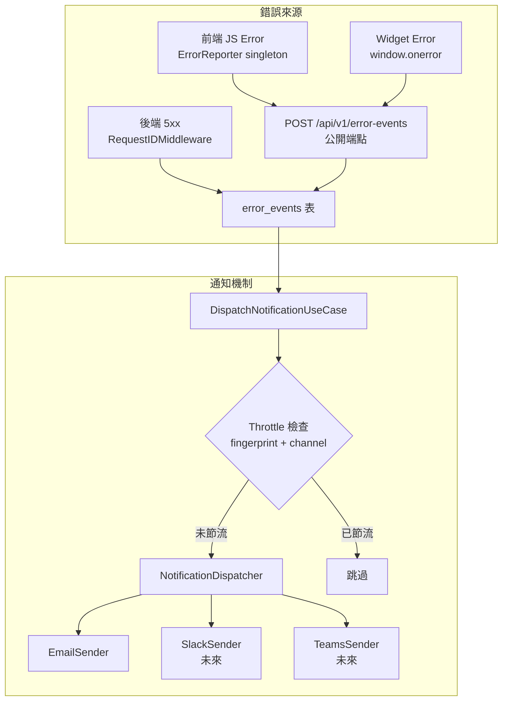
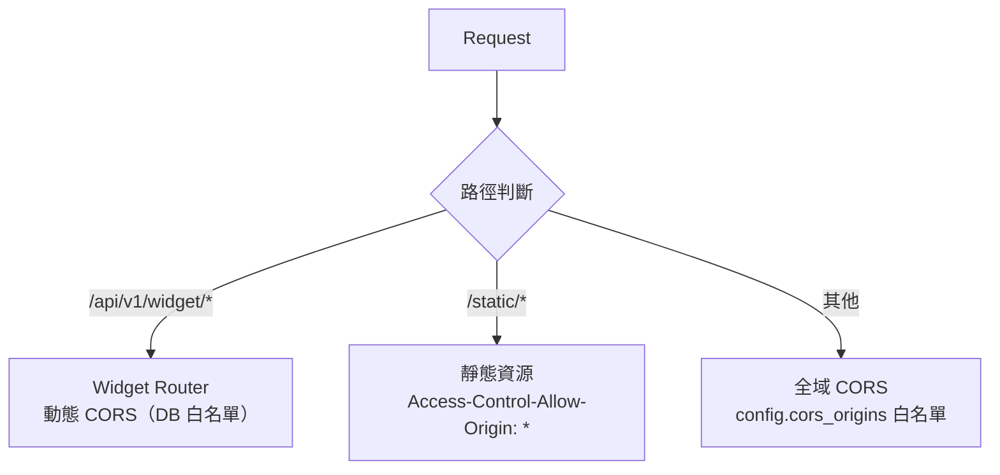
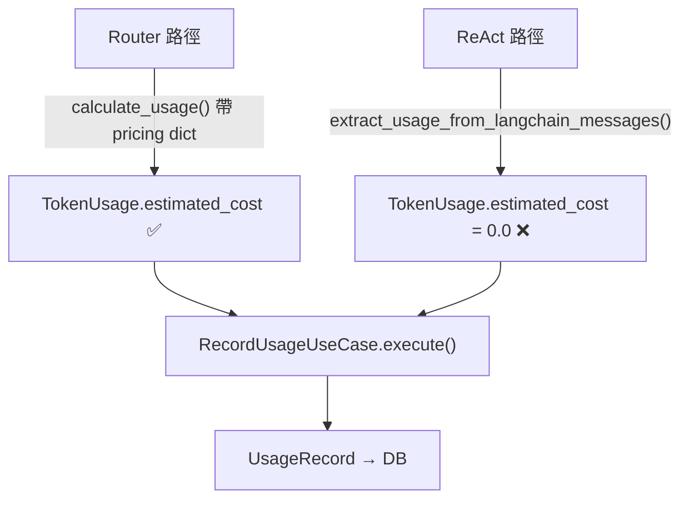
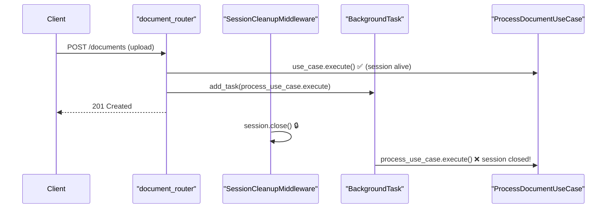
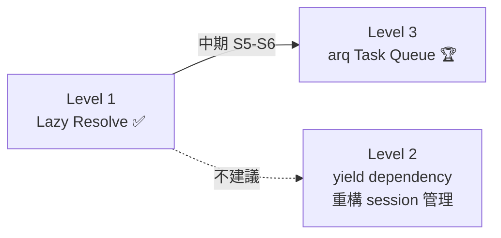
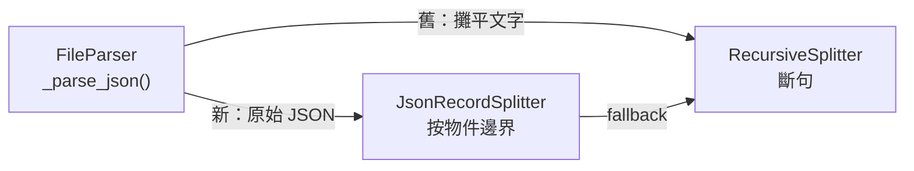
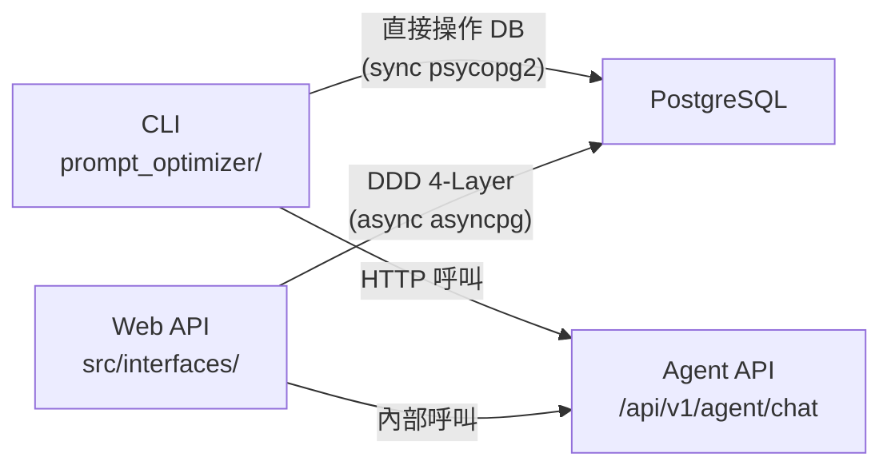
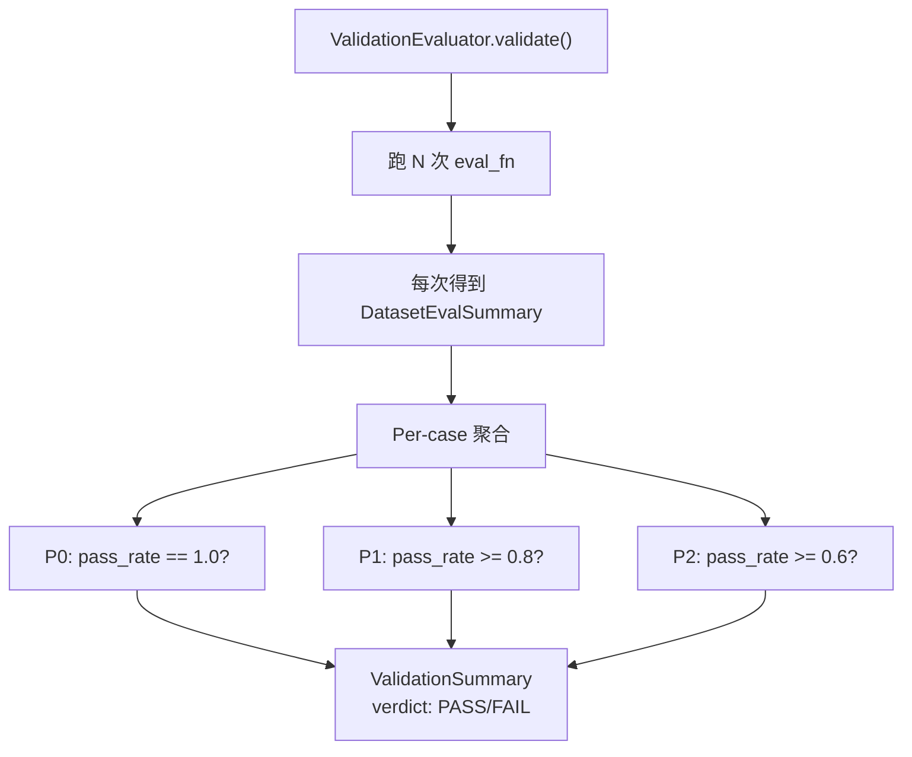

# Architecture Learning Journal

> 每次 Sprint / 功能完成後的架構學習筆記彙總。
> 用途：定期回顧、撰寫技術 blog、面試準備、團隊分享。
>
> 格式：每則筆記包含「Sprint 來源 → 主題 → 做得好 → 潛在隱憂 → 延伸學習」。

---

## 目錄

- [Prompt Optimizer 全棧 + 驗收評估 — DDD 新 BC + CLI/API 雙入口 + Statistical Validation](#prompt-optimizer-全棧--驗收評估--ddd-新-bc--cliapi-雙入口--statistical-validation)
- [JSON Record-Based Chunking — Content-Type 感知分塊 + Parser/Splitter 職責分離](#json-record-based-chunking--content-type-感知分塊--parsersplitter-職責分離)
- [Batch A 安全/品質修復 — Pydantic 結構化解析 + 精確 Tool Matching + Router 校驗](#batch-a-安全品質修復--pydantic-結構化解析--精確-tool-matching--router-校驗)
- [Widget FAB Greeting Bubble — 跨端全棧 Feature Flag + CSS 動畫狀態機](#widget-fab-greeting-bubble--跨端全棧-feature-flag--css-動畫狀態機)
- [Avatar 預覽 + System Admin 跨租戶授權 — Router 層 tenant_id 解析 + 元件複用策略](#avatar-預覽--system-admin-跨租戶授權--router-層-tenant_id-解析--元件複用策略)
- [Avatar 真實渲染 — CDN 動態載入策略 + Widget/SPA 雙軌 Renderer 架構](#avatar-真實渲染--cdn-動態載入策略--widgetspa-雙軌-renderer-架構)
- [Web Bot Widget + Avatar — IIFE Library Mode + Tenant Feature Gate + Agent Team 3 並行](#web-bot-widget--avatar--iife-library-mode--tenant-feature-gate--agent-team-3-並行)
- [System Admin UI 重構 — 保留租戶 Pattern + ErrorReporter Port/Adapter + Agent Team 並行](#system-admin-ui-重構--保留租戶-pattern--errorreporter-portadapter--agent-team-並行)
- [診斷規則可編輯化 — Singleton Config Pattern + Rule Engine 通用化](#診斷規則可編輯化--singleton-config-pattern--rule-engine-通用化)
- [Qdrant Payload Index + env_values 加密 — 隱憂驅動的跨層修復](#qdrant-payload-index--env_values-加密--隱憂驅動的跨層修復)
- [MCP Server Registry — 工具市集 Registry Pattern + Transport Abstraction](#mcp-server-registry--工具市集-registry-pattern--transport-abstraction)
- [Token Usage 預估成本 $0 修復 — Registry Fallback + API Schema 防禦](#token-usage-預估成本-0-修復--registry-fallback--api-schema-防禦)
- [Token 用量 Bot 關聯 + 成本修復 + Agent Timeout — 跨 4 DDD 層的 Query 最佳化](#token-用量-bot-關聯--成本修復--agent-timeout--跨-4-ddd-層的-query-最佳化)
- [RAG 品質診斷強化 — L1 Chunk-Level Scoring + Prompt Snapshot](#rag-品質診斷強化--l1-chunk-level-scoring--prompt-snapshot)
- [系統管理 Token 用量 — CQRS Q 側跨 BC JOIN + 權限分離](#系統管理-token-用量--cqrs-q-側跨-bc-join--權限分離)
- [Streaming Tool Hint + 回饋分析 SQL 聚合修復](#streaming-tool-hint--回饋分析-sql-聚合修復)
- [RAG 評估合併 1 call + 智慧 L1 跳過 + Streaming bug 修復](#rag-評估合併-1-call--智慧-l1-跳過--streaming-bug-修復)
- [RAG 評估觸發接線 + Unit Test 資料洩漏根因修復](#rag-評估觸發接線--unit-test-資料洩漏根因修復)
- [ReAct Streaming UX 優化 + Trace DI 修復 — 跨端串流體驗與測試隔離](#react-streaming-ux-優化--trace-di-修復--跨端串流體驗與測試隔離)
- [ReAct 補齊 + Audit 記錄 + 可觀測性 — 跨層大規模 Sprint](#react-補齊--audit-記錄--可觀測性--跨層大規模-sprint)
- [Error Tracking Dashboard — Strategy 模式通知 + 全端錯誤捕捉 + Agent Team 並行](#error-tracking-dashboard--strategy-模式通知--全端錯誤捕捉--agent-team-並行)
- [SQL 上傳修復 + 統一 Login API — 跨層 Bug Fix 與測試同步](#sql-上傳修復--統一-login-api--跨層-bug-fix-與測試同步)
- [LINE Webhook 效能最佳化全鏈路 — gRPC + 連線池 + 並行查詢](#line-webhook-效能最佳化全鏈路--grpc--連線池--並行查詢)
- [LINE Loading Animation + Webhook 效能最佳化](#line-loading-animation--webhook-效能最佳化)
- [JoyInKitchen MCP 資料匯入 — MySQL Dump 解析 + PostgreSQL 建表 + MCP Tool 即時查詢](#joyinkitchen-mcp-資料匯入--mysql-dump-解析--postgresql-建表--mcp-tool-即時查詢)
- [RAG Tool 重構 — 消除重複 LLM 呼叫](#rag-tool-重構--消除重複-llm-呼叫)
- [RAG Pipeline 效能 Trace — 分段計時 Instrumentation](#rag-pipeline-效能-trace--分段計時-instrumentation)
- [Streaming UX 分段 Hint + 寒暄路由優先修復](#streaming-ux-分段-hint--寒暄路由優先修復)
- [簡化 LLM Provider 架構 — Static Selector 移除 + Debug-Only UI 控制](#簡化-llm-provider-架構--static-selector-移除--debug-only-ui-控制)
- [Multi-Tenant System Admin — 獨立 Tenant + 跨租戶唯讀總覽](#multi-tenant-system-admin--獨立-tenant--跨租戶唯讀總覽)
- [Request Log Viewer — 異步 Fire-and-Forget 寫入 + Cross-Cutting 診斷工具](#request-log-viewer--異步-fire-and-forget-寫入--cross-cutting-診斷工具)
- [Background Task Session Leak 第三次修復 — Lazy Resolve Pattern](#background-task-session-leak-第三次修復--lazy-resolve-pattern)
- [Background Task Session 最佳實務研究 — Lazy Resolve 驗證 + arq 遷移規劃](#background-task-session-最佳實務研究--lazy-resolve-驗證--arq-遷移規劃)
- [Embedding 全站單一模型 + API Key 管理 + 401 自動登出](#embedding-全站單一模型--api-key-管理--401-自動登出)
- [Provider Settings 模型 DB 化 + Bot 模型選擇](#provider-settings-模型-db-化--bot-模型選擇)
- [DeepSeek Provider 集成 + Provider Settings 兩層開關簡化](#deepseek-provider-集成--provider-settings-兩層開關簡化)
- [Frontend Framework Migration — Next.js 16 → React + Vite SPA](#frontend-framework-migration--nextjs-16--react--vite-spa)
- [PostgreSQL 連線洩漏修復 — ContextVar Session 生命週期管理](#postgresql-連線洩漏修復--contextvar-session-生命週期管理)
- [Frontend E2E User Journeys — 雙角色覆蓋全功能](#frontend-e2e-user-journeys--雙角色覆蓋全功能)
- [Issue #15 隱憂修復 — Reprocess Task Tracking + Cross-BC JOIN](#issue-15-隱憂修復--reprocess-task-tracking--cross-bc-join)
- [Issue #15 — Chunk Quality Monitoring 品質指標 + 回饋關聯](#issue-15--chunk-quality-monitoring-品質指標--回饋關聯)
- [Issue #9 — API Rate Limiting + User Auth 身份體系](#issue-9--api-rate-limiting--user-auth-身份體系)
- [Issue #8 — Embedding 429 Rate Limit + Adaptive Batch Size](#issue-8--embedding-429-rate-limit--adaptive-batch-size)
- [Issue #7 — Integration Test Deadlock 根因修復](#issue-7--integration-test-deadlock-根因修復)
- [Issue #7 — Integration Test 基礎設施建立](#issue-7--integration-test-基礎設施建立)
- [E6 — Content-Aware Chunking Strategy](#e6--content-aware-chunking-strategy)
- [E5 — Redis Cache 統一遷移](#e5--redis-cache-統一遷移)
- [E4 — EventBus 死代碼移除 + Redis Cache 規劃](#e4--eventbus-死代碼移除--redis-cache-規劃)
- [E3 — 邊緣問題批次修復（Edge Case Batch Fix）](#e3--邊緣問題批次修復edge-case-batch-fix)
- [E2 完整版 — 企業級回饋分析系統](#e2-完整版--企業級回饋分析系統)
- [E2 MVP — 回饋收集 + Web/LINE 雙通路](#e2-mvp--回饋收集--webline-雙通路)
- [E1.5 — LINE Webhook 多租戶](#e15--line-webhook-多租戶)
- [E1 — System Provider Settings DB 化](#e1--system-provider-settings-db-化)
- [E0 — Tool 清理 + Multi-Deploy](#e0--tool-清理--multi-deploy)
- [S7 — Multi-Agent 2-Tier + Bot Management](#s7--multi-agent-2-tier--bot-management)
- [S6 — Agentic 工作流 + 多輪對話](#s6--agentic-工作流--多輪對話)
- [S5 — 前端 MVP + LINE Bot](#s5--前端-mvp--line-bot)
- [S4 — AI Agent 框架](#s4--ai-agent-框架)

---

## Batch A 安全/品質修復 — Pydantic 結構化解析 + 精確 Tool Matching + Router 校驗

> **Sprint 來源**：安全/品質審查 Batch A（C9/C10/C11/C16/C19/C22/C23）
> **日期**：2026-03-13

### 概述

6 項後端安全/品質隱憂一次修復，涵蓋 Application + Infrastructure + Interfaces 三層。使用 4 個 Agent 並行處理，所有工作互不重疊。

### 做得好的地方

- **Pydantic 結構化解析（C9/C10）**：LLM 回傳的 JSON 評分改用 `EvalScores` model 驗證，`ChunkScoreItem.normalize_score` field_validator 自動處理百分比字串（`"85%"`）和 0-100 尺度轉換，比手動 normalize 更安全且可維護
- **複雜度拆分（C11）**：`evaluate_combined` 從 C901=12 降至合規，抽出 `_build_eval_sections` / `_determine_layer_label` / `_extract_dimensions` 三個 static helper，每個都可獨立測試
- **精確匹配（C22）**：`_backfill_tool_output()` 以 `tool_call_id` 為主鍵匹配，解決同名 tool 多次呼叫的 output 錯位問題。Fallback 保留 `tool_name` 匹配確保向後相容
- **早期校驗（C16/C23）**：`_validate_llm_fields()` 在 Router 層攔截無效 provider，避免 runtime 才 crash
- **4 Agent 並行**：Bot validation / eval refactor / tool matching / auth tests 四條線零衝突完成

### 潛在隱憂

- **Pydantic `extra="ignore"` 吞未知欄位** → LLM 回傳新維度時無 warning，可能遺漏有用資訊 → 考慮改用 `extra="allow"` 或加 logger.debug → 優先級：低
- **`_VALID_LLM_PROVIDERS` 包含 `"mock"`** → 前端不應選擇 mock provider，但目前允許通過 → 考慮區分 internal/external providers → 優先級：低
- **react_agent_service C901 仍高** → `process_message_stream` 複雜度 35，雖然 `_backfill_tool_output` 抽出降了 2 點，但主體仍需進一步拆分 → 優先級：中

### 延伸學習

- **Pydantic field_validator `mode="before"`**：在型別轉換前執行，適合處理 LLM 回傳的非標準格式（字串百分比、整數分數等）
- **Static Method 作為 Pure Function**：三個 helper 都是 `@staticmethod`，無 side effect，易測試且不增加類別狀態複雜度
- 若想深入：搜尋「Pydantic V2 validators mode before vs after」「Cyclomatic Complexity refactoring Extract Method」

---

## Widget FAB Greeting Bubble — 跨端全棧 Feature Flag + CSS 動畫狀態機

> **Sprint 來源**：Widget FAB 招呼氣泡功能（commit `6929dc3`）
> **日期**：2026-03-13

### 概述

在 Widget FAB 按鈕旁新增可設定的招呼語氣泡，支援三種動畫模式（fade / slide / typewriter），管理員可在 Bot 設定中配置。跨 15 個檔案、涵蓋後端 DDD 4 層 + Widget TypeScript + 前端 React 表單。

**本次相關主題**：Full-Stack Feature Delivery、CSS Animation State Machine、DDD 跨層欄位擴展

### 做得好的地方

- **DDD 4 層一致性**：新增兩個欄位（`widget_greeting_messages` / `widget_greeting_animation`）嚴格走 Domain Entity → Infrastructure Model → Application UseCase → Interfaces Router 的標準路徑，沒有捷徑跳層
- **Widget 動畫狀態機設計**：三種動畫模式用 CSS class toggle 實現，避免 JavaScript 直接操作 style，保持 CSS 與 JS 的關注點分離
- **Typewriter 動畫**：遞迴 `setTimeout` 逐字渲染，簡潔且不依賴第三方動畫庫
- **生命週期管理**：Panel 開啟時 `stopGreeting()`、關閉時 `restartGreeting()`，正確清理 timer 避免記憶體洩漏
- **向下相容**：`greeting_messages` 預設空陣列，未設定時不渲染氣泡，零 breaking change
- **Avatar Live 模式適配**：CSS 用 `~` 相鄰選擇器（`.aw-fab--avatar-live ~ .aw-greeting`）自動調整氣泡位置

### 潛在隱憂

- **Timer 累積風險** → `scheduleNextGreeting()` 的遞迴排程 + `restartGreeting()` 未清理上一輪 timer，快速開關 panel 可能累積多個 `setTimeout` → 建議在 `restartGreeting()` 開頭加 `clearTimeout` → **優先級：中**
- **Typewriter 動畫中斷** → 快速切換訊息時，前一個 `typeText()` 的遞迴 chain 仍在執行（透過 `this.greetingEl` null check 保護，但文字可能短暫交錯）→ 可引入 `AbortController` 或 generation counter 來取消前一輪 → **優先級：低**
- **DB Migration 缺失** → 本次用 `ALTER TABLE` 手動加欄位，沒有 Alembic migration 檔案，部署到其他環境需手動執行 SQL → 應建立 Alembic 基礎設施或至少記錄 migration SQL → **優先級：高**
- **前端表單無上限驗證** → `widget_greeting_messages` Zod schema 只限每筆 100 字，但未限制筆數，理論上可無限新增 → 建議加 `.max(10)` 或類似上限 → **優先級：低**

### 延伸學習

- **CSS Animation State Machine**：本次用 class toggle 驅動動畫轉場，這是 CSS-first 動畫的經典模式。更複雜的場景可參考 [FLIP technique](https://aerotwist.com/blog/flip-your-animations/)（First-Last-Invert-Play）來處理佈局動畫
- **Recursive setTimeout vs setInterval**：本次選用遞迴 `setTimeout`（每次 callback 結束才排下一個），比 `setInterval` 更安全 — 不會因為 callback 執行時間長而累積排程。這是前端定時任務的最佳實踐
- **DDD 欄位擴展 Checklist**：新增一個「可選設定欄位」的標準路徑已高度模式化（Entity → Model → Repository mapping → Command → UseCase → Request/Response → Router），可考慮建立 code generator 或 snippet 加速

---

## Avatar 預覽 + System Admin 跨租戶授權 — Router 層 tenant_id 解析 + 元件複用策略

> **Sprint 來源**：Avatar 預覽 + System Admin Bot 跨租戶修復
> **本次相關主題**：Router 層授權邏輯、effective_tenant_id Pattern、前端 Renderer 複用

### 做得好的地方

- **Router 層攔截，Use Case 層不動**：system_admin 的 tenant_id 轉換只在 `agent_router.py` 和 `conversation_router.py`（Interfaces 層）處理，`SendMessageUseCase` 的 `_load_bot_config()` 跨租戶驗證邏輯完全不變。這符合 DDD 的分層原則 — 授權是 Interfaces 層關注點，Domain 層只管業務規則。
- **effective_tenant_id Pattern**：在 Router 進入 Use Case 前解析「實際要用的 tenant_id」，而非在 Use Case 內部加 if/else。這讓 Use Case 保持單一職責，不需要知道「誰在呼叫」。
- **前端 AvatarPreview 完全複用現有 Renderer**：`createLive2DRenderer` 和 `createVRMRenderer` 已在 `avatar-panel.tsx`（Chat 頁面）使用過，新的 `avatar-preview.tsx` 用相同的 dynamic import + dispose cleanup pattern，零重複實作。

### 潛在隱憂

- **system_admin 權限擴散風險**：目前用 `tenant.role == "system_admin"` 判斷，分散在 `agent_router.py` 和 `conversation_router.py`。若未來更多 router 需要同樣邏輯，應提取為共用 dependency（如 `resolve_effective_tenant(tenant, bot_id)`）。→ 建議提取時機：第 3 個 router 需要時。→ 優先級：低
- **AvatarPreview 每次 props 變化都重建 Renderer**：`useEffect` 依賴 `[avatarType, avatarModelUrl]`，若使用者快速切換角色會頻繁 init/dispose（pixi.js Application 建立成本不低）。→ 建議：加 debounce 或 `useDeferredValue`，但目前 Select 操作頻率低，可暫不處理。→ 優先級：低

### 延伸學習

- **Gateway Pattern（API Gateway 授權轉換）**：本次的 effective_tenant_id 就是簡化版的 Gateway Pattern — 在入口處將外部身份轉為內部操作身份。在微服務架構中，API Gateway 常做類似的事：根據 JWT role 決定下游請求帶哪個 tenant context。
- **若想深入**：搜尋「API Gateway identity mapping」或參考 Sam Newman《Building Microservices》第 10 章 Security。

---

## Avatar 真實渲染 — CDN 動態載入策略 + Widget/SPA 雙軌 Renderer 架構

> **Sprint 來源**：Issue #22 — Avatar 真實渲染 — Live2D + VRM + 後台 Chat 顯示
> **日期**：2026-03-12
> **涉及檔案**：19 個（Widget 4 + Frontend 10 + Backend 2 + BDD 2 + 模型檔案）
> **非 trivial 判定**：跨端（Widget + Frontend SPA）、10+ 檔案、新增 CDN 動態載入 Pattern

### 本次相關主題

CDN 動態載入策略、Widget IIFE vs SPA npm 雙軌依賴、AvatarRenderer Interface 統一、Zustand Store 擴展

### 做得好的地方

- **雙軌依賴策略**：Widget（IIFE）用 CDN `<script>` 動態載入 pixi.js/three.js，Admin SPA 用 npm + Vite code-splitting `import()`。同一個 `AvatarRenderer` interface 在兩個環境都實現，但載入策略完全不同 — 這是 **Strategy Pattern** 在 module loading 層面的應用
- **CDN Loader 去重設計**：`cdn-loader.ts` 使用 `Set<string>` 防止同一 script 重複載入 + timeout 機制防止 CDN 掛起阻塞 UI
- **Live2D CDN 版本固釘**：Cubism Core 自建託管（`/static/libs/`），pixi.js/pixi-live2d-display 用固定版本 CDN — 避免第三方 CDN 升版導致破壞
- **Three.js 版本降級決策**：Widget VRM renderer 使用 three@0.160.1 而非最新版，因為這是最後支援 `examples/js/` script-tag-compatible GLTFLoader 的版本 — 這是一個正確的務實決策
- **AvatarPanel Cleanup Pattern**：React `useEffect` return cleanup 中 `cancelled` flag 防止 race condition（快速切換 Bot 時舊 renderer 不會掛載到新 container）
- **Agent Team 3 並行**：model-worker（模型下載）、widget-worker（渲染器）、frontend-worker（UI 元件）同步執行，無互相依賴 — 有效利用 TaskCreate + blockedBy 結構

### 潛在隱憂

- **CDN 可用性風險** → cdn.jsdelivr.net 若下線，Widget Live2D/VRM 全部失效 → 建議：加入 fallback CDN（unpkg.com）或預載偵測機制 → 優先級：中
- **Widget bundle 膨脹監控缺失** → 目前 14.39KB 但沒有 CI 的 bundle size check → 建議：在 CI 加 `size-limit` 或 Vite bundle analyzer 設 25KB 上限告警 → 優先級：低
- **Live2D Cubism Core 授權** → live2dcubismcore.min.js 是 Live2D Inc. 專有授權，非 OSS — 商用部署前需確認授權範圍 → 優先級：高（商用前必解）
- **pixi-live2d-display 維護停滯** → v0.4.0 已久未更新，pixi.js v8 不相容 — 未來升級 pixi.js 會是 breaking change → 優先級：低

### 延伸學習

- **Module Federation**：若未來需要在多個 SPA 共享 avatar 渲染能力，可研究 Webpack/Vite Module Federation 取代 CDN script tag — 搜尋：「Vite Module Federation plugin」
- **Web Worker 渲染卸載**：Live2D/VRM 的 animation loop 佔主線程，高訊息量時可能影響 chat UI 流暢度 — 搜尋：「OffscreenCanvas transferControlToOffscreen Three.js」
- **CDN Fallback Chain Pattern**：搜尋：「JavaScript CDN fallback chain pattern」— 多個 CDN 按優先級嘗試，第一個成功即停

---

## Web Bot Widget + Avatar — IIFE Library Mode + Tenant Feature Gate + Agent Team 3 並行

> **Sprint 來源**：S5 Widget + Avatar（Issue #21）
> **日期**：2026-03-12
> **影響範圍**：Backend DDD 4 層 + Widget 新專案 + Frontend 管理後台（49 files, +3152 lines）

### 本次相關主題

Vite Library Mode IIFE、Tenant Feature Gate Pattern、Avatar 動態載入、Agent Team 3-worker 並行

### 做得好的地方

- **Tenant Feature Gate Pattern**：`allowed_widget_avatar` 仿照 `allowed_agent_modes` 模式，在 Tenant entity 加布林旗標，widget_router 在回傳 config 時檢查權限、前端 UI 依權限 disable — 三層一致的 gate 機制
- **Vite Library Mode IIFE**：Widget 打包為單一 `widget.js`（11KB / 3.9KB gzip），純 vanilla TS 無框架依賴，`postbuild` 自動複製到 backend static — 部署零配置
- **Avatar 動態載入**：`avatar-manager.ts` 用 `import()` 按需載入 Live2D/VRM 渲染器，avatar_type 為 "none" 時完全不載入，零 overhead
- **Agent Team 並行**：3 worker（backend / widget / frontend）並行開發，各自獨立檔案群無衝突，開發效率 ~3x
- **DDD 4 層貫穿一致**：新增 5 個欄位（1 tenant + 4 bot），嚴格遵循 Entity → UseCase → Model/Repo → Router 順序

### 潛在隱憂

- **Avatar 模型檔體積**：Live2D/VRM 模型檔可達數 MB，目前由 StaticFiles serve — 生產環境應走 CDN + Cache-Control → 優先級：中
- **Widget CSS 隔離**：widget.css 直接注入 `<style>` 到宿主頁面，可能與宿主樣式衝突 — 應考慮 Shadow DOM 封裝 → 優先級：中
- **SSE 連線管理**：Widget chat 使用 `fetch` + `ReadableStream` 模擬 SSE（非 EventSource），沒有自動重連機制 — 弱網環境可能斷線 → 優先級：低
- **預設角色常數放 Domain 層**：`PRESET_AVATARS` 包含 URL 路徑（`/static/models/...`），嚴格來說是 Infrastructure 關注點 — 但因為是靜態常數且由 Interfaces 層消費，實務上可接受 → 優先級：低

### 延伸學習

- **Shadow DOM Encapsulation**：Web Component 的 Shadow DOM 可完全隔離 CSS，避免宿主頁面互相污染 — 跟 Widget 嵌入場景直接相關
- **Feature Flag / Feature Gate**：本次用簡單的 DB boolean，生產級可用 LaunchDarkly / Unleash 等服務做漸進式 rollout
- **Dynamic Import + Code Splitting**：Vite 的 `import()` 在 library mode 下會 inline 為同一 IIFE bundle（不做 chunk split），若 avatar renderer 引入大型 3D 庫需考慮外部化

---

## System Admin UI 重構 — 保留租戶 Pattern + ErrorReporter Port/Adapter + Agent Team 並行

**Sprint 來源**：Issue #20 — System Admin UI 重構（5 Phase 多功能需求變更）
**相關主題**：System Tenant 保留租戶、ErrorReporter Port/Adapter、ContextVar 橋接、Agent Team 並行協調

### 做得好的地方

- **保留租戶（Sentinel Tenant）設計**：以固定 UUID `00000000-0000-0000-0000-000000000000` 作為系統租戶，讓 system_admin 帳號也有 `tenant_id`，徹底避免 User entity 的 `tenant_id` nullable 問題。所有角色統一用 `tenant_id` 欄位，判斷是否為系統帳號只需 `tenant_id == SYSTEM_TENANT_ID`，不需增加新欄位或改驗證邏輯。
- **Domain Entity 自我驗證（`_validate_tenant_role`）**：角色與租戶綁定的業務規則放在 User entity 內部，`__post_init__` 自動觸發，不依賴外部 Guard。system_admin 必須綁定系統租戶、非 system_admin 不可綁定系統租戶 — 雙向約束在 Domain 層完成。
- **ErrorReporter Port/Adapter 分離**：Domain 層定義 `ErrorReporter` ABC + `ErrorContext` frozen dataclass，Infrastructure 提供 `DBErrorReporter` 實作。未來接 Sentry 或 CompositeReporter 零修改 Domain 層。
- **ContextVar 橋接 exception handler → middleware**：FastAPI exception handler 執行在 middleware `call_next()` 內部，無法直接回傳 error 資訊。用 `ContextVar[str | None]` 在 exception handler 寫入、middleware 讀取，巧妙繞過 Starlette 生命週期限制。
- **Agent Team 4 批次並行**：5 agents（backend-1/2 + frontend-1/2 + lead）依據依賴圖分 4 批次執行，container.py 唯一衝突點由 lead 手動 merge（兩個 agent 各加不同 Provider，無邏輯衝突）。67 files 一次性完成。

### 潛在隱憂

- **JWT base64 decode（無驗簽）取 tenant_id 寫入日誌**：middleware 為記錄日誌的 tenant_id 做 base64 decode JWT payload 但不驗簽。若 JWT 被竄改，日誌的 tenant_id 可能不正確。但這僅影響日誌品質（非授權判斷），且 auth guard 仍在 endpoint 層驗簽，風險低。 → 優先級：低
- **`SYSTEM_TENANT_ID` 硬編碼在前後端多處**：後端 `constants.py`、前端 `admin-tenant-filter.tsx`、`admin-tenants.tsx` 都硬編碼此 UUID。若需變更需同步修改多處。 → 建議前端從 `/api/v1/config` 取得常數而非硬編碼 → 優先級：低
- **DB Migration 手動 SQL**：`request_logs` 加 `tenant_id`/`error_detail`、`tenants` 加 `monthly_token_limit` 需手動跑 ALTER TABLE。目前無自動化 migration 工具（如 Alembic），生產環境需人工操作。 → 建議引入 Alembic → 優先級：中
- **admin_router 6 個 User CRUD 端點未做分頁**：`find_all()` 直接回傳全部使用者，帳號數量增長後有效能風險。 → 待帳號量級增長時加分頁 → 優先級：低

### 延伸學習

- **Sentinel Value Pattern**：系統租戶是 Sentinel Value 的典型應用 — 用特殊值替代 null，簡化判斷邏輯。Eric Evans 在 DDD 中稱之為 Special Case Pattern。類似應用：NullObject、Guest User、Anonymous Tenant。
- **ContextVar 在 ASGI 生命週期中的角色**：ContextVar 在 asyncio 中跟隨 Task context 傳播，是 ASGI middleware/handler 間傳遞 request-scoped 資料的標準方式。本次用於 error 橋接，之前用於 session scope — 兩者都是利用 ContextVar 的 request-scoped 特性。
- **若想深入**：搜尋「ASGI middleware ContextVar propagation」、「Starlette middleware exception handler lifecycle」

---

## 診斷規則可編輯化 — Singleton Config Pattern + Rule Engine 通用化

**Sprint 來源**：Issue #19 — 診斷規則可編輯化（可觀測性增強）
**相關主題**：Singleton Config Pattern、Rule Engine 通用化、Falsy Fallback 陷阱

### 做得好的地方

- **Singleton 設計一致性**：參照 `SystemPromptConfig` 的 `id="default"` 模式，`DiagnosticRulesConfig` 採用相同的 singleton upsert 策略，零 seed 即可運作（DB 無資料 → 回傳硬編碼預設值）
- **向後相容**：`diagnose()` 新增可選 `rule_config` 參數，None 時自動使用預設規則。既有呼叫方無需修改
- **Combo Rules 結構化**：將原本的硬編碼 if/else 交叉規則轉為 `{dim_a, op_a, threshold_a, dim_b, op_b, threshold_b}` 的通用結構，DB 可持久化、前端可編輯、新規則免改程式碼
- **BDD 先行**：2 features / 6 scenarios 在實作前定義完成，TDD 紅燈→綠燈順利

### 潛在隱憂

- ~~**JSON 欄位無 schema 驗證** → 前端送進 malformed rules（如缺 `dimension` 欄位）會在 `diagnose()` 時 KeyError。建議加 Pydantic model 驗證 PUT body → 優先級：中~~ ✅ 已修復：`SingleRuleSchema` / `ComboRuleSchema` Pydantic model 取代 `list[dict]`
- **全域 singleton 無版本控制** → 多人同時編輯可能互蓋。若未來多管理員場景，考慮 optimistic lock（`updated_at` 比對） → 優先級：低

### 延伸學習

- **Python Falsy 陷阱**：`[] or None` == `None`。在本次實作中差點導致空規則列表被誤判為 None 而 fallback 到預設值。修復方法：用 `is not None` 明確判斷
- **Rule Engine Pattern**：本次從硬編碼 tuples 演進到 dict-based 結構化規則，是輕量 Rule Engine 的雛形。若規則繼續複雜化（如 OR 條件、巢狀規則），可考慮引入 DSL 或 rule engine library（如 `business-rules`）
- 若想深入：搜尋「Business Rules Engine Python」或「Martin Fowler Specification Pattern」

---

## Qdrant Payload Index + env_values 加密 — 隱憂驅動的跨層修復

**Sprint 來源**：MCP Server Registry 隱憂修復（架構筆記追蹤項）
**相關主題**：Payload Index 冪等建立、AES 加密/解密生命週期、Masked Value 防覆寫模式

### 做得好的地方

- **隱憂驅動開發**：上一輪 MCP Server Registry 架構筆記明確標註「env_values 加密未實施（優先級：高）」和「Qdrant payload index 缺失」，本次修復直接追蹤隱憂清單，形成良性回饋迴圈
- **冪等 Payload Index**：`_ensure_payload_indexes()` 在 `ensure_collection()` 末尾呼叫，對 `tenant_id` 和 `document_id` 建立 keyword index。Qdrant 的 `create_payload_index` 本身冪等，已存在不報錯，設計安全
- **加密三階段完整**：Create（加密寫入）→ Update（masked `***` 保留原密文 / 新值重新加密）→ Send（解密 + fallback plaintext），三個 Use Case 各自負責對應階段，職責清晰
- **Masked Value 防覆寫**：`UpdateBotUseCase._encrypt_bindings()` 對 `***` 值保留 DB 中的密文，避免前端回傳遮罩值覆蓋真實密鑰 — 這是 secret 管理的常見陷阱
- **Graceful Fallback**：`SendMessageUseCase` 解密失敗時 fallback 到原始值，相容遷移前的明文資料，不會因為歷史資料未加密而中斷服務
- **BDD 先行**：3 個 Scenario 覆蓋 Create 加密、Update masked 保留、Agent 解密替換，符合方法論

### 潛在隱憂

- **加密 Key 輪換未考慮** → 目前 `AESEncryptionService` 用單一固定 key，若需輪換（key rotation），歷史密文需批次 re-encrypt。建議未來加 key versioning（密文前綴標記版本號）→ **優先級：低**
- **Qdrant Index 建立時機** → 每次 `ensure_collection` 都觸發 `_ensure_payload_indexes`，高頻 upsert 場景會產生多餘的 index 建立嘗試。Qdrant 內部處理冪等但仍有 RPC 開銷，可考慮 startup-only 建立 → **優先級：低**
- **env_values 解密在 Application 層** → `SendMessageUseCase` 直接呼叫 `EncryptionService.decrypt()`，若未來有其他 Use Case 也需解密 env_values，可能出現重複邏輯。考慮抽取至 Domain Service 或 BotMcpBinding 自身的 `decrypted_env()` 方法 → **優先級：中**

### 延伸學習

- **Envelope Encryption**：AWS KMS 等雲服務的標準做法 — 用 master key 加密 data key，data key 加密實際資料。若未來需要更高安全等級，可參考此模式
- **Secret Masking Pattern**：GitHub / GitLab CI 的 secret 管理都用 `***` 遮罩 + 不回傳原值的設計，本次實作與業界慣例一致
- 若想深入：搜尋「envelope encryption pattern」、「secret rotation strategy」

---

## MCP Server Registry — 工具市集 Registry Pattern + Transport Abstraction

**Sprint 來源**：E7 MCP Server Registry (Issue #18)
**相關主題**：Registry Pattern、Strategy Pattern、Transport Abstraction、DDD Bounded Context 擴展

### 做得好的地方

- **Registry Pattern 正確應用**：將 MCP Server 配置從每個 Bot 的 `mcp_servers` JSON 抽離到集中式 Registry，消除重複配置。Bot 透過 `mcp_bindings`（含 `registry_id` + `enabled_tools` + `env_values`）引用 Registry，實現「註冊一次，多處使用」
- **Transport Strategy 抽象**：`CachedMCPToolLoader.load_tools()` 接受 `dict | str` 參數，根據 `transport` 欄位分流 HTTP（streamablehttp_client）或 stdio（stdio_client），遵循 Open-Closed Principle — 新增 transport 只需加分支，不改介面
- **URL 模板替換**：`{VAR_NAME}` 模板在 `SendMessageUseCase` 中透過 per-binding `env_values` 替換，敏感值不存在 Registry 而是存在每個 Bot 的 binding 中，實現安全隔離
- **Legacy 向後相容**：若 Bot 無 `mcp_bindings` 則 fallback 到原有 `mcp_servers` 欄位，漸進式遷移不破壞既有 Bot
- **死碼清理**：刪除 `ReActAgentService._load_mcp_tools_with_stack` 重複邏輯，統一使用 `CachedMCPToolLoader`，減少維護負擔
- **完整 BDD 覆蓋**：18 個 scenarios 覆蓋 Registry CRUD、Discover（HTTP+stdio）、Test Connection、Bot Binding 解析、Tool Loader stdio，335 unit tests pass

### 潛在隱憂

- **env_values 加密存儲未實施** → 目前 `mcp_bindings` 中的 `env_values`（含 API Key）以明文 JSON 存在 `bots` 表。應用 `AESEncryptionService` 在 Repository 層加密/解密 → **優先級：高**
- **Discover 使用 ThreadPoolExecutor** → `DiscoverMcpToolsUseCase` 在獨立線程+事件迴圈中執行 MCP 連線，避免 TaskGroup 巢套。但 `loop.run_until_complete` 在高併發下可能成為瓶頸，未來應考慮 dedicated worker 或 connection pool → **優先級：中**
- **Registry 刪除不清理 Bot 引用** → 刪除 Registry entry 後，已綁定該 entry 的 Bot 在 runtime 會 graceful skip（reg not found），但不主動清理 `mcp_bindings`。考慮加 soft-delete 或 cascade warning → **優先級：低**
- **stdio process 生命週期** → 每次 Agent 呼叫都 spawn 新 stdio process → initialize → list_tools → close。高頻場景應考慮 process pool 或 persistent connection → **優先級：中**

### 延伸學習

- **Service Registry Pattern**：本次實作等同於 Microservices 中的 Service Registry（如 Consul/Eureka），但用於 MCP 工具發現。若未來 MCP Server 數量增長，可加入 health check 定期巡檢 + circuit breaker
- **Strategy + Abstract Factory**：Transport 分流（HTTP vs stdio）是 Strategy Pattern 的教科書案例。若再加 WebSocket transport，只需在 `load_tools` 加一個 `elif` 分支。更正規的做法是用 Abstract Factory 產出不同 Transport Handler
- **若想深入**：搜尋 "MCP Protocol specification stdio vs HTTP transport"、"Service Registry Pattern microservices"、Martin Fowler "Plugin" pattern

---

## Token Usage 預估成本 $0 修復 — Registry Fallback + API Schema 防禦

**Sprint 來源**：Bug Fix (Issue #17)
**相關主題**：Data Integrity、Defensive Programming、API Schema 完整性

### 做得好的地方

- **兩層防禦設計**：Infrastructure 層 Factory 加 registry fallback（即時修復），同時 Interfaces 層 API Schema 補欄位（根因修復），確保未來前端 round-trip 不再遺失定價資料
- **BDD 先行**：3 個 regression scenarios 確保修復不會回退——factory fallback、registry miss、cost prefix fallback
- **資料修復分離**：`seeds/fix_pricing.py` 獨立 script，不污染業務邏輯，執行後可丟棄

### 潛在隱憂

- **Schema 欄位默認值陷阱**：`input_price: float = 0.0` 讓 Pydantic 在欄位缺失時靜默填 0，無法區分「真的是免費模型」vs「前端沒傳」。→ 考慮用 `Optional[float] = None` 區分，或在 Use Case 層加驗證邏輯 → 優先級：低
- **Registry 硬編碼定價**：`model_registry.py` 的價格需手動更新，OpenAI 調價時容易遺漏。→ 未來可考慮從 API 或設定檔動態載入 → 優先級：低
- **DB 既有資料一致性**：跑完 `fix_pricing.py` 後，若前端在 Schema 修復前再次更新 provider settings，定價又會歸零。需確保部署順序：後端先上（含 Schema 修復），再跑 seed → 優先級：中

### 延伸學習

- **Schema Evolution 策略**：API Schema 新增欄位時如何確保向後相容？本次用 `= 0.0` default 避免 breaking change，但更嚴謹的做法是 API versioning
- **若想深入**：搜尋「API Schema Evolution Patterns」、「Tolerant Reader Pattern」（Martin Fowler）

---

## Token 用量 Bot 關聯 + 成本修復 + Agent Timeout — 跨 4 DDD 層的 Query 最佳化

> **Sprint 來源**：Token Usage 頁面三個 Bug 修復
> **日期**：2026-03-10
> **檔案數**：10+ files（跨 4 DDD 層 + 前端）

### 本次相關主題

Query Model 反正規化、LLM 輸出正規化、Config 外部化

### 做得好的地方

- **CQRS Q 側反正規化**：`token_usage_records` 直接加 `bot_id` 欄位，查詢從 4-table JOIN（usage→message→conversation→bot）簡化為 2-table JOIN（usage→bot）。這是典型的 Read Model 最佳化——犧牲少量寫入冗餘換取查詢效能和可靠性
- **LLM 輸出防禦性解析**：`_parse_scores` 正規化 `chunk_scores` 的 `score` 值（字串→float、百分比→0-1 scale），防止 LLM 回傳格式不一致導致前端 NaN
- **Config 外部化**：`agent_llm_request_timeout` 和 `agent_stream_timeout` 從 hardcode 移至 `Settings`，timeout 錯誤訊息也用 f-string 動態顯示
- **通用演算法 vs hardcode**：`pricing.py` 的 prefix fallback 用 `model.startswith(key)` 一次解決所有帶日期後綴的 model name，不需逐模型維護

### 潛在隱憂

- **bot_id 寫入時機**：目前在 `Interfaces` 層（agent_router）傳入 `bot_id`，而非在 `Application` 層自動填充。若新增其他入口（如 LINE webhook 的 usage 記錄），需記得傳入 bot_id → 建議：未來考慮在 `SendMessageUseCase` 層記錄 usage，而非在 router → **優先級：低**
- **prefix match 假陽性**：`model.startswith(key)` 可能匹配過寬（如 `gpt-5` 會匹配 `gpt-5-mini` 的 pricing）。目前 DB 中 model key 夠獨特所以不成問題，但若加入 `gpt-5` 和 `gpt-5-mini` 同時存在的定價，需改用更精確的匹配（longest prefix match）→ **優先級：低**
- **LLM chunk_scores 格式脆弱性**：eval LLM 返回的 JSON 格式無 schema 驗證，完全依賴 prompt engineering 控制輸出格式。若改用 structured output（如 OpenAI function calling / JSON mode），可確保型別安全 → **優先級：中**

### 延伸學習

- **CQRS Read Model 反正規化**：本次是 CQRS 的 Q 側經典操作——在 Command 端（寫入）多存一個冗餘欄位，讓 Query 端查詢更簡單。這比在查詢端做複雜 JOIN 更可靠
- **Defensive Parsing Pattern**：LLM 輸出永遠不可信，需在 Application 層做 sanitize/normalize。類比 Web 開發的「永遠不信任用戶輸入」原則
- 若想深入：搜尋「CQRS read model projection」、「LLM structured output validation」

---

## RAG 品質診斷強化 — L1 Chunk-Level Scoring + Prompt Snapshot

> Sprint 來源：可觀測性擴充 — RAG 評估 L1 逐 chunk 評分 + Trace prompt snapshot

**本次相關主題**：Domain Entity 擴充策略、LLM Structured Output 解析、可觀測性 Metadata 設計

### 做得好的地方

- **零成本擴充**：chunk_scores 在同一次 LLM call 內要求，不增加 API 費用；prompt_snapshot 純 metadata 寫入，零額外成本
- **向後相容設計**：`EvalDimension.metadata` 和 `RAGTraceRecord.prompt_snapshot` 皆 nullable，既有記錄不受影響，DB JSON 欄位無需 schema migration
- **DDD 層級清晰**：Domain 只加 dataclass field（純邏輯），Application 負責 prompt 改良和解析，Infrastructure 加 DB column，嚴格遵循依賴方向
- **前端漸進式渲染**：chunk_scores 僅在有值時顯示子列表；prompt snapshot 預設收合避免干擾

### 潛在隱憂

- **LLM 輸出不穩定**：chunk_scores 依賴 LLM 回傳正確 JSON 結構，不同模型可能遺漏 reason 或格式不一致 → 建議未來加 JSON Schema validation / Pydantic 解析 → 優先級：中
- **prompt_snapshot 欄位大小**：使用 TEXT type 可存數千字，但若 system prompt 包含大量知識庫注入內容可能達 10KB+ → 建議設 max length 或壓縮 → 優先級：低
- **evaluate_combined 複雜度上升**：C901 已達 11（閾值 10），每次加新 section 會加劇 → 建議拆分為 `_build_l1_section()` / `_build_l2_section()` 等 helper → 優先級：中

### 延伸學習

- **Structured Output Parsing**：LLM 回傳 JSON 的穩定性問題，可參考 OpenAI Function Calling 或 Instructor 庫的 schema enforcement 策略
- **Observability Metadata 設計**：如何在不影響查詢效能的前提下擴充追蹤欄位，可參考 OpenTelemetry 的 span attributes 設計理念

---

## 系統管理 Token 用量 — CQRS Q 側跨 BC JOIN + 權限分離

> Sprint 來源：系統管理擴充 — Token 用量統計頁面 + 回饋分析成本表簡化

**本次相關主題**：CQRS 讀側設計、跨 BC JOIN、權限層級分離、統計查詢效能

### 做得好的地方

- **CQRS Q 側 direct-query**：`observability_router.GET /token-usage` 跳過 DDD Use Case，直接在 Router 層組裝 4 表 LEFT JOIN（`token_usage_records` + `messages` + `conversations` + `bots`）。統計聚合場景不需要 Domain 邏輯保護，直接 SQL 查詢符合 CQRS 社群實踐
- **權限分離設計**：成本資訊（unit_cost, total_cost）從租戶級「回饋分析」頁面抽離至系統管理級「Token 用量」頁面。租戶管理員只看 Bot 用量摘要（BotUsageSummaryCards），系統管理員看完整成本明細。符合最小權限原則
- **前端元件分層清晰**：Type → Hook（use-token-usage） → 3 個視覺元件（PieChart / BarChart / DetailTable） → Page 組裝，每層職責單一，可獨立測試
- **舊元件乾淨移除**：TokenCostTable + 其 integration test 完整刪除，未留下 dead code 或 re-export shim

### 潛在隱憂

- ~~**4 表 JOIN 效能隨資料成長** — 目前 `token_usage_records` 資料量小，4 表 JOIN 無壓力。當記錄達 100k+ 時，`GROUP BY bot_id, model_used` 的排序成本會顯著增加。→ 建議：為 `token_usage_records` 建立 `(tenant_id, created_at)` 複合索引 + 考慮 date range 過濾參數 → 優先級：中~~ ✅ 已修復：新增 `(tenant_id, bot_id, created_at)` 複合索引
- **Router 層 SQL 膨脹風險** — direct-query 模式方便但可能導致 Router 層累積過多 raw SQL。若未來 /token-usage 需要更多維度（按日期區間、按 Provider 分組），SQL 會越來越長。→ 建議：抽出 `TokenUsageQueryService`（Application 層的 Query Service，不是 Use Case），專責統計查詢 → 優先級：低
- **前端無 date range 過濾** — 目前拉全量資料渲染圖表，當資料量大時前端記憶體和渲染效能會受影響。→ 建議：後續加入日期區間 filter（後端 query parameter + 前端 DateRangePicker）→ 優先級：中

### 延伸學習

- **CQRS Read Model vs Direct Query**：本次用 direct-query（Router 層 SQL），適合簡單統計。若查詢複雜度持續增加，可演進為 Materialized View 或專屬 Read Model table（定期由 Domain Event 更新），在一致性與效能間取捨
- **權限層級與 UI 拆分**：將同一份資料依權限拆成不同頁面（而非在同一頁用 `if (isAdmin)` 控制可見性），符合 RBAC 最佳實踐。每個頁面的 API 可獨立設定 auth middleware，攻擊面更小

---

## Streaming Tool Hint + 回饋分析 SQL 聚合修復

> Sprint 來源：Bug Fix — 前端 Streaming UX + 後端可觀測性統計

**本次相關主題**：SSE Streaming 狀態機、SQL 聚合 vs Python 迴圈、資料完整性

### 做得好的地方

- **前端 1-line fix**：`resetAssistantContent()` 精準清除中間推理文字，利用既有 `!message.content` 條件讓 tool hint 自然顯示，無需改動 message-bubble 邏輯
- **後端 SQL 聚合改寫**：`get_model_cost_stats()` 從 Python `find_by_tenant()` + 迴圈累加改為單次 SQL `GROUP BY` + `LEFT JOIN messages`，同時解決 latency 數據源問題和 N+1 效能問題
- **根因分析到位**：cost=0 追溯到 `message_id=NULL`（舊資料未關聯 message），確認是資料問題非邏輯 bug，清理 orphan 記錄而非 hack 假值

### 潛在隱憂

- **`message_id` 關聯鬆散** — `UsageRecord.message_id` 為 nullable，早期資料未填入。若未來再出現 NULL 情況，latency 統計會被稀釋。→ 建議在 `RecordUsageUseCase` 加 warning log 偵測 `message_id=None` → 優先級：低
- **SQL JOIN 跨聚合根** — `token_usage_records` JOIN `messages` 跨越 Usage 與 Conversation 兩個 Bounded Context 的 DB 表。DDD 嚴格來說應透過 Application Service 組合。但作為 read-only 統計查詢，實務上可接受（CQRS 的 Q 側允許跨聚合 JOIN）→ 優先級：低

### 延伸學習

- **CQRS 讀模型**：統計/報表場景允許跨聚合 JOIN（Query 側不受聚合邊界限制），這是 DDD 社群共識。若查詢更複雜，可考慮 Materialized View 或專屬 Read Model
- **SSE 狀態機設計**：Streaming 的 event 順序 `token → tool_calls → status → token → done` 構成隱式狀態機，每個 case 的副作用（清 content、設 hint）需要整體思考，單點修改容易遺漏邊界

---

## RAG 評估合併 1 call + 智慧 L1 跳過 + Streaming bug 修復

> Sprint 來源：可觀測性優化 — 評估機制重構

**本次相關主題**：API Call 合併（Batch Evaluation）、Strategy Pattern（動態跳過）、Streaming 狀態同步

### 做得好的地方

- **evaluate_combined() 動態 prompt 組裝**：根據 `has_rag_sources`、`agent_mode` 動態決定評估維度，組裝單一 prompt 完成 1 call。保留 `evaluate_l1/l2/l3` backwards compat，新舊共存無風險。
- **Streaming tool_output 回填**：在 tools node 完成後遍歷 `tool_calls_emitted` 反向匹配 tool_name，確保 MCP 工具的 output 不再丟失。這是典型的「生產者-消費者時序錯位」修復。
- **Bot 專屬 eval LLM resolve**：利用既有 `DynamicLLMServiceProxy.resolve_for_bot()` 複用 factory 邏輯，不引入新的 LLM 實例化路徑。

### 潛在隱憂

- **合併 prompt 的 JSON 解析脆弱性** → 當 LLM 回傳的 JSON 缺少某些 key 時，目前用 `scores.get(key, 0.0)` 降級為 0 分。若 LLM 幻覺回傳額外 key 或格式錯誤，可能導致所有維度 0 分 → 建議未來加入 structured output（JSON mode）強制 schema → 優先級：低
- **tool_output 回填的 name 碰撞** → 若同一工具被呼叫多次（如 `rag_query` × 2），反向匹配 `tool_name` 可能錯配。目前用 `"tool_output" not in tc` 守衛，但如果第一次呼叫失敗沒有 output，第二次的 output 會錯填到第一次 → 建議改用 `tool_call_id` 精確匹配 → 優先級：中
- **eval LLM resolve 與主 LLM 共享 factory** → 高併發下 eval 和主對話的 LLM resolve 共享 cache，目前 cache key 是 `provider:model` 可區分，但如果 eval 用獨立 API key 則需要擴展 cache key → 優先級：低

### 延伸學習

- **Structured Output / JSON Mode**：OpenAI 和 Gemini 都支援 `response_format={"type": "json_object"}`，可確保回傳合法 JSON — 與本次 prompt 要求回傳 JSON 直接相關
- **LangGraph ToolMessage.tool_call_id**：每個 ToolMessage 都帶有 `tool_call_id` 可與 AIMessage.tool_calls 精確配對 — 可取代目前的 name-based 匹配
- 若想深入：搜尋 "LangGraph streaming dual mode messages updates" 和 "OpenAI structured outputs JSON schema"

---

## RAG 評估觸發接線 + Unit Test 資料洩漏根因修復

**Sprint 來源**：Observability RAG Evaluation 接線 + Trace 洩漏修復 (2026-03-10)
**主題**：asyncio.create_task fire-and-forget、DI session factory 注入、Service Locator fallback 反模式

### 做得好的地方

- **評估觸發設計**：`_run_evaluations()` 使用 `asyncio.create_task()` 背景執行，不阻塞回應。整體 try/except 確保評估失敗不影響聊天功能。`eval_depth` 字串解析（`L1`, `L1+L2`, `L1+L2+L3`）保持彈性
- **trace_id 共享**：將 `trace_id` 從 `_persist_trace` 內部提升到 `execute()` / `execute_stream()` 生成，讓 trace 和 eval 共用同一個 `trace_id`，方便後續關聯查詢
- **L3 簡化決策**：`evaluate_l3()` 的 `trace_records` 改為 optional，用 `len(tool_calls)` 替代——避免為了一個計數值引入複雜的資料流
- **`_persist_eval` 模式複用**：完全仿照 `_persist_trace` 的 DI session factory 模式，一致性高

### 潛在隱憂

- **Unit Test 資料洩漏（已修復）**：`_persist_trace` / `_persist_eval` 原本有 fallback 邏輯——`session_factory is None` 時直接 import 正式 DB 的 `async_session_factory`。Unit test 建立 `SendMessageUseCase` 沒傳 `trace_session_factory`，導致每次跑測試 trace 靜默寫進正式 DB（12 筆 `tenant-001` 髒資料）。修復方式：移除 fallback，`None` 時直接 return → 優先級：已修復
- **`asyncio.create_task` 無 reference**：背景 task 沒有被持有，若主 coroutine 或 event loop 提前結束，task 可能被 GC 回收。目前 FastAPI 的 event loop 長活不會有問題，但未來若改為短生命週期的 worker 環境需注意 → 優先級：低
- **評估 LLM 共用 Bot LLM**：目前 `RAGEvaluationUseCase` 注入的是全域 `llm_service`，而非 Bot 指定的 `eval_provider` / `eval_model`。Bot config 已讀取這兩個欄位但未使用 → 優先級：中

### 延伸學習

- **Service Locator Anti-Pattern**：本次 bug 是典型案例——`_persist_trace` 內部 `from src.infrastructure.db.engine import async_session_factory` 是 Service Locator，繞過了 constructor injection。DI container override 對它無效。根本解法：所有依賴都必須通過 `__init__` 注入，禁止在方法內部 import 基礎設施模組作為 fallback。搜尋 `dependency injection vs service locator mark seemann`
- **Fire-and-Forget Task 管理**：`asyncio.create_task()` 的 task 若未被 await 或持有 reference，exception 只會在 GC 時 log warning。生產環境建議用 `TaskGroup`（Python 3.11+）或維護一個 `background_tasks: set[Task]` 集合搭配 `task.add_done_callback(tasks.discard)` 避免遺失錯誤。搜尋 `python asyncio fire and forget best practices`

---

## ReAct Streaming UX 優化 + Trace DI 修復 — 跨端串流體驗與測試隔離

**Sprint 來源**：ReAct Streaming UX 優化 + Observability Trace DI 修復 (2026-03-09)
**主題**：LangGraph dual stream_mode、前端狀態節流、DI container 測試隔離、Zustand store action

### 做得好的地方

- **LangGraph dual stream_mode**：`stream_mode=["messages", "updates"]` 同時取得逐 token 串流（`messages` mode 的 `AIMessageChunk`）和節點級更新（`updates` mode 的 tool_calls/sources）。搭配 `llm_generating_emitted` 旗標做 fallback——mock LLM 不支援 `astream` 時自動退化為單次 chunk 輸出，測試與生產兩種場景都能正確運作
- **狀態節流機制**：`setHintThrottled()` 實作最低顯示時間（1.5s），避免工具切換時 status hint 閃爍。null 值（清除）立即生效，status→status 尊重最低時間——簡潔的區分邏輯
- **中間推理文字覆蓋**：`generationCount` 追蹤 LLM 生成次數，第二次 `llm_generating` 觸發 `resetAssistantContent()` 清除中間文字。這讓使用者看到 LLM 的即時思考過程，但最終回答不被前置文字污染
- **Trace DI 注入根因修復**：發現 `_persist_trace` 直接 import `async_session_factory` 繞過 DI container，導致 E2E 測試 trace 寫入生產 DB。注入 `trace_session_factory` 到 `SendMessageUseCase`，E2E conftest 同步 override，徹底解決測試資料污染

### 潛在隱憂

- **`generationCount` 依賴事件順序**：假設 `llm_generating` 事件會按「中間推理→最終回答」順序到達。若 agent 結構改變（如 multi-step 產生 3 次以上 content），覆蓋邏輯需重新審視 → 建議改用明確的 `is_final_answer` 旗標 → 優先級：低
- **`TOOL_LABELS` 硬編碼映射**：新增 MCP tool 時前端映射不會自動更新，需手動維護。目前 3 個 tool 無感，10+ 個 tool 後會成為負擔 → 建議 tool 註冊時由後端回傳 `display_name`，前端只做 fallback → 優先級：中
- **`execute_stream` 缺少 trace 呼叫已修復但無對應測試**：`_persist_trace` 在 `execute_stream` 的整合測試覆蓋仍為零（E2E 只測 Router 模式的非 streaming path） → 建議補一個 streaming E2E scenario 驗證 trace 寫入 → 優先級：低

### 延伸學習

- **LangGraph Stream Mode 差異**：`messages` 提供 per-token 即時性，`updates` 提供結構化節點輸出。雙模式同時使用時 event 是 `(mode, data)` tuple，需按 mode 分路處理。這是 LangGraph 0.3+ 的設計，搜尋 `langgraph stream_mode messages vs updates`
- **Zustand Immutable Update Pattern**：`resetAssistantContent` 展示了 Zustand 的 immutable state update：複製 array → 修改最後一個元素 → 回傳新 state。這是 Zustand 與 Immer 的核心差異——不用 Immer 時必須手動做淺拷貝。搜尋 `zustand immutable update vs immer`
- **DI Container 在測試中的完整性**：本次 bug 暴露一個模式：當服務內部直接 import 模組級物件（而非通過 constructor injection），DI override 無法生效。這是 DI 的經典陷阱——**Service Locator anti-pattern**。若想深入：搜尋 `dependency injection vs service locator mark seemann`

---

## ReAct 補齊 + Audit 記錄 + 可觀測性 — 跨層大規模 Sprint

**Sprint 來源**：ReAct 品質補齊 + Audit + Observability Sprint (2026-03-08)
**主題**：PromptAssembler、ToolRegistry、CachedMCPToolLoader、Audit Mode、RAG Tracing、RAG Evaluation、Feedback 閉環、Streaming 事件

### 做得好的地方

- **3 批次平行 Team 策略**：8 個 Agent 分 3 批（3+3+2）平行執行，零衝突 merge。關鍵在於批次劃分按「共同修改熱點」分析，同批次 agent 不碰相同函式
- **PromptAssembler 分層設計**：BASE_PROMPT + MODE_PROMPT + BOT_PROMPT 三層組裝，單一函式 `assemble(bot_prompt, mode)` 取代散落各處的硬編碼 prompt，未來新增模式只需加一層
- **CachedMCPToolLoader 雙重檢查鎖**：per-server asyncio.Lock 避免 thundering herd，cache miss 時才建 SSE 連線，TTL=5min 平衡即時性與效能
- **Audit Mode 向下相容**：`minimal`（預設）不改變現有行為，`full` 才記錄 tool_input/output/iteration，tool_calls 結構自然擴展無需 migration
- **RAG 三層評估架構**：L1 per-call → L2 end-to-end → L3 agent decisions，每層獨立可選，評估用 LLM 與 Bot LLM 解耦（獨立 provider/model）

### 潛在隱憂

- **ContextVar 生命週期管理** → RAGTracer 用 ContextVar 存 per-request buffer，若 middleware 未正確 init/flush，trace 會洩漏到下個 request。建議加入 middleware 自動管理 → **中**
- **MCP Cache 一致性** → TTL=5min 內 MCP server 新增/移除工具不會被感知。應提供 `invalidate()` API 或 webhook 通知機制 → **低**
- **Evaluation LLM 成本** → L2+L3 每次對話額外 2 次 LLM 呼叫，高流量場景成本可觀。eval_schedule 目前只在 Bot config 定義，尚未實作排程執行器 → **中**
- **52 檔案單一 commit** → 大型 commit 增加 revert 難度，理想情況應按 batch 分 commit → **低**

### 延伸學習

- **Observability Pillar 三支柱**：本次補齊 Tracing (RAGTracer) + Evaluation，尚缺 Metrics (Prometheus 指標)。三支柱缺一不可才能真正做到可觀測性
  - 若想深入：搜尋「OpenTelemetry Python auto-instrumentation」
- **RAG Evaluation Framework**：本次手刻 L1/L2/L3 評估。業界有 RAGAS、DeepEval 等框架提供標準化評估維度
  - 若想深入：搜尋「RAGAS framework context precision recall faithfulness」

---

## SQL 上傳修復 + 統一 Login API — 跨層 Bug Fix 與測試同步

> **Sprint 來源**：SQL 上傳 0 chunks 修正 + Auth API 統一 login 端點

**本次相關主題**：Regex-based SQL Parsing、API Contract Evolution、BDD Test Synchronization

### 做得好的地方

- **Root Cause 分析到位**：SQL 上傳 0 chunks 的根因是 INSERT 正則只匹配 `INSERT INTO` 而實際 SQL 使用小寫或混合大小寫，修正為 `re.IGNORECASE` + normalize whitespace
- **統一 Login 端點**：將 `/auth/user-login`（email+password）與 `/auth/login`（tenant name+password）合併為單一 `/auth/login`（account+password），dev mode 先嘗試 tenant name 再 fallback email/password，減少 API surface area
- **測試同步完整**：auth_router 的 API contract 變更後，同步更新了 integration feature、step definitions、e2e journey 三層測試，避免 BDD 步驟定義衝突（合併重複的 step pattern）

### 潛在隱憂

- **Regex-based SQL Parser 脆弱性**：當前使用正則解析 SQL 語句（INSERT/CREATE TABLE），對於複雜 SQL（子查詢、CTE、多行註解）可能失敗 → 考慮引入 sqlparse 或 sqlglot 等 SQL AST parser → 優先級：中
- **Login 端點 dev/prod 行為差異**：`app_env == "development"` 時 login 先查 tenant name 再 fallback，production 直接走 email/password。這種環境分支增加了測試盲區 → 建議 integration test 覆蓋 `app_env=production` 路徑 → 優先級：中
- **Feature 檔案與 Step Def 耦合**：統一 login 後 Gherkin step 文字完全相同，靠單一 step def 處理 user login 與 tenant login 兩種語意。若未來需要區分，需拆分 step 或加入 scenario context → 優先級：低

### 延伸學習

- **API Versioning & Breaking Changes**：本次把 `/user-login` 移除屬於 breaking change，在內部開發階段可接受，但正式環境需考慮 deprecation period 或 v2 endpoint
- 若想深入：搜尋「API Evolution Strategy」、「Robustness Principle (Postel's Law)」

---

## LINE Webhook 效能最佳化全鏈路 — gRPC + 連線池 + 並行查詢

> **Sprint 來源**：LINE Bot 效能調教（對標競品 5 秒回覆）
> **變更範圍**：Infrastructure（Qdrant gRPC + httpx 持久 client × 4 service）+ Application（asyncio.gather 並行 KB 查詢）+ Tests

### 本次相關主題

Per-bot LLM 模型選擇、Qdrant REST→gRPC、httpx 連線池化、asyncio.gather 並行化、LINE Reply+Push 兩階段 webhook

### 做得好的地方

- **全鏈路性能分析**：用 timing log 系統化定位瓶頸（Embedding 2.9-7.2s / Qdrant 1.9-2.7s / GPT-5.1 8.5-9.9s / LINE push 4.3-6.3s），而非盲目猜測
- **Qdrant gRPC**：`qdrant_grpc_port` 設定早已存在但從未接入，只改 2 個檔案即完成，向後相容（`prefer_grpc=False` 為預設值）
- **httpx 連線池化**：統一模式 — 所有 4 個 service（Embedding / OpenAI / Anthropic / LINE）改為 `__init__` 時建立持久 `AsyncClient`，消除每次請求的 TLS 握手開銷
- **asyncio.gather**：RAG 多知識庫查詢從 sequential loop 改為並行，對多 KB bot 效果顯著
- **兩階段 webhook**：`prepare_and_reply()` 直接 await（秒回「查詢中」）+ `process_and_push()` 背景執行，LINE 使用者體感大幅改善

### Qdrant gRPC 三階段除錯紀錄（驗證完成）

gRPC 遷移經歷三輪修復才真正生效，完整記錄如下：

| 階段 | 問題 | 修復 | 效果 |
|------|------|------|------|
| 1. 初版 | `prefer_grpc + grpc_port` 加入但 GCP firewall 只開 6333 | `gcloud compute firewall-rules update` 加開 6334 | 仍慢 |
| 2. API key | gRPC + 非 TLS + API key → `UserWarning: insecure connection` + auth 開銷 | 內網 VPC 連線跳過 API key | 仍慢 |
| 3. url vs host | `AsyncQdrantClient(url=...)` 時 `prefer_grpc` 被忽略，實際走 REST | 從 URL 解析 host，改用 `AsyncQdrantClient(host=...)` | **warm 499ms（-89%）** |

**實測數據（revision 00049）**：
- Cold start（gRPC 連線建立）：3,299ms
- Warm request（連線已建立）：**499ms**
- 改善前 REST baseline：4,594ms

**關鍵教訓**：`qdrant-client` 的 `url` 參數只建立 REST 連線，`prefer_grpc=True` 需搭配 `host` 參數才會真正走 gRPC 通道。這在文件中並未明確說明，需靠實測驗證。

### 潛在隱憂

- **httpx 持久 client 生命週期** → 若 service 被 GC 但 client 未 close，可能有 fd leak。目前 service 是 Singleton/Factory 由 DI container 管理，隨 process 存活，風險低。未來若需優雅關閉，可加 `async def close()` + FastAPI shutdown event → **優先級：低**
- **asyncio.gather 錯誤傳播** → 若其中一個 KB 查詢失敗，`gather` 預設會傳播第一個 exception 並取消其他。目前行為合理（查詢失敗就失敗），但若未來需 partial results，需改用 `return_exceptions=True` → **優先級：低**
- **Qdrant gRPC 連線中斷處理** → gRPC 長連線可能因網路抖動斷開，qdrant-client 內建重連機制，但需觀察生產環境是否有 `grpc._channel._InactiveRpcError` → **優先級：中**
- **Qdrant gRPC cold start 3.3s** → 容器首次請求的 gRPC 連線建立耗時較高。可在 app startup 時 pre-warm 連線（如 health check query），或設 `min-instances=1` 避免冷啟動 → **優先級：中**

### 延伸學習

- **HTTP/2 Connection Pooling**：httpx 持久 client 自動利用 HTTP/2 multiplexing（若 server 支援），單一 TCP 連線可並行多個請求
- **gRPC vs REST 效能差異**：gRPC 使用 Protocol Buffers 二進位序列化 + HTTP/2 multiplexing，對高頻小 payload（如向量搜尋）效能提升 3-10x
- **qdrant-client 連線模式差異**：`url` 參數 → REST only；`host` + `prefer_grpc` → 真正走 gRPC。混用時 `prefer_grpc` 會被靜默忽略，無錯誤提示
- **若想深入**：搜尋 "qdrant grpc performance benchmark" 或 "httpx connection pool tuning"

---

## LINE Loading Animation + Webhook 效能最佳化

> **Sprint 來源**：LINE Bot UX 改善
> **變更範圍**：Domain（show_loading ABC）+ Infrastructure（LINE API 呼叫）+ Application（fire-and-forget + enabled_tools）+ Tests（2 BDD scenarios）

### 做得好的地方
- 跨 DDD 4 層完整實作：Domain 抽象 → Infrastructure 實作 → Application 編排 → Tests 驗證，遵循分層原則
- `show_loading` 採 `asyncio.create_task()` fire-and-forget，不阻塞 `process_message`，省 ~500-1000ms
- 發現 `execute_for_bot()` 漏傳 `enabled_tools`，導致 router 每次跑 LLM 意圖分類（Web 端早已跳過），補上後再省 ~500-800ms
- 修正根因是「呼叫端參數不一致」而非重寫 router 邏輯，維持單一程式碼路徑

### 潛在隱憂
- `HttpxLineMessagingService` 每個方法都建新 `httpx.AsyncClient()`（TLS handshake 重複開銷）→ 可改為 `__init__` 建一次 client 重複使用 → 優先級：中
- `show_loading` fire-and-forget 的例外會靜默丟失 → 可加 `task.add_done_callback` 記錄錯誤 → 優先級：低
- `execute()`（舊端點）仍未傳 `enabled_tools`，走 LLM 分類 → 若仍有流量應一併修正 → 優先級：低

### 延伸學習
- **Fire-and-Forget Pattern**：適合「不影響主流程結果」的副作用操作（通知、日誌、預載），但需注意例外處理與背壓控制
- **參數一致性檢查**：同一 Use Case 的不同入口（Web vs LINE）若行為不同，往往是參數遺漏而非架構差異，code review 時應比對所有呼叫端

---

## RAG Tool 重構 — 消除重複 LLM 呼叫

> **Sprint 來源**：效能優化（RAG pipeline UX hint 時間不對齊）
> **變更範圍**：Application（QueryRAGUseCase.retrieve）+ Infrastructure（RAGQueryTool）

### 做得好的地方
- 透過 Cloud Run log 分段計時精準定位瓶頸：30 秒中 Qdrant 只佔 44ms，LLM 佔 30s
- 新增 `retrieve()` 方法遵循 SRP（Single Responsibility）：`execute()` = 完整 RAG（含 LLM），`retrieve()` = 純檢索
- 修改後 LLM 只在 streaming Phase 2 呼叫一次，省掉重複的 token 費用

### 潛在隱憂
- `execute()` 和 `retrieve()` 有重複的 embed + search 邏輯 → 可抽取共用 `_search_chunks()` 私有方法 → 優先級：低
- Agent 非 streaming 路徑（`process_message`）的 respond node 仍使用 `agent_graph.py` 內的 `_make_respond_node`，該路徑也會受益但未驗證 → 優先級：低

### 延伸學習
- **CQRS 拆分粒度**：`execute()` vs `retrieve()` 是同一 Use Case 內的讀模型拆分。若未來 retrieve 和 generate 需要獨立擴展，可拆為兩個獨立 Use Case
- **Observability-Driven Development**：本次先加 timing log → 發現瓶頸 → 修復，是典型的「先量測再優化」模式

---

## RAG Pipeline 效能 Trace — 分段計時 Instrumentation

> **Sprint 來源**：效能診斷（自建 VM Qdrant 慢查詢）
> **變更範圍**：Application（QueryRAGUseCase） + Infrastructure（QdrantVectorStore）

### 做得好的地方
- 使用 `time.perf_counter()` 精確計時，拆分 embed / search / llm 三段延遲
- 利用 structlog 結構化 log（`embed_ms=`, `search_ms=`, `llm_ms=`），方便 grep 和 log aggregation
- 在 Infrastructure 層（Qdrant）和 Application 層（Use Case）各留一層計時，可區分「純向量搜尋」vs「整體 RAG 流程」

### 潛在隱憂
- 目前 `execute_stream` 路徑未加計時，streaming 場景下無法診斷 → 建議後續補上 → 優先級：低
- 自建 Qdrant 若未建 payload index（`tenant_id`），filter 查詢會退化為全表掃描 → 建議為所有 collection 建立 keyword index → 優先級：高

### 延伸學習
- **Qdrant Payload Index**：對 filter 欄位建 keyword/integer index，避免暴力掃描。與 RDBMS 的 B-tree index 概念類似
- **Observability 三支柱**：本次加了 Logging（計時 log），未來可考慮 Tracing（OpenTelemetry span）和 Metrics（Prometheus histogram）做完整可觀測性

---

## Streaming UX 分段 Hint + 寒暄路由優先修復

> **來源**：Streaming UX hint 分段 + 🏃 RunnerDots 動畫 + 寒暄路由優先修復
> **日期**：2026-03-05

### 架構學習筆記

**本次相關主題**：SSE 事件協議擴充、Router Priority Chain、前端微動畫

#### 做得好的地方
- **SSE 事件分段**：在 RAG 完成→LLM 生成之間插入 `status` 事件（`rag_done` / `llm_generating`），讓前端能精準切換提示文案，零侵入既有 `tool_calls` / `sources` / `token` 協議
- **Router 優先級修正**：將 keyword 路由提升至 single-tool 捷徑之前，用正則全文匹配（`^寒暄詞[語尾]*$`）實現零延遲攔截，避免「你好」觸發 RAG 查詢
- **動畫與資訊分離**：`ToolHintIndicator` 根據 hint 內容切換渲染模式（普通跳動圓點 vs 🏃 RunnerDots），邏輯集中在一個元件，store 不需改動

#### 潛在隱憂
- **keyword 正則覆蓋率有限**：目前僅涵蓋常見中英文寒暄，方言（阿囉哈）、表情符號（👋）、錯字（你豪）不會命中，可考慮用 LLM 做 fallback 分類 → 優先級：低
- **SSE 事件類型膨脹**：新增 `status` 後共有 7 種事件類型（token / tool_calls / sources / status / usage / conversation_id / done），建議以 TypeScript discriminated union 明確化前後端契約 → 優先級：中

#### 延伸學習
- **Chain of Responsibility**：Router 的判斷順序（keyword → single-tool → LLM）本質上是責任鏈模式，若未來新增更多路由策略（如 intent cache、user preference），可考慮正式抽象為 RouterStrategy chain
- **Optimistic UX**：分段 hint 讓使用者在等待時有更豐富的反饋，這是 Perceived Performance 的經典手法——實際速度不變，但感知速度提升

---

## 簡化 LLM Provider 架構 — Static Selector 移除 + Debug-Only UI 控制

> **來源**：LLM Provider 架構簡化 + tool_calls debug 控制
> **日期**：2026-03-05

### 架構學習筆記

**本次相關主題**：Selector Pattern 退場、Feature Flag（debug gate）、SSE 事件過濾

#### 做得好的地方
- **大幅精簡 Container**：移除 7-branch `_static_llm_service` Selector（~100 行）和 7-branch `agent_service` Selector（~30 行），改為 `Factory(FakeLLMService)` + 2-branch mock/real，所有動態解析交給 `DynamicLLMServiceFactory`
- **Config 瘦身**：移除 `llm_api_key`、`llm_model`、`llm_base_url`、`effective_llm_api_key` 等 4 個已被 DB-driven 架構取代的欄位，加 `extra="ignore"` 相容舊 `.env`
- **SSE 事件分層控制**：`tool_calls` 事件保留傳送（前端 hint 不受影響），僅在非 debug 時清空 `reasoning` 欄位，精確控制資訊暴露粒度

#### 潛在隱憂
- **非 streaming 端點未覆蓋**：`/chat` POST 的 `ChatResponse` 仍包含完整 `tool_calls.reasoning` 不受 debug 控制 → 建議統一在 `execute()` 也加相同過濾 → 優先級：低
- **`extra="ignore"` 風險**：Pydantic Settings 的 `extra="ignore"` 可能隱藏 `.env` 中的拼寫錯誤（如 `LLM_PROVIDER` 拼成 `LLM_PROVDIER` 不會報錯） → 優先級：低

#### 延伸學習
- **Feature Flag vs Configuration**：本次用 `debug` 做 feature gate 是最輕量的方式；若未來需更精細的控制（per-tenant、per-bot），可考慮 Feature Flag Service（如 LaunchDarkly pattern）
- **SSE 事件契約**：前端依賴 `tool_calls` 事件的 `tool_name` 顯示 hint、`reasoning` 顯示詳情；這是隱式契約，建議未來以 TypeScript type + 後端 Pydantic schema 明確化

---

## Multi-Tenant System Admin — 獨立 Tenant + 跨租戶唯讀總覽

> **來源**：架構改進 — system_admin 無法建立知識庫/機器人（FK violation）修復
> **日期**：2026-03-04

### 架構學習筆記

**本次相關主題**：Multi-Tenancy 架構、Domain Entity 不變量、跨租戶權限控制、JWT Claim 設計

#### 做得好的地方
- **DDD 全層變更有序推進**：Domain Entity → Repository Interface → Infrastructure Impl → Application Use Case → Interfaces Router → Container DI，嚴格遵循依賴方向
- **最小侵入式設計**：system_admin 歸屬 System Tenant 而非破壞 FK 約束，保持了資料庫參照完整性
- **Router 層條件分流**：`if tenant.role == "system_admin"` 只在 list 端點分流，POST/PUT/DELETE 保持 tenant 隔離，確保 system_admin 只能修改自己的 System Tenant 資料
- **JWT Claim 自動適配**：因為 `create_user_token()` 已有 `if tenant_id is not None` 邏輯，Domain Entity 改了之後 JWT 自然帶上 tenant_id，無需額外修改
- **前端 JWT 解碼**：login 時直接從 token payload 提取 role，避免額外 API call

#### 潛在隱憂
- **System Tenant 硬編碼風險**：目前 seed script 每次 drop_all 重建，system_tenant_id 會變動。正式環境需要固定 UUID 或配置化 → 建議：環境變數 `SYSTEM_TENANT_ID` 或 DB migration → 優先級：中
- **跨租戶 find_all() 效能**：隨著租戶數增長，`find_all()` 無分頁會成為瓶頸 → 建議：加入 limit/offset 或 cursor-based pagination → 優先級：低
- ~~**前端缺少 role-based route guard**：目前 admin 頁面只靠 sidebar 隱藏，直接輸入 URL 仍可存取（後端有 role 檢查但前端無阻擋） → 建議：新增 `RequireRole` route wrapper → 優先級：中~~ ✅ 已修復：新增 `AdminRoute` 元件，非 admin 導向 `/chat`
- **system_admin 的寫入隔離只靠 token 中的 tenant_id**：若 system_admin 構造惡意 request body 帶其他 tenant_id，寫入端點會用 `tenant.tenant_id`（from JWT）而非 body 中的值，這是安全的。但未來若有端點允許 body 指定 tenant_id，需特別注意 → 優先級：低

#### 延伸學習
- **Multi-Tenant Isolation Patterns**：Row-Level Security (RLS) 是 PostgreSQL 原生的租戶隔離機制，比 application-level WHERE 更安全。與本次 application-level `tenant_id` 過濾相關
- **Super-Admin 設計模式**：在 SaaS 系統中，super-admin 常見做法有（1）獨立管理面板無 tenant 概念、（2）歸屬特殊 tenant（本次採用）、（3）tenant_id=NULL + 特殊處理。方案 2 的優點是不破壞 FK 約束且可複用現有 CRUD
- 若想深入：搜尋 "SaaS multi-tenancy patterns" 或 "Row Level Security PostgreSQL multi-tenant"

---

## Request Log Viewer — 異步 Fire-and-Forget 寫入 + Cross-Cutting 診斷工具

> **來源**：Ad-hoc 功能（Cloud Run 日誌可讀性改善）
> **日期**：2026-03-04

### 架構學習筆記

**本次相關主題**：Fire-and-Forget Pattern、Cross-Cutting Concerns、AsyncIO Task 生命週期、DDD 例外豁免

#### 做得好的地方

- **不走完整 DDD 的正確判斷**：Request log 是跨切面的診斷工具，不屬於任何 Bounded Context，直接在 Infrastructure 層處理避免了為診斷功能建立不必要的 Domain Entity / Repository Interface
- **獨立 Session 隔離**：`write_request_log()` 用 `async_session_factory()` 新建 session 而非 request-scoped session，因為寫入時 request 已結束、session 可能已被 `SessionCleanupMiddleware` 關閉
- **吞掉錯誤的設計**：診斷 log 寫入失敗不應影響正常請求，`try/except` 只 warning log 不向上拋
- **`flush_trace()` 回傳值設計**：console 輸出仍受 `TRACE_THRESHOLD_MS` 控制，但 buffer 一律回傳供 DB 寫入，關注點分離乾淨
- **前端 auto-refresh**：`refetchInterval: 10_000` 讓 log viewer 接近即時，不需手動刷新

#### 潛在隱憂

- **`asyncio.create_task()` 未被 await** → 若 app shutdown 時有大量 pending task，可能丟失最後幾筆 log → 可在 `lifespan` shutdown 階段加入 `await asyncio.gather(*pending_tasks)` → 優先級：低（診斷資料丟幾筆可接受）
- ~~**request_logs 表無自動清理** → 長期運行會持續增長 → 建議未來加 `created_at < 30d` 的定時清理 job 或 TTL 策略 → 優先級：中~~ ✅ 已修復：DDD 4 層 Log Retention Policy（可配置保留天數 + 排程 + 手動觸發 + 前端 UI）
- ~~**Log viewer API 無 auth** → 目前 log router 在 health 旁邊（always loaded），無需 JWT → 若部署到公開環境需加上 `system_admin` 角色檢查 → 優先級：中~~ ✅ 已修復（前次）：log router 已加 `require_role("system_admin")`
- **JSON column 查詢效能** → `trace_steps` 用 JSON 欄位，目前只做整體存取沒問題，但若未來需 query 內部 step 名稱，MySQL JSON 查詢效能較差 → 優先級：低

#### 延伸學習

- **Structured Concurrency**：Python 3.11+ 的 `TaskGroup` 可取代裸 `create_task()`，提供更好的錯誤傳播和 cancellation 語義。若想深入：搜尋 "Python TaskGroup vs create_task"
- **Application Performance Monitoring (APM)**：本次手刻的 trace 系統本質上是輕量 APM。若規模擴大可考慮 OpenTelemetry 整合，提供標準化的 span/trace 模型。搜尋："OpenTelemetry Python FastAPI integration"
- **Write-Behind Pattern**：目前每個 request 一個 `create_task` 寫 DB。高流量下可改為 buffer + batch flush（類似 Write-Behind Cache），減少 DB 連線壓力。搜尋："write-behind pattern database"

---

## Embedding 全站單一模型 + API Key 管理 + 401 自動登出

**來源**：Embedding 系統級控制 + API Key 管理 + UX 修正
**日期**：2026-03-03
**範圍**：~8 files (backend 3 + frontend 5), 跨 Application 層 + 前端全棧, 7 commits

**本次相關主題**：Cross-Entity Mutual Exclusion、Token Lifecycle Management、API Key Per-Vendor Grouping、Radio vs Checkbox UX Pattern

### 做得好的地方

- **Model-Level 互斥而非 Provider-Level**：最終設計允許多個 Embedding provider 同時啟用，但全站只能有一個 `is_default=true` 模型。互斥邏輯放在 `UpdateProviderSettingUseCase`，更新 embedding model 時自動清除所有其他 provider 的 `is_default`。比 provider-level 互斥更靈活（可預先啟用多個供應商、設好 API Key，切換只需點 radio）
- **401 攔截器設計**：在 `apiFetch` 統一攔截 401，呼叫 `useAuthStore.getState().logout()` 清除 Zustand persist token。利用 Zustand 的 `getState()` 在非 React 上下文中讀寫 store，不需 hook。這是 Zustand 的最佳實踐——store 可在任意 JS 模組中存取
- **API Key 按供應商合併**：同一 vendor 的 LLM + Embedding 共用一組 API Key，前端 `groupByProvider()` 將 settings 按 `provider_name` 分組，一次更新所有 settings。避免使用者困惑「為什麼同一個供應商要設兩次 Key」
- **Bot 模型下拉分組**：使用 shadcn `SelectGroup` + `SelectLabel` 按供應商分組，不可點選的供應商標題作為視覺分隔，使用者快速定位模型

### 潛在隱憂

- **Embedding model 互斥的 Race Condition**：`UpdateProviderSettingUseCase` 先讀所有 embedding provider 再逐一更新 `is_default=false`，非原子操作。高併發下兩個 admin 同時設定不同模型為 default，可能都成功（`is_default` 出現兩個 true）。→ 建議：考慮資料庫層面的 partial unique index 或 distributed lock → 優先級：低（單 admin 操作場景）
- **API Key 批次更新非事務性**：`handleSave` 對同一供應商的多個 settings 逐一呼叫 `updateMutation.mutate()`，若其中一個失敗、另一個成功，會造成 LLM 有新 Key 但 Embedding 仍是舊 Key。→ 建議：後端提供 batch update endpoint，或前端改用 `Promise.all` + rollback → 優先級：中
- **Radio `name="embedding-active-model"` 全域共享**：HTML radio 用同一個 name 實現跨 Card 互斥，但如果元件被多次渲染（如 StrictMode double render），可能出現意外行為。→ 建議：使用 React state 控制 checked 而非依賴 HTML radio group → 優先級：低（已用 `checked` prop 控制）

### 延伸學習

- **Cross-Aggregate Invariant Enforcement**：當業務規則跨越多個 Aggregate（不同 provider 的 `is_default` 互斥），DDD 推薦用 Domain Service 或 Saga 處理，而非在 Use Case 中直接操作多個 Aggregate。本次在 Use Case 層處理是務實選擇，但若未來規則更複雜，考慮提取 `EmbeddingModelSelectionService`
- **Optimistic UI vs Pessimistic UI**：目前 API Key 更新是 pessimistic（等 API 回應才清空 input）。若改為 optimistic（先清空、失敗再回滾），UX 更流暢但實作更複雜
- 若想深入：搜尋 "DDD cross-aggregate invariants"、"Zustand getState outside React"

---

## Provider Settings 模型 DB 化 + Bot 模型選擇

**來源**：Provider Settings 功能擴充 — 模型 DB 化 + 個別模型啟用 + Bot 模型選擇
**日期**：2026-03-03
**範圍**：~25 files (backend 15 + frontend 10 + tests 6), 跨 DDD 四層 + 前後端全棧

**本次相關主題**：JSON Column Schema Evolution、Registry Pattern、Backward-Compatible Migration、Read-Side Backfill

### 做得好的地方

- **JSON 欄位擴充不改 DB schema**：`provider_settings.models` 已是 JSON 欄位，只需在 JSON 內新增 `is_enabled`、`price`、`description`。Repository 的 `.get()` 預設值確保向後相容，不需 Alembic migration、不需新表。這是 JSON column 的最佳實踐——schema-on-read 的靈活性
- **Registry Pattern 集中模型定義**：`model_registry.py` 作為 single source of truth，`CreateProviderSettingUseCase` 首次建立時從此處填充。前端刪除了 `provider-models.ts` 靜態資料，改從 API 讀取。模型清單變更只需改一處（backend domain）
- **Read-Side Backfill 策略**：Repository `_to_entity()` 檢測空 models 時從 `DEFAULT_MODELS` 回填。這解決了既有 DB 記錄（models=[]）的向後相容問題，不需一次性 migration script。下次使用者 save 時自動持久化到 DB
- **Use Case 職責清晰**：`ListEnabledModelsUseCase` 單獨拉出，只回傳已啟用供應商的已啟用模型，供 Bot 下拉用。避免前端自己做雙層過濾邏輯

### 潛在隱憂

- **Read-Side Backfill 的隱式副作用**：Repository `_to_entity()` 在讀取時注入了 domain 知識（DEFAULT_MODELS），打破了 Repository 作為純 persistence 層的職責。若 DEFAULT_MODELS 內容變更，既有使用者看到的模型清單會突然改變（未經 save）。→ 建議：考慮啟動時一次性 migration 替代 read-side backfill → 優先級：低（目前供應商固定）
- **Bot llm_provider/llm_model 未校驗**：Bot 儲存時不檢查指定的 provider+model 是否真的在 enabled-models 中。使用者理論上可直接 API 呼叫寫入不存在的組合。→ 建議：Application 層加校驗（查 ProviderSettingRepository 確認 enabled） → 優先級：中
- **前端 Select value 格式 `provider:model`**：用冒號分隔 provider 和 model，若 model_id 本身包含冒號會壞掉。→ 建議：改用 JSON 物件或 record index → 優先級：低（目前所有 model_id 無冒號）

### 延伸學習

- **JSON Column Schema Evolution**：NoSQL-in-SQL 模式。JSON 欄位的 schema 演進策略：(1) Schema-on-read + 預設值, (2) Lazy migration（讀取時升級+下次寫入持久化）, (3) 一次性 batch migration。本次用了 (1)+(2) 組合
- **Registry vs Configuration**：Registry Pattern（code-defined defaults）適合穩定、低頻變更的資料。當模型清單需要非工程師管理時，應升級為 Admin CRUD + seed data 模式
- 若想深入：搜尋 "JSON schema evolution patterns PostgreSQL"、Martin Fowler "Registry Pattern"

---

## DeepSeek Provider 集成 + Provider Settings 兩層開關簡化

**來源**：Demo 準備 — 多供應商支援 + 管理介面簡化
**日期**：2026-03-03
**範圍**：~15 files (backend 6 + frontend 7 + tests 4), 跨後端 Domain/Infrastructure/Interfaces + 前端 Settings 全棧

**本次相關主題**：Multi-Provider Selector Pattern、.env Fallback Chain、Pre-defined Card UI Pattern、OpenAI-compatible API 複用

### 做得好的地方

- **OpenAI-compatible API 複用**：DeepSeek API 與 OpenAI SDK 完全相容，只需換 `base_url` + `api_key`。後端完全複用 `OpenAILLMService` 和 `OpenAIEmbeddingService`，零新 Service 類別。dependency-injector 的 `providers.Selector` 配合 config key 路由，乾淨地實現了多供應商切換
- **Dynamic Factory .env Fallback Chain**：`_ENV_KEY_MAP` 將 `provider_name` 映射到 `Settings` 屬性名，DB 無 API Key 時自動從 `.env` 取值。這讓 Provider Settings 頁面不需要填寫 API Key（由運維管理 `.env`），簡化了管理流程又不破壞既有 DB 加密架構
- **Pre-defined Card UI 模式**：前端從 `PROVIDER_MODELS` 靜態定義生成卡片列表，與 DB records 做 match。使用者只需 toggle Switch 啟用/停用，首次啟用時自動 create DB record。比「先新增再管理」的 CRUD 模式直覺得多
- **前端 hardcode 模型清單**：價格、模型名稱、ID 全部寫在 `provider-models.ts`，不從後端 API 拉取。對於 4 家固定供應商的場景，這比動態 API 簡單且零延遲。變更時只需更新前端一個檔案

### 潛在隱憂

- **模型清單與後端不同步風險**：前端 hardcode 的模型清單若與後端 Dynamic Factory 支援的模型不一致，使用者可能選到後端不支援的 model。→ 建議：若供應商數量超過 6 家或模型頻繁變動，改為後端提供 `/api/v1/providers/models` 端點 → 優先級：低（目前 4 家固定）
- **DeepSeek base_url 硬編碼**：`https://api.deepseek.com/v1` 寫在 Container 和 Dynamic Factory 兩處。若 DeepSeek 更換 API endpoint，需改兩處。→ 建議：統一到 `Settings` 的 `deepseek_base_url` 設定 → 優先級：低
- **Provider Settings 無 API Key 時的錯誤提示**：若 `.env` 也沒有對應的 API Key，Dynamic Factory 會拿到空字串，呼叫 LLM 時才會報錯。→ 建議：啟用 provider 時做前置檢查（test-connection），或在 UI 顯示「.env 未設定」警示 → 優先級：中

### 延伸學習

- **Selector Pattern in DI**：dependency-injector 的 `providers.Selector` 類似 Strategy Pattern 的 DI 版本。根據 config value（如 `llm_provider`）動態選擇實作，比 `if/elif` 鏈更具擴展性。新增供應商只需加一行 `deepseek=providers.Factory(...)` 而非修改 switch 邏輯
- **OpenAI-compatible API 生態**：DeepSeek、Groq、Together AI、Fireworks AI 等都提供 OpenAI-compatible endpoint。這意味著只要支援 `base_url` 切換，一個 `OpenAILLMService` 可以覆蓋大量供應商。這是目前 LLM 整合的最佳實踐——優先用 OpenAI SDK 而非各家原生 SDK
- 若想深入：搜尋「OpenAI compatible API providers list」、「dependency-injector Selector provider」、「LiteLLM unified interface」（LiteLLM 是更進階的多供應商統一方案）

---

## Frontend Framework Migration — Next.js 16 → React + Vite SPA

**來源**：技術棧統一（與 payngo-admin-react 對齊）+ 部署成本優化
**日期**：2026-03-02
**範圍**：92 files changed (+1728 / -5393), 跨 Frontend 全棧 + Claude Code 配置

**本次相關主題**：框架遷移策略、SPA vs SSR 架構選型、React Router v6 Layout Routes、靜態部署

### 做得好的地方

- **遷移前分析到位**：先量化「Next.js 使用率」（11/11 頁面 `'use client'`、0 API Routes、0 Server Components 有意義使用），用數據證明遷移合理性，而非憑直覺
- **1:1 路由對映**：Next.js file-based routing 的 11 個頁面全部對映到 React Router v6，使用 `React.lazy()` + `Suspense` 保留 code-splitting 能力，零功能損失
- **Layout Routes 嵌套**：`ProtectedRoute` (auth guard) → `AppShell` (sidebar + header) → `Outlet` 的三層結構，等同 Next.js `(auth)/layout` + `(dashboard)/layout` 的嵌套效果，但更明確
- **測試基礎設施同步更新**：`test-utils.tsx` 加入 `MemoryRouter` wrapper，確保所有使用 `<Link>` 的元件在測試中不報錯。150 個測試全通過，零 regression
- **配置全面清理**：不只改程式碼，連 Claude Code 的 11 個 rules/agents/skills 都同步更新，避免未來 AI 輔助開發時產生過期建議

### 潛在隱憂

- **Client-side routing 的 404 問題** → nginx/CDN 部署時必須設定 fallback to `index.html`（SPA 常見陷阱），否則直接訪問 `/chat` 會 404 → 優先級：中（部署時處理）
- **Bundle 大小未做 analysis** → 目前 1.2MB 含所有 chunks，未來應定期用 `npx vite-bundle-visualizer` 檢查是否有意外大包 → 優先級：低
- **環境變數洩漏風險** → `VITE_*` 變數會被打包到 client bundle 中（與 `NEXT_PUBLIC_*` 行為相同），需確保不放敏感值 → 優先級：低（已有 security rule 覆蓋）

### 延伸學習

- **SPA vs SSR 決策框架**：核心問題是「你的首屏內容是否需要 SEO + 即時可見？」B2B 後台答案永遠是 No → SPA 是正確選擇。Next.js 的 App Router 在純 SPA 場景下是過度工程
- **React Router v6 Layout Routes**：`<Route element={<Layout />}>` + `<Outlet />` 模式是 Next.js nested layouts 的精確等價物，但路由定義集中在一個檔案，可讀性更好
- 若想深入：搜尋「React Router v6 data routers (createBrowserRouter)」— 這是更進階的 loader/action 模式，類似 Remix，但本專案用 TanStack Query 管理資料，不需要

---

## PostgreSQL 連線洩漏修復 — ContextVar Session 生命週期管理

**來源**：E2E 壓力測試中發現的效能退化
**日期**：2026-02-28
**範圍**：1 NEW + 6 MODIFY + 3 test files, 跨 Infrastructure + Container + Main

**本次相關主題**：AsyncSession 生命週期、ContextVar per-request scoping、DI provider delegation、ASGI middleware 選型

### 做得好的地方

- **根因分析到位**：從「API 回應 32 秒」追溯到「27 條 idle in transaction 連線」，再追到 3 個具體洩漏來源（Factory 無 close、Singleton 急切解析、啟動時急切建立），層層遞進不做表面修補
- **ContextVar + Pure ASGI Middleware 組合**：`ContextVar` 天然支援 asyncio 的 per-task 隔離，搭配 pure ASGI middleware（而非 `BaseHTTPMiddleware`），正確處理 SSE StreamingResponse 和 BackgroundTasks 場景。`BaseHTTPMiddleware` 會把 response body 包在背景 thread 中，破壞 SSE 串流
- **dependency-injector `.provider` delegation**：用 `.provider` 屬性傳遞 Factory provider 本身而非解析後的值，讓 Singleton 工廠類別每次呼叫時建立全新 repo。這是 dependency-injector 的正規用法，零 hack
- **零侵入性**：13 個 Repository、所有 Use Case、所有 Router 端點完全不需改動。session 追蹤對業務層完全透明

### 潛在隱憂

- **ContextVar 在非 HTTP scope 下無效**：如果有 background worker（Celery、APScheduler）直接呼叫 Use Case，session 不會被追蹤和清理。目前專案沒有這種場景，但未來若加入需注意 → 建議：為非 HTTP 入口點提供 `async with tracked_session_scope()` context manager → 優先級：低
- **middleware 順序敏感**：`SessionCleanupMiddleware` 必須是最外層（最先 add_middleware = middleware chain 最後執行），才能在所有業務邏輯完成後清理。如果有人在它之前加入新 middleware 且該 middleware 建立 session，那些 session 不會被追蹤 → 建議：在 middleware 註冊處加註釋說明順序約束 → 優先級：中

### 延伸學習

- **SQLAlchemy `autobegin=True` 的隱患**：SQLAlchemy 2.x 預設 `autobegin=True`，第一次 `execute()` 就隱式開啟交易。如果只做 `SELECT` 而不 `close()`，連線會停在「idle in transaction」而非釋放回 pool。這跟「讀操作不需要交易」的直覺相違。解法：要麼每次用完 `close()`（本次做法），要麼設 `autobegin=False` 手動管理交易
- **Pure ASGI vs BaseHTTPMiddleware**：Starlette 的 `BaseHTTPMiddleware` 內部用 `anyio.create_memory_object_stream` 包裝 response body，會在某些場景（SSE、大檔下載）造成問題。Pure ASGI middleware 直接操作 `scope/receive/send`，沒有這層包裝，但寫起來較底層。FastAPI 官方文件也建議效能敏感的 middleware 用 pure ASGI
- 若想深入：搜尋「SQLAlchemy asyncio session lifecycle best practices」、「Starlette BaseHTTPMiddleware limitations streaming」、「Python ContextVar async scoping」

---

## Frontend E2E User Journeys — 雙角色覆蓋全功能

**來源**：E2E 測試強化
**日期**：2026-02-27
**範圍**：~20 files (8 NEW features + 5 NEW steps/pages + 7 MODIFIED POMs/steps), 純前端 E2E framework

**本次相關主題**：E2E Test Architecture, Page Object Model 中文化, Dual-Token Auth Testing, Test Data Seeding Strategy

### 做得好的地方

- **雙角色 Token 驗證策略**：`tenant_access`（系統管理員 via `/auth/login`）和 `user_access`（租戶管理員 via `/auth/user-login`）兩種 JWT 路徑都有 E2E 覆蓋。租戶管理員登入透過 API 取得 token → 注入 Zustand localStorage → reload 頁面，模擬真實的 SPA 認證流程
- **Journey 與 Feature Tests 共存**：journey features 放 `e2e/features/journeys/`，與既有 per-feature tests 互補而非替代。Journey 驗證跨頁面流程，Feature 驗證單頁面功能，各司其職
- **全域 Step 複用**：playwright-bdd 的 step definitions 是全域註冊的，journey tests 大量複用既有 steps（如 `使用者已登入為`, `使用者在知識庫頁面`），僅新增 2 個 step 檔案
- **global-setup 冪等 Seeding**：所有 seed 操作都先檢查「是否已存在」再建立（KB by name, tenant by name, bot by count, user by 400/409 status），多次執行不會產生重複資料

### 潛在隱憂

- **ChatPage.goto() 隱含 bot 選擇邏輯**：`goto()` 現在會自動點擊 "E2E 測試機器人" card。如果 bot 名稱變更或有多個 bot，這個硬編碼名稱可能導致測試不穩定 → 建議：改用 `botCard.first()` 而非 `getByText("E2E 測試機器人")` → 優先級：低
- **FakeLLM 回覆內容不穩定**：J5 的多輪對話步驟（`使用者發送訊息 "我要退貨"` → `應顯示 Agent 回覆`）只驗證「有回覆」不驗證內容。FakeLLM 回傳 `"根據知識庫：{snippet}"`，若 KB 無資料會回傳 `"知識庫中沒有找到相關資訊"`，兩者都會通過測試。這是設計選擇（穩定 > 精確），但團隊需知悉 → 優先級：低
- **Bot management flaky test**：`bot-management.feature` 的「機器人卡片顯示基本資訊」scenario 第一次執行偶爾失敗（card 尚未渲染），retry 後必定通過。可能是 TanStack Query 初次 fetch 的 timing 問題 → 建議：增加 `waitFor` timeout 或 polling → 優先級：低

### 延伸學習

- **Zustand Persist + E2E Token Injection**：Zustand 的 `persist` middleware 將 state 序列化到 `localStorage`。E2E 測試透過 `page.evaluate()` 直接寫入 localStorage key（`auth-storage`），然後 `page.reload()` 觸發 Zustand rehydration。這比模擬 UI 登入流程快得多，且不依賴登入頁面的 DOM 結構
- **playwright-bdd Step 全域性**：與 Cucumber.js 不同，playwright-bdd 的 step definitions 是全域註冊到同一個 `test` fixture。任何 feature file 都能使用任何 step，不需要 import。這帶來高度複用性，但也意味著 step 命名必須全域唯一，否則會衝突
- 若想深入：搜尋「Playwright Page Object Model best practices 2025」、「playwright-bdd global step definitions」、「Zustand persist rehydration testing」

---

## Issue #15 隱憂修復 — Reprocess Task Tracking + Cross-BC JOIN

**來源**：Issue #15 架構筆記標記的隱憂修復
**日期**：2026-02-27
**範圍**：8 files modified, 跨 Domain/Application/Infrastructure/Interfaces 4 層

**本次相關主題**：Background Task 追蹤模式、`safe_background_task` kwargs 陷阱、SQL IN clause vs JOIN 效能、N+1 查詢盤點

### 做得好的地方

- **沿用既有兩階段模式**：Upload 已有 `begin_upload()` → `ProcessDocumentUseCase.execute(task_id)` 的兩階段追蹤。Reprocess 完全複用此模式（`begin_reprocess()` → `execute(doc_id, task_id)`），無新概念引入，維護成本零增加
- **functools.partial 正確解決 kwargs 被吞問題**：`safe_background_task` 的 `**context` 參數會吃掉所有 kwargs。用 `functools.partial` 預先綁定 kwargs 到 callable 中，乾淨且不需修改 `safe_background_task` 簽名
- **JOIN 替代 IN clause 是正確的 DB 優化方向**：`find_chunk_ids_by_kb(kb_id)` 用 `JOIN chunks ON documents WHERE documents.kb_id = :kb_id`，讓 DB 引擎用 index nested loop join，而非應用層先撈 doc_ids 再塞 IN clause。KB 內文件越多，效能差距越大
- **失敗時不再 raise**：背景任務的 exception 本來就不會回傳給 HTTP response，之前的 `raise` 只會被 `safe_background_task` 再次捕捉。現在直接在 Use Case 內處理（update task status → log），語義更清晰

### 潛在隱憂

- ~~**Bot Repository N+1**：`find_all_by_tenant()` 每個 bot 各查一次 KB IDs~~ ✅ 已修復（`selectinload` 合併查詢）。剩餘 N+1：Feedback Repository `get_negative_with_context()` 每筆 feedback 查 2 次 message、Conversation Repository `save()` 每個 message 逐筆 lookup → 優先級：中
- ~~**`find_chunk_ids_by_documents()` 已無呼叫者**~~ → **已刪除**（2026-02-27）：被 `find_chunk_ids_by_kb()` 取代，無呼叫者即為重構遺留物，直接移除
- **Reprocess 背景任務無 retry 機制**：失敗後只記錄 `failed` 狀態，使用者需手動重試。若未來需要自動重試可考慮 Celery / ARQ task queue → 優先級：低

### 延伸學習

- **IN clause vs JOIN 的選擇**：IN clause 適合「已知少量 ID 清單」的場景（如 batch get by IDs）；JOIN 適合「由關聯條件篩選」的場景（如 kb_id 對應的所有 chunks）。經驗法則：如果 ID 清單來自另一張表的查詢結果，就應該用 JOIN 讓 DB 一次搞定，而非應用層先撈 ID 再塞 IN
- **Bulk IN Pattern**：當確實需要 IN clause 時（如批次查詢 N 個使用者），應一次收集所有 ID 後發一次 `WHERE id IN (all_ids)` 查詢，再在 Python 端 group by。這是解決 N+1 的標準手段，比 JOIN 簡單但 ID 數量有上限（MySQL ~65535 placeholders、PostgreSQL 無硬限但效能退化）
- 若想深入：搜尋「SQLAlchemy selectinload vs subqueryload」、「PostgreSQL IN clause performance limit」、「Django select_related vs prefetch_related」（概念相同）

---

## Issue #15 — Chunk Quality Monitoring 品質指標 + 回饋關聯

**來源**：E6 延伸 / GitHub Issue #15

**本次相關主題**：Domain Service 純函數設計、Cross-BC Read-Only Aggregation、Quality Score 持久化策略

### 做得好的地方

- **ChunkQualityService 作為純函數 Domain Service**：`calculate(chunks) -> QualityScore` 完全無外部依賴，易測試、可複用。扣分演算法（too_short -0.3, high_variance -0.2, mid_sentence_break -0.2）規則清晰，品質問題以 tuple 記錄便於前端消費
- **Cross-BC 查詢架構合理**：`GetDocumentQualityStatsUseCase` 跨 Knowledge + Conversation BC 做 read-only 聚合，放在 Application 層是正確決策 — 不需要 Domain Event，因為是「查詢時才組裝」而非「即時同步」
- **品質分數持久化到 Document**：避免每次列表渲染都重算，計算在 ProcessDocument 完成時一次性寫入 5 個欄位。Reprocess 時自動重新計算
- **前端品質呈現層次分明**：QualityCell（icon 分 3 級顏色）→ QualityTooltip（hover 顯示建議）→ ChunkPreviewPanel（展開看 chunk 明細）→ ReprocessDialog（參數覆寫重新處理），使用者操作路徑自然
- **11 BDD scenarios + 18 frontend tests 全過**，覆蓋率 82.47%

### 潛在隱憂

- **quality_issues 存為 comma-separated string**：目前 Document.quality_issues 在 DB 是 Text 欄位（逗號分隔），若未來 issue 類型增多或需要結構化查詢，可能需遷移至 JSON 欄位 → 建議：現階段可接受（issue 類型固定 3 種），若超過 5 種考慮改 JSON → 優先級：低
- ~~**Reprocess 無任務追蹤**~~ → **已修復**（2026-02-27）：新增 `begin_reprocess()` + `execute(task_id)` 兩階段追蹤，沿用 Upload 既有模式
- ~~**Cross-BC 查詢 N+1 風險**~~ → **已修復**（2026-02-27）：新增 `find_chunk_ids_by_kb()` 用 JOIN 取代 IN clause

### 延伸學習

- **CQRS (Command Query Responsibility Segregation)**：本次 Cross-BC 查詢本質上是 CQRS 中的 Query 端，如果讀寫模型差異更大，可考慮獨立的 Read Model 或 View Table
- **Composite Quality Scoring**：當前演算法是加權扣分式，若需更複雜的品質模型，可參考 [SonarQube 的 Quality Gate](https://docs.sonarqube.org/latest/user-guide/quality-gates/) 概念 — 多維度 + 門檻 + 歷史趨勢

---

## Issue #9 — API Rate Limiting + User Auth 身份體系

**來源**：Edge Case E7 / GitHub Issue #9

**本次相關主題**：新 Bounded Context 建立、JWT 雙格式向後相容、Sliding Window Counter、Starlette Middleware

### 做得好的地方

- **兩個新 Bounded Context**（`auth`、`ratelimit`）嚴格遵守 DDD 4-Layer：Domain 層純 Python，不依賴框架
- **JWT 向後相容**：根據 `type` 欄位分派，舊 `tenant_access` token 持續運作，零中斷
- **User entity invariant**：`__post_init__` 直接校驗 role-tenant 一致性（system_admin → tenant_id=None；其他角色 → tenant_id required）
- **Graceful Degradation**：Redis 斷線時限流放行 + warning log，不影響正常服務
- **Multi-Layer Rate Limiting**：global → tenant/IP → per-user 三層檢查，最嚴格的 wins
- **19 個 BDD scenarios 全過**，覆蓋率 82%，lint 零錯誤

### 潛在隱憂

- **Middleware 直接依賴 DI Container 實例**（`container.redis_client()` 在 `create_app` 中提前解析）→ 若 Redis 未就緒會影響 app 啟動 → 建議：改為 lazy init 或啟動 probe → 優先級：低
- ~~**Sliding Window Counter 精確度**：`ZADD` 用 `str(now)` 作 member，高併發下同一毫秒可能碰撞 → 改用 `{now}-{uuid}` 格式 → 優先級：中~~ ✅ 已修復：member 改為 `f"{now}-{uuid4().hex[:8]}"`
- **Config Loader DB 查詢**：cache miss 時每次 request 會觸發 DB 查詢（含 null + tenant 兩次）→ 高流量下可能成為瓶頸 → 建議：批次載入 + local LRU cache → 優先級：中
- **bcrypt rounds 寫死 12**：生產環境可能需要調高（但會增加 latency）→ 已透過 config 可配置，但缺乏文件提醒 → 優先級：低

### 延伸學習

- **Token Bucket vs Sliding Window Counter**：兩者各有取捨。Token Bucket 適合突發流量（burst-friendly），Sliding Window Counter 更精確但需要 sorted set 空間。本次選擇 Sliding Window 因為需要精確的「過去 N 秒內請求數」語義
- **API Gateway Rate Limiting**：生產環境通常在 API Gateway（如 Kong, Envoy）層做限流，應用層作為第二道防線。若未來上 K8s，可考慮遷移至 Ingress 層
- **若想深入**：搜尋 "rate limiting algorithms comparison"、"Redis cell module"、"distributed rate limiting patterns"

---

## Issue #8 — Embedding 429 Rate Limit + Adaptive Batch Size

**來源**：Edge Case E1 / GitHub Issue #8
**日期**：2026-02-26
**相關主題**：Retry Pattern、Adaptive Backoff、Rate Limit Resilience

### 做得好的地方

- **Retry-After header 尊重**：讀取 429 Response 的 `Retry-After` header 作為等待時間基準，搭配 `retry_after_multiplier` 設定讓用戶可微調。比固定退避更符合 API provider 的意圖。
- **Adaptive batch size**：遇到 429 後自動將 batch 從 50 → 25 → 10（`min_batch_size`），降低後續觸發 rate limit 的機率。這是 self-healing pattern 的輕量實作。
- **Config 外化**：`retry_after_multiplier`、`min_batch_size` 均為 config 參數，可依不同 provider（OpenAI / Qwen / Google）調整，無需改程式碼。
- **BDD 完整覆蓋**：2 個新 scenario 分別測 Retry-After 等待時間驗證 + batch size 自動縮減，step definition 內 mock `asyncio.sleep` 以精確驗證等待行為。

### 潛在隱憂

- **單一 client 視角**：目前 adaptive batch 只在單次 `embed_texts()` 內有效，重啟後回到初始 batch size。若多個 background task 同時 embedding，各自獨立退避，可能仍觸發 429。 → 可考慮 shared rate limiter（Redis semaphore） → 優先級：低
- **Retry-After 精度**：部分 provider 回傳整數秒，部分回傳 HTTP-date 格式。目前只處理數值型，date 格式會 `float()` 失敗。 → 加 try/except + fallback → 優先級：低
- **pytest-bdd + `unittest.mock.call` 陷阱**：`from unittest.mock import call` 在 module scope 會導致 `scenarios()` 的 `frozenset()` 因 `_Call.__getattr__` 魔法方法而失敗（`unhashable type: '_Call'`）。這是 pytest-bdd 與 mock 的交互 bug。 → 避免在有 `scenarios()` 的模組中 import `call` → 優先級：高（已修復）

### 延伸學習

- **Circuit Breaker Pattern**：當 429 連續觸發超過閾值，應完全停止請求一段時間（open state），而非無限重試。與本次 adaptive batch 互補。
- **Token Bucket / Leaky Bucket**：client-side rate limiting 的經典演算法，可在發送前主動限流，避免 server 回 429。
- **若想深入**：搜尋 "resilience4j rate limiter" 或 Martin Fowler's "Circuit Breaker" pattern。

---

## Issue #7 — Integration Test Deadlock 根因修復

**日期**：2026-02-26 | **範圍**：conftest.py deadlock fix + coverage run 移除 + coverage omit 修正 | **影響**：3 commits, 2 modified files

### 本次相關主題

PostgreSQL pg_terminate_backend 非阻塞語意、Python coverage.py sys.settrace 干擾、asyncpg Event Loop 親和性、測試基礎設施可靠性

### 做得好的地方

- **根因分析徹底**：不止修了表面 deadlock，追蹤到 `pg_terminate_backend()` 的 PostgreSQL 文件（「sends SIGTERM, returns immediately」），理解 dying connection 仍持有鎖。加入 `pg_stat_activity` poll loop（最多 5 秒）確認連線真正關閉後才執行 DDL
- **coverage run + asyncpg 不相容問題正確診斷**：`coverage run` 透過 `sys.settrace()` hook 攔截每一行程式碼執行，這會干擾 asyncpg 的連線生命週期管理（TCP socket 在錯誤時機被 GC 回收），導致 `ConnectionDoesNotExistError`。解法：integration test 永遠用 plain `pytest`，coverage 只量 unit test
- **coverage omit 分層一致**：`repositories/*` 和 `interfaces/*` 由 integration test 覆蓋，不應算入 unit test coverage 分母。加回 omit 後 unit coverage 從 56.87% 回到 82.90%

### 潛在隱憂

| 隱憂 | 建議改善 | 優先級 |
|------|---------|--------|
| Integration test 沒有 coverage 統計 | 若需要完整覆蓋率報告，可用 `pytest-cov` 的 `--cov-append` 只對 unit 啟用 coverage，integration 結果以 scenario pass rate 為準 | 低 |
| `Event loop is closed` GC warning（teardown 階段） | DI Factory sessions 未顯式 close。長期應在 Repository 或 middleware 層加 session lifecycle 管理 | 低（不影響正確性） |
| 38 個 API routes 零 integration test 覆蓋 | 已開 Issue 追蹤，需按優先級分批補齊（Agent/Conversation 為 CRITICAL） | 高 |

### 延伸學習

- **`pg_terminate_backend` vs `pg_cancel_backend`**：terminate 發 SIGTERM（強制關閉，等同 `kill -15`），cancel 發 SIGINT（取消當前查詢但連線保留）。測試 teardown 必須用 terminate，但必須等待 process 真正結束
- **Python tracing hooks 對 async 的影響**：`sys.settrace()` 在每次 Python 函數呼叫/返回時觸發。asyncpg 使用 Cython 擴展（`asyncpg/protocol/protocol.pyx`），tracing hook 可能在 coroutine 切換時插入額外的 Python 幀，擾亂 asyncpg 的 protocol state machine
- **測試 coverage 的哲學**：unit test coverage 量化「邏輯分支覆蓋」，integration test 量化「端點行為覆蓋」。兩者測量不同維度，不應混合在同一個 coverage 報告中。最佳實踐：unit coverage ≥ 80% + integration scenario pass rate 100%
- 若想深入：搜尋「Python sys.settrace asyncio interaction」、「PostgreSQL pg_terminate_backend wait」、「SQLAlchemy NullPool vs QueuePool testing tradeoffs」

---

## Issue #7 — Integration Test 基礎設施建立

**日期**：2026-02-26 | **範圍**：Integration Test infra + 14 BDD scenarios | **影響**：9 new files + 1 modified (pyproject.toml)

### 本次相關主題

Integration Test Infrastructure、asyncpg Event Loop Affinity、pytest Fixture Lifecycle、DI Container Testing、Database Isolation Strategy

### 做得好的地方

- **BDD-first 完整流程**：先寫 3 個 `.feature` 檔（14 scenarios），再寫 step definitions，再寫 conftest infra。Feature 覆蓋 Tenant CRUD（5）+ KB CRUD（5）+ Document CRUD（4），含認證、隔離、錯誤處理
- **DI Container Override 策略正確**：只 override 必要的 4 個 provider（db_session、process_document、vector_store、cache_service），其餘走真實 DI 路徑。這確保了 JWT、Router、UseCase、Repository 全部是真實實作
- **Fresh Event Loop + drop_all/create_all 策略**：每次 `_run()` 建立全新 event loop，避免 asyncpg 跨 loop 問題。每個測試前 drop_all + create_all 重建全部表格，比 TRUNCATE 更健壯（處理 schema corruption）
- **pg_terminate_backend + poll loop 解決 deadlock**：`pg_terminate_backend()` 是非同步的（發送 SIGTERM 後立即返回），dying connection 仍持有鎖。加入 `pg_stat_activity` poll loop 等待連線真正關閉後再執行 DDL，消除 AccessExclusiveLock deadlock

### 潛在隱憂

| 隱憂 | 建議改善 | 優先級 |
|------|---------|--------|
| DI Factory sessions 未顯式 close（依賴 GC cleanup）| 在 Repository 或 middleware 層加 session lifecycle 管理（`async with session_factory() as session:`） | 中 |
| pytest-asyncio 完全停用（`-p no:asyncio`）| 目前所有測試都用 `_run()` 所以安全，但未來若需 async fixtures 需重新啟用 | 低 |
| 每測試 drop_all/create_all 有效能開銷 | 14 scenarios 耗時 ~13s（可接受），若未來 > 50 scenarios 可考慮改回 TRUNCATE + 更精確的連線管理 | 低 |
| Coverage fail_under 暫降至 70 | Integration test 到位後調回 80 | 低 |

### 延伸學習

- **asyncpg Event Loop Affinity**：asyncpg 連線綁定創建時的 event loop。NullPool 確保每次 `engine.begin()` 都建新連線。用 fresh loop per `_run()` call 最安全——每個 loop 只用一次，不存在跨 loop 問題
- **pg_terminate_backend 是非同步操作**：PostgreSQL 文件明確指出此函數「sends a signal」而非「waits for termination」。在測試基礎設施中，必須 poll `pg_stat_activity` 確認 connection count = 0 後才能安全執行 DDL（DROP TABLE 需要 AccessExclusiveLock）
- **Factory vs Scoped Provider 在 DI 測試中的差異**：`providers.Factory` 每次建新實例但不管理生命周期（caller 負責 close）。`providers.Resource` 支援 `init` + `shutdown` lifecycle。若 session 改用 Resource provider，DI 容器能自動管理 session close
- 若想深入：搜尋「pg_terminate_backend async behavior」、「SQLAlchemy NullPool testing」、「pytest fixture scope vs event loop lifecycle」

---

## E6 — Content-Aware Chunking Strategy

**日期**：2026-02-26 | **範圍**：CSV row-based splitting + 策略路由 | **影響**：5 new + 5 modified files

### 本次相關主題

Strategy Pattern、Composite Pattern、Open/Closed Principle、Content-Type Routing、Backward Compatibility

### 做得好的地方

- **Strategy + Composite 雙模式**：`ContentAwareTextSplitterService` 同時實現了 Strategy（按 content_type 選策略）和 Composite（持有多個 `TextSplitterService` 子策略）。新增策略只需 `strategies["text/markdown"] = MarkdownSplitter()`，完全符合 OCP
- **ABC 最小改動（向後相容）**：`TextSplitterService.split()` 只新增一個 `content_type: str = ""` 可選參數。既有 32 個測試零修改全通過，證明 backward compatibility 設計正確
- **DI Container Selector 三檔模式**：`chunk_strategy` 支援 `auto`（ContentAware router）/ `recursive`（直接 Recursive）/ `csv_row`（直接 CSV）。生產用 auto，測試或 debug 可切換為特定策略
- **CSV Header 保留**：每個 chunk 前自動加上 CSV header 行，LLM 能理解欄位含義。這是業界 RAG CSV 處理的標準做法（Unstructured.io、LlamaIndex 皆如此）
- **Rich Metadata**：CSV chunks 帶 `row_start`/`row_end`，未來可實現「引用第 3-7 行」的精準 citation

### 潛在隱憂

| 隱憂 | 建議改善 | 優先級 |
|------|---------|--------|
| CSV splitter 用 `\n` 分行，若 CSV 欄位內含換行（RFC 4180 quoted field）會誤切 | 若遇到此需求，改用 `csv.reader()` 解析後再分塊 | 低 |
| `_data_row_index` 用 `is` 比較物件身份而非 `==`，因 rows 來自同一 list 所以安全，但重構時可能意外複製字串 | 改用 enumerate + index tracking 替代 identity comparison | 低 |
| RecursiveTextSplitter 的中文分隔符（。！？；）會在標點後斷開，若標點出現在引號/括號內可能不理想 | 監控實際分塊品質，必要時自訂 `is_separator_regex=True` + lookahead | 低 |

### 延伸學習

- **Chunking 對 RAG 品質的影響**：分塊策略直接影響檢索召回率。固定字元切割會破壞語義邊界（mid-sentence split），導致 embedding 品質下降。Content-aware splitting（按行、按段落、按 heading）能保留語義完整性，是 RAG pipeline 最容易忽視但影響最大的環節
- **Semantic Chunking**：進階做法是計算相鄰句子的 embedding 相似度，當相似度驟降時切割。優點是語義邊界最精準，缺點是需要額外 embedding 呼叫（成本和延遲加倍）。適合對檢索品質要求極高的場景
- 若想深入：搜尋「LangChain SemanticChunker」、「LlamaIndex SentenceWindowNodeParser」、Greg Kamradt 的「5 Levels of Text Splitting」影片

---

## E5 — Redis Cache 統一遷移

**日期**：2026-02-26 | **範圍**：5 個快取遷移至 Redis | **影響**：10 new + 10 modified files

### 本次相關主題

CacheService Abstraction、Graceful Degradation、Encryption at Rest、Strategy Pattern for Cache Backend

### 做得好的地方

- **Domain-level ABC（`CacheService`）放在 `domain/shared/`**：遵循 DDD 依賴方向——Application/Infrastructure 層依賴 Domain 介面，Redis 實作放 Infrastructure。跨 Bounded Context 的 Bot、Feedback、Summary、Factory 都能共用同一介面
- **靜默降級設計（Graceful Degradation）**：`RedisCacheService` 所有操作 try/except `RedisError` → log warning + 回傳 None/no-op。Redis 斷線時等同「無快取」模式，業務邏輯完全不受影響
- **InMemoryCacheService 測試替身**：200 個 Unit Test 全用 InMemory 實作，無需 Docker Redis。測試速度 1.88s 全通過
- **Factory 快取加密**：Dynamic LLM/Embedding Factory 的 config 含 API key，存 Redis 前經 `EncryptionService.encrypt()`（AES-256-GCM）加密，讀取時解密。複用既有加密基礎設施，零新增加密邏輯
- **Optional 注入模式**：所有 consumer 的 `cache_service` 參數都是 `CacheService | None = None`，保持向後相容。無 Redis 時自動降級為無快取模式

### 潛在隱憂

| 隱憂 | 建議改善 | 狀態 |
|------|---------|------|
| ~~無 cache invalidation~~ | Update/Delete Use Case 已加 `cache.delete(key)` | **已解決** |
| ~~InMemoryCacheService TTL=0 語義模糊~~ | `set(ttl<=0)` 直接不存，語義明確 | **已解決** |
| Redis `from_url()` 預設已帶 ConnectionPool (max=10) | 多 worker 時調 `max_connections`，部署 prod 再處理 | **不適用**（現階段） |
| Factory 快取 key 是 `llm_config:default`（單一 key） | 所有租戶共用系統級 API key，單 key 設計正確 | **不適用** |

### 延伸學習

- **Cache-Aside Pattern**：本次所有快取都採用 Cache-Aside（Lazy Loading）——先查 cache，miss 時查 DB/計算，再寫 cache。優點是簡單、只快取被請求的資料。缺點是首次請求必定 miss（cold start）。若要預熱可考慮 Write-Through 或 Read-Through 模式
- **Encryption at Rest for Cache**：即使 Redis 部署在 VPC 內，明文儲存 API key 仍有風險（Redis 無原生加密、RDB/AOF 備份可能洩漏）。AES-256-GCM 加密 + 隨機 nonce 確保每次加密結果不同，防止 pattern analysis
- 若想深入：搜尋「Redis security best practices」、「Cache-Aside vs Read-Through vs Write-Behind」、Martin Fowler 的「Two Hard Things」（Cache Invalidation）

---

## E4 — EventBus 死代碼移除 + Redis Cache 規劃

**日期**：2026-02-26 | **範圍**：死代碼清理 + 技術債規劃 | **影響**：8 files, 257 deletions

### 本次相關主題

Dead Code Elimination、YAGNI 原則、Cache 策略演進（in-memory → Redis）

### 做得好的地方

- **零風險移除策略**：先用 `grep` 確認 `InMemoryEventBus` / `EventBus` / `DomainEvent` 在所有 Use Case、Repository、Router、LangGraph agent 中零引用，再刪除。結果 192 scenarios 全通過，無意外破損
- **DDD 分層清理徹底**：Domain 層（events.py）→ Infrastructure 層（in_memory_event_bus.py）→ Container DI → BDD Feature + Steps 全鏈移除，未留殘餘
- **技術債透明化**：將 5 個散落的 in-memory cache 整理成 E5 Sprint 計畫寫入 SPRINT_TODOLIST，附帶現況 → 遷移目標對照表，讓未來接手的人能快速理解背景

### 潛在隱憂

| 隱憂 | 建議改善 | 優先級 |
|------|---------|--------|
| EventBus 被移除意味著未來若要引入 Domain Events 需重新設計 | 在 `docs/` 留一份 ADR 記錄「為何移除」和「何時該重新引入」 | 低 |
| E5 Redis 遷移需要新增 infra 依賴（redis.asyncio）+ Container 改動較大 | 建議 E5.1 先做 ABC + 單元測試，再逐個 Use Case 遷移 | 中 |
| 移除後 `domain/shared/` 目錄可能只剩 exceptions.py，目錄結構是否還合理 | 若 shared/ 只剩 1-2 個檔案可考慮扁平化，但不急 | 低 |

### 延伸學習

- **YAGNI（You Aren't Gonna Need It）**：EventBus 是 S7P1 基於「未來跨聚合通訊需要」的預設計，但 5 個 Sprint 後仍未被任何業務邏輯使用。這是典型的 speculative generality 反模式。教訓：基礎設施元件應在**第一個真實使用場景出現時**才引入，而非「以防萬一」預建
- **Dead Code 的隱性成本**：死代碼不只占空間，它會誤導閱讀者以為系統有 event-driven 能力、增加認知負擔、在重構時產生虛假依賴。定期盤點 + 果斷移除是保持 codebase 健康的必要衛生習慣
- **Cache 策略演進路徑**：`dict` TTL（E3） → `TTLCache[K,V]` 通用類 → Redis（E5）。每一步的觸發條件：3+ Use Case 需要 cache 時抽工具類；需要多 Worker 一致性時上 Redis。不要跳級

#### 思考題

> EventBus 被移除了，但「跨聚合通訊」的需求未來可能會回來（例如：Bot 設定更新時通知所有 cache 失效）。到時候你會選擇：
> (A) 重新引入 in-process EventBus（同步 / 單 Worker）
> (B) 用 Redis Pub/Sub 做 cross-worker event bus
> (C) 用 PostgreSQL LISTEN/NOTIFY
> (D) 直接在 Use Case 中呼叫需要通知的 Service
>
> 各方案在什麼規模下最合適？哪個最符合現有架構的 DDD 分層原則？

---

## E3 — 邊緣問題批次修復（Edge Case Batch Fix）

**日期**：2026-02-26 | **範圍**：E3-E11（8 fixes） | **影響**：~30 files, 跨前後端 + 跨 4 DDD 層

### 使用的設計模式

| 模式 | 用在哪裡 | 為什麼選這個 |
|------|---------|-------------|
| Decorator / Wrapper | `safe_background_task` 包裝 FastAPI BackgroundTask | 不修改原始 coroutine，只加一層 try/except + logging |
| TTL Cache (Application-level) | Bot 查詢快取 + 回饋統計快取 | 比 Redis 輕量，Use Case 層控制，不引入新基礎設施依賴 |
| Upsert Pattern | 回饋「改變心意」| find existing → update vs create，比 DELETE+INSERT 更安全 |
| Server-side Pagination | 分析查詢 offset/limit/total | 資料量大時避免一次載入全部，前端只拿一頁 |

### 做得好的地方

- **批次修復策略得當**：8 個邊緣問題依依賴鏈排序（E3→E5→E4→E8→E6→E9→E10+E11），每個子任務完成後全量測試確認無回歸
- **DDD 分層一致**：快取放 Application 層（Use Case 控制），不污染 Domain 或 Infrastructure
- **簽名驗證時序修正（E5）是真正的安全改善**：原本 router 先 JSON parse 再驗簽，攻擊者可用 malformed JSON 繞過驗簽直接觸發 500。修正後先驗簽再 parse，符合「fail fast on untrusted input」原則
- **Upsert 改為 update 而非 delete+create**：保留原始 `created_at` 和 `id`，避免外鍵或引用斷裂
- **前後端分頁協調**：Backend 回傳 `total` + Frontend 用 `page` state 控制 `offset`，query key 含 pagination 避免 stale cache

### 潛在隱憂

| 隱憂 | 建議改善 | 優先級 |
|------|---------|--------|
| Application-level TTL cache 是 per-instance — 多 worker 部署時各 worker 快取不同步 | 若流量大到需多 worker，改用 Redis TTL cache | 低（目前單 worker 足夠） |
| `safe_background_task` 只是 try/except 止血 — 缺乏 request ID correlation、structured context | E3.5 Sprint 建立完整 logging 基礎設施（error correlation + alerting） | 中 |
| PII regex 仍有漏洞 — 地址、護照號、信用卡非標準格式（空格分隔 4444 3333 2222 1111）可能遺漏 | 引入 NER library（如 Microsoft Presidio）做深度遮蔽 | 低 |
| `execute_for_bot` 簽名改為 3 args，既有的 4-arg 呼叫端若有未測到的都會 break | 考慮 keyword-only args 避免位置參數斷裂 | 低（已有 BDD 覆蓋） |
| offset-based pagination 在高併發寫入時可能跳頁或重複 | 未來資料量大時改 cursor-based（`created_at` + `id` 複合 cursor） | 低 |

### 延伸學習

- **Decorator Pattern vs Middleware**：`safe_background_task` 是函式級 Decorator，適合少量調用點。若全系統都需要，應升級為 FastAPI Middleware 或 BackgroundTask 全域 wrapper（E3.5 目標）
- **TTL Cache 的 Thundering Herd 問題**：多個請求同時發現快取過期，全部打 DB。解法：probabilistic early expiration（提前隨機過期）或 lock-based cache refresh。目前規模不需要，但 10x 流量後會出現
- **Signature-First 原則**：Webhook 安全的黃金法則是「先驗簽、再處理」，類似 JWT 的「先驗 token、再讀 payload」。任何處理 untrusted input 的管線都應遵循這個原則

#### 思考題

> 目前 Bot cache 和 FeedbackStats cache 各自在 Use Case 中維護獨立的 `dict` 快取。如果未來有 10 個 Use Case 都需要 TTL 快取，你會：
> (A) 每個 Use Case 各自維護（現在的做法）
> (B) 抽取一個通用的 `TTLCache[K, V]` 工具類
> (C) 引入 Redis 統一快取層
>
> 各方案的 trade-off 是什麼？在什麼規模下你會從 A 升級到 B 再到 C？

---

## E2 完整版 — 企業級回饋分析系統

**日期**：2026-02-26 | **範圍**：E2.5-E2.9 | **影響**：62 files, 3605 insertions

### 使用的設計模式

| 模式 | 用在哪裡 | 為什麼選這個 |
|------|---------|-------------|
| Repository Pattern | 分析查詢（trend/issues/quality/cost）| 將複雜 SQL 封裝在 Infrastructure，Application 層只呼叫介面 |
| Strategy Pattern | PII 遮蔽（`mask_pii_in_text`）| 遮蔽邏輯可替換（regex → NER），不影響匯出 Use Case |
| Proxy Pattern | `execute_stream()` 計時 + metadata 捕獲 | 在不修改 Agent pipeline 的前提下攔截 latency 和 sources |
| Value Object | `DailyFeedbackStat`, `TagCount`, `ModelCostStat` | 分析結果是不可變的查詢快照，適合 frozen dataclass |

### 做得好的地方

- **DDD 分層乾淨**：分析 VO 在 Domain、Use Case 在 Application、SQL 在 Infrastructure、API Schema 在 Interfaces，各層職責清晰
- **既有架構零改動**：`SendMessageUseCase` 只加了計時邏輯，不影響原有 Agent pipeline
- **前後端 type 對齊**：Backend Pydantic schema ↔ Frontend TypeScript interface 一一對應
- **測試覆蓋充分**：18 個 BDD scenarios + 16 個前端元件測試，全量 182+117 通過

### 潛在隱憂

| 隱憂 | 建議改善 | 優先級 |
|------|---------|--------|
| 分析查詢無分頁 — `get_negative_with_context` 只有 limit | 加 cursor-based pagination（`created_at` + `id` 複合游標）| 中 |
| Recharts 200KB bundle 全頁面載入 | `next/dynamic(() => import('./chart'), { ssr: false })` 動態載入 | 低 |
| PII regex 遮蔽不完整 — 地址、身分證字號未涵蓋 | 引入 NER library（如 presidio）或自定義 pattern 擴充 | 低 |
| `retrieved_chunks` 存為 JSON Text 欄位 | 大量 chunks 時查詢效能差；未來可改為 JSONB（PostgreSQL）| 低 |

### 延伸學習

- **CQRS（Command Query Responsibility Segregation）**：本次新增的 4 個分析 Use Case 天然是 Query Side，未來可以獨立成 Read Model 提升查詢效能
- **Materialized View**：`get_daily_trend` 的 GROUP BY DATE 在資料量大時可以用 PostgreSQL materialized view 預計算
- **Event Sourcing**：回饋不支援修改（E8 邊緣問題）若改為 Event Sourcing，每次操作都是一個 event，天然支持修改歷程

---

## E2 MVP — 回饋收集 + Web/LINE 雙通路

**日期**：2026-02-25 | **範圍**：E2.1-E2.4 | **影響**：39 files, 1604 insertions

### 使用的設計模式

| 模式 | 用在哪裡 |
|------|---------|
| Entity + Value Object | `Feedback` Entity, `Rating` / `Channel` / `FeedbackId` VOs |
| Repository Pattern | `FeedbackRepository` ABC → `SQLAlchemyFeedbackRepository` |
| Command Pattern | `SubmitFeedbackCommand` 封裝提交參數 |
| Optimistic Update | 前端 `useSubmitFeedback` — mutate 前先更新 UI，失敗才 rollback |

### 做得好的地方

- **雙通路共用 Domain**：Web FeedbackButtons 和 LINE Postback 都走同一個 `SubmitFeedbackUseCase`
- **防重複機制**：DB UNIQUE constraint on `message_id` 擋住重複回饋
- **前端 Optimistic UI**：點擊後立即回饋視覺反應，提升使用體驗

### 潛在隱憂

| 隱憂 | 建議 | 優先級 |
|------|------|--------|
| 不支援修改回饋（E8）| 改 upsert 邏輯 | 低 |
| 無 rate limiting（E7）| 加 per-tenant 限流 | 中 |
| 統計查詢無快取（E6）| materialized view 或 Redis 快取 | 低 |

### 延伸學習

- **Postback vs Webhook**：LINE Messaging API 的 Postback 是 client-initiated event，與 webhook 的 server-push 不同。Postback 的 data 限制 300 字元，格式設計要精簡
- **Optimistic Update 的 rollback 策略**：TanStack Query 的 `onMutate` / `onError` 搭配是經典的 optimistic update 範例，進階可搭配 `cancelQueries` 避免 stale data 覆蓋

---

## E1.5 — LINE Webhook 多租戶

**日期**：2026-02-24 | **範圍**：E1.5.1-E1.5.2 | **影響**：11 files, 577 insertions

### 使用的設計模式

| 模式 | 用在哪裡 |
|------|---------|
| Abstract Factory | `LineMessagingServiceFactory` — 根據 Bot 動態建立 LINE service 實例 |
| Backward Compatibility | `execute()` 保留舊簽名，新增 `execute_for_bot()` 方法 |

### 潛在隱憂

| 隱憂 | 建議 | 優先級 |
|------|------|--------|
| BackgroundTask 靜默失敗（E3）| structured logging + error notification | 中 |
| 無 Bot 查詢快取（E4）| 短 TTL in-memory cache | 低 |
| 驗簽時序問題（E5）| 先驗簽再解析 JSON | 低 |

### 延伸學習

- **Abstract Factory vs Factory Method**：本次用 Abstract Factory 因為需要根據不同 Bot config 建立不同的 service 實例（不同 channel_secret / access_token）
- **Background Task 可觀測性**：FastAPI BackgroundTasks 的例外不會傳回 HTTP response，正式環境必須有 structured logging + alerting

---

## E1 — System Provider Settings DB 化

**日期**：2026-02-23 | **範圍**：E1.1-E1.6 | **影響**：46 files, 2667 insertions

### 使用的設計模式

| 模式 | 用在哪裡 |
|------|---------|
| Dynamic Proxy | `DynamicLLMServiceProxy` — 每次呼叫時從 DB 載入最新設定 |
| Factory Pattern | `DynamicLLMServiceFactory` — 根據 DB config 動態建立 service |
| Fallback Chain | DB 設定 → .env fallback → error |
| Encryption Service | AES-256-GCM 加密 API Key |

### 延伸學習

- **Dynamic Proxy 的效能陷阱**：每次 LLM 呼叫都查 DB 載入設定，高併發時需加 TTL 快取
- **加密金鑰管理**：master key 仍在 .env，正式環境應用 KMS（AWS KMS / GCP Cloud KMS）

---

## E0 — Tool 清理 + Multi-Deploy

**日期**：2026-02-22 | **範圍**：E0.1-E0.6 | **影響**：22 files 刪除, 20+ files 編輯

### 延伸學習

- **大規模刪除的安全策略**：先確認測試覆蓋 → 刪除程式碼 → 跑全量測試 → 確認無 import error
- **Multi-Deploy 模式**：`enabled_modules` CSV 設定讓同一 codebase 部署為不同服務（API / WebSocket / Webhook），是 monolith → 微服務的過渡策略

---

## S7 — Multi-Agent 2-Tier + Bot Management

**日期**：2026-02-19 | **範圍**：7.0-7.22

### 使用的設計模式

| 模式 | 用在哪裡 |
|------|---------|
| Supervisor Pattern | `MetaSupervisorService` → `TeamSupervisor` → `AgentWorker` 三層調度 |
| ~~Domain Events~~ | ~~`OrderRefunded`, `NegativeSentimentDetected` — 跨聚合通訊~~ — 已在 E3 後清理移除（零使用） |
| State Machine | `RefundStep` enum 驅動多步驟工作流 |
| Aggregate Root | `Bot` 聚合管理 KB 綁定 + LLM 參數 + 工具選擇 |

### 延伸學習

- **Supervisor Hierarchy**：Meta → Team → Worker 的三層架構類似 Erlang/OTP 的 supervision tree
- **State Machine 持久化**：`refund_step` 存在 conversation metadata 中，跨請求保持狀態。進階可用 Temporal / Durable Functions

---

## S6 — Agentic 工作流 + 多輪對話

**日期**：2026-02-15 | **範圍**：6.1-6.7

### 延伸學習

- **對話持久化的 N+1 問題**：`find_by_id` 載入 Conversation + Messages 需注意 eager loading
- **Agent 自我反思**：回答品質自動把關是 Chain-of-Thought 的應用，但會增加 latency。可設定閾值只對低品質回答觸發

---

## S5 — 前端 MVP + LINE Bot

**日期**：2026-02-12 | **範圍**：5.1-5.10

### 延伸學習

- **SSE Streaming 的錯誤處理**：`ReadableStream` 在連線中斷時不會觸發 error event，需要 heartbeat 或 timeout 機制
- **Zustand + TanStack Query 分工**：Zustand 管 client state（UI 狀態），TanStack Query 管 server state（API 資料），避免混用

---

## S4 — AI Agent 框架

**日期**：2026-02-08 | **範圍**：4.1-4.7

### 延伸學習

- **LangGraph StateGraph**：router → tool → respond 的三步圖結構，每個節點是一個 function，state 在節點間傳遞
- **Tool Selection 策略**：關鍵字路由（FakeAgent）vs LLM 路由（LangGraph），前者快但脆弱，後者慢但泛化

---

## Blog 素材提取指南

> 以下是從本 journal 可以提取的 blog 主題建議：

### 架構系列
1. **DDD 4-Layer 在 Python FastAPI 的實踐** — 從 S1-S4 的 Domain/Application/Infrastructure/Interfaces 分層經驗
2. **從 Monolith 到 Multi-Deploy** — E0 的模組化部署策略
3. **Dynamic Proxy Pattern 實現 Provider 熱切換** — E1 的 DB 化設定架構

### AI/RAG 系列
4. **建構 Agentic RAG Pipeline** — S3-S4 的 RAG + Agent 整合
5. **Multi-Agent Supervisor 架構設計** — S7 的三層 Supervisor 模式
6. **從 thumbs up/down 到企業級回饋分析** — E2 的完整回饋系統演進

### 前端系列
7. **Next.js 15 + shadcn/ui + TanStack Query 最佳實踐** — S5 的前端架構
8. **BDD-First 開發在全端專案的應用** — pytest-bdd + playwright-bdd 經驗分享

### 整合系列
9. **LINE Bot × AI Agent 整合實戰** — S5.7 + E1.5 的多租戶 webhook 架構
10. **測試金字塔在 DDD 專案的落地** — 182 backend + 117 frontend tests 的測試策略

---

## Error Tracking Dashboard — Strategy 模式通知 + 全端錯誤捕捉 + Agent Team 並行

> **Sprint 來源**：Error Tracking Dashboard 獨立功能開發
> **日期**：2026-03-15

### 主題

建立類似 Sentry 的輕量錯誤追蹤系統，涵蓋：後端 5xx 自動捕捉、前端 JS 錯誤回報、Widget 錯誤回報、管理後台查看/處理、可插拔通知渠道（Email + 未來 Slack/Teams）。

### 架構決策



### 做得好的地方

1. **Strategy 模式通知架構**：`NotificationSender` ABC 定義 `send()` + `channel_type()`，每個渠道獨立實作。新增 Slack/Teams 只需 3 步：加 sender、註冊 container、UI 下拉加選項。完全符合 OCP。

2. **Fingerprint 正規化分組**：`compute_fingerprint(source, error_type, normalized_path)` — 路徑中的 UUID/hex ID/數字 ID 全部替換為 `:id`，確保同一 API 的不同 UUID 路徑歸為同一組錯誤。

3. **fire-and-forget 寫入模式**：`error_event_writer.py` 仿照既有的 `request_log_writer.py`，使用獨立 session + `asyncio.create_task()`，不影響主請求流程。

4. **前端 ErrorReporter 防護**：批次（5 秒或 5 筆）、去重（同 type+message 只報一次）、session 上限 50 筆。防止錯誤風暴打爆後端。

5. **Agent Team 並行開發**：後端 + 前端兩個 agent 在 worktree 隔離中並行，lead 負責最終整合驗證。438 backend tests + 164 frontend tests 全部通過。

### 潛在隱憂

1. **Throttle 狀態持久化**：目前 throttle 用 `error_notification_logs` 表記錄，每次通知前查 DB。高頻錯誤場景下可能成為瓶頸。改善方向：用 Redis 做 throttle cache。

2. **通知發送同步性**：`DispatchNotificationUseCase` 在 fire-and-forget 的 `write_error_event` 裡不會被呼叫（只寫 DB），目前通知只有前端 API 回報時才會觸發。若要後端 5xx 也自動通知，需要在 `error_event_writer.py` 中加入通知分派邏輯。

3. **公開 POST 端點安全**：`/api/v1/error-events` 無需 auth（前端錯誤可能發生在登入前），目前僅靠全域 rate limit 保護。未來可加 CAPTCHA 或 request fingerprint。

4. **Config 加密整個 JSON**：SMTP 密碼和非敏感設定（如 smtp_host）一起加密。管理上不如逐欄位加密靈活，但實作簡單。與 ProviderSetting 同模式，一致性優先。

### 延伸學習

| 主題 | 資源 |
|------|------|
| Strategy Pattern 在通知系統的應用 | GoF 設計模式 + Python ABC 實踐 |
| Error Fingerprinting 演算法 | Sentry fingerprinting rules、GitLab error tracking |
| React ErrorBoundary 最佳實踐 | React docs: Error Boundaries、componentDidCatch lifecycle |
| Fire-and-forget async pattern | Python asyncio.create_task + session 隔離策略 |

### 數據

- 後端新增：18 個檔案、~1500 行程式碼、11 BDD scenarios
- 前端新增：7 個檔案、~1200 行程式碼
- 總測試：438 backend + 164 frontend = 602 tests 全通過

---

## Chunk 預覽 Dialog + SQL 清除 + Widget Error CORS（2026-03-15）

### 背景

知識庫 Chunk 預覽有兩個 UX 問題：(1) `<td colSpan>` 塞在 `<tr>` 裡造成 HTML 結構錯誤+嚴重破版，(2) 點擊檔名展開的觸發方式不明顯（只有 `hover:underline`）。同時發現 backend SQL 上傳支援是半成品（白名單有但 parser 沒實作），widget 錯誤回報被全域 CORS 攔截。

### 設計決策

#### 1. Chunk 預覽：Inline 展開 → Dialog 模式

**問題**：`<td colSpan>` 放在 `<tr>` 內部是無效 HTML（`<td>` 必須是 `<tr>` 的直接子元素），導致表格排版崩壞。

**方案**：操作欄新增「查看分塊」按鈕（Eye icon），點擊後以 `<Dialog>` + `<ScrollArea max-h-[60vh]>` 彈窗顯示。按鈕僅在 `status === "processed" && chunk_count > 0` 時出現。

**關鍵學習**：shadcn `ScrollArea` 需要明確的 `max-h` 才會產生捲軸，`flex-1` 在 Radix Dialog 的 grid 佈局下無效。

#### 2. SQL 上傳支援移除

**發現**：`upload_document_use_case.py` 白名單有 `application/sql`，但 `DefaultFileParserService._parsers` 沒有 SQL parser，上傳 `.sql` 會直接拋 `UnsupportedFileTypeError`。`services.py` 的 `SQLCleaningService`、`_SQL_TYPES`、4 個 regex 常數都是死代碼。

**決定**：完整移除（白名單 + domain service + 2 測試檔）。若需要 SQL 分析，轉成 JSON 再上傳即可。

#### 3. Widget Error Reporting CORS

**問題**：Widget 嵌入在外部網站（如 localhost:7777），error fetch POST 到 `/api/v1/error-events` 被全域 CORS 擋（白名單只有 5173/5174/3000）。Widget 對話 API 正常是因為 `/api/v1/widget/*` 有自己的動態 CORS。

**方案選擇**：

| 方案 | 優缺點 |
|------|--------|
| A. 全域 CORS 加 `*` 例外 | 簡單但汙染 middleware，每加一個公開端點就多一條 |
| **B. Widget router 新增端點** | **CORS 自動由 widget 動態處理，零 middleware 變更** |

選 B：新增 `POST /api/v1/widget/{short_code}/error`，享有 widget router 既有的動態 CORS（從 DB `bot.widget_allowed_origins` 讀取）。Widget 客戶端改用新路徑。

### CORS Middleware 全域跳過盤點



只有 2 個跳過路徑，都合理：widget 需動態白名單，static 是純資源載入。

### 檔案清單

| 檔案 | 動作 | 層級 |
|------|------|------|
| `frontend/.../document-list.tsx` | 移除 inline 展開 → Dialog+Eye 按鈕 | Interfaces |
| `frontend/.../chunk-preview-panel.tsx` | 移除 border-t | Interfaces |
| `backend/.../upload_document_use_case.py` | 移除 `application/sql` 白名單 | Application |
| `backend/.../services.py` | 移除 SQLCleaningService + 死代碼 | Domain |
| `backend/tests/...sql_preprocessing*` | 刪除 2 檔 | Test |
| `backend/.../widget_router.py` | 新增 error endpoint + OPTIONS | Interfaces |
| `widget/src/widget.ts` | reportWidgetError 改用 widget 路徑 | Widget |
| `widget/src/chat/chat-panel.ts` | 2 處 error fetch 改用 widget 路徑 | Widget |

---

## 2026-03-17 — Fix: estimated_cost 永遠 $0（RecordUsageUseCase fallback）

### 問題

Token usage records 的 `estimated_cost` 在 ReAct agent 路徑永遠是 `$0.0000`。

### 根因分析

兩條 agent 路徑的 cost 計算不一致：



`extract_usage_from_langchain_messages()` 從 LangChain `AIMessage.usage_metadata` 提取 token 數量，但**沒有 pricing dict**，直接用 `TokenUsage` 的預設 `estimated_cost=0.0`。

### 修復策略：Application 層匯聚點 fallback

在 `RecordUsageUseCase.execute()` 加入 cost fallback — 這是所有路徑（Router / ReAct / Widget）的唯一匯聚點。當 `cost=0` 但 `tokens>0` 時，從 `DEFAULT_MODELS` registry 重算：

```python
if cost == 0.0 and usage.total_tokens > 0:
    cost = self._estimate_cost_from_registry(model, input_tokens, output_tokens)
```

### 學到的事

1. **匯聚點修復 > 源頭修復**：ReAct 路徑的 `extract_usage_from_langchain_messages()` 也能加 pricing，但 `RecordUsageUseCase` 是所有路徑的唯一入口，一處修好全部都修好。未來新增第三種 agent 路徑也自動受益。
2. **Domain registry 的複用價值**：`DEFAULT_MODELS`（Domain 層）+ `calculate_usage()`（Domain 層 pricing）組合，被 Application 層的 Use Case 呼叫 — DDD 層級合規，且 `calculate_usage()` 內建的 prefix fallback 自動處理帶日期後綴的 model name（如 `gpt-5.1-2025-11-13` → `gpt-5.1`）。
3. **Bug fix 必留 regression test**：新增 2 個 BDD scenario 確保 fallback 正確觸發、已有 cost 不被覆蓋。

---

## Background Task Session Leak 第三次修復 — Lazy Resolve Pattern

> Sprint 來源：Bug Fix（2026-03-20）
> 主題：FastAPI BackgroundTasks + DI Container session 生命週期

### 背景

知識庫文件上傳後永遠卡在「學習中」。Cloud Run log 顯示 `session.execute()` 在 background task 中失敗。
這是**第三次** session leak 問題（Issue 1: BackgroundTasks 2026-03-09, Issue 2: BaseHTTPMiddleware 2026-03-13）。

### 根因



`upload_document` 透過 `Depends(Provide[...])` 注入 `process_use_case`，其內部 repositories 持有 request-scoped session。Response 送回後 `SessionCleanupMiddleware` 關閉 session，但 background task 仍使用同一個已關閉的 session。

### 修復：Lazy Resolve Pattern

Background task callback 內從 Container 重新解析 use case，拿到全新 session：

```python
# Before: 使用注入的 use case（持有已關閉 session）
background_tasks.add_task(safe_background_task, process_use_case.execute, ...)

# After: lazy resolve — background task 內建立新 use case
async def _process(doc_id: str, task_id: str) -> None:
    uc = Container.process_document_use_case()
    await uc.execute(doc_id, task_id)

background_tasks.add_task(safe_background_task, _process, ...)
```

影響 3 個端點：`upload_document`、`batch_reprocess_documents`、`reprocess_document`。
其中 reprocess 系列的 `begin_reprocess()` 仍在 request scope 內執行（需要 request session），只有 `execute()` 改為 lazy resolve。

### 做得好

- **三次 session leak 逐步收斂**：Issue 1 修了 BackgroundTasks 獨立 session scope，Issue 2 修了 middleware ContextVar 隔離，Issue 3 修了 DI 注入的 use case 持有舊 session — 攻擊面越來越小
- **`safe_background_task` + `independent_session_scope()` 雙保險**：session scope 隔離 + lazy resolve 兩層防護

### 潛在隱憂

- **Container 直接呼叫**：`Container.process_document_use_case()` 繞過 FastAPI DI，如果 Container wiring 未初始化會失敗 — 但在 background task 階段 app 已啟動，風險低
- **長期方案**：應引入 task queue（如 arq）徹底解耦，避免 FastAPI BackgroundTasks 的 session 生命週期陷阱

### 學到的事

1. **FastAPI `Depends` 注入的物件不能跨 request 生命週期使用** — background task 雖然在同一個 process 內，但 session 已被 middleware cleanup，DI 注入的物件等於「殭屍」
2. **Lazy Resolve Pattern** 是 DI 容器在 background task 場景的標準解法：延遲到 task 執行時才解析依賴，確保拿到新的 session
3. **三次 session leak 的攻擊面模型**：(1) session scope 隔離 (2) middleware task 隔離 (3) DI 物件生命週期 — 三個維度都需要防守

---

## Background Task Session 最佳實務研究 — Lazy Resolve 驗證 + arq 遷移規劃

> **來源**：社群研究（2026-03-20）
> **主題**：第三次 session leak 修復後，驗證 Lazy Resolve Pattern 是否為社群最佳實務

### 研究結論

Lazy Resolve 是 **immediate fix 的最佳解法**，社群共識一致推薦。但長期架構有三個層次：



### Level 1：Lazy Resolve（現行方案）

社群驗證來源：
- FastAPI Discussion #11321：「background task should create and manage its own, new database session」
- FastAPI Discussion #11433：「creating a new database session inside of the background task by passing session_maker」
- FastAPI Discussion #8502：「it's safer to simply create a new session for the background task」

**結論**：正確且符合社群共識。

### Level 2：yield dependency（不採用）

FastAPI 的 yield dependency cleanup 在 background task 完成後才執行，理論上 session 天然存活。但我們用 ContextVar + Pure ASGI middleware（非 yield dependency），重構面太大且與 `SessionCleanupMiddleware` 衝突。ContextVar 方案在 SSE streaming 場景有獨立優勢，不值得為此重構。

### Level 3：arq Task Queue（長期目標）

社群對「文件處理」類重任務的共識：**不應該用 BackgroundTasks**。
- Server crash = 任務丟失
- CPU-intensive task 拖慢整個 API
- 無法橫向擴展 worker

arq 優於 Celery 的理由：原生 asyncio、Redis broker（已有）、輕量、內建 retry/timeout。

### 做得好

- **三層方案分析而非二選一**：避免「當前解法 vs 終極方案」的跳躍，Level 2 的排除理由明確（與現有 middleware 架構衝突）
- **用社群一手資料驗證**：6 篇 FastAPI Discussion + 3 篇技術文章交叉比對

### 遷移路線圖

| 階段 | 方案 | 時程 |
|------|------|------|
| 現在 | Lazy Resolve ✅ 已實作 | Done |
| S5-S6 | 引入 arq 處理文件處理/重處理 | 規劃中 |
| 長期 | 所有 heavy background work 遷移到 arq worker | 未排程 |

### 延伸學習

| 主題 | 資源 |
|------|------|
| arq vs Celery 架構比較 | David Muraya blog、Medium 技術文 |
| FastAPI yield dependency 生命週期 | Starlette BackgroundTask 原始碼 |
| ContextVar vs yield dependency trade-off | FastAPI Discussion #12254 |

---

## JSON Record-Based Chunking — Content-Type 感知分塊 + Parser/Splitter 職責分離

> 來源：RAG 品質改善（非 Sprint 排程，窩廚房 JSON 資料匯入觸發）
> 日期：2026-03-20

### 問題

JSON 檔案（lectors.json, products.json, courses.json）經過 `_parse_json()` 攤平為 `key: value\n` 純文字後，被 `RecursiveCharacterTextSplitter` 按 500 字元切割。一筆講師/商品的完整資料被切斷在欄位中間，產生大量殘缺 chunk，RAG 檢索品質極差。

### 設計決策

**Parser 與 Splitter 的職責邊界重劃**：

舊設計中 `_parse_json()` 同時負責「解析」和「結構轉換」，把 JSON 攤平成純文字後結構資訊就丟失了，Splitter 無從按記錄邊界切割。

新設計將 `_parse_json()` 改為只做「驗證 + 透傳原始 JSON」，結構化分塊的職責移到 `JsonRecordTextSplitterService`。這遵循了 CSV 已驗證的 pattern：`_parse_csv()` 也只做文字轉換，`CSVRowTextSplitterService` 負責按行分塊。



### 做得好

- **仿照 CSVRowTextSplitterService 的 pattern**：buffer + flush 邏輯、`_make_chunk` 靜態方法、metadata（record_start/record_end）格式完全一致，降低認知負擔
- **fallback 設計**：非 array JSON（如單一 config object）自動降級到 recursive splitter，不會 crash
- **巢狀 JSON 支援**：`{"items": [...]}` 格式自動找到第一個 array of objects，不需要 JSON 一定是 top-level array
- **實測驗證**：用真實資料預估 — lectors 13 chunks、products 96 chunks、courses 324 chunks，數量與記錄數完全吻合

### 潛在隱憂

1. **單筆記錄超大時 chunk 也超大**：courses.json 平均每筆 885 chars，遠超 chunk_size=500，embedding 品質是否下降需觀察。可能需要二級分割（record 內再按段落切）
2. **`_parse_json()` 行為變更影響範圍**：所有 `application/json` 上傳的文件都會受影響。如果有人上傳非 array 的 JSON config（且 fallback splitter 處理效果不佳），需要注意
3. **Cloud Run BackgroundTask timeout**：courses.json（324 records）在 Cloud Run 上 embedding 時 background task 可能被 kill（Cloud Run 預設 request timeout），這不是 chunking 問題但在驗證時暴露了

### 延伸學習

| 主題 | 方向 |
|------|------|
| LangChain RecursiveJsonSplitter | 社群已有類似實作，可比較設計差異 |
| Chunk size vs Embedding 品質 | 單筆 record > chunk_size 時，embedding 是否需要二級分割 |
| Cloud Run BackgroundTask 限制 | Cloud Run CPU allocation 設定對 background task 的影響 |

---

## JoyInKitchen MCP 資料匯入 — MySQL Dump 解析 + PostgreSQL 建表 + MCP Tool 即時查詢

> **來源**：MCP Server 功能驗證（2026-03-21）
> **範圍**：Infrastructure（scripts + GCP VM PostgreSQL）

### 背景

JoyInKitchen MCP Server（`mcp-servers/joyinkitchen/server.py`）提供 `search_products` / `search_courses` 兩個 Tool，直接用 asyncpg 對 PostgreSQL 下 raw SQL 查詢 9 張關聯表。但 GCP VM 上的 PostgreSQL 從未匯入這些表，導致 `relation "products" does not exist` 錯誤。

### 問題拆解

1. **已有 export 腳本**（`scripts/export_joyinkitchen.py`）：MySQL dump → 扁平化 JSON（給 RAG embedding 用）
2. **缺少 import 腳本**：JSON 是扁平化的，但 MCP server 查的是原始關聯表結構（products + product_categories + product_product_category 等 9 張表）
3. **需要直接解析 MySQL dump**：重用 export 腳本的 `parse_sql_values()` 解析器，在 PostgreSQL 建表 + 匯入原始資料

### 做得好

- **重用現有 SQL parser**：`import_joyinkitchen.py` 的 `parse_sql_values()` 與 export 腳本共用同一套解析邏輯（處理 SQL 跳脫字元 `\'`、`\\`、`\n` 等），避免重複實作
- **連線參數設計**：支援 `DATABASE_URL`（整串）和 `DB_HOST/DB_PORT/DB_PASSWORD`（獨立參數）兩種方式，避免密碼含 `@` 時 URL 解析失敗的問題
- **SSH tunnel 遠端匯入**：本地透過 `gcloud compute ssh` tunnel 直接操作 GCP VM 的 PostgreSQL，不需要把腳本傳上 VM
- **批次插入 + ON CONFLICT DO NOTHING**：500 筆一批 executemany，且 idempotent（重複跑不會報錯）
- **Serial sequence 重設**：匯入後自動 `setval(pg_get_serial_sequence(...), MAX(id))`，避免後續 INSERT 的 id 衝突

### 潛在隱憂

1. **MySQL → PostgreSQL 型別映射**：腳本用通用型別（VARCHAR、INT、TEXT），未處理 MySQL 特有的 `tinyint(1)` 布林語義。目前 MCP server 的 SQL 用 `= 1` 比對所以沒問題，但如果未來改用 boolean 欄位需注意
2. **資料同步**：這是一次性匯入，窩廚房 MySQL 更新後需要重新跑。長期應考慮定期同步或 CDC
3. **GCP VM 密碼管理**：DB 密碼目前硬編在 podman container env，未用 Secret Manager

### 延伸學習

| 主題 | 方向 |
|------|------|
| MySQL → PostgreSQL 遷移工具 | pgloader 可自動處理型別映射，比手寫腳本更健壯 |
| CDC（Change Data Capture） | Debezium 或 GCP Datastream 做 MySQL → PostgreSQL 即時同步 |
| MCP Server 資料層設計 | 目前是 raw SQL，考慮是否值得引入 ORM 或至少 query builder |

---

## Prompt Optimizer 全棧 + 驗收評估 — DDD 新 BC + CLI/API 雙入口 + Statistical Validation

> **Sprint 來源**：Prompt Optimizer 功能開發（2026-03-24）
> **範圍**：新增 eval_dataset Bounded Context + prompt_optimizer CLI package + 驗收評估

### 主題

建立 Prompt Optimizer 全棧功能，包含三個主要部分：
1. **Eval Dataset 管理**（DDD 4-Layer CRUD）— 測試集 + 測試案例
2. **Karpathy Loop 自動優化**（CLI package）— 迭代式 prompt 改進
3. **驗收評估**（Validation Eval）— 重複 N 次統計穩定性

### 架構決策

#### 1. CLI Package vs DDD Application Layer 的雙軌設計



CLI (`prompt_optimizer/`) 和 Web API (`src/`) 共用 evaluator/assertions 邏輯，但 DB 存取路徑不同：
- CLI 用 **sync SQLAlchemy**（psycopg2）直連 DB，適合本地開發/CI
- Web API 走 DDD 4-Layer async 路徑，適合 production

這是刻意的設計取捨：CLI 不依賴 FastAPI app，可獨立跑。

#### 2. 驗收評估的 Per-Case Pass Rate 聚合



選擇 **per-case pass rate** 而非 dataset-level score 聚合的原因：
- 直接回答「這個案例多穩定？」而非模糊的「整體分數多少」
- P0 安全案例用嚴格模式（1 次 fail = fail），不會被平均掉
- 「不穩定但通過」的 case 可以被標記出來觀察

#### 3. Assertion 系統的可擴展設計

26 個 assertion 分 5 類（Format/Content/Behavior/Quality+Cost/Security），使用 registry pattern：
- `ASSERTION_REGISTRY: dict[str, Callable]` — 新增 assertion 只需加一個函式 + 註冊
- 每個 assertion 是純函式 `(ctx, params) -> AssertionResult`，易於測試
- Dataset YAML 用 `type` + `params` 宣告式定義，不綁定程式碼

### 做得好

1. **ValidationEvaluator 與 Evaluator 解耦**：新增的 `ValidationEvaluator` 包裝 `Evaluator`，不修改原有邏輯，N=1 時行為完全不變
2. **BDD 先行**：7 個 validation scenarios 先寫再實作，0.08s 跑完
3. **pg_dump unicode escape 踩坑修復**：JSON 中的 `\uXXXX` 和 `\n` 在 psql pipe 模式下被誤解析，最終改用 Python SQLAlchemy 直接 export UTF-8 安全的 SQL
4. **GCP DB 同步一條龍**：migration DDL + seed data 合併為單一 SQL 檔，可重複執行（ON CONFLICT DO NOTHING）

### 潛在隱憂

1. **驗收評估是同步 API**：N=5 × 38 cases = 190 次 API 呼叫，可能超時。大型 dataset 應改為 background task + WebSocket 進度回報
2. **CLI 與 Web API 的 Dataset 模型不完全一致**：CLI 用 `prompt_optimizer.dataset.Dataset`，Web 用 `src.domain.eval_dataset.entity.EvalDataset`，中間有轉換邏輯，維護成本較高
3. **P0 strict 模式可能過於嚴格**：LLM 天生有隨機性，100% pass rate 在某些邊界 case 可能很難達到，需觀察實際使用情況決定是否放寬到 95%

### 延伸學習

| 主題 | 方向 |
|------|------|
| Statistical significance | 考慮 Wilson score interval 替代簡單 pass rate，小樣本時更可靠 |
| Background validation | 改用 arq task queue 做背景驗收，支援大型 dataset |
| Assertion 自動生成 | 從歷史對話自動提取 assertion（如「回答必須包含價格」），降低手動建立成本 |
