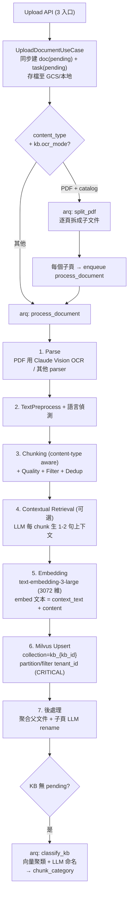
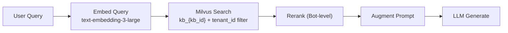

# Architecture

## DDD 4-Layer

本專案採用 Domain-Driven Design 分層架構，嚴格遵守由外向內的依賴方向。

```
┌─────────────────────────────────────────┐
│           Interfaces 層                  │
│   FastAPI Router, CLI, Event Handler     │
│   只負責 HTTP/CLI 轉換，委派給 App 層    │
└──────────────────┬──────────────────────┘
                   ↓
┌─────────────────────────────────────────┐
│          Application 層                  │
│   Use Case, Command/Query Handler        │
│   編排 Domain 物件，呼叫 Repository      │
└──────────────────┬──────────────────────┘
                   ↓
┌─────────────────────────────────────────┐
│            Domain 層                     │
│   Entity, Value Object, Domain Event     │
│   Repository Interface, Domain Service   │
│   ★ 核心：不依賴任何外層 ★               │
└─────────────────────────────────────────┘
                   ↑ 實作
┌─────────────────────────────────────────┐
│        Infrastructure 層                 │
│   Repository Impl, DB, Milvus, LangGraph │
│   External API Adapter, Cache            │
└─────────────────────────────────────────┘
```

### 依賴規則

| 層級 | 可依賴 | 禁止依賴 |
|------|--------|----------|
| Domain | Python 標準庫, pydantic | Application, Infrastructure, Interfaces |
| Application | Domain | Infrastructure 具體實作, Interfaces |
| Infrastructure | Domain (Interface) | Application, Interfaces |
| Interfaces | Application, Domain DTO | Infrastructure 直接操作 |

### Bounded Contexts（限界上下文）

| 上下文 | 路徑 | 職責 |
|--------|------|------|
| Tenant | `domain/tenant/` | 多租戶管理、租戶隔離 |
| Knowledge | `domain/knowledge/` | 知識庫管理、文件上傳與分塊 |
| RAG | `domain/rag/` | 檢索增強生成、向量搜尋、Prompt 組裝 |
| Conversation | `domain/conversation/` | 對話管理、歷史記錄 |
| Agent | `domain/agent/` | LangGraph Agent 編排、Tool 管理 |

## Multi-Agent 2-Tier 架構

```
                    使用者訊息
                        │
                        ▼
              ┌─────────────────┐
              │ MetaSupervisor  │   路由 + 情緒偵測
              │   (Tier 1)      │
              └────────┬────────┘
                       │
          ┌────────────┼────────────┐
          ▼            ▼            ▼
   ┌────────────┐ ┌────────────┐ ┌────────────┐
   │ Customer   │ │ Sales      │ │ Technical  │
   │ Team       │ │ Team       │ │ Team       │
   │ Supervisor │ │ Supervisor │ │ Supervisor │
   │ (Tier 2)   │ │ (Tier 2)   │ │ (Tier 2)   │
   └──────┬─────┘ └────────────┘ └────────────┘
          │
     ┌────┼────┐
     ▼         ▼
┌─────────┐ ┌─────────┐
│ Refund  │ │ Main    │
│ Worker  │ │ Worker  │
└─────────┘ └─────────┘
```

**Tier 1 — MetaSupervisor**：接收使用者訊息，進行情緒偵測與路由，分派至對應 Team。

**Tier 2 — TeamSupervisor**：管理 Team 內的 Worker，根據意圖選擇合適的 Worker 處理。

**Workers**：執行具體任務（退貨處理、一般問答、訂單查詢等）。

### Domain Events

跨聚合通訊透過 Domain Event 進行：

```
Agent 回應完成
    → AgentResponseCompleted Event
        → 記錄對話歷史
        → 記錄 Usage 用量
        → 觸發情緒反思（必要時）
```

## RAG Pipeline

### Ingestion Flow（文件上傳 → 向量化）



#### 三條上傳入口（`interfaces/api/document_router.py`）

| 入口 | 路徑 | 用途 |
|------|------|------|
| Form-data | `POST /knowledge-bases/{kb_id}/documents` | ≤100 MB 直接上傳 |
| Signed URL | `POST /request-upload` | 回傳 GCS signed URL（繞過 Cloud Run 32 MB） |
| Confirm | `POST /confirm-upload` | 前端直傳 GCS 後通知後端 |

#### arq Background Jobs（`worker.py`）

| Job | 觸發 | 處理 |
|-----|------|------|
| `process_document` | 上傳後 + PDF 拆頁後 | 完整 7 步 pipeline |
| `split_pdf` | PDF + `ocr_mode=catalog` | 逐頁拆子文件 → 再各自 `process_document` |
| `classify_kb` | KB 無 pending/processing 時自動觸發 | 向量聚類 + LLM 命名分類 |
| `extract_memory` | 對話結束 | 抽取對話記憶 |
| `run_evaluation` | Prompt Optimizer 評估請求 | 跑評估 |

#### 模型解析優先級（index-time）

| 步驟 | 優先級 |
|------|-------|
| Contextual Retrieval | `KB.context_model` → `tenant.default_context_model` → 跳過 |
| Auto-Classification | `KB.classification_model` → `tenant.default_classification_model` → 跳過 |
| Embedding | `text-embedding-3-large` (3072 維，全系統統一) |

### Query Flow



1. **Query** — 使用者提問
2. **Embed** — 問題向量化（同一 embedding model，維度必須一致）
3. **Search** — Milvus 向量相似搜尋，**必須帶 `tenant_id` filter expression**（CRITICAL）+ top-k + score threshold
4. **Rerank** — Bot 層可選，用 `bot.rerank_model` 重新排序
5. **Augment** — 將檢索結果注入 Prompt context（結構化標記 source / relevance）
6. **Generate** — LLM 根據 context 生成回答

### 詳細規範

- 完整開發規範、測試策略、BDD 場景：`.claude/rules/rag-pipeline.md`
- RAG 調整策略（不微調）：`docs/rag-tuning-strategy.md`

## 技術棧

### 後端

| 類別 | 技術 |
|------|------|
| 語言 | Python 3.12+ |
| Web 框架 | FastAPI |
| DI 容器 | dependency-injector |
| AI 編排 | LangGraph |
| 向量資料庫 | Milvus |
| ORM | SQLAlchemy 2.0 (async) |
| 測試 | pytest + pytest-bdd v8 |

### 前端

| 類別 | 技術 |
|------|------|
| 框架 | React + Vite SPA（React Router v6） |
| UI | shadcn/ui (Tailwind CSS + Radix UI) |
| Client State | Zustand |
| Server State | TanStack Query |
| 測試 | Vitest + RTL + MSW + playwright-bdd |
