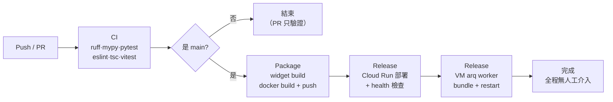

# Azure DevOps 建置設定（PIC-DevOps / 檯帳系列-平台POC）

Repo：`https://dev.azure.com/PIC-DevOps/檯帳系列-平台POC/_git/agentic-rag-customer-service`

GitHub（`larry610881/agentic-rag-customer-service`）維持為開發主場，Azure DevOps 為
公司側鏡像 + 正式 CI/CD 落點。兩邊 `main` 從 `chore/azure-devops-mirror` 這支合併後
共用同一段歷史，之後互推都可 fast-forward，不需要 force push。

---

## 一、分支管理

| 分支 | 用途 | 誰能寫 |
|------|------|--------|
| `main` | 唯一長期分支，永遠可部署；**任何合入都會自動部署到 POC** | 只能經 PR 合入（設 branch policy 擋直推） |
| `feature/<scope>/<描述>` | 新功能 | 開發者 |
| `fix/<scope>/<描述>` | 修復 | 開發者 |
| `refactor/<scope>/<描述>` | 重構 | 開發者 |
| `test/<scope>/<描述>` | 測試補強 | 開發者 |

命名與 commit 格式沿用 `.claude/rules/git-workflow.md`（Conventional Commits，
scope 用 `backend` / `frontend` / `rag` / `agent` / `infra` / `monorepo`）。

**不設 `develop`**：這個專案是單一 POC 環境、單人為主的節奏，多一層長期分支只會製造
兩份待部署狀態。要進到多環境（staging / prod）時，用「同一個 build artifact 過不同
Environment 閘門」而不是多開分支。

### 建議的 branch policy（保護 main）

Azure DevOps 的 branch policy 要有專案管理員權限才設得起來。UI 路徑：
Repos → Branches → `main` → ⋯ → Branch policies。要走 CLI 的話：

```bash
# 前置：安裝 az CLI 與 devops 擴充，並以有專案管理權限的帳號登入
az extension add --name azure-devops
az devops configure --defaults \
  organization=https://dev.azure.com/PIC-DevOps \
  project='檯帳系列-平台POC'

REPO_ID=$(az repos show --repository agentic-rag-customer-service --query id -o tsv)

# 1) 至少一位審查者，且推新 commit 後重設投票
#    目前是單人開發，--creator-vote-counts true 讓自己的投票算數，否則 PR 永遠合不進去；
#    團隊成員進來後改成 false，才是真的同儕審查。
az repos policy approver-count create \
  --repository-id "$REPO_ID" --branch main --blocking true --enabled true \
  --minimum-approver-count 1 --creator-vote-counts true \
  --reset-on-source-push true --allow-downvotes false

# 2) PR 必須有一次成功的建置（把 CI 綁成必要條件）
BUILD_DEF_ID=$(az pipelines show --name agentic-rag-customer-service --query id -o tsv)
az repos policy build create \
  --repository-id "$REPO_ID" --branch main --blocking true --enabled true \
  --build-definition-id "$BUILD_DEF_ID" --display-name "CI must pass" \
  --queue-on-source-update-only true --valid-duration 720 \
  --manual-queue-only false

# 3) 合併方式只允許 squash（保持 main 線性、好回溯）
az repos policy merge-strategy create \
  --repository-id "$REPO_ID" --branch main --blocking true --enabled true \
  --allow-squash true --allow-no-fast-forward false \
  --allow-rebase false --allow-rebase-merge false

# 4) 留言必須全部解決才可合併
az repos policy comment-required create \
  --repository-id "$REPO_ID" --branch main --blocking true --enabled true
```

---

## 二、管線前置設定

管線檔在 repo 根目錄 `azure-pipelines.yml`，共用步驟樣板在
`infra/azure-pipelines/steps-gcp-auth.yml`。

### 1. 建立管線

Pipelines → New pipeline → Azure Repos Git → 選本 repo → Existing Azure Pipelines YAML file
→ `/azure-pipelines.yml`。

> **先確認平行度**：私有專案的 Microsoft-hosted agent 預設 0 個平行工作，
> 要先申請免費授權（[表單](https://aka.ms/azpipelines-parallelism-request)，
> 通常 2–3 個工作天），否則管線會一直卡在 "waiting for an available agent"。
> 不想等就改用 self-hosted agent，`pool:` 換成自架的 agent pool 名稱。

### 2. Library → Secure files

上傳 GCP 服務帳號金鑰，檔名固定 `gcp-sa-key.json`。這個服務帳號需要：

| 角色 | 用途 |
|------|------|
| `roles/artifactregistry.writer` | 推映像 |
| `roles/run.admin` | 部署 Cloud Run |
| `roles/iam.serviceAccountUser` | 以 Cloud Run runtime SA 身分部署 |
| `roles/iap.tunnelResourceAccessor` + `roles/compute.instanceAdmin.v1` | IAP SSH / SCP 進 VM 同步程式碼並重啟 worker |

> 想避免長期金鑰落地，可改用 Workload Identity Federation：把
> `steps-gcp-auth.yml` 換成 OIDC 取 token 的版本，其餘 stage 完全不用動。

### 3. Library → Variable groups

**`agentic-rag-gcp`**（非祕密，可直接看）

| 變數 | 範例值 |
|------|--------|
| `GCP_PROJECT_ID` | `project-pic-ai-innovation-poc` |
| `GCP_REGION` | `asia-east1` |
| `WORKER_VM_NAME` | `db-services` |
| `WORKER_VM_ZONE` | `asia-east1-b` |
| `WORKER_VM_USER` | VM 上持有 repo 的使用者 |
| `WORKER_REPO_PATH` | VM 上的 repo 路徑 |

**`agentic-rag-runtime`**（**全部勾 secret**）

`DATABASE_URL_OVERRIDE`、`REDIS_URL_OVERRIDE`、`MILVUS_URI`、`JWT_SECRET_KEY`、
`ENCRYPTION_MASTER_KEY`、`STORAGE_BACKEND`、`GCS_BUCKET_NAME`、`EMBEDDING_PROVIDER`、
`RATE_LIMIT_ENABLED`。值以現行 Cloud Run 服務上的為準：

```bash
gcloud run services describe agentic-rag --region=asia-east1 \
  --project=<GCP_PROJECT_ID> \
  --format='value(spec.template.spec.containers[0].env)'
```

> 管線用 `--update-env-vars`（合併）而不是 `--set-env-vars`（整組取代）。
> 用後者時，服務上存在但不在變數群組裡的變數會被**靜默清掉** —— `EMBEDDING_PROVIDER`
> 就是這種漏網的：清掉之後嵌入會默默改走預設供應商，向量對不上舊資料也不會報錯。
> 要刪變數請用 `--remove-env-vars` 指名。

> LLM 供應商的 API key **不放這裡**——它們存在資料庫（加密欄位），由後台
> 「供應商設定」維護。管線只需要 `ENCRYPTION_MASTER_KEY` 就能解密。

### 4. Environments → `poc`

Pipelines → Environments → New environment → 名稱 `poc`。**不要加 Approvals and checks**
—— 這條線要的是全自動：push 到 `main` 後一路跑到部署完成，中間不停。Environment 在這裡
只負責留部署歷史（哪個 build、哪個 commit、什麼時候上的）與資源稽核。

哪天要臨時擋住上線（例如封版期間），在這個 Environment 上加一個 approver 即可，
YAML 完全不用改；解除就把 approver 移掉。

之後要開 staging / prod，複製 Release stage 換一個 Environment 名稱，映像沿用同一個
`rc-<sha>` tag，不重建 —— 「同一份 artifact 過不同閘門」。

---

## 三、管線階段



| Stage | 觸發 | 內容 |
|-------|------|------|
| `CI` | 每個 PR 與 main push | 後端 ruff / mypy / 單元測試（覆蓋率門檻 80%）、整合測試（真實 Postgres + Redis service container）、前端 eslint / tsc / vitest；測試結果與覆蓋率上傳到 Tests / Code Coverage 頁籤 |
| `Package` | 只有 `main` | 先建 widget（打包進後端映像），再 `docker build` 後端推到 Artifact Registry，tag 為 `rc-<commit sha>` 與 `latest` |
| `Release` | `Package` 成功後**自動**執行 | `gcloud run deploy` 指定 tag → 輪詢 `/health` 直到 200（失敗整條紅燈）→ 把本次 commit 做成 git bundle scp 進 VM、還原、`uv sync`、重啟 `arq-worker.service` → 回讀 VM 的 HEAD 確認等於本次 commit |

**為什麼 worker 要獨立一段**：worker 是沒有 HTTP 介面的常駐程序，跑在 GCE VM 上由
systemd 管理，跟 Cloud Run 是兩條部署路徑。漏掉它的後果是 worker 永遠跑舊 code，
出現「Cloud Run 有新功能但背景作業跑不到」而且**完全沒有錯誤訊息**——這在
GitHub Actions 那條線上真的發生過（快取計費與自動分類記帳靜默失效六天）。

**為什麼用 git bundle 而不是叫 VM 自己 `git pull`**：

1. VM 上的 `origin` 指向 GitHub。改由 Azure 觸發部署後，VM 去 pull 會拿到落後的 code，
   造成「Cloud Run 跑新版、worker 跑舊版」——比不部署更難查。
2. 要讓 VM 有能力拉 Azure repo，就得在 VM 上放一份長期 PAT，多一個祕密要輪替。
3. bundle 綁的是**本次建置的 commit**，跟 Cloud Run 跑的映像保證同一份原始碼；
   `origin/main` 則可能在建置與部署之間又前進了。

最後一步會回讀 VM 的 HEAD 與本次 commit 比對，不一致就整條紅燈。

---

## 四、與 GitHub Actions 的關係

`.github/workflows/deploy-backend.yml` 目前是停用狀態（`gh workflow disable`），
且指向已退役的舊 GCP 專案。兩條線的定位：

- **Azure DevOps**：公司側正式 CI/CD，push 到 `main` 後全自動跑到部署完成，是之後要走的路。
- **GitHub Actions**：先維持停用。要恢復的話只當「PR 驗證」用（跑 CI stage 的等價
  內容），部署權責留在 Azure，避免兩邊同時 deploy 互相覆蓋 Cloud Run 版本。

---

## 五、驗收清單

- [ ] 平行度授權已核准（或已接上 self-hosted agent）
- [ ] Secure file `gcp-sa-key.json` 已上傳，SA 具備上表五個角色
- [ ] 兩個 variable group 已建立，`agentic-rag-runtime` 全部標 secret
- [ ] Environment `poc` 已建立，且**沒有**設 approvals（要全自動）
- [ ] 對 `main` 發一個測試 PR：CI 三個 job 全綠、PR 不會觸發 Package
- [ ] 合入 main：Package 產出 `rc-<sha>` 映像後**自動**進 Release，全程不需按任何按鈕
- [ ] Cloud Run 出新 revision、`/health` 200、`EMBEDDING_PROVIDER` 等既有變數沒被清掉
- [ ] worker `systemctl is-active` 為 active，且 VM HEAD 等於本次 commit
- [ ] `main` 的 branch policy 已生效（直推被擋、PR 需 CI 綠 + 一位審查者）
