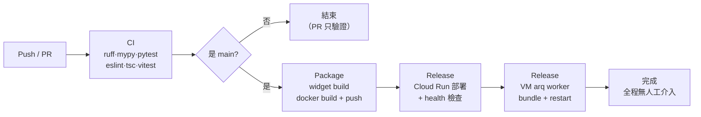

# Azure DevOps 建置設定（PIC-DevOps / 檯帳系列-平台POC）

Repo：`https://dev.azure.com/PIC-DevOps/檯帳系列-平台POC/_git/agentic-rag-customer-service`

GitHub（`larry610881/agentic-rag-customer-service`）維持為開發主場，Azure DevOps 為
公司側鏡像 + 正式 CI/CD 落點。兩邊 `main` 從 `chore/azure-devops-mirror` 這支合併後
共用同一段歷史，之後互推都可 fast-forward，不需要 force push。

---

## 一、分支管理

| 分支 | 用途 | 誰能寫 |
|------|------|--------|
| `main` | 唯一長期分支，永遠可部署；**任何合入都會自動部署到 POC** | 只能經 PR 合入（設 branch policy 擋直推） |
| `feature/<scope>/<描述>` | 新功能 | 開發者 |
| `fix/<scope>/<描述>` | 修復 | 開發者 |
| `refactor/<scope>/<描述>` | 重構 | 開發者 |
| `test/<scope>/<描述>` | 測試補強 | 開發者 |

命名與 commit 格式沿用 `.claude/rules/git-workflow.md`（Conventional Commits，
scope 用 `backend` / `frontend` / `rag` / `agent` / `infra` / `monorepo`）。

**不設 `develop`**：這個專案是單一 POC 環境、單人為主的節奏，多一層長期分支只會製造
兩份待部署狀態。要進到多環境（staging / prod）時，用「同一個 build artifact 過不同
Environment 閘門」而不是多開分支。

### 建議的 branch policy（保護 main）

Azure DevOps 的 branch policy 要有專案管理員權限才設得起來。UI 路徑：
Repos → Branches → `main` → ⋯ → Branch policies。要走 CLI 的話：

```bash
# 前置：安裝 az CLI 與 devops 擴充，並以有專案管理權限的帳號登入
az extension add --name azure-devops
az devops configure --defaults \
  organization=https://dev.azure.com/PIC-DevOps \
  project='檯帳系列-平台POC'

REPO_ID=$(az repos show --repository agentic-rag-customer-service --query id -o tsv)

# 1) 至少一位審查者，且推新 commit 後重設投票
#    目前是單人開發，--creator-vote-counts true 讓自己的投票算數，否則 PR 永遠合不進去；
#    團隊成員進來後改成 false，才是真的同儕審查。
az repos policy approver-count create \
  --repository-id "$REPO_ID" --branch main --blocking true --enabled true \
  --minimum-approver-count 1 --creator-vote-counts true \
  --reset-on-source-push true --allow-downvotes false

# 2) PR 必須有一次成功的建置（把 CI 綁成必要條件）
BUILD_DEF_ID=$(az pipelines show --name agentic-rag-customer-service --query id -o tsv)
az repos policy build create \
  --repository-id "$REPO_ID" --branch main --blocking true --enabled true \
  --build-definition-id "$BUILD_DEF_ID" --display-name "CI must pass" \
  --queue-on-source-update-only true --valid-duration 720 \
  --manual-queue-only false

# 3) 合併方式只允許 squash（保持 main 線性、好回溯）
az repos policy merge-strategy create \
  --repository-id "$REPO_ID" --branch main --blocking true --enabled true \
  --allow-squash true --allow-no-fast-forward false \
  --allow-rebase false --allow-rebase-merge false

# 4) 留言必須全部解決才可合併
az repos policy comment-required create \
  --repository-id "$REPO_ID" --branch main --blocking true --enabled true
```

---

## 二、管線前置設定

管線檔在 repo 根目錄 `azure-pipelines.yml`，共用步驟樣板在
`infra/azure-pipelines/steps-gcp-auth.yml`。

### 1. 建立管線

Pipelines → New pipeline → Azure Repos Git → 選本 repo → Existing Azure Pipelines YAML file
→ `/azure-pipelines.yml`。

> **平行度**：PIC-DevOps 組織的 Microsoft-hosted agent 已可用（2026-09-22 探針管線實跑在
> `Azure Pipelines` pool 的 ubuntu-24.04 上）。若日後出現 "waiting for an available agent"
> 或 "No hosted parallelism"，是組織額度被用完或收回，向組織管理員申請
> （[表單](https://aka.ms/azpipelines-parallelism-request)）。

### 2. GCP 認證：Workload Identity Federation（預設）

原理一句話：Azure DevOps 對「這條管線」簽發短效 OIDC token → GCP 的 workload identity
pool provider 信任它 → 換成部署 SA 的短效權杖。全程沒有長期金鑰，**也不需要任何 Azure 服務連線**。

管線拿到的 token 長這樣（2026-09-22 用 `infra/azure-pipelines/probe-oidc-claims.yml` 實測）：

| claim | 值 |
|---|---|
| `iss` | `https://vstoken.dev.azure.com/18185d85-4caa-4a99-b7e8-81ac197c4c52`（尾段 = PIC-DevOps 組織 GUID） |
| `sub` | `p://PIC-DevOps/檯帳系列-平台POC/agentic-rag-customer-service` |
| `aud` | `api://AzureADTokenExchange` |
| `prj_id` | `d80a45a4-e680-4e61-be01-3d5df3662f3c`（專案 GUID） |
| `def_id` | `3888`（管線定義 id） |
| `rpo_ref` | 觸發的分支，例如 `refs/heads/main` |

**整個接線只需要兩個值**，都由 infra 提供；其餘（專案 ID、region、VM 名稱）放 Library 變數群組。

| 值 | 誰提供 | 怎麼拿 |
|---|---|---|
| `GCP_WIF_PROVIDER` | infra（GCP） | 見 2.2，格式 `projects/<專案編號>/locations/global/workloadIdentityPools/<pool>/providers/<provider>` |
| `GCP_DEPLOY_SA` | infra（GCP） | 部署用 SA 的 email |

> **為什麼不用服務連線**：2025-11 起 Azure Resource Manager 服務連線改由 Microsoft Entra 簽發
> token（issuer 變成 `login.microsoftonline.com/<tenant>/v2.0`，subject 變成 `/eid1/c/pub/...`），
> 沒有真實 Azure 租戶就換不到；而且對服務連線請 token 必須有 task **明確引用**該連線，純 script
> 步驟會被拒（`There is no explicit reference to service connection`）。管線層級的 token 兩個問題
> 都沒有，issuer 仍是 `vstoken.dev.azure.com`。Microsoft 已宣布服務連線的 vstoken issuer
> 2027-07 停用，管線層級 token 是否跟進未定；若哪天 Package 認證失敗且 log 印出的 `iss` 變了，
> 跑一次探針管線取得新值，請 infra 更新 provider 的 `--issuer-uri` 即可。

#### 2.1 你在 Azure 做的：什麼都不用建

不需要服務連線、不需要 app registration。只要把下面三個識別碼交給 infra
（都不是機密，已寫在本文件）：

| 給 infra 的值 | 值 |
|---|---|
| Azure DevOps 組織 GUID | `18185d85-4caa-4a99-b7e8-81ac197c4c52` |
| 專案 GUID | `d80a45a4-e680-4e61-be01-3d5df3662f3c` |
| 正式管線定義 id | `3888`（Pipelines 頁面網址 `definitionId=`） |

要重新確認這些值（例如管線重建、專案改名），手動跑 `probes/probe-oidc-claims` 管線，
log 會印出 token 的全部識別 claim。

#### 2.2 infra 在 GCP 做的（Larry 的帳號沒有 IAM 權限，做不了也查不到）

```bash
PROJECT_ID=project-pic-ai-innovation-poc
ADO_ORG_ID=18185d85-4caa-4a99-b7e8-81ac197c4c52   # Azure DevOps 組織 GUID（token 的 iss 尾段）
ADO_PRJ_ID=d80a45a4-e680-4e61-be01-3d5df3662f3c   # Azure DevOps 專案 GUID（token 的 prj_id）
ADO_DEF_ID=3888                                     # 正式管線定義 id（token 的 def_id）
POOL=azure-devops                         # 名稱自訂
PROVIDER=ado-pic-devops                   # 名稱自訂
SA=poc-rag-deploy-sa                      # 交付文件已有此 SA 可沿用；沒有就建

gcloud iam workload-identity-pools create "$POOL" --project="$PROJECT_ID" \
  --location=global --display-name="Azure DevOps"
# subject 用 <專案 GUID>/<管線 id>（純 ASCII，避開 sub 裡的中文專案名）；
# attribute condition 只放行這個 Azure DevOps 專案。
gcloud iam workload-identity-pools providers create-oidc "$PROVIDER" \
  --project="$PROJECT_ID" --location=global --workload-identity-pool="$POOL" \
  --issuer-uri="https://vstoken.dev.azure.com/$ADO_ORG_ID" \
  --allowed-audiences="api://AzureADTokenExchange" \
  --attribute-mapping="google.subject=assertion.prj_id+'/'+string(assertion.def_id),attribute.rpo_ref=assertion.rpo_ref,attribute.pipeline=assertion.sub" \
  --attribute-condition="assertion.prj_id=='$ADO_PRJ_ID'"

SA_EMAIL="$SA@$PROJECT_ID.iam.gserviceaccount.com"
gcloud iam service-accounts describe "$SA_EMAIL" --project="$PROJECT_ID" >/dev/null 2>&1 \
  || gcloud iam service-accounts create "$SA" --project="$PROJECT_ID" --display-name="Azure DevOps deployer"

PROJECT_NUMBER=$(gcloud projects describe "$PROJECT_ID" --format='value(projectNumber)')
POOL_NAME="projects/$PROJECT_NUMBER/locations/global/workloadIdentityPools/$POOL"
# 只有正式管線（專案 GUID/管線 id）能扮演此 SA；探針或其他管線拿到 token 也換不到 SA
gcloud iam service-accounts add-iam-policy-binding "$SA_EMAIL" --project="$PROJECT_ID" \
  --role=roles/iam.workloadIdentityUser \
  --member="principal://iam.googleapis.com/$POOL_NAME/subject/$ADO_PRJ_ID/$ADO_DEF_ID"

for ROLE in roles/artifactregistry.writer roles/run.admin roles/iam.serviceAccountUser \
            roles/iap.tunnelResourceAccessor roles/compute.instanceAdmin.v1; do
  gcloud projects add-iam-policy-binding "$PROJECT_ID" --member="serviceAccount:$SA_EMAIL" --role="$ROLE"
done

echo "GCP_WIF_PROVIDER=$POOL_NAME/providers/$PROVIDER"
echo "GCP_DEPLOY_SA=$SA_EMAIL"
```

infra 跑完把最後兩行 echo 的值給你，填進 Library。

| 角色 | 用途 |
|---|---|
| `roles/artifactregistry.writer` | 推映像到 `poc-ar-rag` |
| `roles/run.admin` | 部署 Cloud Run |
| `roles/iam.serviceAccountUser` | 以 runtime SA（`poc-rag-run-sa`）身分部署 |
| `roles/iap.tunnelResourceAccessor` | 走 IAP 隧道連 VM |
| `roles/compute.instanceAdmin.v1` | SCP / SSH 進 VM 同步程式碼並重啟 worker |

> VM 若開了 OS Login，要再加 `roles/compute.osAdminLogin`（重啟 systemd 服務需要 sudo）。

### 3. 備援路徑：服務帳號 JSON 金鑰

只在 WIF 走不通時用（例如公司不允許自建服務連線）。手動觸發管線時把參數
**GCP 認證方式**改成 `sa-key`，或改 `azure-pipelines.yml` 裡 `gcpAuthMethod` 的 default。

Library → Secure files 上傳金鑰，檔名固定 `gcp-sa-key.json`，服務帳號角色同上表。

> **先確認公司 GCP 有沒有禁發服務帳號金鑰**：企業組織常設
> `constraints/iam.disableServiceAccountKeyCreation`，一旦生效就**根本產不出**這個
> JSON 檔，只能走 WIF。Larry 的帳號沒有 IAM 讀取權限，查不到現況，要請專案負責人確認。

### 4. Library → Variable groups（一個環境一組）

管線 YAML 不含任何環境專屬值。每個環境建一組 `agentic-rag-gcp-<environment>`（目前只有 `poc`），
用管線參數 `environment` 切換；加新環境 = 加一組 group + 在 `parameters.environment.values` 加一個選項，
YAML 其他地方不動。

`agentic-rag-gcp-poc` 的八個值（2026-09-22 已用 CLI 建好，group id 390）：

| 變數 | 值 | 來源 | 機密 |
|---|---|---|:---:|
| `GCP_WIF_PROVIDER` | `projects/<編號>/locations/global/workloadIdentityPools/<pool>/providers/<provider>` | infra（2.2 的 echo） | 否 |
| `GCP_DEPLOY_SA` | `<sa>@project-pic-ai-innovation-poc.iam.gserviceaccount.com` | infra（2.2 的 echo） | 否 |
| `GCP_PROJECT_ID` | `project-pic-ai-innovation-poc` | 固定 | 否 |
| `GCP_REGION` | `asia-east1` | 固定 | 否 |
| `WORKER_VM_NAME` | `poc-rag-vm-01` | 固定 | 否 |
| `WORKER_VM_ZONE` | `asia-east1-b` | 固定 | 否 |
| `WORKER_VM_USER` | `larry610881_gcpmail_pcsc_net_tw` | 固定 | 否 |
| `WORKER_REPO_PATH` | `/home/larry610881_gcpmail_pcsc_net_tw/agentic-rag-customer-service` | 固定 | 否 |

這八個都不是憑證，不用勾 secret（勾了就不能在 template expression 用，而且 log 會遮罩到難以除錯）。
WIF 路徑沒有任何長期祕密；只有備援的 `sa-key` 路徑用 Secure Files 放金鑰。

建好後回到管線頁，第一次載入會出現「Variable group was not found or is not authorized」，
按 **Authorize resources**（或在該 group 的 Pipeline permissions 加這條管線）。

infra 還沒回覆前，`GCP_WIF_PROVIDER` / `GCP_DEPLOY_SA` 先填 `TBD`（目前狀態）也能建管線：
CI 階段照跑，只有 Package 的認證步驟會失敗。infra 回值後用 CLI 更新：

```bash
az pipelines variable-group variable update --group-id 390 --name GCP_WIF_PROVIDER --value '<infra 給的值>'
az pipelines variable-group variable update --group-id 390 --name GCP_DEPLOY_SA --value '<infra 給的值>'
```

> 舊版文件裡的 `agentic-rag-runtime`（Cloud Run 執行期環境變數）**不再需要**：Release 只換映像，
> 環境變數沿用服務現況（見第六節）。

### 5. Environments → `poc`

Pipelines → Environments → New environment → 名稱 `poc`。**不要加 Approvals and checks**
—— 這條線要的是全自動：push 到 `main` 後一路跑到部署完成，中間不停。Environment 在這裡
只負責留部署歷史（哪個 build、哪個 commit、什麼時候上的）與資源稽核。

哪天要臨時擋住上線（例如封版期間），在這個 Environment 上加一個 approver 即可，
YAML 完全不用改；解除就把 approver 移掉。

之後要開 staging / prod，複製 Release stage 換一個 Environment 名稱，映像沿用同一個
`rc-<sha>` tag，不重建 —— 「同一份 artifact 過不同閘門」。

---

## 三、管線階段



| Stage | 觸發 | 內容 |
|-------|------|------|
| `CI` | 每個 PR 與 main push | 後端 ruff、mypy 兩個獨立步驟 → 單元測試（覆蓋率門檻 80%，首跑以 78 排程）→ OpenAPI 破壞性變更檢查；整合測試（`resources.containers` 起 postgres:16-alpine + redis:7-alpine，測試庫由 conftest 自建，**不灌 `infra/schema.sql`**；#65 修完前 `continueOnError`）；前端 `npm run lint`（eslint src/）/ tsc / vitest；測試結果與覆蓋率上傳到 Tests / Code Coverage 頁籤 |
| `Package` | 只有 `main` | 先建 widget（打包進後端映像），再 `docker build` 後端推到 Artifact Registry，tag 為 `rc-<commit sha>` 與 `latest` |
| `Release` | `Package` 成功後**自動**執行 | `gcloud run deploy` 指定 tag → 輪詢 `/health` 直到 200（失敗整條紅燈）→ 把本次 commit 做成 git bundle scp 進 VM、還原、`uv sync`、重啟 `arq-worker.service` → 回讀 VM 的 HEAD 確認等於本次 commit |

**為什麼 worker 要獨立一段**：worker 是沒有 HTTP 介面的常駐程序，跑在 GCE VM 上由
systemd 管理，跟 Cloud Run 是兩條部署路徑。漏掉它的後果是 worker 永遠跑舊 code，
出現「Cloud Run 有新功能但背景作業跑不到」而且**完全沒有錯誤訊息**——這在
GitHub Actions 那條線上真的發生過（快取計費與自動分類記帳靜默失效六天）。

**為什麼用 git bundle 而不是叫 VM 自己 `git pull`**：

1. VM 上的 `origin` 指向 GitHub。改由 Azure 觸發部署後，VM 去 pull 會拿到落後的 code，
   造成「Cloud Run 跑新版、worker 跑舊版」——比不部署更難查。
2. 要讓 VM 有能力拉 Azure repo，就得在 VM 上放一份長期 PAT，多一個祕密要輪替。
3. bundle 綁的是**本次建置的 commit**，跟 Cloud Run 跑的映像保證同一份原始碼；
   `origin/main` 則可能在建置與部署之間又前進了。

最後一步會回讀 VM 的 HEAD 與本次 commit 比對，不一致就整條紅燈。

---

## 四、與 GitHub Actions 的關係

`.github/workflows/deploy-backend.yml` 目前是停用狀態（`gh workflow disable`），
且指向已退役的舊 GCP 專案。兩條線的定位：

- **Azure DevOps**：公司側正式 CI/CD，push 到 `main` 後全自動跑到部署完成，是之後要走的路。
- **GitHub Actions**：先維持停用。要恢復的話只當「PR 驗證」用（跑 CI stage 的等價
  內容），部署權責留在 Azure，避免兩邊同時 deploy 互相覆蓋 Cloud Run 版本。

---

## 五、驗收清單

- [x] Azure：hosted agent 可用、探針管線取得 OIDC token（2026-09-22）；不需要服務連線
- [x] Library：`agentic-rag-gcp-poc` 建好並 Authorize（2026-09-22，group 390；infra 兩值先 `TBD`）
- [ ] infra：pool / provider / SA 已建（2.2 腳本），回覆 `GCP_WIF_PROVIDER` 與 `GCP_DEPLOY_SA` 兩個值
- [ ] infra：SA 具五個角色（VM 開 OS Login 時加 `compute.osAdminLogin`）
- [ ] Library：把 infra 兩值填進 group 390
- [ ] main 加 branch policy（至少 1 reviewer + CI build validation）；合入即部署，不能再直推
- [ ] 管線 3888 指向 `/azure-pipelines.yml`，首次排程 `coverageFailUnder` 填 78
- [ ] main 推一次 → CI 綠 → Package 推出 `rc-<sha>` → Release 部署且 `/health` 200 → VM worker HEAD 等於本次 commit

## 六、2026-09-16 更新（掛上 Azure 前對齊現況）

依 09-16 線上實際設定與契約審核結果調整 `azure-pipelines.yml`：

| 項目 | 變更 | 原因 |
|---|---|---|
| Release 部署指令 | 只帶 `--image`，移除 `--vpc-connector=db-connector`、`--vpc-egress`、`--update-env-vars`、資源與縮放旗標 | 公司 POC 的 Cloud Run 是 **Direct VPC egress**（poc-vpc/poc-subnet，all-traffic），不是 VPC connector；舊旗標會把網路換成不存在的 connector，DB 立刻連不到。環境變數與資源沿用服務現況，改設定走人工 `gcloud`。因此 `agentic-rag-runtime` variable group **暫時不需要**，`agentic-rag-gcp` 仍要 |
| Package | 加 `apps/frontend npm run build:embed` | 後台 SPA 同源掛載，漏掉映像後台 404 |
| CI 後端 | 加 `oasdiff breaking` 閘門：PR 對目標分支、main 對前一 commit 的 `docs/api/openapi.json` | 契約審核 §4 第 5 步；快照本身由單元測試守「與程式一致」 |
| CI 覆蓋率 | 門檻改成參數 `coverageFailUnder`（預設 80） | 目前覆蓋率 78.4%，首次接管線可在排程時填 78 先跑通，之後補測試回 80，不改 `pyproject.toml` 的規範值 |
| CI 整合測試 | `continueOnError: true`（Issue #65） | 本機 45 個環境型失敗尚未修，先不擋 Package；結果照樣進 Tests 分頁 |

首次跑通後的待辦：#65 修完拿掉 `continueOnError`；覆蓋率回 80 後不再帶參數。

GCP 端無法從 Larry 帳號驗證（IAM 讀取全被擋）：WIF pool / provider、deploy SA 的五個角色、
`iam.workloadIdentityUser` 綁定，請 infra 負責人確認，或直接跑一次 Package 看 403 訊息。

## 七、2026-09-22 更新（服務連線走不通，改用管線層級 token）

用 `az devops` CLI 實際接線時發現兩件事，都靠探針管線（`infra/azure-pipelines/probe-oidc-claims.yml`）
實測確認：

| 現象 | 處置 |
|---|---|
| 新建的 ARM 服務連線 issuer 是 `login.microsoftonline.com/<tenant>/v2.0`、subject 是 `/eid1/c/pub/...`（Entra 簽發，2025-11 起的新格式） | 沒有真實 Azure 租戶就換不到 token；放棄服務連線 |
| 純 script 對服務連線請 token 被拒：`There is no explicit reference to service connection ... from current stage` | 舊版 `steps-gcp-auth-wif.yml` 會在此失敗；改成不帶 `serviceConnectionId` 請管線自身的 token |
| 管線層級 token：`iss=https://vstoken.dev.azure.com/<org GUID>`、`sub=p://<org>/<project>/<pipeline>`、帶 `prj_id` / `def_id` / `rpo_ref` | GCP provider 以 `prj_id/def_id` 當 subject 綁 SA（見 2.2） |

同時：Library group `agentic-rag-gcp-poc`（id 390）已用 CLI 建好，變數從九個減為八個；
臨時建的服務連線 `gcp-poc-wif` 已刪；UI 精靈留下的 draft 服務連線刪不掉也不影響任何事。

## 八、2026-09-22／23 首跑紅燈收斂（Issue #100）

管線第一次真跑（run 180245）CI 三個 job 全紅，**都不是接錯，是 repo 既有的債**——本地
`make lint` 同樣紅，只是從來沒人在本地跑過。分支 `ci/lint-gates` 逐批清零，不留暫時 ignore：

| 項目 | 首跑 | 收斂後 | 處置 |
|---|---|---|---|
| ruff | 416 | 0 | 安全自動修正 → 真缺陷 17 → 行長 291（只加 1 條 per-file-ignores：牌價表）→ 複雜度 25 個函式抽 helper |
| mypy | 223 錯 / 60 檔 | 0 | 禁整檔 ignore；單行 ignore 只剩 2 處第三方無型別 |
| 前端 tsc | 106 | 0 | 測試缺 vitest import、fixture 過期、正式碼型別錯 |
| 前端 eslint | 設定檔無規則、無 TS parser | 0 | 補標準 Vite React-TS flat config |
| 整合 job | 缺 `resources.containers`，起不來 | 容器、建庫、create_all 全通 | 刪 psql 灌 schema 步驟（與 conftest 的 create_all 衝突） |

**整合 job 驗收（run 180277）**：197 個測試跑完，41 failed 與 #65 本機完全相同，是測試本身
的問題，管線這段已通。

**型別與 lint 清債順帶抓到的線上 bug**（全部先寫 regression test 再修）：

| 嚴重度 | 症狀 | 影響 |
|---|---|---|
| Critical | 分類四個端點缺 KB 擁有權檢查 | 知道他租戶 id 即可讀文件 chunk、改分類名、觸發分類工作 |
| High | 設了 intent_routes 的 bot 開詳情 500 | Issue #91 改名漏改 |
| High | 綁 MCP 的 bot 在 LINE 收訊息 AttributeError | LINE 自己複製了一份解析且讀錯欄位；改與 web 共用 `McpServerResolver` |
| High | 後台「安全規則→攔截記錄」有記錄即整頁空白 | `vite build` 不做型別檢查，4 月起一路帶上線 |
| Medium | LLM rerank 從未生效 | SDK 移除 temperature 參數，TypeError 被 except 吞掉 |
| Medium | 其餘：分類並行刪除 500、「全部類型」篩選恆空、intent_routes bot 表單存不了、stdio MCP 存成空 URL 等 | 見 Issue #100 |

**教訓**：型別檢查不是風格工具。這批 bug 共同的形狀是「欄位改名或 SDK 升版後，某一處沒跟著改，
而那一處剛好沒有型別註記或被 `except Exception` 包住」——單元測試用 mock 走不到，只有型別檢查
看得到。所以 CI 的 ruff / mypy / tsc 是硬閘門，不做軟閘。

## 九、部署、重新部署與回滾（Azure UI 操作）

> 2026-09-23 定案（Issue #104）：**唯一部署入口是管線 3888**。WIF 接通後收回個人帳號的
> `run.developer` / `artifactregistry.writer` / `iam.serviceAccountUser`，不再用 `gcloud run deploy`
> 直推。回滾也在 3888 內做，不另開管線：infra 的 WIF 只綁 subject `<prj_id>/3888`，且只放行
> `refs/heads/main`，另開管線就要 infra 再綁一次。

### 版本怎麼識別

每次 deploy 建出的映像 tag 是 `rc-<完整 commit sha>`，另外維護兩個移動式別名：

| 別名 | 指向 | 何時更新 |
|---|---|---|
| `poc-current` | 目前線上版本 | 每次部署（含 rollback）健康檢查通過後 |
| `poc-previous` | 上一次 **deploy** 之前的線上版本 | deploy 模式在換映像前標記；rollback 不動它；同版重新部署也不動它 |

rollback 不動 `poc-previous`，是為了避免連續回滾兩次變成在兩版之間來回互換。

### 四種操作

| 要做什麼 | 在哪裡 | 參數 |
|---|---|---|
| 一般部署 | 合併到 `main` 自動觸發 | 無 |
| 重新部署同一版（例如 VM worker 異常要重同步） | Pipelines → 3888 → **Run pipeline**，branch `main` | mode `deploy` |
| 回滾到上一版 | 同上 | mode `rollback`，rollbackImageTag 留預設 `poc-previous` |
| 回滾到指定版 | 同上 | mode `rollback`，rollbackImageTag 填 `rc-<commit sha>` |

指定版的 tag 從兩個地方找：前一次 run 的 **Summary** 分頁（每次部署都寫出本次 tag、commit、
部署前的 tag 與回滾指令），或 Environments → `poc` 的部署歷史。

rollback 模式會跳過 CI 與建置，直接把既有映像部署回 Cloud Run，VM worker 也同步回該 commit
（Release 以 `TARGET_TAG` / `TARGET_SHA` 統一驅動三段：換映像、確認線上映像＋健康檢查、VM 同步）。
rollbackImageTag 只接受英數與 `. _ -`；映像不存在或別名反查不到 `rc-*` 時直接紅燈，並列出最近
10 個 `rc-*` 供挑選。

### 限制

- **不回滾 DB schema**。migration 規範要求加法式，回滾到舊版仍相容；若某次 migration 是破壞性的，
  那一版之前不可回滾——管線無法判斷，靠 Issue / SPRINT_TODOLIST 的紀錄。
- **Artifact Registry 清理政策**不能刪掉舊的 `rc-*`，至少保留最近 20 個（待 infra 確認
  `poc-ar-rag` 的 cleanup policy）。
- `gcloud run deploy` 只帶 `--image`，不帶 `--set-env-vars` / `--set-secrets`、不用
  `services replace`：環境變數與 Secret Manager 掛載由 infra 管，換映像時沿用服務現況。
- 緊急修補一律開 `fix/*` 分支 → 合併 `main` 走一般部署，不手動 gcloud。

