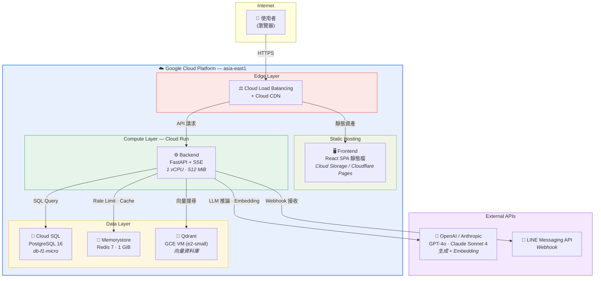
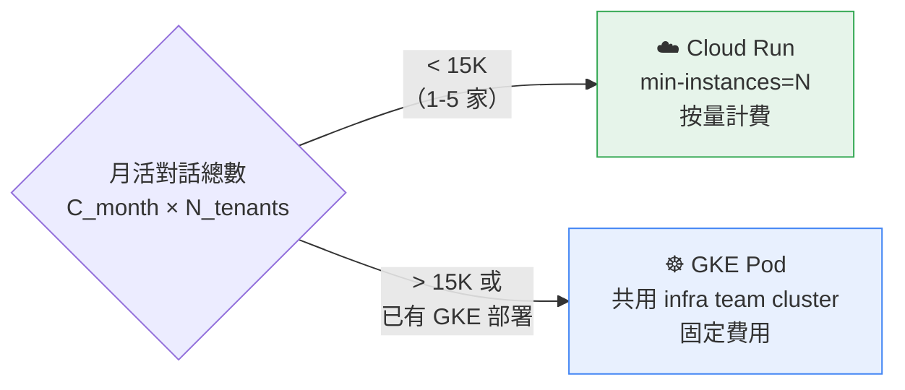
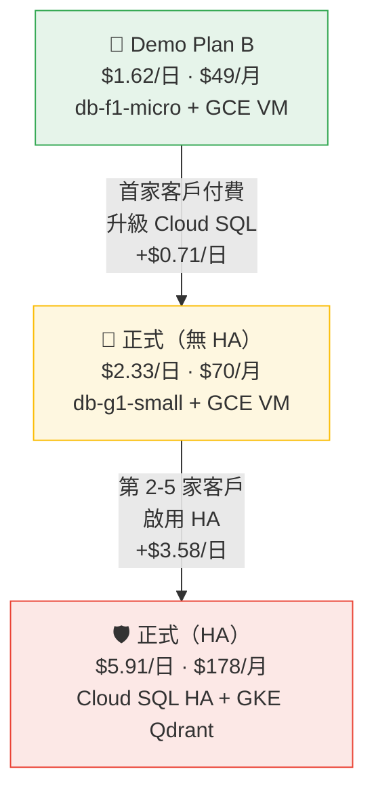
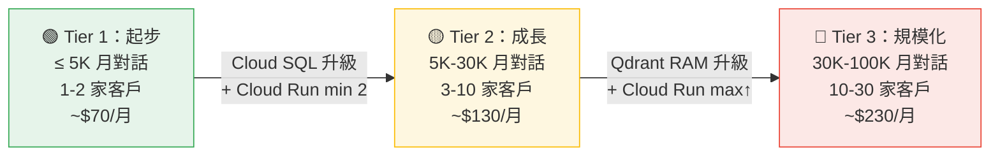
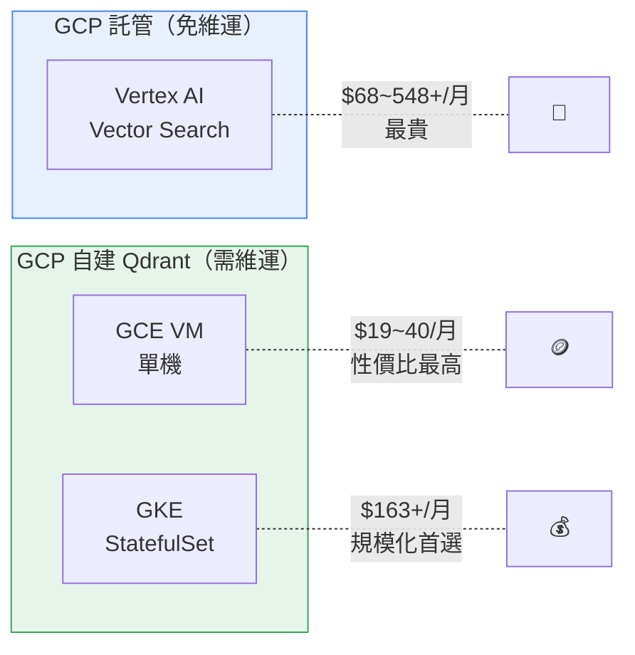
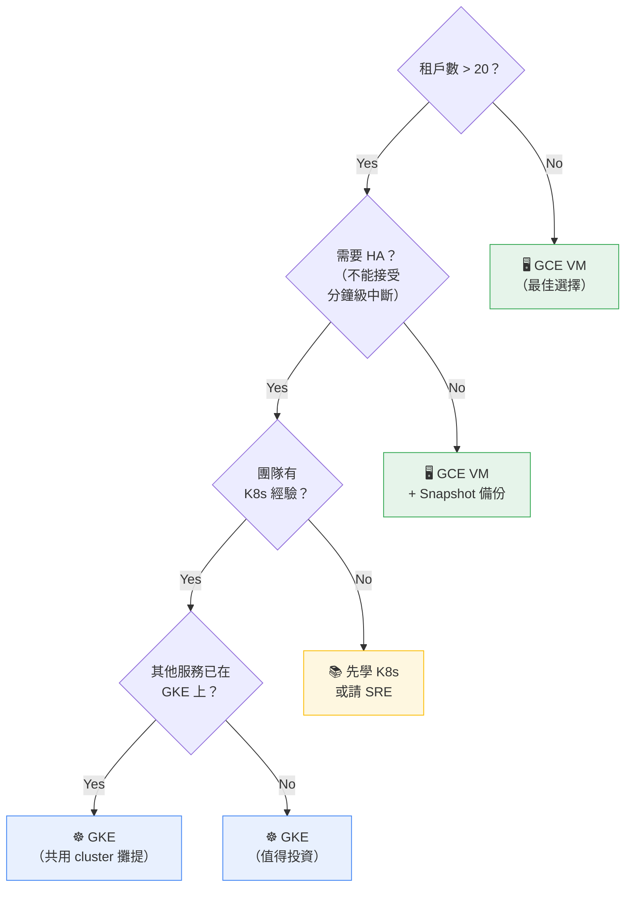
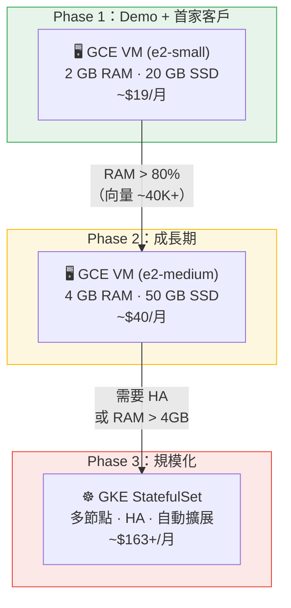

# 成本估算 — Demo + 正式環境部署方案比較（參數化版）

> **定價基準日**：2026-03-02
> **部署區域**：asia-east1（台灣彰化）— GCP 服務
> **幣別**：USD（美元）
> **計費基準**：日費（不計算免費額度，算實際費用）

---

## 目錄

- [1. 架構總覽](#1-架構總覽)
- [2. 參數定義](#2-參數定義)
- [3. GCP 基礎設施成本](#3-gcp-基礎設施成本)
- [4. LLM API 成本](#4-llm-api-成本)
- [5. Demo 總成本估算](#5-demo-總成本估算)
  - [5.1 方案 A：GCP 完整部署](#51-方案-agcp-完整部署)
  - [5.2 方案 B：GCP 精簡部署](#52-方案-bgcp-精簡部署)
  - [5.3 方案 C：最低成本 Demo（外部平台）](#53-方案-c最低成本-demo外部平台)
  - [5.4 方案 C-GCP 混合：DB 留 GCP](#54-方案-c-gcp-混合db-留-gcp)
  - [5.5 三方案比較](#55-三方案比較)
  - [5.6 快速估算公式](#56-快速估算公式)
- [5.7 正式環境成本估算](#57-正式環境成本估算)
  - [5.7.1 Backend 選擇：Cloud Run vs GKE](#571-backend-選擇cloud-run-vs-gke)
  - [5.7.2 無 HA 版：單一客戶驗證期](#572-無-ha-版單一客戶驗證期)
  - [5.7.3 HA 版：1-5 家客戶上限成本](#573-ha-版1-5-家客戶上限成本)
- [5.8 容量規劃矩陣：按月流量級距升級](#58-容量規劃矩陣按月流量級距升級)
- [6. 向量資料庫策略 — SaaS 擴展規劃](#6-向量資料庫策略--saas-擴展規劃)
- [7. 定價參考來源](#7-定價參考來源)
- [附錄 A：Token 實測紀錄模板](#附錄-atoken-實測紀錄模板)
- [附錄 B：敏感度分析](#附錄-b敏感度分析)
- [附錄 C：部署前置作業 Checklist](#附錄-c部署前置作業-checklist)

---

## 1. 架構總覽



### 部署決策

| 決策點 | 選擇 | 理由 |
|--------|------|------|
| 計算平台 | **Cloud Run**（非 GKE） | Demo 規模無需 K8s；Cloud Run 支援 SSE 串流；按需計費更省 |
| Backend WebSocket | **不需要分開部署** | 目前使用 SSE（非 WebSocket），標準 HTTP 即可，無需 sticky session |
| Qdrant | **GCE VM 自建** | GCP 無託管 Qdrant；stateful 服務需 persistent disk，VM 最穩定（詳見第 6 章） |
| 前端託管 | **Cloud Storage + CDN** 或 **Cloudflare Pages** | React SPA 純靜態檔，不需 Cloud Run；GCP 內用 Cloud Storage，外部用 Cloudflare Pages（$0） |

---

## 2. 參數定義

> 以下參數請依實際測試數據填入，公式會自動計算。

### 2.1 流量參數

| 參數 | 符號 | 預設值 | 說明 |
|------|------|--------|------|
| 月活對話數 | `C_month` | `___` | 從現有平台取得的月對話數 |
| 每次對話輪數 | `R` | 5 | Demo 情境：5 輪對話 |
| Demo 天數 | `D` | `___` | Demo 展示持續天數 |
| 日活對話佔比 | `P_daily` | 0.1 | 日活 = C_month × P_daily（假設 10% 月活為峰值日活） |
| 每日高峰併發數 | `N_peak` | `___` | 同時在線對話數（可從日活推算） |

### 2.2 Token 參數（5 輪對話實測後填入）

> **測試方式**：用你的 Demo 情境跑完 5 輪對話，從 LLM API 回應的 `usage` 欄位記錄。

| 參數 | 符號 | 實測值 | 說明 |
|------|------|--------|------|
| 5 輪對話 Input Tokens 總和 | `T_in_5` | `___` | 含 system prompt + RAG context + 歷史對話 |
| 5 輪對話 Output Tokens 總和 | `T_out_5` | `___` | LLM 生成的回答 |
| 5 輪對話 Embedding Tokens 總和 | `T_emb_5` | `___` | 每輪查詢的 embedding 向量化 |

### 2.3 衍生參數

```
每次對話 Input Tokens  = T_in_5
每次對話 Output Tokens = T_out_5
每次對話 Embedding Tokens = T_emb_5

月 LLM Input Tokens  = C_month × T_in_5
月 LLM Output Tokens = C_month × T_out_5
月 Embedding Tokens   = C_month × T_emb_5

Demo 總對話數 = C_month × (D / 30)
Demo LLM Input Tokens  = Demo 總對話數 × T_in_5  （若 Demo 天數 < 30 天）
Demo LLM Output Tokens = Demo 總對話數 × T_out_5
Demo Embedding Tokens   = Demo 總對話數 × T_emb_5
```

---

## 3. GCP 基礎設施成本

### 3.1 Cloud Run — Backend（FastAPI + SSE）

| 規格 | Demo 配置 | 單價 | 月成本估算 |
|------|-----------|------|-----------|
| vCPU | 1 vCPU | $0.0000336/vCPU-s | 依使用量 |
| 記憶體 | 512 MiB | $0.0000035/GiB-s | 依使用量 |
| 最小實例 | 1（避免冷啟動） | idle 費率 ≈ 1/10 active | **~$10.50/月** |
| 最大實例 | 3 | — | — |
| Request 費 | — | $0.40/百萬 | 可忽略 |

**最小實例持續運行估算**（1 vCPU, 512 MiB, 24/7 idle）：

```
idle vCPU  = 1 × $0.00000336/s × 86400 × 30 = $8.71/月
idle 記憶體 = 0.5 × $0.00000035/s × 86400 × 30 = $0.45/月
合計 idle ≈ $9.16/月

+ 活躍處理時間（依流量，估 10% 時間活躍）
active = $9.16 × 10 × 0.1 = $9.16/月

Backend Cloud Run ≈ $18.32/月
```

### 3.2 Frontend 靜態檔託管

> 前端已從 Next.js SSR 遷移至 React + Vite SPA，只需靜態檔託管，**不再需要 Cloud Run**。

| 方案 | 服務 | 月成本 | 日成本 | 說明 |
|------|------|--------|--------|------|
| GCP 內 | Cloud Storage + CDN | ~$1/月 | ~$0.03/天 | 適合方案 A（全 GCP 合規） |
| 外部 | Cloudflare Pages | $0 | $0 | 純靜態 CDN，無 data 落地，適合方案 B/C |

```
GCP Cloud Storage 估算：
  Storage (< 1 GB)  ≈ $0.02/月
  Egress (10 GB)    ≈ $1.20/月（走 CDN 更便宜）
  靜態檔託管 ≈ $1/月（$0.03/天）

Cloudflare Pages：
  靜態檔託管 = $0（免費方案足夠 Demo 用量）
```

### 3.3 GCE VM — Qdrant（向量資料庫）

> Qdrant 是 stateful 服務，需要 persistent disk。GCE VM 是 GCP 內自建的最佳選擇。
> 詳細分析見 [第 6 章：向量資料庫策略](#6-向量資料庫策略--saas-擴展規劃)。

| 規格 | Demo 配置 | 單價 | 月成本 |
|------|-----------|------|--------|
| VM | e2-small（0.5 vCPU, 2GB RAM） | ~$0.0185/hr | ~$14.50 |
| SSD | 20 GB Balanced PD | $0.11/GB/月 | ~$2.20 |
| Snapshot 備份 | 20 GB | $0.026/GB/月 | ~$0.52 |

```
Qdrant GCE VM ≈ $19/月（asia-east1 含 +10%）
```

### 3.4 Cloud SQL for PostgreSQL

| 規格 | Demo 配置 | 單價 | 月成本 |
|------|-----------|------|--------|
| 實例類型 | db-f1-micro（共享 0.2 vCPU, 0.6GB RAM） | ~$0.0105/hr | **~$7.56/月** |
| 儲存 | 10 GB SSD | $0.222/GB/月 | **$2.22/月** |
| HA | ❌ 不啟用（Demo 不需要） | — | — |
| 備份 | 自動備份 7 天 | 含在內 | — |

```
Cloud SQL ≈ $9.78/月
```

> **注意**：db-f1-micro 無 SLA，適合 Dev/Demo。正式環境建議 db-custom-1-3840（~$83/月）。

### 3.5 Memorystore for Redis

| 規格 | Demo 配置 | 單價 | 月成本 |
|------|-----------|------|--------|
| 等級 | Basic M1 | ~$0.033/GiB-hr | — |
| 容量 | 1 GB | — | **~$24/月** |

```
Memorystore Redis ≈ $24/月
```

> **替代方案**：Cloud Run 內建 in-memory cache（目前程式已有 `InMemoryCacheService`），Demo 可省掉 Redis。**潛在節省：$24/月**。

### 3.6 Cloud Load Balancing + Cloud CDN

| 項目 | 單價 | 月成本 |
|------|------|--------|
| Forwarding Rule（1 條） | $0.025/hr | **$18/月** |
| Data Processing | $0.012/GB | 依流量 |
| CDN Cache Egress（Asia Pacific） | $0.12/GB | 依流量 |
| CDN HTTP 請求 | $0.0075/萬次 | 可忽略 |

```
假設 Demo 月流量 10 GB：
LB data   = 10 × $0.012 = $0.12
CDN egress = 10 × $0.12  = $1.20

LB + CDN ≈ $19.32/月
```

> **替代方案**：Demo 規模可直接用 Cloud Run 內建 URL（自帶 TLS），不設獨立 LB + CDN。**潛在節省：$19.32/月**。

### 3.7 網域

| TLD | 年費 | 月均攤 |
|-----|------|--------|
| .com | $12/年 | **$1/月** |
| .dev | $12/年 | **$1/月** |

```
網域 ≈ $1/月
```

### 3.8 其他固定成本

| 項目 | 月成本 |
|------|--------|
| Artifact Registry（Docker Image 儲存） | ~$0.50（< 5 GB） |
| Static External IP（1 個） | ~$3/月 |
| Network Egress（asia-east1, 10 GB） | ~$1.20 |
| Secret Manager（< 10 secrets） | Free Tier |

```
其他 ≈ $4.70/月
```

---

## 4. LLM API 成本

### 4.1 模型定價比較（2026-03-02）

#### 生成模型

| 模型 | Input / 1M tokens | Output / 1M tokens | 適用場景 |
|------|-------------------|---------------------|---------|
| GPT-4o | $2.50 | $10.00 | 旗艦多模態 |
| GPT-4o-mini | $0.15 | $0.60 | 高性價比 |
| Claude Sonnet 4 | $3.00 | $15.00 | 200K context、agent 編排 |
| Claude Haiku 4.5 | $1.00 | $5.00 | 輕量任務 |

#### Embedding 模型

| 模型 | 每 1M tokens | 說明 |
|------|-------------|------|
| text-embedding-3-small | $0.02 | 高性價比首選 |
| text-embedding-3-large | $0.13 | 較高品質 |

### 4.2 參數化 LLM 成本公式

```
═══════════════════════════════════════════════════════════════
  Demo LLM 成本 = 生成成本 + Embedding 成本

  生成成本 = (Demo總對話數 × T_in_5 / 1,000,000 × Input單價)
           + (Demo總對話數 × T_out_5 / 1,000,000 × Output單價)

  Embedding 成本 = Demo總對話數 × T_emb_5 / 1,000,000 × Embedding單價

  Demo總對話數 = C_month × D / 30
═══════════════════════════════════════════════════════════════
```

### 4.3 範例試算（填入你的實測值後替換）

假設實測 5 輪對話結果：

| 參數 | 假設值 |
|------|--------|
| `T_in_5` | 8,000 tokens（含 system prompt ~2K + RAG context ~3K + 歷史累積 ~3K） |
| `T_out_5` | 2,000 tokens（5 輪回答總和） |
| `T_emb_5` | 500 tokens（5 次查詢 embedding） |
| `C_month` | 3,000 次對話/月 |
| `D` | 7 天 Demo |

```
Demo 總對話數 = 3,000 × 7 / 30 = 700 次

┌─────────────────────────────────────────────────────────┐
│ 使用 GPT-4o                                             │
│                                                         │
│ Input  = 700 × 8,000 / 1M × $2.50  = $14.00           │
│ Output = 700 × 2,000 / 1M × $10.00 = $14.00           │
│ Embed  = 700 × 500   / 1M × $0.02  = $0.007           │
│                                                         │
│ LLM 合計 ≈ $28.01                                       │
├─────────────────────────────────────────────────────────┤
│ 使用 GPT-4o-mini                                        │
│                                                         │
│ Input  = 700 × 8,000 / 1M × $0.15  = $0.84            │
│ Output = 700 × 2,000 / 1M × $0.60  = $0.84            │
│ Embed  = 700 × 500   / 1M × $0.02  = $0.007           │
│                                                         │
│ LLM 合計 ≈ $1.69                                        │
├─────────────────────────────────────────────────────────┤
│ 使用 Claude Sonnet 4                                    │
│                                                         │
│ Input  = 700 × 8,000 / 1M × $3.00  = $16.80           │
│ Output = 700 × 2,000 / 1M × $15.00 = $21.00           │
│ Embed  = 700 × 500   / 1M × $0.02  = $0.007           │
│                                                         │
│ LLM 合計 ≈ $37.81                                       │
└─────────────────────────────────────────────────────────┘
```

---

## 5. Demo 總成本估算

> 以下所有方案以**日費**計算，不計算免費額度，算實際費用。

### 5.1 方案 A：GCP 完整部署

> 所有服務留在 GCP asia-east1，符合公司全 GCP 資安政策。

| 項目 | 月成本 | 日成本 |
|------|--------|--------|
| Cloud Run — Backend | $18.32 | $0.61 |
| Cloud Storage — Frontend | $1.00 | $0.03 |
| GCE VM — Qdrant | $19.00 | $0.63 |
| Cloud SQL（db-f1-micro） | $9.78 | $0.33 |
| Memorystore Redis | $24.00 | $0.80 |
| Load Balancer + CDN | $19.32 | $0.64 |
| 其他（網域、IP、Registry、Egress） | $5.70 | $0.19 |
| **基礎設施小計** | **$97.12/月** | **$3.24/日** |

```
═══════════════════════════════════════════════
  方案 A — 7 天 Demo 估算

  基礎設施 = $3.24 × 7 = $22.68
  LLM（GPT-4o, 3K 月對話） = $28.01
  ─────────────────────────────────
  合計 ≈ $50.69
═══════════════════════════════════════════════
```

### 5.2 方案 B：GCP 精簡部署

省去非必要服務，用替代方案降低成本：

| 項目 | 月成本 | 日成本 | 替代策略 |
|------|--------|--------|---------|
| Cloud Run — Backend | $18.32 | $0.61 | 維持 |
| Frontend | $0 | $0 | 使用 Cloud Run 內建 URL 託管靜態檔 |
| Qdrant — GCE VM e2-small | $19.00 | $0.63 | 自建（persistent disk + 備份） |
| Cloud SQL（db-f1-micro） | $9.78 | $0.33 | 維持（最小規格） |
| Memorystore Redis | ~~$24.00~~ → $0 | $0 | 改用 InMemoryCacheService（程式已支援） |
| Load Balancer + CDN | ~~$19.32~~ → $0 | $0 | 直接用 Cloud Run 內建 URL（自帶 TLS） |
| 其他 | $1.50 | $0.05 | 只剩 Artifact Registry |
| **基礎設施小計** | **$48.60/月** | **$1.62/日** | 節省 50% |

```
═══════════════════════════════════════════════
  方案 B — 7 天 Demo 估算

  基礎設施 = $1.62 × 7 = $11.34
  LLM（GPT-4o, 3K 月對話） = $28.01
  ─────────────────────────────────
  合計 ≈ $39.35
═══════════════════════════════════════════════
```

### 5.3 方案 C：最低成本 Demo（外部平台）

> ⚠️ **公司政策注意**：需確認外部平台是否符合資安合規要求。

#### 核心差異

| | 全 GCP（方案 A/B） | 最低成本（方案 C） |
|---|---|---|
| 公司政策 | ✅ 符合全 GCP 資安政策 | ⚠️ 需確認外部平台是否合規 |
| DB data 位置 | GCP asia-east1 | 外部（Render US / Neon US-East） |
| Qdrant | GCE VM 自建 | **同樣 GCE VM 自建**（正式 data 留 GCP） |

#### 方案 C 架構

| 層 | 服務 | 日費 | 月費參考 | 說明 |
|---|---|---|---|---|
| Frontend | Cloudflare Pages | $0 | $0 | 純靜態 CDN，無 data 落地 |
| Backend | Render Starter | $0.23 | $7 | 支援 Docker + SSE |
| PostgreSQL | Neon Launch | $0.63 | $19 | 付費 Launch plan 確保穩定 |
| Qdrant | GCE VM e2-small | $0.63 | $19 | 與 GCP 方案相同，正式 data 留 GCP |
| Redis | 不需要 | $0 | $0 | InMemoryCacheService |
| LLM | OpenAI / Anthropic | per use | — | 依用量 |
| **基礎設施小計** | | **$1.49/日** | **$45/月** | |

> 若公司要求 DB data 全進 GCP → 見下方 [方案 C-GCP 混合](#54-方案-c-gcp-混合db-留-gcp)

```
═══════════════════════════════════════════════
  方案 C — 7 天 Demo 估算

  基礎設施 = $1.49 × 7 = $10.43
  LLM（GPT-4o, 3K 月對話） = $28.01
  ─────────────────────────────────
  合計 ≈ $38.44
═══════════════════════════════════════════════
```

> 方案 C 省的主要是 Cloud Run backend（$0.61→$0.23）和 Memorystore（$0.80→$0）

### 5.4 方案 C-GCP 混合：DB 留 GCP

PostgreSQL 留 Cloud SQL、Qdrant 留 GCE VM，只有**無狀態**的 Frontend + Backend 用外部平台：

| 項目 | 服務 | 日費 |
|------|------|------|
| Frontend | Cloudflare Pages | $0 |
| Backend | Render Starter | $0.23 |
| PostgreSQL | **Cloud SQL**（db-f1-micro） | **$0.33** |
| Qdrant | **GCE VM** e2-small | **$0.63** |
| 其他 | — | $0 |
| **日小計** | | **$1.19** |
| **7 天** | | **$8.33** |
| **14 天** | | **$16.66** |

> 這是最安全的混合方案：有狀態的 DB data 留在 GCP 合規，只有無狀態的計算層用外部降成本。

### 5.5 三方案比較

#### 日成本對比（不含 LLM、不含免費額度）

| 項目 | 方案 A（GCP 完整）| 方案 B（GCP 精簡）| 方案 C（最低成本）|
|---|---|---|---|
| Frontend | Cloud Storage $0.03 | Cloud Run URL $0 | Cloudflare Pages $0 |
| Backend（Cloud Run / Render） | $0.61 | $0.61 | $0.23 |
| PostgreSQL（Cloud SQL / Neon） | $0.33 | $0.33 | $0.63 |
| Qdrant GCE VM | $0.63 | $0.63 | $0.63 |
| Redis / Memorystore | $0.80 | $0 | $0 |
| LB + CDN | $0.64 | $0 | $0 |
| 其他（IP, Registry） | $0.19 | $0.05 | $0 |
| **日小計** | **$3.23** | **$1.62** | **$1.49** |
| **7 天 Demo** | **$22.61** | **$11.34** | **$10.43** |
| **14 天 Demo** | **$45.22** | **$22.68** | **$20.86** |

#### 方案選擇指南

| | 方案 A（GCP 完整） | 方案 B（GCP 精簡） | 方案 C（最低成本） | 方案 C-GCP 混合 |
|---|---|---|---|---|
| 日成本 | $3.23 | $1.62 | $1.49 | $1.19 |
| 公司合規 | ✅ 全 GCP | ✅ 全 GCP | ⚠️ 需確認 | ✅ DB 在 GCP |
| 適用場景 | 客戶展示、POC | 內部 Demo | 個人測試 | Demo + DB 合規 |

### 5.6 快速估算公式

```
═══════════════════════════════════════════════════════════════════════════
  Demo 總成本 = 基礎設施日費 × D
              + C_month × (D / 30)
                × [ T_in_5 / 1M × LLM_Input_Price
                  + T_out_5 / 1M × LLM_Output_Price
                  + T_emb_5 / 1M × Embedding_Price ]
═══════════════════════════════════════════════════════════════════════════

基礎設施日費（選擇方案）：
  方案 A（GCP 完整）= $3.24
  方案 B（GCP 精簡）= $1.62
  方案 C（最低成本）= $1.49
  方案 C-GCP 混合   = $1.19

填入你的實測值：

基礎設施日費 = $___
C_month      = ___（月對話數）
D            = ___（Demo 天數）
T_in_5       = ___（5 輪 input tokens）
T_out_5      = ___（5 輪 output tokens）
T_emb_5      = ___（5 輪 embedding tokens）
LLM 模型     = ___（GPT-4o / GPT-4o-mini / Claude Sonnet 4）
```

### 5.7 正式環境成本估算

> 正式環境與 Demo 的關鍵差異：**Cloud SQL 升級**（db-f1-micro → db-custom-1-3840）+ **是否啟用 HA**。
> LLM 成本與 Demo 使用相同參數化公式（§4.2），此處只算基礎設施。
> 所有服務限定 GCP asia-east1（符合公司資安政策）。

#### 5.7.1 Backend 選擇：Cloud Run vs GKE

> 1-5 家客戶階段，Backend 該用 Cloud Run 還是 GKE？



| 維度 | Cloud Run | GKE（共用 cluster） |
|------|-----------|---------------------|
| 月成本（低流量） | **~$18-28** | ~$110+ |
| 月成本（高流量） | 隨流量線性成長 | 固定 |
| 成本模型 | idle 費率 + 用量 | Pod 資源包月 |
| 適合 | **1-5 家客戶、流量不穩定** | 5+ 家、已有 GKE infra |
| 維運 | 零維運 | 需 infra team 協助 |

**流量交叉點**：

```
Cloud Run（request-based, min N instances）：
  月成本 ≈ N × $9.16（idle）+ N × $91.60 × utilization%

GKE Pod（共用 cluster, cluster fee = $0）：
  月成本 ≈ pods × (vCPU × $0.0515/hr + GiB × $0.0057/hr) × 730h

交叉點：utilization > ~35-40% 時 GKE 更便宜
1-5 家客戶 utilization 通常 < 10% → Cloud Run 明顯勝出
```

> **結論：1-5 家客戶階段，Backend 用 Cloud Run。**
> 超過 5 家且流量穩定後，再考慮遷移至 GKE 與 Qdrant 共用 cluster。

#### 5.7.2 無 HA 版：單一客戶驗證期

> Demo 驗證通過 → 第一家付費客戶。接受單點故障，最小化月費。

| 項目 | 服務 | 月成本 | 日成本 | vs Demo Plan B |
|------|------|--------|--------|----------------|
| Frontend | Cloud Storage + CDN | $1 | $0.03 | +$1 |
| Backend | Cloud Run（1 vCPU, 512 MiB, min 1） | $18 | $0.61 | 不變 |
| PostgreSQL | **Cloud SQL db-g1-small** | **~$26** | **~$0.87** | **+$16** |
| Qdrant | GCE VM e2-small | $19 | $0.63 | 不變 |
| 其他 | IP, Registry, Domain | $6 | $0.19 | +$4.50 |
| **基礎設施小計** | | **~$70/月** | **~$2.33/日** | **+$21** |

```
═══════════════════════════════════════════════════════════════
  正式環境（無 HA, Tier 1）日成本公式

  C_prod_noha = $2.33/日

  月成本 = $70 + LLM_monthly

  LLM_monthly = C_month
              × [ T_in_5/1M × P_in + T_out_5/1M × P_out + T_emb_5/1M × P_emb ]
═══════════════════════════════════════════════════════════════
```

> **成本跳躍分析**：Cloud SQL 從 db-f1-micro ($10) → db-g1-small ($26)，增量僅 +$16。
> RAG 機器人 DB 利用率極低（~3%），db-g1-small 足以應付 1-2 家客戶。
> 需更高規格時參考 [§5.8 容量規劃矩陣](#58-容量規劃矩陣按月流量級距升級) 的升級路線。
> 正式定價以 [GCP Calculator](https://cloud.google.com/products/calculator) 確認 asia-east1 區域為準。

#### 5.7.3 HA 版：1-5 家客戶上限成本

> 不能接受服務中斷 → Cloud SQL HA + Qdrant GKE HA。
> 假設公司 infra team 已有 GKE cluster，**cluster fee = $0**（共用攤提）。

| 項目 | 服務 | 月成本 | 日成本 | 說明 |
|------|------|--------|--------|------|
| Frontend | Cloud Storage + CDN | $1 | $0.03 | |
| Backend | Cloud Run（1 vCPU, 1 GiB, min 2） | ~$28 | ~$0.93 | HA：2 min-instances |
| PostgreSQL | **Cloud SQL db-g1-small HA** | **~$52** | **~$1.73** | Regional HA（跨 2 zone，2× 單機） |
| Qdrant | **GKE StatefulSet 2 replicas（共用 cluster）** | **~$91** | **~$3.03** | 含 PVC SSD（詳見 §6.6） |
| 其他 | IP, Registry, Domain | $6 | $0.19 | |
| **基礎設施小計** | | **~$178/月** | **~$5.91/日** | |

```
═══════════════════════════════════════════════════════════════
  正式環境（HA）上限日成本公式

  C_prod_ha = $5.91/日（上限，含 Qdrant 2-replica HA）

  月成本 = $178 + LLM_monthly

  LLM_monthly = C_month × N_tenants
              × [ T_in_5/1M × P_in + T_out_5/1M × P_out + T_emb_5/1M × P_emb ]
═══════════════════════════════════════════════════════════════
```

**5 家客戶月成本試算（GPT-4o-mini, C_month = 3K/家）**：

```
基礎設施 = $178/月
LLM = 5 × 3,000 × (8,000/1M × $0.15 + 2,000/1M × $0.60 + 500/1M × $0.02)
    = 15,000 × $0.00241
    = $36.15/月

月成本 = $178 + $36 = ~$214/月
日成本 = $7.13/日
```

#### 三階段成本對照

| | Demo Plan B | 正式（無 HA） | 正式（HA 上限） |
|---|---|---|---|
| **日成本** | **$1.62** | **$2.33** | **$5.91** |
| 月成本 | $48.60 | $70 | $178 |
| Cloud SQL | db-f1-micro $10 | db-g1-small $26 | db-g1-small HA $52 |
| Qdrant | GCE VM $19 | GCE VM $19 | GKE 2-replica $91 |
| Backend | Cloud Run min 1 | Cloud Run min 1 | Cloud Run min 2 |
| HA | ❌ | ❌ | ✅ |



> **費用遞增口訣**：Demo ($49) → 首家正式 ($70) → HA 上限 ($178)
> 增量主因：Cloud SQL 升級 (+$16) → HA 雙倍 + Qdrant HA (+$108)

### 5.8 容量規劃矩陣：按月流量級距升級

> 主要變數：`C_total` = 全租戶月對話總數（`C_month × N_tenants`）
> 次要變數：`V_total` = 向量總數（租戶數 × 文件數 × 平均 chunks/文件）

#### 元件瓶頸分析

RAG 機器人每個 turn 只有 ~100ms 在打 DB（12 個簡單 query），其餘 ~10s 都在等 LLM。
真正的升級觸發不是「對話量」，而是以下各元件的實際瓶頸：

| 元件 | 真正的瓶頸 | 為什麼不是對話量？ |
|------|-----------|------------------|
| **Cloud SQL** | DB 連線數 | `pool_size=20` × Cloud Run instances → 連線池常駐佔位 |
| **Qdrant** | RAM（HNSW 向量索引） | 向量數 = 租戶 × 文件 × chunks，跟對話量無關 |
| **Cloud Run** | 併發請求 × 記憶體 | LangGraph state 佔記憶體，併發受 instance memory 限制 |

> **關鍵發現**：`engine.py` 設定 `pool_size=20, max_overflow=30`，每個 Cloud Run instance **常駐 20 個 DB 連線**。
> db-g1-small（~50 連線上限）只能安全支撐 **1-2 個 Cloud Run instance**。

#### 三級距設備規格



| 元件 | Tier 1：起步 | Tier 2：成長 | Tier 3：規模化 |
|------|-------------|-------------|---------------|
| **C_total** | **≤ 5,000** | **5,000 - 30,000** | **30,000 - 100,000** |
| **租戶數** | **1-2 家** | **3-10 家** | **10-30 家** |
| Cloud SQL | db-g1-small ($26) | **⬆ db-custom-1-3840 ($100)** | **⬆ db-custom-2-7680 ($180)** |
| Qdrant | GCE e2-small 2GB ($19) | GCE e2-small 2GB ($19) | **⬆ GCE e2-medium 4GB ($40)** |
| Cloud Run | min 1, max 3, 512MiB ($18) | **⬆ min 2, max 5, 1GiB ($38)** | min 2, max 10, 1GiB ($50) |
| Frontend | Cloud Storage ($1) | Cloud Storage ($1) | Cloud Storage ($1) |
| 其他 | $6 | $6 | $6 |
| **月成本** | **~$70** | **~$164** | **~$277** |
| **日成本** | **~$2.33** | **~$5.47** | **~$9.23** |

#### 各級距升級觸發邊界

##### Tier 1 → Tier 2 觸發條件

| # | 觸發元件 | 監控指標 | 觸發條件 | 原因 |
|---|---------|---------|---------|------|
| 1 | **Cloud Run** | instance 數、冷啟動次數 | 付費客戶上線，需要 HA | min 1 有冷啟動風險 + 單點故障 |
| 2 | **Cloud SQL** | 連線數（`pg_stat_activity`） | Cloud Run ≥ 2 instances | pool_size=20 × 2 = 40 連線，db-g1-small (~50) 飽和 |

> **Tier 1→2 的觸發本質**：不是「流量不夠」，而是「付費客戶需要 SLA」。
> 技術上 Tier 1 撐 5K 月對話毫無壓力，升級是為了可靠性。

##### Tier 2 → Tier 3 觸發條件

| # | 觸發元件 | 監控指標 | 觸發條件 | 原因 |
|---|---------|---------|---------|------|
| 1 | **Qdrant** | RAM 使用率（`/metrics`） | RAM > 80%（向量 ≥ 200K，~1 GB） | HNSW 索引全在 RAM，超限 OOM kill |
| 2 | **Cloud Run** | 同時 instance 數、OOM 事件 | max 5 經常打滿 | 更多租戶 = 更多併發請求 |
| 3 | **Cloud SQL** | CPU 使用率、P99 延遲 | CPU throttle 頻繁 或 P99 > 50ms | 獨立 vCPU → 2 vCPU 確保穩定延遲 |

> **Tier 2→3 的觸發本質**：Qdrant RAM 和 Cloud Run 併發是真正的技術瓶頸。
> Cloud SQL 在此階段更多是預防性升級（dedicated 2 vCPU 防止 throttle）。

#### 各元件流量邊界總覽

```
═══════════════════════════════════════════════════════════════════════

  Cloud SQL 升級邊界（由 Cloud Run instances × pool_size 決定）
  ─────────────────────────────────────────────────
  db-g1-small    (~50 conn)  → 支撐 1-2 Cloud Run instances
  db-custom-1    (~100 conn) → 支撐 2-5 Cloud Run instances
  db-custom-2    (~200 conn) → 支撐 5-10 Cloud Run instances

  💡 可調降 pool_size=5, max_overflow=10（每 instance 15 連線）
     → db-g1-small 可支撐 3 instances，延後升級時間點

  Qdrant 升級邊界（由向量總數 = 租戶 × 文件 × chunks 決定）
  ─────────────────────────────────────────────────
  e2-small  2GB  → ~280K 向量（~1.4 GB）→ ~20 家 × 500 文件 × 25 chunks
  e2-medium 4GB  → ~600K 向量（~3.0 GB）→ ~50 家 × 500 文件 × 25 chunks
  e2-standard-2 8GB → ~1.4M 向量          → ~100+ 家（考慮轉 GKE HA）

  Cloud Run 升級邊界（由 LLM 延遲 × 併發數決定）
  ─────────────────────────────────────────────────
  每個 turn ≈ 10s（LLM 等待），512 MiB 可同時處理 ~8 個 turn
  min 1 max 3  → ~24 併發 turn → ~15K+ 月對話（遠超 Tier 1）
  min 2 max 5  → ~40 併發 turn → ~50K+ 月對話
  min 2 max 10 → ~80 併發 turn → ~100K+ 月對話

  ⚡ Cloud Run 幾乎不會是瓶頸 — LLM API rate limit 才是天花板

═══════════════════════════════════════════════════════════════════════
```

#### 超過 Tier 3：進入 HA 架構

> `C_total > 100K` 或公司要求 SLA ≥ 99.9% 時，參考 [§5.7.3（HA 版）](#573-ha-版1-5-家客戶上限成本) + [§6（向量資料庫策略）](#6-向量資料庫策略--saas-擴展規劃)。

| 元件 | Tier 3 → HA | 月成本增量 |
|------|-------------|----------|
| Cloud SQL | → **HA Regional**（2 zone 雙主機） | ×2（+$180） |
| Qdrant | → **GKE StatefulSet 2-replica**（共用 cluster） | +$72（$91 - $19 VM） |
| Cloud Run | min 2 已是 HA | $0 |

---

## 6. 向量資料庫策略 — SaaS 擴展規劃

> 所有部署限定在你自己的 GCP 帳號內（asia-east1）。
> 產品從 1 家客戶起步，目標 10 → 100 家。
> 向量資料庫是 SaaS 最容易爆成本的元件，必須提前規劃。

### 6.1 GCP 內向量資料庫選項



| 方案 | 月成本 | 優點 | 缺點 | 適合階段 |
|------|--------|------|------|---------|
| **Vertex AI Vector Search** | $68~548+ | GCP 原生整合、自動擴展、99.9% SLA、零維運 | **極貴**（最低 $68/月，無 scale-to-zero）；API 與 Qdrant 不同需改 code；vendor lock-in | 200+ 家租戶、不缺預算 |
| **Qdrant on GCE VM** | $19~40 | persistent disk、穩定、**性價比最高**、程式碼零修改 | 單點故障（需自行備份）；手動擴容 | **1~20 家客戶（主力）** |
| **Qdrant on GKE** | $163+ | StatefulSet HA、自動擴展、滾動更新、程式碼零修改 | 基礎費用高（cluster fee）；需 K8s 經驗 | **20~100+ 家客戶** |

### 6.2 GCP 託管選項：Vertex AI Vector Search

定價以 **node-hour** 計費，**永遠在線、無 scale-to-zero**：

| 機型 | 規格 | 每 node-hour | 月成本（24/7） | 來源 |
|------|------|-------------|---------------|------|
| e2-standard-2 | 2 vCPU, 8GB RAM | $0.0938 | **~$68** | [Finout: Vertex AI Pricing 2026](https://www.finout.io/blog/top-16-vertex-services-in-2026) |
| e2-standard-16 | 16 vCPU, 64GB RAM | $0.75 | **~$548** | [Google Dev Forum](https://discuss.google.dev/t/estimating-vertex-ai-vector-search-costs-seeking-cost-effective-alternatives/163824) |
| Storage-Optimized | Capacity Unit | $2.30/hr | **~$1,679** | [Finout: Vertex AI Pricing 2026](https://www.finout.io/blog/top-16-vertex-services-in-2026) |

額外費用：Index 建置 $3.00/GiB、Streaming Update $0.45/GiB

#### 什麼規模才值得用 Vertex AI Vector Search？

```
Vertex AI 最低成本 = $68/月（e2-standard-2，8GB RAM）
自建 Qdrant VM     = $19~40/月（e2-small~e2-medium）
自建 Qdrant GKE    = $163/月（2 replicas HA）

差價 = Vertex AI 省下的「維運人力成本」
```

| 條件 | 自建 Qdrant | Vertex AI Vector Search |
|------|-------------|------------------------|
| 租戶數 | 1~100+ | **200+** |
| 向量總數 | < 10M | **10M+** |
| RAM 需求 | < 8GB（單 VM 可撐） | **8GB+**（需要多節點自動擴展） |
| SLA 要求 | 可接受分鐘級中斷 | **需要 99.9% 可用性保證** |
| 維運團隊 | 有 1 人可處理 VM/K8s | **無 infra 人力，全靠託管** |
| 需改程式碼？ | 不需要（維持 Qdrant SDK） | **需要**（改用 Vertex AI SDK，不同 API） |

> **結論：在你到達 200+ 租戶 / 10M+ 向量 / 需要 99.9% SLA 之前，自建 Qdrant 都是更好的選擇。**
> 即使到了那個規模，GKE 3-node HA（~$250/月）仍然比 Vertex AI（~$548/月）便宜，只是需要維運人力。
> Vertex AI 真正的價值是「用錢換時間」— 當你的 infra 團隊忙不過來時才值得。

### 6.3 向量資料庫記憶體需求估算

Qdrant 的資料主要吃 **RAM**（HNSW 索引）+ **Disk**（原始向量 + payload）：

```
每個向量記憶體 = 維度 × 4 bytes (float32) + metadata overhead
             = 768 × 4 + ~2KB metadata
             ≈ 5 KB/向量

每份文件 ≈ 10~50 個 chunks（向量）
每家客戶 ≈ 100~1,000 份文件
```

| 租戶數 | 文件數 | 向量數（估） | RAM 需求 | Disk 需求 |
|--------|--------|-------------|---------|----------|
| 1 家 | 500 | 10K | ~50 MB | ~100 MB |
| 5 家 | 2,500 | 50K | ~250 MB | ~500 MB |
| 10 家 | 5,000 | 100K | ~500 MB | ~1 GB |
| 20 家 | 10,000 | 200K | ~1 GB | ~2 GB |
| 50 家 | 25,000 | 500K | ~2.5 GB | ~5 GB |
| 100 家 | 50,000 | 1M | ~5 GB | ~10 GB |

### 6.4 GCE VM vs GKE — 深度比較

> 這是你 SaaS 成長過程中最重要的轉換決策。

#### 總覽

| 維度 | GCE VM（單機） | GKE（Kubernetes） |
|------|---------------|-------------------|
| **月成本** | $19~55 | $163+（含 cluster fee） |
| **架構** | 單一 VM + Persistent Disk | StatefulSet + PVC + 多 Pod |
| **高可用（HA）** | ❌ 單點故障 | ✅ 多 replica 自動容錯 |
| **自動擴展** | ❌ 手動 resize VM | ✅ HPA / VPA 自動擴縮 |
| **滾動更新** | ❌ 需停機（或手動 blue-green） | ✅ 零停機滾動更新 |
| **備份** | 手動設定 Snapshot 排程 | 可整合 Velero 自動備份 |
| **監控** | 需手動裝 agent | 內建 GKE monitoring |
| **部署複雜度** | 低（gcloud CLI） | 高（需 K8s manifests） |
| **維運技能** | Linux + Docker 基礎 | K8s 經驗必要 |
| **故障恢復時間** | 分鐘級（手動重啟 / 從 snapshot 恢復） | 秒級（Pod 自動重啟） |
| **資料遷移** | Disk snapshot → 新 VM | PVC 自動掛載 |

#### GCE VM 的優勢場景

```
✅ 租戶數 < 20
✅ 預算有限
✅ 團隊 K8s 經驗不足
✅ 可接受分鐘級故障恢復
✅ 流量穩定、不需頻繁擴縮
```

**VM 維運清單**（你需要自己做的事）：

| 項目 | 頻率 | 做法 |
|------|------|------|
| 自動備份 | 每日 | Snapshot 排程（`gcloud compute disks snapshot`） |
| 系統更新 | 每月 | COS 自動更新，或手動 `apt upgrade` |
| 監控告警 | 持續 | Cloud Monitoring agent + Uptime Check |
| 磁碟擴容 | 按需 | `gcloud compute disks resize`（不停機） |
| VM 升級 | 按需 | 停機 → `gcloud compute instances set-machine-type` → 啟動 |

#### GKE 的優勢場景

```
✅ 租戶數 > 20，且持續成長
✅ 需要 HA（不能因 Qdrant 掛掉而全部停擺）
✅ 流量波動大（尖峰/離峰差異 > 3x）
✅ 團隊有 K8s 經驗
✅ 已有其他服務在 GKE 上（共用 cluster 攤提費用）
```

**GKE 的關鍵成本結構**：

```
GKE cluster fee          = $72/月（有 $74.40 免費額度，幾乎抵銷）
Qdrant Pod 資源費         = vCPU × $0.049/hr + GiB × $0.0054/hr
                          = 依 Pod 規格而定

如果你的 Backend + Frontend 也搬到同一個 GKE cluster：
- cluster fee 共用（不重複收）
- 整體架構統一，維運成本反而可能更低
```

#### 轉換決策樹



### 6.5 SaaS 擴展路線圖



### 6.6 各階段成本明細

#### Phase 1：GCE VM e2-small（Demo + 首家客戶，0~5 家）

| 項目 | 規格 | 月成本 | 來源 |
|------|------|--------|------|
| VM | e2-small（0.5 vCPU, 2GB RAM） | ~$14.50 | [Economize: e2-small](https://www.economize.cloud/resources/gcp/pricing/compute-engine/e2-small/) |
| SSD | 20 GB Balanced PD | ~$2.20 | [GCP Disk Pricing](https://cloud.google.com/compute/disks-image-pricing) |
| Snapshot 備份 | 20 GB × $0.026 | ~$0.52 | 同上 |
| **合計** | | **~$17.22/月** | |

asia-east1 約 +10%：**~$19/月**

```bash
# 部署指令參考
gcloud compute instances create qdrant-vm \
  --zone=asia-east1-b \
  --machine-type=e2-small \
  --boot-disk-size=20GB \
  --boot-disk-type=pd-balanced \
  --image-family=cos-stable \
  --image-project=cos-cloud \
  --tags=qdrant
```

**轉出信號**：RAM 使用率持續 > 80%（向量 ~40K+），或需要自動備份/HA。

#### Phase 2：GCE VM e2-medium（5~20 家）

| 項目 | 規格 | 月成本 |
|------|------|--------|
| VM | e2-medium（1 vCPU, 4GB RAM） | ~$29 |
| SSD | 50 GB Balanced PD | ~$5.50 |
| Snapshot | 50 GB | ~$1.30 |
| **合計** | | **~$36/月** |

asia-east1：**~$40/月**

**轉出信號**：需要 HA（不能單點故障）、自動擴展、或 RAM > 4GB。

#### Phase 3：GKE StatefulSet（20~100+ 家）

| 項目 | 規格 | 月成本 |
|------|------|--------|
| GKE Autopilot cluster fee | — | ~$0（$74.40 免費額度抵銷） |
| Qdrant Pod（2 vCPU, 8GB） | × 2 replicas | ~$80 |
| PD-SSD（50GB × 2） | | ~$11 |
| **合計** | | **~$91/月**（共用 cluster）<br/>**~$163/月**（獨立 cluster） |

> 如果 Backend + Frontend 也遷到同一 GKE cluster，cluster fee 共用，Qdrant 只需付 Pod 資源費。

參考：[GCP 官方 Qdrant on GKE 教學](https://docs.cloud.google.com/kubernetes-engine/docs/tutorials/deploy-qdrant)

### 6.7 成本對照表 — 按租戶數

| 租戶數 | 向量數 | RAM 需求 | 建議方案 | 月成本 | vs Vertex AI |
|--------|--------|---------|---------|--------|-------------|
| 1 (Demo) | 10K | 50 MB | GCE e2-small | **~$19** | 省 $49 |
| 5 | 50K | 250 MB | GCE e2-small | **~$19** | 省 $49 |
| 10 | 100K | 500 MB | GCE e2-small | **~$19** | 省 $49 |
| 20 | 200K | 1 GB | GCE e2-medium | **~$40** | 省 $28 |
| 50 | 500K | 2.5 GB | GCE e2-medium | **~$40** | 省 $508 |
| 100 | 1M | 5 GB | GKE (2 replicas) | **~$163** | 省 $385 |
| 200+ | 2M+ | 10 GB+ | GKE (3 replicas) 或 Vertex AI | ~$250 / ~$548 | 考慮維運成本取捨 |

> **自建 Qdrant 在 200 家以下都是最佳選擇。**
> 200+ 家時 GKE 3-node HA（~$250/月）仍比 Vertex AI（~$548/月）便宜，差異在維運人力。

---

## 7. 定價參考來源

> 所有定價查詢日期：2026-03-02

### GCP 服務

| 服務 | 參考連結 |
|------|---------|
| Cloud Run | https://cloud.google.com/run/pricing |
| GKE Autopilot | https://cloud.google.com/kubernetes-engine/pricing |
| Cloud SQL for PostgreSQL | https://cloud.google.com/sql/pricing |
| Memorystore for Redis | https://cloud.google.com/memorystore/docs/redis/pricing |
| Cloud CDN | https://cloud.google.com/cdn/pricing |
| Cloud Load Balancing | https://cloud.google.com/load-balancing/pricing |
| Cloud Domains | https://cloud.google.com/domains/pricing |
| Artifact Registry | https://cloud.google.com/artifact-registry/pricing |
| Cloud Armor (WAF) | https://cloud.google.com/armor/pricing |
| VPC Network / Egress | https://cloud.google.com/vpc/network-pricing |
| Secret Manager | https://cloud.google.com/security/products/secret-manager#pricing |

### 向量資料庫

| 服務 | 參考連結 |
|------|---------|
| Vertex AI Vector Search Pricing | https://cloud.google.com/vertex-ai/pricing |
| Vertex AI Vector Search 定價分析 | https://www.finout.io/blog/top-16-vertex-services-in-2026 |
| Vertex AI 社群成本討論 | https://discuss.google.dev/t/estimating-vertex-ai-vector-search-costs-seeking-cost-effective-alternatives/163824 |
| Qdrant on GKE 官方教學 | https://docs.cloud.google.com/kubernetes-engine/docs/tutorials/deploy-qdrant |
| GCE VM Pricing (e2-small) | https://www.economize.cloud/resources/gcp/pricing/compute-engine/e2-small/ |
| GCE VM Pricing (e2-medium) | https://www.economize.cloud/resources/gcp/pricing/compute-engine/e2-medium/ |
| GCE Disk Pricing | https://cloud.google.com/compute/disks-image-pricing |

### AI 模型 API

| 服務 | 參考連結 |
|------|---------|
| OpenAI API Pricing | https://openai.com/api/pricing/ |
| Anthropic Claude Pricing | https://docs.anthropic.com/en/docs/about-claude/pricing |

### 外部平台（方案 C）

| 服務 | 參考連結 |
|------|---------|
| Render Pricing | https://render.com/pricing |
| Neon Pricing | https://neon.tech/pricing |
| Cloudflare Pages | https://pages.cloudflare.com |

### 工具

| 用途 | 工具 |
|------|------|
| GCP 官方成本估算器 | https://cloud.google.com/products/calculator |
| OpenAI Token 計算器 | https://platform.openai.com/tokenizer |
| Qdrant Cluster Calculator | https://gpuvec.com/tools/qdrant-calculator |

---

## 附錄 A：Token 實測紀錄模板

測試完 5 輪對話後，在此填入實際數據：

```
測試日期：____
測試情境：____
LLM 模型：____
Embedding 模型：____

| 輪次 | Input Tokens | Output Tokens | Embedding Tokens |
|------|-------------|---------------|-----------------|
| 第 1 輪 | | | |
| 第 2 輪 | | | |
| 第 3 輪 | | | |
| 第 4 輪 | | | |
| 第 5 輪 | | | |
| **合計** | T_in_5 = | T_out_5 = | T_emb_5 = |
```

## 附錄 B：敏感度分析

LLM 成本佔比高時，模型選擇影響巨大。以下以**方案 C（最低成本）**為基底，搭配不同模型 × 不同流量的成本矩陣。

> **假設基礎**：T_in_5 = 8,000 / T_out_5 = 2,000 / T_emb_5 = 500（待實測替換）

### 7 天 Demo — 基礎設施用方案 C（$10.43）

| 月對話數 | GPT-4o-mini | GPT-4o | Claude Sonnet 4 |
|---------|-------------|--------|-----------------|
| 1,000 | $10.43 + $0.56 = **$10.99** | $10.43 + $9.34 = **$19.77** | $10.43 + $12.60 = **$23.03** |
| 3,000 | $10.43 + $1.69 = **$12.12** | $10.43 + $28.01 = **$38.44** | $10.43 + $37.81 = **$48.24** |
| 10,000 | $10.43 + $5.64 = **$16.07** | $10.43 + $93.37 = **$103.80** | $10.43 + $126.03 = **$136.46** |

### 14 天 Demo — 基礎設施用方案 C（$20.86）

| 月對話數 | GPT-4o-mini | GPT-4o | Claude Sonnet 4 |
|---------|-------------|--------|-----------------|
| 1,000 | $20.86 + $1.12 = **$21.98** | $20.86 + $18.67 = **$39.53** | $20.86 + $25.21 = **$46.07** |
| 3,000 | $20.86 + $3.37 = **$24.23** | $20.86 + $56.01 = **$76.87** | $20.86 + $75.61 = **$96.47** |
| 10,000 | $20.86 + $11.26 = **$32.12** | $20.86 + $186.71 = **$207.57** | $20.86 + $252.05 = **$272.91** |

> **觀察**：基礎設施成本在方案 C 下佔比極低，LLM 模型選擇才是主要成本驅動力。GPT-4o-mini 的成本僅為 GPT-4o 的 6%，是 Demo 的最佳性價比選擇。

---

## 附錄 C：部署前置作業 Checklist

> 在部署任何方案前，確認以下項目已完成。

- [ ] Backend Dockerfile 建置並測試通過
- [ ] CORS `allow_origins` 改為環境變數（現硬編碼 `localhost:3000`）
- [ ] `.env.example` 更新 `VITE_API_URL` 指向正式 Backend URL
- [ ] 確認公司資安政策：DB data 可否放外部平台（決定方案 C vs C-GCP 混合）
- [ ] Qdrant GCE VM 部署腳本準備（所有方案共用）
- [ ] LLM API Key 透過 Secret Manager / 環境變數管理（禁止硬編碼）
