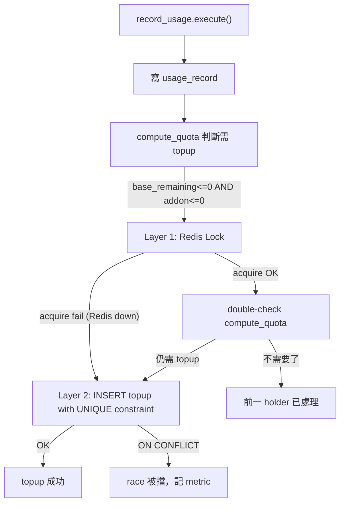
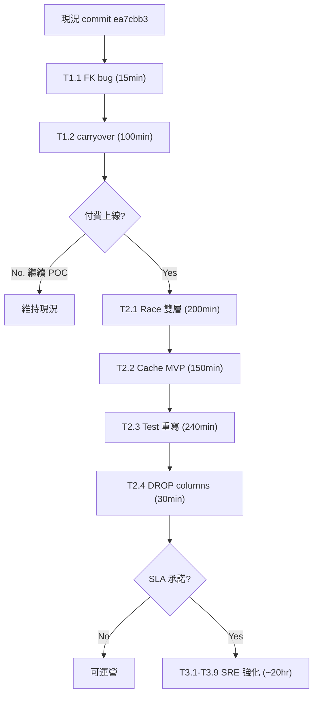

# S-Ledger-Unification — Follow-up + SRE 99% Maturity 規劃

> 本計畫延續 2026-04-24 已完成的 S-Ledger-Unification 架構改造（commit `ea7cbb3`, Issue #41），
> 列出剩餘的補強項目 + 未來演進到「SLO 99%+ 雙層 SRE 強度」的完整 roadmap。
>
> **使用方式**：不立即執行，作為日後開發的 reference plan。觸發條件達成時（付費上線 / 流量成長 / 跨月 cron 啟動），
> 直接來這裡挑對應階段執行。

---

## TL;DR — 執行決策矩陣

| 階段 | 觸發條件 | 必做項目 | 估工 |
|------|---------|---------|-----|
| **Tier 1（補強）** | 現況 | #5 FK bug, #1 carryover | 2 hr |
| **Tier 2（收費前）** | 商業決定付費上線 | #3 雙層 race, #4 L1 cache MVP, #6 test 重寫 | 12 hr |
| **Tier 3（SRE 頂級）** | SLA/SLO 承諾 or 流量 > 100 TPS | Circuit breaker, audit job, chaos test, DR drill | 20 hr |
| **Tier 4（cleanup）** | 任何時候順手做 | #2 DROP deprecated columns | 0.5 hr |

---

## Tier 1：補強（現況建議完成）

### T1.1 — P0: `billing_transaction.ledger_id` FK violation（15 min）

**症狀**：P4 refactor 後 `TopupAddonUseCase` 寫 `ledger_id=""` 空字串 → 違反 FK `billing_transactions_ledger_id_fkey` → INSERT 被 try/except 吞掉 → **auto_topup 永遠沒有 billing_transaction 紀錄**。

**影響**：
- Billing dashboard 顯示「本月 auto_topup 0 筆」
- Admin `/admin/quota-events` 看不到 auto_topup
- 金流審計斷層（compliance risk on paid tier）

**修法**：

```python
# apps/backend/src/application/billing/topup_addon_use_case.py
class TopupAddonUseCase:
    def __init__(
        self,
        topup_repository: TokenLedgerTopupRepository,
        billing_transaction_repository: BillingTransactionRepository,
        ledger_repository: TokenLedgerRepository,  # + new
    ):
        self._topup_repo = topup_repository
        self._billing_repo = billing_transaction_repository
        self._ledger_repo = ledger_repository

    async def execute(self, *, tenant_id, cycle_year_month, plan):
        if plan.addon_pack_tokens <= 0:
            return None

        ledger = await self._ledger_repo.find_by_tenant_and_cycle(
            tenant_id, cycle_year_month
        )
        if ledger is None:
            return None  # defensive

        # ... topup_repo.save(...)
        tx = BillingTransaction(..., ledger_id=ledger.id)
        await self._billing_repo.save(tx)
```

Container 加注入。

**驗收**：
- [ ] BDD scenario: `auto_topup 觸發後 billing_transactions 應有 1 筆且 ledger_id 非空`
- [ ] 跑 integration：強制觸發 topup，DB 驗 `billing_transactions.ledger_id` 是有效 UUID

---

### T1.2 — P1: `EnsureLedgerUseCase` addon carryover 失效（100 min）

**症狀**：舊邏輯讀 `last.addon_remaining`（mutable），P4 後此欄位不再維護 → 每月跨月 carryover 永遠 0 → 租戶上月 addon 餘額被「偷」。

**引爆時機**：`ProcessMonthlyResetUseCase` cron 跑的第一個月初，全體租戶都會踩（若上月有 addon）。

**修法**：

```python
# apps/backend/src/application/ledger/ensure_ledger_use_case.py

def _previous_cycle(cycle: str) -> str:
    """'2026-05' → '2026-04', '2026-01' → '2025-12'"""
    y, m = cycle.split("-")
    y, m = int(y), int(m)
    if m == 1:
        return f"{y-1:04d}-12"
    return f"{y:04d}-{m-1:02d}"


class EnsureLedgerUseCase:
    def __init__(
        self,
        ledger_repository,
        plan_repository,
        compute_quota,  # + ComputeTenantQuotaUseCase
        topup_repository,  # + TokenLedgerTopupRepository
    ):
        ...

    async def execute(self, tenant_id: str, plan_name: str) -> TokenLedger:
        cycle = current_year_month()
        existing = await self._ledger_repo.find_by_tenant_and_cycle(tenant_id, cycle)
        if existing:
            return existing

        plan = await self._plan_repo.find_by_name(plan_name)
        base_total = plan.base_monthly_tokens if plan else 0

        # Compute last month's final addon_remaining
        last_cycle = _previous_cycle(cycle)
        try:
            last_snapshot = await self._compute_quota.execute(
                tenant_id, cycle=last_cycle
            )
            carryover = last_snapshot.addon_remaining  # 可為負（deficit carryover）
        except EntityNotFoundError:
            carryover = 0

        # Create new cycle ledger
        ledger = TokenLedger(
            tenant_id=tenant_id,
            cycle_year_month=cycle,
            plan_name=plan_name,
            base_total=base_total,
            base_remaining=base_total,  # dead weight but not null
            addon_remaining=0,  # dead weight
            total_used_in_cycle=0,  # dead weight
        )
        await self._ledger_repo.save(ledger)

        # Write carryover as first topup of new cycle
        if carryover != 0:
            await self._topup_repo.save(TokenLedgerTopup(
                tenant_id=tenant_id,
                cycle_year_month=cycle,
                amount=carryover,
                reason=REASON_CARRYOVER,
            ))

        return ledger
```

**循環依賴處理**：
- EnsureLedger 依賴 ComputeQuota
- ComputeQuota 只在「讀當月」時呼叫 EnsureLedger，「讀上月」走 `cycle=last_cycle` 參數路徑（不呼叫 EnsureLedger）
- 循環打得開

**驗收**：
- [ ] BDD: 租戶 4 月 addon=2M → 5 月 ensure_ledger → 5 月 topup 有 1 筆 carryover=2M
- [ ] BDD: 租戶 4 月 overage 造成 addon=-500K → 5 月 carryover=-500K（負數 deficit 繼承）
- [ ] BDD: 租戶首次建 ledger（無上月）→ 不寫 carryover topup
- [ ] Unit test: `_previous_cycle` 跨年邊界 `2026-01 → 2025-12`

---

## Tier 2：收費前必修（商業決定上線時執行）

### T2.1 — P2 #3: 雙層 Topup Race 防護（~200 min）

**背景**：同一租戶 concurrent requests 同時踩 addon 耗盡邊界 → 各自判定要 topup → 雙發。POC 期 `addon_price=0` 無金流損失；收費後每次誤觸收 1500-3500 TWD。

**雙層設計**：



#### Layer 1：Redis Lock（primary defense）

```python
# apps/backend/src/infrastructure/ratelimit/redis_topup_lock.py
class RedisTopupLock:
    """topup race 防護。仿 RedisConversationLock 模式。"""

    def __init__(self, redis: Redis, ttl_seconds: int = 5):
        self._redis = redis
        self._ttl = ttl_seconds

    async def acquire(self, tenant_id: str, cycle: str) -> str | None:
        """嘗試取得鎖。回傳 lock_token（None=失敗）。"""
        key = f"topup:lock:{tenant_id}:{cycle}"
        token = str(uuid4())
        ok = await self._redis.set(key, token, nx=True, ex=self._ttl)
        return token if ok else None

    async def release(self, tenant_id: str, cycle: str, token: str) -> None:
        """Lua script 確保只釋放自己的鎖（防 TTL 到期被別人持有後誤釋放）"""
        key = f"topup:lock:{tenant_id}:{cycle}"
        script = """
        if redis.call('GET', KEYS[1]) == ARGV[1] then
            return redis.call('DEL', KEYS[1])
        else
            return 0
        end
        """
        await self._redis.eval(script, 1, key, token)
```

#### Layer 2：DB UNIQUE Constraint（backup defense, SRE 保底）

```sql
-- migrations/add_token_ledger_topups_round.sql
ALTER TABLE token_ledger_topups
    ADD COLUMN topup_round INT;

-- Backfill existing rows
UPDATE token_ledger_topups SET topup_round =
    ROW_NUMBER() OVER (PARTITION BY tenant_id, cycle_year_month, reason
                       ORDER BY created_at)
WHERE topup_round IS NULL;

ALTER TABLE token_ledger_topups
    ALTER COLUMN topup_round SET NOT NULL,
    ADD CONSTRAINT uq_topup_cycle_round
        UNIQUE (tenant_id, cycle_year_month, reason, topup_round);
```

```python
# Topup write flow
async def execute(self, *, tenant_id, cycle, plan):
    # Find next round number
    last_round = await self._topup_repo.max_round(
        tenant_id, cycle, reason="auto_topup"
    )
    new_round = (last_round or 0) + 1

    topup = TokenLedgerTopup(
        tenant_id=tenant_id,
        cycle_year_month=cycle,
        amount=plan.addon_pack_tokens,
        reason="auto_topup",
        topup_round=new_round,
    )
    try:
        await self._topup_repo.save(topup)
    except IntegrityError as e:
        if "uq_topup_cycle_round" in str(e):
            logger.warning("topup.race_detected_by_db_layer",
                          tenant_id=tenant_id, cycle=cycle)
            # Metric: topup_race_db_defense_hit_total.inc()
            return None
        raise
```

#### 整合到 RecordUsageUseCase

```python
async def _check_topup_after_record(self, tenant_id):
    tenant = await self._tenant_repo.find_by_id(tenant_id)
    if tenant is None:
        return

    quota = await self._compute_quota.execute(tenant_id)
    if quota.base_remaining > 0 or quota.addon_remaining > 0:
        return

    # Layer 1: Redis Lock
    lock_token = await self._topup_lock.acquire(tenant_id, quota.cycle)
    if lock_token is None:
        # 已有別人在處理，讓對方去
        logger.info("topup.lock_contended", tenant_id=tenant_id)
        return

    try:
        # Double-check inside lock
        quota = await self._compute_quota.execute(tenant_id)
        if quota.base_remaining > 0 or quota.addon_remaining > 0:
            return  # Already toppped up by lock holder

        plan = await self._plan_repo.find_by_name(tenant.plan)
        if plan is not None:
            # Layer 2: DB UNIQUE will catch any残留 race
            await self._topup_addon.execute(
                tenant_id=tenant_id,
                cycle_year_month=quota.cycle_year_month,
                plan=plan,
            )
    finally:
        await self._topup_lock.release(tenant_id, quota.cycle, lock_token)
```

**驗收**：
- [ ] BDD: 兩個 concurrent record_usage 同時耗盡 → 只 1 筆 topup
- [ ] BDD: Redis 斷線情境 → DB UNIQUE 仍擋得掉
- [ ] Unit test: `topup_round` 正確遞增
- [ ] Metric: `topup_race_redis_defense_hit_total` / `topup_race_db_defense_hit_total` 曝出

---

### T2.2 — P2 #4 Phase 1: 3-SUM 熱路徑 L1 Cache MVP（~150 min）

**範圍**：先做能動的 cache，SRE 強度留 Tier 3。

```python
# apps/backend/src/infrastructure/cache/redis_quota_cache.py
class RedisQuotaCache:
    """L1 cache for ComputeTenantQuotaUseCase。Cache miss → fallback SUM。"""

    TTL_SECONDS = 3600

    def __init__(self, redis: Redis):
        self._redis = redis

    def _key(self, tenant_id: str, cycle: str) -> str:
        return f"quota:snapshot:{tenant_id}:{cycle}"

    async def get(self, tenant_id: str, cycle: str,
                  rules_version: int) -> QuotaSnapshot | None:
        try:
            data = await self._redis.hgetall(self._key(tenant_id, cycle))
            if not data:
                return None
            if int(data.get(b"rules_version", 0)) != rules_version:
                return None  # 規則改過，cache 失效
            return _deserialize(data)
        except (RedisError, ConnectionError):
            logger.warning("quota_cache.redis_failed", exc_info=True)
            return None  # Graceful degradation

    async def set(self, tenant_id, cycle, snapshot, rules_version):
        try:
            await self._redis.hset(self._key(tenant_id, cycle), mapping={
                "audit_total": snapshot.total_audit_in_cycle,
                "billable_total": snapshot.total_billable_in_cycle,
                "topup_total": snapshot.topup_total,
                "rules_version": rules_version,
            })
            await self._redis.expire(self._key(tenant_id, cycle), self.TTL_SECONDS)
        except (RedisError, ConnectionError):
            logger.warning("quota_cache.write_failed", exc_info=True)

    async def incr(self, tenant_id, cycle, field, delta):
        """Write-through: record_usage 寫完後增量更新"""
        try:
            async with self._redis.pipeline() as pipe:
                pipe.hincrby(self._key(tenant_id, cycle), field, delta)
                pipe.expire(self._key(tenant_id, cycle), self.TTL_SECONDS)
                await pipe.execute()
        except (RedisError, ConnectionError):
            logger.warning("quota_cache.incr_failed", exc_info=True)

    async def invalidate(self, tenant_id: str):
        """tenant.included_categories 改動時"""
        try:
            keys = [k async for k in self._redis.scan_iter(
                f"quota:snapshot:{tenant_id}:*"
            )]
            if keys:
                await self._redis.delete(*keys)
        except (RedisError, ConnectionError):
            logger.warning("quota_cache.invalidate_failed", exc_info=True)
```

**Tenant entity 加 `rules_version`**（每次 `included_categories` 改就 bump）：

```sql
ALTER TABLE tenants ADD COLUMN rules_version INT NOT NULL DEFAULT 1;
```

**ComputeTenantQuotaUseCase 整合**：

```python
async def execute(self, tenant_id, cycle=None) -> TenantQuotaSnapshot:
    tenant = await self._tenant_repo.find_by_id(tenant_id)
    # ... resolve cycle ...

    # L1: Redis
    if cycle == current_cycle:  # 只 cache 當月（歷史月份不變，省）
        cached = await self._cache.get(tenant_id, cycle, tenant.rules_version)
        if cached is not None:
            return cached

    # L2: DB SUM (slow path)
    audit, billable, topup = await asyncio.gather(
        self._usage_repo.sum_tokens_in_cycle(tenant_id, target_cycle),
        self._usage_repo.sum_billable_tokens_in_cycle(
            tenant_id, target_cycle, tenant.included_categories),
        self._topup_repo.sum_amount_in_cycle(tenant_id, target_cycle),
    )

    snapshot = _build_snapshot(tenant, ledger, audit, billable, topup)
    if cycle == current_cycle:
        await self._cache.set(tenant_id, cycle, snapshot, tenant.rules_version)
    return snapshot
```

**Write-through hooks**：

```python
# record_usage_use_case.py
await self._usage_repo.save(record)
# 增量 update cache
await self._cache.incr(tenant_id, cycle, "audit_total", total_tokens)
if _is_billable(tenant.included_categories, category):
    await self._cache.incr(tenant_id, cycle, "billable_total", total_tokens)
```

**驗收**：
- [ ] Cache hit 率 > 90%（單 tenant 穩定流量場景）
- [ ] Redis 掛 → API 仍正常（fallback SUM）
- [ ] tenant.included_categories 改動 → 下次讀取自動失效重建
- [ ] BDD: integration test 覆蓋 hit/miss/invalidate

**不做**（留 Tier 3）：
- Circuit breaker
- Cache stampede lock
- Metrics 曝出（Prometheus）
- Audit 一致性驗證 job

---

### T2.3 — P3 #6: Integration Test Steps 重寫（240 min）

**症狀**：`auto_topup.feature` / `two_page_consistency.feature` 等 step 直接 `ledger.base_remaining = X` 當 setup primitive，新架構下 mutable 欄位不再有意義。

**做法**：抽共用 helper，讓 test step 用「寫 usage + 寫 topup」表達想要的 quota 狀態。

```python
# apps/backend/tests/integration/conftest.py

async def seed_quota_state(
    container,
    tenant_id: str,
    *,
    base_used: int = 0,           # 想 base 消耗多少
    addon_balance: int = 0,       # 想 addon 餘額多少（可負）
    cycle: str | None = None,
):
    """透過寫 usage_records + topups，seed 出指定的 compute_quota 結果。

    base_used 透過寫一筆計費 category usage。
    addon_balance 透過寫 topup + （視需要）額外 usage 造成 overage。
    """
    cycle = cycle or current_year_month()
    usage_repo = container.usage_repository()
    topup_repo = container.token_ledger_topup_repository()
    ledger = await container.ensure_ledger_use_case()(tenant_id, "starter")

    if base_used > 0:
        await usage_repo.save(UsageRecord(
            tenant_id=tenant_id, request_type="rag", model="test",
            input_tokens=base_used, output_tokens=0,
            created_at=datetime.now(timezone.utc),
        ))

    # addon_balance = topup_sum - overage
    # 策略：寫 topup=max(0, addon_balance) 的量，
    #       再寫 usage 造成對應 overage（若 addon_balance 為負）
    overage = max(0, -addon_balance)
    topup_amount = max(0, addon_balance) + overage

    if topup_amount > 0:
        await topup_repo.save(TokenLedgerTopup(
            tenant_id=tenant_id, cycle_year_month=cycle,
            amount=topup_amount, reason="manual_adjust",
        ))

    if overage > 0:
        # 加寫 usage 把 overage 吃掉 addon
        extra = ledger.base_total - base_used + overage
        await usage_repo.save(UsageRecord(
            tenant_id=tenant_id, request_type="rag", model="test",
            input_tokens=extra, output_tokens=0,
            created_at=datetime.now(timezone.utc),
        ))
```

**改寫範圍**：
- `auto_topup.feature` + steps（3 scenarios）
- `two_page_consistency.feature` + steps
- `quota_overview.feature` + steps
- `quota_usage_consistency.feature` + steps
- `token_ledger.feature` + steps

**驗收**：
- [ ] `make test-integration` 全綠
- [ ] Coverage ≥ 既有 threshold

---

### T2.4 — P3 #2: DROP Deprecated Columns（30 min, 合併做）

```sql
-- migrations/drop_token_ledgers_deprecated_columns.sql
ALTER TABLE token_ledgers
    DROP COLUMN IF EXISTS base_remaining,
    DROP COLUMN IF EXISTS addon_remaining,
    DROP COLUMN IF EXISTS total_used_in_cycle;
```

同步 ORM model + domain entity + ensure_ledger_use_case（移除寫這 3 欄位的 code）。

**可單做、可併 T2.1/T2.2 做**。建議併 T2.2 這個 cleanup migration 一次完成。

---

## Tier 3：SRE 99% 頂級（SLA 承諾時）

> 觸發條件：正式商業化 + 有 SLA 承諾（e.g. 99.9% uptime, p99 < 500ms）

### T3.1 — Circuit Breaker for Redis Dependencies

**問題**：Redis 如果連續 fail（not just slow），目前 code 是 try/except 降級，但每個 request 都會先試 Redis timeout 再 fallback → 整個 API 被 Redis 拖慢。

**解法**：Circuit breaker pattern。

```python
# apps/backend/src/infrastructure/cache/circuit_breaker.py
class CircuitBreaker:
    """
    States: CLOSED → OPEN → HALF_OPEN → CLOSED

    - CLOSED: 正常呼叫 Redis
    - OPEN: 連續 N 次 fail 後，跳過 Redis 直接 fallback
    - HALF_OPEN: 經過 cooldown 後，試探性放一個 request 看 Redis 好了沒
    """
    def __init__(self, failure_threshold=5, cooldown_seconds=30):
        self._state = "CLOSED"
        self._failures = 0
        self._opened_at = None
        self._threshold = failure_threshold
        self._cooldown = cooldown_seconds

    async def call(self, fn, *args, **kwargs):
        if self._state == "OPEN":
            if time.time() - self._opened_at > self._cooldown:
                self._state = "HALF_OPEN"
            else:
                raise CircuitBreakerOpen()

        try:
            result = await fn(*args, **kwargs)
            if self._state == "HALF_OPEN":
                self._state = "CLOSED"
                self._failures = 0
            return result
        except Exception:
            self._failures += 1
            if self._failures >= self._threshold:
                self._state = "OPEN"
                self._opened_at = time.time()
            raise
```

套用於：
- `RedisQuotaCache` 所有方法
- `RedisTopupLock`
- 未來其他 Redis-dep 服務

### T3.2 — Cache Stampede Prevention

**問題**：cache miss 時，同時 N 個 request 都去打 DB SUM → thundering herd → DB spike。

**解法**：miss-lock pattern。

```python
async def compute_quota(tenant_id):
    cached = await self._cache.get(tenant_id, cycle, rules_version)
    if cached:
        return cached

    # Miss: 取 rebuild lock，失敗者等待重試
    lock_key = f"quota:rebuild:{tenant_id}:{cycle}"
    lock_token = await self._redis.set(lock_key, "1", nx=True, ex=5)

    if not lock_token:
        # 另一個人正在 rebuild，等 200ms 再讀 cache
        await asyncio.sleep(0.2)
        cached = await self._cache.get(tenant_id, cycle, rules_version)
        if cached:
            return cached
        # 還沒好，直接 fallback DB（最差情況也不 worse than 無 cache）
        return await self._rebuild_from_db(...)

    try:
        snapshot = await self._rebuild_from_db(...)
        await self._cache.set(...)
        return snapshot
    finally:
        await self._redis.delete(lock_key)
```

### T3.3 — Audit 一致性驗證 Job

**問題**：cache 和 DB 可能 drift（bug / race / 手動 DB 改）。需要定期審計。

**解法**：arq cron job。

```python
# apps/backend/src/application/quota/audit_cache_consistency_use_case.py
class AuditCacheConsistencyUseCase:
    """
    每小時跑一次：
    1. 隨機抽 10 個 active tenant
    2. 比對 cache 值 vs DB SUM
    3. 不一致 → log + invalidate cache + metric
    """
    async def execute(self):
        tenants = await self._tenant_repo.sample_active(n=10)
        mismatches = []
        for t in tenants:
            cached = await self._cache.get(t.id, current_cycle, t.rules_version)
            if not cached:
                continue
            db_snapshot = await self._compute_quota_nocache.execute(t.id)
            if cached.billable_total != db_snapshot.billable_total:
                mismatches.append({
                    "tenant": t.id,
                    "cache": cached.billable_total,
                    "db": db_snapshot.billable_total,
                    "drift": cached.billable_total - db_snapshot.billable_total,
                })
                await self._cache.invalidate(t.id)
        if mismatches:
            logger.error("quota_cache.drift_detected", mismatches=mismatches)
```

### T3.4 — Chaos Engineering Drill

**驗證 SRE 強度**：

| Chaos 情境 | 預期行為 | 驗收 |
|-----------|---------|------|
| Redis Container 被 kill | API 繼續運作（fallback SUM）+ logs 出現 warning | 自動切換無感知 |
| Redis 網路延遲（latency 注入 500ms） | Circuit breaker 5 次 timeout 後 OPEN | API p99 無 regression |
| DB 連線 pool exhausted | Request 快速 fail（non-timeout）+ 5xx | 不會整個系統 hang |
| usage_records 表 bloat 10M rows | SUM query 仍 < 200ms（靠 partial index） | p95 SLO 不破 |
| Clock skew（app server 時鐘差 10min） | Cycle 判斷邏輯正確（全部走 UTC） | 跨月邊界不錯 |

工具：Docker Compose `pause/kill` + `tc netem` 注入 latency。

### T3.5 — Partial Index for `usage_records` Cycle Queries

**問題**：`usage_records` 表全域成長，但多數 SUM 只查「本月」。全表 index scan 浪費。

```sql
-- 只索引最近 3 個月的 rows（assumes cycle_year_month 能從 created_at 推得）
CREATE INDEX ix_usage_records_recent_cycle
    ON token_usage_records (tenant_id, created_at DESC)
    WHERE created_at > NOW() - INTERVAL '3 months';
```

搭配 `pg_partman` 做月度 partitioning，超過 6 月的 partition detach 到 cold storage。

### T3.6 — DR（Disaster Recovery）演練

每季一次：
- [ ] PostgreSQL failover 到 read-replica（模擬 primary 掛）
- [ ] Redis 從零重建（全 cache 失效）→ 觀察 DB load spike，p95 regression 時間
- [ ] Point-in-time recovery：把 `token_ledger_topups` 回復到 5 分鐘前狀態，驗證 compute_quota 正確性

### T3.7 — SLO Dashboard & Error Budget

| SLI | SLO | Error Budget/Month |
|-----|-----|--------------------|
| Quota API availability | 99.9% | 43 min downtime |
| Quota API p95 latency | < 300ms | 5% requests 可超 |
| Cache hit rate | > 90% | - |
| Topup correctness | 100% | 0 重複 topup |
| Carryover correctness | 100% | 0 漏繼承 |

觸發 error budget 用完 → 停 feature dev，全力穩定性。

### T3.8 — Observability Stack

即使不做 Grafana，為了未來接 instrumentation，code 裡**先埋 metric counter/histogram 介面**，現在用 noop implementation：

```python
class QuotaMetrics:
    def cache_hit(self, tenant_id): pass
    def cache_miss(self, tenant_id): pass
    def cache_rebuild_duration(self, duration_ms): pass
    def topup_race_detected(self, layer: Literal["redis", "db"]): pass
    def quota_drift_detected(self, tenant_id, drift_amount): pass
```

未來接 Prometheus client 時只需改 implementation，不改 caller。

### T3.9 — Feature Flag for Cache

讓 cache 可以在 runtime 被關閉（e.g. debug / incident）：

```python
if await self._feature_flags.is_enabled("quota_cache_enabled"):
    cached = await self._cache.get(...)
```

---

## Tier 4：Cleanup（隨時可做）

### T4.1 — DROP deprecated ledger columns（30 min）

見 T2.4，建議合併 T2.x 做。

### T4.2 — Deprecated code path 清除

- `GetTenantQuotaUseCase` 目前仍在 container 保留但無人用 → 可移除
- `test_get_tenant_quota_sum_source.py` 對應測試 → 可移除

---

## Refactor 整體視角 — 下一個架構演進方向

當 Tier 2-3 都完成後，這個系統的演進路徑：

### A. CQRS Lite → Full Event Sourcing

當前 S-Ledger-Unification 已經是「ES-lite」：truth = append-only log, derived = computed view。  
下一步如果規模大到需要 projection 預先計算（不是 read-time SUM），可引入：

- Event store: 所有 `TokenUsageRecorded`, `TopupApplied`, `CarryoverWritten` 都 append
- Projection: materialized view（或 denormalized table）由 worker 訂閱 event 更新
- Read API 只讀 projection，不碰 events

適用時機：單租戶 rows > 10M / 月、或需要複雜 analytics query（非單純 SUM）。

### B. 提取 Billing Bounded Context

當前 `billing_transactions` 和 `token_ledgers` 混在同個 DDD context。若：
- 發票、退款、多幣別、優惠券等 billing 複雜度增加
- 需要 Stripe / ECPay / 綠界等 payment gateway 整合

→ 拆成獨立 Billing BC，透過 domain event 與 Ledger BC 溝通。

### C. 多 tenant 資料分區（Sharding）

當 usage_records 單表 > 100M rows，考慮：
- 按 tenant_id hash 分 shard
- 或按 cycle_year_month range 分 partition
- Cross-shard query 走 federated 或走 analytics warehouse（BigQuery / ClickHouse）

### D. Real-time Billing Dashboard

現在 admin 看 quota 要手動 refresh。下一步：
- SSE / WebSocket push cache 變化
- 或接 CDC（Change Data Capture）從 DB 變更 stream 到前端

---

## 執行優先序建議



---

## 六階段合規檢查

- [x] **Stage 1 — DDD 設計**：
  - Tier 1: Domain (EnsureLedger 加 compute_quota dep), Application (TopupAddon 加 ledger_repo)
  - Tier 2: Domain (topup_round VO), Infrastructure (RedisTopupLock / RedisQuotaCache), Application (integration)
  - Tier 3: Infrastructure (CircuitBreaker, observability), Application (AuditCacheConsistency)

- [x] **Stage 2 — BDD 行為規格**：
  - T1.1: `tests/features/integration/admin/auto_topup_billing_tx_ledger_id.feature`
  - T1.2: `tests/features/unit/ledger/ensure_ledger_carryover.feature`
  - T2.1: `tests/features/integration/admin/concurrent_topup_dual_defense.feature`
  - T2.2: `tests/features/unit/quota/compute_quota_with_cache.feature`

- [x] **Stage 3 — TDD 紅燈測試**：每個 Tier 實作前先寫失敗測試

- [x] **Stage 4 — 實作順序**：Domain → Application → Infrastructure → Interfaces（後端），Type → Hook → Component（前端）

- [x] **交付階段**：
  - 全量 test / lint 通過
  - Conventional Commits + Closes #41 後續 Issue
  - 架構學習筆記追加
  - SPRINT_TODOLIST 同步
