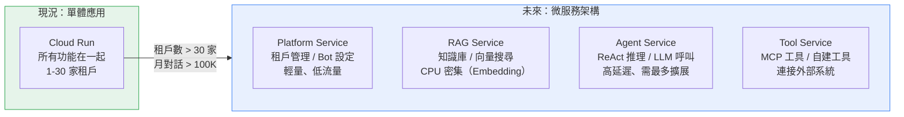
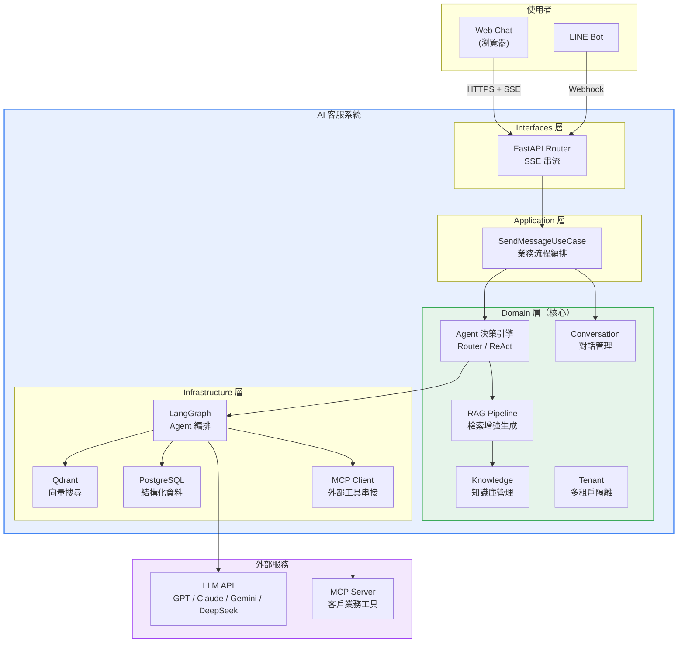

# 系統架構

## 一、架構設計理念

本系統採用 **DDD（Domain-Driven Design）4 層架構** + **多租戶（Multi-Tenant）**設計，核心目標：

- **一套系統服務多家客戶**，每家資料完全隔離
- **LLM 模型可替換**，不綁定單一 AI 廠商
- **功能可擴展**，新增業務工具不需改動核心架構
- **安全合規**，租戶之間資料不互通

---

## 二、技術棧

### 後端

| 類別 | 技術 | 用途 |
|------|------|------|
| 語言 | Python 3.12 | 主力開發語言 |
| Web 框架 | FastAPI | 高效能非同步 API + SSE 串流 |
| AI 編排 | LangGraph | Agent 流程編排（ReAct 推理迴圈） |
| 向量搜尋 | Qdrant | 知識庫語意搜尋 |
| 資料庫 | PostgreSQL 16 | 租戶、Bot、對話等結構化資料 |
| 快取 | Redis / InMemoryCache | Rate Limit、Session 快取 |
| DI 容器 | dependency-injector | 依賴注入，方便測試和替換元件 |

### 前端

| 類別 | 技術 | 用途 |
|------|------|------|
| 框架 | React + Vite SPA | 單頁應用，快速載入 |
| UI 元件 | shadcn/ui + Tailwind CSS | 現代化介面設計 |
| 狀態管理 | Zustand + TanStack Query | 客戶端 + 伺服器狀態分離 |
| 即時通訊 | SSE（Server-Sent Events） | AI 回答串流輸出 |

### 部署

| 服務 | 平台 | 說明 |
|------|------|------|
| 後端 | GCP Cloud Run | 無伺服器，按需計費 |
| 前端 | Cloud Storage + CDN | 純靜態檔託管 |
| 資料庫 | Cloud SQL for PostgreSQL | 託管式 PostgreSQL |
| 向量搜尋 | GCE VM（Qdrant） | 自建，persistent disk |

---

## 三、DDD 4 層架構

系統分為四層，嚴格遵守**由外向內**的依賴方向：

### 分層說明

| 層級 | 職責 | 範例 |
|------|------|------|
| **Interfaces 層** | HTTP API 端點，接收請求、回傳結果 | FastAPI Router |
| **Application 層** | 業務流程編排，協調各 Domain 物件 | Use Case（如 SendMessageUseCase） |
| **Domain 層** | 核心業務邏輯，不依賴任何外部技術 | Entity、Value Object、Domain Event |
| **Infrastructure 層** | 技術實作，連接外部系統 | 資料庫存取、Qdrant、LLM API |

### 依賴規則

- Domain 層是核心，**不依賴任何外層**
- Application 層只依賴 Domain 層的介面
- Infrastructure 層**實作** Domain 層定義的介面
- 替換 LLM 模型或資料庫，只需改 Infrastructure 層，不影響業務邏輯

### 這樣設計的好處（給部長聽的版本）

| 好處 | 白話說明 |
|------|---------|
| 模型不綁死 | 今天用 GPT，明天想換 Claude 或 Gemini，改一個設定就好 |
| 測試容易 | 核心邏輯可以不連資料庫、不連 AI 模型就跑測試 |
| 新功能快 | 要加「查訂單」功能，只需加一個 Tool，不用改整個系統 |
| 維護安全 | 每一層職責清楚，改 A 不會壞 B |

---

## 四、5 大業務模組（Bounded Context）

| 模組 | 職責 | 核心功能 |
|------|------|---------|
| **Tenant（租戶管理）** | 多租戶隔離 | 租戶建立、API Key 管理、用量追蹤 |
| **Knowledge（知識庫）** | 文件管理與向量化 | 上傳文件 → 解析 → 分塊 → 向量化 → 存入 Qdrant |
| **RAG（檢索增強生成）** | 智慧問答核心 | 語意搜尋 → 組裝 Prompt → LLM 生成回答 |
| **Conversation（對話管理）** | 對話歷史 | 儲存對話記錄、管理對話 Session |
| **Agent（AI 代理）** | 智慧決策引擎 | 判斷意圖 → 選擇工具 → 執行動作 → 回覆 |

---

## 五、Agent 決策引擎 — 兩種模式

### Router 模式（基本問答）

適用：簡單的一問一答場景。

流程：使用者提問 → LLM 判斷意圖 → 選一個工具 → 執行 → 回覆。

特點：快速、單次決策、成本低。

### ReAct 模式（智慧 Agent）

適用：需要多步驟推理和執行動作的場景。

流程：使用者提問 → LLM 推理該做什麼 → 呼叫工具 → 觀察結果 → 決定下一步 → 循環直到完成。

特點：
- 可連續呼叫多個工具（最多 5 次）
- 自主推理，不需預設流程
- 支援 MCP 外部工具串接

### 兩種模式的差異

| 面向 | Router | ReAct |
|------|--------|-------|
| 決策方式 | 單次選擇 | 多輪推理迴圈 |
| 工具使用 | 一次一個 | 可連續呼叫多個 |
| MCP 外部工具 | 不支援 | 支援 |
| 適用場景 | 簡單問答 | 查庫存、訂預約、比較商品 |
| 成本 | 較低（LLM 呼叫 1-2 次） | 較高（LLM 呼叫 2-5 次） |

### 模式切換

每個 Bot 可獨立設定使用哪種模式（`Bot.agent_mode`），管理員在後台即可切換，不需改程式。

---

## 六、RAG Pipeline（知識庫問答流程）

### 文件入庫流程

上傳文件 → 解析內容（PDF/TXT/MD） → 分塊切割 → 向量化（Embedding） → 存入 Qdrant 向量資料庫

- 每個 chunk 帶有 `tenant_id` 標籤，確保租戶資料隔離
- 支援 PDF、TXT、Markdown 格式

### 問答流程

使用者提問 → 問題向量化 → Qdrant 語意搜尋（含租戶過濾） → 檢索結果注入 Prompt → LLM 生成回答

- 搜尋時自動過濾 `tenant_id`，租戶之間資料不互通
- 支援相似度門檻過濾（低品質結果不回傳）
- top-k 可調（預設取最相關的 3 筆）

---

## 七、多租戶架構

### 設計原則

一套系統服務多家客戶，每家客戶（租戶）擁有：

| 資源 | 隔離方式 |
|------|---------|
| 知識庫 | 每個向量帶 tenant_id payload，搜尋時強制過濾 |
| 對話記錄 | PostgreSQL 依 tenant_id 分區 |
| Bot 設定 | 每個 Bot 綁定一個 tenant，Prompt 和設定獨立 |
| LLM 模型 | 每個 Bot 可選不同模型（GPT / Claude / Gemini） |
| API Key | 每個租戶有獨立的 API Key |

### 對部長的意義

- **一套系統賣多家** — 基礎設施成本由所有客戶共攤
- **客戶數越多，每家均攤越低** — 10 家客戶時，每家基礎設施均攤僅 $16/月
- **資料安全** — 即使共用系統，客戶之間資料完全隔離

---

## 八、通訊管道

| 管道 | 技術 | 狀態 |
|------|------|------|
| Web Chat | SSE（Server-Sent Events）串流回覆 | 已完成 |
| LINE Bot | LINE Messaging API Webhook | 已完成 |
| 其他 | 可擴展（Facebook Messenger、WhatsApp 等） | 未來規劃 |

---

## 九、開發方法論

### AI 輔助全棧開發

本系統從架構設計到程式實作，全程以 AI 輔助開發（Claude Code），一人完成前後端全棧開發。

這代表：
- **開發效率極高** — 傳統需要 3-5 人的全棧專案，一人即可交付
- **開發成本大幅降低** — 人力成本是軟體專案最大開支，AI 輔助可壓縮 60-80%
- **迭代速度快** — 新功能從設計到上線，週期以天計而非月計

### 工程方法論：DDD + BDD + TDD

雖然是 AI 輔助開發，但全程遵守業界嚴謹的軟體工程方法論，確保程式碼品質：

| 方法論 | 全稱 | 作用 | 白話說明 |
|--------|------|------|---------|
| **DDD** | Domain-Driven Design | 架構設計 | 按業務領域切分模組，每個模組職責清楚，未來可獨立拆分 |
| **BDD** | Behavior-Driven Development | 需求規格化 | 先用自然語言寫「系統應該怎麼表現」，再開發，確保做出來的是客戶要的 |
| **TDD** | Test-Driven Development | 品質保障 | 先寫測試、再寫程式，確保每個功能都有自動化測試保護 |

### 品質數據

| 指標 | 數值 |
|------|------|
| 測試覆蓋率 | ≥ 80% |
| 測試類型 | 單元測試 + BDD 行為測試 + E2E 整合測試 |
| 自動化 | 全部自動化，一行指令跑完所有測試 |

### 對部長的意義

- **不是 AI 亂寫的程式** — 有嚴謹的測試和架構方法論保障品質
- **可維護** — DDD 分層清楚，未來其他工程師接手也看得懂
- **可驗證** — 每個功能都有測試保護，改動後自動驗證不會壞掉

---

## 十、微服務就緒：未來擴展能力

### 現況：單體應用（Monolith）

目前系統以單體應用部署在 Cloud Run 上，適合 1-30 家租戶（月對話量 100K 以內）。這個階段單體架構是最佳選擇 — 部署簡單、維運成本低。

### DDD 天然支援微服務拆分

DDD 的 Bounded Context 設計讓系統未來可以**零重寫**拆分為獨立微服務。每個業務模組的邊界已經清楚定義，拆分時只需要把模組搬到獨立容器，不需要重新設計架構。

### 拆分藍圖

### 各服務拆分對應

| 微服務 | 對應 DDD 模組 | 瓶頸特性 | 為什麼要獨立 |
|--------|-------------|---------|-------------|
| **Platform Service** | Tenant + Bot + Conversation | 低流量、低延遲 | 穩定不常變動，獨立部署降低風險 |
| **RAG Service** | Knowledge + RAG | CPU/記憶體密集（Embedding 向量化） | 文件上傳時 CPU 飆高，不影響其他服務 |
| **Agent Service** | Agent（ReAct / Router） | 高延遲（每次 LLM 呼叫 ~10 秒） | 需要最多水平擴展，獨立擴容 |
| **Tool Service** | MCP + 自建 Tools | 依賴外部系統 | 外部系統故障不拖垮整個平台 |

### 擴展里程碑估算

| 階段 | 租戶數 | 月對話量 | 架構 | 月基礎設施成本 |
|------|-------|---------|------|-------------|
| Phase 1 起步 | 1-10 家 | ≤ 30K | 單體 Cloud Run | $70-164/月 |
| Phase 2 成長 | 10-30 家 | 30K-100K | 單體 + HA | $277-553/月 |
| Phase 3 規模化 | 30-100 家 | 100K-500K | 微服務（GKE） | ~$800-1,500/月 |
| Phase 4 企業級 | 100+ 家 | 500K+ | 微服務 + 訊息佇列 + 自動擴縮 | ~$2,000+/月 |

> **關鍵訊息**：從 Phase 1 到 Phase 3 完全不需要重寫程式碼，只需要將現有模組搬到獨立容器。這是 DDD 架構的核心價值。

### 各階段升級觸發點

| 升級 | 觸發條件 | 具體指標 |
|------|---------|---------|
| Phase 1 → 2 | 付費客戶上線，需要 SLA 保障 | Cloud SQL 連線數 > 40 |
| Phase 2 → 3 | 單體 Cloud Run 資源不足 | Qdrant RAM > 80% 或 Cloud Run 常態滿載 |
| Phase 3 → 4 | 尖峰併發超過 GKE 單叢集能力 | 需要跨區域部署或異步處理 |

---

## 十一、架構總覽圖

