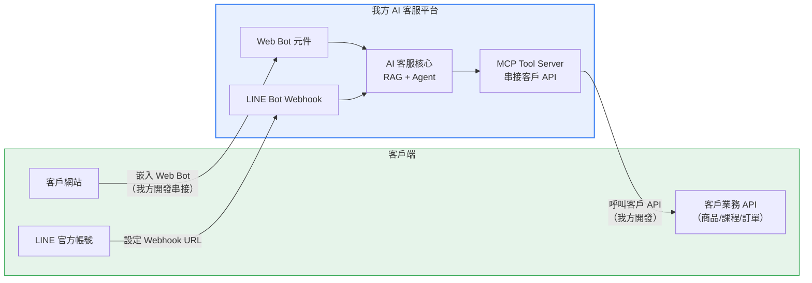
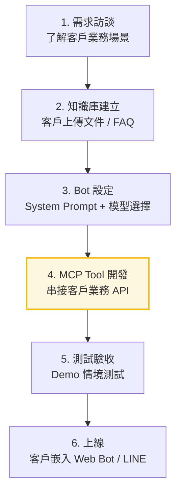

# 串接方式與上線工時

## 一、串接架構總覽

### 串接方向

| 方向 | 說明 | 負責方 |
|------|------|--------|
| **客戶 → 我方** | 客戶網站嵌入 Web Bot 元件（貼一段 JS） | 我方協助完成 |
| **客戶 → 我方** | LINE 官方帳號設定 Webhook URL 指向我方平台 | 我方設定 |
| **我方 → 客戶** | MCP Tool Server 串接客戶業務 API（查商品、查課程、訂預約等） | 我方開發 |

---

## 二、LumineAI vs 自建：串接工時對比

> 核心論點：不管用哪套系統，串接工時幾乎相同，差別在成本和功能。

### 方案 A：用 LumineAI

| 步驟 | 工作內容 | 說明 |
|------|---------|------|
| 1. LumineAI API 路由開發 | 後端寫一套路由層呼叫 LumineAI API | 語言自選，處理認證、錯誤、重試 |
| 2. 知識庫設定 | 在 LumineAI 後台上傳文件、設定 Prompt | |
| 3. 前端 Web Bot 串接 | 嵌入 LumineAI 的 Web Bot 到客戶網站 | |
| 4. 測試調整 | 測試問答品質、調整 Prompt | |
| **預估工時** | | **約 1 個月** |

### 方案 B：用自建系統

| 步驟 | 工作內容 | 說明 |
|------|---------|------|
| 1. 平台部署（一次性） | GCP 部署，完成後所有客戶共用 | 4 天，只做一次 |
| 2. 租戶 + Bot 設定 | 建立租戶、設定 Prompt、選模型 | 平台後台操作 |
| 3. 知識庫建立 | 上傳文件至平台 | |
| 4. MCP Tool 開發 | 串接客戶業務 API（查商品、查課程等） | 主要工時 |
| 5. 前端 Web Bot 串接 | 嵌入 Web Bot 到客戶網站 | 與 LumineAI 方式相同 |
| 6. 測試驗收 | 測試問答 + Agent 動作 | |
| **預估工時** | | **約 1 個月** |

### 兩方案總成本比較（第一年，單一客戶）

| | LumineAI | 自建 |
|--|---------|------|
| 串接開發工時 | ~1 個月 | ~1 個月 |
| 月營運成本 | ~35,000 TWD | ~2,500 TWD |
| **第一年月費總計** | **~420,000 TWD** | **~30,000 TWD** |
| 功能 | 基本 RAG 問答 | RAG 問答 + Agent 執行動作 |
| **一年省下** | — | **~390,000 TWD** |

> **花一樣的時間串接，但一年省 39 萬 TWD，功能還多一個層級。**

---

## 三、串接方式

### 我方 → 客戶業務系統（MCP Tool）

這是每家客戶上線的**主要開發工作**。針對客戶的業務系統開發 MCP Tool，讓 AI Agent 能查詢和操作客戶的資料。

#### 以窩廚房為例

| Tool | 功能 | 串接方式 |
|------|------|---------|
| `query_products` | 查詢商品（關鍵字、分類、價格、配送方式） | 連接客戶 MySQL 資料庫 |
| `query_courses` | 查詢課程（日期、分類、講師、名額） | 連接客戶 MySQL 資料庫，JOIN 5 張表 |

#### 串接方式選擇

| 方式 | 適用場景 | 優點 | 缺點 |
|------|---------|------|------|
| **直連客戶 DB** | 客戶願意開放 DB 連線 | 最快、最靈活 | 需要了解客戶 DB schema |
| **呼叫客戶 API** | 客戶有現成 RESTful API | 解耦，不碰客戶 DB | 依賴客戶 API 品質和穩定性 |
| **客戶提供資料匯出** | 客戶不願開放 DB 或 API | 最低門檻 | 資料非即時，需定期更新 |

### 客戶網站 → 我方 Web Bot

由我方協助完成，在客戶網站嵌入 Web Bot 元件（JS snippet）。

### LINE Bot

由我方設定 Webhook URL，客戶提供 LINE 官方帳號資訊。

---

## 四、新客戶上線流程

### 各步驟工時估算

| 步驟 | 工作內容 | 預估工時 | 備註 |
|------|---------|---------|------|
| 1. 需求訪談 | 了解客戶業務、確認 AI 客服需要做什麼 | 0.5 天 | |
| 2. 知識庫建立 | 客戶提供文件，上傳至平台 | 0.5 天 | 客戶配合提供文件 |
| 3. Bot 設定 | 設定 System Prompt、選擇 LLM 模型 | 0.5 天 | 平台後台操作 |
| 4. MCP Tool 開發 | 串接客戶業務 API | **2-5 天** | **主要工時**，依客戶系統複雜度 |
| 5. 測試驗收 | 跑 Demo 情境、調整 Prompt | 1 天 | |
| 6. 上線 | 客戶嵌入 Web Bot / 設定 LINE | 0.5 天 | 客戶配合 |
| **合計** | | **5-8 天** | 一位工程師 |

> MCP Tool 開發是變動最大的項目：
> - 簡單場景（1-2 張表、無複雜 JOIN）：**2 天**
> - 中等場景（3-5 張表、有 JOIN、多條件篩選）：**3-4 天**
> - 複雜場景（多系統串接、需要寫入操作、權限控管）：**5+ 天**

---

## 五、平台部署（一次性）

### GCP 部署流程

| 步驟 | 工作內容 | 預估工時 |
|------|---------|---------|
| GCP 專案建立 | 建立專案、啟用 API、設定 IAM | 0.5 天 |
| 資料庫 | Cloud SQL for PostgreSQL 建立 + Schema 初始化 | 0.5 天 |
| 向量搜尋 | GCE VM 建立 + Qdrant 部署 | 0.5 天 |
| 後端部署 | Cloud Run 部署 FastAPI 應用 | 0.5 天 |
| 前端部署 | Cloud Storage 部署 React SPA | 0.5 天 |
| 網域 + TLS | 設定 Custom Domain + SSL 憑證 | 0.5 天 |
| 測試 | 端對端測試 | 1 天 |
| **合計** | | **4 天** |

> 平台部署是一次性工作，完成後所有客戶共用同一套基礎設施。

---

## 六、維運需求

### 日常維運

| 項目 | 頻率 | 工時 |
|------|------|------|
| 系統監控（Cloud Run / SQL / Qdrant） | 日常 | GCP 內建告警，被動處理 |
| LLM 模型更新 | 季度 | 新模型上市時評估切換，約 0.5 天 |
| 安全性更新 | 月度 | 依賴套件更新，約 0.5 天 |
| 客戶知識庫更新 | 依客戶需求 | 客戶自行在後台操作 |
| 問題排除 | 不定期 | 依問題複雜度 |

### 人力需求

| 階段 | 租戶數 | 維運人力 |
|------|-------|---------|
| 初期 | 1-5 家 | **兼職 1 人**（開發者本人即可） |
| 成長期 | 5-15 家 | **1 人專職** |
| 規模化 | 15+ 家 | 1-2 人（開發 + 維運分工） |

---

## 七、總工時與成本摘要

### 一次性成本

| 項目 | 工時 |
|------|------|
| 平台開發（已完成） | 已投入 |
| 平台部署至 GCP | 4 天 |

### 每家客戶上線成本

| 項目 | 工時 |
|------|------|
| 需求 + 知識庫 + Bot 設定 | 1.5 天 |
| MCP Tool 開發 | 2-5 天 |
| 測試 + 上線 | 1.5 天 |
| **合計** | **5-8 天 / 家** |

### 對部長的意義

- **客戶端幾乎不需要改東西** — 貼一段 JS 就能用
- **主要工時在 MCP Tool 開發** — 但這是一次性的，開發完就持續運作
- **維運負擔低** — 初期兼職即可，不需要額外招人
- **邊際成本遞減** — 如果多家客戶是類似產業（如電商），MCP Tool 可以複用，上線時間更短
