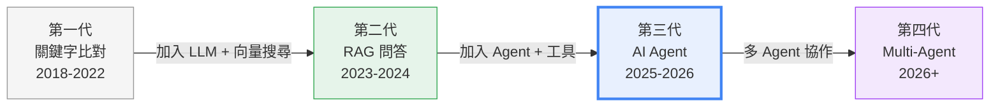
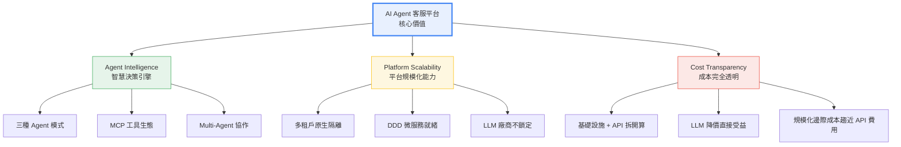

# 產品願景與市場定位

## 一、AI 客服的三代演進

AI 客服技術正在經歷一場根本性的轉變。從最初只能做關鍵字比對的 FAQ Bot，到能理解語意的 RAG 問答機器人，再到今天能主動幫客戶「做事」的 AI Agent — 每一代的跨越，都重新定義了「智慧客服」的含義。

### 三代技術對比

| 世代 | 技術基礎 | 核心能力 | 使用者體驗 | 代表方案 |
|------|---------|---------|----------|---------|
| **第一代** | 關鍵字比對 | 固定問答，命中率低 | 「答非所問」是常態 | 傳統 FAQ Bot |
| **第二代** | RAG（檢索增強生成） | 根據知識庫語意回答 | 能回答問題，但只能「說」 | 業界常見 RAG 方案 |
| **第三代** | AI Agent（ReAct + MCP） | 理解意圖 → 推理 → 呼叫工具 → 執行動作 | 不只回答，更幫客戶「做事」 | **本平台** |

### 市場數據

AI 客服已從「加分項」變成「必備項」：

- **80% 的客服組織**已導入或計畫導入 AI 來提升客服生產力與客戶滿意度（Gartner, 2025）
- **78% 的企業**在至少一個業務功能中使用 AI，較前一年的 55% 大幅成長（McKinsey State of AI Global Survey, 2025）
- Gartner 預估，對話式 AI 將在 2026 年為客服營運**節省 800 億美元**成本
- 客戶期待正在改變：不只要「回答問題」，更要「解決問題」

### 2026/03 業界熱點

| 趨勢 | 說明 | 本平台對應 |
|------|------|----------|
| **AI Agent** | LLM 搭配工具，自主推理並執行動作 | ReAct Agent（已實作） |
| **MCP（Model Context Protocol）** | Anthropic 提出、OpenAI/Google/Microsoft 已採納的工具串接標準 | MCP 工具整合（已實作） |
| **Multi-Agent** | 多個專業 Agent 協作處理複雜任務 | 架構已預留，近期規劃 |
| **LLM 價格持續下滑** | 每年降幅 50-80%，自建方案直接受益 | 成本透明、即時享受降價紅利 |

---

## 二、傳統 RAG 方案的天花板

市場上大多數 AI 客服方案停留在第二代 RAG 架構 — 能「說」但不能「做」。以下是本平台與傳統方案的核心差異：

### 六維度對比

| 維度 | 傳統 RAG 方案 | 本平台 |
|------|-------------|-------|
| **架構** | 基本 RAG（單純文件切片） | 進階 RAG + LangGraph Agent |
| **Agent 模式** | Router（意圖分流）或無 Agent | Router + ReAct 雙模式 |
| **工具能力** | 無 / Web 搜尋 / 圖片生成 | MCP 標準工具，可串接任何業務系統 |
| **LLM 選擇** | 綁定單一模型或有限選擇 | OpenAI / Anthropic / Google — 每個 Bot 獨立切換 |
| **可觀測性** | 無反饋機制 | Error Tracking + 診斷規則引擎 + 通知管道 |
| **多租戶** | 不支援 / 需額外開發 | 原生多租戶，資料完全隔離 |

### 核心論點

傳統方案的根本問題不只是功能有限，更在於**付了錢也省不了工**：

- **Prompt Engineering 的工作量不會減少** — RAG 系統中 Prompt 對輸出品質的影響占比極大，無論用哪套系統都是自己負責。差別在於，傳統方案沒有提供任何診斷工具讓你知道問題出在哪裡。
- **功能停在第二代，價格收第四代的錢** — 以業界常見的 18M tokens / 50,000 TWD 定價為例，同樣的 token 量，直接呼叫 LLM API 最貴也只需 3,510 TWD（旗艦模型 Claude Opus 4.6），價差 14 倍。若使用客服推薦級模型（如 GPT-5 mini、Gemini 2.5 Flash），成本不到 250 TWD，**價差超過 200 倍**。

---

## 三、我們的定位：AI Agent 客服平台

### 一句話定義

> **一套平台，多家客戶，AI 幫客戶解決問題。**

我們不是另一個 RAG 聊天機器人。我們是一個**多租戶 AI Agent 客服平台** — 不只回答問題，更幫客戶做事。

### 核心場景

真正的「智慧」不是能回答問題，而是能幫客戶執行動作：

| 場景 | 傳統方案的回覆 | 本平台的回覆 |
|------|-------------|-----------|
| 「下週六的親子課程還有名額嗎？」 | 「請聯繫客服確認」 | 呼叫 `query_courses` → 即時查詢 DB →「XX 課程還有 3 個名額，要幫您預約嗎？」 |
| 「幫我查 2000 元以下的低溫宅配商品」 | 「我們有多種商品，建議到官網查看」 | 呼叫 `query_products` → 條件篩選 → 回覆商品清單含價格和評價 |
| 「我想退這筆訂單」 | 「請填寫退貨表單」 | 呼叫退貨 Tool → 引導填寫 → 自動建立退貨單 →「退貨已受理，預計 3-5 天退款」 |

如果 AI 客服只能聊天，那跟 Google 搜尋沒有本質差異。**能幫客戶執行動作，才是 AI Agent 的價值所在**。

---

## 四、自建的三大優勢

### 1. 品質可控

- 完整的可觀測性：Error Tracking + 診斷規則引擎（10 條單一規則 + 4 條組合規則）
- RAG 評估三層次（L1 回答品質 / L2 檢索品質 / L3 端到端）
- 通知管道（Email / Slack / Teams）+ 節流機制，問題即時告警

### 2. 成本可控

- 成本結構完全透明：基礎設施（固定）+ LLM API（按用量）
- 每次對話成本 2.3-2.6 TWD（傳統方案約 35.8 TWD，差距 14 倍）
- LLM 降價紅利直接反映在營運成本上

### 3. 功能可擴展

- MCP 工具生態：每個新業務功能 = 加一個 Tool，不需改核心架構
- Agent 雙模式（Router / ReAct）覆蓋從簡單問答到多步推理 + 工具呼叫
- DDD 架構支撐微服務拆分，從 1 家到 1000 家客戶平滑擴展

---

## 五、核心價值主張

### 三支柱

**對管理層的核心訊息**：

1. **技術領先** — 我們已站在第三代 AI Agent 的位置，具備 2026/03 業界最新的 Agent + MCP + Multi-Agent 能力
2. **商業模式清晰** — 一套平台服務多家客戶，客戶越多邊際成本越低，定價收傳統方案的一半仍有 53% 毛利
3. **風險可控** — DDD 架構 + 353 測試檔 + 539 測試案例 + ≥80% 覆蓋率，工程品質有嚴謹保障

