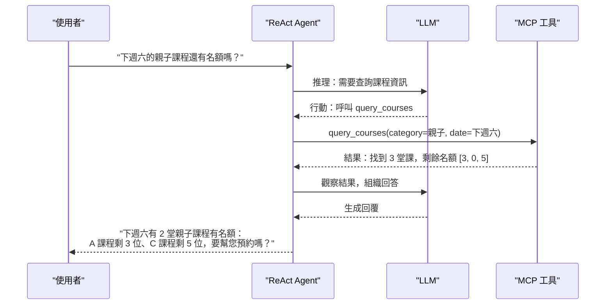
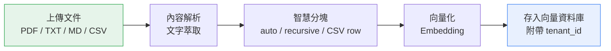

# 核心功能展示

## 一、平台功能全景圖

本平台按使用者角色提供三層功能：

```mermaid
graph TD
    subgraph EndUser["終端使用者（消費者）"]
        EU1["Web Chat 即時對話"]
        EU2["LINE Bot 客服"]
        EU3["嵌入式 Widget"]
        EU4["AI Agent 幫你做事"]
    end

    subgraph TenantAdmin["租戶管理員（客戶企業）"]
        TA1["知識庫管理"]
        TA2["Bot 設定與 Prompt"]
        TA3["對話記錄查看"]
        TA4["LLM 模型選擇"]
        TA5["MCP 工具管理"]
        TA6["Token 用量分析"]
    end

    subgraph SysAdmin["系統管理員（平台營運）"]
        SA1["多租戶管理"]
        SA2["Error Tracking"]
        SA3["診斷規則引擎"]
        SA4["通知管道設定"]
        SA5["全域 Bot 管理"]
        SA6["Rate Limit 管理"]
    end

    style EndUser fill:#e6f4ea,stroke:#34a853
    style TenantAdmin fill:#e8f0fe,stroke:#4285f4
    style SysAdmin fill:#fef7e0,stroke:#fbbc04
```

**規模數據**：26 個前端管理頁面、353 測試檔案、539+ 測試案例、≥80% 程式碼覆蓋率。

---

## 二、AI Agent 決策引擎 — 雙模式

本平台提供兩種 Agent 運作模式，每個 Bot 可獨立設定，管理員在後台即可切換，不需改程式碼。

### 模式比較

| 面向 | Router | ReAct |
|------|--------|-------|
| **決策方式** | 單次意圖分流 | 多輪推理迴圈 |
| **工具使用** | 一次一個 | 可連續呼叫多個（最多 5 次） |
| **MCP 外部工具** | 不支援 | 支援 |
| **適用場景** | 簡單 FAQ | 查庫存、訂預約、比較商品 |
| **LLM 呼叫次數** | 1-2 次 | 2-5 次 |
| **成本** | 最低 | 中等 |

### Router 模式 — 快速低成本

適用簡單一問一答場景。LLM 判斷使用者意圖，選擇對應工具一次執行，快速回覆。成本最低，適合 FAQ 型客服。

### ReAct 模式 — 多步推理 + 工具呼叫

本平台的核心差異化能力。LLM 進行「推理 → 行動 → 觀察」迴圈，可連續呼叫多個工具完成複雜任務。

### 對比 2026/03 業界方案

| 方案 | 架構 | 特色 | 本平台對應 |
|------|------|------|----------|
| OpenAI Swarm | 多 Agent 輕量框架 | 實驗性質，無商用化 | 近期規劃 Multi-Agent |
| LangGraph Teams | 圖結構 Agent 編排 | 本平台底層即採用 LangGraph | ReAct Agent |
| CrewAI | 角色扮演多 Agent | 偏重 crew/role 概念 | 近期規劃 Multi-Agent |
| AutoGen | 對話式多 Agent | 微軟研究院，偏研究 | ReAct 已超越基本對話式 |

---

## 三、MCP 工具生態 — 無限擴展

### MCP 是什麼

MCP（Model Context Protocol）是由 Anthropic 於 2024 年底提出的開放標準，定義了 AI Agent 如何與外部工具和資料源溝通。截至 2026/03，**OpenAI、Google、Microsoft 已全面採納**，成為 AI 工具串接的業界共識。

本平台原生支援 MCP 標準，同時支援 HTTP 和 stdio 兩種傳輸方式。

### 已實作工具（以窩廚房為例）

| MCP Tool | 功能 | 串接方式 | 複雜度 |
|----------|------|---------|--------|
| `query_products` | 查商品（關鍵字、分類、價格、配送方式） | 連接客戶 MySQL | JOIN 3 張表 |
| `query_courses` | 查課程（日期、分類、講師、名額） | 連接客戶 MySQL | JOIN 5 張表 |

### 可擴展方向

| 業務場景 | MCP Tool | AI 能做的事 | 開發週期 |
|---------|---------|-----------|---------|
| 訂單管理 | `query_orders` | 查訂單狀態、物流進度 | 2-3 天 |
| 預約報名 | `create_booking` | 直接報名課程、預約服務 | 3-4 天 |
| 退貨處理 | `create_return` | 引導退貨、查退款進度 | 3-4 天 |
| 會員查詢 | `query_member` | 查點數、優惠券、會員等級 | 2-3 天 |
| 庫存查詢 | `query_inventory` | 即時回覆商品庫存 | 1-2 天 |
| 真人轉接 | `transfer_agent` | 複雜問題自動轉接真人客服 | 2-3 天 |

**關鍵優勢**：每個 MCP Tool 是獨立開發、獨立部署的。新增一個工具不會影響既有功能，風險極低。

---

## 四、多租戶 SaaS

一套系統服務多家客戶，每家客戶擁有完全隔離的環境：

| 隔離維度 | 實作方式 | 安全保障 |
|---------|---------|---------|
| **知識庫** | 每個向量帶 `tenant_id`，搜尋時強制過濾 | 跨租戶查詢技術上不可能 |
| **對話記錄** | PostgreSQL 依 `tenant_id` 分區 | 租戶只看得到自己的對話 |
| **Bot 設定** | 每個 Bot 綁定一個 tenant | Prompt、模型、工具各自獨立 |
| **LLM 模型** | 每個 Bot 可選不同模型 | GPT / Claude / Gemini 自由切換 |
| **API Key** | 每個租戶獨立 Key + 加密存儲 | 互不干擾 |
| **向量資料庫** | Payload filter 強制 tenant 隔離 | 搜尋結果絕不跨租戶 |

**商業價值**：基礎設施成本由所有客戶共攤，客戶數越多每家均攤越低。10 家客戶時，每家基礎設施均攤僅約 $12/月。

---

## 五、知識庫管理

### 文件入庫 Pipeline

| 特性 | 說明 |
|------|------|
| **支援格式** | PDF、TXT、Markdown、CSV |
| **分塊策略** | 自動（auto）、遞迴（recursive）、CSV 行模式 |
| **租戶隔離** | 每個 chunk 帶 `tenant_id`，搜尋時強制過濾 |
| **相似度門檻** | 可調，低品質結果自動過濾 |
| **top-k 設定** | 預設取最相關的 3 筆，可調整 |
| **Chunk 預覽** | Dialog 模式預覽分塊結果 |

---

## 六、多通道觸及

| 通道 | 技術 | 狀態 | 特色 |
|------|------|------|------|
| **Web Chat** | SSE（Server-Sent Events） | ✅ 已完成 | 即時串流回覆，打字機效果 |
| **LINE Bot** | LINE Messaging API Webhook | ✅ 已完成 | 串接 LINE 官方帳號 |
| **嵌入式 Widget** | IIFE bundle（一段 JS） | ✅ 已完成 | 客戶網站貼一段程式碼即可 |

### 跨對話記憶系統

平台內建跨對話記憶能力，即使使用者離開後再回來，AI 仍能記得先前的互動：

- **訪客身份解析**：透過瀏覽器指紋或登入狀態辨識回訪者
- **記憶分類**：偏好記憶（喜歡什麼）+ 事實記憶（之前買過什麼）+ 互動記憶（上次問了什麼）
- **記憶管理**：可查看、編輯、刪除記憶內容

---

## 七、可觀測性

傳統方案最大的痛點之一是「回答不好時，不知道問題出在哪」。本平台提供完整的可觀測性體系：

### Error Tracking + 診斷規則引擎

| 類型 | 數量 | 範例 |
|------|------|------|
| **單一規則** | 10 條 | Token 超量、回應超時、RAG 檢索為空、LLM 錯誤 |
| **組合規則** | 4 條 | 高頻同類錯誤、特定租戶異常集中 |

### 通知管道

| 管道 | 狀態 | 節流機制 |
|------|------|---------|
| Email | ✅ 已完成 | 同一規則 5 分鐘內不重複發送 |
| Slack | ✅ 已完成 | Redis-based 節流 |
| Teams | ✅ 已完成 | Redis-based 節流 |

### RAG 品質評估

| 層次 | 評估內容 | 說明 |
|------|---------|------|
| **L1** | 回答品質 | LLM 回答是否正確、完整 |
| **L2** | 檢索品質 | 向量搜尋是否撈到正確的文件 |
| **L3** | 端到端 | 從使用者提問到最終回覆的整體品質 |

### Token 用量分析

每個租戶、每個 Bot 的 Token 使用量完全追蹤，支援成本分攤計算。

---

## 八、LLM 自由切換

每個 Bot 可獨立設定使用的 LLM 模型，管理員在後台即可切換：

| 廠商 | 可用模型 | 適用場景 |
|------|---------|---------|
| **OpenAI** | GPT-5 mini / GPT-5 nano | 主力推理 / 低成本分類 |
| **Anthropic** | Claude Sonnet 4.6 / Claude Haiku 4.5 | 高品質回答 / 中等成本 |
| **Google** | Gemini 3 Flash / Gemini 2.5 Flash | 超長 context / 高性價比 |

**DDD 架構優勢**：LLM 切換只需改 Infrastructure 層的 Provider 設定，業務邏輯零修改。今天用 GPT，明天想換 Claude 或 Gemini，改一個設定就好。

---

## 九、功能對比矩陣

| 功能維度 | 傳統 RAG 方案 | 本平台 |
|---------|-------------|-------|
| RAG 問答 | ✅ 基本 | ✅ 進階（含相似度門檻、top-k 調整） |
| AI Agent 模式 | Router 或無 | ✅ Router + ReAct |
| MCP 工具串接 | ❌ | ✅ 原生支援 HTTP + stdio |
| 多租戶隔離 | ❌ 或有限 | ✅ 6 維度完整隔離 |
| LLM 自由切換 | ❌ 或有限 | ✅ 3 廠商 6+ 模型 |
| 跨對話記憶 | ❌ | ✅ 訪客辨識 + 記憶分類 |
| Error Tracking | ❌ | ✅ 14 條診斷規則 |
| 通知告警 | ❌ | ✅ Email / Slack / Teams |
| RAG 品質評估 | ❌ | ✅ L1 / L2 / L3 三層次 |
| Token 用量追蹤 | ❌ | ✅ 租戶 + Bot 雙維度 |
| 嵌入式 Widget | 有 | ✅ IIFE bundle |
| LINE Bot | 需額外付費 | ✅ 內建 |
| Multi-Agent 協作 | ❌ | 近期規劃（架構已預留） |

