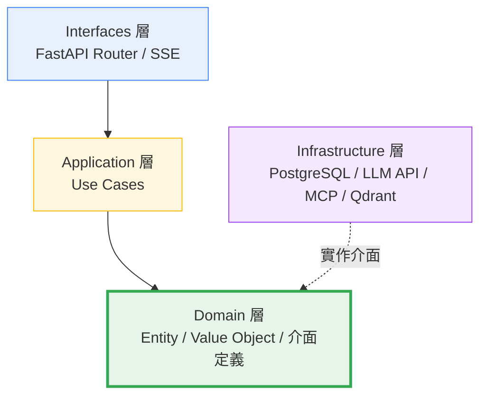
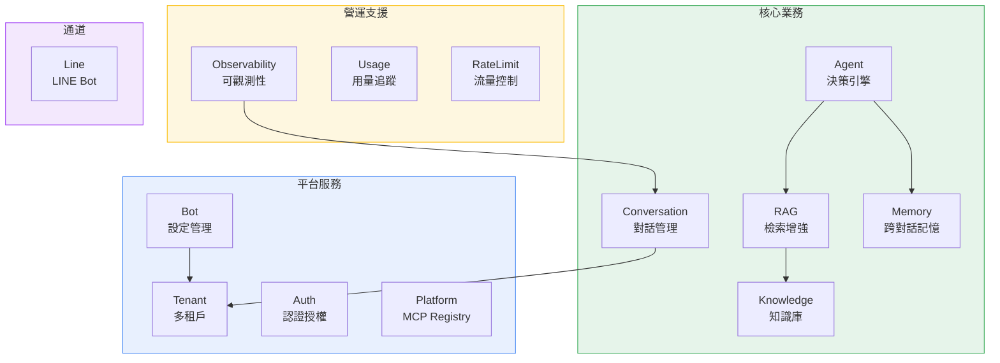
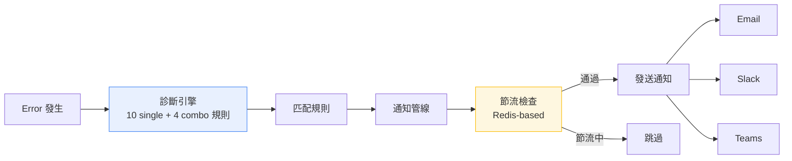
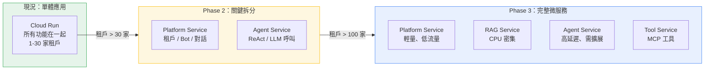

# 平台架構與技術優勢

## 一、架構設計理念

本平台的架構圍繞四個核心目標設計：

| 目標 | 設計決策 | 白話說明 |
|------|---------|---------|
| **多租戶** | 原生租戶隔離，一套系統服務多家客戶 | 基礎設施共攤，客戶越多越划算 |
| **LLM 無鎖定** | Port/Adapter 抽象層，隔離 LLM 實作 | 今天用 GPT，明天換 Claude，改設定就好 |
| **可擴展** | DDD Bounded Context + MCP 工具標準 | 加功能不用改核心，加工具不用重寫 |
| **安全合規** | JWT + 加密 + CORS + Prompt Injection 防護 | 租戶間資料完全隔離，AI 不會被使用者誘導 |

---

## 二、DDD 四層架構

系統採用 **DDD（Domain-Driven Design）四層架構**，嚴格遵守由外向內的依賴方向：

### 分層說明

| 層級 | 職責 | 範例 | 依賴規則 |
|------|------|------|---------|
| **Interfaces 層** | HTTP API 端點，接收請求、回傳結果 | FastAPI Router、SSE 串流 | 依賴 Application |
| **Application 層** | 業務流程編排，協調各 Domain 物件 | SendMessageUseCase | 依賴 Domain |
| **Domain 層** | 核心業務邏輯，不依賴任何外部技術 | Entity、Value Object | **不依賴任何外層** |
| **Infrastructure 層** | 技術實作，連接外部系統 | DB Repository、LLM Client、MCP Client | 實作 Domain 介面 |

### 給管理層的白話版

| 好處 | 白話說明 |
|------|---------|
| **模型不綁死** | 今天用 GPT，明天想換 Claude 或 Gemini，改一個設定就好，不用改業務程式 |
| **測試容易** | 核心邏輯可以不連資料庫、不連 AI 模型就跑測試，品質有保障 |
| **新功能快** | 要加「查訂單」功能，只需加一個 Tool，不用改整個系統 |
| **維護安全** | 每一層職責清楚，改 A 不會壞 B，新工程師也能快速上手 |
| **微服務就緒** | 未來要拆成獨立服務，不需重寫，直接搬 |

---

## 三、技術棧

### 後端

| 類別 | 技術 | 用途 |
|------|------|------|
| 語言 | Python 3.12 | 主力開發語言 |
| Web 框架 | FastAPI | 高效能非同步 API + SSE 串流 |
| AI 編排 | LangGraph | Agent 流程編排（ReAct 推理迴圈） |
| 向量搜尋 | Cloud SQL pgvector | 知識庫語意搜尋（與 PostgreSQL 同 instance） |
| 資料庫 | PostgreSQL 16 | 租戶、Bot、對話等結構化資料 |
| 快取 | Redis | Rate Limit、Session 快取、通知節流 |
| DI 容器 | dependency-injector | 依賴注入，方便測試和替換元件 |

### 前端

| 類別 | 技術 | 用途 |
|------|------|------|
| 框架 | React + Vite SPA | 單頁應用，快速載入 |
| UI 元件 | shadcn/ui + Tailwind CSS | 現代化介面設計 |
| 狀態管理 | Zustand + TanStack Query | 客戶端 + 伺服器狀態分離 |
| 即時通訊 | SSE（Server-Sent Events） | AI 回答串流輸出 |
| 表單驗證 | Zod | 型別安全的前端驗證 |

### 部署

| 服務 | 平台 | 說明 |
|------|------|------|
| 後端 | GCP Cloud Run | 無伺服器，按需計費，自動擴縮 |
| 前端 | Firebase Hosting + CDN | 純靜態檔託管，含 CDN |
| 資料庫 | Cloud SQL for PostgreSQL | 託管式 PostgreSQL + pgvector |
| 快取 | Memorystore Redis | 託管式 Redis |

---

## 四、業務模組（Bounded Contexts）

系統按業務領域劃分為 13 個模組，每個模組的邊界清楚定義：

| 模組 | 職責 | 核心功能 |
|------|------|---------|
| **Tenant** | 多租戶管理 | 租戶建立、API Key 管理、用量追蹤 |
| **Knowledge** | 知識庫管理 | 文件上傳 → 解析 → 分塊 → 向量化 |
| **RAG** | 檢索增強生成 | 語意搜尋 → Prompt 組裝 → LLM 回答 |
| **Conversation** | 對話管理 | 對話記錄、Session 管理 |
| **Agent** | 智慧決策引擎 | Router / ReAct 雙模式 |
| **Bot** | Bot 設定管理 | Prompt、模型選擇、Agent 模式切換 |
| **Memory** | 跨對話記憶 | 訪客辨識、記憶分類與管理 |
| **Observability** | 可觀測性 | Error Tracking、診斷規則、通知 |
| **Platform** | 平台設定 | MCP Registry、Provider 設定 |
| **Auth** | 認證授權 | JWT、使用者管理、權限控制 |
| **Line** | LINE 通道 | LINE Bot Webhook 整合 |
| **Usage** | 用量追蹤 | Token 消耗統計、成本分析 |
| **RateLimit** | 流量控制 | API 呼叫頻率限制 |

---

## 五、安全與租戶隔離

### 隔離機制

| 資源 | 隔離方式 | 安全保障 |
|------|---------|---------|
| 知識庫向量 | `tenant_id` payload filter | 搜尋時強制過濾，跨租戶查詢不可能 |
| 對話記錄 | `tenant_id` 欄位 | 資料庫查詢強制帶 tenant 條件 |
| Bot 設定 | 每個 Bot 綁定一個 tenant | Prompt、模型、工具各自獨立 |
| API Key | 每個租戶獨立 + 加密存儲 | AES-256 加密，解密只在使用時 |
| LLM 呼叫 | 每次呼叫帶 tenant context | 互不干擾 |

### 安全防護

| 防護層 | 機制 | 說明 |
|--------|------|------|
| **認證** | JWT Token | 簽名 + 過期 + Issuer 完整驗證 |
| **授權** | Role-Based Access Control | 系統管理員 / 租戶管理員 / 一般使用者 |
| **加密** | AES-256 | API Key 等敏感資料加密存儲 |
| **CORS** | 白名單模式 | 正式環境禁止 `allow_origins=["*"]` |
| **Prompt Injection** | 輸入消毒 + Role 分離 | 使用者輸入不直接拼入 System Prompt |
| **SQL Injection** | SQLAlchemy ORM | 參數綁定，禁止字串拼接 SQL |
| **Rate Limiting** | Redis-based | 防止 API 濫用 |

---

## 六、可觀測性架構

診斷引擎會自動分析錯誤模式，判斷是 RAG 檢索問題、Prompt 問題、還是 LLM 幻覺，讓維運人員能快速定位根因。

---

## 七、跨對話記憶系統

| 功能 | 說明 |
|------|------|
| **訪客身份解析** | 瀏覽器指紋 / 登入狀態，辨識回訪使用者 |
| **記憶分類** | 偏好記憶（喜好）+ 事實記憶（歷史行為）+ 互動記憶（對話摘要） |
| **記憶管理** | 管理員可查看、編輯、刪除記憶內容 |
| **隱私保護** | 記憶資料遵循租戶隔離，跨租戶不互通 |

---

## 八、工程方法論 — DDD + BDD + TDD

### 方法論組合

| 方法論 | 全稱 | 作用 | 白話說明 |
|--------|------|------|---------|
| **DDD** | Domain-Driven Design | 架構設計 | 按業務領域切分模組，職責清楚，未來可獨立拆分 |
| **BDD** | Behavior-Driven Development | 需求規格化 | 先用自然語言寫「系統應該怎麼表現」，再開發 |
| **TDD** | Test-Driven Development | 品質保障 | 先寫測試、再寫程式，確保每個功能都有測試保護 |

### 品質數據

| 指標 | 數值 |
|------|------|
| **測試檔案** | 353 檔（後端 315 + 前端 38） |
| **BDD 測試案例** | 539+ 個 Scenario |
| **程式碼覆蓋率** | ≥ 80% |
| **測試類型** | 單元測試 + BDD 行為測試 + E2E 整合測試 |
| **自動化** | 全部自動化，`make test` 一行指令跑完 |

### AI 輔助全棧開發

本系統從架構設計到程式實作，全程以 AI 輔助開發（Claude Code），一人完成前後端全棧開發。

| 優勢 | 說明 |
|------|------|
| **開發效率極高** | 傳統 3-5 人的全棧專案，一人即可交付 |
| **開發成本大幅降低** | 人力成本是軟體專案最大開支，AI 輔助壓縮 60-80% |
| **迭代速度快** | 新功能從設計到上線，週期以天計而非月計 |
| **品質有保障** | 全程遵守 DDD + BDD + TDD 方法論，不是「AI 亂寫」 |

---

## 九、微服務就緒

### 現況：Monolith → 未來可拆分

DDD 的 Bounded Context 設計讓系統未來可以**零重寫**拆分為獨立微服務。

### 擴展里程碑

| 階段 | 租戶數 | 月對話量 | 架構 | 月基礎設施成本 |
|------|-------|---------|------|-------------|
| Phase 1 起步 | 1-10 家 | ≤ 30K | 單體 Cloud Run | ~$93-120/月 |
| Phase 2 成長 | 10-30 家 | 30K-100K | 單體 + HA | ~$150-300/月 |
| Phase 3 規模化 | 30-100 家 | 100K-500K | 微服務（GKE） | ~$500-1,500/月 |
| Phase 4 企業級 | 100+ 家 | 500K+ | 微服務 + 訊息佇列 | ~$2,000+/月 |

**關鍵訊息**：從 Phase 1 到 Phase 3 不需要重寫程式碼，只需要將現有模組搬到獨立容器。這是 DDD 架構的核心價值。

