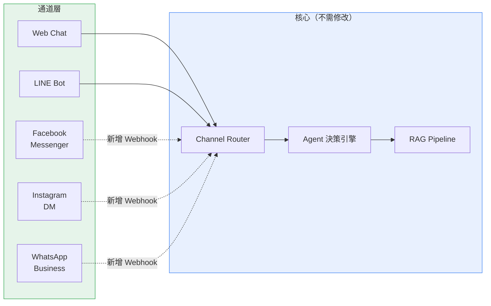
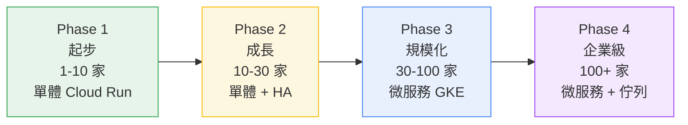
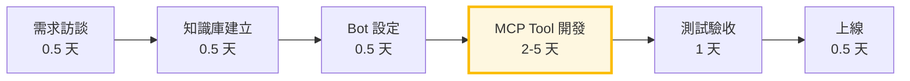

# 擴充性與發展藍圖

## 一、已完成功能盤點

在討論未來之前，先盤點目前平台已經具備的能力。以下是從 codebase 實際盤點的結果：

### 核心功能

| 功能 | 狀態 | 說明 |
|------|------|------|
| RAG 知識庫問答 | ✅ 已完成 | 上傳文件 → 分塊 → 向量化 → 語意搜尋 → AI 回答 |
| Agent 決策引擎 — Router | ✅ 已完成 | 意圖分流，快速低成本 |
| Agent 決策引擎 — ReAct | ✅ 已完成 | 多步推理 + MCP 工具呼叫 |
| MCP 工具整合 | ✅ 已完成 | HTTP + stdio 雙傳輸，已實作 query_products、query_courses |
| 多租戶隔離 | ✅ 已完成 | 6 維度完整隔離（知識庫/對話/Bot/LLM/API Key/向量） |
| LLM 自由切換 | ✅ 已完成 | OpenAI / Anthropic / Google — per-Bot 獨立設定 |
| 跨對話記憶系統 | ✅ 已完成 | 訪客辨識 + 記憶分類 + 記憶管理 |

### 通道與介面

| 功能 | 狀態 | 說明 |
|------|------|------|
| Web Chat（SSE 串流） | ✅ 已完成 | 即時串流回覆，打字機效果 |
| LINE Bot | ✅ 已完成 | LINE 官方帳號 Webhook 整合 |
| 嵌入式 Widget | ✅ 已完成 | IIFE bundle，貼一段 JS 即可嵌入 |
| 管理後台 | ✅ 已完成 | 26 個前端管理頁面 |

### 營運支援

| 功能 | 狀態 | 說明 |
|------|------|------|
| Error Tracking | ✅ 已完成 | 錯誤事件追蹤與分析 |
| 診斷規則引擎 | ✅ 已完成 | 10 條單一規則 + 4 條組合規則 |
| 通知管道 | ✅ 已完成 | Email / Slack / Teams + Redis 節流 |
| Token 用量分析 | ✅ 已完成 | 租戶 + Bot 雙維度追蹤 |
| Feedback 系統 | ✅ 已完成 | 使用者滿意度追蹤（👍/👎） |
| Rate Limiting | ✅ 已完成 | Redis-based API 頻率限制 |
| MCP Registry 管理 | ✅ 已完成 | 前端管理頁面，視覺化工具管理 |
| Log Retention 設定 | ✅ 已完成 | 日誌保留策略管理 |

### 工程品質

| 指標 | 數值 |
|------|------|
| 前端頁面 | 26 個 |
| 測試檔案 | 353 檔（後端 315 + 前端 38） |
| BDD 測試案例 | 539+ 個 Scenario |
| 程式碼覆蓋率 | ≥ 80% |
| Bounded Context | 13 個業務模組 |

> **完成度評估**：核心平台功能已完成 85%+，剩餘工作集中在「讓它更好」（進階 RAG 優化）和「觸及更多」（新通道 + 新工具），不需要重新開發。

---

## 二、近期 — 進階 RAG 優化

現有 RAG pipeline 已能穩定運作，以下是下一階段的品質優化方向：

| 功能 | 說明 | 效果 | 開發週期 |
|------|------|------|---------|
| **Hybrid Search** | 向量語意搜尋 + 關鍵字搜尋結合 | 解決純語意搜尋漏掉精確匹配的問題（如產品編號、專有名詞） | 1 週 |
| **Query Rewriting** | AI 自動改寫使用者問題再搜尋 | 模糊提問也能找到對的資料 | 3-5 天 |
| **Retrieval Grading** | AI 評估檢索結果是否真的相關 | 過濾低品質檢索結果，減少「答非所問」 | 3-5 天 |
| **Adaptive Retrieval** | 根據問題類型動態調整搜尋策略 | 簡單問題少搜、複雜問題多搜，平衡品質和速度 | 1 週 |

**關鍵優勢**：這些優化是在現有 RAG pipeline 上**疊加**，不需要重新開發。DDD 架構讓每個優化都是 Infrastructure 層的增強，不影響上層業務邏輯。

---

## 三、新通道擴展

### 規劃通道

| 通道 | 適用場景 | 技術方案 | 預估工時 |
|------|---------|---------|---------|
| **Facebook Messenger** | 有 FB 粉絲頁的商家 | Meta Webhook，類似 LINE | 1-2 週 |
| **Instagram DM** | 年輕客群、視覺導向品牌 | Meta Graph API | 1-2 週 |
| **WhatsApp Business** | 國際客戶 | WhatsApp Cloud API | 1-2 週 |

### 架構優勢

系統已有 Channel Router 設計（Web + LINE），新增通道只需加一個 Webhook 入口，核心 Agent 邏輯完全不用改。

---

## 四、未來規劃 — 多 Agent 協作

當單一 ReAct Agent 無法滿足跨領域複雜任務時，下一步是引入 Supervisor 模式（Meta Agent + Worker Agent）：

| Worker Agent | 職責 | 專用工具 |
|-------------|------|---------|
| **商品專員** | 商品查詢、比價、推薦 | query_products、query_inventory |
| **訂單專員** | 訂單查詢、退換貨處理 | query_orders、create_return |
| **課程專員** | 課程查詢、預約報名 | query_courses、create_booking |
| **客訴專員** | 客訴受理、升級處理、真人轉接 | create_ticket、transfer_agent |

LangGraph 原生支援 Multi-Agent 編排，架構已預留擴展點，實作時不需改動 ReAct 既有邏輯。

### 業界趨勢

| 方案 | 特色 | 說明 |
|------|------|------|
| OpenAI Swarm | 多 Agent 輕量框架 | 實驗性質，尚未商用化 |
| LangGraph Teams | 圖結構 Agent 編排 | 本平台底層即採用 LangGraph，可直接升級 |
| CrewAI | 角色扮演多 Agent | 偏重 crew/role 概念 |

---

## 五、MCP 生態擴展

### 已實作

| MCP Tool | 功能 | 客戶 |
|----------|------|------|
| `query_products` | 商品查詢 | 窩廚房 |
| `query_courses` | 課程查詢 | 窩廚房 |

### 未來可擴展

| 業務場景 | MCP Tool | AI 能做的事 | 開發週期 |
|---------|---------|-----------|---------|
| 訂單管理 | `query_orders` | 查訂單狀態、物流進度 | 2-3 天 |
| 預約報名 | `create_booking` | 直接報名課程、預約服務 | 3-4 天 |
| 退貨處理 | `create_return` | 引導退貨、查退款進度 | 3-4 天 |
| 會員查詢 | `query_member` | 查點數、優惠券、會員等級 | 2-3 天 |
| 庫存查詢 | `query_inventory` | 即時回覆商品庫存 | 1-2 天 |
| 真人轉接 | `transfer_agent` | 複雜問題自動轉接真人客服 | 2-3 天 |
| 物流追蹤 | `track_shipment` | 查快遞狀態、預估到貨時間 | 2-3 天 |

**核心優勢**：

- **獨立開發** — 每個 Tool 是獨立的 MCP Server，不影響既有功能
- **跨客戶複用** — 同產業客戶的 Tool 可直接複用（如電商類的 query_products）
- **MCP 生態持續擴大** — OpenAI、Google、Microsoft 已全面採納，第三方 MCP Server 越來越多，未來可直接接入
- **風險極低** — 新增一個 Tool 出問題，只影響該 Tool，核心平台不受影響

---

## 六、平台規模化路徑

| 階段 | 租戶數 | 架構 | 月成本 | 觸發條件 |
|------|-------|------|--------|---------|
| Phase 1 | 1-10 家 | 單體 Cloud Run | ~$93-120 | — |
| Phase 2 | 10-30 家 | 單體 + HA | ~$150-300 | 付費客戶需 SLA |
| Phase 3 | 30-100 家 | 微服務（GKE） | ~$500-1,500 | Cloud Run 資源不足 |
| Phase 4 | 100+ 家 | 微服務 + 訊息佇列 | ~$2,000+ | 跨區域 + 異步需求 |

**DDD = 零重寫微服務拆分**：從 Phase 1 到 Phase 3 不需重寫程式碼，只需將 Bounded Context 搬到獨立容器。

---

## 七、新客戶上線流程

### 各步驟工時

| 步驟 | 工作內容 | 預估工時 | 備註 |
|------|---------|---------|------|
| 需求訪談 | 了解客戶業務、確認 AI 客服範圍 | 0.5 天 | |
| 知識庫建立 | 客戶提供文件，上傳至平台 | 0.5 天 | 客戶配合提供文件 |
| Bot 設定 | System Prompt、LLM 模型、Agent 模式 | 0.5 天 | 平台後台操作 |
| **MCP Tool 開發** | **串接客戶業務 API** | **2-5 天** | **主要工時**，依系統複雜度 |
| 測試驗收 | Demo 情境測試、Prompt 調整 | 1 天 | |
| 上線 | 客戶嵌入 Web Bot / 設定 LINE | 0.5 天 | 客戶配合 |
| **合計** | | **5-8 天** | 一位工程師 |

### MCP Tool 開發複雜度

| 複雜度 | 範例 | 工時 |
|--------|------|------|
| 簡單（1-2 張表） | 商品查詢 | 2 天 |
| 中等（3-5 張表） | 課程查詢（含名額計算） | 3-4 天 |
| 複雜（多系統 + 寫入） | 訂單建立 + 庫存扣減 | 5+ 天 |

### 同產業 Tool 複用

如果多家客戶是類似產業（如電商），MCP Tool 可以複用。例如窩廚房的 `query_products` 稍作調整就能用於其他電商客戶，上線時間可縮短至 **3-5 天**。

